# Constitución Arquitectónica — Plataforma Comercial de Nexus

## Bounded Context inicial: Prospección Inteligente

> **Versión:** `1.1.0` (v1.0.1 + cierre formal F2 en producción 2026-06-29)
> **Estado:** **F0 ✅ EN PROD (db4fefb) · F1 ✅ EN PROD (db4fefb) · F2 ✅ EN PROD (b1ea521, 2026-06-29) — E2E validado, exportación Clientify operativa, `prospeccion_export_log` con trazabilidad completa. F3 = BACKLOG (ver `docs/prospeccion/F3-MEJORAS-FUTURAS.md`).**
> **Trayectoria:** ARB 7.44/10 → correcciones C-1..C-6 → F0-PRE Blueprint Reconciliation (5 críticos + 7 PARCIAL) → Blueprint Build System (BB-1..7) → Consistency Index **96.4/100 (GO)** → **DDL Validation Pre-G5 PASS** → **v1.0 cerrada**.
> **Autoridad:** Martín Battaglia (Presidencia · Logística TOPS / VEROTIN S.A.)
> **Fecha:** 2026-06-25
> **Gobierno:** subordinado al Documento Rector [TOPS-NEXUS-ERP.md](../../TOPS-NEXUS-ERP.md) y a los gates de gobernanza de Nexus (G1–G11).
> **Vigencia:** 10 años, con revisión anual obligatoria.

---

## Portada

| Campo | Valor |
|---|---|
| **Título** | Constitución Arquitectónica — Plataforma Comercial de Nexus |
| **Subtítulo** | Bounded Context inicial: Prospección Inteligente (`prospeccion`) |
| **Versión** | **1.1.0** (F2 CERRADA EN PRODUCCIÓN 2026-06-29) |
| **Estado** | **F0 ✅ · F1 ✅ · F2 ✅ EN PRODUCCIÓN** — commit `b1ea521`, E2E validado, `prospeccion_export_log` trazabilidad completa. F3 = BACKLOG. |
| **ARB Date** | 2026-06-25 \| ARB 7.44 → F0-PRE → Consistency 96.4 (GO) → **DDL Validation PASS → v1.0 cerrada** |
| **Autoridad** | Martín Battaglia |
| **Fecha** | 2026-06-25 |
| **Alcance** | Plataforma Comercial de Nexus; primer contexto acotado: Prospección Inteligente |
| **Naturaleza** | Documento normativo (DEBE / NO DEBE / PROHIBIDO). Las reglas numeradas (R-x.y, INV-PR-n, AP-n, ADR-NNN, NFB-n) son vinculantes y citables. |

---

## ✅ Architecture Review Board — 2026-06-25

**Veredicto final:** **GO ratificado + DDL validado (Pre-G5)** — Architecture Consistency Index **96.4/100** (≥95), 7/7 condiciones, 18/18 relaciones CONSISTENTE, linter 26/26, y **DDL Validation Report PASS** (motor Postgres real). Trayectoria: ARB CONDITIONALLY APPROVED (7.44/10) → correcciones C-1..C-6 → F0-PRE Blueprint Reconciliation (5 críticos + 7 PARCIAL) → Blueprint Build System (BB-1..7) → Consistency Index 96.4 (GO) → **DDL Validation PASS → Blueprint v1.0 CERRADO, F0 HABILITADO**. Pendiente solo la autorización de inicio formal de F0 por Dirección.

**Score original del ARB (referencia histórica):** 7.44/10 → est. 8.6/10 post-correcciones C-1..C-6.

| Dimensión | Original | Post-correcciones |
|---|:---:|:---:|
| Strategic Design (DDD, Context Map) | 8.5 | 8.5 |
| Domain Model (AR, invariantes, VOs) | 7.5 | 7.5 |
| Technical Architecture (Hexagonal, Outbox) | 8.0 | 8.0 |
| Persistence (DDL, RLS, idempotencia) | 7.0 | **8.0** ↑ C-2, C-3 |
| Security & Privacy | 6.5 | **8.5** ↑ C-1 |
| Operational Quality | 7.5 | 7.5 |
| Integration Correctness | 7.0 | **8.0** ↑ C-3 |
| Governance & Maintainability | 7.0 | **8.5** ↑ C-4, C-6 |
| Product Viability | 6.5 | 6.5 |
| **TOTAL** | **7.44** | **est. 8.6** |

**Correcciones C-1..C-4, C-6 incorporadas (ARB inicial):**
- **C-1** Privacy by Design — §5 en security rules (fuentes, retención, borrado PII, Ley 25.326, RAT, INV-PR-8)
- **C-2** Índices DDL — índices operativos en migración 0089 (Outbox + prospects + crm_refs)
- **C-3** Provider Agnostic — `clientify_contact_id/deal_id` → `prospeccion_crm_refs` (F0); CC-6
- **C-4** CS-RPC-1 — cada mutación del AR = RPC SECURITY DEFINER en Postgres
- **C-6** CS-BOUNDARY-1 + DoD-11 — enforcement técnico eslint-plugin-boundaries

**F0-PRE — Blueprint Reconciliation + Build System (2026-06-25):** (1) los **5 hallazgos CRÍTICOS** del ARB expandido quedaron resueltos (CONS-C1 migración 0089 compila · CONS-C2 sin clientify IDs en ER/Row type · ROAD-001 fases DDL↔roadmap alineadas · ARCH-001 `nextId()` fuera del repo · ARCH-002 RPC mecánica sin lógica de negocio), registrados como **ADR-015..ADR-019**. (2) Se estableció el **Blueprint Build System** (cap. `07`, reglas BB-1..BB-7 + tooling `tools/`): los `_parts/` son la **única fuente de verdad** y el consolidado es un **artefacto generado** (AP-17); build + linter (26/26) + CI determinístico. (3) **Blueprint Consistency Report 2026-06-25:** 18/18 relaciones CONSISTENTE, **Architecture Consistency Index 96.4/100**, 7/7 condiciones GO → **dictamen GO**.

**Correcciones diferidas (pre-condición de fase, no de aprobación):**
C-5 ReactivateProspect (F1) · C-7 CRON_SECRET rotation (F2) · C-8 Outbox lag monitor (F2) · C-9 UL Español/Inglés table → **CERRADA** por CC-7 (correspondencia canónica de estados).

**Validación técnica Pre-G5 (2026-06-25):** ✅ **DDL Validation Report — PASS.** Las migraciones `0088`/`0089`/`0091` se compilaron y ejecutaron contra un **motor Postgres real efímero** (PGLite WASM, PG 17.5; sin prod, sin costo, sin deploy): 4/4 fases · 20/20 checks · 0 errores · 0 warnings · rollback espejo limpio · smoke-test del RPC end-to-end OK. **Cierra la deuda "compile real del DDL pre-G5".**

**Deuda diferida restante (no bloqueante, no contradicción):** columna de lane EVT-5 (F2/F4); anotación inline CC-2 en labels Mermaid; **apply real a prod = G3 (a mano por Martín).**

**Próximo gate:** **autorización de inicio formal de F0 por Dirección.** El Blueprint v1.0 está CERRADO y F0 HABILITADO; nada se construye hasta el "go" explícito de inicio.

---

## Nota de gobernanza (LEER ANTES QUE NADA)

Este documento es la **referencia arquitectónica oficial** de la Plataforma Comercial de Nexus y de su primer bounded context, Prospección Inteligente. Fija principios, contratos, esquema y reglas de evolución. **No es una autorización de ejecución.**

**Mientras este documento no esté aprobado personalmente por la Dirección (Martín Battaglia):**

- **NADA se implementa.** Al 2026-06-25 el directorio `src/lib/prospeccion` está **vacío**; toda ruta `prospeccion/*` es **objetivo de diseño**, no estado actual.
- **NADA se commitea ni se deploya** a `main` ni a producción (gate **G1**).
- **NINGUNA migración se aplica** (gate **G3**): las migraciones `0088` (enum de módulo), `0089` (núcleo F0) y `0091` (rollback) se entregan **numeradas, idempotentes y revisables**, pero **las aplica Martín a mano** en el SQL Editor de prod (`arsksytgdnzukbmfgkju`, gate **G4**). El asistente prepara y muestra; **no** ejecuta escrituras. `supabase db push` está **PROHIBIDO**.
- **NINGUNA fase del roadmap (F0→F7) arranca** sin superar su **Definition of Done** (Parte V, Cap. 5) y la **Regla de Decisión** del Rector (R-1.5), bajo aprobación previa (gate **G7**: plan → aprobación → build).

Ante conflicto entre esta Constitución y el núcleo de gobernanza de Nexus (`GOVERNANCE.md`, G1–G11), **gana el núcleo**. Esta Constitución ejerce la autoridad técnica (Architecture Governance) **dentro** del marco que la Dirección fija para todo Nexus.

> **No-fantasy.** Este documento describe arquitectura **prescrita**, no construida. Las citas `file:line` a otros módulos del repo (`clientify/`, `compliance/sync/`, `arca/`, `comercial/`, migraciones `crm_*`, workflows de GitHub Actions) son **precedentes idiomáticos reales y verificados** que esta Constitución eleva a norma. Lo que existe hoy son las **reglas** bajo las cuales el código **DEBE** nacer.

---

## Cómo leer este documento

Esta Constitución sirve, en orden de uso, a:

- **Arquitectos y CTO** — para fijar y defender los límites del sistema: Context Map, hexágono, modelo canónico, zonas de evolución. Empezar por las Partes I, VII y VI.
- **Desarrolladores** — para saber dónde vive cada cosa y qué contrato cumplir: dominio táctico (Parte II), arquitectura técnica y Managers (Parte III), persistencia/DDL/DTO/RPC/RLS (Persistencia), coding standards (Parte VI, Cap. 2).
- **Líderes técnicos / reviewers** — para gobernar el merge: principios AP-n, ADRs, Architecture Review con hard-stops y Non-Functional Budgets (Parte VI), Quality Attributes, Riesgos y DoD (Partes IV–V).
- **Futuros equipos (horizonte 10 años)** — para entender qué permanece estable y qué es intercambiable, y por qué se decidió cada cosa: Evolution Strategy (Parte VII §7), Evolución a 5 años (Parte VI, Cap. 7) y los ADRs.

**Convenciones normativas** (válidas en todo el documento):

- **DEBE / OBLIGATORIO** — requisito de cumplimiento estricto; una implementación que lo viole **no es conforme**.
- **NO DEBE / PROHIBIDO** — acción vedada sin excepción dentro del alcance de esta Constitución.
- **PUEDE / OPCIONAL** — facultad permitida, nunca obligatoria.
- **Identificadores citables** — `R-x.y` (reglas estratégicas/EA, Partes I y VII), `INV-PR-n` (invariantes del agregado, Parte II), `AP-n` (principios arquitectónicos, Parte VI), `ADR-NNN` (decisiones registradas, Parte IV), `NFB-n` (presupuestos no-funcionales, Parte VI). Una Parte cita reglas de otra por su identificador; nunca las redefine.

---

## Executive Summary

**Qué es.** La **Plataforma Comercial de Nexus** es la capa de **adquisición y calificación de demanda** del ERP vertical único de Logística TOPS. Su primer bounded context, **Prospección Inteligente** (`prospeccion`), cubre todo el ciclo *aguas arriba* del CRM: **importa** prospectos (LinkedIn / CSV / manual), los **enriquece** con datos de la web y de IA, los **scorea** contra el perfil de cliente ideal (ICP), genera **inteligencia comercial** asistida por IA, **deduplica**, y **sincroniza al CRM solo tras aprobación humana**, cerrando el loop al **crear el Cliente del ERP** en la tabla canónica `clients`.

**Principio rector — "NADA va directo al CRM".** Ningún prospecto alcanza el CRM externo (Clientify hoy) sin atravesar, en orden, las etapas de Prospección y sin **aprobación humana explícita**: **LinkedIn → Nexus → Clientify**. La prospección vive en una **zona de staging propia** (`prospeccion_*`); la salida al CRM tiene un **único punto gobernado y logueado** (append-only). El gate humano no es un detalle de UI: es un **límite de confianza** que ninguna automatización ni IA puede sintetizar.

**Cómo está construida.** Cuatro paradigmas combinados:

- **DDD** — clasificación de subdominios (Prospección es **CORE**); modelado táctico con un único Aggregate Root `Prospect`, Value Objects válidos por construcción, 9 Domain Events + `*.failed`, y una máquina de estados explícita con 6 invariantes duras (INV-PR-1…6).
- **Hexagonal / Clean** — dominio **puro y soberano** (cero infraestructura); todo lo externo entra por **Ports** detrás de **ACLs**; la Regla de Dependencia apunta siempre hacia adentro.
- **Event-Driven** — transporte por **Transactional Outbox sobre Postgres** + Dispatcher por cron, con idempotencia, retry/backoff por `transient`, orden por agregado, replay y Dead Letter (sin broker externo).
- **Provider-agnostic** — IA, Enrichment y CRM se acceden por **Managers** intercambiables por configuración; **ningún proveedor concreto es canónico**. El modelo canónico es de Nexus; los externos se adaptan a Nexus, nunca al revés.

**Visión a 10 años.** La Constitución se diseña para que el **dominio perdure** y los **detalles cambien en la periferia**: cambiar de proveedor de IA/enrichment, o reemplazar Clientify por un **CRM nativo de Nexus**, **DEBE** ser un cambio de adapter/port sin reescribir el dominio. Lo estable (dominio, invariante de no-bypass, hexágono, eventos como contrato, Postgres como verdad única) se protege como **Stable Core**; lo intercambiable (proveedores, prompts, heurísticas) vive en la **Experimental Zone** y se mueve por ADR.

**Por qué importa (Regla de Decisión).** Prospección Inteligente alimenta de **clientes calificados** al ERP único: el cliente entra por Nexus, queda disponible para Órdenes → Facturación → Tesorería sin re-tipeo, y aleja a la organización de Neuralsoft y de las herramientas dispersas.

---

## Índice navegable (Table of Contents)

> Orden de lectura recomendado: de la estrategia a la ejecución. Cada entrada enlaza al capítulo correspondiente bajo `docs/prospeccion/_parts/`.

### Parte I — Diseño Estratégico (DDD) · [`10-parte-I-estrategico.md`](./10-parte-I-estrategico.md)
1. Resumen ejecutivo y visión de Plataforma Comercial — principio "nada va directo al CRM", visión a 10 años, cierre de loop sobre `clients`, Regla de Decisión.
2. Strategic Domain Design — clasificación de subdominios CORE / SUPPORTING / GENERIC.
3. Context Map de Bounded Contexts — ACL, Customer/Supplier, Conformist, Open Host Service, Published Language.
4. C4 — Context Diagram (Nivel 1).

### Event Storming — El flujo completo del negocio · [`15-event-storming.md`](./15-event-storming.md)
- Leyenda y método · Big-picture (Command → Aggregate → Event → Policy) · Flujo end-to-end (9 eventos + caminos de error/duplicado/rechazo) · Máquina de estados comercial ÚNICA (Prospección ↔ CRM) · Managers provider-agnostic · Diagrama Commands→Events→Policies · Resumen normativo.

### Parte II — Modelo de Dominio (DDD táctico) + base Hexagonal · [`20-parte-II-dominio.md`](./20-parte-II-dominio.md)
1. Tactical DDD — Aggregate Root `Prospect`, Entities, Value Objects, invariantes INV-PR-1…6.
2. Eventos, Servicios, Casos de Uso, Repositorios, Factories, ACL.
3. Arquitectura Hexagonal / Clean — 5 capas y Regla de Dependencia.
4. Catálogo de Ports (driving / driven).

### Parte III — Arquitectura Técnica (construida alrededor del dominio) · [`30-parte-III-tecnica.md`](./30-parte-III-tecnica.md)
1. Modelo C4 — Container y Component.
2. Backbone Event-Driven — Outbox + Event Bus interno (idempotencia, retry, backoff, orden, replay, Dead Letter).
3. AI Provider Manager · 4. Enrichment Manager · 5. CRM Sync Engine genérico · 6. Capas y flujos (del borde al dato), guard `isMock()`.

### Persistencia (DDL · DTO · RPC · RLS · RBAC) · [`35-persistencia-ddl.md`](./35-persistencia-ddl.md)
0. Hechos de prod (verdad base) · 1. Modelo de datos completo (con subconjunto F0) · 2. DDL definitivo literal de F0 (migraciones `0088` / `0089` / `0091`, idempotentes, **no aplicadas**) · 3. DTOs (contrato de datos) · 4. RPC · RLS · RBAC (síntesis de contratos).

### Parte VII — Enterprise Architecture · [`40-parte-VII-enterprise.md`](./40-parte-VII-enterprise.md)
1. Business Capability Map (C1–C13, Core/Supporting/Shared) · 2. Information Architecture · 3. Canonical Data Model · 4. Integration Architecture · 5. Security Architecture (Zero Trust, RBAC, RLS, secrets, PII/LinkedIn) · 6. Operational Architecture · 7. Evolution Strategy (Stable Core / Extension Points / Experimental Zone).

### Parte VI — Architecture Governance · [`50-parte-VI-governance.md`](./50-parte-VI-governance.md)
1. Principios Arquitectónicos (AP-1…AP-17) · 2. Coding Standards · 3. ADR Governance · 4. Definition of Architecture Review (gate formal + checklist) · 5. Non-Functional Budgets (NFB-1…NFB-8) · 6. Technology Radar (Adopt/Trial/Assess/Hold) · 7. Evolución a 5 años.

### Partes IV y V — Calidad, ADRs, Riesgos, Roadmap y Ejecución · [`60-partes-IV-V-quality-roadmap.md`](./60-partes-IV-V-quality-roadmap.md)
- **Parte IV:** Cap. 1 Quality Attributes · Cap. 2 Architecture Decision Records (mapeo al **ADR Ledger** `55`, ADR-001…019 — fuente única) · Cap. 3 Matriz de Riesgos.
- **Parte V:** Cap. 4 Roadmap F0→F7 · Cap. 5 Definition of Done (checklist obligatorio bloqueante).

---

## Glosario de términos clave

### Domain-Driven Design (DDD)

- **Bounded Context** — frontera explícita dentro de la cual un modelo y su lenguaje son consistentes. Aquí, `prospeccion`. Lo que está dentro no se mezcla con el lenguaje de otros contextos (CRM, Comercial, Operaciones).
- **Aggregate Root (AR)** — la única entidad por la que se entra a mutar un grupo de objetos que comparten frontera de consistencia transaccional. Aquí, `Prospect`: toda mutación pasa por la raíz, que valida sus invariantes y emite sus eventos.
- **Entity** — objeto con identidad propia y mutable, **dentro** de la frontera del AR (p. ej. `EnrichmentSnapshot`, `AIAnalysis`, `HumanDecision`, `CrmRef`).
- **Value Object (VO)** — objeto **inmutable**, comparado por valor, **válido por construcción** (`create() → Result`); un VO en estado inválido no puede existir (p. ej. `Email`, `Cuit`, `Score` 0..100, `Money` en centavos, `ConfidenceScore` 0..1).
- **Domain Event** — hecho del negocio ya ocurrido (en pasado), inmutable, versionado (p. ej. `ProspectEnriched`, `ScoreCalculated`, `HumanApproved`, `CustomerCreated`). Se persiste append-only en el Outbox.
- **Domain Service / Policy** — lógica de dominio pura (sin I/O) que no pertenece a una entidad/VO (p. ej. `ScoringPolicy`, `DeduplicationPolicy`, `PromotionPolicy`).
- **Anti-Corruption Layer (ACL)** — capa de traducción en la frontera que protege el modelo de dominio del modelo de un sistema externo. El modelo del proveedor **nunca** penetra el dominio: se traduce a/desde el modelo canónico.
- **Open Host Service (OHS)** — servicio estable que un contexto upstream expone para que otros lo consuman sin acoplarse a sus internos. Aquí, el alta de Cliente del ERP en `clients`.
- **Published Language** — lenguaje común (eventos y DTOs versionados) por el que dos contextos se comunican sin leer las tablas internas del otro.

### Arquitectura Hexagonal (Ports & Adapters)

- **Port** — interfaz (contrato) definida hacia adentro del sistema; el dominio depende de la abstracción, no de la implementación (Dependency Inversion).
- **Adapter** — implementación concreta de un port hacia el mundo exterior (Supabase, HTTP de proveedor, EventBus).
- **Driving (primario)** — adapter por el que el mundo **invoca** al sistema (Server Action, Route Handler, cron).
- **Driven (secundario)** — adapter por el que el sistema **sale** al mundo (repositorio, EventBus, ACLs de IA/Enrichment/CRM).
- **Composition Root** — punto en el borde donde se cablea qué adapter concreto recibe cada port; nunca en el dominio.
- **Regla de Dependencia** — ley del hexágono: las dependencias apuntan **siempre hacia adentro**. Un import de Dominio→adapter, o de Casos de Uso→Next.js/Supabase, es una **violación constitucional**.

### Event-Driven

- **Outbox (Transactional Outbox)** — patrón por el que emitir un evento es **insertar una fila en la misma transacción** que muta el agregado, evitando eventos huérfanos. Aquí, `prospeccion_outbox` / `prospeccion_events`.
- **Event Bus** — transporte interno que entrega los eventos del Outbox a sus consumidores (handlers/Policies). Aquí es **interno sobre Postgres**, no Kafka/SQS.
- **Dispatcher** — Route Handler disparado por cron que lee eventos `pending`, los entrega a los handlers y los marca `processed`/`failed`, con presupuesto de tiempo (`partial`).
- **Replay** — reconstruir el estado del agregado reproduciendo sus eventos en orden; **DEBE** ser "dry"-capaz (recorrer sin tocar proveedores).
- **Idempotencia** — propiedad por la que reprocesar el mismo evento **no** produce efectos dobles (entrega *at-least-once* + consumidores idempotentes). Un `Prospect` mapea a lo sumo a un `CrmRef` (INV-PR-5).
- **DLQ (Dead Letter Queue)** — destino de los eventos que agotan reintentos o fallan permanentemente; inspeccionable y re-encolable, nunca descartado en silencio.
- **`transient`** — bandera de un error de proveedor: transitorio → reintento con backoff; permanente → detiene ese prospecto y emite `*.failed`.

### Otros

- **Manager** — fachada provider-agnostic (AI / Enrichment / CRM Sync) que aísla un grupo de proveedores externos tras un port; devuelve un **DTO normalizado**, nunca el JSON crudo del proveedor.
- **RLS (Row Level Security)** — control de acceso a nivel de fila en Postgres. En `prospeccion` es la **frontera real** de datos (el RBAC está "dormido"): tablas con PII **nunca** llevan `using(true)`; Outbox y jobs quedan cerrados a sesión de usuario (solo `service_role`).
- **RBAC (Role-Based Access Control)** — autorización por permisos finos (`has_permission(...)`, `is_admin()`, `current_role()`) sobre roles. Prospección define permisos propios `prospeccion.*` sin inventar un sistema paralelo.
- **SECURITY DEFINER / INVOKER** — una RPC `DEFINER` corre como su dueño (tráfico de máquina sin `auth.uid()`, p. ej. la ingesta); una `INVOKER` corre con la sesión del usuario (el único paso humano: aprobar/rechazar).
- **Gate humano** — punto obligatorio de decisión humana (aprobar/rechazar) antes de cualquier salida al CRM; límite de confianza, no operación de servicio.
# Convenciones canónicas (normalización transversal)

> Esta sección fija las convenciones que **prevalecen** sobre cualquier redacción puntual de los capítulos. Resuelve los solapamientos detectados en la revisión de consistencia. **Es normativa.**

## CC-1 — Numeración canónica de migraciones de F0
Donde algún capítulo diga "0088 como portadora del esquema de eventos", **léase según esta tabla** (fuente de verdad = capítulo de Persistencia):

| Migración | Contenido | Por qué |
|---|---|---|
| `0088_prospeccion_module_enum.sql` | **Solo** `alter type permission_module_t add value if not exists 'prospeccion'` + `pg_notify('pgrst','reload schema')` | Postgres exige commitear el nuevo valor de enum antes de usarlo (molde `0086`→`0087`). |
| `0089_prospeccion_core.sql` | **Núcleo**: enum `prospeccion_status_t`, tablas (`prospeccion_sources`, `prospeccion_prospects`, `prospeccion_events` [outbox], `prospeccion_import_jobs`), RLS, trigger, RPC `prospeccion_ingest`, seed RBAC | Todo el esquema de datos + eventos vive acá. |
| `0091_prospeccion_rollback.sql` | Espejo de rollback (`drop ... if exists`, `delete` de permisos) | Un valor de enum NO se puede quitar (documentado). |

**Regla:** `0088 = enum de módulo`; `0089 = núcleo y outbox de eventos`; `0091 = rollback`. La próxima migración libre verificada en prod es `0088`.

## CC-2 — Tabla de Outbox: nombre físico vs lógico
El nombre **físico canónico** de la tabla de eventos es **`prospeccion_events`**. Donde los capítulos la llamen `prospeccion_outbox`, es el **nombre lógico del patrón** (Transactional Outbox), no otra tabla.

## CC-3 — Vocabulario de estados (enum canónico en español + espejo en inglés)
La **fuente de verdad** es el enum SQL `prospeccion_status_t` (español). Los nombres en inglés del capítulo de Event Storming son su **espejo conceptual 1:1**:

| Evento (Event Storming, inglés) | Estado SQL canónico (`prospeccion_status_t`) |
|---|---|
| Prospect Created | `raw` |
| Prospect Imported | `imported` |
| Prospect Enriched | `enriquecido` |
| Score Calculated | `scoreado` |
| AI Analysis Completed | `con_ia` |
| Human Approved | `aprobado` |
| CRM Sync Requested / Completed | `sincronizado` |
| Customer Created | `cliente_creado` |
| (caminos alternos) | `rechazado`, `duplicado` |

## CC-4 — Dedup en F0 vs dedup de persona
En **F0**, la cadena de dedup de fila de import es `cuit → lower(email) → linkedin_url` (acotada a evitar reimportar la misma fila). La **dedup fina de persona** (`clientify_id → email → phone`) es responsabilidad de `crm_ingest_lead` en **F5** (cruce de frontera al CRM). CUIT identifica la **cuenta/empresa**, no la persona: esto no contradice el Event Storming, lo complementa por fase.

## CC-5 — Permisos: estado real de F0 vs estado-objetivo
`permission_action_t` en prod = `{view, create, edit, delete, sign, export, admin}` — **no existe `sync`**. Por lo tanto:
- **F0** crea únicamente `prospeccion.{view, create, edit, delete, admin}`.
- `prospeccion.approve` y `prospeccion.sync`, mencionados en capítulos de fases futuras, son **permisos de F1/F5**; `prospeccion.sync` usará `action='export'` o requerirá extender el enum (decisión de esa fase). **No inventar `action='sync'` en F0.**

## CC-6 — IDs de CRM externo fuera de la fila raíz
Los IDs de CRM externo (`clientify_contact_id`, `clientify_deal_id`, etc.) **NUNCA** viven en `prospeccion_prospects`. Viven en `prospeccion_crm_refs(crm_provider, crm_contact_id, crm_deal_id)` (provider-agnostic). El consolidado/ER/Row types **NO DEBEN** reintroducirlos en la tabla raíz (PII). Violación = rechazo en Architecture Review. (Esta convención ya estaba enunciada en Persistencia; se eleva aquí a CC para que el linter y todo capítulo la citen por número.)

## CC-7 — Correspondencia canónica de estados (dominio ↔ Event Storming ↔ enum SQL ↔ UI)
Resuelve la divergencia de **nombres de estado** entre la Parte II (dominio, inglés), el Event Storming (`15`, alias) y el enum SQL (`35`, español, **fuente de verdad de persistencia**). La máquina de estados es **una sola**; estas son tres vistas del mismo continuo. Donde un capítulo use un alias, **léase según esta tabla**:

| # | Estado dominio (Parte II §1.1, inglés) | Alias Event Storming (`15` §15.4) | Enum SQL canónico (`prospeccion_status_t`) | Label UI sugerido |
|---|---|---|---|---|
| 1 | `created` | `created` | `raw` | Capturado |
| 2 | `imported` | `imported` | `imported` | Importado |
| 3 | `enriched` | `enriched` | `enriquecido` | Enriquecido |
| 4 | `scored` | `scored` | `scoreado` | Calificado |
| 5 | `ai_analyzed` | `analyzed` **=** `pending_approval` | `con_ia` | En revisión (pendiente de aprobación) |
| 6 | `approved` | `approved` | `aprobado` | Aprobado |
| 7 | `crm_sync_requested` | `sync_requested` | `sincronizado` ¹ | Sync solicitado |
| 8 | `crm_sync_completed` | `sync_completed` | `sincronizado` ¹ | Sincronizado |
| 9 | `customer_created` | `customer_created` | `cliente_creado` | Cliente creado |
| T | `rejected` (terminal) | `rejected` | `rechazado` | Rechazado |
| D | (clasificación dedup) | `duplicate` | `duplicado` | Duplicado |

**Reconciliaciones normativas:**
- **`pending_approval` NO es un valor del enum SQL.** Es el **rótulo operativo/UI** del estado `ai_analyzed`/`con_ia` mientras espera la decisión humana (el prospecto descansa en `con_ia` hasta `aprobado`/`rechazado`). El Event Storming lo nombra aparte para visibilizar el gate; el dominio y el enum lo representan como un único estado.
- **El enum SQL colapsa `crm_sync_requested` + `crm_sync_completed` en un solo valor `sincronizado` ¹.** La distinción *requested vs completed* vive en los **eventos del Outbox** (`crm.sync.requested` / `crm.sync.completed`), no en el enum de estado persistido. Esto es deliberado: el enum modela el estado estable del agregado; el progreso intra-sync es event-sourced.
- **El nombre de estado canónico para citar entre capítulos es el del dominio (columna 1).** El enum SQL es la fuente de verdad de **persistencia**; los alias de `15` son conceptuales. CC-3 (eventos→enum) y CC-7 (estados→estados) son complementarias.

---
# Blueprint Build System (política del documento)

> **Estado:** normativo · **Naturaleza:** meta-gobernanza del propio documento.
> Esta sección establece que la Constitución Arquitectónica se gestiona **igual que el código fuente**: tiene fuentes de verdad, proceso de build, validaciones, linter, pipeline y criterios de publicación. Surge de la reconciliación F0-PRE (2026-06-25), donde se detectó que el documento consolidado había driftado respecto de sus partes — una inconsistencia **entre artefactos**, no de arquitectura. La causa raíz era tener **dos fuentes de verdad**; esta política la elimina.

## BB-1 — Única fuente de verdad: `docs/prospeccion/_parts/`
Los archivos de `docs/prospeccion/_parts/` son la **única fuente oficial de verdad** del Blueprint. Toda regla, contrato, DDL, diagrama y decisión vive en un `_part`. Equivale al *source* de un producto de software (AP-17, "One Source of Truth", aplicado al propio documento).

## BB-2 — El consolidado es un artefacto generado
`PLATAFORMA-COMERCIAL-NEXUS-ARQUITECTURA.md` es **exclusivamente un artefacto generado** por concatenación de los `_parts` en el orden canónico. Equivale al *build output* (un binario, un bundle). **NUNCA DEBE editarse manualmente.** Una edición manual del consolidado es una violación de esta política y **DEBE** descartarse y regenerarse desde los `_parts`. (Verificable: el consolidado es byte-equivalente a `cat(_parts)`.)

## BB-3 — Todo cambio va en los `_parts` y luego se regenera
Cualquier modificación del Blueprint **DEBE** realizarse **exclusivamente** sobre los `_parts`. Tras editar, **DEBE** regenerarse el consolidado con el comando de build. PROHIBIDO el flujo inverso (editar el consolidado y "bajar" el cambio a los parts). El orden canónico de ensamblado es:

```
00-front-matter · 05-convenciones-canonicas · 07-blueprint-build-system · 10-parte-I-estrategico ·
15-event-storming · 20-parte-II-dominio · 25-hexagonal-estratificada · 30-parte-III-tecnica ·
32-event-bus-operational · 33-ai-provider-manager · 34-crm-sync-engine · 35-persistencia-ddl ·
36-data-governance · 40-parte-VII-enterprise · 45-security-rules · 50-parte-VI-governance ·
55-adr-ledger · 60-partes-IV-V-quality-roadmap
```

**Comando de build (canónico):** `node docs/prospeccion/tools/build.mjs` (regenera el consolidado desde la lista de orden única definida en `tools/build.mjs`). El orden vive en **un solo lugar** (`tools/build.mjs`); este capítulo lo refleja, no lo redefine.

## BB-4 — Blueprint Build Verification (validación automática)
Antes de aceptar cualquier estado del Blueprint, la **Blueprint Build Verification** (`node docs/prospeccion/tools/build.mjs --check`) **DEBE** verificar, de forma determinística:
1. **Build idéntico** — el consolidado en disco es **exactamente** la concatenación de los `_parts` (diff vacío). Si difiere → el consolidado fue editado a mano (viola BB-2) o está desactualizado → **error**.
2. **Sin referencias rotas** — toda cita interna resuelve (ver BB-5).
3. **Sin duplicaciones** — no hay identificadores duplicados con definiciones distintas (p. ej. dos `ADR-003`, dos índices con el mismo nombre).
4. **Sin contradicciones** — los chequeos cruzados del linter (BB-5) pasan.

Un fallo de cualquier punto **bloquea** la publicación de una versión oficial.

## BB-5 — Blueprint Linter
El **Blueprint Linter** (`node docs/prospeccion/tools/blueprint-lint.mjs`) verifica automáticamente, sobre los `_parts`, y **toda inconsistencia produce un error de validación** (exit ≠ 0):

| Chequeo | Regla |
|---|---|
| **Referencias cruzadas** | Toda cita `ADR-NNN`, `INV-PR-n`, `AP-n`, `HEX-n`, `NFB-n`, `CC-n`, `DoD-n`, `BB-n` resuelve a una definición existente y dentro del rango definido. |
| **Capítulos / secciones** | Las partes del orden canónico existen; los encabezados `#`/`##` no quedan huérfanos. |
| **ADR** | Numeración única en el Ledger (`55`); ningún `ADR-NNN` con dos definiciones distintas en el corpus. |
| **Reglas** | `INV-PR` ≤ máx definido; `AP` ≤ 17; `NFB` ≤ 8; `CC` ≤ máx; `DoD` ≤ máx; sin huecos no documentados. |
| **DDD** | La máquina de estados y los eventos coinciden entre Event Storming (`15`) y Dominio (`20`) vía la tabla canónica de estados (CC-7). |
| **Roadmap** | Toda tabla del catálogo (`35` §1.1) tiene fase; la fase coincide con los entregables del roadmap (`60`). |
| **DDL** | Cada índice/policy/trigger referencia solo columnas existentes; nombres de índice únicos; sin columnas "fantasma" (un índice que referencie una columna ausente del `CREATE TABLE`); rollback espejo del create. |
| **RPC / DTO** | Las firmas de RPC y los DTOs/Row types coinciden; sin columnas de proveedor en la fila raíz (CC-6: `clientify_*` solo en `prospeccion_crm_refs`). |
| **Event Catalog** | Todo evento (incluidos `*.failed`) del catálogo (`20`) aparece en el transporte (`30`/`32`) con el mismo slug. |
| **Tablas** | Todo `prospeccion_*` citado existe en el catálogo `35` §1.1; el número de tablas F0 es idéntico en todo el corpus (sin conteos obsoletos). |
| **Fases** | `F0..F7` (+ `F0-PRE`, `F1.5/F5-lite`) usadas consistentemente. |
| **Nombres** | Nombres canónicos de tabla únicos (`ai_content` no `ai_analysis`; `events` no `outbox` como tabla física). |
| **Diagramas** | Cada bloque de diagrama mermaid tiene apertura y cierre (fences balanceadas); entidades/columnas referenciadas existen. |

## BB-6 — Blueprint CI Pipeline
Antes de declarar una **versión oficial** del Blueprint, el **Blueprint CI Pipeline** (`node docs/prospeccion/tools/blueprint-ci.mjs`) **DEBE** ejecutar, en orden, y **todas** deben resultar satisfactorias:

1. **Build** (BB-3) — regenerar el consolidado.
2. **Blueprint Build Verification** (BB-4) — consolidado == `cat(_parts)`.
3. **Blueprint Linter** (BB-5) — referencias, ADR, reglas, DDL, RPC/DTO, Event Catalog, tablas, fases, nombres, diagramas.
4. **Cross-Reference Validation** — subconjunto del linter, reportado por separado.
5. **Consistency Matrix** — las 18 relaciones (validación semántica del ARB; ver `BLUEPRINT-CONSISTENCY-REPORT`).
6. **Architecture Consistency Index** — índice ≥ **95/100** (umbral fijado por Dirección).

> **Separación determinístico / semántico.** Los pasos 1–4 son **determinísticos** y los ejecuta el tooling (`tools/`). Los pasos 5–6 incluyen juicio **semántico** (¿dos artefactos *significan* lo mismo?) y los ejecuta el panel del ARB (workflow de validación), apoyándose en la evidencia objetiva de 1–4. Una versión oficial **solo** se emite si los 6 pasos pasan; el resultado se archiva en `BLUEPRINT-CONSISTENCY-REPORT-<fecha>.md`.

## BB-7 — Criterios de publicación (versión oficial)
Una **versión oficial** del Blueprint (cambio de `Versión`/`Estado` en el front-matter) **solo** puede emitirse si el CI Pipeline (BB-6) pasa entero. El cambio de dictamen `GO WITH CHANGES → GO` exige, además del CI verde: 0 hallazgos críticos, 0 contradicciones entre artefactos, referencias internas válidas, y Architecture Consistency Index ≥ 95/100. El front-matter (`00`) registra la versión y el estado; ambos viven en los `_parts` y se propagan por build.

---

| Plantilla normativa (Blueprint Build System) | |
|---|---|
| **Objetivo** | Que el Blueprint se comporte como un producto de software: fuente de verdad, build, validaciones, lint, pipeline y criterios de publicación; nunca más depender de ediciones manuales del consolidado. |
| **Alcance** | Todo el corpus `docs/prospeccion/` (parts, consolidado y tooling). |
| **Decisiones tomadas** | BB-1 `_parts` = fuente única; BB-2 consolidado = artefacto generado, no editable; BB-3 editar parts + regenerar; BB-4 build verification; BB-5 linter determinístico; BB-6 CI pipeline de 6 pasos; BB-7 criterios de publicación. |
| **Decisiones descartadas** | (a) Mantener dos fuentes de verdad (parts + consolidado editable) — descartado: causó el drift de F0-PRE. (b) Validación solo manual/visual — descartado: no auditable. (c) Linter solo semántico (agentes) sin capa determinística — descartado: el ARB necesita evidencia objetiva y reproducible. |
| **Justificación** | La reconciliación F0-PRE probó que el drift entre artefactos es el modo de falla real; tratarlo con disciplina de software (build + lint + CI) lo elimina de raíz y lo hace reproducible. |
| **Riesgos** | Que alguien edite el consolidado a mano (BB-2). Mitigación: BB-4 lo detecta (diff ≠ vacío) y bloquea. Que el linter quede desactualizado respecto de nuevas reglas. Mitigación: el linter se versiona con los parts y se extiende al agregar familias de reglas. |
| **Impacto sobre la arquitectura** | No cambia la arquitectura del producto; cambia la **gobernanza del documento**: lo vuelve verificable y reproducible, condición para sostener la vigencia a 10 años sin erosión documental. |
# Constitución Arquitectónica de la Plataforma Comercial de Nexus

## PARTE I — DISEÑO ESTRATÉGICO (DDD)

> **Estado:** normativo · **Vigencia:** 10 años (revisión anual obligatoria) · **Gobierno:** subordinado al Documento Rector [TOPS-NEXUS-ERP.md](../../TOPS-NEXUS-ERP.md).
> **Bounded Context:** `prospeccion` (Prospección Inteligente), primer contexto acotado de la **Plataforma Comercial de Nexus**.
> **Naturaleza del documento:** esta Parte fija principios, reglas y contratos. Donde dice **DEBE** la regla es obligatoria; **NO DEBE** es prohibición; **PUEDE** es facultad sujeta a las restricciones de esta Constitución. Las reglas numeradas (R-x.y) son normativas y citables por otras Partes.

---

### Convenciones normativas

- **DEBE / OBLIGATORIO:** requisito de cumplimiento estricto. Una implementación que lo viole no es conforme.
- **NO DEBE / PROHIBIDO:** acción vedada sin excepción dentro del alcance de esta Constitución.
- **PUEDE / OPCIONAL:** facultad permitida, nunca obligatoria.
- **Plataforma Comercial:** el conjunto de bounded contexts aguas arriba y alrededor del CRM (hoy, `prospeccion`; en el futuro, los que defina el Context Map de esta Parte).
- **CRM:** sistema de gestión de relación comercial. Hoy se encarna en Clientify (externo) y en su espejo interno (`crm_leads`, `crm_opportunities`); mañana, en el CRM nativo de Nexus. La Plataforma Comercial **NO DEBE** acoplarse a un CRM concreto (ver Parte II y III).

---

## 1. Resumen ejecutivo y visión de Plataforma Comercial

### 1.1 Qué es

**1.1.1** La Plataforma Comercial de Nexus es la capa de **adquisición y calificación de demanda** del ERP vertical único de Logística TOPS (VEROTIN S.A.). Su misión es transformar señales crudas de mercado (prospectos de LinkedIn, listados, importadores, padrones) en **clientes del ERP** auditables, sin saltar etapas ni perder trazabilidad.

**1.1.2** El primer bounded context de esta plataforma es **Prospección Inteligente** (`prospeccion`). Cubre el ciclo completo aguas arriba del CRM:

1. **Importa** prospectos desde fuentes externas.
2. **Enriquece** cada prospecto con datos de la web y de IA.
3. **Scorea** (califica) el prospecto contra el perfil de cliente ideal (ICP) de TOPS.
4. **Genera inteligencia comercial** asistida por IA (resúmenes, ángulos de aproximación, riesgos).
5. **Deduplica** contra el CRM y contra el ERP (`clients`).
6. **Sincroniza al CRM solo tras aprobación humana**, y al hacerlo **cierra el loop creando el Cliente en el ERP**.

**1.1.3** La UI vive bajo `/comercial/prospeccion`; el dominio vive en `src/lib/prospeccion`. Esto respeta el patrón de capas oficial: Feature Module (`src/app/(app)/<m>`) → Server Action / Route Handler → Data Layer (`src/lib/<m>/data.ts`) → Supabase, fijado en el Documento Rector ([TOPS-NEXUS-ERP.md:46-52](../../TOPS-NEXUS-ERP.md)).

### 1.2 Principio rector: **NADA va directo al CRM**

**R-1.2.1 (Principio de No-Bypass).** Ningún prospecto, lead, contacto u oportunidad **DEBE** alcanzar el CRM externo sin haber atravesado, en orden, las etapas de Prospección Inteligente (importar → enriquecer → scorear → generar IA → deduplicar) y sin **aprobación humana explícita**.

**R-1.2.2.** La capa de prospección **DEBE** materializarse como una **zona de staging propia** (tablas de la familia `prospeccion_*`), conceptualmente análoga al espejo de ingesta que ya usa el CRM nativo (`crm_ingest_lead`, migración [`0048_crm_ingest_lead.sql`](../../../supabase/migrations/0048_crm_ingest_lead.sql); `crm_leads`, migración [`0042_crm_core.sql`](../../../supabase/migrations/0042_crm_core.sql); `clientify_sync_log`, referido en la arquitectura comercial). El staging es la frontera: lo que está dentro **NO** es todavía un lead del CRM.

**R-1.2.3.** La sincronización hacia cualquier CRM **DEBE** pasar por un único punto de salida gobernado (un *port* de sincronización, ver Parte III) y **DEBE** quedar registrada en un log de sincronización append-only. Toda escritura al CRM sin pasar por ese punto **está PROHIBIDA**.

**Fundamento.** Este principio es la aplicación local del no-negociable de arquitectura **"Una sola fuente de verdad. Sin apps paralelas, sin tablas duplicadas, sin lógica redundante. Todo se integra dentro de Nexus."** ([ERP-ARQUITECTURA-MAESTRA.md:16-17](../../ERP-ARQUITECTURA-MAESTRA.md)). Si la prospección escribiera directo al CRM, Nexus perdería la fuente de verdad sobre cómo y por qué entró cada cliente.

### 1.3 Visión a 10 años

**R-1.3.1.** Esta Constitución se diseña para una **vigencia de 10 años**. Por lo tanto, **NO DEBE** consagrar como verdad permanente ningún proveedor externo concreto (Clientify, un proveedor de enriquecimiento, un proveedor de IA o LinkedIn). Los proveedores son **detalles intercambiables**; el dominio es lo permanente.

**R-1.3.2.** La plataforma **DEBE** poder reemplazar su CRM externo por un **CRM nativo de Nexus** sin reescribir el dominio de prospección, en línea con la visión del Rector de "reemplazar progresivamente Neuralsoft/Deonics, Clientify, Excel y los procesos manuales con una única plataforma" ([TOPS-NEXUS-ERP.md:11-13](../../TOPS-NEXUS-ERP.md)).

**R-1.3.3.** Toda decisión de diseño que aumente el *lock-in* a un proveedor (acoplar tipos del dominio al SDK del proveedor, persistir esquemas del proveedor como esquema canónico, etc.) **está PROHIBIDA**, salvo aislamiento explícito tras una Capa Anti-Corrupción (ver Parte III).

### 1.4 Cómo cierra el loop: crear el Customer en el ERP

**R-1.4.1 (Cierre de Loop).** Cuando un prospecto es **aprobado y sincronizado**, la plataforma **DEBE** garantizar la existencia del **Cliente del ERP** correspondiente en la tabla canónica `clients` (definida en migración [`0001`](../../../supabase/migrations/), `create table public.clients`), evitando duplicados por deduplicación previa.

**R-1.4.2.** El Cliente del ERP es el **artefacto de cierre del ciclo de prospección**. La tabla `clients` es consumida por Clientes, Órdenes, Facturación y Comercial ([ERP-DEPENDENCY-GRAPH.md:241](../../ERP-DEPENDENCY-GRAPH.md)); por ello la creación del Cliente **DEBE** respetar las invariantes de esas dependencias y **NO DEBE** introducir formas de alta de cliente paralelas a las existentes.

**R-1.4.3.** La creación del Cliente del ERP **DEBE** publicarse como un **evento de dominio** (`ProspectoConvertidoACliente` o equivalente, ver Parte IV/Outbox), de modo que el resto del ERP reaccione (notificaciones, dashboards, onboarding) sin acoplarse al flujo de prospección.

### 1.5 Regla de Decisión (gate de toda feature de la plataforma)

**R-1.5.1.** Toda feature de la Plataforma Comercial **DEBE** superar la **Regla de Decisión** del Rector antes de implementarse:

> *"¿Esto acerca a TOPS Nexus a convertirse en el ERP único de Logística TOPS y permitir eliminar Neuralsoft? Si la respuesta es NO → no se implementa."* ([TOPS-NEXUS-ERP.md:19-24](../../TOPS-NEXUS-ERP.md)).

**R-1.5.2.** Prospección Inteligente supera la Regla de Decisión porque **alimenta de clientes calificados al ERP único**: el cliente entra por Nexus, no por una herramienta externa, y queda disponible para Órdenes → Facturación → Tesorería sin re-tipeo ni migración manual. Acercar la prospección a Nexus es, por construcción, alejar a la organización de Neuralsoft y de las herramientas dispersas.

**R-1.5.3.** El **corolario de primer principio** del Rector aplica de pleno: *antes de escribir una línea de código* se DEBE analizar la arquitectura existente (rutas, DB, componentes, servicios, APIs, auth, diseño, deploy) e integrarse armónicamente, sin lógica duplicada ([TOPS-NEXUS-ERP.md:25-28](../../TOPS-NEXUS-ERP.md)).

---

## 2. Strategic Domain Design — clasificación de subdominios

### 2.1 Marco de clasificación

**R-2.1.1.** Cada dominio de Nexus **DEBE** clasificarse en una de tres categorías de Domain-Driven Design, y el nivel de inversión arquitectónica (modelado táctico, tests, aislamiento) **DEBE** ser proporcional a la categoría:

- **CORE** — diferenciador competitivo. Donde TOPS gana o pierde. Recibe el máximo rigor (DDD táctico completo, invariantes explícitas, máxima cobertura de tests).
- **SUPPORTING** — necesario para el negocio pero no diferenciador. Se construye a medida cuando no hay solución de mercado adecuada; rigor medio.
- **GENERIC** — problema resuelto por la industria. Se compra/integra; **NO DEBE** sobre-modelarse.

### 2.2 Clasificación normativa de los dominios de Nexus

| # | Dominio | Clasificación | Justificación de negocio | Justificación técnica / evidencia |
|---|---------|:-------------:|--------------------------|------------------------------------|
| 1 | **Prospección / Inteligencia Comercial** | **CORE** | Define la calidad y el volumen de la demanda que entra a TOPS; el principio "nada va directo al CRM" + scoring + IA comercial es ventaja propia, no comprable. | Sin código previo; se diseña aquí desde cero con DDD táctico completo (Parte II). |
| 2 | **CRM (relación comercial)** | **SUPPORTING** (hoy GENERIC vía Clientify) | Gestionar pipeline es necesario, pero el diferenciador no es el CRM sino *qué entra* a él. | Hoy es externo (Clientify) con espejo interno `crm_leads`/`crm_opportunities` ([ERP-MODULE-MAP.md:63](../../ERP-MODULE-MAP.md)); migrable a nativo (R-1.3.2). |
| 3 | **Comercial / Pipeline / Contratos** | **SUPPORTING** | Soporta la conversión y el seguimiento; agrega valor pero se apoya en el Core de prospección. | `src/lib/comercial/*` y `src/app/(app)/comercial/*` ya existen (pipeline, oportunidades, contratos). |
| 4 | **Operaciones (OS / WMS / Pedidos)** | **CORE** | Es el negocio 3PL de TOPS: ejecutar la logística es la razón de ser de la empresa. | `orders`/`order_services` desplegados ([ERP-DEPENDENCY-GRAPH.md:107](../../ERP-DEPENDENCY-GRAPH.md)). |
| 5 | **Facturación (ARCA)** | **SUPPORTING** | Obligatoria y crítica, pero la facturación electrónica es un problema reglado, no un diferenciador. | Código presente, tablas 0011 dependientes de cierre ([ERP-ARQUITECTURA-MAESTRA.md:83-89](../../ERP-ARQUITECTURA-MAESTRA.md)). |
| 6 | **Compliance / ANMAT** | **CORE** | Manejar producto regulado (titularidad ANMAT del cliente sobre depósito de TOPS) es ventaja vertical específica de TOPS. | `lib/anmat/*` + compliance core (migración [`0065`](../../../supabase/migrations/0065_compliance_core.sql)). |
| 7 | **Analytics / BI / Ejecutivo** | **SUPPORTING** | Apoya decisiones; deriva valor de los datos del Core, no lo crea. | `ejecutivo`/`reports` parciales ([TOPS-NEXUS-ERP.md:114](../../TOPS-NEXUS-ERP.md)). |
| 8 | **IA (enriquecimiento + generación comercial)** | **CORE como capacidad, GENERIC como infraestructura** | La *aplicación* de IA al embudo comercial es diferenciador; el *modelo* (LLM) es comprable e intercambiable. | El modelo se abstrae tras un manager provider-agnostic (Parte III); ningún SDK de IA es canónico (R-1.3.3). |
| 9 | **Workspace / Mi Espacio** | **GENERIC** | Espacio personal/colaboración es problema resuelto por la industria. | `workspace` + enum de módulo (migración [`0086_mi_espacio_module_enum.sql`](../../../supabase/migrations/0086_mi_espacio_module_enum.sql)). |
| 10 | **Integraciones (Clientify, Drive, WhatsApp, Hikvision, enrichment, IA, LinkedIn)** | **GENERIC** | Conectores a sistemas de terceros; valor estándar, riesgo de lock-in. | Capa transversal de integraciones ([ERP-ARQUITECTURA-MAESTRA.md:132](../../ERP-ARQUITECTURA-MAESTRA.md)); se aíslan con ACL (Parte III). |
| 11 | **RBAC / Seguridad / Auditoría** | **GENERIC (técnico) pero TRANSVERSAL OBLIGATORIO** | No es dominio de negocio, pero gobierna a todos. | `current_role()` es el hub de RLS de máximo blast radius ([ERP-DEPENDENCY-GRAPH.md:127-142](../../ERP-DEPENDENCY-GRAPH.md)). |

**R-2.2.2.** **Prospección / Inteligencia Comercial es el subdominio CORE de esta Constitución.** Toda decisión que rebaje su rigor (saltarse el modelado táctico, omitir invariantes, no aislar proveedores) **está PROHIBIDA**.

**R-2.2.3.** Los subdominios **GENERIC** (Integraciones, IA-infraestructura, Workspace) **NO DEBEN** sobre-modelarse: se integran con la menor superficie de acoplamiento posible y siempre detrás de una frontera (ACL / port).

**R-2.2.4.** Cuando un proveedor externo (CRM, enrichment, IA, LinkedIn) sea GENERIC, su modelo de datos **NO DEBE** filtrarse al modelo del dominio CORE. La traducción ocurre en la frontera (Published Language + ACL, Parte III).

---

## 3. Context Map de Bounded Contexts

### 3.1 Bounded contexts de la Plataforma Comercial

**R-3.1.1.** Se reconocen los siguientes bounded contexts relevantes para la Plataforma Comercial. La integración entre ellos **DEBE** seguir uno de los patrones estratégicos declarados en R-3.2.

| Bounded Context | Rol | Capa |
|-----------------|-----|------|
| **Prospección** (`prospeccion`) | Adquisición y calificación de demanda | CORE — diseño nuevo |
| **CRM** (Clientify hoy / nativo mañana) | Gestión de pipeline comercial | SUPPORTING/GENERIC externo |
| **Comercial** (`comercial`) | Pipeline interno, oportunidades, contratos | SUPPORTING |
| **Operaciones** (`orders` / WMS / pedidos) | Ejecución logística 3PL | CORE |
| **Facturación** (`billing` / ARCA) | Comprobantes fiscales | SUPPORTING |
| **Identidad y Cliente del ERP** (`clients` + RBAC) | Fuente de verdad de clientes y autorización | TRANSVERSAL |

### 3.2 Patrones de relación entre contextos (normativos)

**R-3.2.1 (Prospección → CRM): Anti-Corruption Layer (ACL) + Customer/Supplier.**
Prospección es **cliente** (downstream consumer en sentido de flujo de control de sincronización) del CRM como sistema de registro de pipeline, pero **DEBE** protegerse del modelo del CRM mediante una **Capa Anti-Corrupción**. El modelo del CRM (campos de Clientify, semántica de "lead"/"deal") **NO DEBE** penetrar el modelo de Prospección. Toda traducción ocurre en la ACL del port de sincronización (Parte III).

**R-3.2.2 (Prospección → Cliente del ERP `clients`): Customer/Supplier + Open Host Service.**
El contexto de **Identidad/Cliente del ERP** es **upstream** (supplier) y expone un **Open Host Service** estable para el alta de clientes. Prospección consume ese servicio para cerrar el loop (R-1.4.1) y **NO DEBE** escribir directamente en `clients` saltando ese servicio, dado el blast radius de `clients` ([ERP-DEPENDENCY-GRAPH.md:241](../../ERP-DEPENDENCY-GRAPH.md)).

**R-3.2.3 (Prospección ↔ Comercial): Published Language.**
La interacción Prospección↔Comercial **DEBE** ocurrir mediante un **lenguaje publicado** (eventos y DTOs versionados: `ProspectoAprobado`, `ProspectoConvertidoACliente`). Comercial **NO DEBE** leer las tablas internas de staging de Prospección.

**R-3.2.4 (CRM → Comercial, ingesta inversa): Conformist.**
Cuando el CRM externo es la fuente (webhook entrante, ej. el patrón `clientify_sync_log` / webhook HMAC ya descrito para el contexto comercial), Comercial actúa como **Conformist** respecto del esquema del CRM en el borde de ingesta, pero **DEBE** normalizar inmediatamente al lenguaje publicado antes de propagar aguas adentro.

**R-3.2.5 (Comercial/Operaciones/Facturación): Customer/Supplier encadenado.**
Se conserva la cadena funcional existente del ERP: Clientes → Órdenes → Facturación ([ERP-DEPENDENCY-GRAPH.md:81-94](../../ERP-DEPENDENCY-GRAPH.md)). Prospección **NO DEBE** crear atajos hacia Operaciones o Facturación; su única salida hacia el core transaccional es a través del Cliente del ERP.

**R-3.2.6.** Las integraciones con proveedores GENERIC (enrichment, IA, LinkedIn) **DEBEN** modelarse como **ACL** sin excepción: son sistemas sobre los que TOPS no tiene gobierno y cuyos contratos cambian sin aviso.

### 3.3 Diagrama del Context Map (Mermaid)

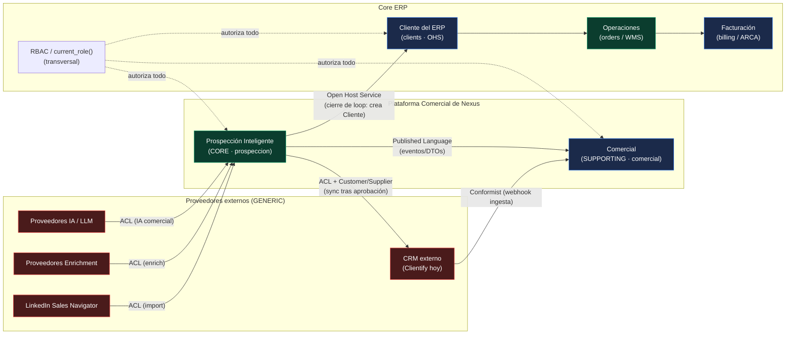

> **Lectura normativa del diagrama:** toda flecha que entra a Prospección desde un proveedor externo pasa por una **ACL**. La única flecha de Prospección hacia el core transaccional es el **Open Host Service** de `clients`. La única flecha de Prospección hacia el CRM pasa por la ACL del port de sincronización, **tras aprobación humana** (R-1.2.1).

---

## 4. C4 — Context Diagram (Nivel 1)

**R-4.1.** El siguiente diagrama de contexto (C4 Nivel 1) es la **vista oficial de límites del sistema** para la Plataforma Comercial. Cualquier integración nueva **DEBE** poder ubicarse en este diagrama como actor o como sistema externo; si no encaja, **DEBE** revisarse esta Constitución antes de construirla.

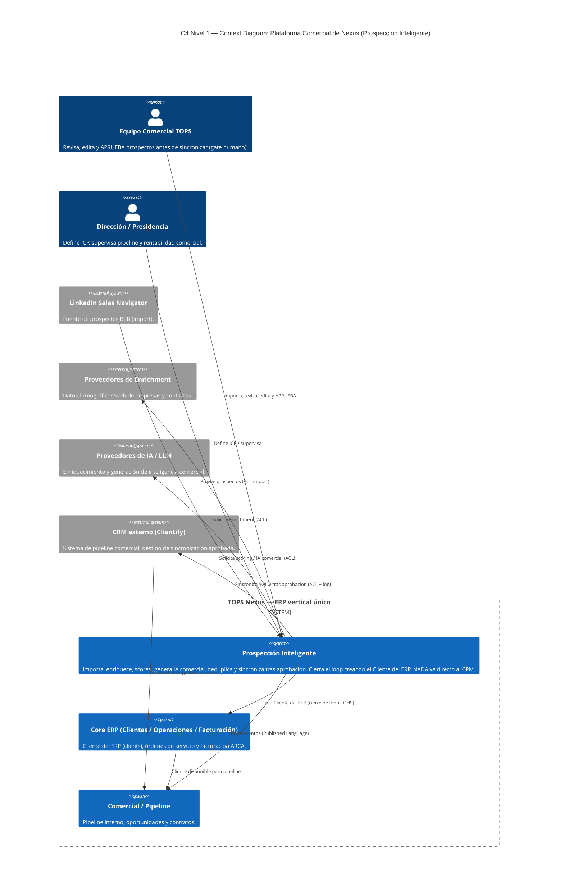

**R-4.2.** Actores y sistemas externos reconocidos en el límite:

- **Actores humanos:** Equipo Comercial (ejecuta el **gate de aprobación**, R-1.2.1) y Dirección/Presidencia (define ICP y supervisa).
- **Sistemas externos GENERIC:** LinkedIn Sales Navigator (import), proveedores de Enrichment, proveedores de IA/LLM y CRM externo (Clientify). Todos detrás de ACL (R-3.2.6).
- **Sistema interno:** TOPS Nexus, con Prospección Inteligente como subsistema CORE de esta Constitución.

**R-4.3.** El **gate de aprobación humana** es un elemento de primer nivel del contexto: no es un detalle de UI, es un **límite de confianza** del sistema. Ninguna automatización **DEBE** poder sintetizar esa aprobación.

---

## Cierre de la Parte I

**Objetivo.** Establecer el marco estratégico (DDD) de la Plataforma Comercial de Nexus y de su primer bounded context, Prospección Inteligente: visión a 10 años, principio "nada va directo al CRM", clasificación de subdominios, Context Map y diagrama de contexto C4 Nivel 1, como base normativa para las Partes tácticas siguientes.

**Alcance.** Cubre el diseño estratégico: subdominios CORE/SUPPORTING/GENERIC, patrones de relación entre bounded contexts (Customer/Supplier, Conformist, ACL, Open Host Service, Published Language) y la vista de contexto del sistema. **NO** cubre el modelado táctico (agregados, entidades, value objects), la arquitectura hexagonal/clean, el modelo de eventos/Outbox ni los managers provider-agnostic — todo ello pertenece a las Partes II, III y IV.

**Decisiones tomadas.**
1. Prospección / Inteligencia Comercial se declara subdominio **CORE** (R-2.2.2).
2. Principio de No-Bypass: nada alcanza el CRM sin atravesar prospección + aprobación humana (R-1.2.1).
3. La sincronización al CRM tiene un único punto de salida gobernado y logueado (R-1.2.3).
4. El loop se cierra creando el Cliente del ERP en `clients` vía Open Host Service, nunca por escritura directa (R-1.4.1, R-3.2.2).
5. Vigencia 10 años con prohibición de consagrar proveedores externos como permanentes (R-1.3.1–R-1.3.3).
6. Patrones de Context Map fijados: ACL hacia proveedores externos, OHS hacia `clients`, Published Language Prospección↔Comercial, Conformist en ingesta inversa del CRM.

**Decisiones descartadas.**
1. **Escritura directa de prospección al CRM o a `clients`** — descartada por violar la fuente única de verdad ([ERP-ARQUITECTURA-MAESTRA.md:16-17](../../ERP-ARQUITECTURA-MAESTRA.md)) y el alto blast radius de `clients` ([ERP-DEPENDENCY-GRAPH.md:241](../../ERP-DEPENDENCY-GRAPH.md)).
2. **Tratar al CRM (Clientify) como dominio CORE** — descartada: el diferenciador es *qué entra* al CRM, no el CRM; clasificado SUPPORTING/GENERIC (tabla §2.2).
3. **Acoplar el dominio a un SDK/proveedor concreto de IA, enrichment o CRM** — descartada por la regla de no-lock-in y vigencia a 10 años (R-1.3.3).
4. **Crear un alta de cliente paralela a la existente** — descartada por el corolario de primer principio del Rector ([TOPS-NEXUS-ERP.md:25-28](../../TOPS-NEXUS-ERP.md)).

**Justificación.** La clasificación estratégica concentra el rigor de ingeniería donde TOPS compite (adquisición y calificación de demanda) y minimiza esfuerzo en lo comprable. El principio de No-Bypass y el cierre de loop por OHS preservan la auditoría total y la fuente única de verdad, no-negociables del Rector ([ERP-ARQUITECTURA-MAESTRA.md:14-23](../../ERP-ARQUITECTURA-MAESTRA.md)). Subordinar todo a la Regla de Decisión asegura que la plataforma empuje el objetivo estratégico de ERP único y salida de Neuralsoft ([TOPS-NEXUS-ERP.md:19-24](../../TOPS-NEXUS-ERP.md)).

**Riesgos.**
1. **Filtración de modelo de proveedor** (Clientify/IA/enrichment) al dominio si la ACL se debilita — mitigación: ACL obligatoria y Published Language (R-3.2.1, R-3.2.6); a desarrollar en Parte III.
2. **Bypass del gate humano** por presión de velocidad comercial — mitigación: límite de confianza explícito (R-4.3) y único punto de salida logueado (R-1.2.3).
3. **Acoplamiento accidental a `clients`/`current_role()`** (nodos de máximo blast radius, [ERP-DEPENDENCY-GRAPH.md:127-142,241](../../ERP-DEPENDENCY-GRAPH.md)) — mitigación: OHS y RLS como frontera.
4. **Deriva de proveedor a 10 años** (cambios de API de LinkedIn/IA/CRM) — mitigación: clasificación GENERIC + ACL; ningún proveedor es canónico.
5. **Duplicación de capa CRM** (riesgo histórico de duplicados de librería, [ERP-MODULE-MAP.md:101-107](../../ERP-MODULE-MAP.md)) — mitigación: reuso del espejo CRM existente (`crm_leads`, `crm_ingest_lead`) en vez de crear un CRM paralelo.

**Impacto sobre la arquitectura.**
1. Crea el bounded context `prospeccion` como nuevo subsistema CORE bajo `src/lib/prospeccion` y `/comercial/prospeccion`, respetando el patrón de capas oficial ([TOPS-NEXUS-ERP.md:46-52](../../TOPS-NEXUS-ERP.md)).
2. Introduce una zona de staging propia (`prospeccion_*`) como frontera previa al CRM, sin tocar las tablas existentes del CRM ni de `clients`.
3. Obliga a definir, en Partes posteriores, un **port de sincronización** (ACL hacia CRM) y un **consumidor del Open Host Service** de `clients` para el cierre de loop.
4. Establece el contrato de eventos (Published Language) que las Partes IV (Event-Driven / Outbox) deberán materializar, sin nuevas dependencias cruzadas duras entre módulos de feature (preservando la única dependencia cruzada vigilada existente, Ejecutivo→Compras, [ERP-DEPENDENCY-GRAPH.md:174-178](../../ERP-DEPENDENCY-GRAPH.md)).
5. No aplica migraciones ni crea tablas en esta Parte: es diseño estratégico, conforme al modo de trabajo y a los gates del Rector ([TOPS-NEXUS-ERP.md:137-144](../../TOPS-NEXUS-ERP.md)).
# 15 · Event Storming — El flujo completo del negocio de Prospección

> Capítulo de la **Constitución Arquitectónica de la Plataforma Comercial de Nexus**.
> Bounded context: `prospeccion`. Tono **normativo** (reglas y contratos: DEBE / NO DEBE).
> Alcance: el flujo end-to-end del pipeline event-driven y su relación con la máquina de
> estados comercial única Prospección ↔ CRM.

Este capítulo no es una lista de eventos: es el **mapa del proceso de negocio**. Reconstruye,
paso a paso, qué Comando dispara qué Agregado, qué Evento de Dominio emite, qué Política
reacciona y qué Comandos siguientes encadena. El resultado es un pipeline auditable, reproducible
(replay), reintentable (retry) e idempotente, con Managers **provider-agnostic** en los bordes y un
dominio que **NUNCA** conoce proveedores concretos.

La plataforma de Prospección es una **capa intermedia obligatoria**: LinkedIn → Nexus → Clientify.
**Nada va directo a Clientify.** Esa regla constitucional es la que justifica un pipeline propio,
con su propia tabla de eventos y su propia máquina de estados, en lugar de escribir contra el CRM
de forma sincrónica.

---

## 15.1 · Leyenda y método

### Objetivo
Fijar el vocabulario gráfico del Event Storming y la convención de colores para que todo el equipo
lea los diagramas de este bounded context de la misma forma.

### Alcance
Aplica a este capítulo y a todo artefacto de modelado del context `prospeccion`. **NO** redefine la
notación de otros contextos.

### Leyenda (convención de colores Event Storming)

| Color | Pieza | Definición normativa | Ejemplo en `prospeccion` |
|-------|-------|----------------------|--------------------------|
| 🟧 Naranja | **Domain Event** | Hecho del negocio ya ocurrido, en pasado, inmutable. Se persiste append-only en el Outbox/ledger. | `ProspectEnriched`, `ScoreCalculated` |
| 🟦 Azul | **Command** | Intención de cambiar el estado. Puede fallar. Lo dispara un Actor o una Policy. | `EnrichProspect`, `RequestCrmSync` |
| 🟨 Amarillo | **Actor** | Quién dispara el Command: humano (comercial), sistema (cron/worker) o proveedor externo. | Comercial, Cron, Webhook Clientify |
| 🟪 Lila | **Policy / Reactive** | Regla automática "cuando ocurre X, entonces dispará Y". Es el pegamento del pipeline. | "Cuando `ProspectEnriched` → `CalculateScore`" |
| 🟩 Verde | **Read Model** | Proyección de lectura, derivada de los eventos. NO es fuente de verdad. | Bandeja de prospectos, panel de score |
| 🟥 Rosa | **External System** | Sistema fuera del dominio. SIEMPRE detrás de un Manager. | LinkedIn, Enrichment, IA, Clientify |
| ⬜ Agregado | **Aggregate** | Frontera de consistencia transaccional. Dueño de sus invariantes y de la emisión de sus eventos. | `Prospect` |

### Decisiones tomadas
- **DEBE** usarse esta convención de colores en todo diagrama del context.
- El **Outbox de Postgres** es la materialización física de los Domain Events (🟧). Toda emisión de
  evento **DEBE** escribirse en la misma transacción que el cambio de estado del Agregado (patrón
  Transactional Outbox), tal como hoy el Write-Path CRM escribe la transición y el ledger
  `crm_stage_history` de forma atómica dentro de una sola función (`supabase/migrations/0047_crm_write_path_fns.sql:117-119`).
- El ledger de eventos **DEBE** ser **append-only**, replicando el patrón ya probado en el repo:
  `po_events` (`supabase/migrations/0008_purchase_orders.sql:147-158`), `crm_stage_history`
  (`supabase/migrations/0045_crm_sync_audit.sql:11-21`) y `audit_log`
  (`supabase/migrations/0001_init.sql:153-164`).

### Decisiones descartadas
- **Descartado** un bus de mensajería externo (Kafka/SQS) en F0: agrega infraestructura que el
  stack actual (Supabase + Netlify Functions + cron) no necesita todavía. El Outbox Postgres + un
  worker que dispara las Policies cubre el caso con la operación ya existente.
- **Descartado** modelar el dominio con clases que importen SDKs de proveedor: viola la regla
  provider-agnostic (§15.5).

### Justificación
El repo ya demostró que el patrón ledger-append-only + RLS + función transaccional es robusto y
auditable. Reusarlo baja el riesgo a casi cero y mantiene coherencia con `comercial`.

### Riesgos
- Si un diagrama mezcla colores, el modelo deja de ser comunicable. Mitigación: revisión de
  modelado obligatoria (gate de diseño).

### Impacto sobre la arquitectura
La notación es la base de todos los diagramas siguientes. No introduce tablas; solo fija lenguaje.

---

## 15.2 · Big-picture event storming (Command → Aggregate → Event → Policy)

### Objetivo
Recorrer el pipeline completo en su nivel "big picture": para cada paso, qué Comando entra, qué
Agregado lo procesa, qué Evento emite, qué Política reacciona y qué Comando(s) encadena. Identificar
Actores y External Systems en cada paso.

### Alcance
Los 9 eventos mínimos del pipeline, en orden, más los procesos automáticos que los conectan.

### El Agregado raíz: `Prospect`
**DEBE** existir un único Agregado raíz, `Prospect`, dueño de su ciclo de vida y de la emisión de
sus eventos. El estado del Agregado se deriva del ledger de eventos (event-sourced en su lectura) y
se materializa en una fila gobernada por RLS, igual que `crm_leads` hoy
(`supabase/migrations/0042_crm_core.sql`, ingerido por `crm_ingest_lead`,
`supabase/migrations/0048_crm_ingest_lead.sql:24-32`).

### Tabla big-picture (paso a paso)

| # | 🟦 Command | ⬜ Aggregate | 🟧 Domain Event | 🟨 Actor | 🟥 External System | 🟪 Policy / Reactive → próximo Command |
|---|-----------|-------------|-----------------|----------|--------------------|----------------------------------------|
| 1 | `CreateProspect` | `Prospect` | `ProspectCreated` | Comercial / Cron de captura | LinkedIn (lectura) | Cuando `ProspectCreated` → `ImportProspect` |
| 2 | `ImportProspect` | `Prospect` | `ProspectImported` | Sistema (worker import) | LinkedIn (vía Enrichment/scraper Manager) | Cuando `ProspectImported` → `EnrichProspect` |
| 3 | `EnrichProspect` | `Prospect` | `ProspectEnriched` | Sistema (worker) | **EnrichmentManager** → proveedor B2B | Cuando `ProspectEnriched` → `CalculateScore` |
| 4 | `CalculateScore` | `Prospect` | `ScoreCalculated` | Sistema (worker) | (interno: motor de score) | Cuando `ScoreCalculated` → `RunAiAnalysis` |
| 5 | `RunAiAnalysis` | `Prospect` | `AiAnalysisCompleted` | Sistema (worker) | **AiManager** → LLM | Cuando `AiAnalysisCompleted` y score ≥ umbral → encolar para revisión humana |
| 6 | `ApproveProspect` | `Prospect` | `HumanApproved` | **Comercial (humano)** | — | Cuando `HumanApproved` → `RequestCrmSync` |
| 7 | `RequestCrmSync` | `Prospect` | `CrmSyncRequested` | Sistema (worker) | — | Cuando `CrmSyncRequested` → ejecutar push vía CrmSyncManager |
| 8 | `CompleteCrmSync` | `Prospect` | `CrmSyncCompleted` | Sistema (worker) | **CrmSyncManager** → Clientify | Cuando `CrmSyncCompleted` → `CreateCustomer` |
| 9 | `CreateCustomer` | `Prospect` → `Customer` | `CustomerCreated` | Sistema (worker) | Clientify (confirma alta) | Cierra el pipeline; el lead queda promovido en CRM |

### Procesos automáticos (las Policies son el motor)
1. El pipeline **DEBE** avanzar por reacción a eventos, no por orquestación imperativa hardcodeada en
   un endpoint. Cada Policy (🟪) lee un Evento del Outbox y emite el siguiente Command.
2. El worker que materializa las Policies **DEBE** autenticarse como cron fail-closed (mismo patrón
   que el webhook actual: token timing-safe, denegar si falta el secreto —
   `src/lib/clientify/webhook.ts:28-35`).
3. Los pasos automáticos (2, 3, 4, 5, 7, 8, 9) corren **SECURITY DEFINER** (tráfico de máquina sin
   `auth.uid()`), igual que `crm_ingest_lead` (`supabase/migrations/0048_crm_ingest_lead.sql:13-16`).
   El único paso **humano** (6, `ApproveProspect`) corre **SECURITY INVOKER**, igual que
   `crm_promote_lead` (`supabase/migrations/0050_crm_promote_lead.sql:9-11`).

### Decisiones tomadas
- **DEBE** haber exactamente un Agregado raíz `Prospect` por el pipeline 1→8; en el paso 9 nace la
  proyección `Customer` (la frontera hacia el bounded context `comercial`/CRM).
- Los bordes con LinkedIn, Enrichment, IA y Clientify **DEBEN** pasar SIEMPRE por un Manager
  provider-agnostic (§15.5). El Agregado **NO DEBE** recibir tipos de proveedor.
- La revisión humana (paso 6) es un **gate obligatorio**: ningún prospecto llega a Clientify sin
  `HumanApproved`. Esto cristaliza la regla "nada va directo a Clientify".

### Decisiones descartadas
- **Descartado** auto-aprobar prospectos con score alto saltando el paso 6. La aprobación humana es
  no-negociable por gobernanza comercial.
- **Descartado** llamar a Clientify dentro del mismo request del webhook/UI (escritura sincrónica):
  rompe retry/idempotencia y acopla el dominio al proveedor.

### Justificación
Separar "decidir" (Commands/Policies) de "ejecutar contra terceros" (Managers) permite reintentar
el push a Clientify sin re-ejecutar el análisis IA, y permite replay sin tocar proveedores.

### Riesgos
- **Tormenta de eventos** (un evento dispara muchos commands en cascada). Mitigación: cada Policy es
  idempotente y el Outbox marca eventos ya procesados.
- **Acoplamiento sigiloso**: que un campo de proveedor "se cuele" hasta el Agregado. Mitigación:
  contrato de Manager con DTO normalizado (como `NormalizedLead`, `src/lib/clientify/webhook.ts:39-48`).

### Impacto sobre la arquitectura
Define el esqueleto de Policies/workers y fija qué pasos son DEFINER vs INVOKER. Es el contrato que
el motor de pipeline DEBE implementar.

---

## 15.3 · El flujo end-to-end (los 9 eventos + caminos de error / duplicado / rechazo)

### Objetivo
Narrar el camino feliz y, con igual rigor, los caminos de error, duplicado y rechazo. Un pipeline
sin sus rutas alternativas no es un modelo: es una ilusión.

### Alcance
Del primer `ProspectCreated` al `CustomerCreated`, incluyendo retry, idempotencia, replay y
auditoría en cada arista.

### Camino feliz (narrado)
1. **ProspectCreated** — un comercial selecciona un perfil en LinkedIn (o un cron de captura lo
   levanta). Se crea el Agregado `Prospect` y se emite el evento. **Identidad mínima requerida**
   (perfil/URL, o email, o teléfono): si no hay identidad, el evento NO se crea (mismo criterio que
   `normalizeLead`, `src/lib/clientify/webhook.ts:113-124`).
2. **ProspectImported** — el worker normaliza el perfil crudo a un DTO canónico. La normalización es
   **pura** (no toca red ni DB), testeable aislada, como las funciones de `webhook.ts`.
3. **ProspectEnriched** — el `EnrichmentManager` completa datos de empresa/contacto. El Agregado
   **NO** sabe qué proveedor respondió.
4. **ScoreCalculated** — el motor de score asigna un puntaje determinista. **Determinismo
   obligatorio**: mismas entradas → mismo score (precondición para replay).
5. **AiAnalysisCompleted** — el `AiManager` produce un análisis/resumen. El prompt y el proveedor
   son detalle del Manager; el dominio recibe un veredicto normalizado.
6. **HumanApproved** — un comercial revisa en un Read Model (🟩) y aprueba. Único paso INVOKER:
   `changed_by = auth.uid()`, RLS de sesión gobierna (idéntico a `crm_promote_lead`,
   `supabase/migrations/0050_crm_promote_lead.sql:9-11`).
7. **CrmSyncRequested** — al aprobar, una Policy encola el push. El evento queda en el Outbox; el
   trabajo real es asíncrono.
8. **CrmSyncCompleted** — el `CrmSyncManager` ejecuta el push a Clientify y registra el resultado en
   un log de sync con `direction='outbound'`, espejando `clientify_sync_log`
   (`supabase/migrations/0045_crm_sync_audit.sql:23-37`).
9. **CustomerCreated** — confirmado el alta, el prospecto se materializa como lead/oportunidad en el
   CRM (promoción), cerrando la frontera Prospección → CRM.

### Camino de DUPLICADO (regla normativa)
- La detección de duplicados **DEBE** seguir la cadena de prioridad **identidad de proveedor →
  email → teléfono**, exactamente como `crm_ingest_lead`
  (`supabase/migrations/0048_crm_ingest_lead.sql:64-83`).
- Ante conflicto ambiguo (misma persona por email/phone pero nombre distinto), la regla es
  **"crear y marcar", NUNCA mergear** (patrón D-4, `supabase/migrations/0048_crm_ingest_lead.sql:134-148`):
  se crea el prospecto, se etiqueta `posible_duplicado` y se guarda la referencia al conflicto.
- **CUIT NO es clave de dedup de persona**: identifica la **cuenta/empresa** y solo se usa al
  promover a cliente, como hoy en `crm_promote_lead`
  (`supabase/migrations/0050_crm_promote_lead.sql:13-18, 74-83`).

### Camino de ERROR (retry sin pérdida)
- Todo Command contra un External System **DEBE** ser reintentable. La distinción operativa:
  - Error **transitorio** (red, 5xx del proveedor) → se registra y se reintenta. Espejo del handler
    actual, que devuelve 502 para que el emisor reintente (`src/app/api/clientify/webhook/[token]/route.ts:58-66`).
  - Error **permanente** (payload inválido, sin identidad) → se marca `skipped`/`error` y **NO** se
    reintenta indefinidamente (`route.ts:38-43`).
- Cada corrida del worker **DEBE** emitir un reporte con contadores y eventos granulares
  (`scanned/upserted/errors` + lista de `SyncEvent`), tal como el motor de Compliance
  (`src/lib/compliance/sync/engine.ts:95-118, 319-334`) y su tipado
  (`SyncEvent`, `SyncRunStatus`, `src/lib/compliance/sync/types.ts:10-16`).
- **Aislamiento de fallas en lote**: si un push masivo falla, **DEBE** reintentarse fila por fila
  para no perder el lote entero (patrón batch-fallback, `src/lib/compliance/sync/engine.ts:248-262`).

### Camino de RECHAZO (gate humano)
- En el paso 6, un comercial puede **rechazar**. El Agregado emite `ProspectRejected` (evento de
  salida terminal análogo a `perdido`/`descartado` del CRM).
- Un prospecto rechazado **NO DEBE** sincronizarse a Clientify. La Policy de sync **DEBE** verificar
  estado terminal antes de actuar (como `crm_advance_stage` trata `perdido` como terminal,
  `supabase/migrations/0047_crm_write_path_fns.sql:73`, y `crm_reserve_capacity` rechaza operar sobre
  `perdido`, `:157-160`).

### Idempotencia, replay y trazabilidad (transversal a todas las aristas)
- **Idempotencia**: reprocesar el mismo evento **NO DEBE** producir efectos dobles. El patrón
  canónico del repo es "misma etapa → no-op sin ruido en el ledger"
  (`supabase/migrations/0047_crm_write_path_fns.sql:59-62`) y "ya promovido → no-op devolviendo lo
  existente" (`supabase/migrations/0050_crm_promote_lead.sql:49-55`). Cada Policy del pipeline
  **DEBE** ser idempotente por la clave natural del evento.
- **Replay**: como el estado se deriva del ledger append-only, reproducir los eventos en orden
  reconstruye el Agregado. El replay **DEBE** ser "dry"-capaz (recorrer sin escribir efectos
  externos), como el `dryRun` del motor de Compliance (`src/lib/compliance/sync/engine.ts:38-48, 215`).
- **Auditoría / observabilidad / trazabilidad**: cada paso **DEBE** dejar (a) la fila de evento en
  el Outbox, (b) una entrada de auditoría con actor/IP/payload (estilo `audit_log`,
  `supabase/migrations/0001_init.sql:153-164`; `po_events` con `actor/actor_email/ip/meta`,
  `supabase/migrations/0008_purchase_orders.sql:147-158`), y (c) logs estructurados con `event`,
  `action` y `id` (estilo `console.info("[clientify] webhook ingest ok", { event, action, leadId })`,
  `src/app/api/clientify/webhook/[token]/route.ts:69-72`).

### Decisiones tomadas
- Estados terminales (`ProspectRejected`, y `CustomerCreated` como cierre exitoso) **DEBEN** existir
  y bloquear transiciones posteriores desde la UI.
- El log de sync de salida **DEBE** registrar `ok | error | skipped` con `payload` y `error`,
  exactamente como `clientify_sync_log` (`supabase/migrations/0045_crm_sync_audit.sql:23-37`).

### Decisiones descartadas
- **Descartado** "merge automático" de duplicados en conflicto: arriesga corromper identidad. La
  regla es crear-y-marcar para revisión humana.
- **Descartado** reintentar errores permanentes: genera loops y ruido. Se marcan y se cierran.

### Justificación
Reusar los criterios de dedup, idempotencia y reporte ya verificados en `comercial`/`compliance`
elimina invención y mantiene un único estilo de auditoría en toda la plataforma comercial.

### Riesgos
- **Doble alta en Clientify** si el push se reintenta sin clave de idempotencia. Mitigación: la
  clave natural (identidad de proveedor) más un mirror del `modified` para reconciliar por cambio,
  como `clientify_modified` en `crm_opportunities`
  (`supabase/migrations/0052_crm_opportunity_clientify_mirror.sql:8,11`).
- **Eventos huérfanos** (evento emitido, efecto no aplicado) por crash entre tx y proveedor.
  Mitigación: el Outbox transaccional + worker que reintenta desde el evento, nunca desde memoria.

### Impacto sobre la arquitectura
Obliga a una tabla Outbox con estado de procesamiento por evento, un log de sync outbound y un
contrato de reporte por corrida. Confirma la próxima migración del context (siguiente disponible:
**0088**) como portadora del esquema de eventos de `prospeccion`.

---

## 15.4 · Máquina de estados comercial ÚNICA (Prospección ↔ CRM)

### Objetivo
Definir UNA sola máquina de estados que cubra el continuo Prospección → CRM, sin dos máquinas en
competencia. El pipeline de Prospección alimenta a la máquina de etapas del CRM ya existente.

### Alcance
Estados de Prospección (derivados de los 9 eventos) y su empalme con `crm_stage_t` del Write-Path
CRM. Quién ejecuta cada transición (job DEFINER vs humano INVOKER).

### Estados y transiciones (normativo)

**Tramo Prospección (event-driven, mayormente máquina):**

| Estado del `Prospect` | Evento que lo establece | Transición permitida → | Ejecutor |
|-----------------------|-------------------------|------------------------|----------|
| `created` | `ProspectCreated` | `imported` | 🤖 Job (DEFINER) |
| `imported` | `ProspectImported` | `enriched` | 🤖 Job (DEFINER) |
| `enriched` | `ProspectEnriched` | `scored` | 🤖 Job (DEFINER) |
| `scored` | `ScoreCalculated` | `ai_analyzed` | 🤖 Job (DEFINER) |
| `ai_analyzed` ¹ | `AiAnalysisCompleted` | `approved` \| `rejected` | 👤 **Humano (INVOKER)** |
| `approved` | `HumanApproved` | `crm_sync_requested` | 🤖 Job (DEFINER) |
| `crm_sync_requested` | `CrmSyncRequested` | `crm_sync_completed` \| (retry) | 🤖 Job (DEFINER) |
| `crm_sync_completed` | `CrmSyncCompleted` | `customer_created` | 🤖 Job (DEFINER) |
| `rejected` | `ProspectRejected` | **terminal** | 👤 Humano (INVOKER) |

> ¹ **`ai_analyzed` es un único estado de la máquina (= `con_ia` en el enum SQL).** El prospecto **queda encolado aquí** esperando la decisión humana; ese momento de espera es lo que el Event Storming rotulaba `pending_approval` — es el **rótulo UI/operativo**, NO un estado-máquina separado (CC-7). Un fallo de sync (`crm.sync.failed` transitorio) reintenta sobre `crm_sync_requested` con backoff (no es un estado persistido del enum; es manejo `*.failed`, Parte II §2.1). Esta tabla usa ya los **nombres canónicos del dominio** (Parte II §1.1); su correspondencia con el enum SQL en español está en CC-7.

> **Correspondencia con el enum SQL (CC-7).** Los nombres de esta tabla son los **canónicos del dominio**; su espejo en el enum SQL español (`prospeccion_status_t`) está fijado en **CC-7**: `ai_analyzed`→`con_ia`, `approved`→`aprobado`, `crm_sync_requested`/`crm_sync_completed`→`sincronizado` (un solo valor; la distinción requested/completed vive en los eventos del Outbox), `customer_created`→`cliente_creado`, `rejected`→`rechazado`. La máquina de estados es **una sola** (9 estados + `rejected`), vista en tres notaciones reconciliadas por CC-7.

**Empalme con el CRM (`customer_created` cruza la frontera):**
- `customer_created` desemboca en la promoción del CRM. De ahí en adelante **mandan** las funciones
  ya existentes `crm_promote_lead` y luego `crm_advance_stage` sobre `crm_stage_t`
  (`nuevo_lead → contactado → calificado → visita → propuesta → negociacion → ganado | perdido`,
  `supabase/migrations/0047_crm_write_path_fns.sql:66-74`). **NO DEBE** duplicarse la lógica de
  etapas del CRM dentro de Prospección, igual que `crm_promote_lead` "enchufa con el Write-Path F2.1
  … sin duplicar lógica de etapas" (`supabase/migrations/0050_crm_promote_lead.sql:6-7`).

### Quién ejecuta cada transición — regla de seguridad
- **Transiciones de máquina (job)** → **SECURITY DEFINER**, sin `auth.uid()`, superficie mínima
  (una RPC por puerta, grants SOLO a `service_role`), exactamente el modelo de `crm_ingest_lead`
  (`supabase/migrations/0048_crm_ingest_lead.sql:13-16, 186-192`).
- **Transiciones humanas (aprobar / rechazar)** → **SECURITY INVOKER**, la RLS de sesión gobierna,
  `changed_by = auth.uid()`, como `crm_promote_lead` y el Write-Path
  (`supabase/migrations/0050_crm_promote_lead.sql:9-11`; `supabase/migrations/0047_crm_write_path_fns.sql:37,119`).
- Toda transición (de job o humana) **DEBE** escribir su fila en el ledger append-only de forma
  atómica con el cambio de estado (patrón `UPDATE … + INSERT history` en una sola función,
  `supabase/migrations/0047_crm_write_path_fns.sql:103-119`).
- El ledger es **inmutable**: RLS sin `update`, `delete` solo `is_admin()`
  (`supabase/migrations/0045_crm_sync_audit.sql:39-57`).

### Decisiones tomadas
- **DEBE** existir UNA máquina de estados que abarca Prospección y se empalma —sin solapar— con la
  máquina del CRM en `customer_created`.
- Estados terminales: `rejected` y (post-empalme) `ganado`/`perdido` del CRM.
- un fallo de sync (`crm.sync.failed`) **DEBE** poder volver a `crm_sync_requested` (retry acotado), nunca saltar pasos.

### Decisiones descartadas
- **Descartado** dos máquinas independientes (una de Prospección, otra de CRM) sin frontera clara:
  produce estados ambiguos y doble fuente de verdad.
- **Descartado** permitir que un job (DEFINER) ejecute la aprobación humana: borraría la
  trazabilidad de quién aprobó y el control RLS de sesión.

### Justificación
La división DEFINER (máquina) / INVOKER (humano) ya está validada en producción del context CRM y
es la frontera de seguridad real (RLS) descrita en el charter. Mantenerla evita re-auditar.

### Riesgos
- **Estado fantasma** entre `crm_sync_requested` y `crm_sync_completed` si el push se pierde. Mitigación:
  evento `crm.sync.failed` explícito + retry idempotente con clave natural.
- **Saltos de etapa** por bug en una Policy. Mitigación: validación de transición que lanza
  `INVALID_TRANSITION` (espejo de `supabase/migrations/0047_crm_write_path_fns.sql:76-79`).

### Impacto sobre la arquitectura
Fija el contrato de transiciones que la(s) RPC(s) del pipeline DEBEN implementar y consolida que la
frontera Prospección→CRM es el evento `customer_created` → `crm_promote_lead`.

---

## 15.5 · Managers provider-agnostic (el dominio nunca conoce proveedores)

### Objetivo
Establecer que IA, Enrichment y CRM Sync se acceden por **Managers** con contrato estable, y que el
dominio (Agregado, eventos, Policies) **NUNCA** importa SDKs ni tipos de proveedor.

### Alcance
Los tres puntos de integración externa del pipeline: `EnrichmentManager`, `AiManager`,
`CrmSyncManager` (y el adapter de captura LinkedIn).

### Reglas normativas
- Cada Manager **DEBE** exponer una interfaz independiente del proveedor y devolver un **DTO
  normalizado** (como `NormalizedLead`/`NormalizedWebhook`, `src/lib/clientify/webhook.ts:39-53`).
- El proveedor concreto **DEBE** ser intercambiable por configuración. El cliente del proveedor vive
  aislado (como `src/lib/clientify/client.ts`), nunca dentro del Agregado.
- Los secretos de proveedor **DEBEN** leerse de `env` server-side y **NO DEBEN** filtrarse al
  cliente (`src/lib/clientify/webhook.ts:2-5`).
- El borde con el proveedor **DEBE** degradar con gracia: si el proveedor o la DB no están
  configurados, devolver `skipped` sin efectos (`src/lib/compliance/sync/engine.ts:120-126`).

### Decisiones tomadas
- Tres Managers: Enrichment, IA, CRM Sync. Cada uno con su contrato y su log de auditoría.
- El dominio depende de **abstracciones**, no de implementaciones (Dependency Inversion).

### Decisiones descartadas
- **Descartado** acoplar el Agregado a Clientify/LinkedIn/un LLM específico: rompe testeabilidad,
  replay y la regla "nada va directo a Clientify".

### Justificación
El repo ya separa `webhook.ts` (puro/dominio) de `client.ts` (proveedor); generalizarlo a tres
Managers es coherente y de bajo riesgo.

### Riesgos
- **Fuga de tipos de proveedor** hacia el dominio. Mitigación: DTO normalizado obligatorio + revisión.

### Impacto sobre la arquitectura
Define la capa de adapters del context y garantiza que el modelo de eventos sea independiente de
cualquier vendor.

---

## 15.6 · Diagrama Mermaid — Commands → Events → Policies

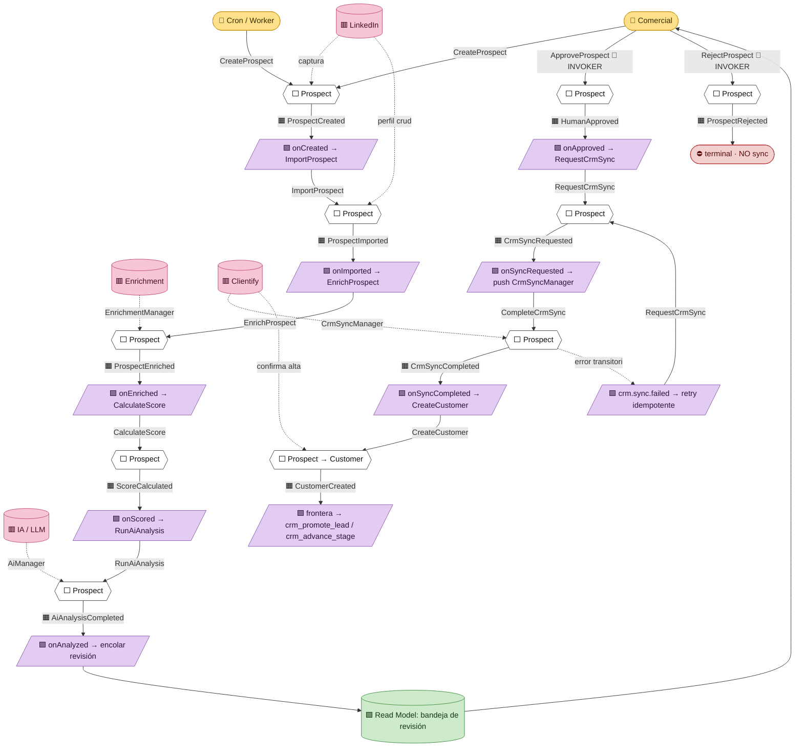

> Lectura del diagrama: cada 🟦 Command entra a ⬜ `Prospect`, que emite un 🟧 Domain Event; una
> 🟪 Policy reacciona y dispara el siguiente Command. Los 🟥 External Systems solo tocan al Agregado a
> través de un Manager (líneas punteadas). El único cruce 👤 humano es Aprobar/Rechazar (INVOKER); el
> resto lo ejecuta el 🤖 worker (DEFINER). `ProspectRejected` es terminal y **no** sincroniza. El
> camino de error vuelve a `RequestCrmSync` por retry idempotente.

---

## 15.7 · Resumen normativo del capítulo

- **DEBE** existir un único Agregado `Prospect` y un Outbox Postgres append-only como fuente de
  verdad de eventos (patrón `po_events` / `crm_stage_history` / `audit_log`).
- **DEBE** avanzarse por Policies reactivas, no por orquestación imperativa en endpoints.
- **DEBE** respetarse el gate humano (`HumanApproved`) antes de cualquier escritura a Clientify:
  **nada va directo a Clientify**.
- **DEBE** ser todo idempotente, reintentable y reproducible (replay dry-capaz), con auditoría por
  paso (actor/IP/payload/log estructurado).
- **DEBE** separarse máquina (jobs SECURITY DEFINER) de humano (acciones SECURITY INVOKER), con RLS
  como frontera y ledger inmutable.
- **DEBE** accederse a IA/Enrichment/CRM por Managers provider-agnostic; el dominio **NO DEBE**
  conocer proveedores concretos.
- La frontera Prospección → CRM es el evento `CustomerCreated`, que delega en el Write-Path CRM ya
  existente (`crm_promote_lead` → `crm_advance_stage`), **sin** duplicar la máquina de etapas.
# Constitución Arquitectónica de la Plataforma Comercial de Nexus

## PARTE II — MODELO DE DOMINIO (DDD TÁCTICO) + BASE HEXAGONAL

> **Bounded context:** `prospeccion`. Código de dominio bajo `src/lib/prospeccion`.
> **Tono:** normativo. Lo que sigue son **reglas y contratos**, no sugerencias. Donde se diga DEBE / NO DEBE / PROHIBIDO, es vinculante para todo el contexto `prospeccion`.
> **No-fantasy:** este documento describe arquitectura **prescrita**. Al 2026-06-25 el directorio `src/lib/prospeccion` está **vacío** (verificado: `ls src/lib/prospeccion/` no devuelve archivos). Toda referencia a archivos `prospeccion/*` es **objetivo de diseño**, no estado actual. Las citas `file:line` a otros módulos (`clientify/`, `tesoreria/conciliacion/`, `arca/`, `comercial/`, `supabase/`) son **precedentes idiomáticos reales** del repo que esta Parte II eleva a norma.

---

### Preámbulo: por qué esta Parte difiere del resto de Nexus

La skill `architecture-tops-nexus` y la práctica vigente del repo describen un patrón **Feature → Server Action/Route Handler → `src/lib/<ctx>/data.ts` → Supabase**, RPC-first, sin capa de dominio explícita (ver `src/lib/comercial/leads-data.ts:44`, que mezcla acceso a datos, fallback de demo y mapeo). Ese patrón es legítimo para módulos CRUD-céntricos.

`prospeccion` **NO** es CRUD-céntrico: es un **pipeline event-driven** con lógica de negocio densa (scoring, decisión humana, anticorrupción contra tres proveedores externos volátiles) y una invariante dura de gobernanza: **nada va directo a Clientify; LinkedIn → Nexus → Clientify**. Por eso esta Parte II **prescribe una capa de dominio pura y puertos explícitos**, alineándose con los precedentes de DI ya presentes en `tesoreria/conciliacion/matching.ts` y `arca/soap.ts`. Esto es una **excepción deliberada y acotada** al patrón general, justificada por la complejidad del dominio.

---

## Sección 1 — Tactical DDD: Aggregates, Entities, Value Objects

### 1.1 Aggregate Root: `Prospect`

`Prospect` es el **único Aggregate Root** del contexto `prospeccion`. Toda mutación del estado de un prospecto DEBE entrar por la raíz.

**Identidad.** `ProspectId` (UUID v4, generado por `IdGeneratorPort` — §4.7, nunca por la base). La identidad es inmutable y se asigna en la creación.

**Estado (máquina de estados).** El ciclo de vida del agregado es una máquina de estados explícita, dirigida por los 9 eventos de dominio:

```
created → imported → enriched → scored → ai_analyzed → approved → crm_sync_requested → crm_sync_completed → customer_created
                                              └────────→ rejected (terminal)
```

> **Nombres canónicos (CC-7).** Estos son los nombres de estado **del dominio** (canónicos para citar entre capítulos). Su correspondencia con los alias del Event Storming (`15` §15.4 usa `analyzed` y `pending_approval`) y con el enum SQL en español (`prospeccion_status_t`: `con_ia`, `aprobado`, `sincronizado`, …) está fijada en **CC-7**. El estado `ai_analyzed` es donde el prospecto espera el gate humano (el Event Storming lo rotula `pending_approval`); `crm_sync_requested`/`crm_sync_completed` se persisten ambos como `sincronizado` (su distinción vive en los eventos del Outbox).

**Invariantes del agregado (DEBEN cumplirse en TODO momento; se validan en la raíz, nunca afuera):**

1. **INV-PR-1 — Transición legal.** Una transición de estado solo es válida si parte del estado inmediatamente anterior en la máquina. Saltar etapas está PROHIBIDO. Ejemplo: `approve()` solo es legal desde `ai_analyzed`. Esto replica el rigor de pasadas secuenciales de `matching.ts:14` ("Pasadas SECUENCIALES con asignación 1:1").
2. **INV-PR-2 — No-bypass de Clientify.** El agregado NO PUEDE alcanzar `crm_sync_requested` sin un `HumanDecision = approved` registrado. Ningún camino lleva de `enriched`/`scored`/`ai_analyzed` directo a CRM. Esta es la encarnación táctica de "nada va directo a Clientify".
3. **INV-PR-3 — Score requiere enriquecimiento.** `scored` exige `EnrichmentSnapshot` presente; no se puntúa un prospecto sin datos enriquecidos. (Espejo de OB6 en `iaMatch.ts:14`: "la IA nunca inventa un match sin corroboración").
4. **INV-PR-4 — Decisión humana inmutable.** Una vez registrada (`approved`/`rejected`), la `HumanDecision` no se reescribe; un cambio de opinión es un evento nuevo, no una mutación.
5. **INV-PR-5 — Idempotencia de sincronización.** Un `Prospect` mapea a lo sumo a **un** registro CRM (`CrmRef`). Reintentos de sync NO duplican. (Precedente: `crm_ingest_lead` idempotente por `clientify_id`, `clientify/reconcile.ts:5`.)
6. **INV-PR-6 — Terminalidad.** `rejected` y `customer_created` son estados terminales: no admiten transiciones salientes.

**Frontera transaccional.** La unidad de consistencia es **un `Prospect`**. Toda mutación + sus eventos resultantes se persisten en **una sola transacción** vía `UnitOfWorkPort` (§4.9) usando el patrón **Outbox** (eventos escritos a `prospeccion_outbox` en la misma transacción que el agregado). NUNCA se abarcan dos agregados en una transacción; la coordinación entre agregados es **eventual**, por eventos.

| Plantilla normativa | |
|---|---|
| **Objetivo** | Establecer `Prospect` como única raíz de consistencia y la máquina de estados como ley de transición. |
| **Alcance** | Toda escritura sobre el ciclo de vida de un prospecto en `prospeccion`. |
| **Decisiones tomadas** | AR único `Prospect`; 6 invariantes duras; transaccionalidad por-agregado con Outbox; identidad por `IdGeneratorPort`. |
| **Decisiones descartadas** | (a) Múltiples ARs (`Enrichment`, `Analysis` como raíces) — descartado: fragmenta la invariante INV-PR-2. (b) Estado en columnas sueltas tipo overlay (como `commercial-score.ts` lee `overlay_horizonte`) — descartado para el AR: el estado es una máquina, no un atributo libre. (c) Transacción multi-agregado — descartado por acoplamiento. |
| **Justificación** | La invariante de gobernanza (no-bypass de Clientify) solo es defendible si vive dentro de una raíz transaccional. |
| **Riesgos** | Agregado "gordo" si se le cuelgan responsabilidades de proveedores; se mitiga con VOs snapshot (§1.3) y ACL (§2.6). |
| **Impacto sobre la arquitectura** | Define la frontera transaccional, justifica `UnitOfWorkPort` y el Outbox, y subordina todos los casos de uso a la máquina de estados. |

### 1.2 Entities

Entidades (identidad propia, mutables, **dentro** de la frontera del AR `Prospect`; no se referencian desde afuera del agregado salvo por ID):

- **`EnrichmentSnapshot`** — resultado normalizado de un pase de enriquecimiento (empresa, dominio, facturación estimada, headcount). Identidad: `(provider, fetchedAt)`. Inmutable una vez tomado (es una "foto"). Análogo conceptual a `EnrichedDeal` (`commercial-score.ts:1`), pero **propio del dominio**, no del proveedor.
- **`AIAnalysis`** — salida estructurada del análisis IA: `summary`, `fit`, `ConfidenceScore` (§1.3). Identidad: `(model, analyzedAt)`. Inmutable.
- **`HumanDecision`** — `approved` | `rejected`, `actorId`, `decidedAt`, `note?`. Identidad: `decisionId`. Inmutable (INV-PR-4).
- **`CrmRef`** — vínculo con el registro creado en Clientify: `clientifyId`, `syncedAt`, `status`. Identidad: `clientifyId`. (Precedente del deeplink/ID externo: `clientify/mappers.ts:103`.)

Las entidades NO acceden a infraestructura. NO contienen imports de Supabase, `fetch`, ni de SDKs de proveedor.

### 1.3 Value Objects

Los Value Objects (VO) son **inmutables**, se comparan por valor, y **validan su invariante en construcción** (constructor privado + factory `create()` que devuelve `Result<VO, DomainError>` — patrón del error tipado de `clientify/client.ts:19` y `arca/soap.ts:11`, elevado a regla). Un VO en estado inválido NO PUEDE existir.

| VO | Invariante (validada al crear) | Notas |
|---|---|---|
| `Email` | RFC básico + normalización a minúsculas/trim | Espejo de la normalización de tokens en `iaMatch.ts:28-37`. |
| `Phone` | E.164 (Argentina por defecto, `+54`) | Acepta variantes `+54 11 …` y normaliza. |
| `Cuit` | 11 dígitos + dígito verificador AR válido; rechaza placeholders | Es VO **del dominio**, no string suelto como `taxId` en `mappers.ts:99`. |
| `Domain` / `Website` | host válido, sin esquema, lowercase | Clave para deduplicación de empresas. |
| `Score` | entero 0..100 | Rango cerrado, como `score: 0..100` en `matching.ts:38`. |
| `ConfidenceScore` | real 0..1 | Espejo exacto de `SimTextoFn → 0..1` (`iaMatch.ts:19`). |
| `Money` | entero en **centavos**, ISO-4217 (`ARS`/`USD`) | **Centavos enteros**, regla tomada de `matching.ts:1` ("PURO, centavos enteros"). PROHIBIDO float para dinero. |
| `EstimatedRevenue` | `Money` no negativo, con `confidence: ConfidenceScore` | Facturación estimada del enriquecimiento. |
| `SourceSlug` | enum cerrado: `linkedin` \| `import_csv` \| `enrichment_provider` \| … | Espejo del `source` controlado en `leads-data.ts:20` (`google_ads`/`web`/`referido`). |
| `ProspectStatus` | enum = estados de la máquina (§1.1) | El estado es un VO, no texto libre. |

**Regla de igualdad de VOs:** dos VOs son iguales si y solo si todos sus componentes normalizados son iguales. La normalización (NFD, lowercase, strip) es parte del VO, igual que en `iaMatch.ts:33`.

| Plantilla normativa | |
|---|---|
| **Objetivo** | Garantizar que datos de identidad/medida del dominio sean siempre válidos por construcción. |
| **Alcance** | Todo dato primitivo de negocio en `prospeccion` (mails, teléfonos, CUIT, montos, scores). |
| **Decisiones tomadas** | VOs inmutables con `create() → Result`; dinero en centavos enteros; scores con rango cerrado; enums cerrados para `source` y `status`. |
| **Decisiones descartadas** | (a) Primitivos crudos (`string`/`number`) como en gran parte del repo — descartado por permitir estados imposibles. (b) Validación en el borde (action) — descartado: deja la invariante fuera del dominio. (c) Dinero en float — PROHIBIDO. |
| **Justificación** | Empuja la validación al tipo; elimina chequeos defensivos dispersos; precedente directo en centavos/score 0..1 del repo. |
| **Riesgos** | Verbosidad. Se mitiga con factories y un módulo `prospeccion/domain/vo/`. |
| **Impacto sobre la arquitectura** | Los VOs viven en la capa de Dominio (capa 0); ningún adapter los construye sin pasar por `create()`. |

---

## Sección 2 — Eventos, Servicios, Casos de Uso, Repositorios, Factories, ACL

### 2.1 Domain Events (los 9 + `*.failed`)

Los eventos de dominio son **objetos inmutables, en pasado, hechos consumados**. Estructura común obligatoria:

```ts
interface DomainEvent<TName extends string, TPayload> {
  readonly eventId: string;        // IdGeneratorPort
  readonly name: TName;            // p.ej. "prospeccion.prospect.scored"
  readonly aggregateId: string;    // ProspectId
  readonly occurredAt: string;     // ISO, ClockPort
  readonly version: 1;             // versionado de esquema de evento
  readonly payload: Readonly<TPayload>;
}
```

Catálogo (namespace `prospeccion.prospect.*`):

| # | Evento | Disparado por | Payload (núcleo) |
|---|---|---|---|
| 1 | `ProspectCreated` | `ImportProspects` | `source`, `rawRef` |
| 2 | `ProspectImported` | `ImportProspects` | `Email?`, `Domain?`, `Cuit?` |
| 3 | `ProspectEnriched` | `EnrichProspect` | `EnrichmentSnapshot` |
| 4 | `ScoreCalculated` | `ScoreProspect` | `Score` |
| 5 | `AIAnalysisCompleted` | `RunAIAnalysis` | `AIAnalysis`, `ConfidenceScore` |
| 6 | `HumanApproved` | `ApproveProspect` | `actorId`, `note?` |
| 7 | `CrmSyncRequested` | `RequestCrmSync` | `intent` |
| 8 | `CrmSyncCompleted` | `CompleteCrmSync` | `CrmRef` |
| 9 | `CustomerCreated` | `CreateCustomer` | `customerId`, `CrmRef` |

**Eventos de fallo (`*.failed`).** Cada paso que toca un proveedor externo o una regla emite su contraparte de fallo, como ciudadano de primera clase: `ProspectEnrichmentFailed`, `AIAnalysisFailed`, `CrmSyncFailed` (y, por simetría, `ProspectRejected` como decisión humana negativa — terminal, ver INV-PR-6). El payload de un `*.failed` DEBE incluir `reason`, `transient: boolean` y `attempt`. La bandera `transient` es **idéntica en semántica** a `SoapNetworkError.transient` (`arca/soap.ts:21`) y gobierna si el orquestador reintenta. **Regla:** un `*.failed` transitorio habilita reintento con backoff; uno no-transitorio detiene el pipeline para ese prospecto y exige intervención.

**Reglas de eventos:**
- **E-1** Inmutables: `readonly` en todo el árbol; PROHIBIDO mutar un evento emitido.
- **E-2** Persistencia atómica vía Outbox en la misma transacción del agregado (INV-PR — frontera).
- **E-3** Entrega *at-least-once*; los consumidores DEBEN ser idempotentes (precedente: `reconcile.ts:5`).
- **E-4** Versionados (`version`) para evolución de esquema sin romper consumidores.

### 2.2 Domain Services

Servicios de dominio: lógica que **no pertenece naturalmente a una entidad/VO** y es **pura** (sin I/O). Viven en capa 0.

- **`ScoringPolicy`** — calcula `Score` a partir de `EnrichmentSnapshot` + reglas. DEBE ser una **función pura y testeable**, exactamente como `calculateCommercialScore(...)` (`commercial-score.ts:82`) y el motor de `matching.ts`. NO llama a IA ni a base.
- **`DeduplicationPolicy`** — decide si dos prospectos son el mismo por `(Cuit | Domain | Email)`. Determinista. Espejo del gate de corroboración de entidad (OB6, `iaMatch.ts:14`).
- **`PromotionPolicy`** — decide si un prospecto `approved` es elegible para `CreateCustomer`.

**Regla DS-1:** Si un servicio de dominio necesita una señal externa cara (p.ej. similitud semántica IA), esa señal se **inyecta como función** (`type SimTextoFn`, `iaMatch.ts:19`), pre-computada por lote. El servicio permanece **síncrono y puro**. La IA **nunca decide sola**: solo aporta un score (`iaMatch.ts:63`).

### 2.3 Application Services / Casos de Uso

Cada caso de uso es una **clase/función orquestadora** que: (1) carga el AR vía `ProspectRepositoryPort`, (2) invoca un método del AR o una `*Policy`, (3) recolecta los eventos emitidos por el AR, (4) persiste agregado + eventos en **una** `UnitOfWork`. Los casos de uso **dependen solo de puertos** (§4), nunca de adapters concretos.

| Caso de uso | Precondición (estado) | Puertos que usa | Evento(s) |
|---|---|---|---|
| `ImportProspects` | — | Repo, IdGen, Clock, EventBus, UoW | `ProspectCreated`, `ProspectImported` |
| `EnrichProspect` | `imported` | Repo, **EnrichmentPort**, Clock, EventBus, UoW | `ProspectEnriched` / `…Failed` |
| `ScoreProspect` | `enriched` | Repo, (`ScoringPolicy`), EventBus, UoW | `ScoreCalculated` |
| `RunAIAnalysis` | `scored` | Repo, **AIPort**, Clock, EventBus, UoW | `AIAnalysisCompleted` / `…Failed` |
| `ApproveProspect` | `ai_analyzed` | Repo, Clock, EventBus, UoW | `HumanApproved` |
| `RejectProspect` | `ai_analyzed` (o anterior) | Repo, Clock, EventBus, UoW | `ProspectRejected` (terminal) |
| `RequestCrmSync` | `approved` | Repo, EventBus, UoW | `CrmSyncRequested` |
| `CompleteCrmSync` | `crm_sync_requested` | Repo, **CrmSyncPort**, Clock, EventBus, UoW | `CrmSyncCompleted` / `…Failed` |
| `CreateCustomer` | `crm_sync_completed` | Repo, (`PromotionPolicy`), EventBus, UoW | `CustomerCreated` |

**Regla UC-1:** un caso de uso **no contiene reglas de transición** propias; delega en el AR (INV-PR-1). Si el estado es inválido, el AR lanza `DomainError` y el caso de uso **no** persiste nada.
**Regla UC-2:** los casos de uso que tocan proveedores (`EnrichProspect`, `RunAIAnalysis`, `CompleteCrmSync`) reciben el puerto correspondiente por inyección y traducen errores transitorios/permanentes a `*.failed` (semántica `arca/soap.ts:96` — "negocio: no reintentar").

### 2.4 Repositories (interfaces)

**Regla R-1:** un repositorio por **Aggregate Root** → existe **un solo** repositorio: `ProspectRepositoryPort` (§4.1). NO se crean repos para entidades internas (`EnrichmentSnapshot`, `AIAnalysis`): se persisten/cargan **como parte del agregado**. El repositorio devuelve y acepta **el agregado reconstituido**, no filas crudas; el mapeo fila↔dominio vive en el **adapter** (precedente: `clientify/mappers.ts` separa tipos externos de los internos).

### 2.5 Factories

Las factories se justifican **solo** cuando la construcción del agregado tiene reglas no triviales:

- **`ProspectFactory.fromImportRow(id, row, SourceSlug)`** — construye un `Prospect` nuevo desde una fila de import/LinkedIn: **recibe** el `ProspectId` ya generado por `IdGeneratorPort` (inyectado en el caso de uso `ImportProspects`, §2.3; NO lo pide al repositorio — ARCH-001), valida y arma VOs (`Email`, `Cuit`, `Domain`), arranca en `created` y emite `ProspectCreated`. Justificada porque concentra la validación de entrada y garantiza INV iniciales.
- **`ProspectFactory.reconstitute(state, events?)`** — usada por el adapter de repositorio para rehidratar el agregado desde persistencia **sin** re-emitir eventos.

NO se usan factories para VOs simples (basta `Email.create()`); NO se usa factory donde un constructor directo es suficiente (regla anti-ceremonia).

### 2.6 Anti-Corruption Layer (una por integración)

Toda integración externa cruza una **ACL** que traduce el modelo del proveedor al modelo de dominio y **aísla** al dominio de cambios del proveedor. Precedente canónico: `clientify/mappers.ts:5` ("que las pages no hablen Clientify directamente… un cambio futuro de CRM no impacte la UI"). Esta Parte II **eleva ese patrón a obligación** para los tres proveedores.

- **ACL de Enriquecimiento** (`prospeccion/adapters/enrichment/*`): cliente HTTP tipado + mapper `ProviderCompany → EnrichmentSnapshot`. El cliente DEBE manejar 429/5xx con backoff y `fetchImpl` inyectable para tests — patrón exacto de `clientify/client.ts:42-114` y `arca/soap.ts:54`. El dominio nunca ve el JSON del proveedor.
- **ACL de IA** (`prospeccion/adapters/ai/*`): traduce `Prospect`/`EnrichmentSnapshot` → prompt, y respuesta del modelo → `AIAnalysis` + `ConfidenceScore`. La señal IA se expone al dominio como **función pura inyectable** (`SimTextoFn`-style, `iaMatch.ts:19`); datos sensibles **redactados** antes de salir (precedente: `iaMatch.ts:57`, "datos ya REDACTADOS").
- **ACL de CRM Sync** (`prospeccion/adapters/crm/*`): mapea `Prospect aprobado → payload Clientify` y respuesta → `CrmRef`. Idempotente por `Cuit`/`clientifyId` (INV-PR-5; precedente `reconcile.ts`). Reusa el cliente de `src/lib/clientify/client.ts` **a través de la ACL**, nunca directo desde el dominio.

**Regla ACL-1:** PROHIBIDO importar un SDK/cliente de proveedor desde la capa de Dominio o de Casos de Uso. Todo proveedor entra por su puerto, implementado por su ACL.

| Plantilla normativa (Sección 2) | |
|---|---|
| **Objetivo** | Definir el vocabulario táctico operativo: eventos consumados, servicios puros, casos de uso por-puerto, un repo por AR, factories justificadas y una ACL por proveedor. |
| **Alcance** | Toda la lógica de aplicación y los bordes de integración de `prospeccion`. |
| **Decisiones tomadas** | 9 eventos + `*.failed` con `transient`; servicios de dominio puros con señales IA inyectadas; 9 casos de uso por-puerto; un único `ProspectRepositoryPort`; 2 factories; 3 ACLs (enrichment/IA/CRM). |
| **Decisiones descartadas** | (a) Casos de uso accediendo a Supabase/`fetch` directo (patrón `data.ts` del repo) — descartado en este contexto. (b) Repos por entidad interna — descartado (rompe la frontera del AR). (c) Dominio llamando al LLM síncronamente — descartado (`iaMatch.ts:64`). |
| **Justificación** | Reusa patrones probados del repo (DI por función, mappers ACL, idempotencia) y los hace norma; mantiene el dominio testeable sin red. |
| **Riesgos** | Más archivos/indirección que el patrón `data.ts`. Aceptado por la densidad de reglas y la criticidad de la invariante de gobernanza. |
| **Impacto sobre la arquitectura** | Fija las dependencias hacia los puertos (§4) y consolida el Outbox como mecanismo de propagación. |

---

## Sección 3 — Arquitectura Hexagonal / Clean

### 3.1 Capas y Regla de Dependencia

Cinco capas concéntricas. **Regla de Dependencia (LEY):** las dependencias apuntan **siempre hacia adentro**. Una capa interior NO conoce a ninguna exterior. PROHIBIDAS las dependencias inversas (un import de Dominio hacia un adapter, o de Casos de Uso hacia Next.js/Supabase, es una **violación constitucional**).

0. **Dominio** (`prospeccion/domain/`): AR `Prospect`, Entities, VOs, Domain Events, Domain Services, `DomainError`. **Cero imports de infraestructura.** Cero `fetch`, cero `@supabase/*`, cero `next/*`. (Contraste con `commercial-score.ts`, que es puro pero importa un tipo de proveedor: en `prospeccion` eso está PROHIBIDO — se usa el tipo de dominio.)
1. **Casos de Uso** (`prospeccion/application/`): los 9 application services. Dependen de Dominio + **Ports**. Nada más.
2. **Ports** (`prospeccion/ports/`): interfaces TypeScript (driving y driven). Definidas hacia adentro; implementadas hacia afuera (Dependency Inversion).
3. **Adapters** (`prospeccion/adapters/`): implementaciones concretas de los ports driven (Supabase repo, ACLs de enrichment/IA/CRM, EventBus Outbox) y wiring de los driving.
4. **Infraestructura** (Next.js App Router, Supabase/Postgres, SDKs): el mundo exterior. Solo la conoce la capa de Adapters.

### 3.2 Mapeo a la realidad Next.js

- **Driving adapters (entran al sistema):** Server Actions (`"use server"`, precedente `comercial/lead-actions.ts:1`), Route Handlers (webhooks/ingest, precedente `clientify/webhook.ts`), y crons (GH Actions). **Su única responsabilidad:** autenticar/autorizar (RLS como frontera, RBAC), validar entrada, **componer** el caso de uso con sus adapters y traducir el `Result`/`DomainError` a respuesta HTTP/UI. NO contienen reglas de negocio.
- **Driven adapters (el sistema sale):** `ProspectRepository` sobre Supabase (`createClient()`, precedente `supabase/server.ts:12`), `OutboxEventBus` (Postgres), ACLs HTTP de los tres proveedores. Implementan ports; son intercambiables.
- **Composition Root:** el wiring (qué adapter concreto recibe cada port) ocurre **en el borde** (la action/route/cron), no en el dominio — igual que `matching.ts` recibe `simTexto` desde el caller y `soapPost` recibe `fetchImpl` desde el caller.

### 3.3 Diagrama de capas (Mermaid)

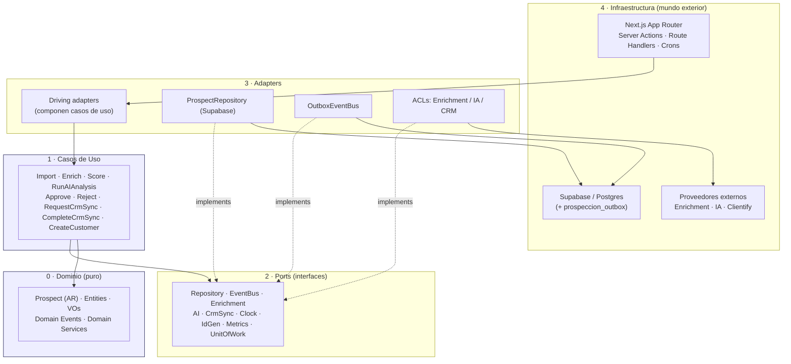

> **Lectura del diagrama:** las flechas sólidas son dependencias de compilación y apuntan hacia adentro (`Next → Driving → UC → Ports/Domain`). Las flechas punteadas `implements` van de Adapters a Ports: el adapter **depende** del port (inversión), el dominio **no** depende del adapter. Las flechas Adapter→Infra son las únicas salidas al exterior.

| Plantilla normativa (Sección 3) | |
|---|---|
| **Objetivo** | Fijar las 5 capas, la Regla de Dependencia hacia adentro y el mapeo a driving/driven adapters de Next.js. |
| **Alcance** | Organización física de `src/lib/prospeccion` y el wiring en el borde (actions/routes/crons). |
| **Decisiones tomadas** | Dominio puro (cero infra); ports en el medio; Composition Root en el borde; Outbox como propagación; RLS/RBAC en el driving adapter. |
| **Decisiones descartadas** | (a) Patrón plano `data.ts` para este contexto — descartado. (b) Acceso a Supabase desde el dominio — PROHIBIDO. (c) DI container pesado — descartado a favor del wiring explícito por función (estilo `soap.ts`/`matching.ts`). |
| **Justificación** | La Regla de Dependencia es lo que hace defendibles INV-PR-2/INV-PR-5 y permite testear el dominio sin red ni base. |
| **Riesgos** | Disciplina manual de imports. Se mitiga con lint de capas (regla de import boundaries) y revisión de PR. |
| **Impacto sobre la arquitectura** | Es la columna vertebral: todo lo demás (puertos, ACLs, Outbox) se justifica por esta regla. |

---

## Sección 4 — Catálogo de Ports

Convención: **driving** = el mundo invoca al sistema; **driven** = el sistema invoca al mundo. Todas las firmas son **bocetos** (signatureSketch) en TypeScript; el `Result<T, DomainError>` es el patrón de error tipado del repo (`ClientifyError` en `client.ts:19`, `SoapFaultError`/`SoapNetworkError` en `soap.ts:11-27`).

```ts
// Tipos compartidos (boceto)
type Result<T, E = DomainError> = { ok: true; value: T } | { ok: false; error: E };
type ProspectId = string & { readonly __brand: "ProspectId" };
```

### 4.1 `ProspectRepositoryPort` (driven)
```ts
interface ProspectRepositoryPort {
  // ARCH-001: el repositorio SOLO persiste/reconstituye. La generación de identidad NO vive aquí
  // (sería violación de SRP + dependencia implícita invisible para el caso de uso): el `ProspectId`
  // lo genera `IdGeneratorPort` (§4.7), inyectado directamente en el caso de uso, y se pasa a
  // `ProspectFactory.fromImportRow(...)` (§2.5). No existe `repo.nextId()`.
  findById(id: ProspectId): Promise<Prospect | null>;    // reconstituye el AR
  findByDedupeKey(k: DedupeKey): Promise<Prospect | null>; // Cuit|Domain|Email (INV-PR-5)
  save(p: Prospect, uow: UnitOfWork): Promise<void>;     // dentro de la transacción
}
```

### 4.2 `EventBusPort` (driven)
```ts
interface EventBusPort {
  // Outbox: escribe en prospeccion_outbox EN LA MISMA transacción del agregado (E-2).
  publish(events: ReadonlyArray<DomainEvent>, uow: UnitOfWork): Promise<void>;
}
```

### 4.3 `EnrichmentPort` (driven)
```ts
interface EnrichmentPort {
  // Implementado por la ACL de enrichment. transient diferencia reintento vs. stop (arca/soap.ts:21).
  enrich(input: { domain?: Domain; cuit?: Cuit; email?: Email }):
    Promise<Result<EnrichmentSnapshot, { reason: string; transient: boolean }>>;
}
```

### 4.4 `AIPort` (driven)
```ts
interface AIPort {
  // La ACL de IA arma el prompt con datos REDACTADOS y devuelve estructura de dominio (iaMatch.ts:57).
  analyze(input: { prospect: ProspectView; snapshot: EnrichmentSnapshot }):
    Promise<Result<{ analysis: AIAnalysis; confidence: ConfidenceScore }, { reason: string; transient: boolean }>>;
}
```

### 4.5 `CrmSyncPort` (driven)
```ts
interface CrmSyncPort {
  // Idempotente por dedupeKey (INV-PR-5); reusa clientify/client.ts a través de la ACL.
  upsertProspect(p: ApprovedProspectView):
    Promise<Result<CrmRef, { reason: string; transient: boolean }>>;
}
```

### 4.6 `ClockPort` (driven)
```ts
interface ClockPort { now(): string; } // ISO. Inyectable como el `today: Date` de commercial-score.ts:82.
```

### 4.7 `IdGeneratorPort` (driven)
```ts
interface IdGeneratorPort { uuid(): string; } // identidad fuera de la base; testeable/determinista en tests.
```

### 4.8 `MetricsPort` (driven)
```ts
interface MetricsPort {
  increment(name: string, tags?: Record<string, string>): void;
  observe(name: string, value: number, tags?: Record<string, string>): void; // p.ej. usoIa, latencias de proveedor
}
```

### 4.9 `UnitOfWorkPort` (driven)
```ts
interface UnitOfWorkPort {
  // Una transacción = un agregado + sus eventos (frontera transaccional, §1.1).
  run<T>(work: (uow: UnitOfWork) => Promise<T>): Promise<T>;
}
```

### 4.10 Driving ports
Los **driving ports** son las interfaces de los casos de uso (§2.3) que el mundo invoca. Boceto representativo:
```ts
interface EnrichProspectUseCase { execute(cmd: { prospectId: ProspectId }): Promise<Result<void>>; }
// (Análogos: ImportProspectsUseCase, ScoreProspectUseCase, RunAIAnalysisUseCase,
//  ApproveProspectUseCase, RejectProspectUseCase, RequestCrmSyncUseCase,
//  CompleteCrmSyncUseCase, CreateCustomerUseCase.)
```
El **driving adapter** (Server Action / Route Handler / cron) implementa el wiring: instancia los driven adapters, construye el caso de uso y llama `execute(...)`.

| Plantilla normativa (Sección 4) | |
|---|---|
| **Objetivo** | Catalogar los contratos (ports) que aíslan dominio/casos de uso de la infraestructura. |
| **Alcance** | Toda dependencia externa de `prospeccion`: persistencia, eventos, proveedores, tiempo, IDs, métricas, transacción. |
| **Decisiones tomadas** | 9 driven ports + driving ports por caso de uso; `Result<T, DomainError>`; `transient` en proveedores; un repo por AR; UoW = un agregado por transacción. |
| **Decisiones descartadas** | (a) Repos genéricos `Repository<T>` — descartado (un AR → un repo). (b) Excepciones desnudas — descartado a favor de `Result` tipado (precedente `soap.ts`). (c) `Date.now()`/`crypto.randomUUID()` directos en dominio — PROHIBIDO (no-determinismo en tests): van por `ClockPort`/`IdGeneratorPort`. |
| **Justificación** | Los ports materializan la Inversión de Dependencias; con `fetchImpl`/`simTexto`/`today` inyectables el repo ya demostró que el patrón funciona y es testeable. |
| **Riesgos** | Sobre-abstracción si se agregan ports especulativos. Regla: un port nace solo cuando un caso de uso lo necesita. |
| **Impacto sobre la arquitectura** | Es la "cintura" del hexágono: define qué puede sustituirse (todo lo driven) sin tocar el dominio. |

---

> **Cierre de la Parte II.** El dominio de `prospeccion` es **puro y soberano**: conoce las reglas (máquina de estados, no-bypass de Clientify, idempotencia), no conoce la infraestructura. Los proveedores entran por ACLs; la persistencia y los eventos por ports; el wiring vive en el borde Next.js. La Parte III (Outbox, transporte de eventos, RLS/RBAC operativo, observabilidad) construye sobre estos contratos.
# Arquitectura Hexagonal Estratificada (reglas de aplicación)

> **Refina la Decisión 3.** Hexagonal/Clean es el estándar de la Plataforma Comercial, pero se aplica **estratégicamente**: máxima separación donde aporta valor, máxima simplicidad donde no. Esta sección es **normativa** y define con precisión la frontera entre arquitectura estricta y capa liviana. Optimiza simultáneamente mantenibilidad, escalabilidad, claridad, rendimiento y velocidad de desarrollo, sin sobreingeniería.

## HEX-1 — Core Domain 100% Hexagonal (sin excepciones)
El Core Domain **DEBE** estar completamente aislado de: base de datos, frameworks, APIs, SDKs, IA, CRM, Enrichment y Event Bus. El dominio **conoce únicamente interfaces (ports)**, nunca implementaciones. **NO DEBE** existir un solo `import` de infraestructura dentro de `src/lib/prospeccion/domain/**`.

## HEX-2 — Casos de uso: siempre por Ports
Todos los Application Services **DEBEN** operar exclusivamente a través de ports. **NO DEBE** haber lógica de negocio distribuida en adapters: toda la **orquestación** vive en los casos de uso (`src/lib/prospeccion/application/**`). Un adapter que contiene una regla de negocio es un defecto de arquitectura.

## HEX-3 — Adapters: único punto de contacto con el exterior
Todo proveedor/recurso externo **DEBE** implementarse exclusivamente como adapter detrás de un port: Clientify, OpenAI, Gemini, Claude, Firecrawl, Apify, Google, SMTP, Storage, Scheduler, Event Bus. El dominio **NUNCA** accede directo. (Refuerza la ACL del Canonical Domain Model — ver DG-3.)

## HEX-4 — CRUD simples: capa liviana condicionada
Un CRUD puramente administrativo **PUEDE** usar la capa liviana (patrón `data.ts` existente como driven adapter, sin inventar ports) **solo si cumple SIMULTÁNEAMENTE las 5 condiciones**:
1. no contiene reglas de negocio,
2. no dispara eventos,
3. no interactúa con proveedores externos,
4. no modifica el dominio (es lectura o CRUD administrativo puro),
5. no participa en workflows.

**Si cualquiera deja de cumplirse, DEBE migrarse inmediatamente al modelo hexagonal completo.** (La bandeja read-only y los reads de F0 califican como capa liviana; el import **no** califica — dispara eventos y normaliza al dominio → hexagonal pleno.)

## HEX-5 — Queries complejas: CQRS
Las consultas de lectura complejas **DEBEN** usar **CQRS**, separando claramente:

```
Commands → Use Cases → Domain Events → Read Models (proyecciones)
```

**NO DEBE** mezclarse lógica de consulta con lógica de negocio. Los Read Models (vistas/tablas de proyección, p.ej. snapshots del dashboard) se alimentan de eventos y se consultan por la capa liviana; los Commands pasan siempre por casos de uso.

## HEX-6 — Dirección única de dependencias
La dependencia fluye en **un solo sentido**:

```
Infrastructure → Adapters → Application → Domain
```

**Nunca** en sentido inverso. El dominio no depende de nadie; la infraestructura (composition root) depende de todo y ensambla. Una dependencia inversa invalida la revisión de arquitectura (Parte VI).

## HEX-7 — Testabilidad del Core
Todo el Core Domain **DEBE** poder ejecutarse en pruebas unitarias **sin**: PostgreSQL, Supabase, Next.js, Clientify, OpenAI, Firecrawl, ni Internet. Si un test del dominio requiere cualquiera de esos, hay una fuga de infraestructura que **DEBE** corregirse. (Los ports se sustituyen por fakes/in-memory en los tests.)

## HEX-8 — Mínima complejidad compatible con la evolución
**NO** agregar capas solo por cumplir el patrón. Cada Port, Adapter o Servicio **DEBE** justificar su existencia (frontera real que protege, proveedor que abstrae, o regla que orquesta). Ante la duda, la opción más simple que no comprometa la evolución futura. (Anti-sobreingeniería; complementa HEX-4.)

## HEX-9 — Matriz "Hexagonal Boundaries" (documentación obligatoria)
Cada componente **DEBE** figurar en esta matriz:

| Componente | Layer | Responsibility | Depends On | Used By | Test Strategy | Justificación |
|---|---|---|---|---|---|---|
| `Prospect` (AR), VOs, Domain Events/Services | **Domain** | Invariantes y reglas puras | Nada (solo tipos propios) | Application | Unit puro (sin I/O) | Aislamiento total (HEX-1) |
| ImportProspects / EnrichProspect / ScoreProspect / RunAIAnalysis / ApproveProspect / RequestCrmSync / CreateCustomer | **Application** | Orquestación de casos de uso | Domain + Ports | Driving adapters | Unit con ports fake | Lógica de negocio centralizada (HEX-2) |
| ProspectRepositoryPort, EventBusPort, EnrichmentPort, AIPort, CrmSyncPort, ClockPort, IdGeneratorPort, MetricsPort, UnitOfWorkPort | **Ports** | Contratos de entrada/salida | Tipos del Domain | Application + Adapters | Contract tests | Inversión de dependencias (HEX-6) |
| SupabaseProspectRepository, PostgresOutboxEventBus, FirecrawlEnricher/ApifyEnricher, OpenAIProvider/ClaudeProvider, ClientifyCrmSync, StorageAdapter, SmtpAdapter | **Adapters (driven)** | Implementan ports contra infra/SDK | Ports + SDK/infra | Composition root | Integration | Reemplazo de proveedor sin tocar dominio (HEX-3) |
| Server Actions, Route Handlers, Cron Dispatchers | **Adapters (driving)** | Traducen HTTP/cron a casos de uso | Application | Runtime Next.js | Integration/e2e | Entrada al hexágono |
| `data.ts` reads (bandeja/dashboard), Read Models | **Capa liviana / Read side** | Lectura sin reglas (CQRS query) | Supabase (driven, directo) | Pages/Server Components | Integration liviana | CRUD/reads sin frontera (HEX-4/HEX-5) |
| DI / Composition Root, env, Supabase client | **Infrastructure** | Ensamblado y wiring | Todo | Runtime | Smoke | Punto único de cableado (HEX-6) |

## HEX-10 — Evolución uniforme del ERP
Todo módulo nuevo de la Plataforma Comercial (Campañas, ABM, Customer Intelligence, nuevos canales) **DEBE** seguir exactamente estas reglas. La arquitectura escala de forma **uniforme**: no se generan estilos distintos dentro del ERP. Este capítulo es la plantilla reutilizable para cualquier bounded context comercial futuro.

---

**Objetivo** — Definir con precisión dónde aplica arquitectura estricta (hexagonal pleno) y dónde capa liviana, para maximizar valor sin sobreingeniería.
**Alcance** — Todo el bounded context `prospeccion` y, por HEX-10, todo módulo comercial futuro.
**Decisiones tomadas** — Hexagonal Estratificada (HEX-1..HEX-10): Core 100% hexagonal; casos de uso por ports; proveedores solo por adapters; capa liviana condicionada (5 condiciones); CQRS para reads complejos; dirección única de dependencias; Core testeable sin infra; mínima complejidad justificada; matriz Hexagonal Boundaries; evolución uniforme.
**Decisiones descartadas** — (a) hexagonal en todo sin excepción (ceremonia en lo trivial); (b) híbrido sin reglas (degenera en acoplamiento ad-hoc).
**Justificación** — El valor de hexagonal está en las fronteras de proveedor/evento (corazón de la plataforma); ahí se aplica pleno. En reads/CRUD sin frontera, la capa liviana entrega más rápido sin deuda, con criterio explícito de migración cuando deja de ser trivial.
**Riesgos** — Que la "capa liviana" se abuse y meta reglas → mitigación: las 5 condiciones de HEX-4 + el gate de Architecture Review. Que la matriz quede desactualizada → mitigación: es entregable obligatorio de cada feature (Definition of Done).
**Impacto sobre la arquitectura** — Convierte el "pragmatismo calibrado" en reglas auditables; fija la plantilla de todo módulo comercial futuro (HEX-10); condiciona la estructura de carpetas y la estrategia de testing.
# Constitución Arquitectónica de la Plataforma Comercial de Nexus

## PARTE III — ARQUITECTURA TÉCNICA (construida alrededor del dominio)

> **Bounded context:** `prospeccion`. Código bajo `src/lib/prospeccion`.
> **Tono:** normativo. Lo que sigue son **reglas y contratos** (DEBE / NO DEBE / PROHIBIDO), vinculantes para todo el contexto.
> **No-fantasy:** esta Parte describe arquitectura **prescrita**. Al 2026-06-25 `src/lib/prospeccion` está **vacío**; toda ruta `prospeccion/*` es objetivo de diseño. Las citas `file:line` a otros módulos del repo (`compliance/sync/engine.ts`, `clientify/*`, `ocr/openai.ts`, `rate-limit.ts`, `.github/workflows/*sync*.yml`) son **precedentes idiomáticos reales** que esta Parte III eleva a norma. La Parte III **construye alrededor del dominio** ya fijado en la Parte II (AR `Prospect`, 9 eventos + `*.failed`, ports, ACLs) y en el Event Storming (§15): no lo redefine, lo **mecaniza**.

---

### Preámbulo: la técnica es subordinada

La regla constitucional **«nada va directo a Clientify; LinkedIn → Nexus → Clientify»** (§15.0, Parte II INV-PR-2) es lo que esta Parte III tiene que volver **operable y defendible en producción**. Todo lo que sigue —contenedores, Outbox, Dispatcher, los tres Managers, el motor de sync— existe **para servir** al dominio puro de la Parte II, nunca al revés. La Regla de Dependencia (Parte II §3.1) sigue siendo LEY: las flechas apuntan hacia adentro; la infraestructura conoce al dominio, el dominio **no** conoce la infraestructura.

Decisión estructural transversal, ya tomada en el Event Storming (§15.1) y **reconfirmada aquí**: el transporte de eventos es **Outbox sobre Postgres + Event Bus interno**, **NO** Kafka/RabbitMQ/SQS. El stack real (Supabase + Next.js en Netlify + cron de GitHub Actions) ya prueba este patrón en `compliance` y `comercial`; agregar un broker externo sería infraestructura sin caso de uso que la justifique en F0.

---

## Sección 1 — Modelo C4: Container y Component

### 1.1 Container Diagram (C4 nivel 2)

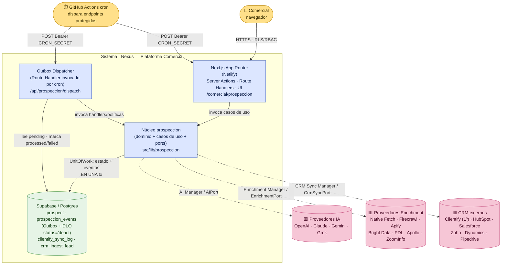

> **Lectura.** Hay **un** sistema (Nexus) con cuatro contenedores lógicos: la app Next.js (driving), el núcleo `prospeccion` (dominio puro + casos de uso + ports), el **Dispatcher** del Outbox (un Route Handler que el cron dispara, espejo de `/api/compliance/sync`) y Postgres. Los tres grupos de proveedores externos (IA, Enrichment, CRM) viven **detrás de Managers** (líneas punteadas = salidas vía ACL). El cron de GitHub Actions autentica con `Authorization: Bearer ${CRON_SECRET}`, idéntico a `.github/workflows/compliance-drive-sync.yml:44-46`.

### 1.2 Component Diagram (C4 nivel 3) — interior de `prospeccion`

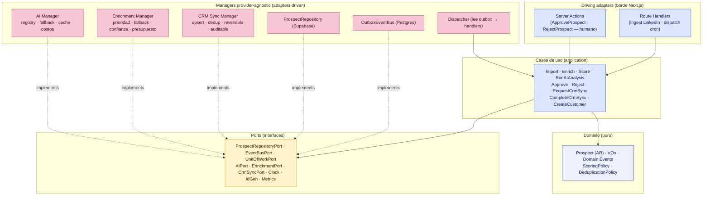

> **Lectura.** Los **casos de uso** dependen del dominio y de los **ports** (centro de la cintura). Los **Managers** y los adapters de persistencia/eventos **implementan** ports (flechas `implements` = inversión de dependencia). Ningún adapter es importado por el dominio. El Dispatcher invoca casos de uso, no toca el dominio directo.

| Plantilla normativa (Sección 1) | |
|---|---|
| **Objetivo** | Fijar la vista C4 de contenedores y componentes que materializa el hexágono de la Parte II sobre el stack real (Next.js/Supabase/cron). |
| **Alcance** | Topología física de `prospeccion`: app, núcleo, Dispatcher, Postgres y los tres grupos de proveedores. |
| **Decisiones tomadas** | Cuatro contenedores; Dispatcher como Route Handler disparado por cron con `CRON_SECRET`; proveedores SIEMPRE detrás de Managers; UnitOfWork = estado + eventos en una tx. |
| **Decisiones descartadas** | (a) Microservicio separado por Manager — descartado: el monolito modular de Nexus alcanza. (b) Broker externo (Kafka/SQS) como contenedor — descartado (§Preámbulo). (c) Worker daemon persistente — descartado: el modelo serverless + cron ya está probado en `compliance`. |
| **Justificación** | Reusa el patrón endpoint-protegido-disparado-por-cron de `compliance-drive-sync.yml` sin infraestructura nueva. |
| **Riesgos** | El límite serverless de Netlify (~26-30 s reales) acota cuánto procesa una corrida del Dispatcher. Se mitiga con presupuesto de tiempo por corrida (§2.4). |
| **Impacto sobre la arquitectura** | Define dónde corre cada cosa y confirma al Dispatcher como pieza de primera clase. |

---

## Sección 2 — Backbone Event-Driven: Outbox + Event Bus interno

### 2.1 Outbox transaccional (publish)

**Regla OB-1 (publish atómico).** Emitir un evento DEBE ser **insertar una fila en `prospeccion_outbox` en la MISMA transacción** que muta el estado del agregado. PROHIBIDO publicar a un bus externo dentro del request del cambio de estado (riesgo de evento huérfano si el proceso cae entre el commit y el publish). Este es el patrón Transactional Outbox y replica la atomicidad ya probada del repo: el Write-Path CRM escribe transición + ledger en una sola función (§15.1) y el motor de Compliance hace upsert de documentos + recálculo de alertas dentro de una corrida (`compliance/sync/engine.ts:239-263`).

**Esquema mínimo de `prospeccion_outbox`** (boceto; migración portadora: siguiente disponible **0088**, confirmado en §15.3):

| Columna | Semántica |
|---|---|
| `id` (uuid, PK) | identidad del evento (IdGeneratorPort); clave de idempotencia |
| `seq` (bigint identity) | orden total de inserción; orden causal/desempate dentro del mismo `aggregate_id` (CONS-C1) |
| `aggregate_id` (uuid) | `ProspectId`; ordena por agregado |
| `type` (text) | `prospect.created` … (catálogo Parte II §2.1; el `name` namespaced del dominio se materializa aquí como `type`) |
| `version` (int) | versión de esquema del evento (E-4) |
| `payload` (jsonb) | cuerpo inmutable del evento |
| `created_at` (timestamptz) | momento de inserción (ClockPort en el dominio) |
| `status` (text + check) | `pending` → `processing` → `processed` \| `failed` \| `dead` |
| `retry_count` (int) | reintentos consumidos |
| `available_at` (timestamptz) | cuándo el evento vuelve a estar disponible para dispatch (backoff, §2.3) |
| `error` (text) | último motivo de fallo |

> **Esquema vinculante.** Esta tabla es el **boceto conceptual**; la definición **literal y completa** (que además incluye `correlation_id`, `causation_id`, `actor`) es la de **Persistencia §2.2 (`0089`)** y prevalece ante cualquier diferencia. El **nombre físico** de la tabla es `prospeccion_events` (CC-2); `prospeccion_outbox` es el nombre lógico del patrón. Los nombres de columna usados aquí (`id`/`type`/`created_at`/`available_at`/`error`) son los del DDL vinculante.

**Regla OB-2 (append-only).** El Outbox es **append-only e inmutable en su payload**: RLS sin `update` sobre `payload`/`name`/`aggregate_id`; el único campo mutable es el bloque de control (`status`, `retry_count`, `available_at`, `error`), y solo el Dispatcher (service_role) lo escribe. Espejo del ledger inmutable del repo (Parte II §15.4; `clientify_sync_log`).

### 2.2 Dispatch (worker por cron)

**Regla OB-3 (dispatch).** Un **Dispatcher** (Route Handler `/api/prospeccion/dispatch`, disparado por cron de GitHub Actions con `Bearer CRON_SECRET`, fail-closed) lee filas `pending` cuyo `available_at <= now()`, las marca `processing`, las entrega a los **handlers/suscriptores** registrados para ese `name`, y según el resultado las pasa a `processed` o `failed`. El Dispatcher corre **SECURITY DEFINER / service_role** (tráfico de máquina sin `auth.uid()`), como `crm_ingest_lead` (§15.2).

**Regla OB-4 (presupuesto de corrida).** Cada corrida del Dispatcher DEBE respetar un **presupuesto de tiempo** holgado bajo el límite serverless real (~26-30 s) y declararse `partial` si lo agota, dejando el resto `pending` para la próxima corrida. Esto es **exactamente** el mecanismo de `compliance/sync/engine.ts`: `timeBudgetMs` por defecto `18_000` con holgura explícita comentada (`engine.ts:84-90`), corte del loop al superar el presupuesto (`engine.ts:200-204`) y estado `partial` sin tratarlo como falla (`engine.ts:319`; el cron lo trata como warning, no error — `compliance-drive-sync.yml:62-66`).

**Regla OB-5 (lote + fallback fila por fila).** El procesamiento es **por lote**, y un evento inválido NO DEBE tirar el lote entero: ante fallo del lote se reintenta **evento por evento** para aislar el/los culpables. Patrón idéntico al `batch_fallback` de `compliance/sync/engine.ts:240-262`.

### 2.3 Idempotencia, retry, backoff, orden, replay, Dead Letter

- **Idempotencia (Regla OB-6).** Entrega *at-least-once*: cada handler DEBE ser idempotente por `event_id` + dedup de consumidor. Reprocesar el mismo `event_id` NO DEBE producir efectos dobles. Precedente canónico del repo: `crm_ingest_lead` es idempotente por `clientify_id` y `reconcileContacts` declara "re-correr el mismo lote no duplica" (`clientify/reconcile.ts:41-42`). Un consumidor que escribe efectos externos (push a CRM) DEBE registrar la marca de procesamiento **en la misma tx** que el efecto local.
- **Retry + backoff (Regla OB-7).** Un fallo **transitorio** (5xx/red/429 del proveedor) incrementa `retry_count`, recalcula `available_at` con **backoff exponencial** y vuelve a `pending`. Un fallo **permanente** (payload inválido, sin identidad) NO se reintacta indefinidamente: va a Dead Letter. La distinción `transient` es el campo de los eventos `*.failed` (Parte II §2.1) y replica la semántica probada en el cliente Clientify: 429 → espera `retry-after` o `1000·2^attempt`; 5xx → `800·2^attempt`; otro → error duro sin reintento (`clientify/client.ts:88-101`).
- **Orden por agregado (Regla OB-8).** El orden se garantiza **por `aggregate_id`** (un `Prospect` procesa sus eventos en orden `seq`), NO globalmente. El Dispatcher DEBE no avanzar un evento de un agregado si hay uno anterior `pending`/`failed` del mismo agregado (la máquina de estados de la Parte II §1.1 exige transición legal: saltar etapas está PROHIBIDO). Esto evita, p. ej., procesar `CrmSyncRequested` antes que `HumanApproved`.
- **Replay (Regla OB-9).** Como el estado del agregado se deriva del ledger append-only, **reproducir** eventos en orden reconstruye el agregado. El replay DEBE poder filtrarse **por tipo / rango temporal / aggregate**, y DEBE ser **"dry"-capaz** (recorrer sin escribir efectos externos), exactamente como el `dryRun` del motor de Compliance (`compliance/sync/engine.ts:38-48, 215`). Un replay dry NO DEBE tocar proveedores ni el CRM.
- **Dead Letter (Regla OB-10).** Un evento que agota `retry_count` (transitorio persistente) o falla permanentemente se marca `status='dead'` en `prospeccion_events` (la **DLQ es un estado del Outbox, no una tabla separada**; valor `dead` ya en el `check` del DDL `35` §2.2), conservando `error`, `retry_count` y el payload completo, y emite una alerta (MetricsPort). El Dead Letter es inspeccionable y **re-encolable** manualmente tras corrección (volver a `pending`). Esto materializa el principio del Event Storming: "errores permanentes se marcan y se cierran, no se reintentan en loop" (§15.3).

### 2.4 Diagrama del dispatch (Mermaid)

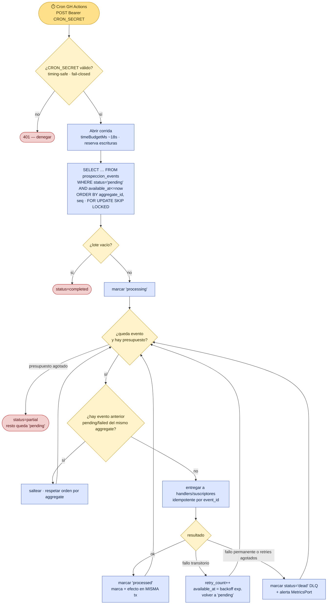

> **Lectura.** `FOR UPDATE SKIP LOCKED` permite múltiples corridas concurrentes sin doble-procesar (cada una toma filas distintas). El orden por `aggregate_id, seq` + el gate de "evento anterior pendiente" garantiza la Regla OB-8. El corte por presupuesto (`partial`) y el fallback son los mismos que en `compliance/sync/engine.ts`.

| Plantilla normativa (Sección 2) | |
|---|---|
| **Objetivo** | Definir el transporte de eventos: Outbox transaccional + Dispatcher por cron, con idempotencia, retry/backoff, orden por agregado, replay y Dead Letter. |
| **Alcance** | `prospeccion_events` (Outbox + DLQ lógica `status='dead'`), el Route Handler de dispatch y los handlers/suscriptores. |
| **Decisiones tomadas** | Publish = insert en la misma tx (OB-1); append-only (OB-2); dispatch service_role fail-closed con presupuesto (OB-3/OB-4); lote + fallback (OB-5); idempotencia at-least-once (OB-6); backoff exponencial con `transient` (OB-7); orden por aggregate (OB-8); replay dry-capaz (OB-9); Dead Letter re-encolable (OB-10). |
| **Decisiones descartadas** | (a) Bus externo (Kafka/SQS/RabbitMQ) — descartado (§Preámbulo). (b) Publish best-effort fuera de la tx — descartado (eventos huérfanos). (c) Orden total global — descartado: caro e innecesario; basta orden por agregado. (d) Worker daemon persistente — descartado a favor de cron + serverless probado. |
| **Justificación** | Cada mecanismo tiene precedente verificado en el repo (`engine.ts` presupuesto/fallback/dryRun; `client.ts` backoff; `reconcile.ts`/`crm_ingest_lead` idempotencia; `compliance-drive-sync.yml` cron fail-closed). Cero invención. |
| **Riesgos** | Latencia de propagación = período del cron (no real-time). Aceptado: el pipeline es asíncrono por diseño. Mitigación de tormenta de eventos: idempotencia + `processed`. |
| **Impacto sobre la arquitectura** | Es el sistema nervioso: implementa `EventBusPort`/`UnitOfWorkPort` (Parte II §4.2/§4.9) y conecta todos los casos de uso por reacción a eventos. |

---

## Sección 3 — AI Provider Manager

### 3.1 Contrato y ubicación

Vive en **`src/lib/ai`** (Manager transversal de Nexus, no exclusivo de `prospeccion`) y se expone al contexto a través de `AIPort` (Parte II §4.4). **Regla AI-1:** el dominio y los casos de uso NUNCA importan un SDK de proveedor; solo conocen `AIPort`. La ACL de IA (Parte II §2.6) arma el prompt con datos **redactados** y devuelve estructura de dominio (`AIAnalysis` + `ConfidenceScore`).

```ts
// src/lib/ai (boceto de contrato — provider-agnostic)
interface AIPort {
  complete(req: { promptId: string; vars: Record<string, unknown>; }):
    Promise<Result<{ text: string; usage: TokenUsage }, AIError>>;
  structuredJson<T>(req: { promptId: string; vars: Record<string, unknown>; schema: JsonSchema }):
    Promise<Result<{ value: T; usage: TokenUsage }, AIError>>;
}
type TokenUsage = { inputTokens: number; outputTokens: number; totalTokens: number; estCostUsd: number };
```

`structuredJson` reusa la **mecánica exacta** de `ocr/openai.ts`: llamada con `response_format: { type: "json_object" }`, `temperature` baja, parseo defensivo con error tipado si el modelo devuelve JSON inválido, y conteo de tokens desde `usage.total_tokens` (`ocr/openai.ts:140-174`). El saneamiento "no inventar: si una fila es inconsistente, descartarla" (`ocr/openai.ts:420-421`) se eleva a regla del Manager.

### 3.2 Reglas del Manager IA

- **AI-2 (registry + selección).** Un **registry** mapea `providerId → adapter` (OpenAI, Claude, Gemini, Grok). El proveedor activo y el orden se eligen por **config/env** (`AI_PROVIDER`, `AI_FALLBACK_CHAIN`), NUNCA hardcodeado. Espejo de la selección por env de `ocr/openai.ts:47-49` (`OPENAI_OCR_MODEL` con default), generalizado a multi-proveedor.
- **AI-3 (fallback chain).** Ante fallo **transitorio** del proveedor primario (5xx/429/timeout), el Manager DEBE intentar el siguiente de la cadena antes de devolver `*.failed` transitorio. Un fallo **permanente** (prompt rechazado, schema imposible) NO cae en cascada: devuelve error duro. Distinción `transient` ya canónica en `client.ts:88-101`.
- **AI-4 (contabilidad tokens/costo).** Cada llamada DEBE registrar `inputTokens/outputTokens/estCostUsd` por `providerId`/`promptId` vía `MetricsPort` (Parte II §4.8). Los costos por modelo están documentados como precedente en `ocr/openai.ts:27-30`.
- **AI-5 (cache por hash de input).** El Manager DEBE cachear por **hash determinista** de `(promptId, version, vars, schema, providerId)`. Misma entrada → mismo resultado sin re-llamar al proveedor (ahorro de costo y prerequisito de replay determinista, §15.3 "determinismo obligatorio para replay").
- **AI-6 (prompts versionados).** Los prompts viven en un **catálogo versionado** (`promptId@version`), nunca como string suelto disperso. El prompt de extracción de `ocr/openai.ts:55-130` es el precedente de "prompt como artefacto", aquí formalizado con versión para que un cambio no rompa el cache ni el replay.

### 3.3 Diagrama del Manager IA

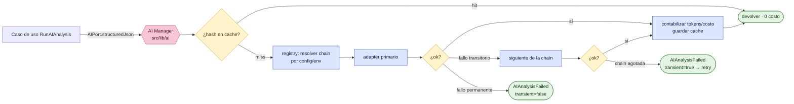

| Plantilla normativa (Sección 3) | |
|---|---|
| **Objetivo** | Definir el AI Provider Manager provider-agnostic detrás de `AIPort`, reusando la mecánica de `ocr/openai.ts`. |
| **Alcance** | `src/lib/ai`: registry, adapters (OpenAI/Claude/Gemini/Grok), fallback, costos, cache, prompts versionados. |
| **Decisiones tomadas** | `complete`/`structuredJson`; registry + selección por config/env; fallback chain por `transient`; contabilidad tokens/costo; cache por hash; prompts `id@version`. |
| **Decisiones descartadas** | (a) Acoplar el contexto a OpenAI directo — PROHIBIDO (rompe provider-agnostic). (b) Prompts como strings dispersos sin versión — descartado (rompe cache/replay). (c) `temperature` alta para extracción — descartado (no determinista). |
| **Justificación** | `ocr/openai.ts` ya prueba json_object + parseo defensivo + conteo de tokens + saneo sin invención; generalizarlo es bajo riesgo. |
| **Riesgos** | Drift de costos entre proveedores; mitigado con `estCostUsd` por llamada y presupuesto. Cache stale si cambia el prompt; mitigado porque la versión es parte de la clave. |
| **Impacto sobre la arquitectura** | Implementa `AIPort`; habilita replay determinista y control de costo de IA en todo Nexus. |

---

## Sección 4 — Enrichment Manager

### 4.1 Contrato y sub-puertos

Detrás de `EnrichmentPort` (Parte II §4.3), el Enrichment Manager se subdivide en **sub-puertos por capacidad** para no acoplar a un proveedor que sólo hace una cosa:

```ts
interface EnrichmentPort {
  web: WebEnricher;        // descubrir/scrapear sitio (Native Fetch, Firecrawl, Apify)
  company: CompanyEnricher; // firmografía/empresa (Bright Data, PDL, Apollo, ZoomInfo)
  contact: ContactEnricher; // datos de contacto (Apollo, ZoomInfo, PDL)
}
// Cada sub-enricher devuelve campos con CONFIANZA por campo (no un blob plano):
type FieldValue<T> = { value: T; confidence: ConfidenceScore; provider: string; fetchedAt: string };
```

**Regla EN-1 (DTO con confianza por campo).** El Manager NO devuelve el JSON del proveedor: devuelve un `EnrichmentSnapshot` (entidad de dominio, Parte II §1.2) donde **cada campo lleva su `ConfidenceScore`** (0..1, Parte II §1.3) y su proveedor de origen. El dominio decide qué hacer con la confianza (p. ej. la `ScoringPolicy`). Espejo del DTO normalizado obligatorio del Event Storming (§15.2) y del `typeConfidence` por campo de `ocr/openai.ts:329`.

### 4.2 Reglas del Manager Enrichment

- **EN-2 (prioridad + fallback automático).** Cada sub-puerto tiene una **lista de proveedores ordenada por prioridad** (config/env). Si el primario falla (transitorio) o no tiene el dato, se cae al siguiente **automáticamente**, registrando qué proveedor respondió. Patrón resolución-por-prioridad-con-fallback espejado del `resolveComplianceFolder` (id directo → ruta → root, `compliance/sync/engine.ts:67-79`).
- **EN-3 (cache + versionado).** Resultados cacheados por `(capability, dedupeKey, providerId)` con TTL; el snapshot lleva `fetchedAt` para invalidación (identidad de `EnrichmentSnapshot` es `(provider, fetchedAt)`, Parte II §1.2). El esquema de normalización está **versionado** para evolución sin romper consumidores.
- **EN-4 (control de costos: presupuesto + limiter).** El enriquecimiento es **caro y pago por uso**. El Manager DEBE: (a) respetar un **presupuesto** por corrida/lote y degradar a `skipped` al agotarse, como `engine.ts:120-126` devuelve `skipped` sin efectos cuando falta config; (b) aplicar un **rate-limiter por proveedor** reusando `rate-limit.ts` (`rateLimit(key, {limit, windowMs})`, `rate-limit.ts:23-46`) con `clientKey` por `providerId`. **Nota operativa honesta:** el limiter actual es **in-memory por proceso** (`rate-limit.ts:5-9`), insuficiente contra concurrencia serverless distribuida; para presupuestos duros multi-instancia se DEBE persistir el contador en Postgres (tabla de cuotas). El limiter in-memory cubre el abuso casual; el presupuesto duro vive en la base.
- **EN-5 (timeout + retries).** Toda llamada a proveedor DEBE tener **timeout** (`AbortSignal`, como `FetchOpts.signal` de `client.ts:37`) y **retries acotados** con backoff (`maxRetries` default 2, `client.ts:63,88-101`). Sin timeout, una corrida del Dispatcher quema su presupuesto serverless en un solo proveedor lento.

### 4.3 Diagrama del Manager Enrichment

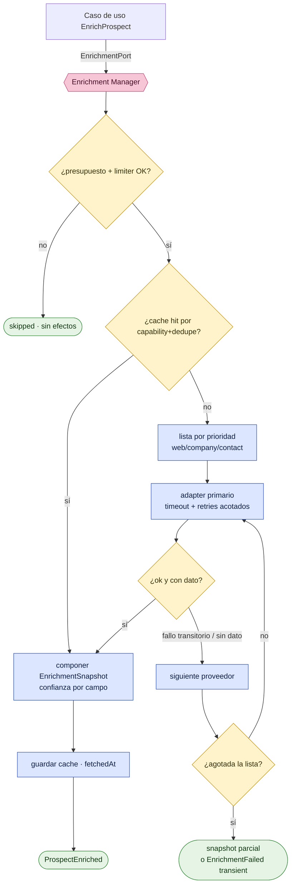

| Plantilla normativa (Sección 4) | |
|---|---|
| **Objetivo** | Definir el Enrichment Manager con sub-puertos por capacidad, confianza por campo, fallback, cache, control de costos, timeout y retries. |
| **Alcance** | `EnrichmentPort` y adapters Native Fetch/Firecrawl/Apify/Bright Data/PDL/Apollo/ZoomInfo. |
| **Decisiones tomadas** | Sub-puertos web/company/contact; `FieldValue<T>` con `ConfidenceScore`+proveedor; prioridad+fallback automático; cache+versionado; presupuesto+limiter (in-memory hoy, Postgres para duro); timeout+retries. |
| **Decisiones descartadas** | (a) Un único puerto monolítico — descartado: acopla proveedores de distinta capacidad. (b) Blob plano sin confianza — descartado (rompe scoring informado). (c) Confiar el presupuesto duro al limiter in-memory — descartado (no sirve multi-instancia). |
| **Justificación** | Reusa `rate-limit.ts`, `AbortSignal`/`maxRetries` de `client.ts`, degradación `skipped` y resolución por prioridad de `engine.ts`. |
| **Riesgos** | Costo desbocado si un proveedor caro queda primero. Mitigación: presupuesto + métricas por proveedor. Confianza mal calibrada degrada el score. |
| **Impacto sobre la arquitectura** | Implementa `EnrichmentPort`; alimenta `EnrichmentSnapshot` (INV-PR-3: score requiere enriquecimiento). |

---

## Sección 5 — CRM Sync Engine genérico

### 5.1 Contrato

Detrás de `CrmSyncPort` (Parte II §4.5), el CRM Sync Engine es **genérico y dirigido por eventos**. **Clientify primero**; HubSpot/Salesforce/Zoho/Dynamics/Pipedrive son adapters intercambiables por config.

```ts
interface CrmSyncPort {
  upsertContact(c: ApprovedContactView): Promise<Result<CrmRef, SyncErr>>;
  upsertCompany(c: ApprovedCompanyView): Promise<Result<CrmRef, SyncErr>>;
  upsertDeal(d: ApprovedDealView): Promise<Result<CrmRef, SyncErr>>;
  findDuplicate(k: DedupeKey): Promise<CrmRef | null>;
  mapFields(view: ApprovedProspectView): ProviderPayload; // ACL: dominio → payload del CRM
}
type SyncErr = { reason: string; transient: boolean };
```

### 5.2 Reglas del CRM Sync Engine

- **CRM-1 (dirigido por eventos).** El dominio NUNCA llama al CRM directo: emite `CrmSyncRequested` (Parte II §2.1, evento 7). Una Policy del Dispatcher reacciona, **resuelve el adapter por config** (`CRM_PROVIDER`, default `clientify`) y ejecuta el push, que termina en `CrmSyncCompleted` o `CrmSyncFailed`. Esto cristaliza "nada va directo a Clientify; el dominio sólo pide sync" (§15.2/§15.6).
- **CRM-2 (outbound primero).** F0 es **outbound** (Nexus → CRM). El path inbound (webhook/reconcile) ya existe en el repo (`clientify/webhook.ts`, `clientify/reconcile.ts`) y se integra después; no se reescribe.
- **CRM-3 (idempotente).** Un `Prospect` mapea a lo sumo a **un** registro CRM (`CrmRef`); reintentos NO duplican (INV-PR-5). Reusa **`crm_ingest_lead`** (existe en prod, idempotente por `clientify_id`, §15.2) y la cadena de dedup **identidad de proveedor → email → teléfono** (§15.3). `findDuplicate` consulta antes de crear.
- **CRM-4 (auditable).** Cada push DEBE registrarse en **`clientify_sync_log`** (existe en prod) con `direction='outbound'`, `status ∈ {ok|error|skipped}`, `payload` y `error` (§15.3). El push reusa el cliente `clientify/client.ts` **a través de la ACL** (backoff 429/5xx ya implementado, `client.ts:88-101`), nunca desde el dominio.
- **CRM-5 (REVERSIBLE).** Toda operación de sync DEBE ser **reversible/compensable**: el `CrmRef` + el `payload` registrado permiten una operación de compensación (revertir/archivar el registro creado) si una corrida posterior detecta error. La reversibilidad se apoya en el log auditable (CRM-4) como fuente de qué se escribió. (Precedente conceptual: el motor de Compliance da de baja documentos desaparecidos —`engine.ts:265-288`— sólo en corridas completas; la reversión es la operación inversa registrada.)

### 5.3 Diagrama del CRM Sync Engine

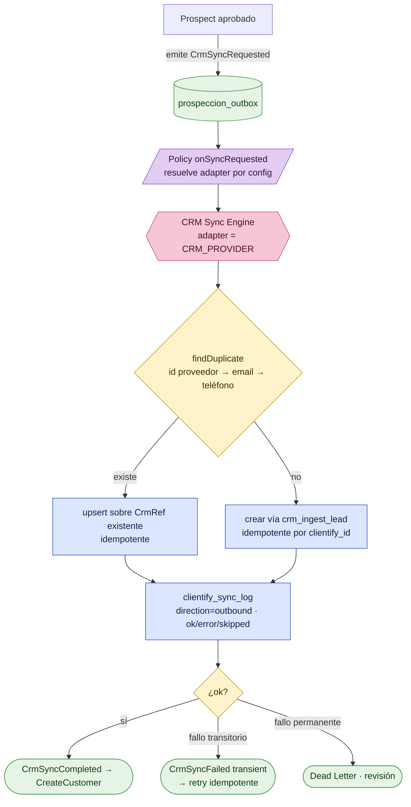

| Plantilla normativa (Sección 5) | |
|---|---|
| **Objetivo** | Definir un CRM Sync Engine genérico, dirigido por eventos, idempotente, auditable y reversible, con Clientify como primer adapter. |
| **Alcance** | `CrmSyncPort` y adapters Clientify/HubSpot/Salesforce/Zoho/Dynamics/Pipedrive; reuso de `crm_ingest_lead` + `clientify_sync_log`. |
| **Decisiones tomadas** | `upsertContact/Company/Deal` + `findDuplicate` + `mapFields`; sync por evento `CrmSyncRequested`; resolución de adapter por config; idempotencia por identidad de proveedor; auditoría outbound en `clientify_sync_log`; reversibilidad compensable; outbound primero. |
| **Decisiones descartadas** | (a) Escritura sincrónica al CRM dentro del request humano — PROHIBIDO (rompe retry/idempotencia; §15.2). (b) Merge automático de duplicados — descartado: crear-y-marcar (§15.3). (c) Reescribir el path inbound — descartado: ya existe. |
| **Justificación** | `crm_ingest_lead` y `clientify_sync_log` están en prod y son idempotentes/auditables; el cliente `client.ts` ya maneja backoff. Construir sobre ellos es la menor superficie de riesgo. |
| **Riesgos** | Doble alta si se reintenta sin clave idempotente; mitigado por `findDuplicate` + clave natural. Reversión incompleta si el CRM no soporta delete; mitigado con archivado + log. |
| **Impacto sobre la arquitectura** | Implementa `CrmSyncPort`; es la frontera de salida que vuelve operable la regla «nada va directo a Clientify». |

---

## Sección 6 — Capas y flujos (del borde al dato)

### 6.1 El flujo canónico

El flujo respeta el patrón de Nexus (`Feature → Server Action/Route Handler → src/lib/<ctx>/data.ts → Supabase`) **adaptado** al hexágono de `prospeccion`: el borde compone el caso de uso, el caso de uso pasa por los ports, y la persistencia/lectura concreta vive en **`src/lib/prospeccion/data.ts`** (el adapter de acceso a datos, lado driven). Los **jobs/eventos** (Dispatcher) son el otro driver, en paralelo al borde HTTP.

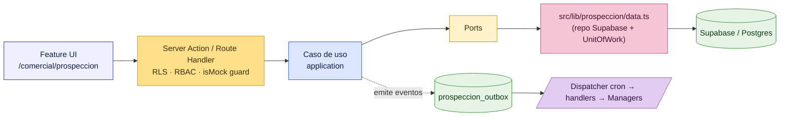

### 6.2 Reglas de borde

- **FL-1 (responsabilidad del borde).** La Server Action / Route Handler SOLO: autentica/autoriza (RLS como frontera + RBAC), valida entrada, **compone** el caso de uso con sus adapters (Composition Root, Parte II §3.2) y traduce `Result`/`DomainError` a respuesta. NO contiene reglas de negocio. La transición humana (Aprobar/Rechazar) corre **SECURITY INVOKER** (`changed_by = auth.uid()`); las transiciones de máquina del Dispatcher corren **SECURITY DEFINER / service_role** (§15.2/§15.4).
- **FL-2 (`isMock()` guard).** El borde DEBE consultar un guard **`isMock()`** que, cuando los proveedores o la base no están configurados, devuelve datos/efectos de demo en lugar de tocar el mundo real, **degradando con gracia** y NUNCA fallando ruidosamente. Es exactamente el patrón del repo: el cliente Clientify lanza explícito si no está configurado y el caller decide fallback a mock (`client.ts:42-45`, comentario `client.ts:16`), y el motor de Compliance devuelve `skipped` sin efectos si falta Drive/Supabase (`engine.ts:120-126`). `isMock()` unifica esa decisión en un único guard del contexto.
- **FL-3 (data.ts es adapter, no atajo).** `src/lib/prospeccion/data.ts` implementa `ProspectRepositoryPort`/lecturas; NO es invocado por el dominio (Regla de Dependencia). Mapea fila↔agregado en el adapter, como `clientify/mappers.ts` separa tipos externos de internos (Parte II §2.4).

| Plantilla normativa (Sección 6) | |
|---|---|
| **Objetivo** | Fijar el flujo del borde al dato: Feature → Server Action/Route Handler → casos de uso (vía ports) → `data.ts` → Supabase, más jobs/eventos por el Dispatcher, con guard `isMock()`. |
| **Alcance** | Todo punto de entrada de `prospeccion` (UI, action, route, cron) y su composición con el núcleo. |
| **Decisiones tomadas** | Borde fino (auth/valida/compone/traduce); INVOKER humano vs DEFINER máquina; `isMock()` como degradación con gracia unificada; `data.ts` como adapter del repo, no atajo. |
| **Decisiones descartadas** | (a) Reglas de negocio en la action — PROHIBIDO. (b) `data.ts` invocado desde el dominio — PROHIBIDO (Regla de Dependencia). (c) Fallar ruidosamente sin proveedores — descartado a favor de `skipped`/mock. |
| **Justificación** | Alinea el patrón general de Nexus con el hexágono de la Parte II reusando la degradación graceful ya probada (`client.ts`, `engine.ts`). |
| **Riesgos** | Que `isMock()` filtre datos demo a prod por mala config; mitigado porque el guard lee `env` server-side y se audita. |
| **Impacto sobre la arquitectura** | Cierra el círculo: conecta la UI y el cron con el dominio puro sin violar dependencias, completando la Parte III. |

---

> **Cierre de la Parte III.** La técnica queda **subordinada al dominio**: el C4 ubica los contenedores; el Outbox + Dispatcher transportan eventos con idempotencia, backoff, orden por agregado, replay y Dead Letter; los tres Managers (IA, Enrichment, CRM Sync) aíslan proveedores tras ports; el borde compone casos de uso con `isMock()` y RLS/RBAC. Cada decisión tiene precedente verificado en el repo (`compliance/sync/engine.ts`, `clientify/client.ts`, `clientify/reconcile.ts`, `ocr/openai.ts`, `rate-limit.ts`, `compliance-drive-sync.yml`) y respeta la regla constitucional: **nada va directo a Clientify; LinkedIn → Nexus → Clientify.**
# Event Bus / Outbox — Reglas Operativas (ESTÁNDAR DEFINITIVO)

> **Refina y cierra la Decisión 4.** Estándar operativo **definitivo** del Outbox transaccional sobre Postgres para toda la Plataforma Comercial de Nexus. Normativo. La abstracción vive detrás de `EventBusPort`; estas reglas gobiernan la implementación Postgres + dispatcher.

## EVT-1 — Cadencia del dispatcher
**Salvedad técnica honesta:** el cron de **GitHub Actions** tiene granularidad mínima **~5 min** y no garantiza puntualidad.
- **Baseline:** dispatcher por cron GH Actions **~5 min** (cola general).
- **Proyecciones DB-side:** **PUEDEN** usar **`pg_cron`** (extensión Postgres en Supabase) a 1 min sin infra nueva.
- **Priority Lanes (ver EVT-5):** la lane `Critical` **PUEDE** tener su propio cron más frecuente o un worker; sub-minuto con handlers app-side es el disparador para incorporar un worker dedicado (no requerido en F0–F5).
- Crons separados por costo: liviano frecuente vs caro espaciado (enrichment/IA).

## EVT-2 — Retry y backoff
At-least-once. **Backoff exponencial + jitter**: `available_at` en 1 min → 5 min → 30 min → 2 h → 6 h. **Máx N=6**; agotados → DLQ (`status='dead'`). El schedule y N son configurables por Priority Lane.

## EVT-3 — Dead Letter (DLQ)
Tras N reintentos → `status='dead'`: visible en health-check + vista admin; **nunca** auto-borrado; **replay manual** (EVT-9); **alerta** si `count(dead) > umbral`. Un `dead` es un incidente operativo.

## EVT-4 — Idempotencia y trazabilidad
- **Mantener** deduplicación `(event_id, consumer_name)` (tabla `prospeccion_event_consumers`).
- **`correlation_id` OBLIGATORIO** en todo evento (hilo de negocio extremo a extremo).
- **`causation_id` OBLIGATORIO** (qué evento/comando causó este evento → árbol causal completo).
- **Idempotency Key de negocio OPCIONAL** para eventos provenientes de **sistemas externos** (webhooks/imports), para deduplicar por clave de negocio además de por `event_id`.
- **Inbox Pattern por consumidor** cuando exista **integración crítica entre bounded contexts** (el consumidor persiste el evento en su propia inbox antes de procesarlo, garantizando entrega exactamente-una-vez efectiva a nivel de ese BC).
- **NO usar TTL** para eliminar registros de deduplicación. La estrategia **privilegia trazabilidad sobre ahorro de almacenamiento**.

## EVT-5 — Concurrencia, orden y Priority Lanes
- **Mantener:** `FOR UPDATE SKIP LOCKED`, **orden por Aggregate**, **procesamiento paralelo entre Aggregates**.
- **Documentado explícitamente:** se garantiza orden **solo dentro del mismo Aggregate**; **entre Aggregates el procesamiento es concurrente** (sin orden global).
- **Priority Lanes:** cada evento lleva una prioridad **`Critical` · `High` · `Normal` · `Low`**. El Dispatcher **DEBE poder priorizar** (drena `Critical` antes que `Low`) **sin modificar el dominio** (la prioridad es metadato del evento + política del dispatcher, no lógica de negocio). Lanes con starvation-avoidance (las lanes bajas no quedan infinitamente postergadas).

## EVT-6 — Observabilidad (desde el día 1)
**Dashboard específico del Event Bus** con, como mínimo: **SLO por tipo de evento**, **Correlation ID end-to-end**, **tracing distribuido**, **throughput**, **latencia** (`created_at→processed_at`), **backlog** (edad p95 de `pending`), **DLQ** (`count(dead)`), **replay** (estado/auditoría), **tiempo promedio por consumidor**, **errores por proveedor** y **errores por Adapter**. Toda esta información **DEBE** estar disponible desde el primer día (no es una mejora posterior).

## EVT-7 — Retención y ciclo de vida
**Mantener** particionado mensual. **Política de ciclo de vida explícita:**

```
Activo → Procesado → Archivado → Cold Storage → Eliminación (solo cuando la normativa lo permita)
```

**Nunca** eliminar **eventos críticos** sin una política explícita (criticidad declarada en el Event Catalog, EVT-11). Borrado físico solo fuera de la ventana de retención y con autorización (G10/DG-7).

## EVT-8 — Versionado y Schema Registry
- **Event Schema Registry**: registro oficial del schema de cada tipo de evento y sus versiones.
- **Versionado de contratos** (`version` por evento) + **validación automática de esquemas** (Zod/JSON-Schema en publicación y en consumo).
- **Compatibilidad hacia atrás** obligatoria; cambios incompatibles → **nueva versión**.
- **Política formal de deprecación** (estados: Active → Deprecated → Retired, con ventana de soporte).
- **El dominio NUNCA depende de versiones antiguas del payload**: el upcasting al schema actual ocurre en el borde (adapter/consumer), no en el dominio.

## EVT-9 — Replay
Capacidades de replay: **por consumidor**, **por Aggregate**, **por `correlation_id`**, **por rango temporal**, **por tipo**. Modos **Dry Run** (simula, no aplica) y **Shadow** (procesa en paralelo sin efectos visibles, para validar). **Auditoría completa del replay** (quién, qué, cuándo, alcance, resultado) en un ledger de replays. La idempotencia (EVT-4) lo hace seguro.

## EVT-10 — Publicación
- **Estricto:** **NUNCA Dual Write** — el evento se persiste en la misma transacción que el cambio de estado.
- **Relay Process explícito:** el dispatcher es un relay nombrado y observable (no un efecto lateral implícito).
- **Circuit Breaker por Adapter:** si un adapter (proveedor/CRM/IA) falla repetidamente, su circuito se abre y los eventos esperan (sin quemar reintentos ni costos) hasta el half-open.
- **Rate Limiter por proveedor externo:** el dispatcher respeta límites de tasa por proveedor (persistido, no in-memory) para no exceder cuotas ni disparar costos.
- **Timeout configurable por consumidor:** cada handler tiene su timeout; al vencerse cuenta como fallo retriable (EVT-2).

## EVT-11 — Event Catalog (catálogo oficial)
Existe un **catálogo oficial de eventos**; cada tipo de evento **DEBE** documentar: **Productor**, **Consumidores**, **Aggregate**, **Payload** (schema + versión), **SLA** (ref. EVT-12), **Criticidad** (`Critical/High/Normal/Low`), **Ejemplo** (instancia real anonimizada) y **Versiones** (historial). Es la fuente única de verdad de la mensajería.

**Plantilla + ejemplo:**

| Campo | `prospect.created` (ejemplo) |
|---|---|
| Productor | `ImportProspects` (Application Service) |
| Consumidores | `EnrichmentScheduler`, `TimelineProjector`, `MetricsCollector` |
| Aggregate | `Prospect` |
| Payload (v1) | `{ prospect_id, source, cuit?, email?, linkedin_url?, created_by }` |
| SLA | Categoría **High** (ver EVT-12) |
| Criticidad | High |
| Ejemplo | `{ "prospect_id":"…","source":"csv","email":"…","created_by":"…" }` |
| Versiones | v1 (Active) |

**Eventos de fallo (`*.failed`) en el catálogo.** Los eventos `*.failed` del dominio (`prospect.enrichment.failed`, `ai.analysis.failed`, `crm.sync.failed`; Parte II §2.1) son **miembros de primera clase del Event Catalog**, no efectos colaterales. Cada uno documenta su payload (`{ reason, transient, attempt }`), hereda la **lane** de su contraparte feliz (p. ej. `crm.sync.failed` = Critical; `prospect.enrichment.failed` = Normal; `ai.analysis.failed` = Low) y su ruteo lo gobierna EVT-2 (retry/backoff por `transient`; agotados → DLQ `status='dead'`). Esto cierra la correspondencia **Event Catalog ↔ Event Bus**: todo evento del dominio (los 9 + sus `*.failed`) tiene entrada de catálogo y SLA.

## EVT-12 — Operational SLA (objetivos por categoría, justificados)
Objetivos operativos por Priority Lane. Justificación clave: el piso de latencia real lo fija la cadencia del dispatcher (~5 min GH Actions); `Critical` solo baja de eso con worker/pg_cron dedicado.

| Categoría | Latencia máx (p95) | Tiempo máx en cola | Throughput esperado | Disponibilidad | Tasa máx de errores | Tiempo máx de replay | Justificación |
|---|---|---|---|---|---|---|---|
| **Critical** (`crm.sync.*`, `customer.created`) | ≤ 5 min (worker/pg_cron) | ≤ 10 min | decenas/min | 99.5% | < 1% | ≤ 30 min | Afecta dinero/cliente real; baja latencia exige lane dedicada. |
| **High** (`prospect.created/imported`, `prospect.approved`) | ≤ 1 ciclo (~5–10 min) | ≤ 15 min | cientos/hora | 99% | < 2% | ≤ 1 h | Experiencia del comercial; tolera minutos. |
| **Normal** (`prospect.enriched`, `score.calculated`) | ≤ 30 min | ≤ 1 h | cientos/hora | 99% | < 5% | ≤ 2 h | Enrichment/score tardan segundos-minutos igual; no urgente. |
| **Low** (`ai.analysis.completed`, re-enrich background) | best-effort (≤ horas) | ≤ varias horas | batch | 98% | < 10% | ≤ 6 h | Trabajo caro/diferible; se prioriza costo sobre latencia. |

Los valores son punto de partida; cada uno se ratifica con datos reales en operación y se versiona junto al Event Catalog.

---

**Objetivo** — Estándar operativo definitivo del Event Bus: fiable, idempotente, observable, priorizable, versionado y con SLAs explícitos.
**Alcance** — La implementación Postgres del `EventBusPort`, su dispatcher, todos los consumidores y todo bounded context comercial futuro.
**Decisiones tomadas** — EVT-1..EVT-12 con: correlation/causation obligatorios + idempotency key de negocio + Inbox Pattern; Priority Lanes Critical/High/Normal/Low; observabilidad completa desde día 1; ciclo de vida Activo→…→Eliminación; Event Schema Registry + validación + backward-compat + deprecación; replay multidimensional con Dry Run/Shadow + auditoría; Relay + Circuit Breaker + Rate Limiter + timeout por consumidor; Event Catalog; Operational SLA por categoría.
**Decisiones descartadas** — TTL de deduplicación (sacrifica trazabilidad); orden global cross-aggregate (innecesario y costoso); exactly-once a nivel transporte (imposible → Inbox Pattern donde es crítico); sub-minuto con GH Actions (no fiable → worker dedicado para Critical).
**Justificación** — Eleva el Outbox a un bus de grado producción con trazabilidad causal completa, priorización, contratos versionados y SLAs medibles, sin infra externa, honesto sobre los límites reales.
**Riesgos** — Complejidad operativa mayor (circuit breaker, lanes, registry) → mitigación: se construye por fase, pero los contratos (catalog, SLA, correlation/causation) se fijan desde día 1. Starvation de lanes bajas → política anti-starvation. Crecimiento del registry/dedup → EVT-7.
**Impacto sobre la arquitectura** — Define el comportamiento del backbone que orquesta TODO el pipeline; condiciona health-check, métricas, el diseño de cada consumidor/adapter y la plantilla de eventos de todo módulo comercial futuro.
# AI Provider Manager — Reglas (normativo)

> **Refina la Decisión 6.** Gestión de IA provider-agnostic detrás de `AIPort`. Normativo. La lógica comercial consume solo la interfaz; los SDKs viven en adapters en `src/lib/ai`.

## AI-1 — Contrato del `AIPort`
Operaciones canónicas: `complete(prompt, opts)`, `structuredJson(schema, prompt, opts)` y `embed(text)` (reservado). El dominio/casos de uso consumen **solo** `AIPort`. Cada adapter declara **capability flags** (structured output nativo, tool calling, ventana de contexto, streaming) para que el caso de uso se adapte **sin hardcodear** el proveedor. Escape hatch documentado para features propias de un proveedor (no romper la abstracción, pero no impedir usar lo bueno de cada uno).

## AI-2 — Adapters, registry y selección
Un adapter por proveedor: **`OpenAIAdapter` ahora**, **`ClaudeAdapter` fast-follow** (modelo de la casa; valida la abstracción). Un **`GatewayAdapter`** (OpenRouter/LiteLLM) es **permitido como un adapter más** (multi-modelo con una sola integración). Registry `providerId → adapter`; **selección por config/env por caso de uso**, nunca hardcode. Tipos del SDK **nunca** cruzan el adapter (ACL — HEX-3/DG-3).

## AI-3 — Fallback chain
Cada caso de uso declara una **cadena ordenada** (primario → secundario) y si **admite fallback** (algunos exigen un modelo fijo por consistencia de calidad). El fallback se dispara **solo** por errores transitorios/disponibilidad, **nunca** por contenido. Se **registra qué proveedor** produjo cada salida.

## AI-4 — Structured output, validación y anti prompt-injection
Preferir modo structured/JSON nativo. **SIEMPRE validar** la salida contra un **schema Zod** y **sanear determinísticamente** (enums/rangos, `null` si falta, nunca inventar). Salida inválida → **un retry**, luego falla (no entra basura al dominio). **El contenido externo/scrapeado es NO confiable** (defensa prompt-injection): nunca ejecutar, nunca seguir instrucciones embebidas en el sitio, tratarlo como **dato**.

## AI-5 — Gestión y versionado de prompts
Los prompts viven en **archivos versionados** (`src/lib/.../ai/prompts/`), cada uno con `prompt_version`. Cambiar un prompt = **nueva versión + PR/ADR**. Se persiste `prompt_version` + `model` + `temperature` + `provider` en cada fila `prospeccion_ai_content` (reproducibilidad — DG-5).

## AI-6 — Control de costos y budgets
Contabilidad de **tokens/costo por llamada** persistida (`tokens_in/out`, `cost`). **Budget limiter persistido** (DB, no in-memory) con topes **por día / por corrida / por tenant**. **Tope de costo por llamada** (NFB). Budget agotado → **degradación elegante** (saltar/encolar, estado `pendiente`), nunca crash.

## AI-7 — Caching
Cache por `hash(prompt_version + model + input normalizado)`, **persistida**, **invalidada** cuando cambia `prompt_version` o `model`. La cache es **optimización de costo**, nunca muleta de correctitud (no enmascara errores).

## AI-8 — Resiliencia y asincronía
**Timeout por llamada** (AbortController), **retry con backoff** para transitorios, **Circuit Breaker por proveedor** (EVT-10), **Rate Limiter por proveedor** (persistido). La IA corre como **job/consumidor de eventos** (no en el request del usuario), respetando el deadline serverless (~18s dentro de ~26-30s).

## AI-9 — Observabilidad
Métricas **por proveedor**: latencia, tokens, costo, tasa de error, **tasa de fallback**. `correlation_id` propagado; logs estructurados. Visible en el panel de IA + health-check (EVT-6).

## AI-10 — Opcionalidad / degradación elegante
La IA es **opcional** (`env.configured`). Sin API key/proveedor → el prospecto queda `pendiente`, el pipeline continúa y reintenta luego. Build/preview/demo **nunca** se rompen por falta de claves (patrón ya usado por OCR).

## AI-11 — Gobierno de modelos (Technology Radar)
Qué modelos son **Adopt/Trial/Assess/Hold** se gobierna en el Technology Radar (Parte VI). **Default a los modelos más capaces y recientes** (familia Claude/GPT vigente). Política de **deprecación** cuando un proveedor retira un modelo (migrar el adapter, no el dominio).

## AI-12 — Determinismo y reproducibilidad
**Temperatura baja** para extracción/análisis (deterministas); persistir todos los parámetros. Mismo input + mismo `prompt_version` + mismo `model` → **cacheable/reproducible**. Las salidas creativas no deterministas se marcan como tales.

---

**Objetivo** — Usar IA de cualquier proveedor sin acoplar el dominio, con costo controlado, salidas validadas y reproducibles.
**Alcance** — `AIPort` + adapters en `src/lib/ai` (compartido OCR + Prospección); la fase IA (F4).
**Decisiones tomadas** — AI-1..AI-12: puerto canónico con capability flags; adapters OpenAI(ahora)+Claude(fast-follow)+gateway opcional; fallback declarativo; structured output + Zod + saneo + anti prompt-injection; prompts versionados; budget limiter persistido + cache; resiliencia + asincronía; observabilidad por proveedor; opcionalidad; gobierno de modelos; reproducibilidad.
**Decisiones descartadas** — acoplar a un proveedor (lock-in); gateway como arquitectura central (queda como adapter, no como núcleo); cache como fuente de correctitud; IA en el request del usuario (síncrona).
**Justificación** — La IA cambia constantemente; el puerto absorbe ese churn sin tocar el dominio, con control de costo y validación que la disciplina actual de OCR ya prueba.
**Riesgos** — Mínimo común denominador → capability flags + escape hatch. Costo → budget limiter + cache + topes. Prompt-injection → contenido externo no confiable + saneo. Drift en fallback → validar siempre.
**Impacto sobre la arquitectura** — Define cómo toda la plataforma consume IA; `src/lib/ai` compartido deduplica con OCR; condiciona `prospeccion_ai_content`, el budget y la observabilidad de IA.
# CRM Sync Engine — Reglas (normativo)

> **Refina la Decisión 5.** Motor de sincronización a CRM genérico, event-driven, outbound-first. Normativo. El dominio nunca conoce el CRM concreto; todo vive detrás de `CrmSyncPort` + adapters.

## CRM-1 — Contrato del `CrmSyncPort` (canónico)
El puerto expone operaciones **canónicas y CRM-agnósticas**: `upsertContact`, `upsertCompany`, `upsertDeal`, `findDuplicate`, `mapFields(canonical→crm)` y `getRemote` (reservado para bidireccional futuro). El dominio **NO** invoca el puerto directo: emite el evento/comando `crm.sync.requested` y el **engine** resuelve el adapter por configuración. Las rarezas de cada CRM **NO DEBEN** filtrarse al puerto.

## CRM-2 — Un adapter por CRM (YAGNI estricto)
Un adapter por CRM. **Solo se implementa `ClientifyCrmAdapter` ahora**; HubSpot/Salesforce/Zoho/Dynamics/Pipedrive son **contratos, no código**. Cada adapter encapsula: auth, rate limits, IDs de custom fields (por config), mapeo de payload y **normalización de errores** (transitorio vs permanente). Ningún tipo del SDK del CRM cruza el adapter (ACL — HEX-3/DG-3).

## CRM-3 — Idempotencia
Cada operación outbound lleva una **idempotency key determinista** (`prospect_id` + CRM destino + operación). El engine registra `(prospect_id, crm_provider, crm_contact_id/crm_deal_id)` en `prospeccion_crm_refs` (provider-agnostic, CC-6) y el constraint `unique(prospect_id, crm_provider)` impide duplicados — **nunca** columnas específicas de un proveedor en la fila raíz. Reejecutar un sync ya realizado es **no-op** (verifica `remote_id` + checksum del payload).

## CRM-4 — Dedup previo (no crear duplicados existentes)
Antes de crear, el engine **DEBE** buscar en el CRM destino (por email/CUIT) **y** reconciliar contra `crm_leads` (patrón `reconcile.ts`). Si hay match → **update (upsert)**, no create. La dedup de persona canónica es `clientify_id→email→phone`; CUIT identifica la cuenta/empresa.

## CRM-5 — Gate de aprobación (regla dura)
El push **solo** ocurre desde el estado `aprobado` + permiso de sync. `crm.sync.requested` lo emite **únicamente** el caso de uso de aprobación. La RPC/caso de uso **valida el estado** y **rechaza** si no está `aprobado`. (Nota de prod: `permission_action_t` no tiene `'sync'` → el permiso usará `action='export'` o se extenderá el enum en F5; en F0 no existe.)

## CRM-6 — Mapeo de campos y custom fields
Tabla de mapeo **canónico→CRM por adapter**. `score`, enriquecimiento y resumen IA van como **custom fields**; sus IDs son **específicos del tenant** → se resuelven por **configuración/descubrimiento**, **nunca hardcode**. Un custom field requerido ausente → el sync **falla fuerte** (no se descarta en silencio).

## CRM-7 — Reversibilidad (definición honesta)
"Reversible" = **acciones compensatorias vía eventos** (`crm.sync.reverted`) + **soft-undo** donde el CRM lo permita (archivar/flag), **NO** borrado duro garantizado. Cada sync escribe un **journal reversible** (qué se creó/actualizó remotamente, con `remote_id`) para habilitar compensación. El hard-delete externo es best-effort + logueado. No se promete deshacer lo que el CRM externo no permite deshacer.

## CRM-8 — Auditabilidad
Todo intento outbound + resultado se registra en **`clientify_sync_log`** (reuso) con `direction='outbound'`, `entity='prospect'`, `correlation_id`, checksum del payload, `remote_id`, `status`, `error`. Rastro completo, inmutable (DG-7).

## CRM-9 — Resiliencia
**Circuit Breaker + Rate Limiter por adapter de CRM** (EVT-10); **timeout por operación**; errores transitorios → retry vía outbox (EVT-2); permanentes → DLQ + alerta (EVT-3). Respetar los rate limits de la API del CRM con un limiter **persistido** (no in-memory).

## CRM-10 — Canonical Mapping / ACL bidireccional
El engine **nunca** envía entidades de dominio: mapea **Canonical DTO → payload CRM** en el adapter. El camino inbound (bidireccional futuro) mapea **CRM → Canonical DTO → dominio**, nunca payload externo directo al dominio (DG-3).

## CRM-11 — Disparador del 2º adapter ("regla de tres")
El 2º adapter de CRM se construye ante una **necesidad de negocio concreta** (un cliente/tenant sobre HubSpot, etc.), no especulativamente. Construir el 2º adapter **valida la abstracción**: si encaja sin cambiar `CrmSyncPort`, el puerto está probado genérico; si no encaja, se **refactoriza el puerto** en ese momento (con su ADR). Hasta entonces: solo contratos.

## CRM-12 — Roadmap bidireccional (diferido)
Outbound en **F5**; inbound/reconcile/resolución de conflictos en **F7**. Política de conflicto (cuando haya bidireccional): **fuente de verdad por campo documentada** (ej. campos de enriquecimiento = Nexus; etapa de pipeline = CRM) + last-write-wins por timestamp como desempate. Reusa el webhook + `reconcile.ts` existentes.

---

**Objetivo** — Sincronizar prospectos aprobados a cualquier CRM sin acoplar el dominio, de forma idempotente, auditable y reversible.
**Alcance** — `CrmSyncPort` + adapters; el adapter Clientify (F5); el inbound bidireccional (F7).
**Decisiones tomadas** — CRM-1..CRM-12: puerto canónico; un adapter por CRM con solo Clientify ahora (YAGNI); idempotencia + dedup previo; gate de aprobación duro; custom fields por config; reversibilidad por compensación; auditoría en `clientify_sync_log`; circuit breaker + rate limiter; ACL bidireccional; regla de tres para el 2º adapter; bidireccional diferido a F7 con fuente de verdad por campo.
**Decisiones descartadas** — acoplar a Clientify directo (lock-in); iPaaS/API unificada (dependencia + costo + igual hay mapeo); construir 6 adapters ya (YAGNI); bidireccional en F5 (complejidad prematura); reversibilidad como borrado duro garantizado (irreal en CRMs externos).
**Justificación** — Desacopla donde importa (frontera CRM), reusa activos de prod (`crm_ingest_lead`, `clientify_sync_log`), y difiere la parte difícil (bidireccional) con escalonamiento claro.
**Riesgos** — Abstracción que filtra → mitigación: regla de tres (CRM-11) + rarezas en adapter. Duplicados/custom-fields → CRM-3/4/6. Reversibilidad limitada → CRM-7 honesto.
**Impacto sobre la arquitectura** — Define la frontera de salida comercial de la plataforma por años; el puerto canónico es el contrato que todo CRM futuro respeta; condiciona el evento `crm.sync.*` y su auditoría.
# Constitución Arquitectónica de la Plataforma Comercial de Nexus

## PARTE III — PERSISTENCIA (DDL · DTOs · RPC · RLS · RBAC)

> **Bounded context:** `prospeccion`. **Tono:** normativo (reglas y contratos: **DEBE** / **NO DEBE** / **PROHIBIDO**).
> **Alcance:** la capa de persistencia del context — esquema Postgres, contratos de datos (DTO/Row), funciones (RPC), políticas de fila (RLS) y semilla de permisos (RBAC).
> **No-fantasy.** Este capítulo **documenta DDL**; **NO** lo aplica. Toda sentencia es literal y está pensada para ser idempotente y clonar la sintaxis ya verificada en producción (`arsksytgdnzukbmfgkju`). Las citas `file:line` apuntan a migraciones reales del repo (`supabase/migrations/`) que son los moldes idiomáticos elevados a norma aquí. Al 2026-06-25 **no existe** ninguna tabla `prospeccion_*` ni la migración 0088: lo que sigue es **objetivo de diseño con DDL definitivo**, no estado actual.
> **Premisa de entorno.** Prod (`arsksytgdnzukbmfgkju`) es el único entorno de Nexus; el registro de migraciones está drifteado, por lo que **la verdad es el catálogo de Postgres** (tablas/funciones/enums reales), no `supabase_migrations`. Próximo número de migración libre verificado: **0088**.

---

## Sección 0 — Hechos de prod sobre los que se construye (verdad base)

Antes de una sola línea de DDL, se fija la verdad operativa contra la que el esquema **DEBE** ser coherente. Estos hechos fueron verificados en el catálogo de prod y **gobiernan** todo lo que sigue:

| Hecho de prod (catálogo) | Consecuencia normativa para `prospeccion` |
|---|---|
| `permission_module_t` **NO** contiene `'prospeccion'`; `'comercial'` **sí** existe (`0009_rbac.sql:17-27`). | El valor de enum se agrega en 0088 (migración propia, ver §2.1). |
| `user_role_t = {admin, operaciones, supervisor, cliente}`; **NO** existe `'comercial'` como `user_role_t`. | Las RLS de columnas legacy usan `public.current_role()` solo con esos 4 valores; el equipo comercial opera como `operaciones` (misma convención que `0085_clientify_dashboard.sql:183-191`). El RBAC fino se hace con `has_permission()`. |
| `permission_action_t = {view, create, edit, delete, sign, export, admin}`; **NO** existe `'sync'` (`0009_rbac.sql:30-40`). | En F0 los permisos de `prospeccion` usan SOLO `view/create/edit/delete/admin`. Si en una fase futura se requiere granularidad de sync, será un `add value` separado, nunca una invención de F0. |
| `permissions(id, slug, module, action, label, description, created_at)`, `slug='modulo.action'`, `unique(slug)` y `unique(module,action)` (`0009_rbac.sql:42-51`). | El seed de permisos de F0 respeta exactamente esa forma y el `on conflict (slug) do nothing` de `0087_mi_espacio_permission_and_grant.sql:11`. |
| `role_permissions(role_id, permission_id, created_at)`; seed por JOIN `roles.slug` + `permissions.slug`, `on conflict do nothing` (`0009_rbac.sql:82-87`, `231-289`). | El grant de F0 se hace por slug, como `0087:13-19`. |
| Roles reales (slugs): `admin, comercial, director_ops, operaciones, compliance, seguridad, cliente_b2b, rrhh_admin, rrhh_manager, rrhh_viewer, employee_self_service`. | El grant apunta a `comercial` y `director_ops` (operación del módulo), `operaciones` (lectura) y `admin` (admin). El rol `comercial` **sí** existe como fila de `roles` (distinto de `user_role_t`). |
| Funciones de prod: `has_permission(p_slug text)→boolean` (INVOKER), `is_admin()→boolean` (DEFINER), `current_role()→user_role_t` (DEFINER), `tg_touch_updated_at()→trigger`, `crm_ingest_lead(jsonb,jsonb,text)→jsonb` (DEFINER). | Se reutilizan tal cual; **PROHIBIDO** redefinirlas en esta migración. |
| **RBAC dormido** (`user_roles` tiene 1 fila) → el enforcement per-user casi no aplica. | La **RLS es la frontera real**. Por eso las tablas `prospeccion_*` con PII **NUNCA** llevan `using (true)` de escritura, y el Outbox/jobs no exponen política a `anon`/`authenticated`. |

| Plantilla normativa (Sección 0) | |
|---|---|
| **Objetivo** | Anclar el esquema a la verdad del catálogo de prod, no al registro de migraciones drifteado. |
| **Alcance** | Enums, funciones y roles preexistentes que el DDL de F0 reutiliza o extiende. |
| **Decisiones tomadas** | Reusar `has_permission/is_admin/current_role/tg_touch_updated_at`; extender `permission_module_t` con `'prospeccion'`; limitarse a acciones existentes. |
| **Decisiones descartadas** | (a) Crear un `user_role_t = 'comercial'` — descartado: no existe en prod y rompería `current_role()`. (b) Crear acción `'sync'` en F0 — descartado: fuera de alcance. (c) Confiar en `supabase_migrations` — descartado: drifteado. |
| **Justificación** | El charter establece que las tablas/funciones son la verdad; alinear el DDL a ellas elimina invención. |
| **Riesgos** | Que un futuro `add value` de enum se intente dentro de la misma transacción que lo usa (error de Postgres). Mitigación: §2.1 lo separa en su propia migración. |
| **Impacto sobre la arquitectura** | Define qué se reutiliza vs. qué se crea; subordina el DDL nuevo al contrato RBAC/RLS existente. |

---

## Sección 1 — Modelo de datos completo del módulo (con subconjunto F0 marcado)

### Objetivo
Presentar el **modelo de datos completo** previsto para `prospeccion` (todas las tablas futuras), marcando con claridad el **subconjunto que se implementa en F0**. El resto es backlog declarado, no deuda oculta.

### Alcance
Todas las tablas `prospeccion_*` del context. La frontera Prospección→CRM (`crm_*`) **NO** se redefine acá: se delega en el Write-Path existente (`crm_promote_lead` → `crm_advance_stage`), conforme a `15-event-storming.md:286-292`.

### Convención de naming (normativa)
- **DEBE** prefijarse toda tabla del context con `prospeccion_` (espejo de `crm_*`, `clientify_*`).
- **DEBE** usarse `id uuid primary key default gen_random_uuid()`, `created_at/updated_at timestamptz not null default now()` y el trigger `public.tg_touch_updated_at()` en `updated_at` (convención 0082/0085, `0085_clientify_dashboard.sql:9-12, 101-105`).
- Las tablas append-only (Outbox, jobs) **PUEDEN** usar `bigserial` o `uuid` según corresponda al patrón de `*_sync_log` (`0085:84-85`).

> **CC-6 (ARB 2026-06-25):** IDs de CRM externo NUNCA en `prospeccion_prospects`. Viven en `prospeccion_crm_refs(crm_provider, crm_contact_id, crm_deal_id)`. Los campos `clientify_contact_id` y `clientify_deal_id` fueron ELIMINADOS de la tabla raíz. Violación = rechazo en Architecture Review.

### 1.1 Catálogo completo de tablas (presente y futuro)

| Tabla | Rol en el dominio | Fase | Append-only | PII |
|---|---|---|---|---|
| `prospeccion_sources` | Catálogo de orígenes (linkedin, csv, manual, paste, api, webhook). VO `SourceSlug` (`20-parte-II-dominio.md:80`). | **F0** | no | no |
| `prospeccion_prospects` | Fila materializada del Aggregate Root `Prospect` (estado + identidad). Espejo de `crm_leads` (`15-event-storming.md:86-89`). | **F0** | no | **sí** |
| `prospeccion_events` | **Outbox** append-only: materialización de los 9 Domain Events (`15-event-storming.md:45-53`). Fuente de verdad de eventos. La DLQ es un **estado** (`status='dead'`), no una tabla aparte. | **F0** | **sí** | parcial (payload) |
| `prospeccion_import_jobs` | Bitácora de corridas de import/worker, incluido enrichment (shape `*_sync_log`, `0085:82-99`). | **F0** | sí | no |
| `prospeccion_event_consumers` | Dedup de consumo `(event_id, consumer_name)` — Inbox Pattern (EVT-4) que garantiza idempotencia del Dispatcher. | **F2** | sí | no |
| `prospeccion_human_decisions` | `HumanDecision` inmutable (approved/rejected, actor, nota, INV-PR-4). Entregable del gate humano. | **F1** | sí | no |
| `prospeccion_enrichment` | `EnrichmentSnapshot` por prospecto+proveedor (Entity, `20-parte-II-dominio.md:59`). Foto inmutable. | **F2** | sí | parcial |
| `prospeccion_scores` | `ScoreCalculated` materializado (Score 0..100 determinista, `20-parte-II-dominio.md:76`). | **F3** | sí | no |
| `prospeccion_ai_content` | `AIAnalysis` (summary/fit/ConfidenceScore, `20-parte-II-dominio.md:60`). Salida IA redactada. | **F4** | sí | parcial |
| `prospeccion_crm_refs` | `CrmRef` **provider-agnostic** (`crm_provider`, `crm_contact_id`, `crm_deal_id`, status, synced_at; INV-PR-5 idempotencia). | **F0** (tabla, 0089) · F5 (escritura) | no | no |
| `prospeccion_metrics` | Agregados/contadores para tableros (deriva de eventos; espejo de snapshots, `0085:60-80`). | **F6** | sí | no |
| `prospeccion_timeline` | Read Model de actividad por prospecto (proyección, no fuente de verdad). | **F6** | sí | parcial |
| `prospeccion_activities` | Tareas/acciones comerciales sobre un prospecto (llamadas, mails). | **F6** | no | parcial |
| `prospeccion_notes` | Notas libres por prospecto (comercial). | **F6** | sí | parcial |

> **Frontera explícita.** `prospeccion_crm_refs` y `prospeccion_human_decisions` se documentan como tablas propias, pero su escritura **DEBE** seguir la regla DEFINER/INVOKER de `15-event-storming.md:294-306`. La promoción a cliente **NO** crea CRM nativo acá: cruza a `crm_*` (`crm_promote_lead`).

> **Reconciliación de fases (ROAD-001 / ADR-015).** La columna **Fase** de este catálogo es la **fuente de verdad única** del mapeo tabla→fase y está **alineada con los entregables del Roadmap** (`60-partes-IV-V-quality-roadmap.md` Cap. 4): `human_decisions`=F1 (gate humano), `enrichment`=F2, `scores`=F3, `ai_content`=F4, `crm_refs`=**F0** (tabla creada en 0089 por ARB C-3; escritura recién en F5), `metrics`/`timeline`/`activities`/`notes`=F6 (visibilidad/workspace comercial). Las tablas `timeline`/`activities`/`notes` no figuran como entregable nominal en el roadmap por ser soporte de lectura/actividad del workspace comercial (disponibles desde F6, fuera del path F0–F5). **Ninguna tabla queda asignada a una fase que el roadmap contradiga.**

### 1.2 Subconjunto de F0 (lo único que crea 0089)

```
F0 = { prospeccion_sources, prospeccion_prospects, prospeccion_events,
       prospeccion_import_jobs, prospeccion_crm_refs }
   + enum prospeccion_status_t
   + RPC prospeccion_ingest(jsonb, text)
```

> `prospeccion_crm_refs` se crea en 0089 (adelantada de F1 a F0 por ARB C-3, provider-agnostic, CC-6) pero queda **vacía y de solo-lectura** hasta F5: ninguna ingesta F0 la escribe. Su presencia en F0 garantiza que el schema raíz sea provider-agnostic desde el día 1 (los IDs de CRM nunca viven en `prospeccion_prospects`).

F0 cubre exactamente los pasos **1 (`ProspectCreated`) y 2 (`ProspectImported`)** del event storming (`15-event-storming.md:95-96`): ingestar, deduplicar, materializar el prospecto y **emitir los eventos al Outbox**. Enriquecimiento, score, IA, decisión humana y sync (pasos 3–9) **NO** se implementan en F0; sus eventos ya tienen lugar reservado en `prospeccion_events` (el enum de tipo de evento es texto libre versionado, no un enum cerrado, para no bloquear fases futuras).

### 1.3 Diagrama ER (Mermaid) — F0 sólido, futuro punteado

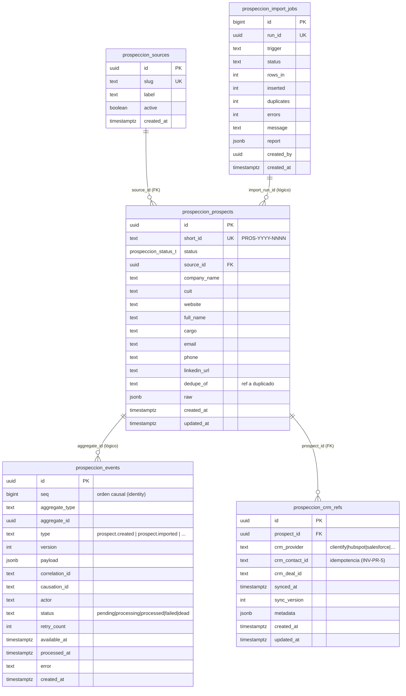

> **Lectura del ER.** Las **cinco** entidades sólidas son F0 (`sources`, `prospects`, `events`, `import_jobs` y `crm_refs` — esta última adelantada de F1 a F0 por ARB C-3; la **crea** 0089 pero solo se **escribe** desde F5). La relación `prospeccion_prospects → prospeccion_events` es **lógica** (por `aggregate_id`), **sin FK física**: un Outbox append-only no se acopla por FK al agregado (permite replay y retención independiente). `prospeccion_crm_refs` sí tiene FK física a `prospeccion_prospects` (`on delete cascade`). Las tablas de fases posteriores (§1.1) cuelgan de `prospeccion_prospects` por `prospect_id` y se omiten del diagrama para no inducir a creerlas existentes.

| Plantilla normativa (Sección 1) | |
|---|---|
| **Objetivo** | Fijar el modelo completo y aislar el subconjunto mínimo viable de F0. |
| **Alcance** | Todas las tablas `prospeccion_*`; F0 = 5 tablas (`sources`, `prospects`, `events`, `import_jobs`, `crm_refs`) + 1 enum + 1 RPC. |
| **Decisiones tomadas** | Outbox sin FK física al agregado; `type` de evento como texto versionado (no enum cerrado); naming `prospeccion_*`; PII marcada por tabla. |
| **Decisiones descartadas** | (a) Implementar enrichment/score/IA en F0 — descartado por alcance. (b) FK física Outbox→prospects — descartado (rompe replay/retención). (c) Enum cerrado de tipos de evento — descartado (bloquearía fases futuras). |
| **Justificación** | F0 entrega el valor central (ingesta + Outbox) sin sobre-construir; el resto queda declarado y trazable. |
| **Riesgos** | Que se adelante DDL de fases futuras "porque ya está pensado". Mitigación: 0089 crea SOLO el subconjunto F0. |
| **Impacto sobre la arquitectura** | Define el contrato físico que los adapters de repositorio y Outbox (`20-parte-II-dominio.md:286-302`) implementan. |

---

## Sección 2 — DDL definitivo literal de F0 (idempotente)

> Tres migraciones. **0088** agrega el valor de enum (sola, por la restricción de Postgres). **0089** crea el núcleo (tablas, RLS, trigger, RPC, seed RBAC). **0091** es el rollback espejo. Todo idempotente. **PROHIBIDO** aplicar sin gate de aprobación: este capítulo documenta, no migra.

### 2.1 `0088_prospeccion_module_enum.sql` — agrega el valor de enum (migración propia)

**Por qué va sola.** Postgres **no permite usar** un valor de enum recién agregado dentro de la misma transacción que lo agrega. La migración 0089 **usa** `'prospeccion'` (en el seed de `permissions(module=...)`), por lo que el `add value` **DEBE** vivir en una migración/transacción anterior y separada. Es exactamente la lección documentada en el molde `0086_mi_espacio_module_enum.sql:9-12` (separó el `add value` de su uso en 0087).

```sql
-- 0088 — Agrega el valor 'prospeccion' al enum permission_module_t.
--
-- CONTEXTO: en prod el enum permission_module_t NO incluye 'prospeccion' (sí 'comercial').
-- El módulo de Prospección Inteligente necesita su propio módulo de permisos para que el
-- guard RBAC de /comercial/prospeccion pueda evaluar prospeccion.* (view/create/edit/delete/admin).
--
-- IMPORTANTE: este ALTER va en su propia migración/transacción. Postgres no permite USAR un
-- valor de enum recién agregado dentro de la misma transacción → la creación de los permisos
-- y los grants viven en 0089 (molde idéntico: 0086 → 0087 de mi_espacio).
alter type public.permission_module_t add value if not exists 'prospeccion';

-- PostgREST: refrescar el caché de esquema para que el nuevo valor de enum sea visible vía API.
select pg_notify('pgrst', 'reload schema');
```

> Nota de estilo: el molde 0085 cierra con `notify pgrst, 'reload schema';` (`0085:193`). Aquí se usa la forma funcional equivalente `select pg_notify('pgrst','reload schema');` porque una migración que solo contiene un `alter type ... add value` corre fuera de un bloque transaccional explícito y `pg_notify(...)` es la forma robusta de emitirlo como sentencia independiente. Ambas formas son semánticamente equivalentes.

### 2.2 `0089_prospeccion_core.sql` — núcleo F0 (tablas + RLS + trigger + RPC + seed RBAC)

```sql
-- =========================================================================
-- 0089_prospeccion_core — Prospección Inteligente F0 · Núcleo de persistencia
-- =========================================================================
-- Implementa el subconjunto F0 del context `prospeccion` (LinkedIn → Nexus → Clientify;
-- NADA va directo a Clientify): catálogo de orígenes, fila materializada del Aggregate
-- Root Prospect, Outbox append-only de Domain Events e ingesta idempotente con dedup.
-- Cubre los pasos 1 (ProspectCreated) y 2 (ProspectImported) del event storming.
--
-- 100% ADITIVA · IDEMPOTENTE. Convenciones (0009/0082/0085):
--   id uuid default gen_random_uuid(); created_at/updated_at default now();
--   trigger public.tg_touch_updated_at() en updated_at; RLS con public.has_permission()
--   y public.is_admin() (RBAC fino, RBAC dormido → la RLS es la frontera real);
--   RPC security definer + search_path fijo; revoke from public/anon/authenticated +
--   grant a service_role; seed RBAC por slug con on conflict do nothing.
--
-- DEPENDE de: permission_module_t con valor 'prospeccion' (0088), permissions/roles/
--   role_permissions (0009), helpers has_permission/is_admin (0009), tg_touch_updated_at (0005).
-- =========================================================================

-- ---- Enum de estado del Prospect (los 9+ estados de la máquina) ----------
-- Espejo de la máquina de estados del event storming (15-event-storming.md:272-284).
-- 'raw' = recién capturado pre-normalización; 'imported' = normalizado; etapas
-- siguientes reservadas para F1+ (el Outbox ya las soporta como eventos).
do $$ begin
  create type public.prospeccion_status_t as enum (
    'raw',
    'imported',
    'enriquecido',
    'scoreado',
    'con_ia',
    'aprobado',
    'sincronizado',
    'cliente_creado',
    'rechazado',
    'duplicado'
  );
exception when duplicate_object then null; end $$;

-- ---- (A) Catálogo de orígenes (SourceSlug) ------------------------------
create table if not exists public.prospeccion_sources (
  id          uuid primary key default gen_random_uuid(),
  slug        text not null unique,                 -- VO SourceSlug (enum cerrado a nivel dominio)
  label       text not null,
  active      boolean not null default true,
  created_at  timestamptz not null default now()
);

insert into public.prospeccion_sources (slug, label) values
  ('linkedin_sales_navigator', 'LinkedIn Sales Navigator'),
  ('csv',                      'Importación CSV'),
  ('manual',                  'Carga manual'),
  ('paste',                   'Pegado (paste)'),
  ('api',                     'API / integración'),
  ('webhook',                 'Webhook entrante')
on conflict (slug) do nothing;

-- ---- Secuencia + trigger para short_id legible PROS-YYYY-NNNN -------------
-- Patrón de id público legible (espejo de los public_id del CRM). La secuencia es
-- global (no por año); el año se toma del momento de inserción. NNNN con padding a 4.
create sequence if not exists public.prospeccion_prospect_seq;

-- ---- (B) Prospect (fila materializada del Aggregate Root) ----------------
create table if not exists public.prospeccion_prospects (
  id                   uuid primary key default gen_random_uuid(),
  short_id             text unique,                 -- PROS-YYYY-NNNN (lo pone el trigger)
  status               public.prospeccion_status_t not null default 'raw',
  source_id            uuid references public.prospeccion_sources(id) on delete set null,
  -- Identidad de empresa / contacto (DTO canónico, ver Sección 3)
  company_name         text,
  cuit                 text,                         -- guardado tal cual; clave de CUENTA, no de dedup de persona
  website              text,
  full_name            text,
  cargo                text,
  email                text,                         -- normalizado (lower/trim) en la RPC
  phone                text,                         -- normalizado (solo dígitos) en la RPC
  linkedin_url         text,
  -- Trazabilidad de duplicado (regla "crear y marcar", nunca mergear).
  dedupe_of            uuid references public.prospeccion_prospects(id) on delete set null,
  raw                  jsonb not null default '{}'::jsonb,
  created_at           timestamptz not null default now(),
  updated_at           timestamptz not null default now()
);

-- Índices de dedup (case-insensitive donde aplica) y de consulta.
create index if not exists prospeccion_prospects_email_idx        on public.prospeccion_prospects (lower(email));
create index if not exists prospeccion_prospects_cuit_idx         on public.prospeccion_prospects (cuit);
create index if not exists prospeccion_prospects_linkedin_idx     on public.prospeccion_prospects (linkedin_url);
create index if not exists prospeccion_prospects_status_idx       on public.prospeccion_prospects (status, created_at desc);  -- bandeja: filtra por estado, ordena por fecha (CONS-C1: definición única, sin duplicado)
create index if not exists prospeccion_prospects_source_idx       on public.prospeccion_prospects (source_id);
-- ---- short_id: secuencia + trigger BEFORE INSERT -------------------------
create or replace function public.prospeccion_set_short_id()
returns trigger
language plpgsql
as $$
begin
  if new.short_id is null then
    new.short_id := 'PROS-' || to_char(now(), 'YYYY') || '-' ||
                    lpad(nextval('public.prospeccion_prospect_seq')::text, 4, '0');
  end if;
  return new;
end $$;

drop trigger if exists trg_prospeccion_prospects_short_id on public.prospeccion_prospects;
create trigger trg_prospeccion_prospects_short_id
  before insert on public.prospeccion_prospects
  for each row execute function public.prospeccion_set_short_id();

-- ---- updated_at (usa public.tg_touch_updated_at() de 0005) ---------------
drop trigger if exists trg_prospeccion_prospects_touch on public.prospeccion_prospects;
create trigger trg_prospeccion_prospects_touch
  before update on public.prospeccion_prospects
  for each row execute function public.tg_touch_updated_at();

-- ---- (C) Outbox append-only de Domain Events -----------------------------
-- Materialización física de los 9 eventos (Transactional Outbox). Append-only:
-- sin policy de update/delete para anon/authenticated; lo escribe la RPC (DEFINER)
-- y lo consume el worker (service_role). type es texto versionado, no enum cerrado.
create table if not exists public.prospeccion_events (
  id             uuid primary key default gen_random_uuid(),
  seq            bigint generated always as identity, -- orden causal TOTAL de emisión (CONS-C1/DM-004): id uuid no es monotónico y created_at colisiona en inserciones del mismo lote
  aggregate_type text not null default 'prospect',
  aggregate_id   uuid not null,                      -- = prospeccion_prospects.id (relación lógica)
  type           text not null,                      -- 'prospect.created' | 'prospect.imported' | ...
  version        int not null default 1,
  payload        jsonb not null default '{}'::jsonb,
  correlation_id text,
  causation_id   text,
  actor          text,                               -- 'system:ingest' | uuid del usuario | etc.
  status         text not null default 'pending'
                   check (status in ('pending','processing','processed','failed','dead')),
  retry_count    int not null default 0,
  available_at   timestamptz not null default now(),
  processed_at   timestamptz,
  error          text,
  created_at     timestamptz not null default now()
);
-- Cola del worker: índice parcial sobre eventos ACCIONABLES, ordenado por disponibilidad y
-- secuencia de emisión. Sustituye el viejo (status, available_at) y absorbe el rol del
-- bloque "ARB C-2" duplicado que referenciaba next_attempt_at/seq inexistentes (CONS-C1).
create index if not exists prospeccion_events_dispatch_idx
  on public.prospeccion_events (available_at, seq)
  where status in ('pending', 'failed');
-- Orden causal por agregado (replay determinista): usa seq, NO created_at (CONS-C1/DM-004).
create index if not exists prospeccion_events_aggregate_idx
  on public.prospeccion_events (aggregate_id, seq);

-- ---- (D) Bitácora de corridas de import (shape *_sync_log) ----------------
create table if not exists public.prospeccion_import_jobs (
  id          bigserial primary key,
  run_id      uuid not null unique default gen_random_uuid(),
  trigger     text not null check (trigger in ('cron','manual','api')),
  status      text not null check (status in ('running','completed','partial','error','skipped')),
  rows_in     int not null default 0,
  inserted    int not null default 0,
  duplicates  int not null default 0,
  errors      int not null default 0,
  message     text,
  report      jsonb,
  created_by  uuid references auth.users(id) on delete set null,
  created_at  timestamptz not null default now()
);
create index if not exists prospeccion_import_jobs_created_idx
  on public.prospeccion_import_jobs (created_at desc);

-- ---- (E) Tabla CRM refs provider-agnostic — adelantada F1→F0 (ARB C-3 2026-06-25) -----
-- Tabla CRM refs provider-agnostic — adelantada F1→F0 (ARB C-3 2026-06-25)
create table if not exists public.prospeccion_crm_refs (
  id              uuid        primary key default gen_random_uuid(),
  prospect_id     uuid        not null references public.prospeccion_prospects(id) on delete cascade,
  crm_provider    text        not null,   -- 'clientify' | 'hubspot' | 'salesforce' | …
  crm_contact_id  text,
  crm_deal_id     text,
  synced_at       timestamptz not null default now(),
  sync_version    integer     not null default 1,
  metadata        jsonb       not null default '{}',
  created_at      timestamptz not null default now(),
  updated_at      timestamptz not null default now(),   -- DM-006: convención normativa (faltaba)
  unique(prospect_id, crm_provider)
);
alter table public.prospeccion_crm_refs enable row level security;

-- updated_at de crm_refs (convención 0082/0085; DM-006 — la tabla se adelantó a F0 por ARB C-3).
drop trigger if exists trg_prospeccion_crm_refs_touch on public.prospeccion_crm_refs;
create trigger trg_prospeccion_crm_refs_touch
  before update on public.prospeccion_crm_refs
  for each row execute function public.tg_touch_updated_at();

-- Índices de prospeccion_crm_refs. (Los índices de prospeccion_events y prospeccion_prospects
--  se definen junto a su tabla, arriba; el viejo bloque "ARB C-2" se eliminó porque duplicaba
--  nombres y referenciaba columnas inexistentes next_attempt_at/seq → CONS-C1.)
create index if not exists prospeccion_crm_refs_prospect_idx
  on public.prospeccion_crm_refs (prospect_id);

create index if not exists prospeccion_crm_refs_provider_idx
  on public.prospeccion_crm_refs (crm_provider, crm_contact_id)
  where crm_contact_id is not null;

-- =========================================================================
-- RLS — RBAC dormido → la RLS es la frontera real. Tablas con PII NUNCA using(true).
-- =========================================================================
alter table public.prospeccion_sources      enable row level security;
alter table public.prospeccion_prospects    enable row level security;
alter table public.prospeccion_events       enable row level security;
alter table public.prospeccion_import_jobs  enable row level security;

-- ---- sources: lectura por permiso view; escritura por edit; borrado admin --
drop policy if exists "prospeccion_sources select" on public.prospeccion_sources;
create policy "prospeccion_sources select" on public.prospeccion_sources
  for select to authenticated
  using (public.has_permission('prospeccion.view'));

drop policy if exists "prospeccion_sources insert" on public.prospeccion_sources;
create policy "prospeccion_sources insert" on public.prospeccion_sources
  for insert to authenticated
  with check (public.has_permission('prospeccion.create'));

drop policy if exists "prospeccion_sources update" on public.prospeccion_sources;
create policy "prospeccion_sources update" on public.prospeccion_sources
  for update to authenticated
  using (public.has_permission('prospeccion.edit'))
  with check (public.has_permission('prospeccion.edit'));

drop policy if exists "prospeccion_sources delete" on public.prospeccion_sources;
create policy "prospeccion_sources delete" on public.prospeccion_sources
  for delete to authenticated
  using (public.is_admin());

-- ---- prospects (PII): select=view, insert=create, update=edit, delete=is_admin() --
-- NUNCA using(true): contiene email/phone/cuit/linkedin (PII). El permiso es la frontera.
drop policy if exists "prospeccion_prospects select" on public.prospeccion_prospects;
create policy "prospeccion_prospects select" on public.prospeccion_prospects
  for select to authenticated
  using (public.has_permission('prospeccion.view'));

drop policy if exists "prospeccion_prospects insert" on public.prospeccion_prospects;
create policy "prospeccion_prospects insert" on public.prospeccion_prospects
  for insert to authenticated
  with check (public.has_permission('prospeccion.create'));

drop policy if exists "prospeccion_prospects update" on public.prospeccion_prospects;
create policy "prospeccion_prospects update" on public.prospeccion_prospects
  for update to authenticated
  using (public.has_permission('prospeccion.edit'))
  with check (public.has_permission('prospeccion.edit'));

drop policy if exists "prospeccion_prospects delete" on public.prospeccion_prospects;
create policy "prospeccion_prospects delete" on public.prospeccion_prospects
  for delete to authenticated
  using (public.is_admin());

-- ---- crm_refs: lectura por permiso view; escritura SOLO service_role/DEFINER (sync F5) -----
-- DM-006: la tabla tiene RLS habilitada (arriba). Sin esta policy, un SELECT autenticado
-- devolvía 0 filas y la UI no podía saber si un prospecto ya fue sincronizado. La escritura
-- la hace la RPC de sync (DEFINER, F5) / service_role; no se expone INSERT/UPDATE a sesión.
drop policy if exists "prospeccion_crm_refs select" on public.prospeccion_crm_refs;
create policy "prospeccion_crm_refs select" on public.prospeccion_crm_refs
  for select to authenticated
  using (public.has_permission('prospeccion.view'));

drop policy if exists "prospeccion_crm_refs delete" on public.prospeccion_crm_refs;
create policy "prospeccion_crm_refs delete" on public.prospeccion_crm_refs
  for delete to authenticated
  using (public.is_admin());

-- ---- events + import_jobs: SOLO service_role -----------------------------
-- El Outbox y la bitácora son superficie de máquina. RLS habilitada y SIN policy
-- para anon/authenticated → quedan cerrados a sesión de usuario. service_role los
-- escribe/consume (bypassa RLS). Las RPC DEFINER también escriben (corren como owner).
-- (Se deja explícito que NO hay policy: el enable + ausencia de policy = deny-all a roles
--  no privilegiados, frontera real con RBAC dormido.)

-- =========================================================================
-- RPC prospeccion_ingest — ingesta idempotente con dedup + Outbox
-- =========================================================================
-- SECURITY DEFINER (tráfico de máquina: cron/worker sin auth.uid()), search_path fijo;
-- es la ÚNICA puerta de escritura masiva. Dedup por cuit / lower(email) / linkedin_url
-- con regla "crear y marcar duplicado" (D-4 de crm_ingest_lead). Por cada fila inserta
-- en el Outbox los eventos 'prospect.created' y 'prospect.imported'. Retorna contadores.
create or replace function public.prospeccion_ingest(
  p_rows   jsonb,
  p_source text
)
returns jsonb
language plpgsql
security definer
set search_path = public, pg_temp
as $$
declare
  v_source_id   uuid;
  r             jsonb;
  v_company     text;
  v_cuit        text;
  v_website     text;
  v_full_name   text;
  v_cargo       text;
  v_email       text;
  v_phone       text;
  v_linkedin    text;
  v_raw         jsonb;
  v_match_id    uuid;
  v_is_dup      boolean;
  v_status      public.prospeccion_status_t;
  v_prospect    public.prospeccion_prospects;
  v_corr        uuid;   -- correlation_id por prospecto (EVT-4 OBLIGATORIO)
  v_created_eid uuid;   -- id del evento 'created' → causation_id del 'imported'
  v_inserted    int := 0;
  v_duplicates  int := 0;
begin
  -- Resolución del origen (catálogo). Origen desconocido → error permanente.
  select id into v_source_id from public.prospeccion_sources where slug = p_source;
  if v_source_id is null then
    raise exception 'UNKNOWN_SOURCE: origen % no existe en prospeccion_sources', p_source
      using errcode = 'check_violation';
  end if;

  if p_rows is null or jsonb_typeof(p_rows) <> 'array' then
    raise exception 'INVALID_ROWS: p_rows debe ser un array jsonb'
      using errcode = 'check_violation';
  end if;

  for r in select * from jsonb_array_elements(p_rows)
  loop
    -- ── Extracción + normalización (espejo de crm_ingest_lead) ────────────
    v_company   := nullif(trim(r->>'company_name'), '');
    v_cuit      := nullif(trim(r->>'cuit'), '');
    v_website   := nullif(lower(trim(r->>'website')), '');
    v_full_name := nullif(trim(r->>'full_name'), '');
    v_cargo     := nullif(trim(r->>'cargo'), '');
    v_email     := lower(nullif(trim(r->>'email'), ''));
    v_phone     := nullif(regexp_replace(coalesce(r->>'phone',''), '\D', '', 'g'), '');
    v_linkedin  := nullif(lower(trim(r->>'linkedin_url')), '');
    v_raw       := coalesce(r->'raw', r);

    -- ── Dedup: cuit → lower(email) → linkedin_url ─────────────────────────
    -- (CUIT es clave de CUENTA; acá se usa como una de las señales de dedup de fila
    --  de import, conforme a la cadena pedida para F0; persona fina se afina en fases
    --  siguientes con email/phone.)
    v_match_id := null;
    if v_cuit is not null then
      select id into v_match_id from public.prospeccion_prospects
       where cuit = v_cuit and dedupe_of is null limit 1;
    end if;
    if v_match_id is null and v_email is not null then
      select id into v_match_id from public.prospeccion_prospects
       where lower(email) = v_email and dedupe_of is null limit 1;
    end if;
    if v_match_id is null and v_linkedin is not null then
      select id into v_match_id from public.prospeccion_prospects
       where linkedin_url = v_linkedin and dedupe_of is null limit 1;
    end if;

    v_is_dup := v_match_id is not null;
    -- "Crear y marcar": el duplicado SE CREA (no se descarta), con status 'duplicado'
    -- y dedupe_of apuntando al original. NUNCA se mergea en F0.
    v_status := case when v_is_dup then 'duplicado'::public.prospeccion_status_t
                                   else 'imported'::public.prospeccion_status_t end;

    insert into public.prospeccion_prospects
      (status, source_id, company_name, cuit, website, full_name, cargo,
       email, phone, linkedin_url, dedupe_of, raw)
    values
      (v_status, v_source_id, v_company, v_cuit, v_website, v_full_name, v_cargo,
       v_email, v_phone, v_linkedin, v_match_id, v_raw)
    returning * into v_prospect;

    if v_is_dup then
      v_duplicates := v_duplicates + 1;
    else
      v_inserted := v_inserted + 1;
    end if;

    -- ── Outbox: evento 1 (created) + evento 2 (imported) por fila ─────────
    -- E-2: emisión atómica en la misma transacción que el agregado.
    -- EVT-4 (OBLIGATORIO): correlation_id agrupa la cadena causal del prospecto; el 'imported'
    -- lleva causation_id = id del 'created'. Se insertan en dos pasos para capturar ese id.
    v_corr := gen_random_uuid();
    insert into public.prospeccion_events
      (aggregate_id, type, version, payload, actor, correlation_id, causation_id)
    values
      (v_prospect.id, 'prospect.created', 1,
       jsonb_build_object('source', p_source, 'short_id', v_prospect.short_id),
       'system:ingest', v_corr::text, null)
    returning id into v_created_eid;

    insert into public.prospeccion_events
      (aggregate_id, type, version, payload, actor, correlation_id, causation_id)
    values
      (v_prospect.id, 'prospect.imported', 1,
       jsonb_build_object('source', p_source, 'is_duplicate', v_is_dup,
                          'dedupe_of', v_match_id, 'status', v_status),
       'system:ingest', v_corr::text, v_created_eid::text);
  end loop;

  return jsonb_build_object(
    'inserted',   v_inserted,
    'duplicates', v_duplicates
  );
end;
$$;

-- ---- Grants: SOLO service_role (superficie de máquina, bypassa RLS por DEFINER) --
revoke all on function public.prospeccion_ingest(jsonb, text) from public, anon, authenticated;
grant execute on function public.prospeccion_ingest(jsonb, text) to service_role;

-- =========================================================================
-- Seed RBAC — permisos prospeccion.* + grants por slug (idempotente)
-- =========================================================================
-- Acciones F0: SOLO view/create/edit/delete/admin (permission_action_t NO tiene 'sync').
insert into public.permissions (slug, module, action, label, description) values
  ('prospeccion.view',   'prospeccion', 'view',   'Ver prospectos',            'Acceso lectura al pipeline de Prospección Inteligente'),
  ('prospeccion.create', 'prospeccion', 'create', 'Crear / importar prospectos','Ingesta y alta de prospectos'),
  ('prospeccion.edit',   'prospeccion', 'edit',   'Editar prospectos',          'Modificar datos de un prospecto'),
  ('prospeccion.delete', 'prospeccion', 'delete', 'Eliminar prospectos',        'Baja de prospectos (admin)'),
  ('prospeccion.admin',  'prospeccion', 'admin',  'Administrar Prospección',     'Gestión total del módulo Prospección')
on conflict (slug) do nothing;

-- Grant por slug (roles.slug + permissions.slug), on conflict do nothing (molde 0087:13-19).
-- comercial + director_ops: operación completa (view/create/edit/delete).
insert into public.role_permissions (role_id, permission_id)
select ro.id, p.id
from public.roles ro
join public.permissions p
  on p.slug in ('prospeccion.view','prospeccion.create','prospeccion.edit','prospeccion.delete')
where ro.slug in ('comercial','director_ops')
on conflict do nothing;

-- operaciones: solo lectura.
insert into public.role_permissions (role_id, permission_id)
select ro.id, p.id
from public.roles ro
join public.permissions p on p.slug = 'prospeccion.view'
where ro.slug = 'operaciones'
on conflict do nothing;

-- admin: admin del módulo.
insert into public.role_permissions (role_id, permission_id)
select ro.id, p.id
from public.roles ro
join public.permissions p on p.slug = 'prospeccion.admin'
where ro.slug = 'admin'
on conflict do nothing;

-- ---- Cierre: refrescar el caché de esquema de PostgREST -------------------
notify pgrst, 'reload schema';
```

### 2.3 `0091_prospeccion_rollback.sql` — rollback espejo (idempotente)

> Numerado 0091 (no 0090) para dejar 0090 libre a una eventual fase intermedia y porque el rollback se aplica de forma deliberada, fuera de la secuencia normal de avance. **Un valor de enum NO se puede quitar** en Postgres: el rollback elimina objetos y semilla, pero `permission_module_t='prospeccion'` y `prospeccion_status_t` **permanecen** (drop type solo procede si ninguna columna lo usa). Se documenta explícitamente.

```sql
-- =========================================================================
-- 0091_prospeccion_rollback — Rollback espejo de F0 (0088 + 0089)
-- =========================================================================
-- Deshace el núcleo de Prospección F0 de forma idempotente. ADVERTENCIA: destructivo
-- (borra prospectos, eventos y bitácora). Aplicar SOLO con aprobación explícita.
--
-- LIMITACIÓN DE POSTGRES: un valor agregado a un enum (permission_module_t='prospeccion',
-- agregado en 0088) NO se puede quitar. Permanece. El enum prospeccion_status_t SÍ se
-- puede drop-ear una vez que ninguna columna lo referencia (tras drop de prospeccion_prospects).
-- =========================================================================

-- ---- RPC ----------------------------------------------------------------
drop function if exists public.prospeccion_ingest(jsonb, text);

-- ---- Triggers + función de short_id -------------------------------------
drop trigger if exists trg_prospeccion_prospects_touch    on public.prospeccion_prospects;
drop trigger if exists trg_prospeccion_prospects_short_id on public.prospeccion_prospects;
drop trigger if exists trg_prospeccion_crm_refs_touch     on public.prospeccion_crm_refs;
drop function if exists public.prospeccion_set_short_id();

-- ---- Policies (idempotente) ---------------------------------------------
drop policy if exists "prospeccion_sources select"   on public.prospeccion_sources;
drop policy if exists "prospeccion_sources insert"   on public.prospeccion_sources;
drop policy if exists "prospeccion_sources update"   on public.prospeccion_sources;
drop policy if exists "prospeccion_sources delete"   on public.prospeccion_sources;
drop policy if exists "prospeccion_prospects select" on public.prospeccion_prospects;
drop policy if exists "prospeccion_prospects insert" on public.prospeccion_prospects;
drop policy if exists "prospeccion_prospects update" on public.prospeccion_prospects;
drop policy if exists "prospeccion_prospects delete" on public.prospeccion_prospects;
drop policy if exists "prospeccion_crm_refs select"  on public.prospeccion_crm_refs;
drop policy if exists "prospeccion_crm_refs delete"  on public.prospeccion_crm_refs;

-- ---- Tablas (orden por FK; crm_refs→prospects, events/jobs sin FK al resto) ----
drop table if exists public.prospeccion_events;
drop table if exists public.prospeccion_import_jobs;
drop table if exists public.prospeccion_crm_refs;    -- FK a prospects (on delete cascade): se dropea antes
drop table if exists public.prospeccion_prospects;   -- libera prospeccion_status_t y la FK a sources
drop table if exists public.prospeccion_sources;

-- ---- Secuencia ----------------------------------------------------------
drop sequence if exists public.prospeccion_prospect_seq;

-- ---- Enum de estado (ya sin columnas que lo usen) -----------------------
drop type if exists public.prospeccion_status_t;

-- ---- Seed RBAC (borrar role_permissions ANTES que permissions por la FK) -
delete from public.role_permissions rp
using public.permissions p
where rp.permission_id = p.id
  and p.slug in ('prospeccion.view','prospeccion.create','prospeccion.edit',
                 'prospeccion.delete','prospeccion.admin');

delete from public.permissions
where slug in ('prospeccion.view','prospeccion.create','prospeccion.edit',
               'prospeccion.delete','prospeccion.admin');

-- ---- NO se quita el valor de enum permission_module_t='prospeccion' -------
-- Postgres no soporta DROP VALUE en un enum. Queda como huérfano benigno (sin filas
-- en permissions que lo usen tras el delete de arriba). Es inocuo.

notify pgrst, 'reload schema';
```

| Plantilla normativa (Sección 2) | |
|---|---|
| **Objetivo** | Entregar el DDL literal, idempotente y con la sintaxis exacta de prod para los tres pasos (enum, núcleo, rollback). |
| **Alcance** | 0088 (enum), 0089 (tablas + RLS + trigger + RPC + RBAC), 0091 (rollback). |
| **Decisiones tomadas** | `add value` en migración propia; RPC DEFINER `prospeccion_ingest` única puerta; Outbox/jobs sin policy a sesión; permisos F0 sin `sync`; rollback explícito sobre la limitación de enum. |
| **Decisiones descartadas** | (a) `add value` + uso en la misma migración — PROHIBIDO por Postgres. (b) `using(true)` en `prospeccion_prospects` — PROHIBIDO (PII). (c) Abrir el Outbox a `authenticated` — descartado (superficie de máquina). (d) Intentar `drop value` del enum en el rollback — imposible en Postgres. |
| **Justificación** | Clona moldes probados (0085/0086/0087/0048) sin inventar; idempotencia y separación de transacciones evitan los fallos conocidos. |
| **Riesgos** | Drift entre el registro de migraciones y el catálogo (ya existente en prod). Mitigación: la verdad es el catálogo; las migraciones son `if not exists`/`on conflict`. |
| **Impacto sobre la arquitectura** | Es el contrato físico de F0; habilita los adapters de repositorio y Outbox y la frontera RLS/RBAC del módulo. |

---

## Sección 3 — DTOs (contrato de datos)

### Objetivo
Fijar el **DTO canónico** de ingesta (lo que las fuentes LinkedIn/CSV/manual entregan) y los **Row types** TypeScript que reflejan las filas de las tablas F0, para que adapter de repositorio y RPC hablen el mismo lenguaje.

### Alcance
Contrato de entrada de `prospeccion_ingest` y tipos de fila de las 5 tablas F0 (`sources`, `prospects`, `events`, `import_jobs`, `crm_refs`). Los VOs del dominio (`Email`, `Cuit`, etc., `20-parte-II-dominio.md:70-82`) **NO** se serializan crudos: el DTO usa primitivos normalizados y el dominio los eleva a VO vía `create()`.

### 3.1 DTO canónico de ingesta

```ts
/**
 * DTO canónico POR FILA que TODA fuente (linkedin/csv/manual/paste/api/webhook) produce
 * antes de llamar a la RPC prospeccion_ingest. Normalización fina (lower/trim/dígitos)
 * la hace la RPC; el DTO transporta primitivos, nunca VOs ni tipos de proveedor.
 * Espejo del NormalizedLead de clientify/webhook.ts (DTO normalizado, 15-event-storming.md:138).
 *
 * IMPORTANTE: `source` NO es un campo por fila. El origen se pasa UNA vez por lote como
 * parámetro `p_source` de la RPC `prospeccion_ingest(p_rows jsonb, p_source text)` (un import = un
 * origen). Por eso ProspectIngestDTO (las filas de `p_rows`) NO incluye `source`; la llamada es
 * ProspectIngestCall (abajo). Esto reconcilia el DTO con la firma real de la RPC.
 */
export interface ProspectIngestDTO {
  company_name?: string | null;
  cuit?: string | null;              // clave de CUENTA; guardado tal cual, normaliza la RPC
  website?: string | null;
  full_name?: string | null;
  cargo?: string | null;
  email?: string | null;
  phone?: string | null;
  linkedin_url?: string | null;
  raw?: Record<string, unknown>;     // payload crudo del origen (auditoría/replay)
}

/** Llamada de ingesta = lote de filas + origen único. Mapea 1:1 a prospeccion_ingest(p_rows, p_source). */
export interface ProspectIngestCall {
  source: ProspectSourceSlug;        // = p_source (nivel lote): 'linkedin_sales_navigator' | 'csv' | 'manual' | 'paste' | 'api' | 'webhook'
  rows: ProspectIngestDTO[];         // = p_rows
}

export type ProspectSourceSlug =
  | 'linkedin_sales_navigator'
  | 'csv'
  | 'manual'
  | 'paste'
  | 'api'
  | 'webhook';

/** Identidad mínima (15-event-storming.md:157-160): sin al menos una clave de identidad
 *  (linkedin_url | email | phone | cuit), la fila NO produce evento — se descarta como error
 *  permanente. La validación vive en el borde (action/route), no en el dominio. */
```

### 3.2 Row types (espejo 1:1 de las tablas F0)

```ts
export type ProspeccionStatus =
  | 'raw' | 'imported' | 'enriquecido' | 'scoreado' | 'con_ia'
  | 'aprobado' | 'sincronizado' | 'cliente_creado' | 'rechazado' | 'duplicado';

export interface ProspeccionSourceRow {
  id: string;
  slug: ProspectSourceSlug;
  label: string;
  active: boolean;
  created_at: string;                // ISO timestamptz
}

export interface ProspeccionProspectRow {
  id: string;
  short_id: string | null;           // PROS-YYYY-NNNN
  status: ProspeccionStatus;
  source_id: string | null;
  company_name: string | null;
  cuit: string | null;
  website: string | null;
  full_name: string | null;
  cargo: string | null;
  email: string | null;
  phone: string | null;
  linkedin_url: string | null;
  // CC-6: los IDs de CRM externo NO viven aquí — viven en ProspeccionCrmRefRow (provider-agnostic).
  dedupe_of: string | null;          // id del prospecto original si es duplicado
  raw: Record<string, unknown>;
  created_at: string;
  updated_at: string;
}

export type ProspeccionEventStatus =
  | 'pending' | 'processing' | 'processed' | 'failed' | 'dead';

export interface ProspeccionEventRow {
  id: string;
  seq: number;                       // bigint identity — orden causal total de emisión (CONS-C1)
  aggregate_type: string;            // 'prospect'
  aggregate_id: string;              // = ProspeccionProspectRow.id
  type: string;                      // 'prospect.created' | 'prospect.imported' | ...
  version: number;
  payload: Record<string, unknown>;
  correlation_id: string | null;
  causation_id: string | null;
  actor: string | null;
  status: ProspeccionEventStatus;
  retry_count: number;
  available_at: string;
  processed_at: string | null;
  error: string | null;
  created_at: string;
}

export interface ProspeccionImportJobRow {
  id: number;                        // bigserial
  run_id: string;
  trigger: 'cron' | 'manual' | 'api';
  status: 'running' | 'completed' | 'partial' | 'error' | 'skipped';
  rows_in: number;
  inserted: number;
  duplicates: number;
  errors: number;
  message: string | null;
  report: Record<string, unknown> | null;
  created_by: string | null;
  created_at: string;
}

/** crm_refs (provider-agnostic, F0): vínculo idempotente prospecto↔registro CRM. CC-6. */
export interface ProspeccionCrmRefRow {
  id: string;
  prospect_id: string;
  crm_provider: string;              // 'clientify' | 'hubspot' | 'salesforce' | …
  crm_contact_id: string | null;
  crm_deal_id: string | null;
  synced_at: string;
  sync_version: number;
  metadata: Record<string, unknown>;
  created_at: string;
  updated_at: string;
}

/** Resultado de la RPC prospeccion_ingest. */
export interface ProspeccionIngestResult {
  inserted: number;
  duplicates: number;
}
```

| Plantilla normativa (Sección 3) | |
|---|---|
| **Objetivo** | Definir el contrato de datos entre fuentes, RPC y repositorio. |
| **Alcance** | DTO de ingesta + Row types de las 5 tablas F0 + resultado de la RPC. |
| **Decisiones tomadas** | DTO con primitivos normalizados (no VOs); `raw` para replay; Row types 1:1 con las columnas; `ProspectSourceSlug` cerrado. |
| **Decisiones descartadas** | (a) Serializar VOs en el DTO — descartado (el dominio los construye con `create()`). (b) Tipos de proveedor en el DTO — PROHIBIDO (ACL los traduce, `20-parte-II-dominio.md:186`). |
| **Justificación** | Mantiene el borde delgado y el dominio soberano; reusa el patrón `NormalizedLead`. |
| **Riesgos** | Deriva DTO↔columna. Mitigación: generar tipos con `mcp__supabase__generate_typescript_types` al aplicar (no ahora). |
| **Impacto sobre la arquitectura** | Es el lenguaje compartido del adapter de repositorio (`ProspectRepositoryPort`) y la RPC de ingesta. |

---

## Sección 4 — RPC · RLS · RBAC (síntesis de contratos)

### 4.1 RPC (firmas + responsabilidad + DEFINER/INVOKER)

| Función | Firma | Seguridad | Responsabilidad | Grants |
|---|---|---|---|---|
| `prospeccion_ingest` | `(p_rows jsonb, p_source text) → jsonb` | **DEFINER** + `search_path=public,pg_temp` | Única puerta de ingesta masiva: resuelve origen, dedup (cuit→email→linkedin), "crear y marcar duplicado", inserta `prospect.created` + `prospect.imported` en el Outbox, retorna `{inserted,duplicates}`. Tráfico de máquina (sin `auth.uid()`). | `revoke all from public,anon,authenticated`; `grant execute to service_role`. |
| `prospeccion_set_short_id` | `() → trigger` | INVOKER (trigger) | Asigna `PROS-YYYY-NNNN` vía secuencia en BEFORE INSERT. | — (función de trigger). |

**Regla RPC-1 (heredada de `15-event-storming.md:111-114`).** Los pasos automáticos del pipeline corren **DEFINER**; el único paso humano (`approve/reject`, **fase F1** — gate humano, alineado con el roadmap y ROAD-001) correrá **INVOKER** con `changed_by = auth.uid()`, igual que `crm_promote_lead`. En F0 solo existe el paso de máquina (`prospeccion_ingest`), por eso es DEFINER. **PROHIBIDO** hacer DEFINER una futura RPC de aprobación humana.

**Regla RPC-2 (= CS-RPC-2, Parte VI §2.5).** Las RPC de **transición** (F1+: enrich/score/approve/sync) son **persistencia mecánica**: reciben un snapshot ya validado por el AR (TypeScript) y NO contienen reglas de negocio (ni validación de la máquina de estados, ni invariantes, ni scoring) — embeber lógica de dominio en PL/pgSQL invertiría la Regla de Dependencia (AP-1/AP-15) sin que el lint lo detecte. **Excepción acotada y deliberada:** `prospeccion_ingest` (F0) hace normalización + dedup en SQL por performance de ingesta masiva; es la única RPC con lógica de selección embebida y está documentada como tal (la `DeduplicationPolicy` del dominio, Parte II §2.2, es la fuente de verdad conceptual del criterio).

### 4.2 RLS (políticas exactas de F0)

| Tabla | SELECT | INSERT | UPDATE | DELETE | Notas |
|---|---|---|---|---|---|
| `prospeccion_sources` | `has_permission('prospeccion.view')` | `has_permission('prospeccion.create')` | `has_permission('prospeccion.edit')` | `is_admin()` | Catálogo (sin PII). |
| `prospeccion_prospects` | `has_permission('prospeccion.view')` | `has_permission('prospeccion.create')` | `has_permission('prospeccion.edit')` | `is_admin()` | **PII** → nunca `using(true)`. |
| `prospeccion_crm_refs` | `has_permission('prospeccion.view')` | — (service_role/DEFINER) | — (service_role/DEFINER) | `is_admin()` | DM-006: SELECT para que la UI sepa si hubo sync; escritura solo desde la RPC de sync (F5). Sin PII. |
| `prospeccion_events` | — (sin policy) | — (sin policy) | — (sin policy) | — (sin policy) | RLS ON + deny-all a sesión; `service_role`/DEFINER escriben/consumen. |
| `prospeccion_import_jobs` | — (sin policy) | — (sin policy) | — (sin policy) | — (sin policy) | Ídem: superficie de máquina. |

**Regla RLS-1.** Con RBAC dormido, la ausencia de policy + RLS habilitada equivale a deny-all para `anon`/`authenticated`; eso es **deliberado** para Outbox y jobs. **PROHIBIDO** agregarles policy de escritura para roles de sesión.
**Regla RLS-2.** El delete de prospectos exige `is_admin()` (DEFINER, `0009`), no un permiso `delete` cualquiera: el borrado de PII es privilegiado.

### 4.3 RBAC (seed exacto por slug)

| Permiso (slug / module / action / label) | Roles a los que se concede (por `roles.slug`) |
|---|---|
| `prospeccion.view` / `prospeccion` / `view` / "Ver prospectos" | `comercial`, `director_ops`, `operaciones` |
| `prospeccion.create` / `prospeccion` / `create` / "Crear / importar prospectos" | `comercial`, `director_ops` |
| `prospeccion.edit` / `prospeccion` / `edit` / "Editar prospectos" | `comercial`, `director_ops` |
| `prospeccion.delete` / `prospeccion` / `delete` / "Eliminar prospectos" | `comercial`, `director_ops` |
| `prospeccion.admin` / `prospeccion` / `admin` / "Administrar Prospección" | `admin` |

> `admin` además recibe **todo** vía el fallback de `has_permission()` (`... or public.current_role() = 'admin'`, `0009_rbac.sql:174`); el grant explícito de `prospeccion.admin` lo deja visible en la UI de roles. El seed es por JOIN `roles.slug`+`permissions.slug` con `on conflict do nothing` (molde `0087:13-19`), idempotente.

| Plantilla normativa (Sección 4) | |
|---|---|
| **Objetivo** | Consolidar los contratos de RPC, RLS y RBAC de F0 en una vista única y verificable. |
| **Alcance** | `prospeccion_ingest` (+ triggers), 5 tablas y 5 permisos. |
| **Decisiones tomadas** | DEFINER solo para máquina; RLS por `has_permission()`; delete por `is_admin()`; Outbox/jobs deny-all a sesión; seed por slug. |
| **Decisiones descartadas** | (a) RPC de ingesta INVOKER — descartado (no hay `auth.uid()` en cron). (b) `using(true)` en cualquier tabla con PII — PROHIBIDO. (c) Acción `sync` — fuera de F0 (no existe en `permission_action_t`). |
| **Justificación** | Reproduce la frontera de seguridad ya validada en CRM (DEFINER/INVOKER + RLS) sin re-auditar. |
| **Riesgos** | Que el RBAC dormido dé falsa sensación de apertura. Mitigación: la RLS niega por defecto; el enforcement crece cuando se pueblen `user_roles`. |
| **Impacto sobre la arquitectura** | Cierra la Parte III de persistencia: el módulo queda con un contrato físico, de seguridad y de datos completo para construir F0 encima. |

---

> **Cierre del capítulo.** La persistencia de `prospeccion` F0 es **mínima, idempotente y fiel a prod**: cinco tablas (`sources`, `prospects`, `events`, `import_jobs`, `crm_refs` provider-agnostic vacía hasta F5), un enum de estado, el Outbox con `seq` para orden causal, una RPC DEFINER de ingesta con dedup, RLS por permiso (PII jamás `using(true)`) y un seed RBAC por slug. El Outbox queda listo para que las fases F1–F4 cuelguen enrichment, score, IA, decisión humana y sync sin tocar el núcleo. **Nada va directo a Clientify**: la frontera es el evento `customer_created` que delega en el Write-Path CRM existente.
# Modelo de Datos Híbrido y Gobierno del Dato (Data Governance)

> **Refina la Decisión 2.** No es un modelo relacional puro ni un modelo JSONB-first: es **híbrido con reglas explícitas** sobre cuándo usar columna tipada y cuándo `jsonb`. El objetivo NO es minimizar tablas; es **maximizar claridad del dominio, mantenibilidad, rendimiento y evolución**. Esta sección es **normativa** y prevalece sobre cualquier redacción más laxa del capítulo de Persistencia.

## DG-1 — El dominio siempre primero (regla de columna tipada)
Todo atributo que **participe en** búsquedas · filtros · índices · joins · scoring · reglas de negocio · reportes · dashboards **DEBE** almacenarse en **columna tipada**. **NO DEBE** permanecer indefinidamente dentro de `jsonb`.

**Test operativo (si cualquiera es "sí" → columna tipada):** ¿se filtra/ordena por él en la bandeja o dashboard? ¿entra en el cálculo de `score`? ¿lo consume una regla/política del dominio? ¿aparece en un KPI o reporte? ¿lo necesita un join?

**Corrección al capítulo de Persistencia:** los flags de contactabilidad (`email_valid`, `phone_valid`, `website_up`) y los firmográficos que alimentan scoring/filtros (`industry`, `employee_band`, `revenue_band`, `is_amba`, `has_ecommerce`, `anmat_flag`) **DEBEN ser columnas tipadas** (promovidas), **no** vivir solo dentro de `prospeccion_enrichment.jsonb`. La respuesta cruda del proveedor sí queda en `jsonb` (ver DG-2).

## DG-2 — `jsonb` solo para información variable
`jsonb` se usa **exclusivamente** para información cuya estructura cambia con frecuencia o es heterogénea por proveedor: respuestas completas de proveedores, payloads externos, enriquecimiento crudo, análisis IA, metadata, respuestas de APIs, snapshots, resultados experimentales. **NO DEBE** usarse para representar el modelo de dominio.

## DG-3 — Canonical Domain Model (ningún payload externo entra al dominio)
El dominio tiene un **modelo canónico**. Todo adapter **DEBE** transformar:

```
Proveedor (payload externo, jsonb crudo)
        │  Anti-Corruption Layer
        ▼
Canonical DTO (tipado, validado con Zod)
        ▼
Dominio (entidades / value objects)
```

**Regla dura:** una estructura externa **NUNCA** ingresa directamente al dominio. El `jsonb` crudo se persiste como evidencia/auditoría; el dominio consume únicamente el Canonical DTO.

## DG-4 — Promoción formal de atributos (`jsonb` → columna)
Cuando un atributo que vive en `jsonb` pasa a ser relevante para consultas, dashboards, KPIs, reglas, IA o reportes, **DEBE** ejecutarse el **procedimiento formal de promoción**:

1. ADR corto que registre el atributo, su tipo destino y su fuente (`jsonb` path).
2. Migración aditiva: nueva columna tipada + índice si corresponde (DG-6).
3. Backfill idempotente desde el `jsonb` histórico (extracción diferida, en lote).
4. El adapter/ACL empieza a poblar la columna además del `jsonb` crudo.
5. Actualizar la **matriz de Data Governance** (DG-10) y el Canonical DTO.

`jsonb` **NO DEBE** convertirse en un depósito permanente de datos de dominio.

## DG-5 — Versionado y trazabilidad del payload (`jsonb` envelope estándar)
Todo `jsonb` de origen externo **DEBE** guardarse con un **sobre (envelope) estándar**, nunca como blob desnudo:

```jsonc
{
  "provider": "firecrawl",        // proveedor concreto
  "provider_version": "2026-06",  // versión/edición del proveedor
  "schema_version": 1,            // versión del schema de Nexus para este payload
  "fetched_at": "2026-06-25T12:00:00Z",
  "checksum": "sha256:…",         // hash del payload crudo (idempotencia/dedup)
  "confidence_score": 0.82,       // 0..1
  "data": { /* payload canónico/normalizado */ }
}
```

Garantiza **trazabilidad y reproducibilidad**: se sabe qué proveedor, con qué versión, cuándo, con qué confianza, y se detecta si el contenido cambió (checksum).

## DG-6 — Indexación disciplinada
**NO** indexar `jsonb` indiscriminadamente. Crear índices GIN o funcionales **solo** ante una necesidad demostrable (query real en hot path). **Priorizar** índices sobre columnas tipadas (btree). Cada índice se justifica en su ADR/migración.

## DG-7 — Inmutabilidad de auditoría
Los **ledgers append-only** (`prospeccion_timeline`, `activities`, `notes`) y el **Outbox** (`prospeccion_events`) son **completamente inmutables**: sin `UPDATE`, sin `DELETE` (salvo `is_admin()` por excepción operativa registrada). Toda corrección **DEBE** generar un **nuevo evento**, nunca reescribir el histórico. (Refuerza G10 de la gobernanza de Nexus.)

## DG-8 — Separación por categorías de dato
Cada tabla pertenece a **una** categoría con responsabilidades distintas; **NO** mezclar categorías en una misma tabla:

| Categoría | Qué es | Tablas |
|---|---|---|
| **Core Domain** | Entidades/AR con invariantes, columnas tipadas | `prospeccion_prospects`, `prospeccion_sources`, `prospeccion_scores` (núcleo) |
| **Operational Data** | Estado operativo, bitácoras de proceso | `prospeccion_import_jobs` (incl. enrichment), `prospeccion_event_consumers` |
| **External Payloads** | `jsonb` crudo de proveedores (con envelope DG-5) | `prospeccion_enrichment`, `prospeccion_ai_content` |
| **Audit** | Ledgers inmutables + outbox | `prospeccion_timeline`, `prospeccion_activities`, `prospeccion_notes`, `prospeccion_events` |
| **Analytics** | Snapshots/agregados precomputados | `prospeccion_metrics` |

## DG-9 — Ciclo de vida del dato (Data Lifecycle)
Cada dato tiene un ciclo de vida explícito y auditable:

```
Importado → Enriquecido → Validado → Promovido → Histórico → Archivado
```

- **Importado**: fila cruda normalizada al DTO canónico (estado `raw`/`imported`).
- **Enriquecido**: payloads externos persistidos en External Payloads con envelope.
- **Validado**: el Canonical DTO pasó validación (Zod) + score de confianza ≥ umbral.
- **Promovido**: atributos relevantes movidos a columnas tipadas (DG-4).
- **Histórico**: el prospecto cerró su ciclo (sincronizado/cliente_creado/rechazado); inmutable.
- **Archivado**: política de retención (nunca borrado físico; `archived_at` + posible particionado/cold storage).

## DG-10 — Matriz de Data Governance
Cada atributo del modelo **DEBE** figurar en esta matriz. Ejemplo (extracto representativo; el documento mantiene la matriz completa por atributo):

| Atributo | Owner | Fuente de verdad | Frecuencia actualización | Persistencia | Indexación | Versionado | Archivado |
|---|---|---|---|---|---|---|---|
| `company_name` | Prospección | `prospeccion_prospects` | Import/enrich | Columna `text` | btree | — (núcleo) | con el prospecto |
| `cuit` | Prospección | `prospeccion_prospects` | Import | Columna `text` | btree único parcial | — | con el prospecto |
| `email` | Prospección | `prospeccion_prospects` | Import/enrich | Columna `citext`/`text` | btree `lower(email)` | — | con el prospecto |
| `industry` | Prospección | columna (promovida) | Enrich | Columna `text` | btree | env. del proveedor origen | con el prospecto |
| `employee_band` | Prospección | columna (promovida) | Enrich | Columna `text`/enum | btree | env. proveedor | con el prospecto |
| `revenue_band` | Prospección | columna (promovida) | Enrich | Columna `text`/enum | btree | env. proveedor | con el prospecto |
| `email_valid` / `phone_valid` / `website_up` | Prospección | columna (promovida) | Enrich | Columna `bool` | parcial si hot | env. proveedor | con el prospecto |
| `score` | Prospección | `prospeccion_scores.score` | Recálculo | Columna `int` | btree | `score_model_version` | append-only |
| `web_analysis` (crudo) | Proveedor (vía ACL) | `prospeccion_enrichment.web_analysis` | Enrich | `jsonb` (envelope) | GIN solo si se demuestra | `schema_version`/`provider_version` | con el prospecto |
| `ai_content` | IA (vía ACL) | `prospeccion_ai_content.content` | On-demand | `jsonb` (envelope) | — | `prompt_version`/`model` | append-only por versión |
| `linkedin_metadata` (crudo) | Proveedor (vía ACL) | `prospeccion_enrichment.linkedin` | Enrich | `jsonb` (envelope) | — | env. proveedor | con el prospecto |

---

**Objetivo** — Garantizar que el modelo de datos siga siendo sostenible, claro y performante durante años, evitando que `jsonb` degenere en un depósito schemaless de datos de dominio.
**Alcance** — Todas las tablas `prospeccion_*` y todo adapter que persista datos externos. Aplica a F0 (núcleo) y a todas las fases.
**Decisiones tomadas** — Modelo híbrido con DG-1..DG-10: dominio en columnas tipadas; `jsonb` solo para lo variable y con envelope versionado; Canonical DTO obligatorio; promoción formal `jsonb`→columna; auditoría inmutable; separación por categorías; ciclo de vida explícito; matriz de gobierno por atributo.
**Decisiones descartadas** — (a) relacional puro (rígido, se rompe con cada proveedor); (b) `jsonb`-first (pierde invariantes, filtros y reporting); (c) dejar contactabilidad/firmográficos en `jsonb` (viola DG-1).
**Justificación** — Equilibra estabilidad del núcleo (invariantes, índices, reglas) con flexibilidad de los bordes (proveedores heterogéneos), y agrega gobernanza para que la flexibilidad no erosione la calidad del dato.
**Riesgos** — Disciplina de promoción no se cumple → `jsonb` crece como depósito; mitigación: gate de Architecture Review (Parte VI) verifica DG-1/DG-4 en cada feature. Sobre-normar puede frenar la entrega; mitigación: en F0 solo aplica el núcleo + envelope, la matriz completa se llena por fase.
**Impacto sobre la arquitectura** — Refuerza el Canonical Data Model (Parte VII) y los Coding Standards (Parte VI); convierte la frontera columna/`jsonb` en una **regla auditable**, no un juicio ad-hoc; condiciona el diseño de cada satélite y de cada adapter.
# Constitución Arquitectónica de la Plataforma Comercial de Nexus

## PARTE VII — ENTERPRISE ARCHITECTURE

> **Estado:** normativo · **Vigencia:** 10 años (revisión anual obligatoria) · **Gobierno:** subordinado al Documento Rector [TOPS-NEXUS-ERP.md](../../TOPS-NEXUS-ERP.md) y consistente con las Partes I ([10-parte-I-estrategico.md](./10-parte-I-estrategico.md)), II ([20-parte-II-dominio.md](./20-parte-II-dominio.md)) y el Event Storming ([15-event-storming.md](./15-event-storming.md)).
> **Bounded Context:** `prospeccion` (Prospección Inteligente), primer contexto acotado de la **Plataforma Comercial de Nexus**.
> **Naturaleza del documento:** esta Parte alinea las seis capas de arquitectura empresarial — **negocio ↔ dominio ↔ aplicaciones ↔ datos ↔ integración ↔ tecnología** — bajo una sola constitución. Donde dice **DEBE** la regla es obligatoria; **NO DEBE** es prohibición; **PUEDE** es facultad. Las reglas (R-7.x) son normativas y citables.
> **No-fantasy.** Al 2026-06-25 el directorio `src/lib/prospeccion` está **vacío** (verificado: `ls src/lib/prospeccion/` no devuelve archivos). Toda referencia a `prospeccion_*` es **objetivo de diseño**. Las citas `file:line` a otros módulos son **precedentes reales** del repo que esta Parte VII eleva a norma para el nuevo contexto.

---

### Preámbulo: por qué una Parte de Enterprise Architecture

Las Partes I–II fijaron el **qué** estratégico y el **cómo** táctico. La Parte VII fija el **encaje empresarial**: cómo Prospección se inserta en el mapa de capacidades de negocio de TOPS, qué objetos de información posee, cuál es el modelo canónico al que todo proveedor externo se adapta, cómo se clasifican y contratan las integraciones, qué arquitectura de seguridad y operación rige, y qué partes del sistema permanecen estables por años frente a las que evolucionan.

El principio rector de Enterprise Architecture de esta Constitución es uno: **Nexus es el centro; los externos se adaptan a Nexus, nunca al revés.** El Canonical Data Model (§3) es la encarnación de ese principio, y refuerza la Anti-Corruption Layer ya prescrita en la Parte II (§2.6) y el patrón ACL del Context Map (Parte I, R-3.2.6).

---

## 1. Business Capability Map

### 1.1 Marco

**R-7.1.1.** Una **Capacidad de Negocio** es *qué* hace la organización, con independencia de *cómo* o *con qué herramienta*. Cada capacidad de la Plataforma Comercial **DEBE** clasificarse como **Core** (diferenciador competitivo), **Supporting** (necesaria, no diferenciadora) o **Shared** (transversal, sirve a todas). Esta clasificación hereda y refina la clasificación de subdominios DDD de la Parte I (§2.2): toda capacidad **Core** se apoya en un subdominio **CORE**.

**R-7.1.2.** La inversión arquitectónica (rigor de modelado, tests, aislamiento, observabilidad) **DEBE** ser proporcional a la clasificación: máxima en Core, media en Supporting, estandarizada en Shared.

### 1.2 Catálogo normativo de capacidades

| # | Capacidad de Negocio | Clase | Subdominio (Parte I §2.2) | Depende de | Sustenta a |
|---|----------------------|:-----:|---------------------------|------------|------------|
| C1 | **Generación de Prospectos** | **Core** | Prospección (CORE) | LinkedIn / import (ACL) | C2, C3 |
| C2 | **Enriquecimiento Comercial** | **Core** | Prospección (CORE) | C1, Proveedores Enrichment (ACL) | C3, C4 |
| C3 | **Inteligencia Comercial (IA)** | **Core** | IA-capacidad (CORE) / IA-infra (GENERIC) | C2, Proveedores IA (ACL) | C4, C11 |
| C4 | **Gestión de Leads** | **Core** | Prospección (CORE) | C2, C3, gate humano | C5, C8 |
| C5 | **CRM (relación comercial)** | **Supporting** | CRM (SUPPORTING/GENERIC) | C4, C12 (Clientify) | C6, C7 |
| C6 | **Cotizaciones** | **Supporting** | Comercial (SUPPORTING) | C5, Cliente del ERP | C7 |
| C7 | **Pipeline Comercial** | **Supporting** | Comercial (SUPPORTING) | C5, C6 | C10, C11 |
| C8 | **Campañas** | **Supporting** | Comercial (SUPPORTING) | C4 (segmentos), C9 (ABM) | C12 |
| C9 | **ABM (Account-Based Marketing)** | **Supporting** | Comercial (SUPPORTING) | C2 (firmografía), C11 | C8 |
| C10 | **Analytics Comercial** | **Supporting** | Analytics/BI (SUPPORTING) | C4, C5, C7 (datos) | Dirección |
| C11 | **Customer Intelligence** | **Core** | Prospección + Analytics | C2, C3, C10 | C9, C4 (re-score) |
| C12 | **Integraciones** | **Shared** | Integraciones (GENERIC) | — | C1, C2, C3, C5, C8 |
| C13 | **Automatización Comercial** | **Shared** | Operativo (transversal) | C12, Outbox, Scheduler | C1–C8 |

**R-7.1.3 (Frontera de gobernanza, herencia de R-1.2.1).** La capacidad **C4 Gestión de Leads** es el **último eslabón Core antes de C5 CRM**. Ninguna capacidad **DEBE** ofrecer un camino de C1/C2/C3 directo a C5 sin atravesar C4 y su **gate humano**. *Nada va directo al CRM.*

**R-7.1.4.** Las capacidades **Shared** (C12 Integraciones, C13 Automatización) **NO DEBEN** contener lógica de negocio del Core: son infraestructura (ACLs, Outbox, Scheduler). Una regla de negocio que viva en una integración **es una violación constitucional** (corolario de la Regla de Dependencia, Parte II §3.1).

### 1.3 Diagrama del Business Capability Map (Mermaid)

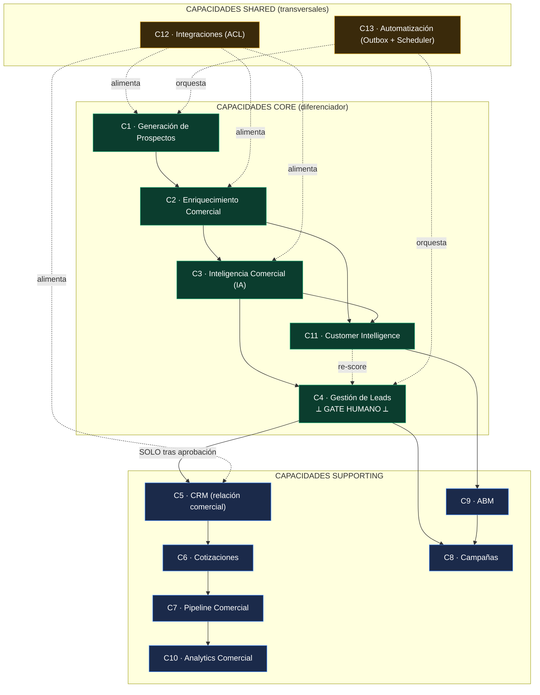

> **Lectura normativa.** La única flecha sólida que cruza de Core a Supporting es **C4 → C5 "SOLO tras aprobación"**. Las capacidades Shared se conectan con flechas punteadas (sirven, no deciden). C11 reinyecta inteligencia a C4 ("re-score") cerrando un loop de aprendizaje sin saltar el gate.

| Plantilla normativa | |
|---|---|
| **Objetivo** | Mapear las 13 capacidades de la Plataforma Comercial y clasificarlas Core/Supporting/Shared con sus dependencias. |
| **Alcance** | El espacio de capacidades de negocio aguas arriba y alrededor del CRM; no incluye Operaciones/Facturación (core transaccional ajeno a esta Constitución). |
| **Decisiones tomadas** | 5 capacidades Core (C1–C4, C11); CRM y Pipeline como Supporting; Integraciones y Automatización como Shared; C4 como frontera de gobernanza del gate humano. |
| **Decisiones descartadas** | (a) CRM como Core — descartado (Parte I §2.2: el diferenciador es *qué entra*, no el CRM). (b) Integraciones como Core — descartado (riesgo de lock-in; son GENERIC/Shared). (c) Automatización con reglas de negocio embebidas — PROHIBIDO. |
| **Justificación** | Concentra rigor donde TOPS compite (adquisición y calificación de demanda) y minimiza esfuerzo en lo comprable; alinea capacidades con subdominios DDD. |
| **Riesgos** | Deriva de una capacidad Supporting a "casi Core" sin revisión; mitigación: revisión anual de esta tabla. |
| **Impacto sobre la arquitectura** | Fija el orden de inversión y justifica que C4 (Leads) sea el punto de control RBAC/RLS más estricto del contexto. |

---

## 2. Information Architecture

### 2.1 Principios

**R-7.2.1 (Propietario único).** Cada **objeto de información** del contexto **DEBE** tener **un solo propietario** (la capacidad que lo crea y gobierna su ciclo de vida) y **una sola fuente de verdad** (el sistema que contiene su estado autoritativo). Múltiples copias caché están permitidas; múltiples fuentes de verdad **están PROHIBIDAS** — aplicación directa del no-negociable "una sola fuente de verdad" ([ERP-ARQUITECTURA-MAESTRA.md:16-17](../../ERP-ARQUITECTURA-MAESTRA.md)).

**R-7.2.2 (Inmutabilidad de hechos).** Los objetos que representan **hechos consumados** (Event, AI Analysis, Enrichment snapshot, CRM Sync log) **DEBEN** ser **append-only**: no se reescriben, se reemplazan por un hecho nuevo. Precedente real: `clientify_sync_log` es un ledger inmutable — `for select` con `comercial.view`, `for insert` con `comercial.edit`, y `for delete` solo `is_admin()`, **sin `update`** ([0045_crm_sync_audit.sql:24-55](../../../supabase/migrations/0045_crm_sync_audit.sql)). Esto refleja INV-PR-4 (decisión humana inmutable) de la Parte II.

### 2.2 Catálogo de objetos de información (tabla)

> **Reconciliación con el DDL (Canonical Model ↔ DDL).** La columna *Fuente de verdad* nombra el **objeto canónico** y su **tabla física del DDL** (`35` §1.1), que es la fuente única de nombres de tabla. En F0 los objetos **Company** y **Contact** están **plegados** en `prospeccion_prospects` (no hay tabla dedicada todavía); **Campaign** es capacidad futura (C8) fuera de las tablas `prospeccion_*` de F0–F7; **Interaction** se materializa en `prospeccion_timeline`/`activities`/`notes` (F6). El nombre físico del Outbox es `prospeccion_events` (`prospeccion_outbox` es el nombre lógico del patrón, CC-2) y el del análisis IA es `prospeccion_ai_content`.

| Objeto | Propietario (capacidad) | Fuente de verdad | Ciclo de vida | Consumidores | Reglas de consistencia |
|--------|-------------------------|------------------|---------------|--------------|------------------------|
| **Prospect** | C1/C4 (Prospección) | `prospeccion_prospects` (AR) | máquina de estados `created→…→customer_created`/`rejected` (Parte II §1.1) | C2, C3, C4, C10, C11 | Estado solo cambia vía AR (INV-PR-1); 1 Prospect ↔ ≤1 `CrmRef` (INV-PR-5) |
| **Company** | C2 (Enriquecimiento) | **F0:** plegada en `prospeccion_prospects` (campos `company_name`/`cuit`/`website`); tabla dedicada = futura | descubierta → enriquecida → vinculada | C2, C9, C11 | Dedup por `Cuit`/`Domain` (Parte II §2.2 `DeduplicationPolicy`) |
| **Contact** | C2/C4 | **F0:** plegado en `prospeccion_prospects` (`full_name`/`email`/`phone`/`cargo`); tabla dedicada = futura | descubierto → validado → asociado a Company | C4, C5, C8 | `Email`/`Phone` como VO válidos por construcción (Parte II §1.3) |
| **Opportunity** | C7 (Pipeline) | CRM (Clientify hoy) + espejo `crm_opportunities` | abierta → etapas → ganada/perdida | C7, C10 | Espejo es **caché**; verdad = CRM mientras CRM sea externo |
| **Customer (Cliente del ERP)** | Core ERP (Identidad) | `clients` (OHS, Parte I R-3.2.2) | creado al cierre de loop (R-1.4.1) | Órdenes, Facturación, Comercial | Alta SOLO por Open Host Service; nunca escritura directa de Prospección |
| **Campaign** | C8 (Campañas) | **futuro** (capacidad C8, fuera de las tablas `prospeccion_*` de F0–F7) / Comercial | borrador → activa → cerrada | C8, C9, C10 | Segmento derivado de Prospects aprobados, no crudos |
| **Interaction** | C4/C5 | `prospeccion_timeline`/`prospeccion_activities`/`prospeccion_notes` (§1.1 = F6) / CRM | append-only por timestamp | C7, C10, C11 | Inmutable (R-7.2.2) |
| **Event (Domain Event)** | Todas (Outbox) | `prospeccion_events` (Outbox físico; `prospeccion_outbox` = nombre lógico del patrón, CC-2) | emitido → publicado → consumido | Consumidores idempotentes (Parte II E-3) | Inmutable, versionado, at-least-once (Parte II §2.1) |
| **AI Analysis** | C3 (IA) | `prospeccion_ai_content` (§1.1 = F4; snapshot) | analizado → (re-analizado = nuevo snapshot) | C4, C11 | Inmutable; identidad `(model, analyzedAt)` (Parte II §1.2) |
| **Enrichment** | C2 (Enriquecimiento) | `prospeccion_enrichment` (§1.1 = F2; snapshot) | tomado en un instante (foto) | C3, C4, C11 | Inmutable; identidad `(provider, fetchedAt)` |
| **Score** | C4 (Leads) / C11 | `prospeccion_scores` (§1.1 = F3; materializado) | recalculable → nueva versión | C4, C10 | Determinista a partir de Enrichment (INV-PR-3); rango 0..100 |
| **CRM Sync** | C5/C13 | `clientify_sync_log` (ledger) | append-only por sync | Auditoría, C10, Operaciones | Append-only inmutable ([0045_crm_sync_audit.sql:43-55](../../../supabase/migrations/0045_crm_sync_audit.sql)) |

**R-7.2.3 (Caché vs. verdad).** Mientras el CRM sea externo, **Opportunity** y partes de **Interaction** viven en el CRM como fuente de verdad y en Nexus como **caché** (`crm_opportunities`, `clientify_sync_log`). Esta dualidad **DEBE** etiquetarse explícitamente; cuando Nexus tenga CRM nativo (Parte I R-1.3.2), la fuente de verdad migra a Nexus **sin** alterar a los propietarios ni a los consumidores definidos arriba.

| Plantilla normativa | |
|---|---|
| **Objetivo** | Declarar propietario, fuente de verdad, ciclo de vida, consumidores y reglas de consistencia de cada objeto de información del contexto. |
| **Alcance** | Todos los objetos de negocio de `prospeccion` y sus puntos de contacto con `clients` y el CRM. |
| **Decisiones tomadas** | Propietario único + fuente de verdad única; snapshots y logs append-only; caché explícita para objetos cuya verdad es externa (Opportunity, CRM Sync). |
| **Decisiones descartadas** | (a) Mutar snapshots de Enrichment/IA — PROHIBIDO (rompe trazabilidad). (b) Dos fuentes de verdad para un objeto — PROHIBIDO (R-7.2.1). (c) Tratar al espejo CRM como verdad mientras el CRM sea externo — descartado. |
| **Justificación** | La auditoría total exige hechos inmutables; el precedente `clientify_sync_log` ya demuestra el patrón ledger en producción. |
| **Riesgos** | Deriva caché↔verdad si el sync falla silenciosamente; mitigación: ledger + reconciliación idempotente (Parte II INV-PR-5; `reconcile.ts`). |
| **Impacto sobre la arquitectura** | Define qué tablas son append-only (RLS sin `update`) y prepara la migración de fuente de verdad al CRM nativo sin reescribir consumidores. |

---

## 3. Canonical Data Model

### 3.1 Principio del modelo canónico

**R-7.3.1 (Nexus es el centro).** Existe **un único modelo canónico de Nexus** para los objetos del contexto (Prospect, Company, Contact, Score, Enrichment, AIAnalysis, CrmRef). **TODO** adapter externo — CRM, IA, enrichment, automatización, LinkedIn — **DEBE** transformar su estructura propia **hacia** el modelo canónico en su frontera (ACL). **Las estructuras externas NUNCA entran al dominio.** Esto refuerza la ACL de la Parte II (§2.6) y el patrón "que las pages no hablen Clientify directamente" ([clientify/mappers.ts:5](../../../src/lib/clientify/mappers.ts)).

**R-7.3.2 (Dirección de la adaptación).** La adaptación es **siempre** `externo → canónico` al entrar y `canónico → externo` al salir. **Está PROHIBIDO** persistir un esquema de proveedor como esquema canónico, o tipar el dominio con tipos del SDK del proveedor (Parte I R-1.3.3; Parte II ACL-1). El dominio define el contrato; el mundo se adapta.

**R-7.3.3 (Value Objects como base del canónico).** Los campos del modelo canónico **DEBEN** ser los Value Objects del dominio (`Email`, `Phone`, `Cuit`, `Domain`, `Money` en centavos, `Score` 0..100, `ConfidenceScore` 0..1), no primitivos crudos (Parte II §1.3). Un adapter que devuelva un `taxId: string` suelto **DEBE** convertirlo a `Cuit` válido o fallar en la frontera.

### 3.2 Ejemplos de mapeo externo → canónico

**Ejemplo A — CRM (Clientify) → canónico.** Precedente real del repo: `clientify/mappers.ts` separa los tipos externos de los internos y el deeplink/ID externo se trata como dato externo, no como identidad de dominio ([clientify/mappers.ts:99-103](../../../src/lib/clientify/mappers.ts)).

| Campo Clientify (externo) | Campo canónico Nexus | Transformación en ACL |
|---------------------------|----------------------|-----------------------|
| `id` (string) | `CrmRef.clientifyId` | se guarda como **referencia externa**, no como `ProspectId` |
| `tax_id` / `cuit` (string) | `Cuit` (VO) | valida 11 dígitos + DV AR; rechaza placeholders |
| `email` (string) | `Email` (VO) | normaliza lowercase/trim (RFC básico) |
| `company.url` | `Domain` (VO) | strip esquema, lowercase, host válido |
| `stage` (string CRM) | `ProspectStatus` (enum dominio) | mapeo cerrado; etapas CRM **no** mutan el AR directamente |

**Ejemplo B — Proveedor de Enrichment → canónico.**

| Campo proveedor (externo) | Campo canónico Nexus | Transformación en ACL |
|---------------------------|----------------------|-----------------------|
| `revenue_estimate` (number float USD) | `EstimatedRevenue` = `Money` (centavos enteros) + `ConfidenceScore` | float → centavos enteros (PROHIBIDO float para dinero, Parte II §1.3); adjunta confianza |
| `employee_count` | `EnrichmentSnapshot.headcount` | entero ≥ 0 |
| `domain` | `Domain` (VO) | normalización idéntica al Ejemplo A |
| respuesta cruda JSON | `EnrichmentSnapshot` (Entity inmutable) | el dominio **nunca** ve el JSON del proveedor (Parte II §2.6) |

**Ejemplo C — Proveedor de IA → canónico.** La señal IA se expone al dominio como **estructura de dominio** (`AIAnalysis` + `ConfidenceScore`), con datos **redactados** antes de salir hacia el modelo (precedente "datos ya REDACTADOS", [iaMatch.ts:57](../../../src/lib/comercial/iaMatch.ts)). El prompt y la respuesta del modelo son detalles de la ACL de IA; el dominio recibe solo el VO `ConfidenceScore` (0..1) y el `AIAnalysis` estructurado.

| Plantilla normativa | |
|---|---|
| **Objetivo** | Fijar el modelo canónico de Nexus y la regla de que todo externo se adapta a él, nunca al revés. |
| **Alcance** | Todas las fronteras de integración del contexto (CRM, IA, enrichment, automatización, LinkedIn). |
| **Decisiones tomadas** | Un modelo canónico basado en VOs; adaptación bidireccional `externo↔canónico` solo en ACL; IDs externos como referencias, no como identidad. |
| **Decisiones descartadas** | (a) Persistir esquema del proveedor como canónico — PROHIBIDO. (b) Tipar el dominio con SDK externo — PROHIBIDO. (c) Pasar JSON crudo del proveedor al dominio — PROHIBIDO. |
| **Justificación** | Es la defensa estructural contra el lock-in y la deriva de API a 10 años; reutiliza el patrón mapper ya probado de `clientify/mappers.ts`. |
| **Riesgos** | Costo de mantener mappers cuando cambian los proveedores; aceptado: el costo del mapper es menor que el del acoplamiento. |
| **Impacto sobre la arquitectura** | Convierte a la ACL en obligación de primer nivel y hace que el dominio sea soberano frente a cualquier proveedor. |

---

## 4. Integration Architecture

### 4.1 Clasificación normativa de integraciones

**R-7.4.1.** Toda integración del contexto **DEBE** clasificarse por su **patrón de interacción**: **Sincrónica** (request-response en línea), **Asincrónica** (encolada/diferida), **Event-Driven** (reacción a eventos de dominio vía Outbox), **Batch** (lote grande puntual) o **Scheduled** (disparada por cron). El patrón elegido **DEBE** justificarse; por defecto, lo que toca un proveedor externo lento o volátil **DEBE** ser Asincrónico/Event-Driven, no Sincrónico (para no acoplar la latencia del proveedor a la UI).

### 4.2 Catálogo de integraciones (tabla)

| Integración | Patrón | Dirección | Contrato de integración | Responsabilidad / borde |
|-------------|:------:|:---------:|-------------------------|-------------------------|
| **Import LinkedIn / CSV** | Batch | entrada | `ProspectFactory.fromImportRow` → `ProspectCreated`/`ProspectImported` | Driving adapter (action/route); ACL valida y arma VOs |
| **Enrichment** | Event-Driven (sobre `ProspectImported`) | salida→entrada | `EnrichmentPort.enrich(...) → Result<EnrichmentSnapshot,{transient}>` | ACL HTTP con backoff 429/5xx, `fetchImpl` inyectable (precedente [clientify/client.ts:42-114](../../../src/lib/clientify/client.ts)) |
| **IA / Inteligencia Comercial** | Event-Driven (sobre `ScoreCalculated`) | salida→entrada | `AIPort.analyze(...) → Result<{AIAnalysis,ConfidenceScore},{transient}>` | ACL de IA; datos redactados; señal como VO |
| **CRM Sync (Clientify) — outbound** | Event-Driven (sobre `CrmSyncRequested`, post-aprobación) | salida | `CrmSyncPort.upsertProspect(...) → Result<CrmRef>`; idempotente por `Cuit`/`clientifyId` | ACL CRM; reusa [clientify/client.ts](../../../src/lib/clientify/client.ts); registra en `clientify_sync_log` |
| **CRM Sync (Clientify) — inbound webhook** | Sincrónica (entrada) | entrada | POST `/api/clientify/webhook/<token>`; token-en-URL **timing-safe** | Route handler público acotado; `verifyWebhookToken` ([clientify/webhook.ts:1-28](../../../src/lib/clientify/webhook.ts)); Conformist (Parte I R-3.2.4) |
| **CRM Sync (deals/contacts) — pull** | Scheduled (cron 21:00 ART) | entrada | POST `/api/clientify/sync-deals` con `Authorization: Bearer CRON_SECRET` | Cron GH Actions ([clientify-dashboard-sync.yml:14-15](../../../.github/workflows/clientify-dashboard-sync.yml)); `runId = randomUUID()` ([sync-deals/route.ts:18-44](../../../src/app/api/clientify/sync-deals/route.ts)) |
| **Cierre de loop → `clients`** | Sincrónica gobernada (sobre `CrmSyncCompleted`) | salida interna | Open Host Service de `clients` (Parte I R-3.2.2) | `CreateCustomer` use case; emite `CustomerCreated` |
| **Outbox → consumidores internos** | Event-Driven | interna | `EventBusPort.publish(events, uow)` en `prospeccion_outbox` (misma tx) | Adapter `OutboxEventBus`; at-least-once, idempotente |

**R-7.4.2 (Contrato de error uniforme).** Toda integración con proveedor externo **DEBE** devolver `Result<T, {reason; transient; attempt}>`. La bandera `transient` gobierna el reintento, con semántica idéntica a `SoapNetworkError.transient` ([arca/soap.ts:21](../../../src/lib/arca/soap.ts)): transitorio → reintento con backoff; permanente → detiene el pipeline para ese prospecto y emite `*.failed` (Parte II §2.1).

**R-7.4.3 (Auditoría de toda sincronización CRM).** Toda escritura/lectura contra el CRM **DEBE** dejar fila en `clientify_sync_log` (`direction`, `entity`, `status`, `payload`) ([0045_crm_sync_audit.sql:24-37](../../../supabase/migrations/0045_crm_sync_audit.sql)). En escritura no-dry-run, si el cliente de auditoría (service-role) no está disponible, la integración **DEBE** devolver 503 en vez de sincronizar sin auditoría — precedente real ([sync-deals/route.ts:40-44](../../../src/app/api/clientify/sync-deals/route.ts)).

| Plantilla normativa | |
|---|---|
| **Objetivo** | Clasificar todas las integraciones por patrón y fijar sus contratos y responsabilidades. |
| **Alcance** | Bordes de entrada y salida del contexto: import, enrichment, IA, CRM (webhook/pull/push), cierre de loop, Outbox. |
| **Decisiones tomadas** | Enrichment/IA/CRM-push como Event-Driven; webhook entrante Sincrónico acotado; pull CRM Scheduled; contrato de error con `transient`; auditoría obligatoria de todo sync. |
| **Decisiones descartadas** | (a) Enrichment/IA sincrónicos en línea con la UI — descartado (acopla latencia del proveedor). (b) Sync al CRM sin fila de auditoría — PROHIBIDO (R-7.4.3). (c) Webhook sin verificación — PROHIBIDO (Clientify no firma; se usa token timing-safe). |
| **Justificación** | Reusa patrones probados (backoff/`fetchImpl`, `transient`, ledger de sync, cron Bearer) y desacopla la UI de proveedores volátiles. |
| **Riesgos** | Complejidad de orquestación event-driven; mitigación: Outbox + retry/DLQ (§6) y observabilidad (§6). |
| **Impacto sobre la arquitectura** | Materializa el Outbox como columna vertebral de integración y fija el CRM como integración auditada, nunca acoplada en línea. |

---

## 5. Security Architecture

### 5.1 Zero Trust

**R-7.5.1 (Zero Trust por defecto).** Ninguna ruta, cron, webhook o consumidor se considera confiable por su origen. Toda solicitud **DEBE** autenticarse y autorizarse en su propio handler, **además** del middleware. El middleware bloquea sin sesión (401 JSON en `/api/*`, redirect en páginas, [supabase/middleware.ts:100-118](../../../src/lib/supabase/middleware.ts)), pero el RBAC se vuelve a verificar dentro (defensa en profundidad, [rbac/check.ts:1-33](../../../src/lib/rbac/check.ts)).

**R-7.5.2 (Allowlist mínima de rutas públicas).** El conjunto de rutas públicas **DEBE** ser mínimo y explícito; agregar una ruta a la allowlist es una decisión de seguridad documentada — el comentario del middleware ya advierte que cualquier ruta allí "queda accesible sin sesión y puede leakear datos sensibles" ([supabase/middleware.ts:40-62](../../../src/lib/supabase/middleware.ts)). Las rutas de Prospección **NO DEBEN** entrar a la allowlist salvo: (a) webhook entrante con token timing-safe, o (b) cron con `Bearer CRON_SECRET` validado dentro del handler.

### 5.2 RBAC

**R-7.5.3.** La autorización **DEBE** apoyarse en el RBAC existente: roles `user_role_t` (`admin`, `operaciones`, `supervisor`, `cliente`, [0001_init.sql:23](../../../supabase/migrations/0001_init.sql)) y permisos por capacidad vía `has_permission(...)` / `is_admin()` / `current_role()` ([0009_rbac.sql](../../../supabase/migrations/0009_rbac.sql)). Prospección **DEBE** definir permisos propios (`prospeccion.view`, `prospeccion.edit`, `prospeccion.approve`, `prospeccion.sync`) por encima de este andamiaje, **sin** inventar un sistema paralelo.

**R-7.5.4 (Gate humano = permiso dedicado).** La aprobación de un lead (C4, R-7.1.3) **DEBE** exigir el permiso `prospeccion.approve`, separado de `prospeccion.edit`. Ninguna automatización ni cron **DEBE** poseer ese permiso: el gate humano es un **límite de confianza** (Parte I R-4.3), no una operación de servicio.

**R-7.5.5 (Gotcha de roles).** `user_role_t` **NO** incluye `'comercial'`; las policies de Prospección **DEBEN** usar `'operaciones'`/`'supervisor'`/`'admin'` y permisos `comercial.*`/`prospeccion.*`, como ya hace el CRM ([0045_crm_sync_audit.sql:50-52](../../../supabase/migrations/0045_crm_sync_audit.sql)).

### 5.3 RLS como frontera

**R-7.5.6.** RLS es la **frontera de datos** primaria: toda tabla `prospeccion_*` **DEBE** tener `enable row level security` y policies por permiso. Las tablas de **hechos** (`prospeccion_events` —Outbox—, `prospeccion_enrichment`, `prospeccion_ai_content`, log de sync) **DEBEN** ser **append-only**: `select` por `prospeccion.view`, `insert` por permiso de escritura, **sin `update`**, y `delete` solo `is_admin()` — patrón exacto del ledger CRM ([0045_crm_sync_audit.sql:43-55](../../../supabase/migrations/0045_crm_sync_audit.sql)).

### 5.4 Service Accounts y mínimo privilegio

**R-7.5.7.** El cliente **service-role** (`createAdminClient()`, [supabase/server.ts:42-56](../../../src/lib/supabase/server.ts)) bypassa RLS y **NUNCA DEBE** exponerse al cliente. **DEBE** usarse solo para: (a) escribir la bitácora de auditoría de un cron, y (b) el seed-check de RBAC (`select count(1) from user_roles` con `head=true`), nunca para autorizar — el permiso real se verifica contra los roles **del usuario**, no del admin ([rbac/check.ts:13-32](../../../src/lib/rbac/check.ts)). Este es el principio de mínimo privilegio literal del repo.

### 5.5 Secrets Management

**R-7.5.8.** Los secretos (`SUPABASE_SERVICE_ROLE_KEY`, `CRON_SECRET`, `CLIENTIFY_WEBHOOK_SECRET`, claves de enrichment/IA) **DEBEN** leerse solo del entorno vía `env` ([env.ts:41,244-245](../../../src/lib/env.ts)) y **NUNCA** commitearse ni loggearse. **Gotcha de despliegue documentado:** en deploys CLI a Netlify, las env vars **secretas** no se inyectan a funciones; un secreto que la función deba leer en runtime requiere atención al nombrarlo (caso `clientify_key` vs `CLIENTIFY_API_KEY`). Las claves de proveedor que toque Prospección **DEBEN** validarse contra este gotcha antes de producción.

### 5.6 Auditoría, Correlation IDs, Trazabilidad

**R-7.5.9 (Correlation ID).** Toda operación de integración o cron **DEBE** generar un identificador de correlación y propagarlo. Precedentes reales: `runId = randomUUID()` por corrida de cron ([sync-deals/route.ts:36](../../../src/app/api/clientify/sync-deals/route.ts)) y `x-request-id` en route handlers ([drive/ping/route.ts:29,47](../../../src/app/api/drive/ping/route.ts)). En Prospección, `eventId` y `aggregateId` (Parte II §2.1) **DEBEN** acompañar todo evento, cerrando la trazabilidad evento↔correlación↔fila de auditoría.

**R-7.5.10 (Trazabilidad de cierre de loop).** Cada `CustomerCreated` **DEBE** poder reconstruirse end-to-end: de qué Prospect vino, qué Enrichment/AIAnalysis lo respaldó, quién lo aprobó (`actorId`, `HumanDecision`) y qué fila de `clientify_sync_log` lo sincronizó. Esta cadena es la encarnación de "auditoría total" del Rector.

### 5.7 Protección de datos — PII de prospectos y privacidad LinkedIn

**R-7.5.11 (PII de prospectos).** Nombres, emails, teléfonos y CUIT de personas de prospectos son **PII**. **DEBEN**: (a) estar protegidos por RLS (solo `prospeccion.view`); (b) **redactarse** antes de salir hacia la ACL de IA (precedente [iaMatch.ts:57](../../../src/lib/comercial/iaMatch.ts)); (c) no aparecer en logs ni en `payload` de auditoría más allá de lo mínimo necesario; (d) tener un mecanismo de **borrado** del staging para un prospecto que pida no ser contactado, sin romper la inmutabilidad de los hechos ya consumados (se borra el dato vivo del AR, no se reescribe el ledger histórico).

**R-7.5.12 (Privacidad LinkedIn).** La importación desde LinkedIn **DEBE** limitarse a datos de naturaleza profesional/B2B obtenidos por medios conformes a los términos de la fuente. Está **PROHIBIDO** persistir datos sensibles ajenos al propósito comercial. La frontera de retención es el **staging de Prospección**: lo que no supera el gate humano no debería propagar PII al CRM (refuerzo de R-1.2.1).

| Plantilla normativa | |
|---|---|
| **Objetivo** | Fijar Zero Trust, RBAC/RLS, service accounts, secretos, correlación/auditoría y protección de PII para el contexto. |
| **Alcance** | Toda superficie de autenticación, autorización, datos y privacidad de Prospección. |
| **Decisiones tomadas** | Zero Trust con doble verificación (middleware + handler); RLS append-only para hechos; service-role solo para auditoría/seed-check; correlation IDs obligatorios; redacción de PII hacia IA; permiso dedicado para el gate humano. |
| **Decisiones descartadas** | (a) RBAC paralelo propio — PROHIBIDO (se reusa `has_permission`/`current_role`). (b) Service-role para autorizar — PROHIBIDO. (c) Enviar PII sin redactar a proveedores IA — PROHIBIDO. (d) Sumar rutas de Prospección a la allowlist pública — descartado salvo webhook/cron acotados. |
| **Justificación** | Reusa el hardening ya en producción (timing-safe webhook, Bearer cron, ledger inmutable, fail-open consciente del RBAC dormido) y lo extiende a un dominio con PII sensible. |
| **Riesgos** | RBAC **dormido** (user_roles vacío) provoca fail-open consciente ([rbac/check.ts](../../../src/lib/rbac/check.ts)); mitigación: seedear roles de Prospección antes de producción y monitorear el WARN. Fuga de PII por log; mitigación: redacción y revisión de payloads. |
| **Impacto sobre la arquitectura** | RLS pasa a ser la frontera dura; obliga a definir permisos `prospeccion.*` y a propagar correlación desde el primer evento hasta `clients`. |

---

## 6. Operational Architecture

### 6.1 Jobs y Scheduler

**R-7.6.1.** Los pasos diferidos del pipeline (enriquecer, scorear, analizar IA, sincronizar CRM) **DEBEN** ejecutarse como **jobs** disparados por eventos del Outbox y/o por **cron** (GitHub Actions), siguiendo el patrón vigente: cron diario 21:00 ART (`0 0 * * *` UTC) que postea con `Authorization: Bearer CRON_SECRET` ([clientify-dashboard-sync.yml:14-15,38-39](../../../.github/workflows/clientify-dashboard-sync.yml)). El handler **DEBE** validar el `CRON_SECRET` dentro y soportar `?dry=1` para recorrer sin escribir ([sync-deals/route.ts:22-44](../../../src/app/api/clientify/sync-deals/route.ts)).

**R-7.6.2 (Deadline / presupuesto de tiempo).** Los jobs serverless **DEBEN** respetar un límite de tiempo y trabajar por lotes con **deadline-awareness**, dado el límite de ejecución de la plataforma — lección operativa real (el fallo histórico de Drive sync fue un 504 "Inactivity Timeout" por walk secuencial). El cron **DEBE** usar `--max-time` y distinguir estados `completed` / `partial` (presupuesto agotado, se completa en la próxima corrida, [contratos-drive-sync.yml:43-63](../../../.github/workflows/contratos-drive-sync.yml)).

### 6.2 Retry y Dead Letter

**R-7.6.3 (Retry con backoff).** Un `*.failed` **transitorio** habilita reintento con backoff exponencial; uno **no-transitorio** detiene el pipeline para ese prospecto (Parte II §2.1; semántica `transient` de [arca/soap.ts:21](../../../src/lib/arca/soap.ts)). El nº de intento (`attempt`) viaja en el payload del evento.

**R-7.6.4 (Dead Letter Queue).** Un evento que agota sus reintentos **DEBE** ir a la **cola de muertos**, que es un **estado del Outbox**: `prospeccion_events` con `status='dead'` (valor ya incluido en el `check` del DDL, `35` §2.2). **NO es una tabla separada** — la DLQ es lógica, no física (coherente con CC-2 y el enum de estado del Outbox). Nunca se descarta en silencio; **DEBE** ser inspeccionable y re-encolable manualmente por un operador con permiso adecuado. *Prohibido el fallo silencioso.*

### 6.3 Health Checks

**R-7.6.5.** Cada integración externa **DEBE** exponer un **ping/health** privado (precedente: `/api/clientify/ping`, `/api/drive/ping` con `requestId`, [drive/ping/route.ts:29-86](../../../src/app/api/drive/ping/route.ts)). Estos endpoints verifican credenciales y conectividad sin efectos de escritura, y devuelven `x-request-id` para correlación.

### 6.4 Observabilidad, Monitoreo, Alertas

**R-7.6.6.** Toda corrida de job **DEBE** emitir métricas vía `MetricsPort` (Parte II §4.8): contadores de prospectos por estado, latencias de proveedor, tasa de `*.failed` transitorio/permanente, tamaño de DLQ. El cron **DEBE** marcar `::warning::` en estados `partial` y fallar la corrida (status ≠ success) ante error real, para que la alerta de GitHub Actions dispare ([contratos-drive-sync.yml:49-63](../../../.github/workflows/contratos-drive-sync.yml)).

**R-7.6.7 (Métricas de negocio).** Más allá de lo técnico, Customer Intelligence (C11) y Analytics (C10) **DEBEN** observar el **embudo**: tasa de aprobación humana, tiempo de prospecto-a-cliente, % de duplicados detectados, costo de IA por prospecto. Estas son las métricas que justifican la Regla de Decisión (Parte I R-1.5.1).

### 6.5 Recuperación

**R-7.6.8 (Replay).** Como el Outbox es un log inmutable de hechos, la recuperación ante fallo **DEBE** poder hacerse por **replay idempotente** de eventos: reconstruir el estado consumiendo eventos desde un punto, sin duplicar efectos (consumidores idempotentes, Parte II E-3; precedente idempotencia `reconcile.ts`). El re-procesamiento de un sync **NO DEBE** crear un segundo `CrmRef` (INV-PR-5).

| Plantilla normativa | |
|---|---|
| **Objetivo** | Definir jobs, scheduling, retry, DLQ, health, observabilidad y recuperación del pipeline. |
| **Alcance** | Toda la operación de los pasos diferidos y las integraciones del contexto. |
| **Decisiones tomadas** | Jobs event-driven + cron 21:00 ART con Bearer y `dry`; deadline-awareness y estados completed/partial; retry por `transient`; DLQ inspeccionable; health pings; métricas técnicas y de embudo; recuperación por replay idempotente. |
| **Decisiones descartadas** | (a) Walk/proceso secuencial sin deadline — descartado (causó el 504 histórico). (b) Descartar eventos agotados — PROHIBIDO (van a DLQ). (c) Cron que reporta success ante error — PROHIBIDO (oculta fallas). |
| **Justificación** | Codifica lecciones operativas reales (timeout serverless, fail-loud en crons) y aprovecha el Outbox para replay seguro. |
| **Riesgos** | Crecimiento del Outbox/DLQ; mitigación: retención/archivado e índices (precedente índices en `clientify_sync_log`). Tormenta de reintentos; mitigación: backoff + tope de `attempt`. |
| **Impacto sobre la arquitectura** | Hace operable el pipeline event-driven y convierte la inmutabilidad del Outbox en capacidad de recuperación. |

---

## 7. Evolution Strategy

### 7.1 Tres zonas de evolución

**R-7.7.1.** El contexto **DEBE** organizarse en tres zonas con distinta velocidad de cambio y distinto rigor de gobernanza: **Stable Core** (estable por años), **Extension Points** (evoluciona de forma controlada) y **Experimental Zone** (cambia rápido, descartable). Un cambio en cada zona tiene distinto umbral de aprobación.

| Zona | Qué contiene | Velocidad | Gobernanza |
|------|--------------|:---------:|------------|
| **Stable Core** | Dominio puro: AR `Prospect`, máquina de estados, invariantes INV-PR-1..6, VOs, contrato de eventos (`prospeccion.prospect.*`), modelo canónico (§3), principio "nada va directo al CRM" | años | cambio = enmienda constitucional (revisión anual) |
| **Extension Points** | Ports (Parte II §4), adapters/ACLs, permisos `prospeccion.*`, policies RLS, schedule de crons, métricas, nuevas capacidades Supporting (C6–C10) | meses | cambio = revisión de arquitectura + tests |
| **Experimental Zone** | Proveedores concretos (CRM, IA, enrichment, LinkedIn), prompts de IA, pesos de `ScoringPolicy`, heurísticas de dedup, campañas/ABM en piloto | semanas | cambio = decisión de equipo dentro de los límites de los ports |

### 7.2 Reglas de evolución

**R-7.7.2 (Lo estable no se acopla a lo experimental).** El Stable Core **NO DEBE** depender de nada de la Experimental Zone (Regla de Dependencia, Parte II §3.1). Cambiar de proveedor de IA/CRM/enrichment **DEBE** ser una operación de la Experimental Zone que no toca el dominio — habilitado por el modelo canónico (§3) y las ACLs.

**R-7.7.3 (Migración del CRM sin reescritura).** Reemplazar Clientify por el CRM nativo de Nexus (Parte I R-1.3.2) **DEBE** ser un cambio de **Extension Point** (nueva implementación de `CrmSyncPort` + migración de fuente de verdad de Opportunity, R-7.2.3), **sin** modificar el Stable Core. Si la migración exigiera tocar el dominio, la ACL falló.

**R-7.7.4 (Evolución de eventos).** El contrato de eventos es Stable Core; su **versionado** (`version`, Parte II E-4) es el Extension Point que permite agregar campos sin romper consumidores. Eliminar o renombrar un evento **DEBE** tratarse como enmienda constitucional.

**R-7.7.5 (Promoción y degradación).** Un experimento exitoso (p.ej. una `ScoringPolicy` validada) **PUEDE** promoverse a Extension Point. Una capacidad Supporting que se vuelva diferenciadora **PUEDE** promoverse a Core en la revisión anual (R-7.1.1). El movimiento inverso (degradar) también es válido y **DEBE** documentarse.

| Plantilla normativa | |
|---|---|
| **Objetivo** | Declarar qué permanece estable por años, qué evoluciona de forma controlada y qué es experimental/descartable. |
| **Alcance** | Toda la base de código y los contratos del contexto `prospeccion` a lo largo de su vigencia de 10 años. |
| **Decisiones tomadas** | Tres zonas (Stable Core / Extension Points / Experimental Zone); dominio + canónico + eventos + invariantes como Stable Core; proveedores y heurísticas como Experimental; CRM-swap como Extension Point. |
| **Decisiones descartadas** | (a) Tratar al proveedor como parte estable — PROHIBIDO (lock-in). (b) Permitir que el Core dependa de un experimento — PROHIBIDO. (c) Romper eventos sin versionar — PROHIBIDO. |
| **Justificación** | Da una política de cambio proporcional al riesgo y operacionaliza la vigencia a 10 años de la Parte I sin congelar la innovación en los bordes. |
| **Riesgos** | Erosión de la frontera Core↔Experimental por presión de entrega; mitigación: lint de capas, revisión de PR y revisión anual de la Constitución. |
| **Impacto sobre la arquitectura** | Cierra el ciclo de las Partes I–VII: lo estratégico y lo táctico quedan protegidos como Stable Core, y la integración/operación/tecnología quedan como puntos de evolución gobernada. |

---

> **Cierre de la Parte VII.** Enterprise Architecture alinea las seis capas de la Plataforma Comercial: el **negocio** (Business Capability Map) se apoya en un **dominio** soberano (Parte II), expresado en **aplicaciones** event-driven, sobre **datos** con propietario y fuente de verdad únicos, conectado al mundo por **integraciones** que se adaptan al **modelo canónico** de Nexus, y operado sobre una **tecnología** con Zero Trust, RBAC, RLS, Outbox, cron y observabilidad. El centro es siempre Nexus; los externos se adaptan a Nexus, nunca al revés; y nada va directo al CRM.
# Security Architecture — Reglas (normativo)

> **Refina la Decisión 8** y endurece la Security Architecture de la Parte VII. Normativo. Defensa en profundidad con la RLS como frontera primaria (RBAC dormido en prod).

## SEC-1 — RLS como frontera primaria
Toda tabla `prospeccion_*` tiene **RLS habilitada**; policies vía `has_permission`/`is_admin`. **NUNCA `using(true)` en tablas con PII.** Las lecturas de usuario van por el **cliente anon** (sujeto a RLS). Mientras el enforcement de RBAC esté dormido, **la RLS es la seguridad de registro** — no los page guards (que caen fail-open).

## SEC-2 — RPC-first (escrituras críticas)
Las escrituras que cambian estado o tocan PII van **solo** vía RPC `SECURITY DEFINER` con `search_path` fijo, **grant a `service_role`** y `revoke` de `public/anon/authenticated`. El front **nunca** escribe directo. Outbox y bitácoras de jobs: escribibles solo por `service_role`.

## SEC-3 — Mínimo privilegio y separación de clientes
Cliente **anon** (RLS) para lecturas de usuario; **`service_role` solo en `src/lib/supabase/server.ts`** (jamás al cliente). Los driving adapters autentican al caller (`auth.getUser()`) **antes** de invocar el caso de uso. Cada componente con el mínimo privilegio necesario.

## SEC-4 — Zero Trust
Toda request **autenticada y autorizada** (sin confianza implícita por red/origen). Entradas inbound (webhooks/cron) **verificadas** (token/HMAC timing-safe, `CRON_SECRET`) **fail-closed**: si falta el secreto → rechazar. **Sin endpoints de mutación sin autenticar.**

## SEC-5 — Gestión y rotación de secretos
Secretos **por nombre**, nunca en repo (`.env` gitignored), nunca al cliente. Keys/`service_role` solo backend. **Gotcha documentado:** Netlify CLI **no inyecta env vars secretas** a funciones (caso `clientify_key`) → verificar en runtime. **Política de rotación**: rotar ante exposición + rotación periódica. `env-check` valida presencia (PASS/FAIL, **nunca imprime el valor**).

## SEC-6 — Auditoría y trazabilidad
Auditoría **append-only** (`audit_log`/`clientify_sync_log`/outbox). `correlation_id` + `causation_id` extremo a extremo. **Toda acción sensible** (approve, sync, export, admin, acceso a PII cruda) se audita con actor + timestamp. Inmutable (DG-7).

## SEC-7 — Protección de PII de terceros
Los prospectos son **PII de terceros** (a veces sin consentimiento, ej. LinkedIn). Reglas: **minimización** (guardar solo lo necesario para calificar); lectura de owners por `profiles_public` (sin email); **clasificación de sensibilidad por campo**; el **acceso a PII cruda se loguea**. Evaluar **cifrado a nivel columna** (pgcrypto) para los campos más sensibles según política.

## SEC-8 — Ciclo de vida de PII / derecho al olvido
**Política de retención explícita** para la PII de prospectos. **Anonimización/seudonimización** de prospectos archivados/rechazados. **Procedimiento de "olvido"** (soft-delete + purga/redacción de campos PII conservando el evento de auditoría) para solicitudes del titular del dato. **Nunca** borrado físico de auditoría; los **campos PII sí** pueden redactarse/anonimizarse.

## SEC-9 — Gobierno del bypass de admin
`is_admin()` bypassa RLS/`has_permission` por diseño → el admin **ve toda la PII**. Es un **riesgo documentado y aceptado**; el acceso admin a PII cruda se **audita**. Opción futura: restricción a nivel campo incluso para admin sobre la PII más sensible.

## SEC-10 — Postura ante la activación de RBAC
Cuando se seedee `user_roles` y `RBAC_ENFORCE=1`, el RBAC pasa a ser **segunda capa** (page/route guards) **sobre** la RLS (defensa en profundidad). Hasta entonces, la RLS + allowlist del middleware es la frontera real. **El diseño de F0 DEBE ser correcto bajo AMBOS estados** (RBAC dormido y activo).

## SEC-11 — Threat model (OWASP) y SSRF en enrichment
El módulo direcciona: **injection** (RPC/parametrizado), **prompt-injection** (AI-4), **broken access control** (RLS+RBAC), **secrets exposure** (SEC-5) y —crítico para enrichment— **SSRF**: los fetch a URLs **provenientes de datos externos/scrapeados** DEBEN validar el destino (**allowlist de esquemas/hosts, bloqueo de IPs internas/metadata, sin redirects a privadas, timeout**). Un fetch de enrichment a una URL arbitraria sin validación es una vulnerabilidad.

## SEC-12 — Cifrado
**TLS en tránsito** (HTTPS/Supabase). **Cifrado at-rest** (gestionado por Supabase). Evaluar **cifrado a nivel columna** (pgcrypto) para PII sensible si la política lo exige. Claves privadas (estilo X.509 ARCA) **nunca** en repo ni DB (regla existente G9).

---

**Objetivo** — Garantizar confidencialidad, integridad, trazabilidad y cumplimiento sobre datos sensibles de terceros, con la frontera correcta dado el estado real del RBAC.
**Alcance** — Todas las tablas `prospeccion_*`, RPCs, adapters, crons, webhooks y el manejo de PII; aplica desde F0.
**Decisiones tomadas** — SEC-1..SEC-12: RLS-primary; RPC-first; mínimo privilegio; Zero Trust fail-closed; secrets + rotación; auditoría inmutable; protección + ciclo de vida + olvido de PII; gobierno de admin-bypass; doble-postura RBAC; threat model + SSRF en enrichment; cifrado.
**Decisiones descartadas** — confiar en guards de app (fail-open hoy); `service_role` ubicuo; perímetro sin enforcement por fila; borrado físico de auditoría.
**Justificación** — Es la única postura honesta dado RBAC dormido; protege PII de terceros desde el día 1 y escala a defensa en profundidad; agrega SSRF y ciclo de vida de PII que un blueprint enterprise no puede omitir.
**Riesgos** — Bug de policy RLS → tests + nunca `using(true)`; admin ve PII → auditado + restricción futura; PII/LinkedIn → decisión legal documentada (SEC-7/8); SSRF → SEC-11.
**Impacto sobre la arquitectura** — Condiciona toda policy RLS, toda RPC, los adapters de enrichment (validación SSRF), el manejo de secretos y el ciclo de vida del dato; es gate del Architecture Review.

---

## §5. Privacy by Design

> **Principio:** Los datos de terceros son prestados, no poseídos. Minimizar recolección, limitar uso, garantizar eliminación.

### 5.1 Fuentes de Import Permitidas y Prohibidas

| Fuente | Tipo | Estado |
|---|---|:---:|
| CSV exportado por el usuario de su propia cuenta de LinkedIn Navigator | Manual | ✅ PERMITIDA |
| Scraping automatizado de LinkedIn vía Firecrawl/Apify/BrightData | Automática | ❌ PROHIBIDA |
| Scraping de sitios web de empresas (datos institucionales públicos) | Automática | ✅ con límites |
| APIs B2B con licencia propia (Apollo.io, ZoomInfo, PDL) | Automática | ✅ con contrato |
| Forms propios con consentimiento explícito | Automática | ✅ |

**CC-L1:** El adaptador `LinkedInCsvImportAdapter` SÓLO procesa CSV exportados manualmente. El campo `source` del evento `ProspectImported` DEBE registrar `'linkedin_csv_manual'`. Adaptadores con scraping automático de LinkedIn son RECHAZADOS en Architecture Review sin excepción.

### 5.2 Política de Retención

| Estado terminal | Plazo máx. desde el evento terminal | Acción |
|---|---|---|
| `cliente_creado` | Indefinido (migra al módulo Cliente) | PII transferida al perfil del Cliente |
| `sincronizado` | 24 meses desde `sincronized_at` | Soft-delete PII (§5.3) |
| `rechazado` | 12 meses desde `rejected_at` | Soft-delete PII |
| `duplicado` | 6 meses desde `duplicado_at` | Soft-delete PII |
| `raw`/`importado` sin avanzar | 90 días desde `created_at` | Soft-delete PII automático |

Cron: `prospeccion-retention-cleanup` (GitHub Actions, 03:00 ART). Invoca RPC `prospeccion_pii_erase(prospect_id)`.

### 5.3 Mecanismo de Borrado PII Compatible con Outbox Append-Only

El Outbox es append-only (ADR-004/OB-4). La solución es **preservar la cadena de auditoría pero vaciar el payload PII**:

- En `prospeccion_prospects`: `full_name → '[BORRADO]'`, `email/phone/linkedin_url → null`, `raw → '{}'`, `pii_erased_at = now()`.
- En `prospeccion_events`: reemplazar `payload` de ese `aggregate_id` por `{_pii_erased: true, _erased_at: "...", event_type: <preservado>}`.
- Insertar `ProspectPiiErased` con `status = 'processed'` para auditoría.

**Campos PII:** `full_name`, `email`, `phone`, `linkedin_url`, `raw`.  
**Campos NO-PII (preservados):** `id`, `short_id`, `status`, timestamps, `source_type`, `company_domain`, `company_name`.

**INV-PR-8:** Después de `prospeccion_pii_erase(id)`, `pii_erased_at IS NOT NULL` y ningún campo PII contiene datos reales.

### 5.4 Marco Legal

| Marco | Aplicabilidad | Artículo clave |
|---|---|---|
| **Ley 25.326** (Argentina) | Aplica directamente | Art. 5 consentimiento, Art. 17 supresión |
| **RGPD** (UE) | Si prospectos son personas físicas de la UE | Art. 6, Art. 17, Art. 30 RAT |
| **LinkedIn ToS** | Restricción contractual | §8.2 prohíbe scraping |

**Registro de Actividades de Tratamiento (RAT):** Responsable: VEROTIN S.A. / martin.battaglia@logisticatops.com. Finalidad: calificación de prospectos comerciales. Categorías: nombre, email, cargo, empresa, teléfono, LinkedIn URL. Destinatarios: Clientify (F5). Plazos: §5.2. Medidas técnicas: RLS + TLS + redacción pre-LLM + soft-delete PII.

### 5.5 Reglas de Enforcement Privacy

- **SEC-PRIV-1:** Ningún adaptador del Enrichment Manager puede recibir el campo `raw` completo. Solo campos mínimos (company_domain, company_name, source_type).
- **SEC-PRIV-2:** La redacción pre-LLM ES un contrato testeable. El adaptador de IA DEBE tener test unitario que verifique que el input al provider NO contiene `full_name`, `email`, `phone`, ni `linkedin_url`. Gate: DoD-8.
- **SEC-PRIV-3:** Todo PR que introduzca scraping automático de LinkedIn es RECHAZADO en Architecture Review independientemente de la calidad técnica.
# Constitución Arquitectónica de la Plataforma Comercial de Nexus

## PARTE VI — ARCHITECTURE GOVERNANCE

> **Bounded context:** `prospeccion`. **Estado:** normativo · **Vigencia:** alineada a la Parte I (10 años, revisión anual obligatoria) · **Gobierno:** subordinada al Documento Rector [TOPS-NEXUS-ERP.md](../../TOPS-NEXUS-ERP.md) y al núcleo de gobernanza de Nexus ([.claude/skills/_shared/GOVERNANCE.md](../../../.claude/skills/_shared/GOVERNANCE.md)).
> **Tono:** normativo. Lo que sigue son **reglas y gates**, no recomendaciones. Donde se diga DEBE / NO DEBE / PROHIBIDO, es vinculante para todo el contexto `prospeccion`.
> **No-fantasy:** este documento describe gobernanza **prescrita**. Al 2026-06-25 el directorio `src/lib/prospeccion` está **vacío**; toda referencia a archivos `prospeccion/*` es **objetivo de diseño**, no estado actual. Las citas `file:line` a otros módulos (`clientify/`, `arca/`, `comercial/`) y a archivos de configuración (`netlify.toml`, `vitest.config.ts`, `package.json`) son **precedentes y hechos reales** del repo, verificados, que esta Parte VI eleva a norma de gobernanza. Los presupuestos numéricos que dependen de un valor vivo (Node, heap, índices) **DEBEN** citar el archivo vivo y no copiar el valor (regla de vigencia, `GOVERNANCE.md:78-80`).

---

### Preámbulo: por qué `prospeccion` necesita gobernanza explícita

Nexus ya tiene un núcleo de gobernanza no-negociable (`GOVERNANCE.md`, gates **G1**–**G11**). Esa capa es **organizacional y operativa**: cuándo se puede deployar (G1), cómo se aplican migraciones (G3), qué es prod (G4), evidencia antes de cerrar (G5), plan antes de código (G7). La Parte VI **no la reemplaza**: la **hereda** y le agrega una capa **arquitectónica** propia del contexto `prospeccion`, porque este contexto —a diferencia de los módulos CRUD-céntricos del repo— es un **pipeline event-driven, hexagonal, provider-agnostic** con una invariante dura de gobierno ("nada va directo al CRM", R-1.2.1) que solo es defendible si la arquitectura se gobierna con la misma severidad que el negocio.

En consecuencia, en `prospeccion` **toda regla de esta Parte VI es subordinada a G1–G11 y aditiva a ellas**: ante conflicto, gana el núcleo `GOVERNANCE.md`. Esta Parte VI ejerce la autoridad técnica (Architecture Governance) **dentro** del marco que la Dirección (Martín Battaglia) fija para todo Nexus.

---

## Capítulo 1 — Principios Arquitectónicos

Los siguientes principios son **OBLIGATORIOS** para todo código, diseño, ADR y PR del contexto `prospeccion`. Un diseño que viole un principio **no es conforme** y **NO DEBE** mergearse (ver Capítulo 4). Cada principio se identifica como **AP-n** (Architecture Principle) y es citable por otras Partes y por los ADR.

### AP-1 — Domain First (el dominio es soberano)
- **Descripción.** El modelo de dominio (`prospeccion/domain/`) es el centro y la fuente de verdad de las reglas; la infraestructura es un detalle periférico. El AR `Prospect`, sus invariantes (INV-PR-1…6, Parte II §1.1) y su máquina de estados gobiernan; nada las puede saltar.
- **Motivación.** La invariante de gobernanza (no-bypass del CRM) solo es defendible si vive dentro de una raíz transaccional pura (Parte II §1.1).
- **Consecuencias.** El dominio NO importa Supabase, `fetch`, ni SDKs (AP-5/AP-15). Los casos de uso delegan toda transición al AR (Regla UC-1, Parte II §2.3).
- **Ejemplo de aplicación.** `approve()` solo es legal desde `ai_analyzed`; si el estado es inválido, el AR lanza `DomainError` y el caso de uso **no persiste nada**.

### AP-2 — Events First (los eventos son ciudadanos de primera clase)
- **Descripción.** Toda transición relevante del agregado emite un Domain Event inmutable (los 9 + `*.failed`, Parte II §2.1). La coordinación entre agregados y módulos es **por eventos**, nunca por llamadas síncronas cruzadas.
- **Motivación.** Desacopla productores de consumidores y permite trazabilidad/auditoría (G10) y evolución (AP-9).
- **Consecuencias.** Existe un Outbox (`prospeccion_outbox`); la entrega es *at-least-once* y los consumidores DEBEN ser idempotentes (AP-8).
- **Ejemplo.** `CrmSyncCompleted` propaga el `CrmRef` sin que el productor conozca a `CreateCustomer`.

### AP-3 — API First / Explicit Contracts (contratos antes que implementación)
- **Descripción.** Toda capacidad expuesta o consumida se define primero como **contrato** (port TypeScript, esquema de evento versionado, DTO Zod) y recién después se implementa. Ver también AP-12.
- **Motivación.** Permite testear y sustituir implementaciones sin tocar el dominio; hace explícita la frontera del contexto.
- **Consecuencias.** Los 9 driven ports + driving ports (Parte II §4) son la "cintura" del hexágono; un port nace solo cuando un caso de uso lo necesita (anti-especulación).
- **Ejemplo.** `EnrichmentPort.enrich(...)` se define antes de elegir proveedor de enriquecimiento.

### AP-4 — Security by Default (seguridad cerrada por defecto)
- **Descripción.** Todo endpoint, cron o action nace **cerrado**: autenticación obligatoria, autorización por RLS/RBAC, validación de entrada en el borde. Lo público es la excepción justificada, no el default.
- **Motivación.** `prospeccion` toca datos comerciales sensibles y tres proveedores externos; un default abierto es una brecha.
- **Consecuencias.** RLS es la frontera real; los crons se autentican con `CRON_SECRET` **fail-closed** (precedente Nexus, skill `security-tops-nexus`); secretos solo en backend (G9, `GOVERNANCE.md:57-62`); datos sensibles **redactados** antes de salir a IA (Parte II §2.6, espejo `iaMatch.ts:57`).
- **Ejemplo.** El webhook/route de ingest verifica token *timing-safe* y rechaza por defecto.

### AP-5 — Provider Agnostic (proveedores intercambiables)
- **Descripción.** Ningún proveedor concreto (LinkedIn, enriquecimiento, IA, Clientify) se consagra como verdad permanente. Cada uno entra por su **port** detrás de una **ACL** (Parte II §2.6).
- **Motivación.** Vigencia a 10 años (R-1.3.1) y reemplazo del CRM externo por un CRM nativo sin reescribir el dominio (R-1.3.2).
- **Consecuencias.** PROHIBIDO importar un SDK/cliente de proveedor desde Dominio o Casos de Uso (Regla ACL-1, Parte II §2.6).
- **Ejemplo.** La ACL de CRM reusa `src/lib/clientify/client.ts` **a través** de `CrmSyncPort`, nunca directo.

### AP-6 — Cloud Native (diseñado para serverless efímero)
- **Descripción.** Todo se diseña para ejecutarse en funciones **stateless, efímeras y con timeout duro** (Netlify Functions sobre Next.js, `netlify.toml`). No se asume proceso longevo, memoria compartida entre invocaciones ni afinidad de contenedor.
- **Motivación.** El runtime real corta a ~26–30 s, no a los 60 nominales de `maxDuration` (ver NFB-1, Capítulo 5). Asumir lo contrario produce 504 (precedente real: el "Inactivity Timeout" del Drive Sync por walk secuencial).
- **Consecuencias.** El trabajo largo se **fracciona** (lotes, deadline interno, paralelismo acotado); el estado vive en Postgres, no en memoria de proceso.
- **Ejemplo.** El pipeline avanza un prospecto por invocación dirigida por eventos, no procesa N en un solo request bloqueante.

### AP-7 — Observability by Default (observabilidad incorporada)
- **Descripción.** Cada caso de uso que toca proveedor o cambia estado emite métricas y logs estructurados vía `MetricsPort` (Parte II §4.8): latencia de proveedor, uso/costo de IA, tasa de `*.failed`, `transient` vs permanente.
- **Motivación.** La gobernanza necesita evidencia (G5/G6, `GOVERNANCE.md:35-43`): no se cierra una tarea sin estado real ni se diagnostica con teoría.
- **Consecuencias.** Existe un `MetricsPort` inyectable; los presupuestos del Capítulo 5 son **medibles** y por tanto exigibles.
- **Ejemplo.** `observe("ai.latency_ms", …)` y `increment("crm_sync.failed", { transient })`.

### AP-8 — Idempotency Everywhere (idempotencia en todos lados)
- **Descripción.** Toda operación reintentable (consumo de evento, sync a CRM, enrichment) DEBE ser idempotente: repetirla no duplica efectos.
- **Motivación.** Entrega *at-least-once* (AP-2) y reintentos serverless hacen inevitables las repeticiones.
- **Consecuencias.** INV-PR-5 (un `Prospect` → a lo sumo un `CrmRef`); idempotencia por `Cuit`/`clientifyId` (precedente `crm_ingest_lead` idempotente, `clientify/reconcile.ts:5`).
- **Ejemplo.** Reintentar `CompleteCrmSync` no crea un segundo contacto en Clientify.

### AP-9 — Backward Compatibility (compatibilidad hacia atrás)
- **Descripción.** Los contratos públicos (esquemas de evento, ports expuestos, DTOs de borde, tablas `prospeccion_*`) evolucionan **sin romper** consumidores existentes. Cambios incompatibles exigen versión nueva + período de convivencia.
- **Motivación.** Alinea con G2 (cambios solo aditivos sobre lo validado, `GOVERNANCE.md:14-18`) y con el versionado de eventos (E-4, Parte II §2.1).
- **Consecuencias.** Los eventos llevan `version: 1`; un cambio de payload incompatible nace como `version: 2`, no muta el `1`.
- **Ejemplo.** Agregar un campo opcional a `ScoreCalculated` es aditivo; renombrar `Score` rompe → requiere versión.

### AP-10 — Fail Gracefully (degradación elegante)
- **Descripción.** Una dependencia ausente o caída **NO DEBE** romper el shell ni perder datos. Se degrada (mock/parcial/diferido) y se emite el `*.failed` correspondiente.
- **Motivación.** Núcleo G11 de Nexus (`GOVERNANCE.md:70-74`): fallback seguro, RBAC cae a `PERMISSIVE` ante timeout, `isMock()` ante falta de Supabase.
- **Consecuencias.** Cada paso con proveedor tiene su contraparte `*.failed` con `reason`/`transient`/`attempt` (Parte II §2.1); un fallo no-transitorio detiene ese prospecto, no el sistema.
- **Ejemplo.** Si el proveedor de enrichment da 5xx, se emite `ProspectEnrichmentFailed{transient:true}` y se reintenta con backoff; no se cae el request.

### AP-11 — Performance Budget (presupuestos de performance vinculantes)
- **Descripción.** Toda ruta caliente respeta los Non-Functional Budgets del Capítulo 5. Un diseño que no quepa en su presupuesto **no es conforme**.
- **Motivación.** El límite serverless real (~26–30 s) y el costo de IA convierten la performance en una **restricción de corrección**, no en una optimización opcional.
- **Consecuencias.** El Architecture Review (Capítulo 4) valida explícitamente el impacto sobre los budgets.
- **Ejemplo.** Un caso de uso que necesite 40 s de proveedor en línea está **prohibido**; se rediseña a asíncrono por eventos.

### AP-12 — Explicit Contracts / Typed Errors (errores tipados, no excepciones desnudas)
- **Descripción.** Los bordes devuelven `Result<T, DomainError>`; los errores de proveedor distinguen `transient` de permanente. Las firmas son explícitas y los estados imposibles son irrepresentables (VOs con `create() → Result`, Parte II §1.3).
- **Motivación.** Precedente directo del repo: `ClientifyError` (`clientify/client.ts:19`), `SoapFaultError`/`SoapNetworkError` con `transient` (`arca/soap.ts:11-27`).
- **Consecuencias.** El orquestador decide reintento/stop **leyendo el tipo**, no parseando mensajes.
- **Ejemplo.** `enrich(...)` retorna `Result<EnrichmentSnapshot, {reason; transient}>`.

### AP-13 — Immutable Events / Append-Only (eventos y ledgers inmutables)
- **Descripción.** Los Domain Events son inmutables (`readonly` en todo el árbol); el Outbox y los logs de sync son **append-only**. Un cambio de opinión es un evento nuevo, no una mutación.
- **Motivación.** Auditoría e inmutabilidad son no-negociables de Nexus (G10, `GOVERNANCE.md:64-68`); INV-PR-4 (decisión humana inmutable).
- **Consecuencias.** PROHIBIDO mutar un evento emitido (Regla E-1); el log de sync no se reescribe (R-1.2.3, Parte I).
- **Ejemplo.** Re-aprobar tras un rechazo emite un evento nuevo; no edita el `ProspectRejected`.

### AP-14 — Configuration over Code (configuración, no hardcode)
- **Descripción.** Valores que varían por entorno o por gobierno (claves, URLs base, umbrales de costo IA, topes de retries, ICP/scoring tunables) viven en configuración/env validada, no incrustados en código.
- **Motivación.** Permite cambiar proveedor/umbral sin redeploy de lógica; respeta G9 (secretos fuera del repo) y la regla de vigencia (citar valor vivo, `GOVERNANCE.md:78-80`).
- **Consecuencias.** El acceso a env pasa por una capa validada (precedente `env-check` en `predev`, `package.json` scripts); los umbrales del Capítulo 5 son parámetros, no constantes mágicas.
- **Ejemplo.** El tope de costo IA por lote es configuración auditable, no un `if (cost > 5)` perdido.

### AP-15 — Infrastructure Independence (independencia de la infraestructura)
- **Descripción.** El dominio y los casos de uso **no conocen** Next.js, Supabase ni proveedor alguno. Toda dependencia externa entra por un port (Dependency Inversion, Parte II §3-4).
- **Motivación.** Hace testeable el dominio sin red ni base, y sustituible toda la capa driven.
- **Consecuencias.** Un import de Dominio→adapter, o de Casos de Uso→`next/*`/`@supabase/*`, es una **violación constitucional** (Regla de Dependencia, Parte II §3.1).
- **Ejemplo.** `ClockPort`/`IdGeneratorPort` en lugar de `Date.now()`/`crypto.randomUUID()` directos (no-determinismo en tests).

### AP-16 — Human-in-the-Loop (la IA asiste, no decide)
- **Descripción.** Ninguna acción irreversible o de salida al CRM se ejecuta sin **decisión humana explícita**. La IA aporta score/resumen; **no aprueba**.
- **Motivación.** Encarnación táctica de "nada va directo al CRM" (R-1.2.1) y de "la IA nunca decide sola" (Parte II Regla DS-1, espejo `iaMatch.ts:63-64`).
- **Consecuencias.** INV-PR-2 (no se alcanza `crm_sync_requested` sin `HumanDecision = approved`).
- **Ejemplo.** El pipeline frena en `ai_analyzed` hasta `ApproveProspect(actorId)`.

### AP-17 — One Source of Truth (una sola fuente de verdad)
- **Descripción.** Sin apps paralelas, sin tablas duplicadas, sin lógica redundante: el alta de cliente y el estado del prospecto tienen un único lugar.
- **Motivación.** No-negociable maestro de Nexus (`ERP-ARQUITECTURA-MAESTRA.md:16-17`, citado en Parte I §1.2); cierre de loop sobre la `clients` canónica (R-1.4.1).
- **Consecuencias.** PROHIBIDO crear formas de alta de cliente paralelas (R-1.4.2); `prospeccion_*` es staging, no un segundo CRM.
- **Ejemplo.** `CreateCustomer` escribe en `clients`, no en una tabla espejo nueva.

| Plantilla normativa (Capítulo 1) | |
|---|---|
| **Objetivo** | Fijar los 17 principios arquitectónicos obligatorios que gobiernan todo diseño y código de `prospeccion`. |
| **Alcance** | Todo el contexto `prospeccion`: dominio, casos de uso, ports, adapters, bordes Next.js, ADR y PR. |
| **Decisiones tomadas** | 17 principios AP-1…AP-17, cada uno con descripción/motivación/consecuencias/ejemplo y anclados a invariantes de Parte II y a gates G1–G11. |
| **Decisiones descartadas** | (a) Principios "blandos" sin consecuencia exigible — descartado: un principio sin gate es decorativo. (b) Permitir SDK de proveedor en dominio "por pragmatismo" — PROHIBIDO (AP-5/AP-15). (c) Decisión de salida al CRM automatizable por IA — descartado (AP-16). |
| **Justificación** | Sin principios exigibles, la Regla de Dependencia y la invariante de no-bypass se erosionan PR a PR. |
| **Riesgos** | Rigidez/verbosidad. Se mitiga: un principio se invoca en el review solo cuando aplica al cambio. |
| **Impacto sobre la arquitectura** | Son la carta magna técnica; el resto de la Parte VI (standards, ADR, review, budgets) operacionaliza estos principios. |

---

## Capítulo 2 — Coding Standards (obligatorios)

Estándares **OBLIGATORIOS**. La conformidad se verifica en el Architecture Review (Capítulo 4) y en `npm run typecheck` / `npm run lint` / `npm run test` (`package.json` scripts).

### 2.1 Estructura de carpetas
`src/lib/prospeccion/` se organiza por **capa hexagonal** (Parte II §3):
```
prospeccion/
  domain/        # AR, entities, vo/, events/, services/, errors/  (capa 0, puro)
  application/   # casos de uso (capa 1)
  ports/         # interfaces driving y driven (capa 2)
  adapters/      # supabase/, enrichment/, ai/, crm/, eventbus/   (capa 3)
```
- La UI vive bajo `src/app/(app)/comercial/prospeccion/`; el borde (actions/routes) **compone** casos de uso, no contiene reglas (Parte II §3.2).
- **PROHIBIDO** un `data.ts` plano que mezcle acceso, fallback y mapeo en este contexto (excepción deliberada al patrón general, Parte II Preámbulo). El `data.ts` idiomático del repo (p.ej. `comercial/leads-data.ts:44`) es legítimo en módulos CRUD, no acá.

---

**CS-BOUNDARY-1 (ARB 2026-06-25 — Enforcement Técnico):** La Regla de Dependencia (el dominio nunca importa infraestructura) se verifica automáticamente mediante `eslint-plugin-boundaries`. Configuración OBLIGATORIA antes del primer PR de `prospeccion`:

```json
{
  "settings": {
    "boundaries/elements": [
      { "type": "domain",      "pattern": "src/lib/prospeccion/domain/**"         },
      { "type": "application", "pattern": "src/lib/prospeccion/application/**"    },
      { "type": "port",        "pattern": "src/lib/prospeccion/ports/**"          },
      { "type": "adapter",     "pattern": "src/lib/prospeccion/adapters/**"       },
      { "type": "infra",       "pattern": "src/lib/prospeccion/infrastructure/**" }
    ],
    "boundaries/rules": [
      { "from": "domain",      "disallow": ["adapter", "infra", "@supabase/*", "next/*"] },
      { "from": "application", "disallow": ["adapter", "infra", "@supabase/*", "next/*"] },
      { "from": "port",        "disallow": ["adapter", "infra"] }
    ]
  }
}
```

Un import violatorio genera **ERROR de lint** (no warning). Corre en `npm run lint` y bloquea el CI. Ver DoD-11.

---

### 2.2 Nomenclatura
- Carpetas y archivos: `kebab-case` (precedente repo: `leads-data.ts`, `commercial-score.ts`).
- Tipos/clases/VOs: `PascalCase` (`Prospect`, `EnrichmentSnapshot`, `CrmSyncPort`).
- Eventos: `PascalCase` para el tipo, `dotted.lowercase` para el `name` (`"prospeccion.prospect.scored"`).
- Funciones/variables: `camelCase`. Constantes de configuración: `SCREAMING_SNAKE_CASE`.
- Sufijos de rol: `*Port` (interfaces), `*UseCase` (driving), `*Policy` (domain service), `*Repository`/`*Adapter` (adapters), `*Error` (errores tipados).

### 2.3 DTOs
- Todo dato que cruza el borde (entrada de action/route, salida a UI) se valida con **Zod** (`zod` ya es dependencia, `package.json`) y se mapea a VOs del dominio en el borde, nunca dentro del dominio.
- Un DTO **no** es una entidad: es transporte. PROHIBIDO pasar un DTO crudo al AR; se construyen VOs con `create() → Result` (AP-12).
- Los DTOs son `readonly`.

### 2.4 Eventos
- Estructura común obligatoria: `eventId`, `name`, `aggregateId`, `occurredAt`, `version`, `payload` (Parte II §2.1).
- `readonly` en todo el árbol (E-1/AP-13). `occurredAt` vía `ClockPort`; `eventId` vía `IdGeneratorPort` (AP-15).
- Cada paso con proveedor define su `*.failed` con `reason`/`transient`/`attempt` (AP-10).
- Versionado obligatorio (`version`) para evolución sin romper consumidores (AP-9).

### 2.5 RPC (Supabase)
- Toda escritura crítica de estado pasa por **RPC `SECURITY DEFINER`**; el front nunca escribe directo (G10, `GOVERNANCE.md:64-68`).
- El Outbox y el agregado se persisten en **una** transacción (Patrón Outbox, INV frontera Parte II §1.1) vía `UnitOfWorkPort`.
- Los nombres de RPC del contexto llevan prefijo `prospeccion_` (espejo de la familia `crm_ingest_lead`, Parte I R-1.2.2).

---

**CS-RPC-1 (ARB 2026-06-25, reforzada por ARCH-002):** Cada caso de uso que muta el Aggregate Root `Prospect` DEBE implementarse como una función PL/pgSQL `SECURITY DEFINER` con `set search_path = public` en Postgres. El adaptador `SupabaseUnitOfWork` invoca estas funciones exclusivamente vía `.rpc(nombre, payload)`. La atomicidad AR+Outbox se garantiza dentro de la misma transacción PL/pgSQL. Dos llamadas separadas desde TypeScript (INSERT AR + INSERT Outbox) son **PROHIBIDAS** — rompen la garantía transaccional. Cada nuevo caso de uso de mutación REQUIERE su RPC dedicada antes del merge.

> **CS-RPC-2 (ARCH-002 — la RPC es persistencia mecánica, NO dominio):** estas funciones son **"persistence RPCs"**: reciben un **snapshot ya validado** por el AR en TypeScript y SOLO ejecutan escritura mecánica (INSERT/UPDATE del estado del agregado + INSERT de sus eventos en el Outbox, en una transacción). Está **PROHIBIDO** colocar reglas de negocio dentro del PL/pgSQL: nada de validación de transiciones de la máquina de estados, de invariantes INV-PR-1…6, de dedup-policy ni de scoring. Toda decisión de dominio vive en el AR (`prospeccion/domain/`) y se evalúa **antes** de `UnitOfWork.run(...)`. Razón: una regla de negocio embebida en PL/pgSQL traslada la lógica de dominio a la capa de Infraestructura (Postgres) e **invierte la Regla de Dependencia (AP-1/AP-15) de forma permanente y silenciosa** — ningún lint de import-boundaries (CS-BOUNDARY-1) puede detectarlo porque ocurre fuera de TypeScript. **Excepción acotada:** la RPC `prospeccion_ingest` de F0 contiene normalización de strings y la cadena de dedup por SQL **por performance de ingesta masiva**; está documentada como excepción deliberada (Persistencia §2.2/§4.1) y NO se generaliza a las RPC de transición (enrich/score/approve/sync), que son estrictamente mecánicas. La `DeduplicationPolicy` del dominio (Parte II §2.2) sigue siendo la fuente de verdad conceptual del criterio de duplicado.

---

### 2.6 Adapters
- Un adapter implementa **un** port; es intercambiable (AP-3/AP-15).
- Clientes HTTP de proveedor: timeout + retries con backoff, `fetchImpl` **inyectable** para tests — patrón exacto de `clientify/client.ts` (default `maxRetries: 2`, `client.ts:39`; manejo de 429/5xx documentado en `client.ts:14`) y `arca/soap.ts` (POST con timeout + retries).
- El adapter mapea fila/JSON externo ↔ dominio (ACL); el dominio nunca ve el formato del proveedor (Regla ACL-1).

### 2.7 Repositories
- **Un repositorio por Aggregate Root** → existe solo `ProspectRepositoryPort` (Regla R-1, Parte II §2.4). PROHIBIDO repos para entidades internas.
- Devuelve/acepta el **agregado reconstituido**, no filas crudas; el mapeo vive en el adapter Supabase (precedente `clientify/mappers.ts`).
- `save(p, uow)` siempre dentro de la transacción (§2.5).

### 2.8 Casos de uso
- Patrón fijo: cargar AR → invocar método del AR o `*Policy` → recolectar eventos → persistir agregado + eventos en una `UnitOfWork` (Parte II §2.3).
- **No contienen reglas de transición** (Regla UC-1): delegan en el AR.
- Dependen **solo de ports** (AP-3/AP-15). Traducen errores de proveedor a `*.failed` por `transient` (Regla UC-2).

### 2.9 Servicios de dominio
- **Puros, síncronos, sin I/O** (`ScoringPolicy`, `DeduplicationPolicy`, `PromotionPolicy`). Precedente: `calculateCommercialScore(...)` (`commercial-score.ts:82`), motor de `matching.ts`.
- Señales externas caras (similitud IA) se **inyectan como función** pre-computada (`SimTextoFn`-style, `iaMatch.ts:19`); el servicio no llama a IA ni a base (Regla DS-1).

### 2.10 APIs (actions / routes / crons)
- Responsabilidad única: autenticar/autorizar (RLS/RBAC, AP-4), validar (Zod), componer el caso de uso, traducir `Result`/`DomainError` a HTTP/UI. Cero reglas de negocio (Parte II §3.2).
- Crons (GH Actions) autenticados **fail-closed** con `CRON_SECRET`; exigen `status` real para considerarse exitosos (precedente Drive Sync remediation).
- Headers de seguridad globales ya fijados en `netlify.toml` (`X-Frame-Options`, `X-Content-Type-Options`, HSTS, `Permissions-Policy`).

### 2.11 Migraciones
- **Numeradas, secuenciales, idempotentes, aplicadas A MANO** por Martín en el SQL Editor (G3, `GOVERNANCE.md:20-26`). El asistente prepara/muestra; **no** ejecuta WRITES; PROHIBIDO `supabase db push`.
- No reusar números con hueco histórico; el próximo libre se verifica contra prod (`arsksytgdnzukbmfgkju`, G4). Tablas `prospeccion_*` con RLS en todas.

### 2.12 Testing
- Tests **unitarios puros** del dominio y servicios (sin IO), corridos con Vitest (`vitest run`, `package.json`). El glob de `vitest.config.ts` ya incluye `src/lib/comercial/**/*.test.ts`; al crear el contexto se DEBE **extender** ese `include` con `src/lib/prospeccion/**/*.test.ts`.
- Inyección de `fetchImpl`/`simTexto`/`Clock`/`IdGen` hace los tests deterministas y sin red (precedente probado en `soap.ts`/`matching.ts`).
- Cobertura mínima exigida en el review: AR (todas las transiciones legales e ilegales), cada `*Policy`, cada ACL (mapeo + manejo de `transient`).

### 2.13 Documentación
- Cada decisión arquitectónica relevante → **ADR** (Capítulo 3). Cada port y evento → comentario de contrato (qué garantiza, qué precondición exige).
- Esta Constitución (`docs/prospeccion/_parts/*`) es la fuente normativa; los reportes de handoff son snapshots históricos (`GOVERNANCE.md:78`).

| Plantilla normativa (Capítulo 2) | |
|---|---|
| **Objetivo** | Fijar estándares de código exigibles por capa y por artefacto, verificables por typecheck/lint/test y por review. |
| **Alcance** | Estructura, nomenclatura, DTOs, eventos, RPC, adapters, repos, casos de uso, servicios, APIs, migraciones, testing, docs. |
| **Decisiones tomadas** | Estructura por capa hexagonal; Zod en el borde; un repo por AR; clientes con `fetchImpl` inyectable; migraciones a mano (G3); extender el `include` de `vitest.config.ts`. |
| **Decisiones descartadas** | (a) `data.ts` plano en este contexto — PROHIBIDO. (b) Excepciones desnudas — descartado a favor de `Result` (AP-12). (c) `supabase db push` — PROHIBIDO (G3). |
| **Justificación** | Reusa patrones ya probados del repo y los hace norma; mantiene el dominio testeable sin red. |
| **Riesgos** | Más archivos que el patrón plano. Aceptado por densidad de reglas y criticidad de la invariante. |
| **Impacto sobre la arquitectura** | Operacionaliza AP-1…AP-17 en convenciones concretas y deja la conformidad medible. |

---

## Capítulo 3 — ADR Governance

Un **ADR** (Architecture Decision Record) documenta una decisión arquitectónica significativa, su contexto y sus consecuencias. En `prospeccion` los ADR son **obligatorios** para las decisiones del listado 3.1 y son insumo del Architecture Review (Capítulo 4).

### 3.1 Cuándo DEBE escribirse un ADR (decisiones que lo obligan)
Un ADR es **OBLIGATORIO** cuando la decisión:
1. **Cambia o agrega un contrato público** — un port, un esquema de evento (o sube su `version`), un DTO de borde, una tabla `prospeccion_*` (AP-3/AP-9).
2. **Altera la máquina de estados o una invariante** del AR `Prospect` (INV-PR-1…6).
3. **Incorpora, reemplaza o retira un proveedor externo** (enrichment, IA, CRM, fuente de import) o su ACL (AP-5).
4. **Modifica un Non-Functional Budget** del Capítulo 5 (timeout, retries, tope de costo IA, tamaño de evento).
5. **Cruza la frontera del bounded context** (acoplamiento con `comercial`, `clientify`, `clients`, ERP).
6. **Introduce una excepción a un principio AP-n** o a un gate G1–G11 (la excepción DEBE quedar registrada, con su justificación y su fecha de revisión).
7. **Cambia el mecanismo de propagación** (Outbox, transporte de eventos, idempotencia).

NO requieren ADR: renombres internos sin impacto de contrato, refactors que preservan firmas, fixes de bug sin cambio de decisión.

### 3.2 Ciclo de vida (estados)
Un ADR transita por estados explícitos:
- **Proposed** — redactado, en revisión; aún no vinculante.
- **Accepted** — aprobado en el Architecture Review (Capítulo 4) y, donde G7 aplica, con OK de la Dirección. Es vinculante.
- **Deprecated** — ya no se recomienda, pero su decisión sigue en código hasta su retiro.
- **Superseded by ADR-NNNN** — reemplazado por otro ADR; el nuevo enlaza al viejo y viceversa. **Un ADR Accepted nunca se edita en su contenido decisorio**: se supersede (AP-13, inmutabilidad de la decisión).

### 3.3 Versionado y ubicación
- Viven en `docs/prospeccion/adr/NNNN-titulo-en-kebab.md`, numeración secuencial sin reuso de huecos (espejo de la disciplina de migraciones G3).
- Formato mínimo: **Título · Estado · Fecha · Contexto · Decisión · Consecuencias · Alternativas descartadas · Principios/Gates afectados (AP-n / G-n) · Revisión (fecha)**.
- Toda regla `R-x.y` o `AP-n` que un ADR toque DEBE citarse por su identificador, para trazabilidad bidireccional con esta Constitución.
- El estado vive en el encabezado del archivo; el historial vive en git (no se borra un ADR, se marca Deprecated/Superseded — AP-13).

| Plantilla normativa (Capítulo 3) | |
|---|---|
| **Objetivo** | Definir cuándo, cómo y dónde se registran las decisiones arquitectónicas, y cómo evolucionan sin perder trazabilidad. |
| **Alcance** | Toda decisión significativa de `prospeccion` (contratos, invariantes, proveedores, budgets, fronteras, excepciones). |
| **Decisiones tomadas** | 7 disparadores obligatorios; ciclo Proposed→Accepted→Deprecated→Superseded; ADR inmutable (se supersede); ubicación `docs/prospeccion/adr/`, numeración sin huecos. |
| **Decisiones descartadas** | (a) ADR para todo cambio — descartado (ruido). (b) Editar un Accepted — PROHIBIDO (AP-13). (c) ADR fuera del repo (wiki externa) — descartado: la decisión vive con el código. |
| **Justificación** | La vigencia a 10 años (Parte I) exige memoria de por qué se decidió cada cosa; sin ADR, las excepciones se vuelven invisibles. |
| **Riesgos** | Burocracia. Se mitiga con el listado cerrado 3.1 y formato mínimo. |
| **Impacto sobre la arquitectura** | Hace auditable la evolución; conecta cada cambio con AP-n/G-n y alimenta el review. |

---

## Capítulo 4 — Definition of Architecture Review (gate formal)

El **Architecture Review** es un **gate obligatorio** previo al merge de todo cambio que toque `prospeccion` y caiga en el alcance del Capítulo 3.1. Es la materialización técnica de **G7** (plan→aprobación→build, `GOVERNANCE.md:45-48`) y queda **subordinado a G1** (nada se mergea/deploya a `main` sin OK de la Dirección, `GOVERNANCE.md:8-12`).

### 4.1 Proceso (gate-heavy, una fase por vez)
1. **Diseño** → ADR(s) en estado *Proposed* (Capítulo 3) + alcance escrito.
2. **Presentación de alcance** al Architecture Owner; se corre el checklist 4.2.
3. **Aprobación** → ADR a *Accepted*; donde G7/G1 aplican, OK explícito de la Dirección.
4. **Build** → recién entonces se escribe código (G7).
5. **Verificación con evidencia** (G5): typecheck/lint/test verdes (`package.json`), lectura de estado real, caso de prueba ejecutado. "No fantasy": nunca declarar "validado" sin evidencia (`GOVERNANCE.md:6`).
6. **Merge/deploy**: solo con OK de la Dirección (G1).

### 4.2 Checklist obligatorio (todo ítem DEBE responderse)
**Alineación de paradigma**
- [ ] **DDD táctico:** ¿el cambio respeta el AR único `Prospect` y sus invariantes (INV-PR-1…6)? ¿No crea ARs ni repos espurios?
- [ ] **Hexagonal / Regla de Dependencia:** ¿las dependencias apuntan hacia adentro? ¿Cero imports Dominio→infra / Casos de Uso→`next`/`@supabase` (AP-15)?
- [ ] **Event-Driven:** ¿toda transición emite su evento + su `*.failed`? ¿Persistencia atómica vía Outbox (AP-2/AP-13)?

**Impacto**
- [ ] **Core Domain:** ¿toca la máquina de estados o una invariante? → ADR obligatorio (3.1.2).
- [ ] **Bounded Contexts / fronteras:** ¿acopla con `comercial`/`clientify`/`clients`/ERP? ¿El cruce es por contrato/evento, no por import directo (AP-17, R-1.4.2)?
- [ ] **Contratos públicos:** ¿cambia un port/evento/DTO/tabla? ¿Es backward-compatible o sube `version` (AP-9)?
- [ ] **No-bypass del CRM:** ¿algún camino nuevo permite llegar al CRM sin `HumanDecision = approved` (INV-PR-2/AP-16)? Si sí → **rechazo**.
- [ ] **Provider-agnostic:** ¿algún SDK de proveedor se filtró a Dominio/Casos de Uso (AP-5, Regla ACL-1)? Si sí → **rechazo**.
- [ ] **Performance:** ¿cabe en los Non-Functional Budgets (Capítulo 5)? ¿Respeta el límite serverless ~26–30 s (NFB-1)?
- [ ] **Observabilidad:** ¿emite métricas/logs de latencia, costo IA, `*.failed` (AP-7)?
- [ ] **Seguridad:** ¿RLS/RBAC aplican? ¿Crons fail-closed? ¿Secretos fuera del cliente (G9)? ¿Datos redactados antes de IA?
- [ ] **Idempotencia:** ¿los consumidores/sync son idempotentes (AP-8, INV-PR-5)?
- [ ] **Migraciones:** ¿numerada, idempotente, a mano (G3)? ¿RLS en tablas nuevas?
- [ ] **Tests/Evidencia:** ¿hay tests del cambio? ¿`vitest.config.ts include` cubre el path? ¿Build verde (G5)?
- [ ] **ADR:** ¿existe ADR *Accepted* para cada disparador del Capítulo 3.1?

Cualquier ítem en rojo **bloquea el merge**. Las dos preguntas marcadas "→ rechazo" (no-bypass del CRM y filtración de SDK) son **hard stops**: no admiten excepción sin ADR de excepción aprobado por la Dirección (3.1.6).

| Plantilla normativa (Capítulo 4) | |
|---|---|
| **Objetivo** | Definir el gate formal de revisión arquitectónica y su checklist obligatorio antes de cualquier merge. |
| **Alcance** | Todo cambio en `prospeccion` que caiga en el Capítulo 3.1. |
| **Decisiones tomadas** | Proceso de 6 pasos subordinado a G7/G1/G5; checklist de paradigma + impacto; dos hard-stops (no-bypass del CRM, SDK en el dominio). |
| **Decisiones descartadas** | (a) Review informal "a ojo" — descartado (no auditable). (b) Merge antes de evidencia — PROHIBIDO (G5). (c) Excepciones sin registro — descartado (exigen ADR 3.1.6). |
| **Justificación** | Sin un gate explícito, los principios y la invariante de gobierno se erosionan; G7 ya exige plan→OK→build. |
| **Riesgos** | Fricción/latencia de entrega. Se mitiga: el checklist solo aplica al alcance del Capítulo 3.1; el resto pasa por typecheck/lint/test. |
| **Impacto sobre la arquitectura** | Es el punto de control que conecta principios, standards, ADR y budgets en una decisión de merge defendible. |

---

## Capítulo 5 — Non-Functional Budgets (justificados)

Presupuestos **vinculantes** (AP-11). Cada uno es **medible** vía `MetricsPort` (AP-7) y se valida en el review (Capítulo 4). Los valores son **objetivos de diseño**: donde dependan de un límite de plataforma, citan el hecho vivo y se ajustan por ADR (3.1.4), no a mano en el código.

| ID | Presupuesto | Valor objetivo | Justificación técnica |
|---|---|---|---|
| **NFB-1** | Latencia máx. de una invocación serverless (request síncrono) | **≤ ~26–30 s de pared** (margen real, no los 60 s nominales de `maxDuration`) | El runtime de Netlify Functions corta antes de los 60 s nominales; el límite **operativo real observado es ~26–30 s**. Precedente real: el Drive Sync daba **504 "Inactivity Timeout"** por walk **secuencial** que superaba el límite del contenedor (fix = paralelizar + deadline interno + lotes). Por eso AP-6: el trabajo largo se fracciona, no se bloquea. |
| **NFB-2** | Timeout de enrichment (1 proveedor, 1 prospecto) | **≤ 8 s** por intento; **≤ 2 reintentos** | Debe caber **con holgura** dentro de NFB-1 dejando margen para mapeo + persistencia + Outbox. Alineado con el default `maxRetries: 2` del cliente HTTP del repo (`clientify/client.ts:39`) y el manejo de 429/5xx con backoff (`client.ts:14`). |
| **NFB-3** | Timeout de IA (1 análisis) | **≤ 15 s** por intento; **1 reintinto** transitorio | La IA es el paso más caro en tiempo; aún así DEBE caber en NFB-1 dejando margen. Si excede, se rediseña a asíncrono por evento (AP-6), nunca se sube el timeout del request. |
| **NFB-4** | Tiempo máx. de sync CRM (1 prospecto) | **≤ 10 s** incluyendo dedupe idempotente | Idempotente por `Cuit`/`clientifyId` (AP-8/INV-PR-5); cabe en NFB-1. Reusa el cliente Clientify (300 req/min, `client.ts:14`) a través de la ACL. |
| **NFB-5** | Tamaño máx. de un Domain Event (payload) | **≤ 32 KB** serializado | Los eventos son **hechos**, no documentos: snapshots grandes (texto IA crudo, JSON de proveedor) van por referencia, no embebidos. Mantiene el Outbox y el transporte livianos y la entrega *at-least-once* barata (AP-2). |
| **NFB-6** | Límite de retries por paso con proveedor | **≤ 2** reintentos (enrichment/CRM), **≤ 1** (IA), con backoff exponencial | Espejo del default del repo (`maxRetries: 2`, `client.ts:39`). Un `*.failed{transient:false}` **no** reintenta y detiene ese prospecto (Parte II §2.1). Evita tormentas de reintentos contra proveedores con rate-limit. |
| **NFB-7** | Tope de costo IA | **Configurable por lote y por día** (AP-14), con **corte duro** al excederse | El costo de IA es el riesgo económico del pipeline. El tope vive en configuración auditable, no en código; al excederse se emite `*.failed` y se frena el lote (fail-closed, AP-4). Medido vía `MetricsPort` (uso IA, AP-7). |
| **NFB-8** | Límite de concurrencia | **In-memory por proceso, NO cross-container**; serialización real por **lock en Postgres** | El rate-limit / contador en memoria de una función es **por proceso/contenedor efímero**: no coordina entre invocaciones concurrentes ni entre contenedores (AP-6). Por eso la concurrencia real contra un proveedor o sobre un mismo `Prospect` se controla con un **lock/claim en Postgres** (la única fuente compartida), no con un contador en RAM. |

**Regla NFB-0 (presupuesto agregado).** La suma de los pasos síncronos de **un** request DEBE caber en NFB-1. Como NFB-2+NFB-3+NFB-4 superan ~26–30 s si se encadenan en línea, el pipeline **DEBE** ejecutarse **un paso por invocación** dirigido por eventos (AP-2/AP-6), nunca el ciclo completo en un solo request bloqueante.

| Plantilla normativa (Capítulo 5) | |
|---|---|
| **Objetivo** | Fijar presupuestos no-funcionales medibles y vinculantes, cada uno con su justificación técnica. |
| **Alcance** | Toda ruta caliente de `prospeccion`: enrichment, IA, sync CRM, eventos, concurrencia, costo. |
| **Decisiones tomadas** | NFB-1…NFB-8 + NFB-0; límite serverless real ~26–30 s; retries ≤2/≤1; evento ≤32 KB; concurrencia por lock Postgres (no RAM); tope de costo IA configurable y fail-closed. |
| **Decisiones descartadas** | (a) Confiar en `maxDuration=60` — descartado (no es el límite real; 504 reproducido). (b) Pipeline completo en un request — PROHIBIDO (NFB-0). (c) Rate-limit/concurrencia solo in-memory — descartado (no cross-container, NFB-8). |
| **Justificación** | El límite serverless y el costo de IA son restricciones de corrección; ignorarlas produce 504 y costos no acotados (precedentes reales). |
| **Riesgos** | Budgets demasiado ajustados frenan features legítimas. Se mitiga: se ajustan por ADR (3.1.4), con evidencia de medición. |
| **Impacto sobre la arquitectura** | Fuerzan el diseño asíncrono por eventos y el control de concurrencia en Postgres; son criterio de aceptación en el review. |

---

## Capítulo 6 — Technology Radar

Clasificación **Adopt / Trial / Assess / Hold** para `prospeccion`. **Adopt** = estándar por defecto; **Trial** = usar en alcance acotado con evidencia; **Assess** = investigar antes de comprometer; **Hold** = no introducir sin ADR de excepción aprobado.

### IA
| Anillo | Ítem | Justificación |
|---|---|---|
| Adopt | IA **detrás de `AIPort` + ACL**, señal expuesta como función pura inyectable (`SimTextoFn`-style, `iaMatch.ts:19`); datos **redactados** antes de salir | AP-5/AP-16; la IA asiste, no decide. |
| Assess | Proveedor/modelo concreto de IA | Es detalle intercambiable (R-1.3.1); se elige por ADR midiendo NFB-3/NFB-7. |
| Hold | IA que **decide** la salida al CRM o escribe directo | Viola AP-16/INV-PR-2 (hard stop del review). |

### CRM
| Anillo | Ítem | Justificación |
|---|---|---|
| Adopt | **Clientify a través de `CrmSyncPort` + ACL**, idempotente | Reusa `clientify/client.ts` sin acoplar el dominio (AP-5/AP-8). |
| Trial | **CRM nativo de Nexus** (`crm_leads`/`crm_opportunities` + `clients`) como destino futuro | R-1.3.2: reemplazar el CRM externo sin reescribir el dominio. |
| Hold | Escritura directa al CRM saltando el port | R-1.2.3 / AP-16. |

### Enrichment
| Anillo | Ítem | Justificación |
|---|---|---|
| Adopt | **`EnrichmentPort` + ACL** con `fetchImpl` inyectable, backoff, `transient` | Patrón probado `client.ts`/`soap.ts`; testeable sin red. |
| Assess | Proveedor de enriquecimiento concreto (datos de empresa/contacto) | Intercambiable; se elige por ADR midiendo NFB-2 y costo. |
| Hold | SDK de proveedor importado en Dominio/Casos de Uso | Regla ACL-1 / AP-15. |

### Event Bus
| Anillo | Ítem | Justificación |
|---|---|---|
| Adopt | **Outbox en Postgres** (`prospeccion_outbox`) escrito en la transacción del agregado | Atomicidad evento↔estado; cero infra nueva (AP-2/AP-6). |
| Assess | Broker dedicado (cola/stream gestionado) si el volumen lo exige | Solo si el Outbox+poller no alcanza; decisión por ADR (3.1.7). |
| Hold | Bus en memoria del proceso como mecanismo de entrega | Efímero, no cross-container (NFB-8/AP-6). |

### Bases de datos
| Anillo | Ítem | Justificación |
|---|---|---|
| Adopt | **Supabase/Postgres prod `arsksytgdnzukbmfgkju`** con RLS, RPC `SECURITY DEFINER`, PostGIS | G4/G10; fuente de verdad única (AP-17). |
| Adopt | **Locks/claims en Postgres** para concurrencia real | NFB-8: la única fuente compartida entre contenedores. |
| Hold | Segunda base / tabla espejo paralela al CRM | AP-17 / R-1.4.2. |

### Frameworks
| Anillo | Ítem | Justificación |
|---|---|---|
| Adopt | **Next.js 14 App Router** (`next 14.2.18`, `package.json`) en el borde; **TypeScript estricto** | Estándar del repo; el borde compone, no decide (Parte II §3.2). |
| Adopt | **Zod** para validación de borde (`package.json`) | DTOs validados (§2.3). |
| Adopt | **Node 22** en build/runtime (`netlify.toml` `NODE_VERSION=22`) | Hecho vivo; requerido por el toolchain del repo. |
| Hold | DI container pesado | Descartado a favor del wiring explícito por función (Parte II §3, estilo `soap.ts`/`matching.ts`). |

### Testing
| Anillo | Ítem | Justificación |
|---|---|---|
| Adopt | **Vitest** unitario puro (`vitest run`, `vitest.config.ts`) con inyección de puertos | Determinista, sin red; ya es el estándar del repo (`vitest@2`). |
| Trial | Tests de contrato sobre las ACL (mapeo + `transient`) | Cubre el borde de proveedor sin pegarle al proveedor real. |
| Assess | E2E del pipeline contra branch efímero de Supabase | Útil para gates mayores; costo/tiempo a evaluar por ADR. |

### Observabilidad
| Anillo | Ítem | Justificación |
|---|---|---|
| Adopt | **`MetricsPort`** (counters/observe) + logs estructurados con `code/details/hint` | AP-7; G6 exige diagnóstico con evidencia real. |
| Assess | Backend de métricas/tracing gestionado | Si la observabilidad por logs no alcanza; decisión por ADR. |
| Hold | `console.log` suelto sin estructura como observabilidad oficial | No auditable (G6). |

### Automatización
| Anillo | Ítem | Justificación |
|---|---|---|
| Adopt | **Crons en GitHub Actions** autenticados fail-closed (`CRON_SECRET`), exigiendo `status` real | Precedente Drive Sync; AP-4/G5. |
| Trial | Poller del Outbox como función programada acotada por deadline | Drena eventos respetando NFB-1 (AP-6). |
| Hold | Make/Zapier u orquestadores externos que escriban al CRM | Reintroducen apps paralelas (AP-17); precedente: Make quedó huérfano tras mover el lead a función propia. |

| Plantilla normativa (Capítulo 6) | |
|---|---|
| **Objetivo** | Clasificar la tecnología del contexto en Adopt/Trial/Assess/Hold con justificación por ítem. |
| **Alcance** | IA, CRM, Enrichment, Event Bus, BD, Frameworks, Testing, Observabilidad, Automatización. |
| **Decisiones tomadas** | Adopt: ACLs+ports, Outbox Postgres, Supabase prod, Next 14/Zod/Node 22, Vitest, MetricsPort, crons fail-closed. Hold: SDK en dominio, escritura directa al CRM, bus en RAM, base paralela, orquestadores externos al CRM. |
| **Decisiones descartadas** | Consagrar un proveedor de IA/enrichment concreto (queda Assess, R-1.3.1); DI container pesado (Hold). |
| **Justificación** | Separa lo permanente (patrones, Postgres, contratos) de lo intercambiable (proveedores), sosteniendo AP-5 y la vigencia a 10 años. |
| **Riesgos** | El radar envejece. Se mitiga con la revisión anual (Parte I) y ADR por movimiento de anillo. |
| **Impacto sobre la arquitectura** | Da una decisión por defecto para cada elección tecnológica y la ancla a los principios. |

---

## Capítulo 7 — Evolución a 5 años

Horizonte intermedio dentro de la vigencia de 10 años de la Constitución (Parte I §1.3). Distingue lo que **permanece estable** (el núcleo soberano) de lo que **cambia** (los detalles intercambiables).

### 7.1 Qué PERMANECE estable
- **El dominio puro** (AR `Prospect`, invariantes INV-PR-1…6, máquina de estados, VOs). Es lo permanente por diseño (AP-1).
- **La invariante de gobierno** "nada va directo al CRM" + Human-in-the-Loop (R-1.2.1 / AP-16). Es la razón de existir del contexto.
- **La arquitectura hexagonal y la Regla de Dependencia** (AP-15): el dominio nunca conoce la infraestructura.
- **El catálogo de eventos como contrato** (versionado, AP-9): se extiende, no se rompe.
- **Los gates de gobernanza G1–G11** y este marco de Architecture Governance (principios, ADR, review, budgets).
- **Postgres como fuente de verdad única y como punto de coordinación de concurrencia** (AP-17 / NFB-8).

### 7.2 Qué CAMBIA (y cómo se absorbe el cambio)
- **Los proveedores** (IA, enrichment, fuente de import) — cambiarán una o más veces; se absorben en la ACL/port sin tocar el dominio (AP-5). Cada cambio = un ADR (3.1.3).
- **El CRM** — la trayectoria esperada es Clientify (externo) → **CRM nativo de Nexus**; se absorbe sustituyendo el adapter de `CrmSyncPort` (R-1.3.2, radar CRM: Adopt→Trial).
- **El transporte de eventos** — si el volumen supera al Outbox+poller, se evalúa un broker dedicado **detrás del `EventBusPort`** (radar Assess); el dominio no se entera.
- **Los modelos y costos de IA** — bajarán y cambiarán; los budgets NFB-3/NFB-7 se reajustan por ADR con evidencia de medición.
- **Los límites de plataforma** (timeout, Node, heap) — son hechos vivos (`netlify.toml`); si cambian, se cita el archivo vivo y se reajusta NFB-1 por ADR (regla de vigencia, `GOVERNANCE.md:78-80`).
- **El borde Next.js** — versiones del framework subirán; al ser borde "tonto" (compone, no decide), su recambio no toca el dominio.

### 7.3 Señales de revisión anticipada (antes del ciclo anual)
- Repetidos `*.failed{transient:true}` que saturan NFB-6 → revisar proveedor/contratos.
- Costo IA acercándose sostenidamente al tope NFB-7 → revisar modelo/estrategia.
- Más de un consumidor externo del Outbox → evaluar broker dedicado (3.1.7).
- Aparición de un segundo destino de "alta de cliente" → alerta de violación AP-17 (R-1.4.2).

| Plantilla normativa (Capítulo 7) | |
|---|---|
| **Objetivo** | Trazar qué permanece estable y qué cambia en 5 años, y cómo se absorbe cada cambio sin erosionar el núcleo. |
| **Alcance** | Dominio, invariantes, proveedores, CRM, transporte de eventos, IA, límites de plataforma, borde. |
| **Decisiones tomadas** | Núcleo soberano estable (dominio, no-bypass, hexagonal, eventos-contrato, gates); cambio absorbido por ports/ACL + ADR; Postgres permanente como verdad y coordinación. |
| **Decisiones descartadas** | (a) Reescritura periódica del dominio al cambiar de proveedor — descartado (todo el sentido de AP-5). (b) Consagrar Clientify a 5 años — descartado (R-1.3.2). |
| **Justificación** | La estabilidad del dominio + la intercambiabilidad de la infraestructura es la apuesta central de la Constitución (Parte I/II); este capítulo la proyecta en el tiempo. |
| **Riesgos** | Subestimar un cambio de plataforma disruptivo (p.ej. salida de serverless). Se mitiga: AP-6 ya no asume proceso longevo, y NFB se citan a archivos vivos. |
| **Impacto sobre la arquitectura** | Confirma que la arquitectura está diseñada para que el cambio ocurra en la periferia y el centro perdure. |

---

> **Cierre de la Parte VI.** La gobernanza de `prospeccion` es **doble y jerárquica**: hereda el núcleo no-negociable de Nexus (G1–G11, autoridad de la Dirección) y le agrega una capa arquitectónica propia —17 principios, coding standards exigibles, ADR obligatorios, un Architecture Review con hard-stops, presupuestos no-funcionales medibles y un radar tecnológico—. Lo permanente es el dominio puro y la invariante de no-bypass del CRM; todo lo demás (proveedores, CRM, transporte, IA, plataforma) es intercambiable detrás de un port y se mueve por ADR. Esta Parte VI no fabrica certezas: al 2026-06-25 el código de `prospeccion` no existe; lo que existe son las **reglas** bajo las cuales **DEBE** nacer.
# ADR Ledger — Registro Canónico de Decisiones de Arquitectura

> Registro **autoritativo** de los ADRs críticos de la Plataforma Comercial de Nexus. Supera la lista preliminar de la Parte IV. ADRs **inmutables**; evolucionan por estado (Proposed → **Accepted** → Deprecated → Superseded). Todos los siguientes están **Accepted** (aprobados por Dirección en el walkthrough del 2026-06-25).

## ADR-001 — DDD + Bounded Context dedicado (Prospección = Core Domain)
- **Estado:** Accepted (Decisión 1).
- **Problema:** ¿Dónde vive la lógica de prospección y cómo se relaciona con el CRM existente?
- **Alternativas:** sub-feature dentro de `comercial`; extender el contexto CRM; app/microservicio separado.
- **Decisión:** Prospección es un **Bounded Context propio**, **Core Domain**, aguas arriba del CRM; frontera vía ACL + máquina de estados única + `crm_ingest_lead`.
- **Justificación:** el dominio de prospección es genuinamente distinto del CRM; evita contaminación de pipeline y lock-in; habilita sumar canales sin tocar el CRM.
- **Consecuencias:** mayor estructura (DDD/ACL) a cambio de aislamiento; fija el patrón de los contextos comerciales futuros.

## ADR-002 — Modelo de datos híbrido + Data Governance
- **Estado:** Accepted (Decisión 2).
- **Problema:** ¿Cómo modelar ~24 entidades manteniendo claridad de dominio y evolución?
- **Alternativas:** 24 tablas 1:1; relacional rígido; jsonb puro; tabla única ancha.
- **Decisión:** ~13 tablas: núcleo tipado + satélites `jsonb` para lo variable + ledgers append-only + catálogo de sources, gobernado por **DG-1..DG-10**.
- **Justificación:** equilibra invariantes/consultabilidad (columnas) con flexibilidad de proveedores (jsonb), con gobierno auditable.
- **Consecuencias:** disciplina de `jsonb` obligatoria (DTOs, validación, promoción a columna, envelope versionado).

## ADR-003 — Arquitectura Hexagonal Estratificada
- **Estado:** Accepted (Decisión 3).
- **Problema:** ¿Cuánta ceremonia hexagonal aplicar sin sobre-ingeniar?
- **Alternativas:** hexagonal en todo; patrón layered actual de Nexus; híbrido sin reglas.
- **Decisión:** Hexagonal Estratificada (**HEX-1..HEX-10**): Core 100% hexagonal; capa liviana condicionada para CRUD/reads triviales; CQRS para reads complejos.
- **Justificación:** máxima separación donde aporta (fronteras de proveedor/evento), máxima simplicidad donde no.
- **Consecuencias:** dos estilos coexisten con criterio explícito de migración; matriz Hexagonal Boundaries obligatoria.

## ADR-004 — Event Bus = Outbox transaccional sobre Postgres
- **Estado:** Accepted (Decisión 4).
- **Problema:** ¿Cómo desacoplar el pipeline con eventos durables sin infra nueva?
- **Alternativas:** broker externo (Kafka/RabbitMQ/SQS); llamadas directas; LISTEN/NOTIFY.
- **Decisión:** Outbox transaccional en Postgres + dispatcher por cron, detrás de `EventBusPort`.
- **Justificación:** atomicidad sin dual-write, durabilidad/replay/auditoría nativos, cero infra nueva, swappable a broker por el puerto.
- **Consecuencias:** at-least-once (consumidores idempotentes); latencia de cron; se construye la plomería.

## ADR-005 — Event Bus: estándar operativo (catalog, SLA, lanes, registry)
- **Estado:** Accepted (Decisión 4, ajuste).
- **Problema:** ¿Qué garantías operativas debe dar el bus a escala?
- **Alternativas:** outbox mínimo; broker (incluye esto de fábrica).
- **Decisión:** **EVT-1..EVT-12**: correlation/causation obligatorios + Inbox Pattern; Priority Lanes; Schema Registry + deprecación; Circuit Breaker + Rate Limiter; Event Catalog; Operational SLA por categoría; replay multidimensional.
- **Justificación:** eleva el Outbox a grado producción con trazabilidad causal, priorización y SLAs medibles.
- **Consecuencias:** mayor complejidad operativa (se construye por fase; los contratos se fijan día 1).

## ADR-006 — CRM Sync Engine genérico, outbound-first
- **Estado:** Accepted (Decisión 5).
- **Problema:** ¿Cómo sincronizar al CRM sin acoplar el dominio a Clientify?
- **Alternativas:** acoplar a Clientify directo; iPaaS/API unificada; bidireccional desde día 1.
- **Decisión:** `CrmSyncPort` genérico + **solo adapter Clientify ahora** (regla de tres), event-driven, outbound-first, idempotente/auditable/reversible; bidireccional en F7.
- **Justificación:** sin lock-in de CRM, reusa `crm_ingest_lead`/`clientify_sync_log`, difiere la complejidad bidireccional.
- **Consecuencias:** abstracción a validar con el 2º adapter; reversibilidad = compensación, no borrado duro.

## ADR-007 — AI Provider Manager
- **Estado:** Accepted (Decisión 6).
- **Problema:** ¿Cómo usar IA sin lock-in de proveedor?
- **Alternativas:** acoplar a OpenAI; gateway como arquitectura central; un solo proveedor sin abstracción.
- **Decisión:** `AIPort` + adapters (OpenAI ahora, Claude fast-follow, gateway opcional como adapter), registry/fallback/cost/cache, **AI-1..AI-12**.
- **Justificación:** absorbe el churn de modelos sin tocar el dominio; control de costo y validación (disciplina OCR).
- **Consecuencias:** capability flags + escape hatch; budget limiter persistido + cache desde F4.

## ADR-008 — Integración Canonical-hub + ACL + Registry
- **Estado:** Accepted (Decisión 7).
- **Problema:** ¿Cómo integrar con muchos sistemas externos de forma uniforme y extensible?
- **Alternativas:** point-to-point; ESB central; iPaaS como capa; payloads externos al dominio.
- **Decisión:** hub-and-spoke con Canonical Data Model; cada integración = adapter detrás de port con ACL obligatoria, clasificada (sync/async/event/batch/scheduled), en un Integration Registry.
- **Justificación:** uniformidad, contención del cambio externo, extensibilidad (sumar canal sin arquitectura nueva).
- **Consecuencias:** Canonical Model debe estar bien diseñado; verificación inbound estandarizada.

## ADR-009 — Seguridad RLS-primary + ciclo de vida PII + SSRF
- **Estado:** Accepted (Decisión 8, ajuste).
- **Problema:** ¿Cuál es la frontera de seguridad real dado el RBAC dormido?
- **Alternativas:** confiar en guards de app; service_role ubicuo; seguridad de perímetro.
- **Decisión:** **SEC-1..SEC-12**: RLS-primary (nunca `using(true)` en PII), Zero Trust, mínimo privilegio, RPC-first, fail-closed; ciclo de vida/olvido de PII; validación SSRF en enrichment; cifrado.
- **Justificación:** única postura honesta con RBAC dormido; protege PII de terceros desde día 1; escala a defensa en profundidad.
- **Consecuencias:** complejidad de RLS (tests obligatorios); admin-bypass documentado; decisión legal de datos LinkedIn registrada.

## ADR-010 — Roadmap F0→F7 por rebanadas verticales gateadas
- **Estado:** Accepted (Decisión 9).
- **Problema:** ¿Cómo entregar la plataforma minimizando riesgo?
- **Alternativas:** big-bang; capas horizontales; menos fases más grandes.
- **Decisión:** 8 fases verticales, aditivas, con gate G7; F0 mínima + fundaciones (outbox/estados) día 1; migraciones entregadas no aplicadas.
- **Justificación:** feedback temprano, respeta dependencias y gobernanza; fácil repriorizar.
- **Consecuencias:** algo de rework por concerns tardíos (mitigado por contratos día 1); toca todas las capas por fase.

## ADR-011 — Migración del enum de módulo en 2 pasos
- **Estado:** Accepted (técnico, CC-1).
- **Problema:** Postgres exige commitear un nuevo valor de enum antes de usarlo.
- **Alternativas:** una sola migración (falla); evitar el enum (rompe convención RBAC).
- **Decisión:** `0088` agrega `'prospeccion'` a `permission_module_t`; `0089` lo usa (molde `0086`→`0087`).
- **Justificación:** patrón ya probado en prod; idempotente.
- **Consecuencias:** dos migraciones en vez de una; rollback documenta que un valor de enum no se quita.

## ADR-012 — Contactabilidad/firmográficos en columnas; crudo en jsonb
- **Estado:** Accepted (Decisión 2, ajuste; corrige la Persistencia).
- **Problema:** ¿`*_status`/`*_analysis` van en `jsonb` o en columnas?
- **Alternativas:** todo en `jsonb` (viola DG-1); todo en columnas (rígido).
- **Decisión:** los campos que participan en filtros/scoring/reportes (`email_valid`, `industry`, `revenue_band`, etc.) son **columnas tipadas**; la respuesta cruda del proveedor queda en `jsonb` con envelope.
- **Justificación:** DG-1 (el dominio primero); consultabilidad + trazabilidad.
- **Consecuencias:** procedimiento de promoción `jsonb`→columna (DG-4) cuando un campo se vuelve relevante.

## ADR-013 — Cliente IA central compartido `src/lib/ai`
- **Estado:** Accepted (Decisión 6).
- **Problema:** ¿Cada consumidor de IA reinventa el cliente (hoy solo OCR con fetch crudo)?
- **Alternativas:** duplicar el fetch por módulo; SDK directo en cada uso.
- **Decisión:** extraer un cliente IA central en `src/lib/ai` (detrás de `AIPort`) que consumen OCR y Prospección, con timeout/retry/cache.
- **Justificación:** deduplica, agrega resiliencia ausente hoy, un solo lugar para gobernar costo/modelos.
- **Consecuencias:** refactor aditivo de OCR para consumir el cliente central (sin romperlo).

## ADR-014 — Cron GH Actions + `CRON_SECRET` fail-closed
- **Estado:** Accepted (Decisión 8 / EVT-1).
- **Problema:** ¿Cómo agendar el dispatcher/jobs sin infra nueva y de forma segura?
- **Alternativas:** Netlify Scheduled Functions (no usadas en el repo); worker dedicado; pg_cron para todo.
- **Decisión:** cron por **GitHub Actions** (~5 min) → endpoint con `Authorization: Bearer CRON_SECRET` **fail-closed**; `pg_cron` para proyecciones DB-side; worker solo si se exige sub-minuto.
- **Justificación:** reusa el patrón existente; endurece el fail-open actual; honesto sobre la cadencia de GH Actions.
- **Consecuencias:** latencia de ~5 min (irrelevante para este dominio); lane Critical puede requerir worker a futuro.

---

> **ADR-015 a ADR-019 — Correcciones de F0-PRE (Blueprint Reconciliation, 2026-06-25).** Resuelven los 5 hallazgos CRÍTICOS del ARB expandido. Documentación pura: ninguna toca código, migración aplicada, commit ni deploy.

## ADR-015 — Reconciliación de asignación de tablas a fases (ROAD-001)
- **Estado:** Accepted (F0-PRE, 2026-06-25).
- **Problema:** el catálogo DDL (`35-persistencia §1.1`) y el Roadmap (`60 Cap. 4`) asignaban tablas a fases distintas (p. ej. `human_decisions` F2 en DDL vs gate humano F1 en roadmap; `enrichment`/`scores` F1 vs F2/F3); un dev que siguiera el DDL construiría F1 sin su tabla.
- **Alternativas:** (a) dejar dos mapeos y "saber cuál vale" (frágil); (b) alinear el roadmap al DDL; (c) **alinear el DDL al roadmap** y declarar el §1.1 como fuente de verdad única.
- **Decisión:** (c). Mapeo canónico: `human_decisions`=F1, `enrichment`=F2, `scores`=F3, `ai_content`=F4, `crm_refs`=**F0** (creada en 0089, escrita en F5), `metrics`/`timeline`/`activities`/`notes`=F6. La columna **Fase** del §1.1 es la fuente de verdad; el roadmap la cita.
- **Justificación:** AP-17 (una sola fuente de verdad) aplicado al propio blueprint; elimina el bloqueo de implementación de F1.
- **Consecuencias:** el §1.1, el §1.2 (F0 = 5 tablas), los entregables de F0/F5 del roadmap y la Regla RPC-1 (approve/reject = F1) quedan alineados.

## ADR-016 — `prospeccion_crm_refs` provider-agnostic adelantada a F0 (CONS-C2 / CC-6)
- **Estado:** Accepted (F0-PRE; formaliza ARB C-3 y CC-6).
- **Problema:** los IDs de CRM (`clientify_contact_id`/`clientify_deal_id`) estaban acoplados a la fila raíz y, pese a CC-6, reaparecían en el diagrama ER y en el Row type `ProspeccionProspectRow` → el equipo los reintroduciría desde el tipo generado, filtrando IDs de CRM a la fila PII.
- **Alternativas:** (a) mantener los IDs en `prospeccion_prospects` (acopla el schema raíz a Clientify); (b) **tabla `prospeccion_crm_refs` provider-agnostic** (`crm_provider`, `crm_contact_id`, `crm_deal_id`) creada desde F0.
- **Decisión:** (b). Se eliminan los campos de Clientify del ER (§1.3) y del Row type (§3.2); se crea `prospeccion_crm_refs` en 0089 con RLS (SELECT por `prospeccion.view`, escritura service_role/DEFINER), `updated_at`+trigger y FK `on delete cascade`; queda vacía hasta F5.
- **Justificación:** AP-5 (provider-agnostic) honrado en el DDL, no solo en el dominio; CC-6 deja de contradecirse a sí misma.
- **Consecuencias:** F0 pasa a 5 tablas; el rollback 0091 dropea `crm_refs`; se agrega `ProspeccionCrmRefRow`.

## ADR-017 — Las RPC de transición son persistencia mecánica, sin lógica de negocio (ARCH-002)
- **Estado:** Accepted (F0-PRE; refuerza CS-RPC-1).
- **Problema:** CS-RPC-1 obligaba a RPC `SECURITY DEFINER` por caso de uso mutante pero no restringía su contenido; embeber validación de invariantes/transiciones en PL/pgSQL invertiría la Regla de Dependencia (AP-1/AP-15) sin que el lint de boundaries (CS-BOUNDARY-1) pudiera detectarlo (ocurre fuera de TypeScript).
- **Alternativas:** (a) permitir lógica en PL/pgSQL "por pragmatismo de depuración"; (b) **prohibir lógica de negocio en las RPC** (persistencia mecánica sobre snapshot pre-validado).
- **Decisión:** (b) vía **CS-RPC-2 / Regla RPC-2**: las RPC de transición (F1+) solo escriben estado+eventos; las invariantes INV-PR-1…6 viven en el AR TypeScript y se evalúan antes de `UnitOfWork.run()`. Excepción acotada y documentada: `prospeccion_ingest` (F0) hace normalización+dedup en SQL por performance de ingesta masiva.
- **Justificación:** preserva el dominio soberano (AP-1) y la testabilidad sin DB (HEX-7).
- **Consecuencias:** cada RPC de transición lleva nota "recibe snapshot pre-validado; NO re-valida reglas"; la `DeduplicationPolicy` del dominio sigue siendo la fuente de verdad conceptual del dedup.

## ADR-018 — `ProspectRepositoryPort` sin `nextId()` (ARCH-001)
- **Estado:** Accepted (F0-PRE).
- **Problema:** el puerto de repositorio incluía `nextId()`, conflando generación de identidad con persistencia (viola SRP) y creando una dependencia implícita invisible para el caso de uso.
- **Alternativas:** (a) mantener `repo.nextId()` delegando a IdGen; (b) **eliminarlo**: el caso de uso recibe `IdGeneratorPort` directo y pasa el `ProspectId` a `ProspectFactory.fromImportRow(id, row, source)`.
- **Decisión:** (b). El repositorio queda limitado a `findById`/`findByDedupeKey`/`save`.
- **Justificación:** SRP + dependencia explícita; `ImportProspects` ya listaba `IdGen` entre sus puertos.
- **Consecuencias:** firma de la factory cambia a `fromImportRow(id, …)`; sin impacto en otros puertos.

## ADR-019 — Outbox con columna `seq` para orden causal (CONS-C1 / DM-004)
- **Estado:** Accepted (F0-PRE).
- **Problema:** la migración 0089 **no compilaba**: el bloque de índices "ARB C-2" referenciaba columnas inexistentes (`next_attempt_at`, `seq`) y duplicaba nombres de índice con firmas contradictorias → rollback atómico de toda la migración. Además, sin orden monotónico el Outbox no garantizaba causalidad (`id` uuid no ordena; `created_at` colisiona en el mismo lote).
- **Alternativas:** (a) ordenar por `created_at` (colisiona); (b) **agregar `seq bigint generated always as identity`** y consolidar los índices a una sola definición válida.
- **Decisión:** (b). Índices definitivos: dispatch `(available_at, seq) WHERE status in ('pending','failed')`, aggregate `(aggregate_id, seq)`, prospects `(status, created_at desc)`; se elimina el bloque duplicado. Se unifica `available_at` como nombre único (se descarta `next_attempt_at`).
- **Justificación:** la migración debe compilar y el Outbox debe garantizar orden de emisión para replay determinista (E-3/AP-2).
- **Consecuencias:** `ProspeccionEventRow` gana `seq`; el DDL compila en un branch efímero sin rollback (criterio de salida de F0-PRE).

---

**Objetivo** — Preservar el "por qué" de cada decisión arquitectónica para que el blueprint sirva de referencia durante años.
**Alcance** — Todas las decisiones arquitectónicas significativas de la Plataforma Comercial.
**Decisiones tomadas** — 19 ADRs Accepted (ADR-001..ADR-019; ADR-015..019 = correcciones F0-PRE), registro autoritativo.
**Decisiones descartadas** — no llevar ADRs; notas informales; registrar solo lo nuevo.
**Justificación** — memoria arquitectónica gobernada (ADR Governance, Parte VI); trazabilidad de alternativas y consecuencias.
**Riesgos** — desactualización → el Architecture Review exige el ADR en la Definition of Done.
**Impacto sobre la arquitectura** — es el índice de decisiones que gobierna toda evolución futura; ningún cambio significativo sin su ADR.
# Constitución Arquitectónica de la Plataforma Comercial de Nexus

## PARTES IV y V — ATRIBUTOS DE CALIDAD, DECISIONES (ADRs), RIESGOS, ROADMAP Y EJECUCIÓN

> **Bounded context:** `prospeccion`. Código de dominio bajo `src/lib/prospeccion`.
> **Tono:** normativo. Lo que sigue son **reglas, decisiones registradas y compromisos de ejecución**, no sugerencias. Donde se diga DEBE / NO DEBE / PROHIBIDO, es vinculante para todo el contexto `prospeccion`.
> **No-fantasy:** este documento describe arquitectura **prescrita**. Al 2026-06-25 el directorio `src/lib/prospeccion` está **vacío** y las migraciones `0088`/`0089`/`0091` están **entregadas pero NO aplicadas** (no figuran en `supabase/migrations/`, cuya última entrada real es `0087_mi_espacio_permission_and_grant.sql`). Toda cita `file:line` a otros módulos (`rate-limit.ts`, `compliance/sync/route.ts`, workflows de `.github/workflows`, `netlify.toml`, migraciones `crm_*`) es **precedente idiomático real** del repo que estas Partes elevan a norma; toda referencia a `prospeccion/*` es **objetivo de diseño**.
> **Continuidad:** estas Partes construyen sobre la Parte I (estratégica), la Parte II (dominio táctico + hexagonal) y el Event Storming. Reusan los identificadores `R-x.y` (Parte I), `INV-PR-n` y los ports/eventos (Parte II) sin redefinirlos.

---

## PARTE IV — ATRIBUTOS DE CALIDAD Y DECISIONES

### Capítulo 1 — Quality Attributes (tácticas concretas)

Esta arquitectura no persigue calidad en abstracto: cada atributo se satisface con **tácticas verificables** ancladas en restricciones reales de la plataforma (límite serverless ~26-30 s, rate-limit in-memory, RBAC dormido, privacidad de datos LinkedIn como riesgo de negocio).

#### 1.1 Performance

**Restricción dura.** Netlify Functions impone un techo de ejecución de ~26-30 s. El `build` ya corre al límite de memoria (`NODE_OPTIONS = --max-old-space-size=4096`, `netlify.toml:18`) y los syncs existentes declaran `maxDuration` acotado (`maxDuration = 60` en `compliance/sync/route.ts:6`, válido para el plan que lo permite; los pasos cron usan `--max-time 120` con presupuesto, `compliance-drive-sync.yml:44`).

**Tácticas:**
1. **Pipeline asíncrono por etapas, nunca síncrono extremo-a-extremo.** El único camino síncrono admitido en F0 es `import → outbox` (escritura local, sin red a proveedores). Enriquecimiento, scoring e IA (que tocan proveedores externos lentos) se ejecutan **fuera del request del usuario**, drenados desde el Outbox por cron. Ningún caso de uso de proveedor (`EnrichProspect`, `RunAIAnalysis`, `CompleteCrmSync`) DEBE invocarse desde un Server Action interactivo.
2. **Presupuesto de tiempo por corrida (deadline budget).** El drenado del Outbox DEBE adoptar el patrón `partial` ya probado en compliance: procesar hasta agotar un presupuesto (`partial` no es falla; "el presupuesto de tiempo agotado… progresa y se completa en las próximas", `compliance-drive-sync.yml:50-51`), y reanudar en la corrida siguiente. PROHIBIDO un job que intente vaciar todo el Outbox en una sola invocación.
3. **Trabajo idempotente y reanudable.** Cada evento drenado se procesa con `at-least-once` (E-3, Parte II) y consumidores idempotentes, de modo que un timeout a mitad de lote no corrompe estado.
4. **Lotes acotados.** El tamaño de lote por corrida es configurable y DEBE dimensionarse para cerrar holgadamente bajo el deadline serverless.

#### 1.2 Escalabilidad

**Tácticas:**
1. **Backpressure natural por Outbox.** El Outbox en Postgres absorbe picos de import (miles de filas de LinkedIn/CSV) sin saturar proveedores: la cola crece, el drenado consume a ritmo controlado.
2. **Escalado horizontal sin estado compartido en proceso.** Los casos de uso son stateless; el estado vive en Postgres. NO DEBE introducirse estado en memoria del proceso que altere correctness al escalar (lección directa del rate-limit in-memory, §1.3 / ADR ausente — ver Riesgos).
3. **Partición por etapa.** Cada etapa del pipeline drena su propio subconjunto de eventos; una etapa lenta (IA) no bloquea otra (import).
4. **Costo de proveedor como dimensión de escala.** El throughput de enriquecimiento/IA se limita deliberadamente (ver Costos, §1.6) — escalar volumen no implica escalar gasto sin control.

#### 1.3 Seguridad

La seguridad de `prospeccion` se apoya en las fronteras existentes del repo y agrega las propias de un pipeline con datos personales.

**Tácticas:**
1. **RLS como frontera primaria, por `has_permission`.** Toda tabla `prospeccion_*` DEBE tener RLS habilitada y políticas basadas en `has_permission(...)` (precedente: `crm_core` y la familia treasury usan `has_permission`, p. ej. `0042_crm_core.sql`, `0047_crm_write_path_fns.sql`). PROHIBIDO `using (true)` en cualquier política de `prospeccion`.
2. **Crons fail-closed con `CRON_SECRET`.** Los endpoints que disparan etapas del pipeline (drenado de Outbox, sync CRM) DEBEN exigir `Authorization: Bearer ${CRON_SECRET}` (patrón `compliance/sync/route.ts:19-25`; configuración env en `env.ts:244-245`). En F5/F6 la regla se endurece a **fail-closed estricto**: ausencia de `CRON_SECRET` => 401 (ver ADR-014).
3. **Gate humano como límite de confianza.** Ninguna automatización DEBE sintetizar la aprobación (R-4.3, Parte I; INV-PR-2). El paso `approved` exige `HumanDecision` con `actorId` real.
4. **Redacción antes de salir al LLM.** La ACL de IA DEBE redactar datos sensibles antes de construir el prompt (precedente `iaMatch.ts:57`, Parte II §2.6). Datos personales de LinkedIn NO DEBEN viajar crudos a un tercero.
5. **Único punto de salida al CRM, logueado y append-only** (R-1.2.3).

#### 1.4 Disponibilidad

**Tácticas:**
1. **Degradación graciosa por etapa.** Si un proveedor cae, el pipeline detiene **esa** etapa (evento `*.failed` no-transitorio) sin bloquear import ni la bandeja read-only; el prospecto queda en su último estado válido.
2. **Reintento gobernado por `transient`.** El reintento con backoff solo aplica a `*.failed` transitorios (semántica idéntica a `SoapNetworkError.transient`, `arca/soap.ts:21`, Parte II §2.1).
3. **Crons resilientes.** `concurrency: cancel-in-progress: false` (precedente `compliance-drive-sync.yml:27-29`) evita corridas pisadas; el estado `partial` permite avance incremental.
4. **Sin acoplamiento a uptime de proveedor en el camino crítico interno.** Import y bandeja funcionan aunque enrichment/IA/CRM estén caídos.

#### 1.5 Observabilidad

**Tácticas:**
1. **`MetricsPort` como contrato de telemetría** (Parte II §4.8): contadores por evento (`increment`) y latencias de proveedor (`observe`). Observabilidad mínima obligatoria por fase (ver DoD, Parte V Cap. 5).
2. **Outbox como log de auditoría natural.** Cada transición deja su evento; el historial es reconstruible leyendo `prospeccion_outbox`.
3. **Reportes de corrida estructurados.** Cada drenado emite un reporte `{ status, processed, errors }` (patrón `report.status`/`report.errors`, `compliance/sync/route.ts:36-40`, `compliance-drive-sync.yml:55-66`), con `errors>0` => falla visible.
4. **Trazabilidad de decisión humana y de sync** (quién aprobó, qué se sincronizó, cuándo).

#### 1.6 Costos

**Tácticas:**
1. **Costo de IA/enrichment medido y limitado.** El throughput por corrida acota el gasto; `MetricsPort.observe("uso_ia", …)` hace el costo visible (precedente conceptual `usoIa`, Parte II §4.8).
2. **No re-enriquecer ni re-analizar gratis.** `EnrichmentSnapshot`/`AIAnalysis` son inmutables (Parte II §1.2); re-ejecutar es decisión explícita, no efecto colateral de un reintento.
3. **Infra serverless sin servidores ociosos.** Crons puntuales en lugar de workers permanentes; no se introduce Redis/broker pagos en F0-F5 (ADR-004, ADR-005).
4. **Heap de build controlado** (`netlify.toml:18`): no inflar el bundle del dominio con SDKs de proveedor (entran por ACL, lazy).

#### 1.7 Mantenibilidad

**Tácticas:**
1. **Regla de Dependencia hacia adentro** (Parte II §3.1): el dominio no conoce infraestructura; cambiar un proveedor no toca el dominio.
2. **Una ACL por integración** (Parte II §2.6): el cambio de contrato de un proveedor queda confinado a su adapter.
3. **Errores tipados `Result<T, DomainError>`** en lugar de excepciones desnudas (precedente `clientify/client.ts:19`, `arca/soap.ts:11`).
4. **Convenciones del repo respetadas** (capas oficiales, `has_permission`, crons GH Actions) para que un mantenedor del ERP no enfrente un sub-sistema ajeno.

#### 1.8 Testabilidad

**Tácticas:**
1. **Dominio puro testeable sin red ni base** (Parte II §3): VOs, AR y `*Policy` se prueban con `vitest` puro.
2. **Inyección de tiempo, IDs y proveedores** (`ClockPort`, `IdGeneratorPort`, `fetchImpl`): determinismo en tests (precedente `today: Date` en `commercial-score.ts:82`; `fetchImpl` inyectable, Parte II §2.6).
3. **Ports => dobles de prueba triviales:** cada driven port se mockea por interfaz.
4. **Crons con tests de auth.** Los endpoints cron DEBEN tener test de 401/200 (precedente directo: `tesoreria/caja-chica/sync/route.test.ts:33-41`).

#### 1.9 Evolución futura

**Tácticas:**
1. **Eventos versionados** (`version: 1`, Parte II §2.1, E-4): nuevos consumidores sin romper viejos.
2. **CRM reemplazable** (R-1.3.2): el `CrmSyncPort` aísla a Clientify; un CRM nativo de Nexus se enchufa sin tocar el dominio.
3. **Nuevas fuentes por nueva ACL** (F7): ABM, padrones, importadores entran como adapters de import, no como cambios al AR.
4. **Outbox como punto de inserción de un broker** si algún día el volumen lo exige (ADR-004/ADR-005 dejan la puerta abierta sin pagarla hoy).
5. **`*_status`/`*_analysis` consolidados en `jsonb`** (ADR-002/ADR-012): el esquema evoluciona agregando claves, no columnas, evitando migraciones por cada campo nuevo de proveedor.

| Plantilla normativa (Cap. 1) | |
|---|---|
| **Objetivo** | Fijar las tácticas concretas con que la arquitectura satisface cada atributo de calidad, ancladas en restricciones reales (serverless ~26-30 s, rate-limit in-memory, RBAC dormido, privacidad LinkedIn). |
| **Alcance** | Performance, escalabilidad, seguridad, disponibilidad, observabilidad, costos, mantenibilidad, testabilidad, evolución de todo `prospeccion`. |
| **Decisiones tomadas** | Pipeline asíncrono drenado por cron con deadline budget; RLS por `has_permission` sin `using(true)`; crons fail-closed; redacción pre-LLM; `MetricsPort` obligatorio; eventos versionados. |
| **Decisiones descartadas** | (a) Pipeline síncrono extremo-a-extremo — descartado por el techo serverless. (b) Estado en memoria del proceso para correctness — descartado (lección rate-limit). (c) Broker/Redis pagos en fases tempranas — descartado por costo. |
| **Justificación** | Cada táctica reusa un precedente verificable del repo y respeta los límites de la infra; la calidad se vuelve auditable, no aspiracional. |
| **Riesgos** | Complejidad operativa del drenado por cron; mitigada con `partial`/idempotencia/reportes estructurados. |
| **Impacto sobre la arquitectura** | Convierte los ports y el Outbox de la Parte II en mecanismos de calidad medibles y subordina toda etapa de proveedor al patrón async + presupuesto. |

---

### Capítulo 2 — Architecture Decision Records (ADRs)

> **Fuente única de ADRs (sin duplicación).** El **registro canónico y autoritativo** de los ADR es el **ADR Ledger** (`55-adr-ledger.md`, ADR-001…ADR-019). Para **evitar dos esquemas de numeración** (la causa de la inconsistencia MTD-02 detectada en F0-PRE), este capítulo **ya NO redefine** los ADR: solo mapea las decisiones fundacionales de Prospección a su ADR canónico en el Ledger. Citá siempre el número del Ledger.

| Decisión fundacional (tema) | ADR canónico (Ledger `55`) |
|---|---|
| Outbox transaccional en Postgres vs. broker | **ADR-004** (Event Bus = Outbox transaccional) |
| Arquitectura Hexagonal + DDD táctico | **ADR-003** (Hexagonal Estratificada) + **ADR-001** (DDD + Bounded Context) |
| Managers provider-agnostic (ports + ACL) | **ADR-006** (CRM Sync) + **ADR-007** (AI Provider Manager) |
| RLS por `has_permission` (frontera real) | **ADR-009** (Seguridad RLS-primary) |
| Sincronización outbound-first | **ADR-006** (CRM outbound-first) |
| `jsonb` consolidado para snapshots/análisis | **ADR-002** (modelo híbrido) + **ADR-012** (columnas vs `jsonb`) |
| Enum de módulo en 2 migraciones | **ADR-011** |
| Event Bus interno (no Kafka) | **ADR-004** (el bus interno es consecuencia directa del Outbox) |
| Cliente IA central provider-agnostic | **ADR-013** |
| Cron GH Actions + `CRON_SECRET` fail-closed | **ADR-014** |
| Correcciones de reconciliación F0-PRE | **ADR-015…ADR-019** |

> Formato, ciclo de vida (Proposed→Accepted→Deprecated→Superseded) e inmutabilidad de los ADR: ver `55-adr-ledger.md` y la ADR Governance (Parte VI, Cap. 3).

| Plantilla normativa (Cap. 2) | |
|---|---|
| **Objetivo** | Mapear las decisiones fundacionales de Prospección a su ADR canónico, sin duplicar la numeración (el Ledger `55` es la fuente única). |
| **Alcance** | Outbox, hexagonal/DDD, managers provider-agnostic, RLS, dirección de sync, esquema `jsonb`, enum de módulo, event bus, cliente IA, crons, correcciones F0-PRE. |
| **Decisiones tomadas** | La numeración canónica vive solo en `55-adr-ledger.md` (ADR-001..019); este capítulo es un índice de mapeo, no un segundo registro. |
| **Decisiones descartadas** | Mantener dos esquemas ADR-001..010 en paralelo (60 y 55) — descartado: era la inconsistencia MTD-02. |
| **Justificación** | AP-17 (una sola fuente de verdad) aplicado a los ADR; elimina la ambigüedad de "¿cuál ADR-003?". |
| **Impacto sobre la arquitectura** | Toda cita ADR-NNN resuelve sin ambigüedad al Ledger; el linter (BB-5) verifica numeración única. |

---

### Capítulo 3 — Matriz de Riesgos

Clasificación: **Técnicos · Operativos · De datos · De integración · Regulatorios · De escalabilidad.** Probabilidad y Impacto en escala Alta/Media/Baja.

| # | Categoría | Riesgo | Prob. | Impacto | Mitigación |
|---|---|---|:---:|:---:|---|
| RT-1 | Técnico | Timeout serverless (~26-30 s) en una etapa que toca proveedor | Alta | Alto | Pipeline async drenado por cron con **deadline budget** + estado `partial` (§1.1; `compliance-drive-sync.yml:50-51`); lotes acotados |
| RT-2 | Técnico | Rate-limit **in-memory** no protege en multi-container (`rate-limit.ts:5-8`: "NO reemplaza un limiter centralizado") | Alta | Medio | Tratarlo como anti-abuso casual, no como control de seguridad; backpressure real vía Outbox; si se requiere límite duro, mover a limiter centralizado (deuda registrada) |
| RT-3 | Técnico | Violación de la Regla de Dependencia (import de dominio→adapter) | Media | Alto | Lint de import boundaries + architecture review en DoD (Parte II §3.1) |
| RO-1 | Operativo | `CRON_SECRET` no configurado o desincronizado GitHub↔Netlify => pipeline no corre o queda abierto | Media | Alto | **Fail-closed estricto** (ADR-014); test de 401/200 (precedente `caja-chica/sync/route.test.ts:33-41`); rotación documentada |
| RO-2 | Operativo | RBAC **dormido** => grant de permiso faltante bloquea acceso legítimo o, peor, RLS mal escrita deja datos expuestos | Alta | Alto | RLS por `has_permission` desde F0; grant en migración separada (ADR-011/`0087`); verificación RLS en DoD (sin `using(true)`) |
| RO-3 | Operativo | Corridas de cron pisadas / duplicadas | Baja | Medio | `concurrency.cancel-in-progress: false` (precedente workflows); consumidores idempotentes (E-3) |
| RD-1 | De datos | Duplicación de prospecto/cliente (mismo CUIT/dominio entra dos veces) | Media | Alto | `DeduplicationPolicy` determinista + `findByDedupeKey` (Parte II §2.2/§4.1); INV-PR-5 idempotencia de sync |
| RD-2 | De datos | Pérdida/incoherencia evento-estado (dual-write) | Baja | Alto | **Outbox transaccional** (ADR-004): evento y agregado en una transacción (INV-PR frontera) |
| RD-3 | De datos | `jsonb` con datos inválidos al no haber constraint de columna (ADR-002/ADR-012) | Media | Medio | Validación por VOs en construcción (Parte II §1.3); la ACL solo persiste modelo de dominio ya validado |
| RI-1 | De integración | Cambio no anunciado de contrato de un proveedor (enrichment/IA/CRM/LinkedIn) | Alta | Medio | Una **ACL por integración** (ADR-008); el dominio no ve el JSON crudo; el cambio se confina al adapter |
| RI-2 | De integración | Bypass de Clientify (escritura directa al CRM saltando el gate) | Baja | Alto | INV-PR-2 + único punto de salida logueado (R-1.2.3); sync solo desde `approved` |
| RI-3 | De integración | Sync no idempotente => registros CRM duplicados | Media | Alto | Idempotencia por `Cuit`/`clientifyId` (INV-PR-5; precedente `reconcile.ts:5`) |
| RR-1 | Regulatorio | **Privacidad de datos de LinkedIn** (datos personales de terceros) = riesgo de negocio | Alta | Alto | Redacción pre-LLM (§1.3.4, `iaMatch.ts:57`); RLS estricta; minimización de datos; no exfiltrar datos crudos a proveedores; staging interno (no exposición pública) |
| RR-2 | Regulatorio | Trazabilidad insuficiente de quién aprobó/sincronizó qué | Media | Medio | `HumanDecision` inmutable (INV-PR-4) + log append-only de sync (R-1.2.3) + Outbox como auditoría |
| RE-1 | De escalabilidad | Pico de import (miles de filas) satura proveedores o el cron | Media | Medio | Backpressure por Outbox (§1.2); drenado a ritmo controlado; lotes |
| RE-2 | De escalabilidad | Costo de IA/enrichment crece sin control con el volumen | Media | Alto | Throughput limitado por corrida + `MetricsPort.observe` de costo (§1.6); inmutabilidad de snapshots (no re-pago) |

| Plantilla normativa (Cap. 3) | |
|---|---|
| **Objetivo** | Inventariar y clasificar los riesgos de `prospeccion` con su probabilidad, impacto y mitigación verificable. |
| **Alcance** | Riesgos técnicos, operativos, de datos, de integración, regulatorios y de escalabilidad del bounded context. |
| **Decisiones tomadas** | 16 riesgos registrados; cada uno con mitigación anclada a un ADR, una invariante o un precedente del repo. |
| **Decisiones descartadas** | Tratar el rate-limit in-memory como control de seguridad (RT-2) — descartado explícitamente. |
| **Justificación** | La matriz hace gobernable lo que la infra y los proveedores no controlan; los riesgos Alta/Alto (RT-1, RO-2, RR-1) gobiernan la priorización del roadmap. |
| **Riesgos** | Que la matriz se vuelva estática; revisión obligatoria por fase (DoD). |
| **Impacto sobre la arquitectura** | Justifica el orden del roadmap (F1 estados+aprobación y RLS antes que volumen) y eleva la privacidad LinkedIn a criterio de aceptación. |

---

## PARTE V — EJECUCIÓN

### Capítulo 4 — Roadmap F0 → F7

Cada fase: **objetivos · entregables · criterios de aceptación · riesgos · dependencias · métricas de éxito.** Ninguna fase se implementa sin superar la **Definition of Done** (Cap. 5) ni la Regla de Decisión del Rector (R-1.5).

#### F0 — Rebanada vertical (import + bandeja + outbox)
- **Objetivos.** Probar la arquitectura extremo-a-extremo en lo mínimo: importar prospectos (CSV/manual), verlos en una bandeja read-only, escribir el Outbox y emitir `prospect.created`/`imported`.
- **Entregables.** Las **5 tablas F0** (`prospeccion_sources`, `prospeccion_prospects`, `prospeccion_events` = Outbox con `seq`, `prospeccion_import_jobs`, `prospeccion_crm_refs` provider-agnostic vacía hasta F5 — adelantada por ARB C-3) + enum + RPC `prospeccion_ingest` (migraciones `0088`/`0089`/`0091`, **entregadas, NO aplicadas**); AR `Prospect` mínimo; casos de uso `ImportProspects`; `OutboxEventBus`; UI `/comercial/prospeccion` read-only; RLS por `has_permission`.
- **Criterios de aceptación.** Importar N filas => N prospectos en estado `imported` + 2·N eventos en Outbox en la misma transacción; bandeja lista solo lo permitido por RLS; **cero** escritura a Clientify; sin `using(true)`.
- **Riesgos.** RO-2 (RLS/RBAC dormido), RD-2 (atomicidad), RT-1 (no aplica aún: import es local).
- **Dependencias.** Partes I-II; migraciones aplicadas tras revisión; `has_permission`/grant del módulo (ADR-011).
- **Métricas de éxito.** 100% de imports con su par de eventos en Outbox; 0 bypass; typecheck/build/vitest verdes.

#### F1 — Estados + aprobación (gate humano)
- **Objetivos.** Materializar la máquina de estados y el gate humano (INV-PR-1, INV-PR-2, INV-PR-4).
- **Entregables.** Tabla **`prospeccion_human_decisions`** (§1.1 = F1); casos de uso `ApproveProspect`/`RejectProspect`; eventos `HumanApproved`/`ProspectRejected`; UI de revisión/aprobación; `HumanDecision` inmutable persistida.
- **Criterios de aceptación.** Transiciones ilegales rechazadas por el AR (`DomainError`, nada se persiste); `approved` exige `actorId` real; `rejected` terminal; toda decisión auditada.
- **Riesgos.** RR-2 (trazabilidad), RO-2 (autorización del aprobador).
- **Dependencias.** F0. **Nota de dependencia (ROAD-001):** F1 **construye y testea** la maquinaria del gate humano (casos de uso, `HumanDecision`, transiciones ilegales → `DomainError`) de forma aislada con `vitest`. El camino end-to-end `…→ ai_analyzed → approved` solo es **ejercitable** una vez que F2–F4 completan los estados intermedios (`enriched/scored/ai_analyzed`); esto es una **dependencia incremental, no una contradicción**. Si la Dirección adopta la variante **F1.5/F5-lite** (sync tras aprobación sin IA, recomendación del ARB / CONS-H3), la precondición de `approve` se relaja explícitamente vía ADR e invariante; hasta esa decisión, `approve` mantiene su precondición `ai_analyzed` (INV-PR-1).
- **Métricas de éxito.** 0 transiciones ilegales aceptadas; 100% de aprobaciones con actor identificado.

#### F2 — Enriquecimiento asíncrono
- **Objetivos.** Primer toque a proveedor externo, fuera del request, drenado por cron con deadline budget.
- **Entregables.** Tabla **`prospeccion_enrichment`** (§1.1 = F2); `EnrichmentPort` + ACL de enrichment; caso de uso `EnrichProspect`; eventos `ProspectEnriched`/`…Failed` (con `transient`); cron de drenado (GH Actions, `CRON_SECRET` fail-closed); persistencia `jsonb` (ADR-002/ADR-012). **Capacidades del Event Bus que debutan con el primer Dispatcher (F2):** Dead Letter (`status='dead'`, EVT-2/EVT-3), observabilidad de lag del Outbox (EVT-6) y `retry`/backoff por `transient`. **Maduración posterior:** Priority Lanes (EVT-5) y Replay multidimensional (EVT-9) se ejercitan a partir de F2 y se profundizan F4–F7; el Schema Registry (EVT-8) se formaliza cuando un evento sube de `version` (F4+). Ninguna de estas capacidades se exige **antes** de F2 (en F0/F1 el Outbox solo se escribe y se lee linealmente).
- **Criterios de aceptación.** Ninguna llamada a proveedor en camino interactivo; reintento solo en `*.failed` transitorio; corrida `partial` reanuda sin duplicar; el dominio nunca ve JSON crudo.
- **Riesgos.** RT-1 (timeout), RI-1 (cambio de contrato), RE-2 (costo).
- **Dependencias.** F1; ADR-004/008/014.
- **Métricas de éxito.** p95 de etapa < deadline; 0 timeouts no recuperados; costo de enrichment por prospecto dentro de presupuesto.

#### F3 — Scoring
- **Objetivos.** Calificar contra el ICP con una política **pura** (sin IA, sin red).
- **Entregables.** Tabla **`prospeccion_scores`** (§1.1 = F3); `ScoringPolicy` (función pura, estilo `calculateCommercialScore`, `commercial-score.ts:82`); caso de uso `ScoreProspect`; evento `ScoreCalculated`; `Score` (VO 0..100).
- **Criterios de aceptación.** `scored` exige `EnrichmentSnapshot` (INV-PR-3); política determinista y testeada con `vitest` puro; sin I/O.
- **Riesgos.** RD-3 (datos `jsonb` inválidos => VOs validan).
- **Dependencias.** F2.
- **Métricas de éxito.** Cobertura de tests de la política alta; reproducibilidad 100% (mismo input => mismo score).

#### F4 — IA comercial
- **Objetivos.** Análisis IA (resumen, fit, riesgos) con datos redactados; la IA aporta señal, no decide.
- **Entregables.** Tabla **`prospeccion_ai_content`** (§1.1 = F4); `AIPort` + ACL de IA + cliente IA central (ADR-013); caso de uso `RunAIAnalysis`; eventos `AIAnalysisCompleted`/`…Failed`; `AIAnalysis` + `ConfidenceScore`.
- **Criterios de aceptación.** Redacción pre-LLM verificada; `ai_analyzed` solo desde `scored`; la IA no transiciona a `approved` (gate humano intacto); costo de IA medido por `MetricsPort`.
- **Riesgos.** RR-1 (privacidad LinkedIn) — **crítico**, RE-2 (costo), RI-1.
- **Dependencias.** F3; ADR-013.
- **Métricas de éxito.** 0 datos sensibles sin redactar en prompts (auditado); costo IA por prospecto dentro de presupuesto; latencia p95 bajo deadline.

#### F5 — Sync CRM outbound
- **Objetivos.** Cerrar el camino "Nexus => Clientify" tras aprobación, idempotente y logueado (ADR-006).
- **Entregables.** `CrmSyncPort` + ACL de CRM (reusa `clientify/client.ts` vía ACL); casos de uso `RequestCrmSync`/`CompleteCrmSync`; eventos `CrmSyncRequested`/`CrmSyncCompleted`/`…Failed`; `CrmRef`; log append-only de sync. **La tabla `prospeccion_crm_refs` ya existe desde F0** (creada en 0089 por ARB C-3); F5 **la escribe** por primera vez (provider-agnostic, INV-PR-5).
- **Criterios de aceptación.** Sync solo desde `approved` (INV-PR-2); idempotente por `Cuit`/`clientifyId` (INV-PR-5, RI-3); todo sync logueado (R-1.2.3); 0 escritura directa al CRM.
- **Riesgos.** RI-2 (bypass), RI-3 (duplicados), RO-1 (`CRON_SECRET`).
- **Dependencias.** F4; ADR-006/014.
- **Métricas de éxito.** 0 duplicados en CRM; 100% de syncs con entrada de log; 0 bypass detectados.

#### F6 — Dashboard
- **Objetivos.** Visibilidad operativa del embudo y del cierre de loop (Cliente del ERP, R-1.4.1).
- **Entregables.** Tablas **`prospeccion_metrics`/`prospeccion_timeline`/`prospeccion_activities`/`prospeccion_notes`** (§1.1 = F6); Dashboard `/comercial/prospeccion` con métricas de pipeline (conteos por estado, tasa de aprobación, costo IA/enrichment, latencias) leídas de `MetricsPort`/Outbox; caso de uso `CreateCustomer` (cierre de loop vía OHS de `clients`).
- **Criterios de aceptación.** Métricas consistentes con el Outbox; `CustomerCreated` solo desde `crm_sync_completed`; sin alta de cliente paralela (R-1.4.2).
- **Riesgos.** RE-1 (volumen), RD-1 (dedup contra `clients`).
- **Dependencias.** F5.
- **Métricas de éxito.** Tablero refleja el estado real (drift 0); cierre de loop sin duplicar clientes.

#### F7 — Bidireccional + nuevas fuentes / ABM
- **Objetivos.** Inbound desde CRM (Conformist, R-3.2.4) y nuevas fuentes de import (ABM, padrones, importadores) como nuevas ACLs.
- **Entregables.** Adapters de inbound (webhook normalizado al Published Language); nuevos adapters de import; eventual sustitución del `EventBusPort` por broker si el volumen lo exige (ADR-004, sin tocar dominio).
- **Criterios de aceptación.** Inbound normaliza al lenguaje publicado antes de propagar (R-3.2.4); nuevas fuentes entran sin modificar el AR; reconciliación sin sobrescribir decisiones humanas (INV-PR-4).
- **Riesgos.** RE-1/RE-2 (escala/costo), RI-1 (más contratos externos), RD-1 (dedup multi-fuente).
- **Dependencias.** F6; reevaluación de ADR-004 (¿broker?).
- **Métricas de éxito.** Nuevas fuentes integradas sin cambio de dominio; conflictos inbound resueltos sin pérdida de auditoría.

| Plantilla normativa (Cap. 4) | |
|---|---|
| **Objetivo** | Definir la secuencia incremental F0→F7, cada fase entregable y aceptable por sí sola. |
| **Alcance** | Desde la rebanada vertical mínima hasta bidireccional + nuevas fuentes/ABM. |
| **Decisiones tomadas** | Orden guiado por riesgo: estados+aprobación y RLS antes que proveedores; proveedores antes que volumen; outbound antes que bidireccional. |
| **Decisiones descartadas** | Implementar IA o sync antes del gate humano y la RLS — descartado (gobernanza/seguridad primero). Bidireccional temprano — descartado (ADR-006). |
| **Justificación** | Cada fase prueba un riesgo concreto de la matriz (Cap. 3) y supera la Regla de Decisión (R-1.5). |
| **Riesgos** | Presión por saltar fases; contenida por la DoD y los gates del Rector. |
| **Impacto sobre la arquitectura** | El roadmap es additive: ninguna fase reescribe el dominio; cada una agrega ports/adapters. |

---

### Capítulo 5 — Definition of Done (checklist OBLIGATORIO)

**Regla DoD-0 (vinculante).** **NO se implementa ninguna fase** (F0..F7) hasta que su plan cumpla, y al cierre se evidencie, **todos** los ítems siguientes. La omisión de cualquier ítem invalida la fase.

- [ ] **DoD-1 — Typecheck 0.** `tsc`/`next build` en verde, **0** errores de tipo (el build ya corre al límite de heap, `netlify.toml:18`: no introducir regresiones).
- [ ] **DoD-2 — Build.** `npm run build` exitoso (`netlify.toml:8`) en condiciones equivalentes a Netlify (Node 22).
- [ ] **DoD-3 — `vitest` verde.** Suite completa pasa; el dominio puro tiene cobertura significativa; **los endpoints cron incluyen test de 401/200** (precedente `caja-chica/sync/route.test.ts:33-41`).
- [ ] **DoD-4 — Migración idempotente revisada + rollback.** Cada migración es idempotente (`IF NOT EXISTS`/guardas), revisada manualmente, con script/plan de **rollback** explícito (precedente del par `0082`/`0083_cash_box_rollback.sql`); el enum de módulo se aplica en **2 migraciones** (ADR-011). Migraciones `0088`/`0089`/`0091` se aplican **solo** tras esta revisión.
- [ ] **DoD-5 — RLS verificada / sin `using(true)`.** Toda tabla `prospeccion_*` con RLS habilitada y políticas por `has_permission`; **prohibido `using(true)`**; con RBAC dormido, se verifica que los grants necesarios existan (ADR-009, RO-2).
- [ ] **DoD-6 — ADRs escritos.** Toda decisión nueva o desviación de un ADR vigente queda registrada como ADR (formato Cap. 2). Cambiar un ADR exige un ADR nuevo, no edición silenciosa.
- [ ] **DoD-7 — Architecture review pasado.** Revisión de Regla de Dependencia (sin import dominio→infra), de ACL por proveedor y de no-bypass de Clientify (INV-PR-2); supera la Regla de Decisión del Rector (R-1.5).
- [ ] **DoD-8 — Observabilidad mínima.** `MetricsPort` instrumentado para la etapa (contadores de evento + latencia/costo de proveedor); reporte de corrida estructurado `{status, processed, errors}` con `errors>0 => falla` (patrón compliance).
- [ ] **DoD-9 — Evidencia G5.** Evidencia verificable adjunta (logs de corrida, salida de tests, captura de RLS, reporte de migración) conforme al gate **G5**; sin evidencia, la fase no se considera hecha.
- [ ] **DoD-10 — Privacidad de datos verificada.** Para fases que tocan proveedores (F2/F4/F5/F7): redacción pre-LLM auditada (RR-1) y minimización de datos personales de LinkedIn confirmada.

---

### DoD-11 — Import Boundaries verificado (ARB 2026-06-25)

| Criterio | Verificación |
|---|---|
| `eslint-plugin-boundaries` instalado en devDependencies | `grep boundaries package.json` devuelve la dependencia |
| Zonas hexagonales de `prospeccion` definidas en `.eslintrc.json` | Ver CS-BOUNDARY-1 en Parte VI §2.1 |
| Import violatorio genera ERROR de lint | Test: añadir import prohibido → `npm run lint` falla |
| `npm run lint` incluye check de boundaries | Confirmado en CI |
| 0 errores de boundary en código correcto | `npm run lint` pasa en codebase limpio |

**Justificación:** Sin enforcement técnico, la Regla de Dependencia (AP-1, HEX-7) se erosiona silenciosamente en el PR #3. El lint check la convierte en una garantía verificable.

**Gate:** Bloquea F0. El primer PR de código del bounded context `prospeccion` no puede mergearse sin esta configuración activa.

---

| Plantilla normativa (Cap. 5) | |
|---|---|
| **Objetivo** | Fijar el listón de "terminado" que cualquier fase DEBE superar antes de implementarse y al cerrarse. |
| **Alcance** | Todas las fases F0..F7 de `prospeccion`. |
| **Decisiones tomadas** | DoD-0 bloqueante; 10 ítems obligatorios; cron con test de auth; migración idempotente + rollback; RLS sin `using(true)`; evidencia G5; privacidad verificada. |
| **Decisiones descartadas** | "Hecho" por demo o por merge sin evidencia — descartado (DoD-9). RLS diferida a una fase posterior — descartado (es la frontera con RBAC dormido). |
| **Justificación** | Reusa los gates ya vigentes del repo (typecheck/build/test, idempotencia, `CRON_SECRET`, reportes estructurados) y los hace condición de avance, no buena intención. |
| **Riesgos** | Fricción de proceso; aceptada por la criticidad CORE y la privacidad LinkedIn. |
| **Impacto sobre la arquitectura** | Subordina toda implementación a verificación previa; ninguna fase del roadmap avanza sin cumplir esta DoD. |

---

> **Cierre de las Partes IV y V.** La calidad de `prospeccion` es **medible y auditable** (Cap. 1), sus decisiones quedan **registradas y citables** (Cap. 2 → ADR Ledger `55`, ADR-001..019), sus riesgos **gobernados** con mitigaciones ancladas en precedentes reales (Cap. 3), su construcción **secuenciada por riesgo** (Cap. 4, F0→F7) y subordinada a una **Definition of Done bloqueante** (Cap. 5). Ninguna línea de código de `prospeccion` se escribe fuera de este marco. Con esto, la Constitución Arquitectónica de la Plataforma Comercial de Nexus queda completa de la estrategia (Parte I) a la ejecución (Parte V).
