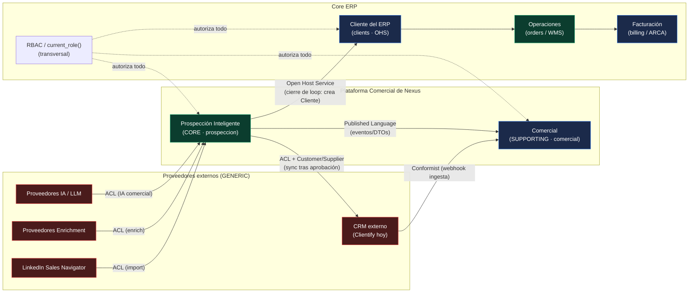
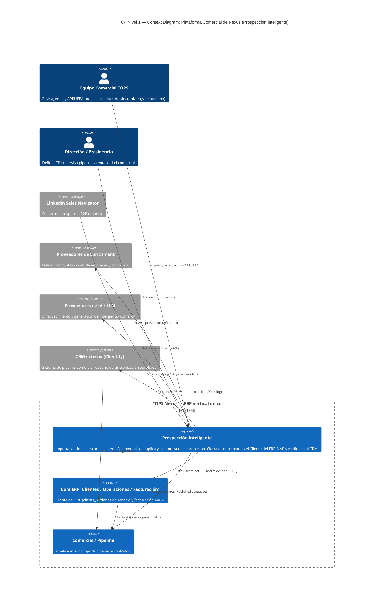

# Constitución Arquitectónica de la Plataforma Comercial de Nexus

## PARTE I — DISEÑO ESTRATÉGICO (DDD)

> **Estado:** normativo · **Vigencia:** 10 años (revisión anual obligatoria) · **Gobierno:** subordinado al Documento Rector [TOPS-NEXUS-ERP.md](../../TOPS-NEXUS-ERP.md).
> **Bounded Context:** `prospeccion` (Prospección Inteligente), primer contexto acotado de la **Plataforma Comercial de Nexus**.
> **Naturaleza del documento:** esta Parte fija principios, reglas y contratos. Donde dice **DEBE** la regla es obligatoria; **NO DEBE** es prohibición; **PUEDE** es facultad sujeta a las restricciones de esta Constitución. Las reglas numeradas (R-x.y) son normativas y citables por otras Partes.

---

### Convenciones normativas

- **DEBE / OBLIGATORIO:** requisito de cumplimiento estricto. Una implementación que lo viole no es conforme.
- **NO DEBE / PROHIBIDO:** acción vedada sin excepción dentro del alcance de esta Constitución.
- **PUEDE / OPCIONAL:** facultad permitida, nunca obligatoria.
- **Plataforma Comercial:** el conjunto de bounded contexts aguas arriba y alrededor del CRM (hoy, `prospeccion`; en el futuro, los que defina el Context Map de esta Parte).
- **CRM:** sistema de gestión de relación comercial. Hoy se encarna en Clientify (externo) y en su espejo interno (`crm_leads`, `crm_opportunities`); mañana, en el CRM nativo de Nexus. La Plataforma Comercial **NO DEBE** acoplarse a un CRM concreto (ver Parte II y III).

---

## 1. Resumen ejecutivo y visión de Plataforma Comercial

### 1.1 Qué es

**1.1.1** La Plataforma Comercial de Nexus es la capa de **adquisición y calificación de demanda** del ERP vertical único de Logística TOPS (VEROTIN S.A.). Su misión es transformar señales crudas de mercado (prospectos de LinkedIn, listados, importadores, padrones) en **clientes del ERP** auditables, sin saltar etapas ni perder trazabilidad.

**1.1.2** El primer bounded context de esta plataforma es **Prospección Inteligente** (`prospeccion`). Cubre el ciclo completo aguas arriba del CRM:

1. **Importa** prospectos desde fuentes externas.
2. **Enriquece** cada prospecto con datos de la web y de IA.
3. **Scorea** (califica) el prospecto contra el perfil de cliente ideal (ICP) de TOPS.
4. **Genera inteligencia comercial** asistida por IA (resúmenes, ángulos de aproximación, riesgos).
5. **Deduplica** contra el CRM y contra el ERP (`clients`).
6. **Sincroniza al CRM solo tras aprobación humana**, y al hacerlo **cierra el loop creando el Cliente en el ERP**.

**1.1.3** La UI vive bajo `/comercial/prospeccion`; el dominio vive en `src/lib/prospeccion`. Esto respeta el patrón de capas oficial: Feature Module (`src/app/(app)/<m>`) → Server Action / Route Handler → Data Layer (`src/lib/<m>/data.ts`) → Supabase, fijado en el Documento Rector ([TOPS-NEXUS-ERP.md:46-52](../../TOPS-NEXUS-ERP.md)).

### 1.2 Principio rector: **NADA va directo al CRM**

**R-1.2.1 (Principio de No-Bypass).** Ningún prospecto, lead, contacto u oportunidad **DEBE** alcanzar el CRM externo sin haber atravesado, en orden, las etapas de Prospección Inteligente (importar → enriquecer → scorear → generar IA → deduplicar) y sin **aprobación humana explícita**.

**R-1.2.2.** La capa de prospección **DEBE** materializarse como una **zona de staging propia** (tablas de la familia `prospeccion_*`), conceptualmente análoga al espejo de ingesta que ya usa el CRM nativo (`crm_ingest_lead`, migración [`0048_crm_ingest_lead.sql`](../../../supabase/migrations/0048_crm_ingest_lead.sql); `crm_leads`, migración [`0042_crm_core.sql`](../../../supabase/migrations/0042_crm_core.sql); `clientify_sync_log`, referido en la arquitectura comercial). El staging es la frontera: lo que está dentro **NO** es todavía un lead del CRM.

**R-1.2.3.** La sincronización hacia cualquier CRM **DEBE** pasar por un único punto de salida gobernado (un *port* de sincronización, ver Parte III) y **DEBE** quedar registrada en un log de sincronización append-only. Toda escritura al CRM sin pasar por ese punto **está PROHIBIDA**.

**Fundamento.** Este principio es la aplicación local del no-negociable de arquitectura **"Una sola fuente de verdad. Sin apps paralelas, sin tablas duplicadas, sin lógica redundante. Todo se integra dentro de Nexus."** ([ERP-ARQUITECTURA-MAESTRA.md:16-17](../../ERP-ARQUITECTURA-MAESTRA.md)). Si la prospección escribiera directo al CRM, Nexus perdería la fuente de verdad sobre cómo y por qué entró cada cliente.

### 1.3 Visión a 10 años

**R-1.3.1.** Esta Constitución se diseña para una **vigencia de 10 años**. Por lo tanto, **NO DEBE** consagrar como verdad permanente ningún proveedor externo concreto (Clientify, un proveedor de enriquecimiento, un proveedor de IA o LinkedIn). Los proveedores son **detalles intercambiables**; el dominio es lo permanente.

**R-1.3.2.** La plataforma **DEBE** poder reemplazar su CRM externo por un **CRM nativo de Nexus** sin reescribir el dominio de prospección, en línea con la visión del Rector de "reemplazar progresivamente Neuralsoft/Deonics, Clientify, Excel y los procesos manuales con una única plataforma" ([TOPS-NEXUS-ERP.md:11-13](../../TOPS-NEXUS-ERP.md)).

**R-1.3.3.** Toda decisión de diseño que aumente el *lock-in* a un proveedor (acoplar tipos del dominio al SDK del proveedor, persistir esquemas del proveedor como esquema canónico, etc.) **está PROHIBIDA**, salvo aislamiento explícito tras una Capa Anti-Corrupción (ver Parte III).

### 1.4 Cómo cierra el loop: crear el Customer en el ERP

**R-1.4.1 (Cierre de Loop).** Cuando un prospecto es **aprobado y sincronizado**, la plataforma **DEBE** garantizar la existencia del **Cliente del ERP** correspondiente en la tabla canónica `clients` (definida en migración [`0001`](../../../supabase/migrations/), `create table public.clients`), evitando duplicados por deduplicación previa.

**R-1.4.2.** El Cliente del ERP es el **artefacto de cierre del ciclo de prospección**. La tabla `clients` es consumida por Clientes, Órdenes, Facturación y Comercial ([ERP-DEPENDENCY-GRAPH.md:241](../../ERP-DEPENDENCY-GRAPH.md)); por ello la creación del Cliente **DEBE** respetar las invariantes de esas dependencias y **NO DEBE** introducir formas de alta de cliente paralelas a las existentes.

**R-1.4.3.** La creación del Cliente del ERP **DEBE** publicarse como un **evento de dominio** (`ProspectoConvertidoACliente` o equivalente, ver Parte IV/Outbox), de modo que el resto del ERP reaccione (notificaciones, dashboards, onboarding) sin acoplarse al flujo de prospección.

### 1.5 Regla de Decisión (gate de toda feature de la plataforma)

**R-1.5.1.** Toda feature de la Plataforma Comercial **DEBE** superar la **Regla de Decisión** del Rector antes de implementarse:

> *"¿Esto acerca a TOPS Nexus a convertirse en el ERP único de Logística TOPS y permitir eliminar Neuralsoft? Si la respuesta es NO → no se implementa."* ([TOPS-NEXUS-ERP.md:19-24](../../TOPS-NEXUS-ERP.md)).

**R-1.5.2.** Prospección Inteligente supera la Regla de Decisión porque **alimenta de clientes calificados al ERP único**: el cliente entra por Nexus, no por una herramienta externa, y queda disponible para Órdenes → Facturación → Tesorería sin re-tipeo ni migración manual. Acercar la prospección a Nexus es, por construcción, alejar a la organización de Neuralsoft y de las herramientas dispersas.

**R-1.5.3.** El **corolario de primer principio** del Rector aplica de pleno: *antes de escribir una línea de código* se DEBE analizar la arquitectura existente (rutas, DB, componentes, servicios, APIs, auth, diseño, deploy) e integrarse armónicamente, sin lógica duplicada ([TOPS-NEXUS-ERP.md:25-28](../../TOPS-NEXUS-ERP.md)).

---

## 2. Strategic Domain Design — clasificación de subdominios

### 2.1 Marco de clasificación

**R-2.1.1.** Cada dominio de Nexus **DEBE** clasificarse en una de tres categorías de Domain-Driven Design, y el nivel de inversión arquitectónica (modelado táctico, tests, aislamiento) **DEBE** ser proporcional a la categoría:

- **CORE** — diferenciador competitivo. Donde TOPS gana o pierde. Recibe el máximo rigor (DDD táctico completo, invariantes explícitas, máxima cobertura de tests).
- **SUPPORTING** — necesario para el negocio pero no diferenciador. Se construye a medida cuando no hay solución de mercado adecuada; rigor medio.
- **GENERIC** — problema resuelto por la industria. Se compra/integra; **NO DEBE** sobre-modelarse.

### 2.2 Clasificación normativa de los dominios de Nexus

| # | Dominio | Clasificación | Justificación de negocio | Justificación técnica / evidencia |
|---|---------|:-------------:|--------------------------|------------------------------------|
| 1 | **Prospección / Inteligencia Comercial** | **CORE** | Define la calidad y el volumen de la demanda que entra a TOPS; el principio "nada va directo al CRM" + scoring + IA comercial es ventaja propia, no comprable. | Sin código previo; se diseña aquí desde cero con DDD táctico completo (Parte II). |
| 2 | **CRM (relación comercial)** | **SUPPORTING** (hoy GENERIC vía Clientify) | Gestionar pipeline es necesario, pero el diferenciador no es el CRM sino *qué entra* a él. | Hoy es externo (Clientify) con espejo interno `crm_leads`/`crm_opportunities` ([ERP-MODULE-MAP.md:63](../../ERP-MODULE-MAP.md)); migrable a nativo (R-1.3.2). |
| 3 | **Comercial / Pipeline / Contratos** | **SUPPORTING** | Soporta la conversión y el seguimiento; agrega valor pero se apoya en el Core de prospección. | `src/lib/comercial/*` y `src/app/(app)/comercial/*` ya existen (pipeline, oportunidades, contratos). |
| 4 | **Operaciones (OS / WMS / Pedidos)** | **CORE** | Es el negocio 3PL de TOPS: ejecutar la logística es la razón de ser de la empresa. | `orders`/`order_services` desplegados ([ERP-DEPENDENCY-GRAPH.md:107](../../ERP-DEPENDENCY-GRAPH.md)). |
| 5 | **Facturación (ARCA)** | **SUPPORTING** | Obligatoria y crítica, pero la facturación electrónica es un problema reglado, no un diferenciador. | Código presente, tablas 0011 dependientes de cierre ([ERP-ARQUITECTURA-MAESTRA.md:83-89](../../ERP-ARQUITECTURA-MAESTRA.md)). |
| 6 | **Compliance / ANMAT** | **CORE** | Manejar producto regulado (titularidad ANMAT del cliente sobre depósito de TOPS) es ventaja vertical específica de TOPS. | `lib/anmat/*` + compliance core (migración [`0065`](../../../supabase/migrations/0065_compliance_core.sql)). |
| 7 | **Analytics / BI / Ejecutivo** | **SUPPORTING** | Apoya decisiones; deriva valor de los datos del Core, no lo crea. | `ejecutivo`/`reports` parciales ([TOPS-NEXUS-ERP.md:114](../../TOPS-NEXUS-ERP.md)). |
| 8 | **IA (enriquecimiento + generación comercial)** | **CORE como capacidad, GENERIC como infraestructura** | La *aplicación* de IA al embudo comercial es diferenciador; el *modelo* (LLM) es comprable e intercambiable. | El modelo se abstrae tras un manager provider-agnostic (Parte III); ningún SDK de IA es canónico (R-1.3.3). |
| 9 | **Workspace / Mi Espacio** | **GENERIC** | Espacio personal/colaboración es problema resuelto por la industria. | `workspace` + enum de módulo (migración [`0086_mi_espacio_module_enum.sql`](../../../supabase/migrations/0086_mi_espacio_module_enum.sql)). |
| 10 | **Integraciones (Clientify, Drive, WhatsApp, Hikvision, enrichment, IA, LinkedIn)** | **GENERIC** | Conectores a sistemas de terceros; valor estándar, riesgo de lock-in. | Capa transversal de integraciones ([ERP-ARQUITECTURA-MAESTRA.md:132](../../ERP-ARQUITECTURA-MAESTRA.md)); se aíslan con ACL (Parte III). |
| 11 | **RBAC / Seguridad / Auditoría** | **GENERIC (técnico) pero TRANSVERSAL OBLIGATORIO** | No es dominio de negocio, pero gobierna a todos. | `current_role()` es el hub de RLS de máximo blast radius ([ERP-DEPENDENCY-GRAPH.md:127-142](../../ERP-DEPENDENCY-GRAPH.md)). |

**R-2.2.2.** **Prospección / Inteligencia Comercial es el subdominio CORE de esta Constitución.** Toda decisión que rebaje su rigor (saltarse el modelado táctico, omitir invariantes, no aislar proveedores) **está PROHIBIDA**.

**R-2.2.3.** Los subdominios **GENERIC** (Integraciones, IA-infraestructura, Workspace) **NO DEBEN** sobre-modelarse: se integran con la menor superficie de acoplamiento posible y siempre detrás de una frontera (ACL / port).

**R-2.2.4.** Cuando un proveedor externo (CRM, enrichment, IA, LinkedIn) sea GENERIC, su modelo de datos **NO DEBE** filtrarse al modelo del dominio CORE. La traducción ocurre en la frontera (Published Language + ACL, Parte III).

---

## 3. Context Map de Bounded Contexts

### 3.1 Bounded contexts de la Plataforma Comercial

**R-3.1.1.** Se reconocen los siguientes bounded contexts relevantes para la Plataforma Comercial. La integración entre ellos **DEBE** seguir uno de los patrones estratégicos declarados en R-3.2.

| Bounded Context | Rol | Capa |
|-----------------|-----|------|
| **Prospección** (`prospeccion`) | Adquisición y calificación de demanda | CORE — diseño nuevo |
| **CRM** (Clientify hoy / nativo mañana) | Gestión de pipeline comercial | SUPPORTING/GENERIC externo |
| **Comercial** (`comercial`) | Pipeline interno, oportunidades, contratos | SUPPORTING |
| **Operaciones** (`orders` / WMS / pedidos) | Ejecución logística 3PL | CORE |
| **Facturación** (`billing` / ARCA) | Comprobantes fiscales | SUPPORTING |
| **Identidad y Cliente del ERP** (`clients` + RBAC) | Fuente de verdad de clientes y autorización | TRANSVERSAL |

### 3.2 Patrones de relación entre contextos (normativos)

**R-3.2.1 (Prospección → CRM): Anti-Corruption Layer (ACL) + Customer/Supplier.**
Prospección es **cliente** (downstream consumer en sentido de flujo de control de sincronización) del CRM como sistema de registro de pipeline, pero **DEBE** protegerse del modelo del CRM mediante una **Capa Anti-Corrupción**. El modelo del CRM (campos de Clientify, semántica de "lead"/"deal") **NO DEBE** penetrar el modelo de Prospección. Toda traducción ocurre en la ACL del port de sincronización (Parte III).

**R-3.2.2 (Prospección → Cliente del ERP `clients`): Customer/Supplier + Open Host Service.**
El contexto de **Identidad/Cliente del ERP** es **upstream** (supplier) y expone un **Open Host Service** estable para el alta de clientes. Prospección consume ese servicio para cerrar el loop (R-1.4.1) y **NO DEBE** escribir directamente en `clients` saltando ese servicio, dado el blast radius de `clients` ([ERP-DEPENDENCY-GRAPH.md:241](../../ERP-DEPENDENCY-GRAPH.md)).

**R-3.2.3 (Prospección ↔ Comercial): Published Language.**
La interacción Prospección↔Comercial **DEBE** ocurrir mediante un **lenguaje publicado** (eventos y DTOs versionados: `ProspectoAprobado`, `ProspectoConvertidoACliente`). Comercial **NO DEBE** leer las tablas internas de staging de Prospección.

**R-3.2.4 (CRM → Comercial, ingesta inversa): Conformist.**
Cuando el CRM externo es la fuente (webhook entrante, ej. el patrón `clientify_sync_log` / webhook HMAC ya descrito para el contexto comercial), Comercial actúa como **Conformist** respecto del esquema del CRM en el borde de ingesta, pero **DEBE** normalizar inmediatamente al lenguaje publicado antes de propagar aguas adentro.

**R-3.2.5 (Comercial/Operaciones/Facturación): Customer/Supplier encadenado.**
Se conserva la cadena funcional existente del ERP: Clientes → Órdenes → Facturación ([ERP-DEPENDENCY-GRAPH.md:81-94](../../ERP-DEPENDENCY-GRAPH.md)). Prospección **NO DEBE** crear atajos hacia Operaciones o Facturación; su única salida hacia el core transaccional es a través del Cliente del ERP.

**R-3.2.6.** Las integraciones con proveedores GENERIC (enrichment, IA, LinkedIn) **DEBEN** modelarse como **ACL** sin excepción: son sistemas sobre los que TOPS no tiene gobierno y cuyos contratos cambian sin aviso.

### 3.3 Diagrama del Context Map (Mermaid)

> **Lectura normativa del diagrama:** toda flecha que entra a Prospección desde un proveedor externo pasa por una **ACL**. La única flecha de Prospección hacia el core transaccional es el **Open Host Service** de `clients`. La única flecha de Prospección hacia el CRM pasa por la ACL del port de sincronización, **tras aprobación humana** (R-1.2.1).

---

## 4. C4 — Context Diagram (Nivel 1)

**R-4.1.** El siguiente diagrama de contexto (C4 Nivel 1) es la **vista oficial de límites del sistema** para la Plataforma Comercial. Cualquier integración nueva **DEBE** poder ubicarse en este diagrama como actor o como sistema externo; si no encaja, **DEBE** revisarse esta Constitución antes de construirla.

**R-4.2.** Actores y sistemas externos reconocidos en el límite:

- **Actores humanos:** Equipo Comercial (ejecuta el **gate de aprobación**, R-1.2.1) y Dirección/Presidencia (define ICP y supervisa).
- **Sistemas externos GENERIC:** LinkedIn Sales Navigator (import), proveedores de Enrichment, proveedores de IA/LLM y CRM externo (Clientify). Todos detrás de ACL (R-3.2.6).
- **Sistema interno:** TOPS Nexus, con Prospección Inteligente como subsistema CORE de esta Constitución.

**R-4.3.** El **gate de aprobación humana** es un elemento de primer nivel del contexto: no es un detalle de UI, es un **límite de confianza** del sistema. Ninguna automatización **DEBE** poder sintetizar esa aprobación.

---

## Cierre de la Parte I

**Objetivo.** Establecer el marco estratégico (DDD) de la Plataforma Comercial de Nexus y de su primer bounded context, Prospección Inteligente: visión a 10 años, principio "nada va directo al CRM", clasificación de subdominios, Context Map y diagrama de contexto C4 Nivel 1, como base normativa para las Partes tácticas siguientes.

**Alcance.** Cubre el diseño estratégico: subdominios CORE/SUPPORTING/GENERIC, patrones de relación entre bounded contexts (Customer/Supplier, Conformist, ACL, Open Host Service, Published Language) y la vista de contexto del sistema. **NO** cubre el modelado táctico (agregados, entidades, value objects), la arquitectura hexagonal/clean, el modelo de eventos/Outbox ni los managers provider-agnostic — todo ello pertenece a las Partes II, III y IV.

**Decisiones tomadas.**
1. Prospección / Inteligencia Comercial se declara subdominio **CORE** (R-2.2.2).
2. Principio de No-Bypass: nada alcanza el CRM sin atravesar prospección + aprobación humana (R-1.2.1).
3. La sincronización al CRM tiene un único punto de salida gobernado y logueado (R-1.2.3).
4. El loop se cierra creando el Cliente del ERP en `clients` vía Open Host Service, nunca por escritura directa (R-1.4.1, R-3.2.2).
5. Vigencia 10 años con prohibición de consagrar proveedores externos como permanentes (R-1.3.1–R-1.3.3).
6. Patrones de Context Map fijados: ACL hacia proveedores externos, OHS hacia `clients`, Published Language Prospección↔Comercial, Conformist en ingesta inversa del CRM.

**Decisiones descartadas.**
1. **Escritura directa de prospección al CRM o a `clients`** — descartada por violar la fuente única de verdad ([ERP-ARQUITECTURA-MAESTRA.md:16-17](../../ERP-ARQUITECTURA-MAESTRA.md)) y el alto blast radius de `clients` ([ERP-DEPENDENCY-GRAPH.md:241](../../ERP-DEPENDENCY-GRAPH.md)).
2. **Tratar al CRM (Clientify) como dominio CORE** — descartada: el diferenciador es *qué entra* al CRM, no el CRM; clasificado SUPPORTING/GENERIC (tabla §2.2).
3. **Acoplar el dominio a un SDK/proveedor concreto de IA, enrichment o CRM** — descartada por la regla de no-lock-in y vigencia a 10 años (R-1.3.3).
4. **Crear un alta de cliente paralela a la existente** — descartada por el corolario de primer principio del Rector ([TOPS-NEXUS-ERP.md:25-28](../../TOPS-NEXUS-ERP.md)).

**Justificación.** La clasificación estratégica concentra el rigor de ingeniería donde TOPS compite (adquisición y calificación de demanda) y minimiza esfuerzo en lo comprable. El principio de No-Bypass y el cierre de loop por OHS preservan la auditoría total y la fuente única de verdad, no-negociables del Rector ([ERP-ARQUITECTURA-MAESTRA.md:14-23](../../ERP-ARQUITECTURA-MAESTRA.md)). Subordinar todo a la Regla de Decisión asegura que la plataforma empuje el objetivo estratégico de ERP único y salida de Neuralsoft ([TOPS-NEXUS-ERP.md:19-24](../../TOPS-NEXUS-ERP.md)).

**Riesgos.**
1. **Filtración de modelo de proveedor** (Clientify/IA/enrichment) al dominio si la ACL se debilita — mitigación: ACL obligatoria y Published Language (R-3.2.1, R-3.2.6); a desarrollar en Parte III.
2. **Bypass del gate humano** por presión de velocidad comercial — mitigación: límite de confianza explícito (R-4.3) y único punto de salida logueado (R-1.2.3).
3. **Acoplamiento accidental a `clients`/`current_role()`** (nodos de máximo blast radius, [ERP-DEPENDENCY-GRAPH.md:127-142,241](../../ERP-DEPENDENCY-GRAPH.md)) — mitigación: OHS y RLS como frontera.
4. **Deriva de proveedor a 10 años** (cambios de API de LinkedIn/IA/CRM) — mitigación: clasificación GENERIC + ACL; ningún proveedor es canónico.
5. **Duplicación de capa CRM** (riesgo histórico de duplicados de librería, [ERP-MODULE-MAP.md:101-107](../../ERP-MODULE-MAP.md)) — mitigación: reuso del espejo CRM existente (`crm_leads`, `crm_ingest_lead`) en vez de crear un CRM paralelo.

**Impacto sobre la arquitectura.**
1. Crea el bounded context `prospeccion` como nuevo subsistema CORE bajo `src/lib/prospeccion` y `/comercial/prospeccion`, respetando el patrón de capas oficial ([TOPS-NEXUS-ERP.md:46-52](../../TOPS-NEXUS-ERP.md)).
2. Introduce una zona de staging propia (`prospeccion_*`) como frontera previa al CRM, sin tocar las tablas existentes del CRM ni de `clients`.
3. Obliga a definir, en Partes posteriores, un **port de sincronización** (ACL hacia CRM) y un **consumidor del Open Host Service** de `clients` para el cierre de loop.
4. Establece el contrato de eventos (Published Language) que las Partes IV (Event-Driven / Outbox) deberán materializar, sin nuevas dependencias cruzadas duras entre módulos de feature (preservando la única dependencia cruzada vigilada existente, Ejecutivo→Compras, [ERP-DEPENDENCY-GRAPH.md:174-178](../../ERP-DEPENDENCY-GRAPH.md)).
5. No aplica migraciones ni crea tablas en esta Parte: es diseño estratégico, conforme al modo de trabajo y a los gates del Rector ([TOPS-NEXUS-ERP.md:137-144](../../TOPS-NEXUS-ERP.md)).
