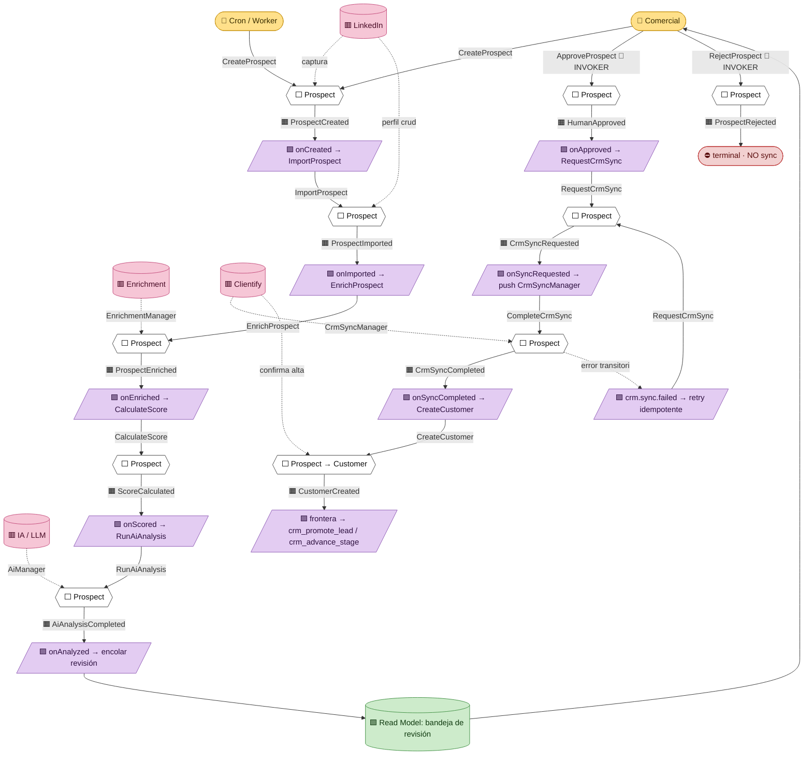

# 15 · Event Storming — El flujo completo del negocio de Prospección

> Capítulo de la **Constitución Arquitectónica de la Plataforma Comercial de Nexus**.
> Bounded context: `prospeccion`. Tono **normativo** (reglas y contratos: DEBE / NO DEBE).
> Alcance: el flujo end-to-end del pipeline event-driven y su relación con la máquina de
> estados comercial única Prospección ↔ CRM.

Este capítulo no es una lista de eventos: es el **mapa del proceso de negocio**. Reconstruye,
paso a paso, qué Comando dispara qué Agregado, qué Evento de Dominio emite, qué Política
reacciona y qué Comandos siguientes encadena. El resultado es un pipeline auditable, reproducible
(replay), reintentable (retry) e idempotente, con Managers **provider-agnostic** en los bordes y un
dominio que **NUNCA** conoce proveedores concretos.

La plataforma de Prospección es una **capa intermedia obligatoria**: LinkedIn → Nexus → Clientify.
**Nada va directo a Clientify.** Esa regla constitucional es la que justifica un pipeline propio,
con su propia tabla de eventos y su propia máquina de estados, en lugar de escribir contra el CRM
de forma sincrónica.

---

## 15.1 · Leyenda y método

### Objetivo
Fijar el vocabulario gráfico del Event Storming y la convención de colores para que todo el equipo
lea los diagramas de este bounded context de la misma forma.

### Alcance
Aplica a este capítulo y a todo artefacto de modelado del context `prospeccion`. **NO** redefine la
notación de otros contextos.

### Leyenda (convención de colores Event Storming)

| Color | Pieza | Definición normativa | Ejemplo en `prospeccion` |
|-------|-------|----------------------|--------------------------|
| 🟧 Naranja | **Domain Event** | Hecho del negocio ya ocurrido, en pasado, inmutable. Se persiste append-only en el Outbox/ledger. | `ProspectEnriched`, `ScoreCalculated` |
| 🟦 Azul | **Command** | Intención de cambiar el estado. Puede fallar. Lo dispara un Actor o una Policy. | `EnrichProspect`, `RequestCrmSync` |
| 🟨 Amarillo | **Actor** | Quién dispara el Command: humano (comercial), sistema (cron/worker) o proveedor externo. | Comercial, Cron, Webhook Clientify |
| 🟪 Lila | **Policy / Reactive** | Regla automática "cuando ocurre X, entonces dispará Y". Es el pegamento del pipeline. | "Cuando `ProspectEnriched` → `CalculateScore`" |
| 🟩 Verde | **Read Model** | Proyección de lectura, derivada de los eventos. NO es fuente de verdad. | Bandeja de prospectos, panel de score |
| 🟥 Rosa | **External System** | Sistema fuera del dominio. SIEMPRE detrás de un Manager. | LinkedIn, Enrichment, IA, Clientify |
| ⬜ Agregado | **Aggregate** | Frontera de consistencia transaccional. Dueño de sus invariantes y de la emisión de sus eventos. | `Prospect` |

### Decisiones tomadas
- **DEBE** usarse esta convención de colores en todo diagrama del context.
- El **Outbox de Postgres** es la materialización física de los Domain Events (🟧). Toda emisión de
  evento **DEBE** escribirse en la misma transacción que el cambio de estado del Agregado (patrón
  Transactional Outbox), tal como hoy el Write-Path CRM escribe la transición y el ledger
  `crm_stage_history` de forma atómica dentro de una sola función (`supabase/migrations/0047_crm_write_path_fns.sql:117-119`).
- El ledger de eventos **DEBE** ser **append-only**, replicando el patrón ya probado en el repo:
  `po_events` (`supabase/migrations/0008_purchase_orders.sql:147-158`), `crm_stage_history`
  (`supabase/migrations/0045_crm_sync_audit.sql:11-21`) y `audit_log`
  (`supabase/migrations/0001_init.sql:153-164`).

### Decisiones descartadas
- **Descartado** un bus de mensajería externo (Kafka/SQS) en F0: agrega infraestructura que el
  stack actual (Supabase + Netlify Functions + cron) no necesita todavía. El Outbox Postgres + un
  worker que dispara las Policies cubre el caso con la operación ya existente.
- **Descartado** modelar el dominio con clases que importen SDKs de proveedor: viola la regla
  provider-agnostic (§15.5).

### Justificación
El repo ya demostró que el patrón ledger-append-only + RLS + función transaccional es robusto y
auditable. Reusarlo baja el riesgo a casi cero y mantiene coherencia con `comercial`.

### Riesgos
- Si un diagrama mezcla colores, el modelo deja de ser comunicable. Mitigación: revisión de
  modelado obligatoria (gate de diseño).

### Impacto sobre la arquitectura
La notación es la base de todos los diagramas siguientes. No introduce tablas; solo fija lenguaje.

---

## 15.2 · Big-picture event storming (Command → Aggregate → Event → Policy)

### Objetivo
Recorrer el pipeline completo en su nivel "big picture": para cada paso, qué Comando entra, qué
Agregado lo procesa, qué Evento emite, qué Política reacciona y qué Comando(s) encadena. Identificar
Actores y External Systems en cada paso.

### Alcance
Los 9 eventos mínimos del pipeline, en orden, más los procesos automáticos que los conectan.

### El Agregado raíz: `Prospect`
**DEBE** existir un único Agregado raíz, `Prospect`, dueño de su ciclo de vida y de la emisión de
sus eventos. El estado del Agregado se deriva del ledger de eventos (event-sourced en su lectura) y
se materializa en una fila gobernada por RLS, igual que `crm_leads` hoy
(`supabase/migrations/0042_crm_core.sql`, ingerido por `crm_ingest_lead`,
`supabase/migrations/0048_crm_ingest_lead.sql:24-32`).

### Tabla big-picture (paso a paso)

| # | 🟦 Command | ⬜ Aggregate | 🟧 Domain Event | 🟨 Actor | 🟥 External System | 🟪 Policy / Reactive → próximo Command |
|---|-----------|-------------|-----------------|----------|--------------------|----------------------------------------|
| 1 | `CreateProspect` | `Prospect` | `ProspectCreated` | Comercial / Cron de captura | LinkedIn (lectura) | Cuando `ProspectCreated` → `ImportProspect` |
| 2 | `ImportProspect` | `Prospect` | `ProspectImported` | Sistema (worker import) | LinkedIn (vía Enrichment/scraper Manager) | Cuando `ProspectImported` → `EnrichProspect` |
| 3 | `EnrichProspect` | `Prospect` | `ProspectEnriched` | Sistema (worker) | **EnrichmentManager** → proveedor B2B | Cuando `ProspectEnriched` → `CalculateScore` |
| 4 | `CalculateScore` | `Prospect` | `ScoreCalculated` | Sistema (worker) | (interno: motor de score) | Cuando `ScoreCalculated` → `RunAiAnalysis` |
| 5 | `RunAiAnalysis` | `Prospect` | `AiAnalysisCompleted` | Sistema (worker) | **AiManager** → LLM | Cuando `AiAnalysisCompleted` y score ≥ umbral → encolar para revisión humana |
| 6 | `ApproveProspect` | `Prospect` | `HumanApproved` | **Comercial (humano)** | — | Cuando `HumanApproved` → `RequestCrmSync` |
| 7 | `RequestCrmSync` | `Prospect` | `CrmSyncRequested` | Sistema (worker) | — | Cuando `CrmSyncRequested` → ejecutar push vía CrmSyncManager |
| 8 | `CompleteCrmSync` | `Prospect` | `CrmSyncCompleted` | Sistema (worker) | **CrmSyncManager** → Clientify | Cuando `CrmSyncCompleted` → `CreateCustomer` |
| 9 | `CreateCustomer` | `Prospect` → `Customer` | `CustomerCreated` | Sistema (worker) | Clientify (confirma alta) | Cierra el pipeline; el lead queda promovido en CRM |

### Procesos automáticos (las Policies son el motor)
1. El pipeline **DEBE** avanzar por reacción a eventos, no por orquestación imperativa hardcodeada en
   un endpoint. Cada Policy (🟪) lee un Evento del Outbox y emite el siguiente Command.
2. El worker que materializa las Policies **DEBE** autenticarse como cron fail-closed (mismo patrón
   que el webhook actual: token timing-safe, denegar si falta el secreto —
   `src/lib/clientify/webhook.ts:28-35`).
3. Los pasos automáticos (2, 3, 4, 5, 7, 8, 9) corren **SECURITY DEFINER** (tráfico de máquina sin
   `auth.uid()`), igual que `crm_ingest_lead` (`supabase/migrations/0048_crm_ingest_lead.sql:13-16`).
   El único paso **humano** (6, `ApproveProspect`) corre **SECURITY INVOKER**, igual que
   `crm_promote_lead` (`supabase/migrations/0050_crm_promote_lead.sql:9-11`).

### Decisiones tomadas
- **DEBE** haber exactamente un Agregado raíz `Prospect` por el pipeline 1→8; en el paso 9 nace la
  proyección `Customer` (la frontera hacia el bounded context `comercial`/CRM).
- Los bordes con LinkedIn, Enrichment, IA y Clientify **DEBEN** pasar SIEMPRE por un Manager
  provider-agnostic (§15.5). El Agregado **NO DEBE** recibir tipos de proveedor.
- La revisión humana (paso 6) es un **gate obligatorio**: ningún prospecto llega a Clientify sin
  `HumanApproved`. Esto cristaliza la regla "nada va directo a Clientify".

### Decisiones descartadas
- **Descartado** auto-aprobar prospectos con score alto saltando el paso 6. La aprobación humana es
  no-negociable por gobernanza comercial.
- **Descartado** llamar a Clientify dentro del mismo request del webhook/UI (escritura sincrónica):
  rompe retry/idempotencia y acopla el dominio al proveedor.

### Justificación
Separar "decidir" (Commands/Policies) de "ejecutar contra terceros" (Managers) permite reintentar
el push a Clientify sin re-ejecutar el análisis IA, y permite replay sin tocar proveedores.

### Riesgos
- **Tormenta de eventos** (un evento dispara muchos commands en cascada). Mitigación: cada Policy es
  idempotente y el Outbox marca eventos ya procesados.
- **Acoplamiento sigiloso**: que un campo de proveedor "se cuele" hasta el Agregado. Mitigación:
  contrato de Manager con DTO normalizado (como `NormalizedLead`, `src/lib/clientify/webhook.ts:39-48`).

### Impacto sobre la arquitectura
Define el esqueleto de Policies/workers y fija qué pasos son DEFINER vs INVOKER. Es el contrato que
el motor de pipeline DEBE implementar.

---

## 15.3 · El flujo end-to-end (los 9 eventos + caminos de error / duplicado / rechazo)

### Objetivo
Narrar el camino feliz y, con igual rigor, los caminos de error, duplicado y rechazo. Un pipeline
sin sus rutas alternativas no es un modelo: es una ilusión.

### Alcance
Del primer `ProspectCreated` al `CustomerCreated`, incluyendo retry, idempotencia, replay y
auditoría en cada arista.

### Camino feliz (narrado)
1. **ProspectCreated** — un comercial selecciona un perfil en LinkedIn (o un cron de captura lo
   levanta). Se crea el Agregado `Prospect` y se emite el evento. **Identidad mínima requerida**
   (perfil/URL, o email, o teléfono): si no hay identidad, el evento NO se crea (mismo criterio que
   `normalizeLead`, `src/lib/clientify/webhook.ts:113-124`).
2. **ProspectImported** — el worker normaliza el perfil crudo a un DTO canónico. La normalización es
   **pura** (no toca red ni DB), testeable aislada, como las funciones de `webhook.ts`.
3. **ProspectEnriched** — el `EnrichmentManager` completa datos de empresa/contacto. El Agregado
   **NO** sabe qué proveedor respondió.
4. **ScoreCalculated** — el motor de score asigna un puntaje determinista. **Determinismo
   obligatorio**: mismas entradas → mismo score (precondición para replay).
5. **AiAnalysisCompleted** — el `AiManager` produce un análisis/resumen. El prompt y el proveedor
   son detalle del Manager; el dominio recibe un veredicto normalizado.
6. **HumanApproved** — un comercial revisa en un Read Model (🟩) y aprueba. Único paso INVOKER:
   `changed_by = auth.uid()`, RLS de sesión gobierna (idéntico a `crm_promote_lead`,
   `supabase/migrations/0050_crm_promote_lead.sql:9-11`).
7. **CrmSyncRequested** — al aprobar, una Policy encola el push. El evento queda en el Outbox; el
   trabajo real es asíncrono.
8. **CrmSyncCompleted** — el `CrmSyncManager` ejecuta el push a Clientify y registra el resultado en
   un log de sync con `direction='outbound'`, espejando `clientify_sync_log`
   (`supabase/migrations/0045_crm_sync_audit.sql:23-37`).
9. **CustomerCreated** — confirmado el alta, el prospecto se materializa como lead/oportunidad en el
   CRM (promoción), cerrando la frontera Prospección → CRM.

### Camino de DUPLICADO (regla normativa)
- La detección de duplicados **DEBE** seguir la cadena de prioridad **identidad de proveedor →
  email → teléfono**, exactamente como `crm_ingest_lead`
  (`supabase/migrations/0048_crm_ingest_lead.sql:64-83`).
- Ante conflicto ambiguo (misma persona por email/phone pero nombre distinto), la regla es
  **"crear y marcar", NUNCA mergear** (patrón D-4, `supabase/migrations/0048_crm_ingest_lead.sql:134-148`):
  se crea el prospecto, se etiqueta `posible_duplicado` y se guarda la referencia al conflicto.
- **CUIT NO es clave de dedup de persona**: identifica la **cuenta/empresa** y solo se usa al
  promover a cliente, como hoy en `crm_promote_lead`
  (`supabase/migrations/0050_crm_promote_lead.sql:13-18, 74-83`).

### Camino de ERROR (retry sin pérdida)
- Todo Command contra un External System **DEBE** ser reintentable. La distinción operativa:
  - Error **transitorio** (red, 5xx del proveedor) → se registra y se reintenta. Espejo del handler
    actual, que devuelve 502 para que el emisor reintente (`src/app/api/clientify/webhook/[token]/route.ts:58-66`).
  - Error **permanente** (payload inválido, sin identidad) → se marca `skipped`/`error` y **NO** se
    reintenta indefinidamente (`route.ts:38-43`).
- Cada corrida del worker **DEBE** emitir un reporte con contadores y eventos granulares
  (`scanned/upserted/errors` + lista de `SyncEvent`), tal como el motor de Compliance
  (`src/lib/compliance/sync/engine.ts:95-118, 319-334`) y su tipado
  (`SyncEvent`, `SyncRunStatus`, `src/lib/compliance/sync/types.ts:10-16`).
- **Aislamiento de fallas en lote**: si un push masivo falla, **DEBE** reintentarse fila por fila
  para no perder el lote entero (patrón batch-fallback, `src/lib/compliance/sync/engine.ts:248-262`).

### Camino de RECHAZO (gate humano)
- En el paso 6, un comercial puede **rechazar**. El Agregado emite `ProspectRejected` (evento de
  salida terminal análogo a `perdido`/`descartado` del CRM).
- Un prospecto rechazado **NO DEBE** sincronizarse a Clientify. La Policy de sync **DEBE** verificar
  estado terminal antes de actuar (como `crm_advance_stage` trata `perdido` como terminal,
  `supabase/migrations/0047_crm_write_path_fns.sql:73`, y `crm_reserve_capacity` rechaza operar sobre
  `perdido`, `:157-160`).

### Idempotencia, replay y trazabilidad (transversal a todas las aristas)
- **Idempotencia**: reprocesar el mismo evento **NO DEBE** producir efectos dobles. El patrón
  canónico del repo es "misma etapa → no-op sin ruido en el ledger"
  (`supabase/migrations/0047_crm_write_path_fns.sql:59-62`) y "ya promovido → no-op devolviendo lo
  existente" (`supabase/migrations/0050_crm_promote_lead.sql:49-55`). Cada Policy del pipeline
  **DEBE** ser idempotente por la clave natural del evento.
- **Replay**: como el estado se deriva del ledger append-only, reproducir los eventos en orden
  reconstruye el Agregado. El replay **DEBE** ser "dry"-capaz (recorrer sin escribir efectos
  externos), como el `dryRun` del motor de Compliance (`src/lib/compliance/sync/engine.ts:38-48, 215`).
- **Auditoría / observabilidad / trazabilidad**: cada paso **DEBE** dejar (a) la fila de evento en
  el Outbox, (b) una entrada de auditoría con actor/IP/payload (estilo `audit_log`,
  `supabase/migrations/0001_init.sql:153-164`; `po_events` con `actor/actor_email/ip/meta`,
  `supabase/migrations/0008_purchase_orders.sql:147-158`), y (c) logs estructurados con `event`,
  `action` y `id` (estilo `console.info("[clientify] webhook ingest ok", { event, action, leadId })`,
  `src/app/api/clientify/webhook/[token]/route.ts:69-72`).

### Decisiones tomadas
- Estados terminales (`ProspectRejected`, y `CustomerCreated` como cierre exitoso) **DEBEN** existir
  y bloquear transiciones posteriores desde la UI.
- El log de sync de salida **DEBE** registrar `ok | error | skipped` con `payload` y `error`,
  exactamente como `clientify_sync_log` (`supabase/migrations/0045_crm_sync_audit.sql:23-37`).

### Decisiones descartadas
- **Descartado** "merge automático" de duplicados en conflicto: arriesga corromper identidad. La
  regla es crear-y-marcar para revisión humana.
- **Descartado** reintentar errores permanentes: genera loops y ruido. Se marcan y se cierran.

### Justificación
Reusar los criterios de dedup, idempotencia y reporte ya verificados en `comercial`/`compliance`
elimina invención y mantiene un único estilo de auditoría en toda la plataforma comercial.

### Riesgos
- **Doble alta en Clientify** si el push se reintenta sin clave de idempotencia. Mitigación: la
  clave natural (identidad de proveedor) más un mirror del `modified` para reconciliar por cambio,
  como `clientify_modified` en `crm_opportunities`
  (`supabase/migrations/0052_crm_opportunity_clientify_mirror.sql:8,11`).
- **Eventos huérfanos** (evento emitido, efecto no aplicado) por crash entre tx y proveedor.
  Mitigación: el Outbox transaccional + worker que reintenta desde el evento, nunca desde memoria.

### Impacto sobre la arquitectura
Obliga a una tabla Outbox con estado de procesamiento por evento, un log de sync outbound y un
contrato de reporte por corrida. Confirma la próxima migración del context (siguiente disponible:
**0088**) como portadora del esquema de eventos de `prospeccion`.

---

## 15.4 · Máquina de estados comercial ÚNICA (Prospección ↔ CRM)

### Objetivo
Definir UNA sola máquina de estados que cubra el continuo Prospección → CRM, sin dos máquinas en
competencia. El pipeline de Prospección alimenta a la máquina de etapas del CRM ya existente.

### Alcance
Estados de Prospección (derivados de los 9 eventos) y su empalme con `crm_stage_t` del Write-Path
CRM. Quién ejecuta cada transición (job DEFINER vs humano INVOKER).

### Estados y transiciones (normativo)

**Tramo Prospección (event-driven, mayormente máquina):**

| Estado del `Prospect` | Evento que lo establece | Transición permitida → | Ejecutor |
|-----------------------|-------------------------|------------------------|----------|
| `created` | `ProspectCreated` | `imported` | 🤖 Job (DEFINER) |
| `imported` | `ProspectImported` | `enriched` | 🤖 Job (DEFINER) |
| `enriched` | `ProspectEnriched` | `scored` | 🤖 Job (DEFINER) |
| `scored` | `ScoreCalculated` | `ai_analyzed` | 🤖 Job (DEFINER) |
| `ai_analyzed` ¹ | `AiAnalysisCompleted` | `approved` \| `rejected` | 👤 **Humano (INVOKER)** |
| `approved` | `HumanApproved` | `crm_sync_requested` | 🤖 Job (DEFINER) |
| `crm_sync_requested` | `CrmSyncRequested` | `crm_sync_completed` \| (retry) | 🤖 Job (DEFINER) |
| `crm_sync_completed` | `CrmSyncCompleted` | `customer_created` | 🤖 Job (DEFINER) |
| `rejected` | `ProspectRejected` | **terminal** | 👤 Humano (INVOKER) |

> ¹ **`ai_analyzed` es un único estado de la máquina (= `con_ia` en el enum SQL).** El prospecto **queda encolado aquí** esperando la decisión humana; ese momento de espera es lo que el Event Storming rotulaba `pending_approval` — es el **rótulo UI/operativo**, NO un estado-máquina separado (CC-7). Un fallo de sync (`crm.sync.failed` transitorio) reintenta sobre `crm_sync_requested` con backoff (no es un estado persistido del enum; es manejo `*.failed`, Parte II §2.1). Esta tabla usa ya los **nombres canónicos del dominio** (Parte II §1.1); su correspondencia con el enum SQL en español está en CC-7.

> **Correspondencia con el enum SQL (CC-7).** Los nombres de esta tabla son los **canónicos del dominio**; su espejo en el enum SQL español (`prospeccion_status_t`) está fijado en **CC-7**: `ai_analyzed`→`con_ia`, `approved`→`aprobado`, `crm_sync_requested`/`crm_sync_completed`→`sincronizado` (un solo valor; la distinción requested/completed vive en los eventos del Outbox), `customer_created`→`cliente_creado`, `rejected`→`rechazado`. La máquina de estados es **una sola** (9 estados + `rejected`), vista en tres notaciones reconciliadas por CC-7.

**Empalme con el CRM (`customer_created` cruza la frontera):**
- `customer_created` desemboca en la promoción del CRM. De ahí en adelante **mandan** las funciones
  ya existentes `crm_promote_lead` y luego `crm_advance_stage` sobre `crm_stage_t`
  (`nuevo_lead → contactado → calificado → visita → propuesta → negociacion → ganado | perdido`,
  `supabase/migrations/0047_crm_write_path_fns.sql:66-74`). **NO DEBE** duplicarse la lógica de
  etapas del CRM dentro de Prospección, igual que `crm_promote_lead` "enchufa con el Write-Path F2.1
  … sin duplicar lógica de etapas" (`supabase/migrations/0050_crm_promote_lead.sql:6-7`).

### Quién ejecuta cada transición — regla de seguridad
- **Transiciones de máquina (job)** → **SECURITY DEFINER**, sin `auth.uid()`, superficie mínima
  (una RPC por puerta, grants SOLO a `service_role`), exactamente el modelo de `crm_ingest_lead`
  (`supabase/migrations/0048_crm_ingest_lead.sql:13-16, 186-192`).
- **Transiciones humanas (aprobar / rechazar)** → **SECURITY INVOKER**, la RLS de sesión gobierna,
  `changed_by = auth.uid()`, como `crm_promote_lead` y el Write-Path
  (`supabase/migrations/0050_crm_promote_lead.sql:9-11`; `supabase/migrations/0047_crm_write_path_fns.sql:37,119`).
- Toda transición (de job o humana) **DEBE** escribir su fila en el ledger append-only de forma
  atómica con el cambio de estado (patrón `UPDATE … + INSERT history` en una sola función,
  `supabase/migrations/0047_crm_write_path_fns.sql:103-119`).
- El ledger es **inmutable**: RLS sin `update`, `delete` solo `is_admin()`
  (`supabase/migrations/0045_crm_sync_audit.sql:39-57`).

### Decisiones tomadas
- **DEBE** existir UNA máquina de estados que abarca Prospección y se empalma —sin solapar— con la
  máquina del CRM en `customer_created`.
- Estados terminales: `rejected` y (post-empalme) `ganado`/`perdido` del CRM.
- un fallo de sync (`crm.sync.failed`) **DEBE** poder volver a `crm_sync_requested` (retry acotado), nunca saltar pasos.

### Decisiones descartadas
- **Descartado** dos máquinas independientes (una de Prospección, otra de CRM) sin frontera clara:
  produce estados ambiguos y doble fuente de verdad.
- **Descartado** permitir que un job (DEFINER) ejecute la aprobación humana: borraría la
  trazabilidad de quién aprobó y el control RLS de sesión.

### Justificación
La división DEFINER (máquina) / INVOKER (humano) ya está validada en producción del context CRM y
es la frontera de seguridad real (RLS) descrita en el charter. Mantenerla evita re-auditar.

### Riesgos
- **Estado fantasma** entre `crm_sync_requested` y `crm_sync_completed` si el push se pierde. Mitigación:
  evento `crm.sync.failed` explícito + retry idempotente con clave natural.
- **Saltos de etapa** por bug en una Policy. Mitigación: validación de transición que lanza
  `INVALID_TRANSITION` (espejo de `supabase/migrations/0047_crm_write_path_fns.sql:76-79`).

### Impacto sobre la arquitectura
Fija el contrato de transiciones que la(s) RPC(s) del pipeline DEBEN implementar y consolida que la
frontera Prospección→CRM es el evento `customer_created` → `crm_promote_lead`.

---

## 15.5 · Managers provider-agnostic (el dominio nunca conoce proveedores)

### Objetivo
Establecer que IA, Enrichment y CRM Sync se acceden por **Managers** con contrato estable, y que el
dominio (Agregado, eventos, Policies) **NUNCA** importa SDKs ni tipos de proveedor.

### Alcance
Los tres puntos de integración externa del pipeline: `EnrichmentManager`, `AiManager`,
`CrmSyncManager` (y el adapter de captura LinkedIn).

### Reglas normativas
- Cada Manager **DEBE** exponer una interfaz independiente del proveedor y devolver un **DTO
  normalizado** (como `NormalizedLead`/`NormalizedWebhook`, `src/lib/clientify/webhook.ts:39-53`).
- El proveedor concreto **DEBE** ser intercambiable por configuración. El cliente del proveedor vive
  aislado (como `src/lib/clientify/client.ts`), nunca dentro del Agregado.
- Los secretos de proveedor **DEBEN** leerse de `env` server-side y **NO DEBEN** filtrarse al
  cliente (`src/lib/clientify/webhook.ts:2-5`).
- El borde con el proveedor **DEBE** degradar con gracia: si el proveedor o la DB no están
  configurados, devolver `skipped` sin efectos (`src/lib/compliance/sync/engine.ts:120-126`).

### Decisiones tomadas
- Tres Managers: Enrichment, IA, CRM Sync. Cada uno con su contrato y su log de auditoría.
- El dominio depende de **abstracciones**, no de implementaciones (Dependency Inversion).

### Decisiones descartadas
- **Descartado** acoplar el Agregado a Clientify/LinkedIn/un LLM específico: rompe testeabilidad,
  replay y la regla "nada va directo a Clientify".

### Justificación
El repo ya separa `webhook.ts` (puro/dominio) de `client.ts` (proveedor); generalizarlo a tres
Managers es coherente y de bajo riesgo.

### Riesgos
- **Fuga de tipos de proveedor** hacia el dominio. Mitigación: DTO normalizado obligatorio + revisión.

### Impacto sobre la arquitectura
Define la capa de adapters del context y garantiza que el modelo de eventos sea independiente de
cualquier vendor.

---

## 15.6 · Diagrama Mermaid — Commands → Events → Policies

> Lectura del diagrama: cada 🟦 Command entra a ⬜ `Prospect`, que emite un 🟧 Domain Event; una
> 🟪 Policy reacciona y dispara el siguiente Command. Los 🟥 External Systems solo tocan al Agregado a
> través de un Manager (líneas punteadas). El único cruce 👤 humano es Aprobar/Rechazar (INVOKER); el
> resto lo ejecuta el 🤖 worker (DEFINER). `ProspectRejected` es terminal y **no** sincroniza. El
> camino de error vuelve a `RequestCrmSync` por retry idempotente.

---

## 15.7 · Resumen normativo del capítulo

- **DEBE** existir un único Agregado `Prospect` y un Outbox Postgres append-only como fuente de
  verdad de eventos (patrón `po_events` / `crm_stage_history` / `audit_log`).
- **DEBE** avanzarse por Policies reactivas, no por orquestación imperativa en endpoints.
- **DEBE** respetarse el gate humano (`HumanApproved`) antes de cualquier escritura a Clientify:
  **nada va directo a Clientify**.
- **DEBE** ser todo idempotente, reintentable y reproducible (replay dry-capaz), con auditoría por
  paso (actor/IP/payload/log estructurado).
- **DEBE** separarse máquina (jobs SECURITY DEFINER) de humano (acciones SECURITY INVOKER), con RLS
  como frontera y ledger inmutable.
- **DEBE** accederse a IA/Enrichment/CRM por Managers provider-agnostic; el dominio **NO DEBE**
  conocer proveedores concretos.
- La frontera Prospección → CRM es el evento `CustomerCreated`, que delega en el Write-Path CRM ya
  existente (`crm_promote_lead` → `crm_advance_stage`), **sin** duplicar la máquina de etapas.
