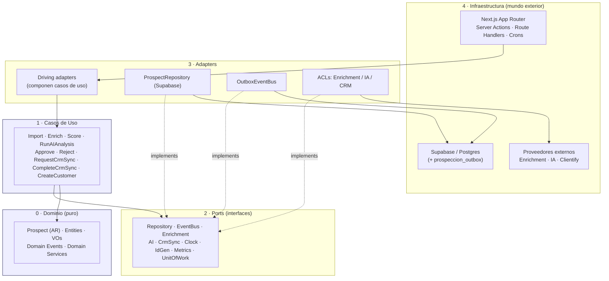

# Constitución Arquitectónica de la Plataforma Comercial de Nexus

## PARTE II — MODELO DE DOMINIO (DDD TÁCTICO) + BASE HEXAGONAL

> **Bounded context:** `prospeccion`. Código de dominio bajo `src/lib/prospeccion`.
> **Tono:** normativo. Lo que sigue son **reglas y contratos**, no sugerencias. Donde se diga DEBE / NO DEBE / PROHIBIDO, es vinculante para todo el contexto `prospeccion`.
> **No-fantasy:** este documento describe arquitectura **prescrita**. Al 2026-06-25 el directorio `src/lib/prospeccion` está **vacío** (verificado: `ls src/lib/prospeccion/` no devuelve archivos). Toda referencia a archivos `prospeccion/*` es **objetivo de diseño**, no estado actual. Las citas `file:line` a otros módulos (`clientify/`, `tesoreria/conciliacion/`, `arca/`, `comercial/`, `supabase/`) son **precedentes idiomáticos reales** del repo que esta Parte II eleva a norma.

---

### Preámbulo: por qué esta Parte difiere del resto de Nexus

La skill `architecture-tops-nexus` y la práctica vigente del repo describen un patrón **Feature → Server Action/Route Handler → `src/lib/<ctx>/data.ts` → Supabase**, RPC-first, sin capa de dominio explícita (ver `src/lib/comercial/leads-data.ts:44`, que mezcla acceso a datos, fallback de demo y mapeo). Ese patrón es legítimo para módulos CRUD-céntricos.

`prospeccion` **NO** es CRUD-céntrico: es un **pipeline event-driven** con lógica de negocio densa (scoring, decisión humana, anticorrupción contra tres proveedores externos volátiles) y una invariante dura de gobernanza: **nada va directo a Clientify; LinkedIn → Nexus → Clientify**. Por eso esta Parte II **prescribe una capa de dominio pura y puertos explícitos**, alineándose con los precedentes de DI ya presentes en `tesoreria/conciliacion/matching.ts` y `arca/soap.ts`. Esto es una **excepción deliberada y acotada** al patrón general, justificada por la complejidad del dominio.

---

## Sección 1 — Tactical DDD: Aggregates, Entities, Value Objects

### 1.1 Aggregate Root: `Prospect`

`Prospect` es el **único Aggregate Root** del contexto `prospeccion`. Toda mutación del estado de un prospecto DEBE entrar por la raíz.

**Identidad.** `ProspectId` (UUID v4, generado por `IdGeneratorPort` — §4.7, nunca por la base). La identidad es inmutable y se asigna en la creación.

**Estado (máquina de estados).** El ciclo de vida del agregado es una máquina de estados explícita, dirigida por los 9 eventos de dominio:

```
created → imported → enriched → scored → ai_analyzed → approved → crm_sync_requested → crm_sync_completed → customer_created
                                              └────────→ rejected (terminal)
```

> **Nombres canónicos (CC-7).** Estos son los nombres de estado **del dominio** (canónicos para citar entre capítulos). Su correspondencia con los alias del Event Storming (`15` §15.4 usa `analyzed` y `pending_approval`) y con el enum SQL en español (`prospeccion_status_t`: `con_ia`, `aprobado`, `sincronizado`, …) está fijada en **CC-7**. El estado `ai_analyzed` es donde el prospecto espera el gate humano (el Event Storming lo rotula `pending_approval`); `crm_sync_requested`/`crm_sync_completed` se persisten ambos como `sincronizado` (su distinción vive en los eventos del Outbox).

**Invariantes del agregado (DEBEN cumplirse en TODO momento; se validan en la raíz, nunca afuera):**

1. **INV-PR-1 — Transición legal.** Una transición de estado solo es válida si parte del estado inmediatamente anterior en la máquina. Saltar etapas está PROHIBIDO. Ejemplo: `approve()` solo es legal desde `ai_analyzed`. Esto replica el rigor de pasadas secuenciales de `matching.ts:14` ("Pasadas SECUENCIALES con asignación 1:1").
2. **INV-PR-2 — No-bypass de Clientify.** El agregado NO PUEDE alcanzar `crm_sync_requested` sin un `HumanDecision = approved` registrado. Ningún camino lleva de `enriched`/`scored`/`ai_analyzed` directo a CRM. Esta es la encarnación táctica de "nada va directo a Clientify".
3. **INV-PR-3 — Score requiere enriquecimiento.** `scored` exige `EnrichmentSnapshot` presente; no se puntúa un prospecto sin datos enriquecidos. (Espejo de OB6 en `iaMatch.ts:14`: "la IA nunca inventa un match sin corroboración").
4. **INV-PR-4 — Decisión humana inmutable.** Una vez registrada (`approved`/`rejected`), la `HumanDecision` no se reescribe; un cambio de opinión es un evento nuevo, no una mutación.
5. **INV-PR-5 — Idempotencia de sincronización.** Un `Prospect` mapea a lo sumo a **un** registro CRM (`CrmRef`). Reintentos de sync NO duplican. (Precedente: `crm_ingest_lead` idempotente por `clientify_id`, `clientify/reconcile.ts:5`.)
6. **INV-PR-6 — Terminalidad.** `rejected` y `customer_created` son estados terminales: no admiten transiciones salientes.

**Frontera transaccional.** La unidad de consistencia es **un `Prospect`**. Toda mutación + sus eventos resultantes se persisten en **una sola transacción** vía `UnitOfWorkPort` (§4.9) usando el patrón **Outbox** (eventos escritos a `prospeccion_outbox` en la misma transacción que el agregado). NUNCA se abarcan dos agregados en una transacción; la coordinación entre agregados es **eventual**, por eventos.

| Plantilla normativa | |
|---|---|
| **Objetivo** | Establecer `Prospect` como única raíz de consistencia y la máquina de estados como ley de transición. |
| **Alcance** | Toda escritura sobre el ciclo de vida de un prospecto en `prospeccion`. |
| **Decisiones tomadas** | AR único `Prospect`; 6 invariantes duras; transaccionalidad por-agregado con Outbox; identidad por `IdGeneratorPort`. |
| **Decisiones descartadas** | (a) Múltiples ARs (`Enrichment`, `Analysis` como raíces) — descartado: fragmenta la invariante INV-PR-2. (b) Estado en columnas sueltas tipo overlay (como `commercial-score.ts` lee `overlay_horizonte`) — descartado para el AR: el estado es una máquina, no un atributo libre. (c) Transacción multi-agregado — descartado por acoplamiento. |
| **Justificación** | La invariante de gobernanza (no-bypass de Clientify) solo es defendible si vive dentro de una raíz transaccional. |
| **Riesgos** | Agregado "gordo" si se le cuelgan responsabilidades de proveedores; se mitiga con VOs snapshot (§1.3) y ACL (§2.6). |
| **Impacto sobre la arquitectura** | Define la frontera transaccional, justifica `UnitOfWorkPort` y el Outbox, y subordina todos los casos de uso a la máquina de estados. |

### 1.2 Entities

Entidades (identidad propia, mutables, **dentro** de la frontera del AR `Prospect`; no se referencian desde afuera del agregado salvo por ID):

- **`EnrichmentSnapshot`** — resultado normalizado de un pase de enriquecimiento (empresa, dominio, facturación estimada, headcount). Identidad: `(provider, fetchedAt)`. Inmutable una vez tomado (es una "foto"). Análogo conceptual a `EnrichedDeal` (`commercial-score.ts:1`), pero **propio del dominio**, no del proveedor.
- **`AIAnalysis`** — salida estructurada del análisis IA: `summary`, `fit`, `ConfidenceScore` (§1.3). Identidad: `(model, analyzedAt)`. Inmutable.
- **`HumanDecision`** — `approved` | `rejected`, `actorId`, `decidedAt`, `note?`. Identidad: `decisionId`. Inmutable (INV-PR-4).
- **`CrmRef`** — vínculo con el registro creado en Clientify: `clientifyId`, `syncedAt`, `status`. Identidad: `clientifyId`. (Precedente del deeplink/ID externo: `clientify/mappers.ts:103`.)

Las entidades NO acceden a infraestructura. NO contienen imports de Supabase, `fetch`, ni de SDKs de proveedor.

### 1.3 Value Objects

Los Value Objects (VO) son **inmutables**, se comparan por valor, y **validan su invariante en construcción** (constructor privado + factory `create()` que devuelve `Result<VO, DomainError>` — patrón del error tipado de `clientify/client.ts:19` y `arca/soap.ts:11`, elevado a regla). Un VO en estado inválido NO PUEDE existir.

| VO | Invariante (validada al crear) | Notas |
|---|---|---|
| `Email` | RFC básico + normalización a minúsculas/trim | Espejo de la normalización de tokens en `iaMatch.ts:28-37`. |
| `Phone` | E.164 (Argentina por defecto, `+54`) | Acepta variantes `+54 11 …` y normaliza. |
| `Cuit` | 11 dígitos + dígito verificador AR válido; rechaza placeholders | Es VO **del dominio**, no string suelto como `taxId` en `mappers.ts:99`. |
| `Domain` / `Website` | host válido, sin esquema, lowercase | Clave para deduplicación de empresas. |
| `Score` | entero 0..100 | Rango cerrado, como `score: 0..100` en `matching.ts:38`. |
| `ConfidenceScore` | real 0..1 | Espejo exacto de `SimTextoFn → 0..1` (`iaMatch.ts:19`). |
| `Money` | entero en **centavos**, ISO-4217 (`ARS`/`USD`) | **Centavos enteros**, regla tomada de `matching.ts:1` ("PURO, centavos enteros"). PROHIBIDO float para dinero. |
| `EstimatedRevenue` | `Money` no negativo, con `confidence: ConfidenceScore` | Facturación estimada del enriquecimiento. |
| `SourceSlug` | enum cerrado: `linkedin` \| `import_csv` \| `enrichment_provider` \| … | Espejo del `source` controlado en `leads-data.ts:20` (`google_ads`/`web`/`referido`). |
| `ProspectStatus` | enum = estados de la máquina (§1.1) | El estado es un VO, no texto libre. |

**Regla de igualdad de VOs:** dos VOs son iguales si y solo si todos sus componentes normalizados son iguales. La normalización (NFD, lowercase, strip) es parte del VO, igual que en `iaMatch.ts:33`.

| Plantilla normativa | |
|---|---|
| **Objetivo** | Garantizar que datos de identidad/medida del dominio sean siempre válidos por construcción. |
| **Alcance** | Todo dato primitivo de negocio en `prospeccion` (mails, teléfonos, CUIT, montos, scores). |
| **Decisiones tomadas** | VOs inmutables con `create() → Result`; dinero en centavos enteros; scores con rango cerrado; enums cerrados para `source` y `status`. |
| **Decisiones descartadas** | (a) Primitivos crudos (`string`/`number`) como en gran parte del repo — descartado por permitir estados imposibles. (b) Validación en el borde (action) — descartado: deja la invariante fuera del dominio. (c) Dinero en float — PROHIBIDO. |
| **Justificación** | Empuja la validación al tipo; elimina chequeos defensivos dispersos; precedente directo en centavos/score 0..1 del repo. |
| **Riesgos** | Verbosidad. Se mitiga con factories y un módulo `prospeccion/domain/vo/`. |
| **Impacto sobre la arquitectura** | Los VOs viven en la capa de Dominio (capa 0); ningún adapter los construye sin pasar por `create()`. |

---

## Sección 2 — Eventos, Servicios, Casos de Uso, Repositorios, Factories, ACL

### 2.1 Domain Events (los 9 + `*.failed`)

Los eventos de dominio son **objetos inmutables, en pasado, hechos consumados**. Estructura común obligatoria:

```ts
interface DomainEvent<TName extends string, TPayload> {
  readonly eventId: string;        // IdGeneratorPort
  readonly name: TName;            // p.ej. "prospeccion.prospect.scored"
  readonly aggregateId: string;    // ProspectId
  readonly occurredAt: string;     // ISO, ClockPort
  readonly version: 1;             // versionado de esquema de evento
  readonly payload: Readonly<TPayload>;
}
```

Catálogo (namespace `prospeccion.prospect.*`):

| # | Evento | Disparado por | Payload (núcleo) |
|---|---|---|---|
| 1 | `ProspectCreated` | `ImportProspects` | `source`, `rawRef` |
| 2 | `ProspectImported` | `ImportProspects` | `Email?`, `Domain?`, `Cuit?` |
| 3 | `ProspectEnriched` | `EnrichProspect` | `EnrichmentSnapshot` |
| 4 | `ScoreCalculated` | `ScoreProspect` | `Score` |
| 5 | `AIAnalysisCompleted` | `RunAIAnalysis` | `AIAnalysis`, `ConfidenceScore` |
| 6 | `HumanApproved` | `ApproveProspect` | `actorId`, `note?` |
| 7 | `CrmSyncRequested` | `RequestCrmSync` | `intent` |
| 8 | `CrmSyncCompleted` | `CompleteCrmSync` | `CrmRef` |
| 9 | `CustomerCreated` | `CreateCustomer` | `customerId`, `CrmRef` |

**Eventos de fallo (`*.failed`).** Cada paso que toca un proveedor externo o una regla emite su contraparte de fallo, como ciudadano de primera clase: `ProspectEnrichmentFailed`, `AIAnalysisFailed`, `CrmSyncFailed` (y, por simetría, `ProspectRejected` como decisión humana negativa — terminal, ver INV-PR-6). El payload de un `*.failed` DEBE incluir `reason`, `transient: boolean` y `attempt`. La bandera `transient` es **idéntica en semántica** a `SoapNetworkError.transient` (`arca/soap.ts:21`) y gobierna si el orquestador reintenta. **Regla:** un `*.failed` transitorio habilita reintento con backoff; uno no-transitorio detiene el pipeline para ese prospecto y exige intervención.

**Reglas de eventos:**
- **E-1** Inmutables: `readonly` en todo el árbol; PROHIBIDO mutar un evento emitido.
- **E-2** Persistencia atómica vía Outbox en la misma transacción del agregado (INV-PR — frontera).
- **E-3** Entrega *at-least-once*; los consumidores DEBEN ser idempotentes (precedente: `reconcile.ts:5`).
- **E-4** Versionados (`version`) para evolución de esquema sin romper consumidores.

### 2.2 Domain Services

Servicios de dominio: lógica que **no pertenece naturalmente a una entidad/VO** y es **pura** (sin I/O). Viven en capa 0.

- **`ScoringPolicy`** — calcula `Score` a partir de `EnrichmentSnapshot` + reglas. DEBE ser una **función pura y testeable**, exactamente como `calculateCommercialScore(...)` (`commercial-score.ts:82`) y el motor de `matching.ts`. NO llama a IA ni a base.
- **`DeduplicationPolicy`** — decide si dos prospectos son el mismo por `(Cuit | Domain | Email)`. Determinista. Espejo del gate de corroboración de entidad (OB6, `iaMatch.ts:14`).
- **`PromotionPolicy`** — decide si un prospecto `approved` es elegible para `CreateCustomer`.

**Regla DS-1:** Si un servicio de dominio necesita una señal externa cara (p.ej. similitud semántica IA), esa señal se **inyecta como función** (`type SimTextoFn`, `iaMatch.ts:19`), pre-computada por lote. El servicio permanece **síncrono y puro**. La IA **nunca decide sola**: solo aporta un score (`iaMatch.ts:63`).

### 2.3 Application Services / Casos de Uso

Cada caso de uso es una **clase/función orquestadora** que: (1) carga el AR vía `ProspectRepositoryPort`, (2) invoca un método del AR o una `*Policy`, (3) recolecta los eventos emitidos por el AR, (4) persiste agregado + eventos en **una** `UnitOfWork`. Los casos de uso **dependen solo de puertos** (§4), nunca de adapters concretos.

| Caso de uso | Precondición (estado) | Puertos que usa | Evento(s) |
|---|---|---|---|
| `ImportProspects` | — | Repo, IdGen, Clock, EventBus, UoW | `ProspectCreated`, `ProspectImported` |
| `EnrichProspect` | `imported` | Repo, **EnrichmentPort**, Clock, EventBus, UoW | `ProspectEnriched` / `…Failed` |
| `ScoreProspect` | `enriched` | Repo, (`ScoringPolicy`), EventBus, UoW | `ScoreCalculated` |
| `RunAIAnalysis` | `scored` | Repo, **AIPort**, Clock, EventBus, UoW | `AIAnalysisCompleted` / `…Failed` |
| `ApproveProspect` | `ai_analyzed` | Repo, Clock, EventBus, UoW | `HumanApproved` |
| `RejectProspect` | `ai_analyzed` (o anterior) | Repo, Clock, EventBus, UoW | `ProspectRejected` (terminal) |
| `RequestCrmSync` | `approved` | Repo, EventBus, UoW | `CrmSyncRequested` |
| `CompleteCrmSync` | `crm_sync_requested` | Repo, **CrmSyncPort**, Clock, EventBus, UoW | `CrmSyncCompleted` / `…Failed` |
| `CreateCustomer` | `crm_sync_completed` | Repo, (`PromotionPolicy`), EventBus, UoW | `CustomerCreated` |

**Regla UC-1:** un caso de uso **no contiene reglas de transición** propias; delega en el AR (INV-PR-1). Si el estado es inválido, el AR lanza `DomainError` y el caso de uso **no** persiste nada.
**Regla UC-2:** los casos de uso que tocan proveedores (`EnrichProspect`, `RunAIAnalysis`, `CompleteCrmSync`) reciben el puerto correspondiente por inyección y traducen errores transitorios/permanentes a `*.failed` (semántica `arca/soap.ts:96` — "negocio: no reintentar").

### 2.4 Repositories (interfaces)

**Regla R-1:** un repositorio por **Aggregate Root** → existe **un solo** repositorio: `ProspectRepositoryPort` (§4.1). NO se crean repos para entidades internas (`EnrichmentSnapshot`, `AIAnalysis`): se persisten/cargan **como parte del agregado**. El repositorio devuelve y acepta **el agregado reconstituido**, no filas crudas; el mapeo fila↔dominio vive en el **adapter** (precedente: `clientify/mappers.ts` separa tipos externos de los internos).

### 2.5 Factories

Las factories se justifican **solo** cuando la construcción del agregado tiene reglas no triviales:

- **`ProspectFactory.fromImportRow(id, row, SourceSlug)`** — construye un `Prospect` nuevo desde una fila de import/LinkedIn: **recibe** el `ProspectId` ya generado por `IdGeneratorPort` (inyectado en el caso de uso `ImportProspects`, §2.3; NO lo pide al repositorio — ARCH-001), valida y arma VOs (`Email`, `Cuit`, `Domain`), arranca en `created` y emite `ProspectCreated`. Justificada porque concentra la validación de entrada y garantiza INV iniciales.
- **`ProspectFactory.reconstitute(state, events?)`** — usada por el adapter de repositorio para rehidratar el agregado desde persistencia **sin** re-emitir eventos.

NO se usan factories para VOs simples (basta `Email.create()`); NO se usa factory donde un constructor directo es suficiente (regla anti-ceremonia).

### 2.6 Anti-Corruption Layer (una por integración)

Toda integración externa cruza una **ACL** que traduce el modelo del proveedor al modelo de dominio y **aísla** al dominio de cambios del proveedor. Precedente canónico: `clientify/mappers.ts:5` ("que las pages no hablen Clientify directamente… un cambio futuro de CRM no impacte la UI"). Esta Parte II **eleva ese patrón a obligación** para los tres proveedores.

- **ACL de Enriquecimiento** (`prospeccion/adapters/enrichment/*`): cliente HTTP tipado + mapper `ProviderCompany → EnrichmentSnapshot`. El cliente DEBE manejar 429/5xx con backoff y `fetchImpl` inyectable para tests — patrón exacto de `clientify/client.ts:42-114` y `arca/soap.ts:54`. El dominio nunca ve el JSON del proveedor.
- **ACL de IA** (`prospeccion/adapters/ai/*`): traduce `Prospect`/`EnrichmentSnapshot` → prompt, y respuesta del modelo → `AIAnalysis` + `ConfidenceScore`. La señal IA se expone al dominio como **función pura inyectable** (`SimTextoFn`-style, `iaMatch.ts:19`); datos sensibles **redactados** antes de salir (precedente: `iaMatch.ts:57`, "datos ya REDACTADOS").
- **ACL de CRM Sync** (`prospeccion/adapters/crm/*`): mapea `Prospect aprobado → payload Clientify` y respuesta → `CrmRef`. Idempotente por `Cuit`/`clientifyId` (INV-PR-5; precedente `reconcile.ts`). Reusa el cliente de `src/lib/clientify/client.ts` **a través de la ACL**, nunca directo desde el dominio.

**Regla ACL-1:** PROHIBIDO importar un SDK/cliente de proveedor desde la capa de Dominio o de Casos de Uso. Todo proveedor entra por su puerto, implementado por su ACL.

| Plantilla normativa (Sección 2) | |
|---|---|
| **Objetivo** | Definir el vocabulario táctico operativo: eventos consumados, servicios puros, casos de uso por-puerto, un repo por AR, factories justificadas y una ACL por proveedor. |
| **Alcance** | Toda la lógica de aplicación y los bordes de integración de `prospeccion`. |
| **Decisiones tomadas** | 9 eventos + `*.failed` con `transient`; servicios de dominio puros con señales IA inyectadas; 9 casos de uso por-puerto; un único `ProspectRepositoryPort`; 2 factories; 3 ACLs (enrichment/IA/CRM). |
| **Decisiones descartadas** | (a) Casos de uso accediendo a Supabase/`fetch` directo (patrón `data.ts` del repo) — descartado en este contexto. (b) Repos por entidad interna — descartado (rompe la frontera del AR). (c) Dominio llamando al LLM síncronamente — descartado (`iaMatch.ts:64`). |
| **Justificación** | Reusa patrones probados del repo (DI por función, mappers ACL, idempotencia) y los hace norma; mantiene el dominio testeable sin red. |
| **Riesgos** | Más archivos/indirección que el patrón `data.ts`. Aceptado por la densidad de reglas y la criticidad de la invariante de gobernanza. |
| **Impacto sobre la arquitectura** | Fija las dependencias hacia los puertos (§4) y consolida el Outbox como mecanismo de propagación. |

---

## Sección 3 — Arquitectura Hexagonal / Clean

### 3.1 Capas y Regla de Dependencia

Cinco capas concéntricas. **Regla de Dependencia (LEY):** las dependencias apuntan **siempre hacia adentro**. Una capa interior NO conoce a ninguna exterior. PROHIBIDAS las dependencias inversas (un import de Dominio hacia un adapter, o de Casos de Uso hacia Next.js/Supabase, es una **violación constitucional**).

0. **Dominio** (`prospeccion/domain/`): AR `Prospect`, Entities, VOs, Domain Events, Domain Services, `DomainError`. **Cero imports de infraestructura.** Cero `fetch`, cero `@supabase/*`, cero `next/*`. (Contraste con `commercial-score.ts`, que es puro pero importa un tipo de proveedor: en `prospeccion` eso está PROHIBIDO — se usa el tipo de dominio.)
1. **Casos de Uso** (`prospeccion/application/`): los 9 application services. Dependen de Dominio + **Ports**. Nada más.
2. **Ports** (`prospeccion/ports/`): interfaces TypeScript (driving y driven). Definidas hacia adentro; implementadas hacia afuera (Dependency Inversion).
3. **Adapters** (`prospeccion/adapters/`): implementaciones concretas de los ports driven (Supabase repo, ACLs de enrichment/IA/CRM, EventBus Outbox) y wiring de los driving.
4. **Infraestructura** (Next.js App Router, Supabase/Postgres, SDKs): el mundo exterior. Solo la conoce la capa de Adapters.

### 3.2 Mapeo a la realidad Next.js

- **Driving adapters (entran al sistema):** Server Actions (`"use server"`, precedente `comercial/lead-actions.ts:1`), Route Handlers (webhooks/ingest, precedente `clientify/webhook.ts`), y crons (GH Actions). **Su única responsabilidad:** autenticar/autorizar (RLS como frontera, RBAC), validar entrada, **componer** el caso de uso con sus adapters y traducir el `Result`/`DomainError` a respuesta HTTP/UI. NO contienen reglas de negocio.
- **Driven adapters (el sistema sale):** `ProspectRepository` sobre Supabase (`createClient()`, precedente `supabase/server.ts:12`), `OutboxEventBus` (Postgres), ACLs HTTP de los tres proveedores. Implementan ports; son intercambiables.
- **Composition Root:** el wiring (qué adapter concreto recibe cada port) ocurre **en el borde** (la action/route/cron), no en el dominio — igual que `matching.ts` recibe `simTexto` desde el caller y `soapPost` recibe `fetchImpl` desde el caller.

### 3.3 Diagrama de capas (Mermaid)



> **Lectura del diagrama:** las flechas sólidas son dependencias de compilación y apuntan hacia adentro (`Next → Driving → UC → Ports/Domain`). Las flechas punteadas `implements` van de Adapters a Ports: el adapter **depende** del port (inversión), el dominio **no** depende del adapter. Las flechas Adapter→Infra son las únicas salidas al exterior.

| Plantilla normativa (Sección 3) | |
|---|---|
| **Objetivo** | Fijar las 5 capas, la Regla de Dependencia hacia adentro y el mapeo a driving/driven adapters de Next.js. |
| **Alcance** | Organización física de `src/lib/prospeccion` y el wiring en el borde (actions/routes/crons). |
| **Decisiones tomadas** | Dominio puro (cero infra); ports en el medio; Composition Root en el borde; Outbox como propagación; RLS/RBAC en el driving adapter. |
| **Decisiones descartadas** | (a) Patrón plano `data.ts` para este contexto — descartado. (b) Acceso a Supabase desde el dominio — PROHIBIDO. (c) DI container pesado — descartado a favor del wiring explícito por función (estilo `soap.ts`/`matching.ts`). |
| **Justificación** | La Regla de Dependencia es lo que hace defendibles INV-PR-2/INV-PR-5 y permite testear el dominio sin red ni base. |
| **Riesgos** | Disciplina manual de imports. Se mitiga con lint de capas (regla de import boundaries) y revisión de PR. |
| **Impacto sobre la arquitectura** | Es la columna vertebral: todo lo demás (puertos, ACLs, Outbox) se justifica por esta regla. |

---

## Sección 4 — Catálogo de Ports

Convención: **driving** = el mundo invoca al sistema; **driven** = el sistema invoca al mundo. Todas las firmas son **bocetos** (signatureSketch) en TypeScript; el `Result<T, DomainError>` es el patrón de error tipado del repo (`ClientifyError` en `client.ts:19`, `SoapFaultError`/`SoapNetworkError` en `soap.ts:11-27`).

```ts
// Tipos compartidos (boceto)
type Result<T, E = DomainError> = { ok: true; value: T } | { ok: false; error: E };
type ProspectId = string & { readonly __brand: "ProspectId" };
```

### 4.1 `ProspectRepositoryPort` (driven)
```ts
interface ProspectRepositoryPort {
  // ARCH-001: el repositorio SOLO persiste/reconstituye. La generación de identidad NO vive aquí
  // (sería violación de SRP + dependencia implícita invisible para el caso de uso): el `ProspectId`
  // lo genera `IdGeneratorPort` (§4.7), inyectado directamente en el caso de uso, y se pasa a
  // `ProspectFactory.fromImportRow(...)` (§2.5). No existe `repo.nextId()`.
  findById(id: ProspectId): Promise<Prospect | null>;    // reconstituye el AR
  findByDedupeKey(k: DedupeKey): Promise<Prospect | null>; // Cuit|Domain|Email (INV-PR-5)
  save(p: Prospect, uow: UnitOfWork): Promise<void>;     // dentro de la transacción
}
```

### 4.2 `EventBusPort` (driven)
```ts
interface EventBusPort {
  // Outbox: escribe en prospeccion_outbox EN LA MISMA transacción del agregado (E-2).
  publish(events: ReadonlyArray<DomainEvent>, uow: UnitOfWork): Promise<void>;
}
```

### 4.3 `EnrichmentPort` (driven)
```ts
interface EnrichmentPort {
  // Implementado por la ACL de enrichment. transient diferencia reintento vs. stop (arca/soap.ts:21).
  enrich(input: { domain?: Domain; cuit?: Cuit; email?: Email }):
    Promise<Result<EnrichmentSnapshot, { reason: string; transient: boolean }>>;
}
```

### 4.4 `AIPort` (driven)
```ts
interface AIPort {
  // La ACL de IA arma el prompt con datos REDACTADOS y devuelve estructura de dominio (iaMatch.ts:57).
  analyze(input: { prospect: ProspectView; snapshot: EnrichmentSnapshot }):
    Promise<Result<{ analysis: AIAnalysis; confidence: ConfidenceScore }, { reason: string; transient: boolean }>>;
}
```

### 4.5 `CrmSyncPort` (driven)
```ts
interface CrmSyncPort {
  // Idempotente por dedupeKey (INV-PR-5); reusa clientify/client.ts a través de la ACL.
  upsertProspect(p: ApprovedProspectView):
    Promise<Result<CrmRef, { reason: string; transient: boolean }>>;
}
```

### 4.6 `ClockPort` (driven)
```ts
interface ClockPort { now(): string; } // ISO. Inyectable como el `today: Date` de commercial-score.ts:82.
```

### 4.7 `IdGeneratorPort` (driven)
```ts
interface IdGeneratorPort { uuid(): string; } // identidad fuera de la base; testeable/determinista en tests.
```

### 4.8 `MetricsPort` (driven)
```ts
interface MetricsPort {
  increment(name: string, tags?: Record<string, string>): void;
  observe(name: string, value: number, tags?: Record<string, string>): void; // p.ej. usoIa, latencias de proveedor
}
```

### 4.9 `UnitOfWorkPort` (driven)
```ts
interface UnitOfWorkPort {
  // Una transacción = un agregado + sus eventos (frontera transaccional, §1.1).
  run<T>(work: (uow: UnitOfWork) => Promise<T>): Promise<T>;
}
```

### 4.10 Driving ports
Los **driving ports** son las interfaces de los casos de uso (§2.3) que el mundo invoca. Boceto representativo:
```ts
interface EnrichProspectUseCase { execute(cmd: { prospectId: ProspectId }): Promise<Result<void>>; }
// (Análogos: ImportProspectsUseCase, ScoreProspectUseCase, RunAIAnalysisUseCase,
//  ApproveProspectUseCase, RejectProspectUseCase, RequestCrmSyncUseCase,
//  CompleteCrmSyncUseCase, CreateCustomerUseCase.)
```
El **driving adapter** (Server Action / Route Handler / cron) implementa el wiring: instancia los driven adapters, construye el caso de uso y llama `execute(...)`.

| Plantilla normativa (Sección 4) | |
|---|---|
| **Objetivo** | Catalogar los contratos (ports) que aíslan dominio/casos de uso de la infraestructura. |
| **Alcance** | Toda dependencia externa de `prospeccion`: persistencia, eventos, proveedores, tiempo, IDs, métricas, transacción. |
| **Decisiones tomadas** | 9 driven ports + driving ports por caso de uso; `Result<T, DomainError>`; `transient` en proveedores; un repo por AR; UoW = un agregado por transacción. |
| **Decisiones descartadas** | (a) Repos genéricos `Repository<T>` — descartado (un AR → un repo). (b) Excepciones desnudas — descartado a favor de `Result` tipado (precedente `soap.ts`). (c) `Date.now()`/`crypto.randomUUID()` directos en dominio — PROHIBIDO (no-determinismo en tests): van por `ClockPort`/`IdGeneratorPort`. |
| **Justificación** | Los ports materializan la Inversión de Dependencias; con `fetchImpl`/`simTexto`/`today` inyectables el repo ya demostró que el patrón funciona y es testeable. |
| **Riesgos** | Sobre-abstracción si se agregan ports especulativos. Regla: un port nace solo cuando un caso de uso lo necesita. |
| **Impacto sobre la arquitectura** | Es la "cintura" del hexágono: define qué puede sustituirse (todo lo driven) sin tocar el dominio. |

---

> **Cierre de la Parte II.** El dominio de `prospeccion` es **puro y soberano**: conoce las reglas (máquina de estados, no-bypass de Clientify, idempotencia), no conoce la infraestructura. Los proveedores entran por ACLs; la persistencia y los eventos por ports; el wiring vive en el borde Next.js. La Parte III (Outbox, transporte de eventos, RLS/RBAC operativo, observabilidad) construye sobre estos contratos.
