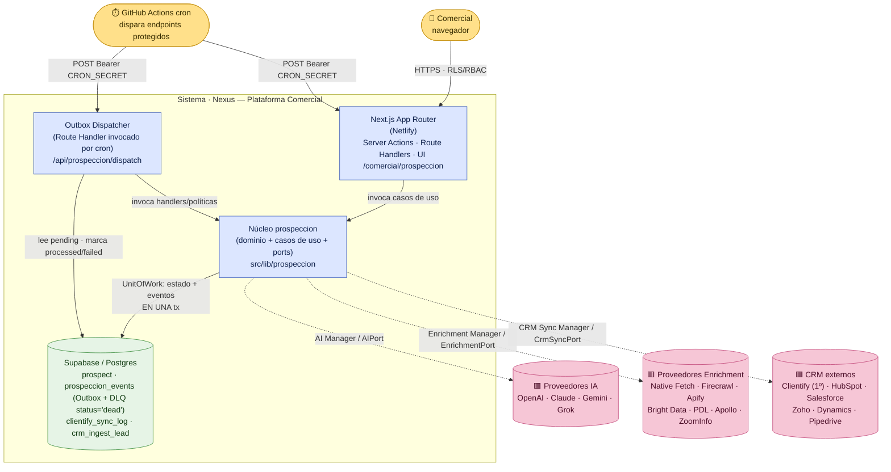
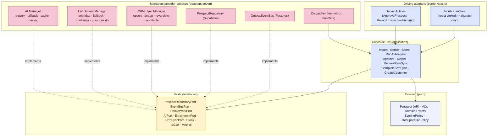
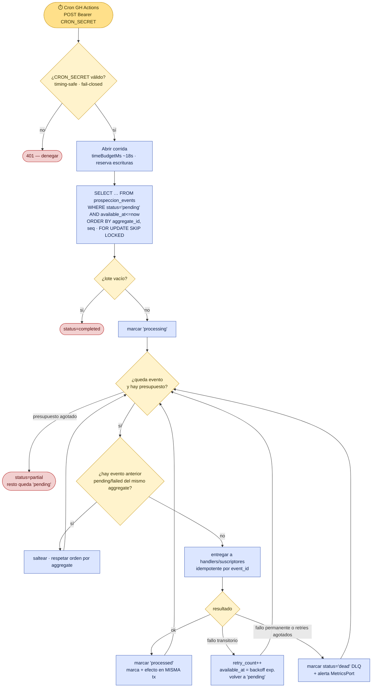
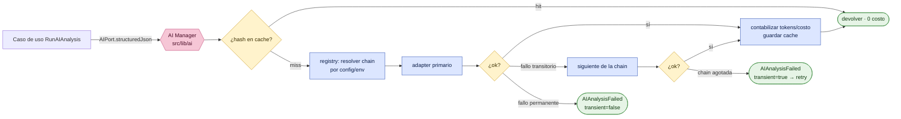
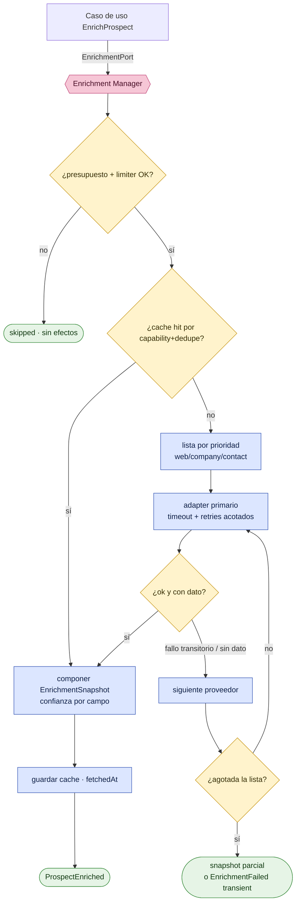
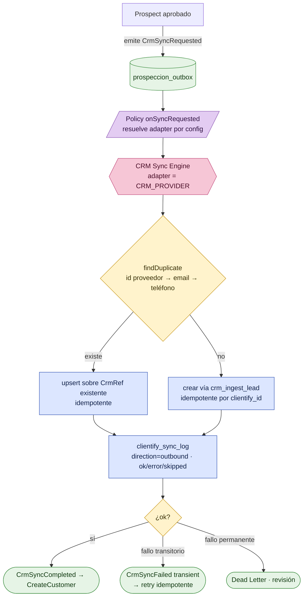
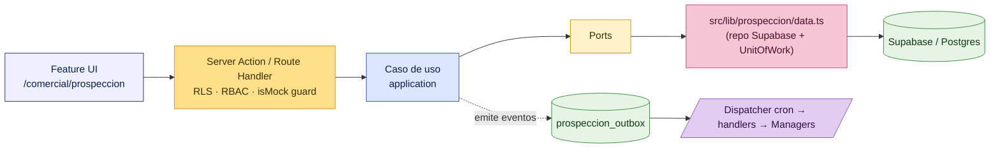

# Constitución Arquitectónica de la Plataforma Comercial de Nexus

## PARTE III — ARQUITECTURA TÉCNICA (construida alrededor del dominio)

> **Bounded context:** `prospeccion`. Código bajo `src/lib/prospeccion`.
> **Tono:** normativo. Lo que sigue son **reglas y contratos** (DEBE / NO DEBE / PROHIBIDO), vinculantes para todo el contexto.
> **No-fantasy:** esta Parte describe arquitectura **prescrita**. Al 2026-06-25 `src/lib/prospeccion` está **vacío**; toda ruta `prospeccion/*` es objetivo de diseño. Las citas `file:line` a otros módulos del repo (`compliance/sync/engine.ts`, `clientify/*`, `ocr/openai.ts`, `rate-limit.ts`, `.github/workflows/*sync*.yml`) son **precedentes idiomáticos reales** que esta Parte III eleva a norma. La Parte III **construye alrededor del dominio** ya fijado en la Parte II (AR `Prospect`, 9 eventos + `*.failed`, ports, ACLs) y en el Event Storming (§15): no lo redefine, lo **mecaniza**.

---

### Preámbulo: la técnica es subordinada

La regla constitucional **«nada va directo a Clientify; LinkedIn → Nexus → Clientify»** (§15.0, Parte II INV-PR-2) es lo que esta Parte III tiene que volver **operable y defendible en producción**. Todo lo que sigue —contenedores, Outbox, Dispatcher, los tres Managers, el motor de sync— existe **para servir** al dominio puro de la Parte II, nunca al revés. La Regla de Dependencia (Parte II §3.1) sigue siendo LEY: las flechas apuntan hacia adentro; la infraestructura conoce al dominio, el dominio **no** conoce la infraestructura.

Decisión estructural transversal, ya tomada en el Event Storming (§15.1) y **reconfirmada aquí**: el transporte de eventos es **Outbox sobre Postgres + Event Bus interno**, **NO** Kafka/RabbitMQ/SQS. El stack real (Supabase + Next.js en Netlify + cron de GitHub Actions) ya prueba este patrón en `compliance` y `comercial`; agregar un broker externo sería infraestructura sin caso de uso que la justifique en F0.

---

## Sección 1 — Modelo C4: Container y Component

### 1.1 Container Diagram (C4 nivel 2)



> **Lectura.** Hay **un** sistema (Nexus) con cuatro contenedores lógicos: la app Next.js (driving), el núcleo `prospeccion` (dominio puro + casos de uso + ports), el **Dispatcher** del Outbox (un Route Handler que el cron dispara, espejo de `/api/compliance/sync`) y Postgres. Los tres grupos de proveedores externos (IA, Enrichment, CRM) viven **detrás de Managers** (líneas punteadas = salidas vía ACL). El cron de GitHub Actions autentica con `Authorization: Bearer ${CRON_SECRET}`, idéntico a `.github/workflows/compliance-drive-sync.yml:44-46`.

### 1.2 Component Diagram (C4 nivel 3) — interior de `prospeccion`



> **Lectura.** Los **casos de uso** dependen del dominio y de los **ports** (centro de la cintura). Los **Managers** y los adapters de persistencia/eventos **implementan** ports (flechas `implements` = inversión de dependencia). Ningún adapter es importado por el dominio. El Dispatcher invoca casos de uso, no toca el dominio directo.

| Plantilla normativa (Sección 1) | |
|---|---|
| **Objetivo** | Fijar la vista C4 de contenedores y componentes que materializa el hexágono de la Parte II sobre el stack real (Next.js/Supabase/cron). |
| **Alcance** | Topología física de `prospeccion`: app, núcleo, Dispatcher, Postgres y los tres grupos de proveedores. |
| **Decisiones tomadas** | Cuatro contenedores; Dispatcher como Route Handler disparado por cron con `CRON_SECRET`; proveedores SIEMPRE detrás de Managers; UnitOfWork = estado + eventos en una tx. |
| **Decisiones descartadas** | (a) Microservicio separado por Manager — descartado: el monolito modular de Nexus alcanza. (b) Broker externo (Kafka/SQS) como contenedor — descartado (§Preámbulo). (c) Worker daemon persistente — descartado: el modelo serverless + cron ya está probado en `compliance`. |
| **Justificación** | Reusa el patrón endpoint-protegido-disparado-por-cron de `compliance-drive-sync.yml` sin infraestructura nueva. |
| **Riesgos** | El límite serverless de Netlify (~26-30 s reales) acota cuánto procesa una corrida del Dispatcher. Se mitiga con presupuesto de tiempo por corrida (§2.4). |
| **Impacto sobre la arquitectura** | Define dónde corre cada cosa y confirma al Dispatcher como pieza de primera clase. |

---

## Sección 2 — Backbone Event-Driven: Outbox + Event Bus interno

### 2.1 Outbox transaccional (publish)

**Regla OB-1 (publish atómico).** Emitir un evento DEBE ser **insertar una fila en `prospeccion_outbox` en la MISMA transacción** que muta el estado del agregado. PROHIBIDO publicar a un bus externo dentro del request del cambio de estado (riesgo de evento huérfano si el proceso cae entre el commit y el publish). Este es el patrón Transactional Outbox y replica la atomicidad ya probada del repo: el Write-Path CRM escribe transición + ledger en una sola función (§15.1) y el motor de Compliance hace upsert de documentos + recálculo de alertas dentro de una corrida (`compliance/sync/engine.ts:239-263`).

**Esquema mínimo de `prospeccion_outbox`** (boceto; migración portadora: siguiente disponible **0088**, confirmado en §15.3):

| Columna | Semántica |
|---|---|
| `id` (uuid, PK) | identidad del evento (IdGeneratorPort); clave de idempotencia |
| `seq` (bigint identity) | orden total de inserción; orden causal/desempate dentro del mismo `aggregate_id` (CONS-C1) |
| `aggregate_id` (uuid) | `ProspectId`; ordena por agregado |
| `type` (text) | `prospect.created` … (catálogo Parte II §2.1; el `name` namespaced del dominio se materializa aquí como `type`) |
| `version` (int) | versión de esquema del evento (E-4) |
| `payload` (jsonb) | cuerpo inmutable del evento |
| `created_at` (timestamptz) | momento de inserción (ClockPort en el dominio) |
| `status` (text + check) | `pending` → `processing` → `processed` \| `failed` \| `dead` |
| `retry_count` (int) | reintentos consumidos |
| `available_at` (timestamptz) | cuándo el evento vuelve a estar disponible para dispatch (backoff, §2.3) |
| `error` (text) | último motivo de fallo |

> **Esquema vinculante.** Esta tabla es el **boceto conceptual**; la definición **literal y completa** (que además incluye `correlation_id`, `causation_id`, `actor`) es la de **Persistencia §2.2 (`0089`)** y prevalece ante cualquier diferencia. El **nombre físico** de la tabla es `prospeccion_events` (CC-2); `prospeccion_outbox` es el nombre lógico del patrón. Los nombres de columna usados aquí (`id`/`type`/`created_at`/`available_at`/`error`) son los del DDL vinculante.

**Regla OB-2 (append-only).** El Outbox es **append-only e inmutable en su payload**: RLS sin `update` sobre `payload`/`name`/`aggregate_id`; el único campo mutable es el bloque de control (`status`, `retry_count`, `available_at`, `error`), y solo el Dispatcher (service_role) lo escribe. Espejo del ledger inmutable del repo (Parte II §15.4; `clientify_sync_log`).

### 2.2 Dispatch (worker por cron)

**Regla OB-3 (dispatch).** Un **Dispatcher** (Route Handler `/api/prospeccion/dispatch`, disparado por cron de GitHub Actions con `Bearer CRON_SECRET`, fail-closed) lee filas `pending` cuyo `available_at <= now()`, las marca `processing`, las entrega a los **handlers/suscriptores** registrados para ese `name`, y según el resultado las pasa a `processed` o `failed`. El Dispatcher corre **SECURITY DEFINER / service_role** (tráfico de máquina sin `auth.uid()`), como `crm_ingest_lead` (§15.2).

**Regla OB-4 (presupuesto de corrida).** Cada corrida del Dispatcher DEBE respetar un **presupuesto de tiempo** holgado bajo el límite serverless real (~26-30 s) y declararse `partial` si lo agota, dejando el resto `pending` para la próxima corrida. Esto es **exactamente** el mecanismo de `compliance/sync/engine.ts`: `timeBudgetMs` por defecto `18_000` con holgura explícita comentada (`engine.ts:84-90`), corte del loop al superar el presupuesto (`engine.ts:200-204`) y estado `partial` sin tratarlo como falla (`engine.ts:319`; el cron lo trata como warning, no error — `compliance-drive-sync.yml:62-66`).

**Regla OB-5 (lote + fallback fila por fila).** El procesamiento es **por lote**, y un evento inválido NO DEBE tirar el lote entero: ante fallo del lote se reintenta **evento por evento** para aislar el/los culpables. Patrón idéntico al `batch_fallback` de `compliance/sync/engine.ts:240-262`.

### 2.3 Idempotencia, retry, backoff, orden, replay, Dead Letter

- **Idempotencia (Regla OB-6).** Entrega *at-least-once*: cada handler DEBE ser idempotente por `event_id` + dedup de consumidor. Reprocesar el mismo `event_id` NO DEBE producir efectos dobles. Precedente canónico del repo: `crm_ingest_lead` es idempotente por `clientify_id` y `reconcileContacts` declara "re-correr el mismo lote no duplica" (`clientify/reconcile.ts:41-42`). Un consumidor que escribe efectos externos (push a CRM) DEBE registrar la marca de procesamiento **en la misma tx** que el efecto local.
- **Retry + backoff (Regla OB-7).** Un fallo **transitorio** (5xx/red/429 del proveedor) incrementa `retry_count`, recalcula `available_at` con **backoff exponencial** y vuelve a `pending`. Un fallo **permanente** (payload inválido, sin identidad) NO se reintacta indefinidamente: va a Dead Letter. La distinción `transient` es el campo de los eventos `*.failed` (Parte II §2.1) y replica la semántica probada en el cliente Clientify: 429 → espera `retry-after` o `1000·2^attempt`; 5xx → `800·2^attempt`; otro → error duro sin reintento (`clientify/client.ts:88-101`).
- **Orden por agregado (Regla OB-8).** El orden se garantiza **por `aggregate_id`** (un `Prospect` procesa sus eventos en orden `seq`), NO globalmente. El Dispatcher DEBE no avanzar un evento de un agregado si hay uno anterior `pending`/`failed` del mismo agregado (la máquina de estados de la Parte II §1.1 exige transición legal: saltar etapas está PROHIBIDO). Esto evita, p. ej., procesar `CrmSyncRequested` antes que `HumanApproved`.
- **Replay (Regla OB-9).** Como el estado del agregado se deriva del ledger append-only, **reproducir** eventos en orden reconstruye el agregado. El replay DEBE poder filtrarse **por tipo / rango temporal / aggregate**, y DEBE ser **"dry"-capaz** (recorrer sin escribir efectos externos), exactamente como el `dryRun` del motor de Compliance (`compliance/sync/engine.ts:38-48, 215`). Un replay dry NO DEBE tocar proveedores ni el CRM.
- **Dead Letter (Regla OB-10).** Un evento que agota `retry_count` (transitorio persistente) o falla permanentemente se marca `status='dead'` en `prospeccion_events` (la **DLQ es un estado del Outbox, no una tabla separada**; valor `dead` ya en el `check` del DDL `35` §2.2), conservando `error`, `retry_count` y el payload completo, y emite una alerta (MetricsPort). El Dead Letter es inspeccionable y **re-encolable** manualmente tras corrección (volver a `pending`). Esto materializa el principio del Event Storming: "errores permanentes se marcan y se cierran, no se reintentan en loop" (§15.3).

### 2.4 Diagrama del dispatch (Mermaid)



> **Lectura.** `FOR UPDATE SKIP LOCKED` permite múltiples corridas concurrentes sin doble-procesar (cada una toma filas distintas). El orden por `aggregate_id, seq` + el gate de "evento anterior pendiente" garantiza la Regla OB-8. El corte por presupuesto (`partial`) y el fallback son los mismos que en `compliance/sync/engine.ts`.

| Plantilla normativa (Sección 2) | |
|---|---|
| **Objetivo** | Definir el transporte de eventos: Outbox transaccional + Dispatcher por cron, con idempotencia, retry/backoff, orden por agregado, replay y Dead Letter. |
| **Alcance** | `prospeccion_events` (Outbox + DLQ lógica `status='dead'`), el Route Handler de dispatch y los handlers/suscriptores. |
| **Decisiones tomadas** | Publish = insert en la misma tx (OB-1); append-only (OB-2); dispatch service_role fail-closed con presupuesto (OB-3/OB-4); lote + fallback (OB-5); idempotencia at-least-once (OB-6); backoff exponencial con `transient` (OB-7); orden por aggregate (OB-8); replay dry-capaz (OB-9); Dead Letter re-encolable (OB-10). |
| **Decisiones descartadas** | (a) Bus externo (Kafka/SQS/RabbitMQ) — descartado (§Preámbulo). (b) Publish best-effort fuera de la tx — descartado (eventos huérfanos). (c) Orden total global — descartado: caro e innecesario; basta orden por agregado. (d) Worker daemon persistente — descartado a favor de cron + serverless probado. |
| **Justificación** | Cada mecanismo tiene precedente verificado en el repo (`engine.ts` presupuesto/fallback/dryRun; `client.ts` backoff; `reconcile.ts`/`crm_ingest_lead` idempotencia; `compliance-drive-sync.yml` cron fail-closed). Cero invención. |
| **Riesgos** | Latencia de propagación = período del cron (no real-time). Aceptado: el pipeline es asíncrono por diseño. Mitigación de tormenta de eventos: idempotencia + `processed`. |
| **Impacto sobre la arquitectura** | Es el sistema nervioso: implementa `EventBusPort`/`UnitOfWorkPort` (Parte II §4.2/§4.9) y conecta todos los casos de uso por reacción a eventos. |

---

## Sección 3 — AI Provider Manager

### 3.1 Contrato y ubicación

Vive en **`src/lib/ai`** (Manager transversal de Nexus, no exclusivo de `prospeccion`) y se expone al contexto a través de `AIPort` (Parte II §4.4). **Regla AI-1:** el dominio y los casos de uso NUNCA importan un SDK de proveedor; solo conocen `AIPort`. La ACL de IA (Parte II §2.6) arma el prompt con datos **redactados** y devuelve estructura de dominio (`AIAnalysis` + `ConfidenceScore`).

```ts
// src/lib/ai (boceto de contrato — provider-agnostic)
interface AIPort {
  complete(req: { promptId: string; vars: Record<string, unknown>; }):
    Promise<Result<{ text: string; usage: TokenUsage }, AIError>>;
  structuredJson<T>(req: { promptId: string; vars: Record<string, unknown>; schema: JsonSchema }):
    Promise<Result<{ value: T; usage: TokenUsage }, AIError>>;
}
type TokenUsage = { inputTokens: number; outputTokens: number; totalTokens: number; estCostUsd: number };
```

`structuredJson` reusa la **mecánica exacta** de `ocr/openai.ts`: llamada con `response_format: { type: "json_object" }`, `temperature` baja, parseo defensivo con error tipado si el modelo devuelve JSON inválido, y conteo de tokens desde `usage.total_tokens` (`ocr/openai.ts:140-174`). El saneamiento "no inventar: si una fila es inconsistente, descartarla" (`ocr/openai.ts:420-421`) se eleva a regla del Manager.

### 3.2 Reglas del Manager IA

- **AI-2 (registry + selección).** Un **registry** mapea `providerId → adapter` (OpenAI, Claude, Gemini, Grok). El proveedor activo y el orden se eligen por **config/env** (`AI_PROVIDER`, `AI_FALLBACK_CHAIN`), NUNCA hardcodeado. Espejo de la selección por env de `ocr/openai.ts:47-49` (`OPENAI_OCR_MODEL` con default), generalizado a multi-proveedor.
- **AI-3 (fallback chain).** Ante fallo **transitorio** del proveedor primario (5xx/429/timeout), el Manager DEBE intentar el siguiente de la cadena antes de devolver `*.failed` transitorio. Un fallo **permanente** (prompt rechazado, schema imposible) NO cae en cascada: devuelve error duro. Distinción `transient` ya canónica en `client.ts:88-101`.
- **AI-4 (contabilidad tokens/costo).** Cada llamada DEBE registrar `inputTokens/outputTokens/estCostUsd` por `providerId`/`promptId` vía `MetricsPort` (Parte II §4.8). Los costos por modelo están documentados como precedente en `ocr/openai.ts:27-30`.
- **AI-5 (cache por hash de input).** El Manager DEBE cachear por **hash determinista** de `(promptId, version, vars, schema, providerId)`. Misma entrada → mismo resultado sin re-llamar al proveedor (ahorro de costo y prerequisito de replay determinista, §15.3 "determinismo obligatorio para replay").
- **AI-6 (prompts versionados).** Los prompts viven en un **catálogo versionado** (`promptId@version`), nunca como string suelto disperso. El prompt de extracción de `ocr/openai.ts:55-130` es el precedente de "prompt como artefacto", aquí formalizado con versión para que un cambio no rompa el cache ni el replay.

### 3.3 Diagrama del Manager IA



| Plantilla normativa (Sección 3) | |
|---|---|
| **Objetivo** | Definir el AI Provider Manager provider-agnostic detrás de `AIPort`, reusando la mecánica de `ocr/openai.ts`. |
| **Alcance** | `src/lib/ai`: registry, adapters (OpenAI/Claude/Gemini/Grok), fallback, costos, cache, prompts versionados. |
| **Decisiones tomadas** | `complete`/`structuredJson`; registry + selección por config/env; fallback chain por `transient`; contabilidad tokens/costo; cache por hash; prompts `id@version`. |
| **Decisiones descartadas** | (a) Acoplar el contexto a OpenAI directo — PROHIBIDO (rompe provider-agnostic). (b) Prompts como strings dispersos sin versión — descartado (rompe cache/replay). (c) `temperature` alta para extracción — descartado (no determinista). |
| **Justificación** | `ocr/openai.ts` ya prueba json_object + parseo defensivo + conteo de tokens + saneo sin invención; generalizarlo es bajo riesgo. |
| **Riesgos** | Drift de costos entre proveedores; mitigado con `estCostUsd` por llamada y presupuesto. Cache stale si cambia el prompt; mitigado porque la versión es parte de la clave. |
| **Impacto sobre la arquitectura** | Implementa `AIPort`; habilita replay determinista y control de costo de IA en todo Nexus. |

---

## Sección 4 — Enrichment Manager

### 4.1 Contrato y sub-puertos

Detrás de `EnrichmentPort` (Parte II §4.3), el Enrichment Manager se subdivide en **sub-puertos por capacidad** para no acoplar a un proveedor que sólo hace una cosa:

```ts
interface EnrichmentPort {
  web: WebEnricher;        // descubrir/scrapear sitio (Native Fetch, Firecrawl, Apify)
  company: CompanyEnricher; // firmografía/empresa (Bright Data, PDL, Apollo, ZoomInfo)
  contact: ContactEnricher; // datos de contacto (Apollo, ZoomInfo, PDL)
}
// Cada sub-enricher devuelve campos con CONFIANZA por campo (no un blob plano):
type FieldValue<T> = { value: T; confidence: ConfidenceScore; provider: string; fetchedAt: string };
```

**Regla EN-1 (DTO con confianza por campo).** El Manager NO devuelve el JSON del proveedor: devuelve un `EnrichmentSnapshot` (entidad de dominio, Parte II §1.2) donde **cada campo lleva su `ConfidenceScore`** (0..1, Parte II §1.3) y su proveedor de origen. El dominio decide qué hacer con la confianza (p. ej. la `ScoringPolicy`). Espejo del DTO normalizado obligatorio del Event Storming (§15.2) y del `typeConfidence` por campo de `ocr/openai.ts:329`.

### 4.2 Reglas del Manager Enrichment

- **EN-2 (prioridad + fallback automático).** Cada sub-puerto tiene una **lista de proveedores ordenada por prioridad** (config/env). Si el primario falla (transitorio) o no tiene el dato, se cae al siguiente **automáticamente**, registrando qué proveedor respondió. Patrón resolución-por-prioridad-con-fallback espejado del `resolveComplianceFolder` (id directo → ruta → root, `compliance/sync/engine.ts:67-79`).
- **EN-3 (cache + versionado).** Resultados cacheados por `(capability, dedupeKey, providerId)` con TTL; el snapshot lleva `fetchedAt` para invalidación (identidad de `EnrichmentSnapshot` es `(provider, fetchedAt)`, Parte II §1.2). El esquema de normalización está **versionado** para evolución sin romper consumidores.
- **EN-4 (control de costos: presupuesto + limiter).** El enriquecimiento es **caro y pago por uso**. El Manager DEBE: (a) respetar un **presupuesto** por corrida/lote y degradar a `skipped` al agotarse, como `engine.ts:120-126` devuelve `skipped` sin efectos cuando falta config; (b) aplicar un **rate-limiter por proveedor** reusando `rate-limit.ts` (`rateLimit(key, {limit, windowMs})`, `rate-limit.ts:23-46`) con `clientKey` por `providerId`. **Nota operativa honesta:** el limiter actual es **in-memory por proceso** (`rate-limit.ts:5-9`), insuficiente contra concurrencia serverless distribuida; para presupuestos duros multi-instancia se DEBE persistir el contador en Postgres (tabla de cuotas). El limiter in-memory cubre el abuso casual; el presupuesto duro vive en la base.
- **EN-5 (timeout + retries).** Toda llamada a proveedor DEBE tener **timeout** (`AbortSignal`, como `FetchOpts.signal` de `client.ts:37`) y **retries acotados** con backoff (`maxRetries` default 2, `client.ts:63,88-101`). Sin timeout, una corrida del Dispatcher quema su presupuesto serverless en un solo proveedor lento.

### 4.3 Diagrama del Manager Enrichment



| Plantilla normativa (Sección 4) | |
|---|---|
| **Objetivo** | Definir el Enrichment Manager con sub-puertos por capacidad, confianza por campo, fallback, cache, control de costos, timeout y retries. |
| **Alcance** | `EnrichmentPort` y adapters Native Fetch/Firecrawl/Apify/Bright Data/PDL/Apollo/ZoomInfo. |
| **Decisiones tomadas** | Sub-puertos web/company/contact; `FieldValue<T>` con `ConfidenceScore`+proveedor; prioridad+fallback automático; cache+versionado; presupuesto+limiter (in-memory hoy, Postgres para duro); timeout+retries. |
| **Decisiones descartadas** | (a) Un único puerto monolítico — descartado: acopla proveedores de distinta capacidad. (b) Blob plano sin confianza — descartado (rompe scoring informado). (c) Confiar el presupuesto duro al limiter in-memory — descartado (no sirve multi-instancia). |
| **Justificación** | Reusa `rate-limit.ts`, `AbortSignal`/`maxRetries` de `client.ts`, degradación `skipped` y resolución por prioridad de `engine.ts`. |
| **Riesgos** | Costo desbocado si un proveedor caro queda primero. Mitigación: presupuesto + métricas por proveedor. Confianza mal calibrada degrada el score. |
| **Impacto sobre la arquitectura** | Implementa `EnrichmentPort`; alimenta `EnrichmentSnapshot` (INV-PR-3: score requiere enriquecimiento). |

---

## Sección 5 — CRM Sync Engine genérico

### 5.1 Contrato

Detrás de `CrmSyncPort` (Parte II §4.5), el CRM Sync Engine es **genérico y dirigido por eventos**. **Clientify primero**; HubSpot/Salesforce/Zoho/Dynamics/Pipedrive son adapters intercambiables por config.

```ts
interface CrmSyncPort {
  upsertContact(c: ApprovedContactView): Promise<Result<CrmRef, SyncErr>>;
  upsertCompany(c: ApprovedCompanyView): Promise<Result<CrmRef, SyncErr>>;
  upsertDeal(d: ApprovedDealView): Promise<Result<CrmRef, SyncErr>>;
  findDuplicate(k: DedupeKey): Promise<CrmRef | null>;
  mapFields(view: ApprovedProspectView): ProviderPayload; // ACL: dominio → payload del CRM
}
type SyncErr = { reason: string; transient: boolean };
```

### 5.2 Reglas del CRM Sync Engine

- **CRM-1 (dirigido por eventos).** El dominio NUNCA llama al CRM directo: emite `CrmSyncRequested` (Parte II §2.1, evento 7). Una Policy del Dispatcher reacciona, **resuelve el adapter por config** (`CRM_PROVIDER`, default `clientify`) y ejecuta el push, que termina en `CrmSyncCompleted` o `CrmSyncFailed`. Esto cristaliza "nada va directo a Clientify; el dominio sólo pide sync" (§15.2/§15.6).
- **CRM-2 (outbound primero).** F0 es **outbound** (Nexus → CRM). El path inbound (webhook/reconcile) ya existe en el repo (`clientify/webhook.ts`, `clientify/reconcile.ts`) y se integra después; no se reescribe.
- **CRM-3 (idempotente).** Un `Prospect` mapea a lo sumo a **un** registro CRM (`CrmRef`); reintentos NO duplican (INV-PR-5). Reusa **`crm_ingest_lead`** (existe en prod, idempotente por `clientify_id`, §15.2) y la cadena de dedup **identidad de proveedor → email → teléfono** (§15.3). `findDuplicate` consulta antes de crear.
- **CRM-4 (auditable).** Cada push DEBE registrarse en **`clientify_sync_log`** (existe en prod) con `direction='outbound'`, `status ∈ {ok|error|skipped}`, `payload` y `error` (§15.3). El push reusa el cliente `clientify/client.ts` **a través de la ACL** (backoff 429/5xx ya implementado, `client.ts:88-101`), nunca desde el dominio.
- **CRM-5 (REVERSIBLE).** Toda operación de sync DEBE ser **reversible/compensable**: el `CrmRef` + el `payload` registrado permiten una operación de compensación (revertir/archivar el registro creado) si una corrida posterior detecta error. La reversibilidad se apoya en el log auditable (CRM-4) como fuente de qué se escribió. (Precedente conceptual: el motor de Compliance da de baja documentos desaparecidos —`engine.ts:265-288`— sólo en corridas completas; la reversión es la operación inversa registrada.)

### 5.3 Diagrama del CRM Sync Engine



| Plantilla normativa (Sección 5) | |
|---|---|
| **Objetivo** | Definir un CRM Sync Engine genérico, dirigido por eventos, idempotente, auditable y reversible, con Clientify como primer adapter. |
| **Alcance** | `CrmSyncPort` y adapters Clientify/HubSpot/Salesforce/Zoho/Dynamics/Pipedrive; reuso de `crm_ingest_lead` + `clientify_sync_log`. |
| **Decisiones tomadas** | `upsertContact/Company/Deal` + `findDuplicate` + `mapFields`; sync por evento `CrmSyncRequested`; resolución de adapter por config; idempotencia por identidad de proveedor; auditoría outbound en `clientify_sync_log`; reversibilidad compensable; outbound primero. |
| **Decisiones descartadas** | (a) Escritura sincrónica al CRM dentro del request humano — PROHIBIDO (rompe retry/idempotencia; §15.2). (b) Merge automático de duplicados — descartado: crear-y-marcar (§15.3). (c) Reescribir el path inbound — descartado: ya existe. |
| **Justificación** | `crm_ingest_lead` y `clientify_sync_log` están en prod y son idempotentes/auditables; el cliente `client.ts` ya maneja backoff. Construir sobre ellos es la menor superficie de riesgo. |
| **Riesgos** | Doble alta si se reintenta sin clave idempotente; mitigado por `findDuplicate` + clave natural. Reversión incompleta si el CRM no soporta delete; mitigado con archivado + log. |
| **Impacto sobre la arquitectura** | Implementa `CrmSyncPort`; es la frontera de salida que vuelve operable la regla «nada va directo a Clientify». |

---

## Sección 6 — Capas y flujos (del borde al dato)

### 6.1 El flujo canónico

El flujo respeta el patrón de Nexus (`Feature → Server Action/Route Handler → src/lib/<ctx>/data.ts → Supabase`) **adaptado** al hexágono de `prospeccion`: el borde compone el caso de uso, el caso de uso pasa por los ports, y la persistencia/lectura concreta vive en **`src/lib/prospeccion/data.ts`** (el adapter de acceso a datos, lado driven). Los **jobs/eventos** (Dispatcher) son el otro driver, en paralelo al borde HTTP.



### 6.2 Reglas de borde

- **FL-1 (responsabilidad del borde).** La Server Action / Route Handler SOLO: autentica/autoriza (RLS como frontera + RBAC), valida entrada, **compone** el caso de uso con sus adapters (Composition Root, Parte II §3.2) y traduce `Result`/`DomainError` a respuesta. NO contiene reglas de negocio. La transición humana (Aprobar/Rechazar) corre **SECURITY INVOKER** (`changed_by = auth.uid()`); las transiciones de máquina del Dispatcher corren **SECURITY DEFINER / service_role** (§15.2/§15.4).
- **FL-2 (`isMock()` guard).** El borde DEBE consultar un guard **`isMock()`** que, cuando los proveedores o la base no están configurados, devuelve datos/efectos de demo en lugar de tocar el mundo real, **degradando con gracia** y NUNCA fallando ruidosamente. Es exactamente el patrón del repo: el cliente Clientify lanza explícito si no está configurado y el caller decide fallback a mock (`client.ts:42-45`, comentario `client.ts:16`), y el motor de Compliance devuelve `skipped` sin efectos si falta Drive/Supabase (`engine.ts:120-126`). `isMock()` unifica esa decisión en un único guard del contexto.
- **FL-3 (data.ts es adapter, no atajo).** `src/lib/prospeccion/data.ts` implementa `ProspectRepositoryPort`/lecturas; NO es invocado por el dominio (Regla de Dependencia). Mapea fila↔agregado en el adapter, como `clientify/mappers.ts` separa tipos externos de internos (Parte II §2.4).

| Plantilla normativa (Sección 6) | |
|---|---|
| **Objetivo** | Fijar el flujo del borde al dato: Feature → Server Action/Route Handler → casos de uso (vía ports) → `data.ts` → Supabase, más jobs/eventos por el Dispatcher, con guard `isMock()`. |
| **Alcance** | Todo punto de entrada de `prospeccion` (UI, action, route, cron) y su composición con el núcleo. |
| **Decisiones tomadas** | Borde fino (auth/valida/compone/traduce); INVOKER humano vs DEFINER máquina; `isMock()` como degradación con gracia unificada; `data.ts` como adapter del repo, no atajo. |
| **Decisiones descartadas** | (a) Reglas de negocio en la action — PROHIBIDO. (b) `data.ts` invocado desde el dominio — PROHIBIDO (Regla de Dependencia). (c) Fallar ruidosamente sin proveedores — descartado a favor de `skipped`/mock. |
| **Justificación** | Alinea el patrón general de Nexus con el hexágono de la Parte II reusando la degradación graceful ya probada (`client.ts`, `engine.ts`). |
| **Riesgos** | Que `isMock()` filtre datos demo a prod por mala config; mitigado porque el guard lee `env` server-side y se audita. |
| **Impacto sobre la arquitectura** | Cierra el círculo: conecta la UI y el cron con el dominio puro sin violar dependencias, completando la Parte III. |

---

> **Cierre de la Parte III.** La técnica queda **subordinada al dominio**: el C4 ubica los contenedores; el Outbox + Dispatcher transportan eventos con idempotencia, backoff, orden por agregado, replay y Dead Letter; los tres Managers (IA, Enrichment, CRM Sync) aíslan proveedores tras ports; el borde compone casos de uso con `isMock()` y RLS/RBAC. Cada decisión tiene precedente verificado en el repo (`compliance/sync/engine.ts`, `clientify/client.ts`, `clientify/reconcile.ts`, `ocr/openai.ts`, `rate-limit.ts`, `compliance-drive-sync.yml`) y respeta la regla constitucional: **nada va directo a Clientify; LinkedIn → Nexus → Clientify.**
