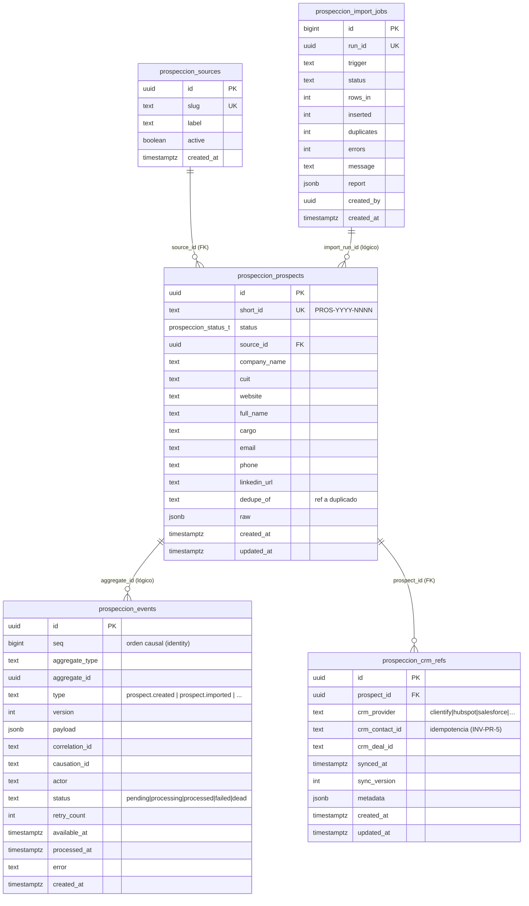

# Constitución Arquitectónica de la Plataforma Comercial de Nexus

## PARTE III — PERSISTENCIA (DDL · DTOs · RPC · RLS · RBAC)

> **Bounded context:** `prospeccion`. **Tono:** normativo (reglas y contratos: **DEBE** / **NO DEBE** / **PROHIBIDO**).
> **Alcance:** la capa de persistencia del context — esquema Postgres, contratos de datos (DTO/Row), funciones (RPC), políticas de fila (RLS) y semilla de permisos (RBAC).
> **No-fantasy.** Este capítulo **documenta DDL**; **NO** lo aplica. Toda sentencia es literal y está pensada para ser idempotente y clonar la sintaxis ya verificada en producción (`arsksytgdnzukbmfgkju`). Las citas `file:line` apuntan a migraciones reales del repo (`supabase/migrations/`) que son los moldes idiomáticos elevados a norma aquí. Al 2026-06-25 **no existe** ninguna tabla `prospeccion_*` ni la migración 0088: lo que sigue es **objetivo de diseño con DDL definitivo**, no estado actual.
> **Premisa de entorno.** Prod (`arsksytgdnzukbmfgkju`) es el único entorno de Nexus; el registro de migraciones está drifteado, por lo que **la verdad es el catálogo de Postgres** (tablas/funciones/enums reales), no `supabase_migrations`. Próximo número de migración libre verificado: **0088**.

---

## Sección 0 — Hechos de prod sobre los que se construye (verdad base)

Antes de una sola línea de DDL, se fija la verdad operativa contra la que el esquema **DEBE** ser coherente. Estos hechos fueron verificados en el catálogo de prod y **gobiernan** todo lo que sigue:

| Hecho de prod (catálogo) | Consecuencia normativa para `prospeccion` |
|---|---|
| `permission_module_t` **NO** contiene `'prospeccion'`; `'comercial'` **sí** existe (`0009_rbac.sql:17-27`). | El valor de enum se agrega en 0088 (migración propia, ver §2.1). |
| `user_role_t = {admin, operaciones, supervisor, cliente}`; **NO** existe `'comercial'` como `user_role_t`. | Las RLS de columnas legacy usan `public.current_role()` solo con esos 4 valores; el equipo comercial opera como `operaciones` (misma convención que `0085_clientify_dashboard.sql:183-191`). El RBAC fino se hace con `has_permission()`. |
| `permission_action_t = {view, create, edit, delete, sign, export, admin}`; **NO** existe `'sync'` (`0009_rbac.sql:30-40`). | En F0 los permisos de `prospeccion` usan SOLO `view/create/edit/delete/admin`. Si en una fase futura se requiere granularidad de sync, será un `add value` separado, nunca una invención de F0. |
| `permissions(id, slug, module, action, label, description, created_at)`, `slug='modulo.action'`, `unique(slug)` y `unique(module,action)` (`0009_rbac.sql:42-51`). | El seed de permisos de F0 respeta exactamente esa forma y el `on conflict (slug) do nothing` de `0087_mi_espacio_permission_and_grant.sql:11`. |
| `role_permissions(role_id, permission_id, created_at)`; seed por JOIN `roles.slug` + `permissions.slug`, `on conflict do nothing` (`0009_rbac.sql:82-87`, `231-289`). | El grant de F0 se hace por slug, como `0087:13-19`. |
| Roles reales (slugs): `admin, comercial, director_ops, operaciones, compliance, seguridad, cliente_b2b, rrhh_admin, rrhh_manager, rrhh_viewer, employee_self_service`. | El grant apunta a `comercial` y `director_ops` (operación del módulo), `operaciones` (lectura) y `admin` (admin). El rol `comercial` **sí** existe como fila de `roles` (distinto de `user_role_t`). |
| Funciones de prod: `has_permission(p_slug text)→boolean` (INVOKER), `is_admin()→boolean` (DEFINER), `current_role()→user_role_t` (DEFINER), `tg_touch_updated_at()→trigger`, `crm_ingest_lead(jsonb,jsonb,text)→jsonb` (DEFINER). | Se reutilizan tal cual; **PROHIBIDO** redefinirlas en esta migración. |
| **RBAC dormido** (`user_roles` tiene 1 fila) → el enforcement per-user casi no aplica. | La **RLS es la frontera real**. Por eso las tablas `prospeccion_*` con PII **NUNCA** llevan `using (true)` de escritura, y el Outbox/jobs no exponen política a `anon`/`authenticated`. |

| Plantilla normativa (Sección 0) | |
|---|---|
| **Objetivo** | Anclar el esquema a la verdad del catálogo de prod, no al registro de migraciones drifteado. |
| **Alcance** | Enums, funciones y roles preexistentes que el DDL de F0 reutiliza o extiende. |
| **Decisiones tomadas** | Reusar `has_permission/is_admin/current_role/tg_touch_updated_at`; extender `permission_module_t` con `'prospeccion'`; limitarse a acciones existentes. |
| **Decisiones descartadas** | (a) Crear un `user_role_t = 'comercial'` — descartado: no existe en prod y rompería `current_role()`. (b) Crear acción `'sync'` en F0 — descartado: fuera de alcance. (c) Confiar en `supabase_migrations` — descartado: drifteado. |
| **Justificación** | El charter establece que las tablas/funciones son la verdad; alinear el DDL a ellas elimina invención. |
| **Riesgos** | Que un futuro `add value` de enum se intente dentro de la misma transacción que lo usa (error de Postgres). Mitigación: §2.1 lo separa en su propia migración. |
| **Impacto sobre la arquitectura** | Define qué se reutiliza vs. qué se crea; subordina el DDL nuevo al contrato RBAC/RLS existente. |

---

## Sección 1 — Modelo de datos completo del módulo (con subconjunto F0 marcado)

### Objetivo
Presentar el **modelo de datos completo** previsto para `prospeccion` (todas las tablas futuras), marcando con claridad el **subconjunto que se implementa en F0**. El resto es backlog declarado, no deuda oculta.

### Alcance
Todas las tablas `prospeccion_*` del context. La frontera Prospección→CRM (`crm_*`) **NO** se redefine acá: se delega en el Write-Path existente (`crm_promote_lead` → `crm_advance_stage`), conforme a `15-event-storming.md:286-292`.

### Convención de naming (normativa)
- **DEBE** prefijarse toda tabla del context con `prospeccion_` (espejo de `crm_*`, `clientify_*`).
- **DEBE** usarse `id uuid primary key default gen_random_uuid()`, `created_at/updated_at timestamptz not null default now()` y el trigger `public.tg_touch_updated_at()` en `updated_at` (convención 0082/0085, `0085_clientify_dashboard.sql:9-12, 101-105`).
- Las tablas append-only (Outbox, jobs) **PUEDEN** usar `bigserial` o `uuid` según corresponda al patrón de `*_sync_log` (`0085:84-85`).

> **CC-6 (ARB 2026-06-25):** IDs de CRM externo NUNCA en `prospeccion_prospects`. Viven en `prospeccion_crm_refs(crm_provider, crm_contact_id, crm_deal_id)`. Los campos `clientify_contact_id` y `clientify_deal_id` fueron ELIMINADOS de la tabla raíz. Violación = rechazo en Architecture Review.

### 1.1 Catálogo completo de tablas (presente y futuro)

| Tabla | Rol en el dominio | Fase | Append-only | PII |
|---|---|---|---|---|
| `prospeccion_sources` | Catálogo de orígenes (linkedin, csv, manual, paste, api, webhook). VO `SourceSlug` (`20-parte-II-dominio.md:80`). | **F0** | no | no |
| `prospeccion_prospects` | Fila materializada del Aggregate Root `Prospect` (estado + identidad). Espejo de `crm_leads` (`15-event-storming.md:86-89`). | **F0** | no | **sí** |
| `prospeccion_events` | **Outbox** append-only: materialización de los 9 Domain Events (`15-event-storming.md:45-53`). Fuente de verdad de eventos. La DLQ es un **estado** (`status='dead'`), no una tabla aparte. | **F0** | **sí** | parcial (payload) |
| `prospeccion_import_jobs` | Bitácora de corridas de import/worker, incluido enrichment (shape `*_sync_log`, `0085:82-99`). | **F0** | sí | no |
| `prospeccion_event_consumers` | Dedup de consumo `(event_id, consumer_name)` — Inbox Pattern (EVT-4) que garantiza idempotencia del Dispatcher. | **F2** | sí | no |
| `prospeccion_human_decisions` | `HumanDecision` inmutable (approved/rejected, actor, nota, INV-PR-4). Entregable del gate humano. | **F1** | sí | no |
| `prospeccion_enrichment` | `EnrichmentSnapshot` por prospecto+proveedor (Entity, `20-parte-II-dominio.md:59`). Foto inmutable. | **F2** | sí | parcial |
| `prospeccion_scores` | `ScoreCalculated` materializado (Score 0..100 determinista, `20-parte-II-dominio.md:76`). | **F3** | sí | no |
| `prospeccion_ai_content` | `AIAnalysis` (summary/fit/ConfidenceScore, `20-parte-II-dominio.md:60`). Salida IA redactada. | **F4** | sí | parcial |
| `prospeccion_crm_refs` | `CrmRef` **provider-agnostic** (`crm_provider`, `crm_contact_id`, `crm_deal_id`, status, synced_at; INV-PR-5 idempotencia). | **F0** (tabla, 0089) · F5 (escritura) | no | no |
| `prospeccion_metrics` | Agregados/contadores para tableros (deriva de eventos; espejo de snapshots, `0085:60-80`). | **F6** | sí | no |
| `prospeccion_timeline` | Read Model de actividad por prospecto (proyección, no fuente de verdad). | **F6** | sí | parcial |
| `prospeccion_activities` | Tareas/acciones comerciales sobre un prospecto (llamadas, mails). | **F6** | no | parcial |
| `prospeccion_notes` | Notas libres por prospecto (comercial). | **F6** | sí | parcial |

> **Frontera explícita.** `prospeccion_crm_refs` y `prospeccion_human_decisions` se documentan como tablas propias, pero su escritura **DEBE** seguir la regla DEFINER/INVOKER de `15-event-storming.md:294-306`. La promoción a cliente **NO** crea CRM nativo acá: cruza a `crm_*` (`crm_promote_lead`).

> **Reconciliación de fases (ROAD-001 / ADR-015).** La columna **Fase** de este catálogo es la **fuente de verdad única** del mapeo tabla→fase y está **alineada con los entregables del Roadmap** (`60-partes-IV-V-quality-roadmap.md` Cap. 4): `human_decisions`=F1 (gate humano), `enrichment`=F2, `scores`=F3, `ai_content`=F4, `crm_refs`=**F0** (tabla creada en 0089 por ARB C-3; escritura recién en F5), `metrics`/`timeline`/`activities`/`notes`=F6 (visibilidad/workspace comercial). Las tablas `timeline`/`activities`/`notes` no figuran como entregable nominal en el roadmap por ser soporte de lectura/actividad del workspace comercial (disponibles desde F6, fuera del path F0–F5). **Ninguna tabla queda asignada a una fase que el roadmap contradiga.**

### 1.2 Subconjunto de F0 (lo único que crea 0089)

```
F0 = { prospeccion_sources, prospeccion_prospects, prospeccion_events,
       prospeccion_import_jobs, prospeccion_crm_refs }
   + enum prospeccion_status_t
   + RPC prospeccion_ingest(jsonb, text)
```

> `prospeccion_crm_refs` se crea en 0089 (adelantada de F1 a F0 por ARB C-3, provider-agnostic, CC-6) pero queda **vacía y de solo-lectura** hasta F5: ninguna ingesta F0 la escribe. Su presencia en F0 garantiza que el schema raíz sea provider-agnostic desde el día 1 (los IDs de CRM nunca viven en `prospeccion_prospects`).

F0 cubre exactamente los pasos **1 (`ProspectCreated`) y 2 (`ProspectImported`)** del event storming (`15-event-storming.md:95-96`): ingestar, deduplicar, materializar el prospecto y **emitir los eventos al Outbox**. Enriquecimiento, score, IA, decisión humana y sync (pasos 3–9) **NO** se implementan en F0; sus eventos ya tienen lugar reservado en `prospeccion_events` (el enum de tipo de evento es texto libre versionado, no un enum cerrado, para no bloquear fases futuras).

### 1.3 Diagrama ER (Mermaid) — F0 sólido, futuro punteado



> **Lectura del ER.** Las **cinco** entidades sólidas son F0 (`sources`, `prospects`, `events`, `import_jobs` y `crm_refs` — esta última adelantada de F1 a F0 por ARB C-3; la **crea** 0089 pero solo se **escribe** desde F5). La relación `prospeccion_prospects → prospeccion_events` es **lógica** (por `aggregate_id`), **sin FK física**: un Outbox append-only no se acopla por FK al agregado (permite replay y retención independiente). `prospeccion_crm_refs` sí tiene FK física a `prospeccion_prospects` (`on delete cascade`). Las tablas de fases posteriores (§1.1) cuelgan de `prospeccion_prospects` por `prospect_id` y se omiten del diagrama para no inducir a creerlas existentes.

| Plantilla normativa (Sección 1) | |
|---|---|
| **Objetivo** | Fijar el modelo completo y aislar el subconjunto mínimo viable de F0. |
| **Alcance** | Todas las tablas `prospeccion_*`; F0 = 5 tablas (`sources`, `prospects`, `events`, `import_jobs`, `crm_refs`) + 1 enum + 1 RPC. |
| **Decisiones tomadas** | Outbox sin FK física al agregado; `type` de evento como texto versionado (no enum cerrado); naming `prospeccion_*`; PII marcada por tabla. |
| **Decisiones descartadas** | (a) Implementar enrichment/score/IA en F0 — descartado por alcance. (b) FK física Outbox→prospects — descartado (rompe replay/retención). (c) Enum cerrado de tipos de evento — descartado (bloquearía fases futuras). |
| **Justificación** | F0 entrega el valor central (ingesta + Outbox) sin sobre-construir; el resto queda declarado y trazable. |
| **Riesgos** | Que se adelante DDL de fases futuras "porque ya está pensado". Mitigación: 0089 crea SOLO el subconjunto F0. |
| **Impacto sobre la arquitectura** | Define el contrato físico que los adapters de repositorio y Outbox (`20-parte-II-dominio.md:286-302`) implementan. |

---

## Sección 2 — DDL definitivo literal de F0 (idempotente)

> Tres migraciones. **0088** agrega el valor de enum (sola, por la restricción de Postgres). **0089** crea el núcleo (tablas, RLS, trigger, RPC, seed RBAC). **0091** es el rollback espejo. Todo idempotente. **PROHIBIDO** aplicar sin gate de aprobación: este capítulo documenta, no migra.

### 2.1 `0088_prospeccion_module_enum.sql` — agrega el valor de enum (migración propia)

**Por qué va sola.** Postgres **no permite usar** un valor de enum recién agregado dentro de la misma transacción que lo agrega. La migración 0089 **usa** `'prospeccion'` (en el seed de `permissions(module=...)`), por lo que el `add value` **DEBE** vivir en una migración/transacción anterior y separada. Es exactamente la lección documentada en el molde `0086_mi_espacio_module_enum.sql:9-12` (separó el `add value` de su uso en 0087).

```sql
-- 0088 — Agrega el valor 'prospeccion' al enum permission_module_t.
--
-- CONTEXTO: en prod el enum permission_module_t NO incluye 'prospeccion' (sí 'comercial').
-- El módulo de Prospección Inteligente necesita su propio módulo de permisos para que el
-- guard RBAC de /comercial/prospeccion pueda evaluar prospeccion.* (view/create/edit/delete/admin).
--
-- IMPORTANTE: este ALTER va en su propia migración/transacción. Postgres no permite USAR un
-- valor de enum recién agregado dentro de la misma transacción → la creación de los permisos
-- y los grants viven en 0089 (molde idéntico: 0086 → 0087 de mi_espacio).
alter type public.permission_module_t add value if not exists 'prospeccion';

-- PostgREST: refrescar el caché de esquema para que el nuevo valor de enum sea visible vía API.
select pg_notify('pgrst', 'reload schema');
```

> Nota de estilo: el molde 0085 cierra con `notify pgrst, 'reload schema';` (`0085:193`). Aquí se usa la forma funcional equivalente `select pg_notify('pgrst','reload schema');` porque una migración que solo contiene un `alter type ... add value` corre fuera de un bloque transaccional explícito y `pg_notify(...)` es la forma robusta de emitirlo como sentencia independiente. Ambas formas son semánticamente equivalentes.

### 2.2 `0089_prospeccion_core.sql` — núcleo F0 (tablas + RLS + trigger + RPC + seed RBAC)

```sql
-- =========================================================================
-- 0089_prospeccion_core — Prospección Inteligente F0 · Núcleo de persistencia
-- =========================================================================
-- Implementa el subconjunto F0 del context `prospeccion` (LinkedIn → Nexus → Clientify;
-- NADA va directo a Clientify): catálogo de orígenes, fila materializada del Aggregate
-- Root Prospect, Outbox append-only de Domain Events e ingesta idempotente con dedup.
-- Cubre los pasos 1 (ProspectCreated) y 2 (ProspectImported) del event storming.
--
-- 100% ADITIVA · IDEMPOTENTE. Convenciones (0009/0082/0085):
--   id uuid default gen_random_uuid(); created_at/updated_at default now();
--   trigger public.tg_touch_updated_at() en updated_at; RLS con public.has_permission()
--   y public.is_admin() (RBAC fino, RBAC dormido → la RLS es la frontera real);
--   RPC security definer + search_path fijo; revoke from public/anon/authenticated +
--   grant a service_role; seed RBAC por slug con on conflict do nothing.
--
-- DEPENDE de: permission_module_t con valor 'prospeccion' (0088), permissions/roles/
--   role_permissions (0009), helpers has_permission/is_admin (0009), tg_touch_updated_at (0005).
-- =========================================================================

-- ---- Enum de estado del Prospect (los 9+ estados de la máquina) ----------
-- Espejo de la máquina de estados del event storming (15-event-storming.md:272-284).
-- 'raw' = recién capturado pre-normalización; 'imported' = normalizado; etapas
-- siguientes reservadas para F1+ (el Outbox ya las soporta como eventos).
do $$ begin
  create type public.prospeccion_status_t as enum (
    'raw',
    'imported',
    'enriquecido',
    'scoreado',
    'con_ia',
    'aprobado',
    'sincronizado',
    'cliente_creado',
    'rechazado',
    'duplicado'
  );
exception when duplicate_object then null; end $$;

-- ---- (A) Catálogo de orígenes (SourceSlug) ------------------------------
create table if not exists public.prospeccion_sources (
  id          uuid primary key default gen_random_uuid(),
  slug        text not null unique,                 -- VO SourceSlug (enum cerrado a nivel dominio)
  label       text not null,
  active      boolean not null default true,
  created_at  timestamptz not null default now()
);

insert into public.prospeccion_sources (slug, label) values
  ('linkedin_sales_navigator', 'LinkedIn Sales Navigator'),
  ('csv',                      'Importación CSV'),
  ('manual',                  'Carga manual'),
  ('paste',                   'Pegado (paste)'),
  ('api',                     'API / integración'),
  ('webhook',                 'Webhook entrante')
on conflict (slug) do nothing;

-- ---- Secuencia + trigger para short_id legible PROS-YYYY-NNNN -------------
-- Patrón de id público legible (espejo de los public_id del CRM). La secuencia es
-- global (no por año); el año se toma del momento de inserción. NNNN con padding a 4.
create sequence if not exists public.prospeccion_prospect_seq;

-- ---- (B) Prospect (fila materializada del Aggregate Root) ----------------
create table if not exists public.prospeccion_prospects (
  id                   uuid primary key default gen_random_uuid(),
  short_id             text unique,                 -- PROS-YYYY-NNNN (lo pone el trigger)
  status               public.prospeccion_status_t not null default 'raw',
  source_id            uuid references public.prospeccion_sources(id) on delete set null,
  -- Identidad de empresa / contacto (DTO canónico, ver Sección 3)
  company_name         text,
  cuit                 text,                         -- guardado tal cual; clave de CUENTA, no de dedup de persona
  website              text,
  full_name            text,
  cargo                text,
  email                text,                         -- normalizado (lower/trim) en la RPC
  phone                text,                         -- normalizado (solo dígitos) en la RPC
  linkedin_url         text,
  -- Trazabilidad de duplicado (regla "crear y marcar", nunca mergear).
  dedupe_of            uuid references public.prospeccion_prospects(id) on delete set null,
  raw                  jsonb not null default '{}'::jsonb,
  created_at           timestamptz not null default now(),
  updated_at           timestamptz not null default now()
);

-- Índices de dedup (case-insensitive donde aplica) y de consulta.
create index if not exists prospeccion_prospects_email_idx        on public.prospeccion_prospects (lower(email));
create index if not exists prospeccion_prospects_cuit_idx         on public.prospeccion_prospects (cuit);
create index if not exists prospeccion_prospects_linkedin_idx     on public.prospeccion_prospects (linkedin_url);
create index if not exists prospeccion_prospects_status_idx       on public.prospeccion_prospects (status, created_at desc);  -- bandeja: filtra por estado, ordena por fecha (CONS-C1: definición única, sin duplicado)
create index if not exists prospeccion_prospects_source_idx       on public.prospeccion_prospects (source_id);
-- ---- short_id: secuencia + trigger BEFORE INSERT -------------------------
create or replace function public.prospeccion_set_short_id()
returns trigger
language plpgsql
as $$
begin
  if new.short_id is null then
    new.short_id := 'PROS-' || to_char(now(), 'YYYY') || '-' ||
                    lpad(nextval('public.prospeccion_prospect_seq')::text, 4, '0');
  end if;
  return new;
end $$;

drop trigger if exists trg_prospeccion_prospects_short_id on public.prospeccion_prospects;
create trigger trg_prospeccion_prospects_short_id
  before insert on public.prospeccion_prospects
  for each row execute function public.prospeccion_set_short_id();

-- ---- updated_at (usa public.tg_touch_updated_at() de 0005) ---------------
drop trigger if exists trg_prospeccion_prospects_touch on public.prospeccion_prospects;
create trigger trg_prospeccion_prospects_touch
  before update on public.prospeccion_prospects
  for each row execute function public.tg_touch_updated_at();

-- ---- (C) Outbox append-only de Domain Events -----------------------------
-- Materialización física de los 9 eventos (Transactional Outbox). Append-only:
-- sin policy de update/delete para anon/authenticated; lo escribe la RPC (DEFINER)
-- y lo consume el worker (service_role). type es texto versionado, no enum cerrado.
create table if not exists public.prospeccion_events (
  id             uuid primary key default gen_random_uuid(),
  seq            bigint generated always as identity, -- orden causal TOTAL de emisión (CONS-C1/DM-004): id uuid no es monotónico y created_at colisiona en inserciones del mismo lote
  aggregate_type text not null default 'prospect',
  aggregate_id   uuid not null,                      -- = prospeccion_prospects.id (relación lógica)
  type           text not null,                      -- 'prospect.created' | 'prospect.imported' | ...
  version        int not null default 1,
  payload        jsonb not null default '{}'::jsonb,
  correlation_id text,
  causation_id   text,
  actor          text,                               -- 'system:ingest' | uuid del usuario | etc.
  status         text not null default 'pending'
                   check (status in ('pending','processing','processed','failed','dead')),
  retry_count    int not null default 0,
  available_at   timestamptz not null default now(),
  processed_at   timestamptz,
  error          text,
  created_at     timestamptz not null default now()
);
-- Cola del worker: índice parcial sobre eventos ACCIONABLES, ordenado por disponibilidad y
-- secuencia de emisión. Sustituye el viejo (status, available_at) y absorbe el rol del
-- bloque "ARB C-2" duplicado que referenciaba next_attempt_at/seq inexistentes (CONS-C1).
create index if not exists prospeccion_events_dispatch_idx
  on public.prospeccion_events (available_at, seq)
  where status in ('pending', 'failed');
-- Orden causal por agregado (replay determinista): usa seq, NO created_at (CONS-C1/DM-004).
create index if not exists prospeccion_events_aggregate_idx
  on public.prospeccion_events (aggregate_id, seq);

-- ---- (D) Bitácora de corridas de import (shape *_sync_log) ----------------
create table if not exists public.prospeccion_import_jobs (
  id          bigserial primary key,
  run_id      uuid not null unique default gen_random_uuid(),
  trigger     text not null check (trigger in ('cron','manual','api')),
  status      text not null check (status in ('running','completed','partial','error','skipped')),
  rows_in     int not null default 0,
  inserted    int not null default 0,
  duplicates  int not null default 0,
  errors      int not null default 0,
  message     text,
  report      jsonb,
  created_by  uuid references auth.users(id) on delete set null,
  created_at  timestamptz not null default now()
);
create index if not exists prospeccion_import_jobs_created_idx
  on public.prospeccion_import_jobs (created_at desc);

-- ---- (E) Tabla CRM refs provider-agnostic — adelantada F1→F0 (ARB C-3 2026-06-25) -----
-- Tabla CRM refs provider-agnostic — adelantada F1→F0 (ARB C-3 2026-06-25)
create table if not exists public.prospeccion_crm_refs (
  id              uuid        primary key default gen_random_uuid(),
  prospect_id     uuid        not null references public.prospeccion_prospects(id) on delete cascade,
  crm_provider    text        not null,   -- 'clientify' | 'hubspot' | 'salesforce' | …
  crm_contact_id  text,
  crm_deal_id     text,
  synced_at       timestamptz not null default now(),
  sync_version    integer     not null default 1,
  metadata        jsonb       not null default '{}',
  created_at      timestamptz not null default now(),
  updated_at      timestamptz not null default now(),   -- DM-006: convención normativa (faltaba)
  unique(prospect_id, crm_provider)
);
alter table public.prospeccion_crm_refs enable row level security;

-- updated_at de crm_refs (convención 0082/0085; DM-006 — la tabla se adelantó a F0 por ARB C-3).
drop trigger if exists trg_prospeccion_crm_refs_touch on public.prospeccion_crm_refs;
create trigger trg_prospeccion_crm_refs_touch
  before update on public.prospeccion_crm_refs
  for each row execute function public.tg_touch_updated_at();

-- Índices de prospeccion_crm_refs. (Los índices de prospeccion_events y prospeccion_prospects
--  se definen junto a su tabla, arriba; el viejo bloque "ARB C-2" se eliminó porque duplicaba
--  nombres y referenciaba columnas inexistentes next_attempt_at/seq → CONS-C1.)
create index if not exists prospeccion_crm_refs_prospect_idx
  on public.prospeccion_crm_refs (prospect_id);

create index if not exists prospeccion_crm_refs_provider_idx
  on public.prospeccion_crm_refs (crm_provider, crm_contact_id)
  where crm_contact_id is not null;

-- =========================================================================
-- RLS — RBAC dormido → la RLS es la frontera real. Tablas con PII NUNCA using(true).
-- =========================================================================
alter table public.prospeccion_sources      enable row level security;
alter table public.prospeccion_prospects    enable row level security;
alter table public.prospeccion_events       enable row level security;
alter table public.prospeccion_import_jobs  enable row level security;

-- ---- sources: lectura por permiso view; escritura por edit; borrado admin --
drop policy if exists "prospeccion_sources select" on public.prospeccion_sources;
create policy "prospeccion_sources select" on public.prospeccion_sources
  for select to authenticated
  using (public.has_permission('prospeccion.view'));

drop policy if exists "prospeccion_sources insert" on public.prospeccion_sources;
create policy "prospeccion_sources insert" on public.prospeccion_sources
  for insert to authenticated
  with check (public.has_permission('prospeccion.create'));

drop policy if exists "prospeccion_sources update" on public.prospeccion_sources;
create policy "prospeccion_sources update" on public.prospeccion_sources
  for update to authenticated
  using (public.has_permission('prospeccion.edit'))
  with check (public.has_permission('prospeccion.edit'));

drop policy if exists "prospeccion_sources delete" on public.prospeccion_sources;
create policy "prospeccion_sources delete" on public.prospeccion_sources
  for delete to authenticated
  using (public.is_admin());

-- ---- prospects (PII): select=view, insert=create, update=edit, delete=is_admin() --
-- NUNCA using(true): contiene email/phone/cuit/linkedin (PII). El permiso es la frontera.
drop policy if exists "prospeccion_prospects select" on public.prospeccion_prospects;
create policy "prospeccion_prospects select" on public.prospeccion_prospects
  for select to authenticated
  using (public.has_permission('prospeccion.view'));

drop policy if exists "prospeccion_prospects insert" on public.prospeccion_prospects;
create policy "prospeccion_prospects insert" on public.prospeccion_prospects
  for insert to authenticated
  with check (public.has_permission('prospeccion.create'));

drop policy if exists "prospeccion_prospects update" on public.prospeccion_prospects;
create policy "prospeccion_prospects update" on public.prospeccion_prospects
  for update to authenticated
  using (public.has_permission('prospeccion.edit'))
  with check (public.has_permission('prospeccion.edit'));

drop policy if exists "prospeccion_prospects delete" on public.prospeccion_prospects;
create policy "prospeccion_prospects delete" on public.prospeccion_prospects
  for delete to authenticated
  using (public.is_admin());

-- ---- crm_refs: lectura por permiso view; escritura SOLO service_role/DEFINER (sync F5) -----
-- DM-006: la tabla tiene RLS habilitada (arriba). Sin esta policy, un SELECT autenticado
-- devolvía 0 filas y la UI no podía saber si un prospecto ya fue sincronizado. La escritura
-- la hace la RPC de sync (DEFINER, F5) / service_role; no se expone INSERT/UPDATE a sesión.
drop policy if exists "prospeccion_crm_refs select" on public.prospeccion_crm_refs;
create policy "prospeccion_crm_refs select" on public.prospeccion_crm_refs
  for select to authenticated
  using (public.has_permission('prospeccion.view'));

drop policy if exists "prospeccion_crm_refs delete" on public.prospeccion_crm_refs;
create policy "prospeccion_crm_refs delete" on public.prospeccion_crm_refs
  for delete to authenticated
  using (public.is_admin());

-- ---- events + import_jobs: SOLO service_role -----------------------------
-- El Outbox y la bitácora son superficie de máquina. RLS habilitada y SIN policy
-- para anon/authenticated → quedan cerrados a sesión de usuario. service_role los
-- escribe/consume (bypassa RLS). Las RPC DEFINER también escriben (corren como owner).
-- (Se deja explícito que NO hay policy: el enable + ausencia de policy = deny-all a roles
--  no privilegiados, frontera real con RBAC dormido.)

-- =========================================================================
-- RPC prospeccion_ingest — ingesta idempotente con dedup + Outbox
-- =========================================================================
-- SECURITY DEFINER (tráfico de máquina: cron/worker sin auth.uid()), search_path fijo;
-- es la ÚNICA puerta de escritura masiva. Dedup por cuit / lower(email) / linkedin_url
-- con regla "crear y marcar duplicado" (D-4 de crm_ingest_lead). Por cada fila inserta
-- en el Outbox los eventos 'prospect.created' y 'prospect.imported'. Retorna contadores.
create or replace function public.prospeccion_ingest(
  p_rows   jsonb,
  p_source text
)
returns jsonb
language plpgsql
security definer
set search_path = public, pg_temp
as $$
declare
  v_source_id   uuid;
  r             jsonb;
  v_company     text;
  v_cuit        text;
  v_website     text;
  v_full_name   text;
  v_cargo       text;
  v_email       text;
  v_phone       text;
  v_linkedin    text;
  v_raw         jsonb;
  v_match_id    uuid;
  v_is_dup      boolean;
  v_status      public.prospeccion_status_t;
  v_prospect    public.prospeccion_prospects;
  v_corr        uuid;   -- correlation_id por prospecto (EVT-4 OBLIGATORIO)
  v_created_eid uuid;   -- id del evento 'created' → causation_id del 'imported'
  v_inserted    int := 0;
  v_duplicates  int := 0;
begin
  -- Resolución del origen (catálogo). Origen desconocido → error permanente.
  select id into v_source_id from public.prospeccion_sources where slug = p_source;
  if v_source_id is null then
    raise exception 'UNKNOWN_SOURCE: origen % no existe en prospeccion_sources', p_source
      using errcode = 'check_violation';
  end if;

  if p_rows is null or jsonb_typeof(p_rows) <> 'array' then
    raise exception 'INVALID_ROWS: p_rows debe ser un array jsonb'
      using errcode = 'check_violation';
  end if;

  for r in select * from jsonb_array_elements(p_rows)
  loop
    -- ── Extracción + normalización (espejo de crm_ingest_lead) ────────────
    v_company   := nullif(trim(r->>'company_name'), '');
    v_cuit      := nullif(trim(r->>'cuit'), '');
    v_website   := nullif(lower(trim(r->>'website')), '');
    v_full_name := nullif(trim(r->>'full_name'), '');
    v_cargo     := nullif(trim(r->>'cargo'), '');
    v_email     := lower(nullif(trim(r->>'email'), ''));
    v_phone     := nullif(regexp_replace(coalesce(r->>'phone',''), '\D', '', 'g'), '');
    v_linkedin  := nullif(lower(trim(r->>'linkedin_url')), '');
    v_raw       := coalesce(r->'raw', r);

    -- ── Dedup: cuit → lower(email) → linkedin_url ─────────────────────────
    -- (CUIT es clave de CUENTA; acá se usa como una de las señales de dedup de fila
    --  de import, conforme a la cadena pedida para F0; persona fina se afina en fases
    --  siguientes con email/phone.)
    v_match_id := null;
    if v_cuit is not null then
      select id into v_match_id from public.prospeccion_prospects
       where cuit = v_cuit and dedupe_of is null limit 1;
    end if;
    if v_match_id is null and v_email is not null then
      select id into v_match_id from public.prospeccion_prospects
       where lower(email) = v_email and dedupe_of is null limit 1;
    end if;
    if v_match_id is null and v_linkedin is not null then
      select id into v_match_id from public.prospeccion_prospects
       where linkedin_url = v_linkedin and dedupe_of is null limit 1;
    end if;

    v_is_dup := v_match_id is not null;
    -- "Crear y marcar": el duplicado SE CREA (no se descarta), con status 'duplicado'
    -- y dedupe_of apuntando al original. NUNCA se mergea en F0.
    v_status := case when v_is_dup then 'duplicado'::public.prospeccion_status_t
                                   else 'imported'::public.prospeccion_status_t end;

    insert into public.prospeccion_prospects
      (status, source_id, company_name, cuit, website, full_name, cargo,
       email, phone, linkedin_url, dedupe_of, raw)
    values
      (v_status, v_source_id, v_company, v_cuit, v_website, v_full_name, v_cargo,
       v_email, v_phone, v_linkedin, v_match_id, v_raw)
    returning * into v_prospect;

    if v_is_dup then
      v_duplicates := v_duplicates + 1;
    else
      v_inserted := v_inserted + 1;
    end if;

    -- ── Outbox: evento 1 (created) + evento 2 (imported) por fila ─────────
    -- E-2: emisión atómica en la misma transacción que el agregado.
    -- EVT-4 (OBLIGATORIO): correlation_id agrupa la cadena causal del prospecto; el 'imported'
    -- lleva causation_id = id del 'created'. Se insertan en dos pasos para capturar ese id.
    v_corr := gen_random_uuid();
    insert into public.prospeccion_events
      (aggregate_id, type, version, payload, actor, correlation_id, causation_id)
    values
      (v_prospect.id, 'prospect.created', 1,
       jsonb_build_object('source', p_source, 'short_id', v_prospect.short_id),
       'system:ingest', v_corr::text, null)
    returning id into v_created_eid;

    insert into public.prospeccion_events
      (aggregate_id, type, version, payload, actor, correlation_id, causation_id)
    values
      (v_prospect.id, 'prospect.imported', 1,
       jsonb_build_object('source', p_source, 'is_duplicate', v_is_dup,
                          'dedupe_of', v_match_id, 'status', v_status),
       'system:ingest', v_corr::text, v_created_eid::text);
  end loop;

  return jsonb_build_object(
    'inserted',   v_inserted,
    'duplicates', v_duplicates
  );
end;
$$;

-- ---- Grants: SOLO service_role (superficie de máquina, bypassa RLS por DEFINER) --
revoke all on function public.prospeccion_ingest(jsonb, text) from public, anon, authenticated;
grant execute on function public.prospeccion_ingest(jsonb, text) to service_role;

-- =========================================================================
-- Seed RBAC — permisos prospeccion.* + grants por slug (idempotente)
-- =========================================================================
-- Acciones F0: SOLO view/create/edit/delete/admin (permission_action_t NO tiene 'sync').
insert into public.permissions (slug, module, action, label, description) values
  ('prospeccion.view',   'prospeccion', 'view',   'Ver prospectos',            'Acceso lectura al pipeline de Prospección Inteligente'),
  ('prospeccion.create', 'prospeccion', 'create', 'Crear / importar prospectos','Ingesta y alta de prospectos'),
  ('prospeccion.edit',   'prospeccion', 'edit',   'Editar prospectos',          'Modificar datos de un prospecto'),
  ('prospeccion.delete', 'prospeccion', 'delete', 'Eliminar prospectos',        'Baja de prospectos (admin)'),
  ('prospeccion.admin',  'prospeccion', 'admin',  'Administrar Prospección',     'Gestión total del módulo Prospección')
on conflict (slug) do nothing;

-- Grant por slug (roles.slug + permissions.slug), on conflict do nothing (molde 0087:13-19).
-- comercial + director_ops: operación completa (view/create/edit/delete).
insert into public.role_permissions (role_id, permission_id)
select ro.id, p.id
from public.roles ro
join public.permissions p
  on p.slug in ('prospeccion.view','prospeccion.create','prospeccion.edit','prospeccion.delete')
where ro.slug in ('comercial','director_ops')
on conflict do nothing;

-- operaciones: solo lectura.
insert into public.role_permissions (role_id, permission_id)
select ro.id, p.id
from public.roles ro
join public.permissions p on p.slug = 'prospeccion.view'
where ro.slug = 'operaciones'
on conflict do nothing;

-- admin: admin del módulo.
insert into public.role_permissions (role_id, permission_id)
select ro.id, p.id
from public.roles ro
join public.permissions p on p.slug = 'prospeccion.admin'
where ro.slug = 'admin'
on conflict do nothing;

-- ---- Cierre: refrescar el caché de esquema de PostgREST -------------------
notify pgrst, 'reload schema';
```

### 2.3 `0091_prospeccion_rollback.sql` — rollback espejo (idempotente)

> Numerado 0091 (no 0090) para dejar 0090 libre a una eventual fase intermedia y porque el rollback se aplica de forma deliberada, fuera de la secuencia normal de avance. **Un valor de enum NO se puede quitar** en Postgres: el rollback elimina objetos y semilla, pero `permission_module_t='prospeccion'` y `prospeccion_status_t` **permanecen** (drop type solo procede si ninguna columna lo usa). Se documenta explícitamente.

```sql
-- =========================================================================
-- 0091_prospeccion_rollback — Rollback espejo de F0 (0088 + 0089)
-- =========================================================================
-- Deshace el núcleo de Prospección F0 de forma idempotente. ADVERTENCIA: destructivo
-- (borra prospectos, eventos y bitácora). Aplicar SOLO con aprobación explícita.
--
-- LIMITACIÓN DE POSTGRES: un valor agregado a un enum (permission_module_t='prospeccion',
-- agregado en 0088) NO se puede quitar. Permanece. El enum prospeccion_status_t SÍ se
-- puede drop-ear una vez que ninguna columna lo referencia (tras drop de prospeccion_prospects).
-- =========================================================================

-- ---- RPC ----------------------------------------------------------------
drop function if exists public.prospeccion_ingest(jsonb, text);

-- ---- Triggers + función de short_id -------------------------------------
drop trigger if exists trg_prospeccion_prospects_touch    on public.prospeccion_prospects;
drop trigger if exists trg_prospeccion_prospects_short_id on public.prospeccion_prospects;
drop trigger if exists trg_prospeccion_crm_refs_touch     on public.prospeccion_crm_refs;
drop function if exists public.prospeccion_set_short_id();

-- ---- Policies (idempotente) ---------------------------------------------
drop policy if exists "prospeccion_sources select"   on public.prospeccion_sources;
drop policy if exists "prospeccion_sources insert"   on public.prospeccion_sources;
drop policy if exists "prospeccion_sources update"   on public.prospeccion_sources;
drop policy if exists "prospeccion_sources delete"   on public.prospeccion_sources;
drop policy if exists "prospeccion_prospects select" on public.prospeccion_prospects;
drop policy if exists "prospeccion_prospects insert" on public.prospeccion_prospects;
drop policy if exists "prospeccion_prospects update" on public.prospeccion_prospects;
drop policy if exists "prospeccion_prospects delete" on public.prospeccion_prospects;
drop policy if exists "prospeccion_crm_refs select"  on public.prospeccion_crm_refs;
drop policy if exists "prospeccion_crm_refs delete"  on public.prospeccion_crm_refs;

-- ---- Tablas (orden por FK; crm_refs→prospects, events/jobs sin FK al resto) ----
drop table if exists public.prospeccion_events;
drop table if exists public.prospeccion_import_jobs;
drop table if exists public.prospeccion_crm_refs;    -- FK a prospects (on delete cascade): se dropea antes
drop table if exists public.prospeccion_prospects;   -- libera prospeccion_status_t y la FK a sources
drop table if exists public.prospeccion_sources;

-- ---- Secuencia ----------------------------------------------------------
drop sequence if exists public.prospeccion_prospect_seq;

-- ---- Enum de estado (ya sin columnas que lo usen) -----------------------
drop type if exists public.prospeccion_status_t;

-- ---- Seed RBAC (borrar role_permissions ANTES que permissions por la FK) -
delete from public.role_permissions rp
using public.permissions p
where rp.permission_id = p.id
  and p.slug in ('prospeccion.view','prospeccion.create','prospeccion.edit',
                 'prospeccion.delete','prospeccion.admin');

delete from public.permissions
where slug in ('prospeccion.view','prospeccion.create','prospeccion.edit',
               'prospeccion.delete','prospeccion.admin');

-- ---- NO se quita el valor de enum permission_module_t='prospeccion' -------
-- Postgres no soporta DROP VALUE en un enum. Queda como huérfano benigno (sin filas
-- en permissions que lo usen tras el delete de arriba). Es inocuo.

notify pgrst, 'reload schema';
```

| Plantilla normativa (Sección 2) | |
|---|---|
| **Objetivo** | Entregar el DDL literal, idempotente y con la sintaxis exacta de prod para los tres pasos (enum, núcleo, rollback). |
| **Alcance** | 0088 (enum), 0089 (tablas + RLS + trigger + RPC + RBAC), 0091 (rollback). |
| **Decisiones tomadas** | `add value` en migración propia; RPC DEFINER `prospeccion_ingest` única puerta; Outbox/jobs sin policy a sesión; permisos F0 sin `sync`; rollback explícito sobre la limitación de enum. |
| **Decisiones descartadas** | (a) `add value` + uso en la misma migración — PROHIBIDO por Postgres. (b) `using(true)` en `prospeccion_prospects` — PROHIBIDO (PII). (c) Abrir el Outbox a `authenticated` — descartado (superficie de máquina). (d) Intentar `drop value` del enum en el rollback — imposible en Postgres. |
| **Justificación** | Clona moldes probados (0085/0086/0087/0048) sin inventar; idempotencia y separación de transacciones evitan los fallos conocidos. |
| **Riesgos** | Drift entre el registro de migraciones y el catálogo (ya existente en prod). Mitigación: la verdad es el catálogo; las migraciones son `if not exists`/`on conflict`. |
| **Impacto sobre la arquitectura** | Es el contrato físico de F0; habilita los adapters de repositorio y Outbox y la frontera RLS/RBAC del módulo. |

---

## Sección 3 — DTOs (contrato de datos)

### Objetivo
Fijar el **DTO canónico** de ingesta (lo que las fuentes LinkedIn/CSV/manual entregan) y los **Row types** TypeScript que reflejan las filas de las tablas F0, para que adapter de repositorio y RPC hablen el mismo lenguaje.

### Alcance
Contrato de entrada de `prospeccion_ingest` y tipos de fila de las 5 tablas F0 (`sources`, `prospects`, `events`, `import_jobs`, `crm_refs`). Los VOs del dominio (`Email`, `Cuit`, etc., `20-parte-II-dominio.md:70-82`) **NO** se serializan crudos: el DTO usa primitivos normalizados y el dominio los eleva a VO vía `create()`.

### 3.1 DTO canónico de ingesta

```ts
/**
 * DTO canónico POR FILA que TODA fuente (linkedin/csv/manual/paste/api/webhook) produce
 * antes de llamar a la RPC prospeccion_ingest. Normalización fina (lower/trim/dígitos)
 * la hace la RPC; el DTO transporta primitivos, nunca VOs ni tipos de proveedor.
 * Espejo del NormalizedLead de clientify/webhook.ts (DTO normalizado, 15-event-storming.md:138).
 *
 * IMPORTANTE: `source` NO es un campo por fila. El origen se pasa UNA vez por lote como
 * parámetro `p_source` de la RPC `prospeccion_ingest(p_rows jsonb, p_source text)` (un import = un
 * origen). Por eso ProspectIngestDTO (las filas de `p_rows`) NO incluye `source`; la llamada es
 * ProspectIngestCall (abajo). Esto reconcilia el DTO con la firma real de la RPC.
 */
export interface ProspectIngestDTO {
  company_name?: string | null;
  cuit?: string | null;              // clave de CUENTA; guardado tal cual, normaliza la RPC
  website?: string | null;
  full_name?: string | null;
  cargo?: string | null;
  email?: string | null;
  phone?: string | null;
  linkedin_url?: string | null;
  raw?: Record<string, unknown>;     // payload crudo del origen (auditoría/replay)
}

/** Llamada de ingesta = lote de filas + origen único. Mapea 1:1 a prospeccion_ingest(p_rows, p_source). */
export interface ProspectIngestCall {
  source: ProspectSourceSlug;        // = p_source (nivel lote): 'linkedin_sales_navigator' | 'csv' | 'manual' | 'paste' | 'api' | 'webhook'
  rows: ProspectIngestDTO[];         // = p_rows
}

export type ProspectSourceSlug =
  | 'linkedin_sales_navigator'
  | 'csv'
  | 'manual'
  | 'paste'
  | 'api'
  | 'webhook';

/** Identidad mínima (15-event-storming.md:157-160): sin al menos una clave de identidad
 *  (linkedin_url | email | phone | cuit), la fila NO produce evento — se descarta como error
 *  permanente. La validación vive en el borde (action/route), no en el dominio. */
```

### 3.2 Row types (espejo 1:1 de las tablas F0)

```ts
export type ProspeccionStatus =
  | 'raw' | 'imported' | 'enriquecido' | 'scoreado' | 'con_ia'
  | 'aprobado' | 'sincronizado' | 'cliente_creado' | 'rechazado' | 'duplicado';

export interface ProspeccionSourceRow {
  id: string;
  slug: ProspectSourceSlug;
  label: string;
  active: boolean;
  created_at: string;                // ISO timestamptz
}

export interface ProspeccionProspectRow {
  id: string;
  short_id: string | null;           // PROS-YYYY-NNNN
  status: ProspeccionStatus;
  source_id: string | null;
  company_name: string | null;
  cuit: string | null;
  website: string | null;
  full_name: string | null;
  cargo: string | null;
  email: string | null;
  phone: string | null;
  linkedin_url: string | null;
  // CC-6: los IDs de CRM externo NO viven aquí — viven en ProspeccionCrmRefRow (provider-agnostic).
  dedupe_of: string | null;          // id del prospecto original si es duplicado
  raw: Record<string, unknown>;
  created_at: string;
  updated_at: string;
}

export type ProspeccionEventStatus =
  | 'pending' | 'processing' | 'processed' | 'failed' | 'dead';

export interface ProspeccionEventRow {
  id: string;
  seq: number;                       // bigint identity — orden causal total de emisión (CONS-C1)
  aggregate_type: string;            // 'prospect'
  aggregate_id: string;              // = ProspeccionProspectRow.id
  type: string;                      // 'prospect.created' | 'prospect.imported' | ...
  version: number;
  payload: Record<string, unknown>;
  correlation_id: string | null;
  causation_id: string | null;
  actor: string | null;
  status: ProspeccionEventStatus;
  retry_count: number;
  available_at: string;
  processed_at: string | null;
  error: string | null;
  created_at: string;
}

export interface ProspeccionImportJobRow {
  id: number;                        // bigserial
  run_id: string;
  trigger: 'cron' | 'manual' | 'api';
  status: 'running' | 'completed' | 'partial' | 'error' | 'skipped';
  rows_in: number;
  inserted: number;
  duplicates: number;
  errors: number;
  message: string | null;
  report: Record<string, unknown> | null;
  created_by: string | null;
  created_at: string;
}

/** crm_refs (provider-agnostic, F0): vínculo idempotente prospecto↔registro CRM. CC-6. */
export interface ProspeccionCrmRefRow {
  id: string;
  prospect_id: string;
  crm_provider: string;              // 'clientify' | 'hubspot' | 'salesforce' | …
  crm_contact_id: string | null;
  crm_deal_id: string | null;
  synced_at: string;
  sync_version: number;
  metadata: Record<string, unknown>;
  created_at: string;
  updated_at: string;
}

/** Resultado de la RPC prospeccion_ingest. */
export interface ProspeccionIngestResult {
  inserted: number;
  duplicates: number;
}
```

| Plantilla normativa (Sección 3) | |
|---|---|
| **Objetivo** | Definir el contrato de datos entre fuentes, RPC y repositorio. |
| **Alcance** | DTO de ingesta + Row types de las 5 tablas F0 + resultado de la RPC. |
| **Decisiones tomadas** | DTO con primitivos normalizados (no VOs); `raw` para replay; Row types 1:1 con las columnas; `ProspectSourceSlug` cerrado. |
| **Decisiones descartadas** | (a) Serializar VOs en el DTO — descartado (el dominio los construye con `create()`). (b) Tipos de proveedor en el DTO — PROHIBIDO (ACL los traduce, `20-parte-II-dominio.md:186`). |
| **Justificación** | Mantiene el borde delgado y el dominio soberano; reusa el patrón `NormalizedLead`. |
| **Riesgos** | Deriva DTO↔columna. Mitigación: generar tipos con `mcp__supabase__generate_typescript_types` al aplicar (no ahora). |
| **Impacto sobre la arquitectura** | Es el lenguaje compartido del adapter de repositorio (`ProspectRepositoryPort`) y la RPC de ingesta. |

---

## Sección 4 — RPC · RLS · RBAC (síntesis de contratos)

### 4.1 RPC (firmas + responsabilidad + DEFINER/INVOKER)

| Función | Firma | Seguridad | Responsabilidad | Grants |
|---|---|---|---|---|
| `prospeccion_ingest` | `(p_rows jsonb, p_source text) → jsonb` | **DEFINER** + `search_path=public,pg_temp` | Única puerta de ingesta masiva: resuelve origen, dedup (cuit→email→linkedin), "crear y marcar duplicado", inserta `prospect.created` + `prospect.imported` en el Outbox, retorna `{inserted,duplicates}`. Tráfico de máquina (sin `auth.uid()`). | `revoke all from public,anon,authenticated`; `grant execute to service_role`. |
| `prospeccion_set_short_id` | `() → trigger` | INVOKER (trigger) | Asigna `PROS-YYYY-NNNN` vía secuencia en BEFORE INSERT. | — (función de trigger). |

**Regla RPC-1 (heredada de `15-event-storming.md:111-114`).** Los pasos automáticos del pipeline corren **DEFINER**; el único paso humano (`approve/reject`, **fase F1** — gate humano, alineado con el roadmap y ROAD-001) correrá **INVOKER** con `changed_by = auth.uid()`, igual que `crm_promote_lead`. En F0 solo existe el paso de máquina (`prospeccion_ingest`), por eso es DEFINER. **PROHIBIDO** hacer DEFINER una futura RPC de aprobación humana.

**Regla RPC-2 (= CS-RPC-2, Parte VI §2.5).** Las RPC de **transición** (F1+: enrich/score/approve/sync) son **persistencia mecánica**: reciben un snapshot ya validado por el AR (TypeScript) y NO contienen reglas de negocio (ni validación de la máquina de estados, ni invariantes, ni scoring) — embeber lógica de dominio en PL/pgSQL invertiría la Regla de Dependencia (AP-1/AP-15) sin que el lint lo detecte. **Excepción acotada y deliberada:** `prospeccion_ingest` (F0) hace normalización + dedup en SQL por performance de ingesta masiva; es la única RPC con lógica de selección embebida y está documentada como tal (la `DeduplicationPolicy` del dominio, Parte II §2.2, es la fuente de verdad conceptual del criterio).

### 4.2 RLS (políticas exactas de F0)

| Tabla | SELECT | INSERT | UPDATE | DELETE | Notas |
|---|---|---|---|---|---|
| `prospeccion_sources` | `has_permission('prospeccion.view')` | `has_permission('prospeccion.create')` | `has_permission('prospeccion.edit')` | `is_admin()` | Catálogo (sin PII). |
| `prospeccion_prospects` | `has_permission('prospeccion.view')` | `has_permission('prospeccion.create')` | `has_permission('prospeccion.edit')` | `is_admin()` | **PII** → nunca `using(true)`. |
| `prospeccion_crm_refs` | `has_permission('prospeccion.view')` | — (service_role/DEFINER) | — (service_role/DEFINER) | `is_admin()` | DM-006: SELECT para que la UI sepa si hubo sync; escritura solo desde la RPC de sync (F5). Sin PII. |
| `prospeccion_events` | — (sin policy) | — (sin policy) | — (sin policy) | — (sin policy) | RLS ON + deny-all a sesión; `service_role`/DEFINER escriben/consumen. |
| `prospeccion_import_jobs` | — (sin policy) | — (sin policy) | — (sin policy) | — (sin policy) | Ídem: superficie de máquina. |

**Regla RLS-1.** Con RBAC dormido, la ausencia de policy + RLS habilitada equivale a deny-all para `anon`/`authenticated`; eso es **deliberado** para Outbox y jobs. **PROHIBIDO** agregarles policy de escritura para roles de sesión.
**Regla RLS-2.** El delete de prospectos exige `is_admin()` (DEFINER, `0009`), no un permiso `delete` cualquiera: el borrado de PII es privilegiado.

### 4.3 RBAC (seed exacto por slug)

| Permiso (slug / module / action / label) | Roles a los que se concede (por `roles.slug`) |
|---|---|
| `prospeccion.view` / `prospeccion` / `view` / "Ver prospectos" | `comercial`, `director_ops`, `operaciones` |
| `prospeccion.create` / `prospeccion` / `create` / "Crear / importar prospectos" | `comercial`, `director_ops` |
| `prospeccion.edit` / `prospeccion` / `edit` / "Editar prospectos" | `comercial`, `director_ops` |
| `prospeccion.delete` / `prospeccion` / `delete` / "Eliminar prospectos" | `comercial`, `director_ops` |
| `prospeccion.admin` / `prospeccion` / `admin` / "Administrar Prospección" | `admin` |

> `admin` además recibe **todo** vía el fallback de `has_permission()` (`... or public.current_role() = 'admin'`, `0009_rbac.sql:174`); el grant explícito de `prospeccion.admin` lo deja visible en la UI de roles. El seed es por JOIN `roles.slug`+`permissions.slug` con `on conflict do nothing` (molde `0087:13-19`), idempotente.

| Plantilla normativa (Sección 4) | |
|---|---|
| **Objetivo** | Consolidar los contratos de RPC, RLS y RBAC de F0 en una vista única y verificable. |
| **Alcance** | `prospeccion_ingest` (+ triggers), 5 tablas y 5 permisos. |
| **Decisiones tomadas** | DEFINER solo para máquina; RLS por `has_permission()`; delete por `is_admin()`; Outbox/jobs deny-all a sesión; seed por slug. |
| **Decisiones descartadas** | (a) RPC de ingesta INVOKER — descartado (no hay `auth.uid()` en cron). (b) `using(true)` en cualquier tabla con PII — PROHIBIDO. (c) Acción `sync` — fuera de F0 (no existe en `permission_action_t`). |
| **Justificación** | Reproduce la frontera de seguridad ya validada en CRM (DEFINER/INVOKER + RLS) sin re-auditar. |
| **Riesgos** | Que el RBAC dormido dé falsa sensación de apertura. Mitigación: la RLS niega por defecto; el enforcement crece cuando se pueblen `user_roles`. |
| **Impacto sobre la arquitectura** | Cierra la Parte III de persistencia: el módulo queda con un contrato físico, de seguridad y de datos completo para construir F0 encima. |

---

> **Cierre del capítulo.** La persistencia de `prospeccion` F0 es **mínima, idempotente y fiel a prod**: cinco tablas (`sources`, `prospects`, `events`, `import_jobs`, `crm_refs` provider-agnostic vacía hasta F5), un enum de estado, el Outbox con `seq` para orden causal, una RPC DEFINER de ingesta con dedup, RLS por permiso (PII jamás `using(true)`) y un seed RBAC por slug. El Outbox queda listo para que las fases F1–F4 cuelguen enrichment, score, IA, decisión humana y sync sin tocar el núcleo. **Nada va directo a Clientify**: la frontera es el evento `customer_created` que delega en el Write-Path CRM existente.
