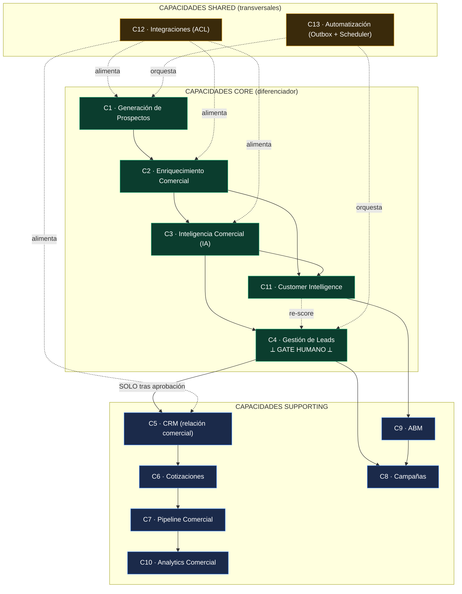

# Constitución Arquitectónica de la Plataforma Comercial de Nexus

## PARTE VII — ENTERPRISE ARCHITECTURE

> **Estado:** normativo · **Vigencia:** 10 años (revisión anual obligatoria) · **Gobierno:** subordinado al Documento Rector [TOPS-NEXUS-ERP.md](../../TOPS-NEXUS-ERP.md) y consistente con las Partes I ([10-parte-I-estrategico.md](./10-parte-I-estrategico.md)), II ([20-parte-II-dominio.md](./20-parte-II-dominio.md)) y el Event Storming ([15-event-storming.md](./15-event-storming.md)).
> **Bounded Context:** `prospeccion` (Prospección Inteligente), primer contexto acotado de la **Plataforma Comercial de Nexus**.
> **Naturaleza del documento:** esta Parte alinea las seis capas de arquitectura empresarial — **negocio ↔ dominio ↔ aplicaciones ↔ datos ↔ integración ↔ tecnología** — bajo una sola constitución. Donde dice **DEBE** la regla es obligatoria; **NO DEBE** es prohibición; **PUEDE** es facultad. Las reglas (R-7.x) son normativas y citables.
> **No-fantasy.** Al 2026-06-25 el directorio `src/lib/prospeccion` está **vacío** (verificado: `ls src/lib/prospeccion/` no devuelve archivos). Toda referencia a `prospeccion_*` es **objetivo de diseño**. Las citas `file:line` a otros módulos son **precedentes reales** del repo que esta Parte VII eleva a norma para el nuevo contexto.

---

### Preámbulo: por qué una Parte de Enterprise Architecture

Las Partes I–II fijaron el **qué** estratégico y el **cómo** táctico. La Parte VII fija el **encaje empresarial**: cómo Prospección se inserta en el mapa de capacidades de negocio de TOPS, qué objetos de información posee, cuál es el modelo canónico al que todo proveedor externo se adapta, cómo se clasifican y contratan las integraciones, qué arquitectura de seguridad y operación rige, y qué partes del sistema permanecen estables por años frente a las que evolucionan.

El principio rector de Enterprise Architecture de esta Constitución es uno: **Nexus es el centro; los externos se adaptan a Nexus, nunca al revés.** El Canonical Data Model (§3) es la encarnación de ese principio, y refuerza la Anti-Corruption Layer ya prescrita en la Parte II (§2.6) y el patrón ACL del Context Map (Parte I, R-3.2.6).

---

## 1. Business Capability Map

### 1.1 Marco

**R-7.1.1.** Una **Capacidad de Negocio** es *qué* hace la organización, con independencia de *cómo* o *con qué herramienta*. Cada capacidad de la Plataforma Comercial **DEBE** clasificarse como **Core** (diferenciador competitivo), **Supporting** (necesaria, no diferenciadora) o **Shared** (transversal, sirve a todas). Esta clasificación hereda y refina la clasificación de subdominios DDD de la Parte I (§2.2): toda capacidad **Core** se apoya en un subdominio **CORE**.

**R-7.1.2.** La inversión arquitectónica (rigor de modelado, tests, aislamiento, observabilidad) **DEBE** ser proporcional a la clasificación: máxima en Core, media en Supporting, estandarizada en Shared.

### 1.2 Catálogo normativo de capacidades

| # | Capacidad de Negocio | Clase | Subdominio (Parte I §2.2) | Depende de | Sustenta a |
|---|----------------------|:-----:|---------------------------|------------|------------|
| C1 | **Generación de Prospectos** | **Core** | Prospección (CORE) | LinkedIn / import (ACL) | C2, C3 |
| C2 | **Enriquecimiento Comercial** | **Core** | Prospección (CORE) | C1, Proveedores Enrichment (ACL) | C3, C4 |
| C3 | **Inteligencia Comercial (IA)** | **Core** | IA-capacidad (CORE) / IA-infra (GENERIC) | C2, Proveedores IA (ACL) | C4, C11 |
| C4 | **Gestión de Leads** | **Core** | Prospección (CORE) | C2, C3, gate humano | C5, C8 |
| C5 | **CRM (relación comercial)** | **Supporting** | CRM (SUPPORTING/GENERIC) | C4, C12 (Clientify) | C6, C7 |
| C6 | **Cotizaciones** | **Supporting** | Comercial (SUPPORTING) | C5, Cliente del ERP | C7 |
| C7 | **Pipeline Comercial** | **Supporting** | Comercial (SUPPORTING) | C5, C6 | C10, C11 |
| C8 | **Campañas** | **Supporting** | Comercial (SUPPORTING) | C4 (segmentos), C9 (ABM) | C12 |
| C9 | **ABM (Account-Based Marketing)** | **Supporting** | Comercial (SUPPORTING) | C2 (firmografía), C11 | C8 |
| C10 | **Analytics Comercial** | **Supporting** | Analytics/BI (SUPPORTING) | C4, C5, C7 (datos) | Dirección |
| C11 | **Customer Intelligence** | **Core** | Prospección + Analytics | C2, C3, C10 | C9, C4 (re-score) |
| C12 | **Integraciones** | **Shared** | Integraciones (GENERIC) | — | C1, C2, C3, C5, C8 |
| C13 | **Automatización Comercial** | **Shared** | Operativo (transversal) | C12, Outbox, Scheduler | C1–C8 |

**R-7.1.3 (Frontera de gobernanza, herencia de R-1.2.1).** La capacidad **C4 Gestión de Leads** es el **último eslabón Core antes de C5 CRM**. Ninguna capacidad **DEBE** ofrecer un camino de C1/C2/C3 directo a C5 sin atravesar C4 y su **gate humano**. *Nada va directo al CRM.*

**R-7.1.4.** Las capacidades **Shared** (C12 Integraciones, C13 Automatización) **NO DEBEN** contener lógica de negocio del Core: son infraestructura (ACLs, Outbox, Scheduler). Una regla de negocio que viva en una integración **es una violación constitucional** (corolario de la Regla de Dependencia, Parte II §3.1).

### 1.3 Diagrama del Business Capability Map (Mermaid)

> **Lectura normativa.** La única flecha sólida que cruza de Core a Supporting es **C4 → C5 "SOLO tras aprobación"**. Las capacidades Shared se conectan con flechas punteadas (sirven, no deciden). C11 reinyecta inteligencia a C4 ("re-score") cerrando un loop de aprendizaje sin saltar el gate.

| Plantilla normativa | |
|---|---|
| **Objetivo** | Mapear las 13 capacidades de la Plataforma Comercial y clasificarlas Core/Supporting/Shared con sus dependencias. |
| **Alcance** | El espacio de capacidades de negocio aguas arriba y alrededor del CRM; no incluye Operaciones/Facturación (core transaccional ajeno a esta Constitución). |
| **Decisiones tomadas** | 5 capacidades Core (C1–C4, C11); CRM y Pipeline como Supporting; Integraciones y Automatización como Shared; C4 como frontera de gobernanza del gate humano. |
| **Decisiones descartadas** | (a) CRM como Core — descartado (Parte I §2.2: el diferenciador es *qué entra*, no el CRM). (b) Integraciones como Core — descartado (riesgo de lock-in; son GENERIC/Shared). (c) Automatización con reglas de negocio embebidas — PROHIBIDO. |
| **Justificación** | Concentra rigor donde TOPS compite (adquisición y calificación de demanda) y minimiza esfuerzo en lo comprable; alinea capacidades con subdominios DDD. |
| **Riesgos** | Deriva de una capacidad Supporting a "casi Core" sin revisión; mitigación: revisión anual de esta tabla. |
| **Impacto sobre la arquitectura** | Fija el orden de inversión y justifica que C4 (Leads) sea el punto de control RBAC/RLS más estricto del contexto. |

---

## 2. Information Architecture

### 2.1 Principios

**R-7.2.1 (Propietario único).** Cada **objeto de información** del contexto **DEBE** tener **un solo propietario** (la capacidad que lo crea y gobierna su ciclo de vida) y **una sola fuente de verdad** (el sistema que contiene su estado autoritativo). Múltiples copias caché están permitidas; múltiples fuentes de verdad **están PROHIBIDAS** — aplicación directa del no-negociable "una sola fuente de verdad" ([ERP-ARQUITECTURA-MAESTRA.md:16-17](../../ERP-ARQUITECTURA-MAESTRA.md)).

**R-7.2.2 (Inmutabilidad de hechos).** Los objetos que representan **hechos consumados** (Event, AI Analysis, Enrichment snapshot, CRM Sync log) **DEBEN** ser **append-only**: no se reescriben, se reemplazan por un hecho nuevo. Precedente real: `clientify_sync_log` es un ledger inmutable — `for select` con `comercial.view`, `for insert` con `comercial.edit`, y `for delete` solo `is_admin()`, **sin `update`** ([0045_crm_sync_audit.sql:24-55](../../../supabase/migrations/0045_crm_sync_audit.sql)). Esto refleja INV-PR-4 (decisión humana inmutable) de la Parte II.

### 2.2 Catálogo de objetos de información (tabla)

> **Reconciliación con el DDL (Canonical Model ↔ DDL).** La columna *Fuente de verdad* nombra el **objeto canónico** y su **tabla física del DDL** (`35` §1.1), que es la fuente única de nombres de tabla. En F0 los objetos **Company** y **Contact** están **plegados** en `prospeccion_prospects` (no hay tabla dedicada todavía); **Campaign** es capacidad futura (C8) fuera de las tablas `prospeccion_*` de F0–F7; **Interaction** se materializa en `prospeccion_timeline`/`activities`/`notes` (F6). El nombre físico del Outbox es `prospeccion_events` (`prospeccion_outbox` es el nombre lógico del patrón, CC-2) y el del análisis IA es `prospeccion_ai_content`.

| Objeto | Propietario (capacidad) | Fuente de verdad | Ciclo de vida | Consumidores | Reglas de consistencia |
|--------|-------------------------|------------------|---------------|--------------|------------------------|
| **Prospect** | C1/C4 (Prospección) | `prospeccion_prospects` (AR) | máquina de estados `created→…→customer_created`/`rejected` (Parte II §1.1) | C2, C3, C4, C10, C11 | Estado solo cambia vía AR (INV-PR-1); 1 Prospect ↔ ≤1 `CrmRef` (INV-PR-5) |
| **Company** | C2 (Enriquecimiento) | **F0:** plegada en `prospeccion_prospects` (campos `company_name`/`cuit`/`website`); tabla dedicada = futura | descubierta → enriquecida → vinculada | C2, C9, C11 | Dedup por `Cuit`/`Domain` (Parte II §2.2 `DeduplicationPolicy`) |
| **Contact** | C2/C4 | **F0:** plegado en `prospeccion_prospects` (`full_name`/`email`/`phone`/`cargo`); tabla dedicada = futura | descubierto → validado → asociado a Company | C4, C5, C8 | `Email`/`Phone` como VO válidos por construcción (Parte II §1.3) |
| **Opportunity** | C7 (Pipeline) | CRM (Clientify hoy) + espejo `crm_opportunities` | abierta → etapas → ganada/perdida | C7, C10 | Espejo es **caché**; verdad = CRM mientras CRM sea externo |
| **Customer (Cliente del ERP)** | Core ERP (Identidad) | `clients` (OHS, Parte I R-3.2.2) | creado al cierre de loop (R-1.4.1) | Órdenes, Facturación, Comercial | Alta SOLO por Open Host Service; nunca escritura directa de Prospección |
| **Campaign** | C8 (Campañas) | **futuro** (capacidad C8, fuera de las tablas `prospeccion_*` de F0–F7) / Comercial | borrador → activa → cerrada | C8, C9, C10 | Segmento derivado de Prospects aprobados, no crudos |
| **Interaction** | C4/C5 | `prospeccion_timeline`/`prospeccion_activities`/`prospeccion_notes` (§1.1 = F6) / CRM | append-only por timestamp | C7, C10, C11 | Inmutable (R-7.2.2) |
| **Event (Domain Event)** | Todas (Outbox) | `prospeccion_events` (Outbox físico; `prospeccion_outbox` = nombre lógico del patrón, CC-2) | emitido → publicado → consumido | Consumidores idempotentes (Parte II E-3) | Inmutable, versionado, at-least-once (Parte II §2.1) |
| **AI Analysis** | C3 (IA) | `prospeccion_ai_content` (§1.1 = F4; snapshot) | analizado → (re-analizado = nuevo snapshot) | C4, C11 | Inmutable; identidad `(model, analyzedAt)` (Parte II §1.2) |
| **Enrichment** | C2 (Enriquecimiento) | `prospeccion_enrichment` (§1.1 = F2; snapshot) | tomado en un instante (foto) | C3, C4, C11 | Inmutable; identidad `(provider, fetchedAt)` |
| **Score** | C4 (Leads) / C11 | `prospeccion_scores` (§1.1 = F3; materializado) | recalculable → nueva versión | C4, C10 | Determinista a partir de Enrichment (INV-PR-3); rango 0..100 |
| **CRM Sync** | C5/C13 | `clientify_sync_log` (ledger) | append-only por sync | Auditoría, C10, Operaciones | Append-only inmutable ([0045_crm_sync_audit.sql:43-55](../../../supabase/migrations/0045_crm_sync_audit.sql)) |

**R-7.2.3 (Caché vs. verdad).** Mientras el CRM sea externo, **Opportunity** y partes de **Interaction** viven en el CRM como fuente de verdad y en Nexus como **caché** (`crm_opportunities`, `clientify_sync_log`). Esta dualidad **DEBE** etiquetarse explícitamente; cuando Nexus tenga CRM nativo (Parte I R-1.3.2), la fuente de verdad migra a Nexus **sin** alterar a los propietarios ni a los consumidores definidos arriba.

| Plantilla normativa | |
|---|---|
| **Objetivo** | Declarar propietario, fuente de verdad, ciclo de vida, consumidores y reglas de consistencia de cada objeto de información del contexto. |
| **Alcance** | Todos los objetos de negocio de `prospeccion` y sus puntos de contacto con `clients` y el CRM. |
| **Decisiones tomadas** | Propietario único + fuente de verdad única; snapshots y logs append-only; caché explícita para objetos cuya verdad es externa (Opportunity, CRM Sync). |
| **Decisiones descartadas** | (a) Mutar snapshots de Enrichment/IA — PROHIBIDO (rompe trazabilidad). (b) Dos fuentes de verdad para un objeto — PROHIBIDO (R-7.2.1). (c) Tratar al espejo CRM como verdad mientras el CRM sea externo — descartado. |
| **Justificación** | La auditoría total exige hechos inmutables; el precedente `clientify_sync_log` ya demuestra el patrón ledger en producción. |
| **Riesgos** | Deriva caché↔verdad si el sync falla silenciosamente; mitigación: ledger + reconciliación idempotente (Parte II INV-PR-5; `reconcile.ts`). |
| **Impacto sobre la arquitectura** | Define qué tablas son append-only (RLS sin `update`) y prepara la migración de fuente de verdad al CRM nativo sin reescribir consumidores. |

---

## 3. Canonical Data Model

### 3.1 Principio del modelo canónico

**R-7.3.1 (Nexus es el centro).** Existe **un único modelo canónico de Nexus** para los objetos del contexto (Prospect, Company, Contact, Score, Enrichment, AIAnalysis, CrmRef). **TODO** adapter externo — CRM, IA, enrichment, automatización, LinkedIn — **DEBE** transformar su estructura propia **hacia** el modelo canónico en su frontera (ACL). **Las estructuras externas NUNCA entran al dominio.** Esto refuerza la ACL de la Parte II (§2.6) y el patrón "que las pages no hablen Clientify directamente" ([clientify/mappers.ts:5](../../../src/lib/clientify/mappers.ts)).

**R-7.3.2 (Dirección de la adaptación).** La adaptación es **siempre** `externo → canónico` al entrar y `canónico → externo` al salir. **Está PROHIBIDO** persistir un esquema de proveedor como esquema canónico, o tipar el dominio con tipos del SDK del proveedor (Parte I R-1.3.3; Parte II ACL-1). El dominio define el contrato; el mundo se adapta.

**R-7.3.3 (Value Objects como base del canónico).** Los campos del modelo canónico **DEBEN** ser los Value Objects del dominio (`Email`, `Phone`, `Cuit`, `Domain`, `Money` en centavos, `Score` 0..100, `ConfidenceScore` 0..1), no primitivos crudos (Parte II §1.3). Un adapter que devuelva un `taxId: string` suelto **DEBE** convertirlo a `Cuit` válido o fallar en la frontera.

### 3.2 Ejemplos de mapeo externo → canónico

**Ejemplo A — CRM (Clientify) → canónico.** Precedente real del repo: `clientify/mappers.ts` separa los tipos externos de los internos y el deeplink/ID externo se trata como dato externo, no como identidad de dominio ([clientify/mappers.ts:99-103](../../../src/lib/clientify/mappers.ts)).

| Campo Clientify (externo) | Campo canónico Nexus | Transformación en ACL |
|---------------------------|----------------------|-----------------------|
| `id` (string) | `CrmRef.clientifyId` | se guarda como **referencia externa**, no como `ProspectId` |
| `tax_id` / `cuit` (string) | `Cuit` (VO) | valida 11 dígitos + DV AR; rechaza placeholders |
| `email` (string) | `Email` (VO) | normaliza lowercase/trim (RFC básico) |
| `company.url` | `Domain` (VO) | strip esquema, lowercase, host válido |
| `stage` (string CRM) | `ProspectStatus` (enum dominio) | mapeo cerrado; etapas CRM **no** mutan el AR directamente |

**Ejemplo B — Proveedor de Enrichment → canónico.**

| Campo proveedor (externo) | Campo canónico Nexus | Transformación en ACL |
|---------------------------|----------------------|-----------------------|
| `revenue_estimate` (number float USD) | `EstimatedRevenue` = `Money` (centavos enteros) + `ConfidenceScore` | float → centavos enteros (PROHIBIDO float para dinero, Parte II §1.3); adjunta confianza |
| `employee_count` | `EnrichmentSnapshot.headcount` | entero ≥ 0 |
| `domain` | `Domain` (VO) | normalización idéntica al Ejemplo A |
| respuesta cruda JSON | `EnrichmentSnapshot` (Entity inmutable) | el dominio **nunca** ve el JSON del proveedor (Parte II §2.6) |

**Ejemplo C — Proveedor de IA → canónico.** La señal IA se expone al dominio como **estructura de dominio** (`AIAnalysis` + `ConfidenceScore`), con datos **redactados** antes de salir hacia el modelo (precedente "datos ya REDACTADOS", [iaMatch.ts:57](../../../src/lib/comercial/iaMatch.ts)). El prompt y la respuesta del modelo son detalles de la ACL de IA; el dominio recibe solo el VO `ConfidenceScore` (0..1) y el `AIAnalysis` estructurado.

| Plantilla normativa | |
|---|---|
| **Objetivo** | Fijar el modelo canónico de Nexus y la regla de que todo externo se adapta a él, nunca al revés. |
| **Alcance** | Todas las fronteras de integración del contexto (CRM, IA, enrichment, automatización, LinkedIn). |
| **Decisiones tomadas** | Un modelo canónico basado en VOs; adaptación bidireccional `externo↔canónico` solo en ACL; IDs externos como referencias, no como identidad. |
| **Decisiones descartadas** | (a) Persistir esquema del proveedor como canónico — PROHIBIDO. (b) Tipar el dominio con SDK externo — PROHIBIDO. (c) Pasar JSON crudo del proveedor al dominio — PROHIBIDO. |
| **Justificación** | Es la defensa estructural contra el lock-in y la deriva de API a 10 años; reutiliza el patrón mapper ya probado de `clientify/mappers.ts`. |
| **Riesgos** | Costo de mantener mappers cuando cambian los proveedores; aceptado: el costo del mapper es menor que el del acoplamiento. |
| **Impacto sobre la arquitectura** | Convierte a la ACL en obligación de primer nivel y hace que el dominio sea soberano frente a cualquier proveedor. |

---

## 4. Integration Architecture

### 4.1 Clasificación normativa de integraciones

**R-7.4.1.** Toda integración del contexto **DEBE** clasificarse por su **patrón de interacción**: **Sincrónica** (request-response en línea), **Asincrónica** (encolada/diferida), **Event-Driven** (reacción a eventos de dominio vía Outbox), **Batch** (lote grande puntual) o **Scheduled** (disparada por cron). El patrón elegido **DEBE** justificarse; por defecto, lo que toca un proveedor externo lento o volátil **DEBE** ser Asincrónico/Event-Driven, no Sincrónico (para no acoplar la latencia del proveedor a la UI).

### 4.2 Catálogo de integraciones (tabla)

| Integración | Patrón | Dirección | Contrato de integración | Responsabilidad / borde |
|-------------|:------:|:---------:|-------------------------|-------------------------|
| **Import LinkedIn / CSV** | Batch | entrada | `ProspectFactory.fromImportRow` → `ProspectCreated`/`ProspectImported` | Driving adapter (action/route); ACL valida y arma VOs |
| **Enrichment** | Event-Driven (sobre `ProspectImported`) | salida→entrada | `EnrichmentPort.enrich(...) → Result<EnrichmentSnapshot,{transient}>` | ACL HTTP con backoff 429/5xx, `fetchImpl` inyectable (precedente [clientify/client.ts:42-114](../../../src/lib/clientify/client.ts)) |
| **IA / Inteligencia Comercial** | Event-Driven (sobre `ScoreCalculated`) | salida→entrada | `AIPort.analyze(...) → Result<{AIAnalysis,ConfidenceScore},{transient}>` | ACL de IA; datos redactados; señal como VO |
| **CRM Sync (Clientify) — outbound** | Event-Driven (sobre `CrmSyncRequested`, post-aprobación) | salida | `CrmSyncPort.upsertProspect(...) → Result<CrmRef>`; idempotente por `Cuit`/`clientifyId` | ACL CRM; reusa [clientify/client.ts](../../../src/lib/clientify/client.ts); registra en `clientify_sync_log` |
| **CRM Sync (Clientify) — inbound webhook** | Sincrónica (entrada) | entrada | POST `/api/clientify/webhook/<token>`; token-en-URL **timing-safe** | Route handler público acotado; `verifyWebhookToken` ([clientify/webhook.ts:1-28](../../../src/lib/clientify/webhook.ts)); Conformist (Parte I R-3.2.4) |
| **CRM Sync (deals/contacts) — pull** | Scheduled (cron 21:00 ART) | entrada | POST `/api/clientify/sync-deals` con `Authorization: Bearer CRON_SECRET` | Cron GH Actions ([clientify-dashboard-sync.yml:14-15](../../../.github/workflows/clientify-dashboard-sync.yml)); `runId = randomUUID()` ([sync-deals/route.ts:18-44](../../../src/app/api/clientify/sync-deals/route.ts)) |
| **Cierre de loop → `clients`** | Sincrónica gobernada (sobre `CrmSyncCompleted`) | salida interna | Open Host Service de `clients` (Parte I R-3.2.2) | `CreateCustomer` use case; emite `CustomerCreated` |
| **Outbox → consumidores internos** | Event-Driven | interna | `EventBusPort.publish(events, uow)` en `prospeccion_outbox` (misma tx) | Adapter `OutboxEventBus`; at-least-once, idempotente |

**R-7.4.2 (Contrato de error uniforme).** Toda integración con proveedor externo **DEBE** devolver `Result<T, {reason; transient; attempt}>`. La bandera `transient` gobierna el reintento, con semántica idéntica a `SoapNetworkError.transient` ([arca/soap.ts:21](../../../src/lib/arca/soap.ts)): transitorio → reintento con backoff; permanente → detiene el pipeline para ese prospecto y emite `*.failed` (Parte II §2.1).

**R-7.4.3 (Auditoría de toda sincronización CRM).** Toda escritura/lectura contra el CRM **DEBE** dejar fila en `clientify_sync_log` (`direction`, `entity`, `status`, `payload`) ([0045_crm_sync_audit.sql:24-37](../../../supabase/migrations/0045_crm_sync_audit.sql)). En escritura no-dry-run, si el cliente de auditoría (service-role) no está disponible, la integración **DEBE** devolver 503 en vez de sincronizar sin auditoría — precedente real ([sync-deals/route.ts:40-44](../../../src/app/api/clientify/sync-deals/route.ts)).

| Plantilla normativa | |
|---|---|
| **Objetivo** | Clasificar todas las integraciones por patrón y fijar sus contratos y responsabilidades. |
| **Alcance** | Bordes de entrada y salida del contexto: import, enrichment, IA, CRM (webhook/pull/push), cierre de loop, Outbox. |
| **Decisiones tomadas** | Enrichment/IA/CRM-push como Event-Driven; webhook entrante Sincrónico acotado; pull CRM Scheduled; contrato de error con `transient`; auditoría obligatoria de todo sync. |
| **Decisiones descartadas** | (a) Enrichment/IA sincrónicos en línea con la UI — descartado (acopla latencia del proveedor). (b) Sync al CRM sin fila de auditoría — PROHIBIDO (R-7.4.3). (c) Webhook sin verificación — PROHIBIDO (Clientify no firma; se usa token timing-safe). |
| **Justificación** | Reusa patrones probados (backoff/`fetchImpl`, `transient`, ledger de sync, cron Bearer) y desacopla la UI de proveedores volátiles. |
| **Riesgos** | Complejidad de orquestación event-driven; mitigación: Outbox + retry/DLQ (§6) y observabilidad (§6). |
| **Impacto sobre la arquitectura** | Materializa el Outbox como columna vertebral de integración y fija el CRM como integración auditada, nunca acoplada en línea. |

---

## 5. Security Architecture

### 5.1 Zero Trust

**R-7.5.1 (Zero Trust por defecto).** Ninguna ruta, cron, webhook o consumidor se considera confiable por su origen. Toda solicitud **DEBE** autenticarse y autorizarse en su propio handler, **además** del middleware. El middleware bloquea sin sesión (401 JSON en `/api/*`, redirect en páginas, [supabase/middleware.ts:100-118](../../../src/lib/supabase/middleware.ts)), pero el RBAC se vuelve a verificar dentro (defensa en profundidad, [rbac/check.ts:1-33](../../../src/lib/rbac/check.ts)).

**R-7.5.2 (Allowlist mínima de rutas públicas).** El conjunto de rutas públicas **DEBE** ser mínimo y explícito; agregar una ruta a la allowlist es una decisión de seguridad documentada — el comentario del middleware ya advierte que cualquier ruta allí "queda accesible sin sesión y puede leakear datos sensibles" ([supabase/middleware.ts:40-62](../../../src/lib/supabase/middleware.ts)). Las rutas de Prospección **NO DEBEN** entrar a la allowlist salvo: (a) webhook entrante con token timing-safe, o (b) cron con `Bearer CRON_SECRET` validado dentro del handler.

### 5.2 RBAC

**R-7.5.3.** La autorización **DEBE** apoyarse en el RBAC existente: roles `user_role_t` (`admin`, `operaciones`, `supervisor`, `cliente`, [0001_init.sql:23](../../../supabase/migrations/0001_init.sql)) y permisos por capacidad vía `has_permission(...)` / `is_admin()` / `current_role()` ([0009_rbac.sql](../../../supabase/migrations/0009_rbac.sql)). Prospección **DEBE** definir permisos propios (`prospeccion.view`, `prospeccion.edit`, `prospeccion.approve`, `prospeccion.sync`) por encima de este andamiaje, **sin** inventar un sistema paralelo.

**R-7.5.4 (Gate humano = permiso dedicado).** La aprobación de un lead (C4, R-7.1.3) **DEBE** exigir el permiso `prospeccion.approve`, separado de `prospeccion.edit`. Ninguna automatización ni cron **DEBE** poseer ese permiso: el gate humano es un **límite de confianza** (Parte I R-4.3), no una operación de servicio.

**R-7.5.5 (Gotcha de roles).** `user_role_t` **NO** incluye `'comercial'`; las policies de Prospección **DEBEN** usar `'operaciones'`/`'supervisor'`/`'admin'` y permisos `comercial.*`/`prospeccion.*`, como ya hace el CRM ([0045_crm_sync_audit.sql:50-52](../../../supabase/migrations/0045_crm_sync_audit.sql)).

### 5.3 RLS como frontera

**R-7.5.6.** RLS es la **frontera de datos** primaria: toda tabla `prospeccion_*` **DEBE** tener `enable row level security` y policies por permiso. Las tablas de **hechos** (`prospeccion_events` —Outbox—, `prospeccion_enrichment`, `prospeccion_ai_content`, log de sync) **DEBEN** ser **append-only**: `select` por `prospeccion.view`, `insert` por permiso de escritura, **sin `update`**, y `delete` solo `is_admin()` — patrón exacto del ledger CRM ([0045_crm_sync_audit.sql:43-55](../../../supabase/migrations/0045_crm_sync_audit.sql)).

### 5.4 Service Accounts y mínimo privilegio

**R-7.5.7.** El cliente **service-role** (`createAdminClient()`, [supabase/server.ts:42-56](../../../src/lib/supabase/server.ts)) bypassa RLS y **NUNCA DEBE** exponerse al cliente. **DEBE** usarse solo para: (a) escribir la bitácora de auditoría de un cron, y (b) el seed-check de RBAC (`select count(1) from user_roles` con `head=true`), nunca para autorizar — el permiso real se verifica contra los roles **del usuario**, no del admin ([rbac/check.ts:13-32](../../../src/lib/rbac/check.ts)). Este es el principio de mínimo privilegio literal del repo.

### 5.5 Secrets Management

**R-7.5.8.** Los secretos (`SUPABASE_SERVICE_ROLE_KEY`, `CRON_SECRET`, `CLIENTIFY_WEBHOOK_SECRET`, claves de enrichment/IA) **DEBEN** leerse solo del entorno vía `env` ([env.ts:41,244-245](../../../src/lib/env.ts)) y **NUNCA** commitearse ni loggearse. **Gotcha de despliegue documentado:** en deploys CLI a Netlify, las env vars **secretas** no se inyectan a funciones; un secreto que la función deba leer en runtime requiere atención al nombrarlo (caso `clientify_key` vs `CLIENTIFY_API_KEY`). Las claves de proveedor que toque Prospección **DEBEN** validarse contra este gotcha antes de producción.

### 5.6 Auditoría, Correlation IDs, Trazabilidad

**R-7.5.9 (Correlation ID).** Toda operación de integración o cron **DEBE** generar un identificador de correlación y propagarlo. Precedentes reales: `runId = randomUUID()` por corrida de cron ([sync-deals/route.ts:36](../../../src/app/api/clientify/sync-deals/route.ts)) y `x-request-id` en route handlers ([drive/ping/route.ts:29,47](../../../src/app/api/drive/ping/route.ts)). En Prospección, `eventId` y `aggregateId` (Parte II §2.1) **DEBEN** acompañar todo evento, cerrando la trazabilidad evento↔correlación↔fila de auditoría.

**R-7.5.10 (Trazabilidad de cierre de loop).** Cada `CustomerCreated` **DEBE** poder reconstruirse end-to-end: de qué Prospect vino, qué Enrichment/AIAnalysis lo respaldó, quién lo aprobó (`actorId`, `HumanDecision`) y qué fila de `clientify_sync_log` lo sincronizó. Esta cadena es la encarnación de "auditoría total" del Rector.

### 5.7 Protección de datos — PII de prospectos y privacidad LinkedIn

**R-7.5.11 (PII de prospectos).** Nombres, emails, teléfonos y CUIT de personas de prospectos son **PII**. **DEBEN**: (a) estar protegidos por RLS (solo `prospeccion.view`); (b) **redactarse** antes de salir hacia la ACL de IA (precedente [iaMatch.ts:57](../../../src/lib/comercial/iaMatch.ts)); (c) no aparecer en logs ni en `payload` de auditoría más allá de lo mínimo necesario; (d) tener un mecanismo de **borrado** del staging para un prospecto que pida no ser contactado, sin romper la inmutabilidad de los hechos ya consumados (se borra el dato vivo del AR, no se reescribe el ledger histórico).

**R-7.5.12 (Privacidad LinkedIn).** La importación desde LinkedIn **DEBE** limitarse a datos de naturaleza profesional/B2B obtenidos por medios conformes a los términos de la fuente. Está **PROHIBIDO** persistir datos sensibles ajenos al propósito comercial. La frontera de retención es el **staging de Prospección**: lo que no supera el gate humano no debería propagar PII al CRM (refuerzo de R-1.2.1).

| Plantilla normativa | |
|---|---|
| **Objetivo** | Fijar Zero Trust, RBAC/RLS, service accounts, secretos, correlación/auditoría y protección de PII para el contexto. |
| **Alcance** | Toda superficie de autenticación, autorización, datos y privacidad de Prospección. |
| **Decisiones tomadas** | Zero Trust con doble verificación (middleware + handler); RLS append-only para hechos; service-role solo para auditoría/seed-check; correlation IDs obligatorios; redacción de PII hacia IA; permiso dedicado para el gate humano. |
| **Decisiones descartadas** | (a) RBAC paralelo propio — PROHIBIDO (se reusa `has_permission`/`current_role`). (b) Service-role para autorizar — PROHIBIDO. (c) Enviar PII sin redactar a proveedores IA — PROHIBIDO. (d) Sumar rutas de Prospección a la allowlist pública — descartado salvo webhook/cron acotados. |
| **Justificación** | Reusa el hardening ya en producción (timing-safe webhook, Bearer cron, ledger inmutable, fail-open consciente del RBAC dormido) y lo extiende a un dominio con PII sensible. |
| **Riesgos** | RBAC **dormido** (user_roles vacío) provoca fail-open consciente ([rbac/check.ts](../../../src/lib/rbac/check.ts)); mitigación: seedear roles de Prospección antes de producción y monitorear el WARN. Fuga de PII por log; mitigación: redacción y revisión de payloads. |
| **Impacto sobre la arquitectura** | RLS pasa a ser la frontera dura; obliga a definir permisos `prospeccion.*` y a propagar correlación desde el primer evento hasta `clients`. |

---

## 6. Operational Architecture

### 6.1 Jobs y Scheduler

**R-7.6.1.** Los pasos diferidos del pipeline (enriquecer, scorear, analizar IA, sincronizar CRM) **DEBEN** ejecutarse como **jobs** disparados por eventos del Outbox y/o por **cron** (GitHub Actions), siguiendo el patrón vigente: cron diario 21:00 ART (`0 0 * * *` UTC) que postea con `Authorization: Bearer CRON_SECRET` ([clientify-dashboard-sync.yml:14-15,38-39](../../../.github/workflows/clientify-dashboard-sync.yml)). El handler **DEBE** validar el `CRON_SECRET` dentro y soportar `?dry=1` para recorrer sin escribir ([sync-deals/route.ts:22-44](../../../src/app/api/clientify/sync-deals/route.ts)).

**R-7.6.2 (Deadline / presupuesto de tiempo).** Los jobs serverless **DEBEN** respetar un límite de tiempo y trabajar por lotes con **deadline-awareness**, dado el límite de ejecución de la plataforma — lección operativa real (el fallo histórico de Drive sync fue un 504 "Inactivity Timeout" por walk secuencial). El cron **DEBE** usar `--max-time` y distinguir estados `completed` / `partial` (presupuesto agotado, se completa en la próxima corrida, [contratos-drive-sync.yml:43-63](../../../.github/workflows/contratos-drive-sync.yml)).

### 6.2 Retry y Dead Letter

**R-7.6.3 (Retry con backoff).** Un `*.failed` **transitorio** habilita reintento con backoff exponencial; uno **no-transitorio** detiene el pipeline para ese prospecto (Parte II §2.1; semántica `transient` de [arca/soap.ts:21](../../../src/lib/arca/soap.ts)). El nº de intento (`attempt`) viaja en el payload del evento.

**R-7.6.4 (Dead Letter Queue).** Un evento que agota sus reintentos **DEBE** ir a la **cola de muertos**, que es un **estado del Outbox**: `prospeccion_events` con `status='dead'` (valor ya incluido en el `check` del DDL, `35` §2.2). **NO es una tabla separada** — la DLQ es lógica, no física (coherente con CC-2 y el enum de estado del Outbox). Nunca se descarta en silencio; **DEBE** ser inspeccionable y re-encolable manualmente por un operador con permiso adecuado. *Prohibido el fallo silencioso.*

### 6.3 Health Checks

**R-7.6.5.** Cada integración externa **DEBE** exponer un **ping/health** privado (precedente: `/api/clientify/ping`, `/api/drive/ping` con `requestId`, [drive/ping/route.ts:29-86](../../../src/app/api/drive/ping/route.ts)). Estos endpoints verifican credenciales y conectividad sin efectos de escritura, y devuelven `x-request-id` para correlación.

### 6.4 Observabilidad, Monitoreo, Alertas

**R-7.6.6.** Toda corrida de job **DEBE** emitir métricas vía `MetricsPort` (Parte II §4.8): contadores de prospectos por estado, latencias de proveedor, tasa de `*.failed` transitorio/permanente, tamaño de DLQ. El cron **DEBE** marcar `::warning::` en estados `partial` y fallar la corrida (status ≠ success) ante error real, para que la alerta de GitHub Actions dispare ([contratos-drive-sync.yml:49-63](../../../.github/workflows/contratos-drive-sync.yml)).

**R-7.6.7 (Métricas de negocio).** Más allá de lo técnico, Customer Intelligence (C11) y Analytics (C10) **DEBEN** observar el **embudo**: tasa de aprobación humana, tiempo de prospecto-a-cliente, % de duplicados detectados, costo de IA por prospecto. Estas son las métricas que justifican la Regla de Decisión (Parte I R-1.5.1).

### 6.5 Recuperación

**R-7.6.8 (Replay).** Como el Outbox es un log inmutable de hechos, la recuperación ante fallo **DEBE** poder hacerse por **replay idempotente** de eventos: reconstruir el estado consumiendo eventos desde un punto, sin duplicar efectos (consumidores idempotentes, Parte II E-3; precedente idempotencia `reconcile.ts`). El re-procesamiento de un sync **NO DEBE** crear un segundo `CrmRef` (INV-PR-5).

| Plantilla normativa | |
|---|---|
| **Objetivo** | Definir jobs, scheduling, retry, DLQ, health, observabilidad y recuperación del pipeline. |
| **Alcance** | Toda la operación de los pasos diferidos y las integraciones del contexto. |
| **Decisiones tomadas** | Jobs event-driven + cron 21:00 ART con Bearer y `dry`; deadline-awareness y estados completed/partial; retry por `transient`; DLQ inspeccionable; health pings; métricas técnicas y de embudo; recuperación por replay idempotente. |
| **Decisiones descartadas** | (a) Walk/proceso secuencial sin deadline — descartado (causó el 504 histórico). (b) Descartar eventos agotados — PROHIBIDO (van a DLQ). (c) Cron que reporta success ante error — PROHIBIDO (oculta fallas). |
| **Justificación** | Codifica lecciones operativas reales (timeout serverless, fail-loud en crons) y aprovecha el Outbox para replay seguro. |
| **Riesgos** | Crecimiento del Outbox/DLQ; mitigación: retención/archivado e índices (precedente índices en `clientify_sync_log`). Tormenta de reintentos; mitigación: backoff + tope de `attempt`. |
| **Impacto sobre la arquitectura** | Hace operable el pipeline event-driven y convierte la inmutabilidad del Outbox en capacidad de recuperación. |

---

## 7. Evolution Strategy

### 7.1 Tres zonas de evolución

**R-7.7.1.** El contexto **DEBE** organizarse en tres zonas con distinta velocidad de cambio y distinto rigor de gobernanza: **Stable Core** (estable por años), **Extension Points** (evoluciona de forma controlada) y **Experimental Zone** (cambia rápido, descartable). Un cambio en cada zona tiene distinto umbral de aprobación.

| Zona | Qué contiene | Velocidad | Gobernanza |
|------|--------------|:---------:|------------|
| **Stable Core** | Dominio puro: AR `Prospect`, máquina de estados, invariantes INV-PR-1..6, VOs, contrato de eventos (`prospeccion.prospect.*`), modelo canónico (§3), principio "nada va directo al CRM" | años | cambio = enmienda constitucional (revisión anual) |
| **Extension Points** | Ports (Parte II §4), adapters/ACLs, permisos `prospeccion.*`, policies RLS, schedule de crons, métricas, nuevas capacidades Supporting (C6–C10) | meses | cambio = revisión de arquitectura + tests |
| **Experimental Zone** | Proveedores concretos (CRM, IA, enrichment, LinkedIn), prompts de IA, pesos de `ScoringPolicy`, heurísticas de dedup, campañas/ABM en piloto | semanas | cambio = decisión de equipo dentro de los límites de los ports |

### 7.2 Reglas de evolución

**R-7.7.2 (Lo estable no se acopla a lo experimental).** El Stable Core **NO DEBE** depender de nada de la Experimental Zone (Regla de Dependencia, Parte II §3.1). Cambiar de proveedor de IA/CRM/enrichment **DEBE** ser una operación de la Experimental Zone que no toca el dominio — habilitado por el modelo canónico (§3) y las ACLs.

**R-7.7.3 (Migración del CRM sin reescritura).** Reemplazar Clientify por el CRM nativo de Nexus (Parte I R-1.3.2) **DEBE** ser un cambio de **Extension Point** (nueva implementación de `CrmSyncPort` + migración de fuente de verdad de Opportunity, R-7.2.3), **sin** modificar el Stable Core. Si la migración exigiera tocar el dominio, la ACL falló.

**R-7.7.4 (Evolución de eventos).** El contrato de eventos es Stable Core; su **versionado** (`version`, Parte II E-4) es el Extension Point que permite agregar campos sin romper consumidores. Eliminar o renombrar un evento **DEBE** tratarse como enmienda constitucional.

**R-7.7.5 (Promoción y degradación).** Un experimento exitoso (p.ej. una `ScoringPolicy` validada) **PUEDE** promoverse a Extension Point. Una capacidad Supporting que se vuelva diferenciadora **PUEDE** promoverse a Core en la revisión anual (R-7.1.1). El movimiento inverso (degradar) también es válido y **DEBE** documentarse.

| Plantilla normativa | |
|---|---|
| **Objetivo** | Declarar qué permanece estable por años, qué evoluciona de forma controlada y qué es experimental/descartable. |
| **Alcance** | Toda la base de código y los contratos del contexto `prospeccion` a lo largo de su vigencia de 10 años. |
| **Decisiones tomadas** | Tres zonas (Stable Core / Extension Points / Experimental Zone); dominio + canónico + eventos + invariantes como Stable Core; proveedores y heurísticas como Experimental; CRM-swap como Extension Point. |
| **Decisiones descartadas** | (a) Tratar al proveedor como parte estable — PROHIBIDO (lock-in). (b) Permitir que el Core dependa de un experimento — PROHIBIDO. (c) Romper eventos sin versionar — PROHIBIDO. |
| **Justificación** | Da una política de cambio proporcional al riesgo y operacionaliza la vigencia a 10 años de la Parte I sin congelar la innovación en los bordes. |
| **Riesgos** | Erosión de la frontera Core↔Experimental por presión de entrega; mitigación: lint de capas, revisión de PR y revisión anual de la Constitución. |
| **Impacto sobre la arquitectura** | Cierra el ciclo de las Partes I–VII: lo estratégico y lo táctico quedan protegidos como Stable Core, y la integración/operación/tecnología quedan como puntos de evolución gobernada. |

---

> **Cierre de la Parte VII.** Enterprise Architecture alinea las seis capas de la Plataforma Comercial: el **negocio** (Business Capability Map) se apoya en un **dominio** soberano (Parte II), expresado en **aplicaciones** event-driven, sobre **datos** con propietario y fuente de verdad únicos, conectado al mundo por **integraciones** que se adaptan al **modelo canónico** de Nexus, y operado sobre una **tecnología** con Zero Trust, RBAC, RLS, Outbox, cron y observabilidad. El centro es siempre Nexus; los externos se adaptan a Nexus, nunca al revés; y nada va directo al CRM.
