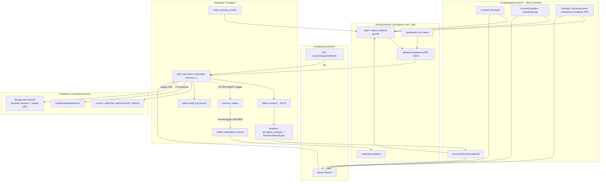
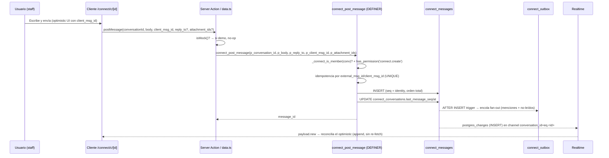
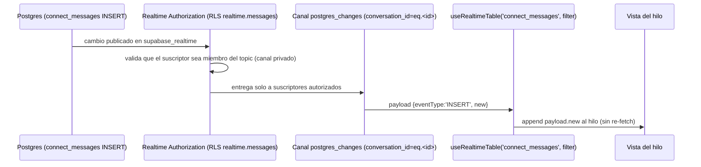
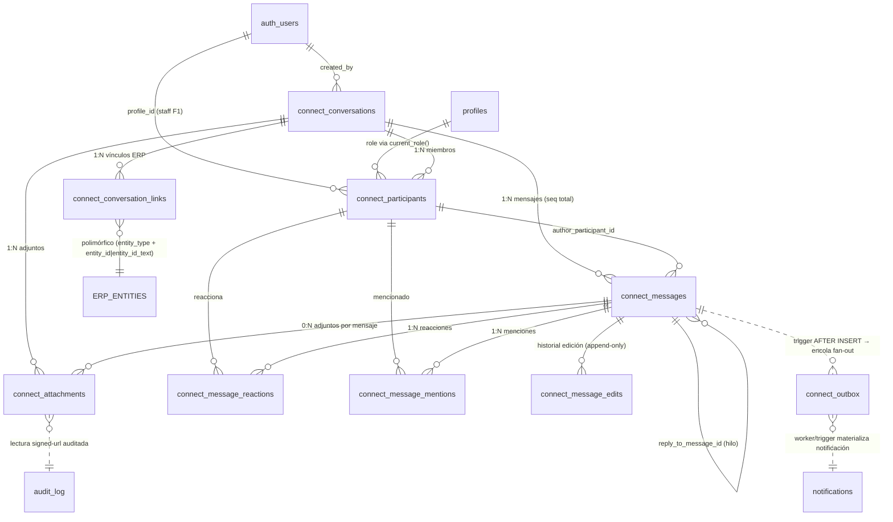
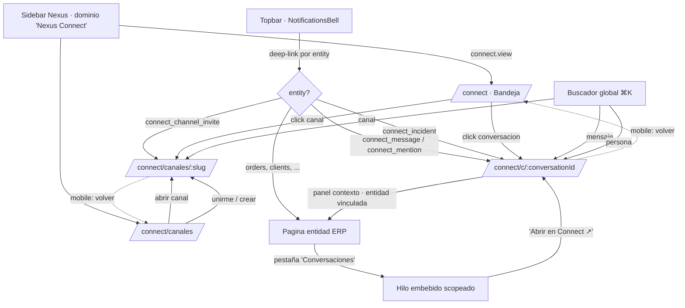
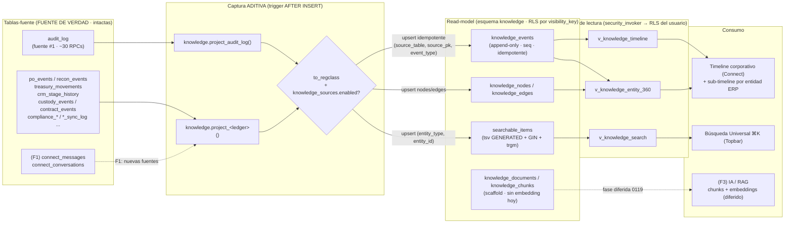
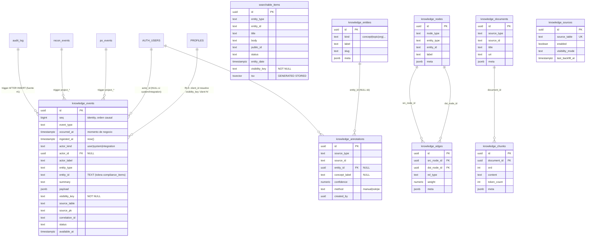
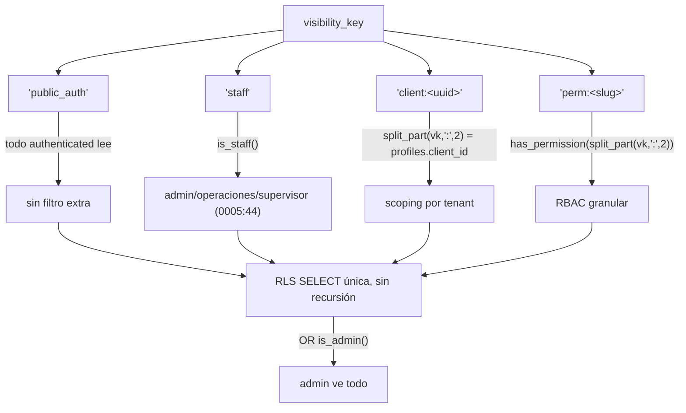
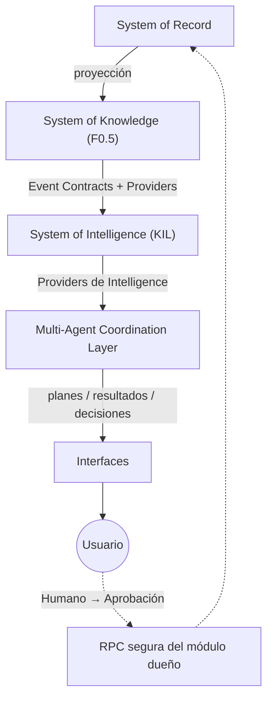

# NEXUS CONNECT — Arquitectura (fase de diseño previa a implementación)

> **Estado:** BORRADOR PARA APROBACIÓN DE DIRECCIÓN (G7). Ningún código ni migración se implementa hasta aprobar este documento.
> **Fecha:** 2026-06-28 · **Autor:** Claude (Opus 4.8) bajo gobernanza TOPS Nexus G1–G11
> **Bounded contexts:** `knowledge` (F0.5 — ver **Parte II**) + `connect` (F1+) · **Migraciones (entregadas, NO aplicadas — G3):** F0.5 Knowledge `0106–0111`; F1 Connect `0112–0118` (renumerado **+6** por F0.5 — el SQL de §B conserva prefijos `0106–0112`; aplicar con el mapa de **Parte II §0**); embeddings diferidos `0119`.
> **Regla de oro de este doc:** todo lo aquí descrito **extiende** activos existentes de Nexus; no se duplica nada (G "una sola fuente de verdad").
>
> **⚠ ACTUALIZACIÓN — Knowledge Hub:** Dirección incorporó **F0.5 – Knowledge Layer** como fase **previa y 100 % aditiva** (no modifica F1 ni ninguna decisión aprobada). Convierte a NEXUS CONNECT en la **memoria operativa** de la organización: el chat es la *interfaz*, el conocimiento (timeline corporativo unificado, indexación semántica preparada con pgvector diferido, knowledge graph, búsqueda universal FTS) es el *activo*. **F0.5 se implementa primero.** Diseño completo en **Parte II** (al final). El bloque F1 Connect descrito en las Partes I/Addendum no cambia en contenido; solo sus prefijos de migración se corren +6.
>
> **⚠ ACTUALIZACIÓN — Sistema Nervioso Digital (visión):** Dirección incorporó la **Knowledge Intelligence Layer (KIL)** — capa lógica que vive **por encima** de Knowledge y consume **exclusivamente sus eventos**, transformando información en *inteligencia operativa* (oportunidades, riesgos, recomendaciones, memoria corporativa, analítica) y dejando preparados los puntos de extensión para **agentes de IA**. Establece la separación en 4 niveles **System of Record → System of Knowledge → System of Intelligence → System of Interaction** con dependencia **unidireccional**. **Es SOLO visión/contratos/ADR/roadmap — no se implementa nada ahora, no toca F0.5 ni Connect, y la implementación sigue arrancando por F0.5.** Diseño en **Parte III** (al final).
>
> **⚠ ACTUALIZACIÓN — Multi-Agent Coordination Layer (visión de largo plazo):** Dirección incorporó la **MACL** — capa que vive **por encima** de la KIL y cuya responsabilidad es **coordinar** inteligencia (no generarla): orquestar agentes especializados que colaboran para resolver **procesos completos**, con el humano como autoridad final de toda escritura operativa. Modelo de evolución a 5 niveles: **SoR → SoK → SoI → MACL → Interfaces → Usuario**. **Solo visión/contratos/ADR/roadmap — no se implementa, no reserva migraciones ni numeración, no modifica ninguna fase.** Diseño en **Parte IV** (al final).
>
> **⚠ POLÍTICA DE INGENIERÍA — Engineering Observability Layer (EOL):** la observabilidad **nace con el código** (eventos técnicos en canal separado, `correlation_id` end-to-end, structured logging, contratos de métricas, auditoría de replay) y es **requisito arquitectónico permanente**, no opcional. **No implementa infra/herramientas/código, no toca F0.5.0/roadmap/migraciones.** Es criterio OBLIGATORIO de toda fase desde F0.5.1+. Política + ADR-ENG-1 en **Parte V** (al final).
>
> **✅ ETAPA DE ARQUITECTURA CERRADA Y APROBADA.** La implementación arranca por **F0.5.0** (plan en `docs/superpowers/plans/2026-06-28-f05-0-knowledge-foundation.md`), en incrementos pequeños/verificables/revisables. **Toda nueva capacidad futura requiere nuevo ADR + nueva fase de arquitectura antes de desarrollarse.**

---

## 0. Resumen ejecutivo

**Nexus Connect** es la capa única de colaboración y comunicación del ERP. Su tesis (Regla de Decisión, G2): hoy la comunicación operativa vive en WhatsApp personal, mail y un portal externo suelto (`connect.logisticatops.com`); eso es información perdida, no auditada y fuera del RBAC. Connect la trae **adentro del ERP**, vinculada a clientes, OS, OC, facturas, vehículos, depósitos, expedientes e incidencias, **buscable, auditada y gobernada por los permisos existentes**. Reemplaza herramientas externas → acerca a Nexus a ser el ERP único.

Es un programa grande — **11 subsistemas** pedidos: (1) chat privado, (2) canales, (3) chat contextual ERP, (4) IA conversacional, (5) chat con clientes, (6) chat con proveedores, (7) centro de incidentes, (8) centro de notificaciones, (9) videollamadas, (10) WhatsApp Business, (11) archivos. **No se construye de una vez.** Este documento entrega la arquitectura completa de los 12 artefactos pedidos y la descompone en 6 fases entregables. Dirección ya fijó:

| Decisión | Resolución |
|---|---|
| **Fase 1** | **Núcleo de colaboración interna (solo staff)**: chat 1:1, grupos, canales, chat contextual ERP, notificaciones unificadas |
| **Portales externos (F5)** | **Absorber `connect.logisticatops.com`** — Connect lo reemplaza/federa; el modelo de datos F1 ya es forward-compatible con participantes externos |
| **WhatsApp (F4)** | **Meta Cloud API directo** — reusar `src/lib/whatsapp/meta.ts`; completar inbound + HMAC + ventana 24h |
| **IA (F3)** | **Claude (conversación) + OpenAI (OCR)** — tool-calling sobre RPCs read-only, redacción PII, auditoría; nunca SQL libre |
| **Marca** | Módulo in-app "Nexus Connect", reusando la identidad "TOPS Connect" existente |

**Lo que ya existe y se reutiliza (no se reconstruye):** `public.notifications` + `NotificationsBell`, `src/lib/whatsapp/meta.ts`, la convención de Storage de custody/documental, el patrón LLM de `src/lib/ocr/openai.ts`, `useRealtimeTable`, `current_role()`/`has_permission()`/`is_admin()`/`tg_touch_updated_at()`, el catálogo RBAC, el sistema de diseño custom (dark mode + mobile gratis) y la plantilla de módulo de `prospeccion` (hexagonal) y `recon` (flat).

**Greenfield real:** chat/canales/mensajes, centro de incidentes, presence/typing, vínculo polimórfico conversación↔entidad ERP, e identidad externa (cliente/proveedor).

**Dos landmines a gestionar antes de exponer nada externo (F5):** (1) `handle_new_user` crea todo usuario nuevo como `operaciones` (staff) por defecto → una cuenta externa ingenua queda privilegiada; (2) el webhook WhatsApp no verifica HMAC.

---

## 1. Registro de decisiones de arquitectura (ADR resumido)

| # | Decisión | Alternativa descartada | Razón |
|---|---|---|---|
| D1 | Modelo unificado de **conversación** (DM, grupo, canal, ERP, incidente, whatsapp, ai) con `connect_participants` + `connect_messages` | Tablas separadas canales vs DMs | Una sola frontera RLS por membership; polimorfismo limpio |
| D2 | Mensajes **append-only**: edición → `connect_message_edits`; borrado → soft (tombstone + redacción) | Edición/borrado físico | Satisface inmutabilidad G10 **y** UX de chat |
| D3 | Orden total por `connect_messages.seq` (`bigint identity`); paginación **keyset por seq**, no OFFSET | Orden por `created_at` | Causalidad estable y paginación O(1) a 10M mensajes |
| D4 | No-leídos = `last_message_seq − last_read_seq` (O(1) por participante) | Recibos por mensaje para todo | Escala; recibos por-mensaje solo en DMs |
| D5 | RLS = `has_permission('connect.*')` (módulo) **+** `_connect_is_member()` (fila) **+** `is_admin()` (delete) | Solo `current_role()` coarse | Membership es la frontera real de PII de chat |
| D6 | Escrituras vía RPC `SECURITY DEFINER` `connect_*` (search_path fijo, revoke/grant) | INSERT directo desde el front | RPC-first (G10); no copiar la omisión de search_path de 0098 |
| D7 | Realtime: `postgres_changes` para mensajes (append por payload) + Presence/Broadcast para typing/online | Polling / SWR | Patrón ya usado en el repo; baja latencia |
| D8 | Notificaciones: **extender** `public.notifications` (kinds `connect_*`, ruteo de entity) | Tabla de notificaciones nueva | "Nada duplicado"; reusar bell + realtime |
| D9 | Adjuntos: buckets privados nuevos `connect-files`/`connect-files-pii` + `connect_attachments` + signed-URL por RPC auditada | Bucket legacy `attachments` / Google Drive | Hereda el patrón hardened de custody/documental |
| D10 | Core mensajería **hexagonal** (como `prospeccion`); entidades simples **flat** (como `recon`) | Un solo estilo | Cada concern con su plantilla canónica |
| D11 | **F0.5 Knowledge Layer** = bounded context propio `knowledge`, **aditivo**, **previo** a F1 (Parte II) | Anexar el conocimiento a `connect` | Es cross-cutting (toda la org emite); Connect es solo la interfaz, Knowledge es el activo |
| D12 | Timeline = **proyección read-model** (`knowledge_events`) por triggers AFTER INSERT; fuentes intactas | Refactorizar historiales por módulo | 100 % aditivo; los `*_events`/`audit_log` siguen siendo fuente de verdad |
| D13 | Búsqueda/timeline respetan RLS vía **`visibility_key`** denormalizado (`public_auth`/`staff`/`client:<uuid>`/`perm:<slug>`) + vistas `security_invoker` | Re-chequear visibilidad con JOINs por fila | O(1) por fila, reusa `has_permission`/`is_staff`/`client_id` |
| D14 | Embeddings/RAG **diferidos**: tablas `knowledge_documents/chunks` ahora; `vector`+`embedding`+HNSW en migración futura `0119` | Encender pgvector ya | No contraer deuda de IA antes de F3; FTS español cubre el MVP |
| D15 | **Knowledge Intelligence Layer** = bounded context `intelligence` (Parte III), **solo visión** (no se implementa) | Meter inteligencia dentro de Knowledge o de Connect | Separación en 4 niveles SoR/SoK/SoI/SoX; toda inteligencia futura vive acá |
| D16 | **Dependencia unidireccional** SoR→SoK→SoI→SoX→(acción vía RPC de módulo); prohibidas inversas. Intelligence **nunca escribe en Knowledge** | Acoplamiento libre entre capas | Permite reprocesar/reemplazar inteligencia sin tocar lo operativo; cierra fuga lateral |
| D17 | Intelligence acopla por **Event Contracts versionados** + **Provider interfaces**, nunca por tablas; **Event Replay** determinístico (procedencia `engine@version`+`source_event_seqs`) | Leer tablas/internals directamente | Aísla del modelo de módulos; reconstrucción total de la inteligencia sin riesgo operativo (ADR-INT-1..9, Parte III) |
| D18 | **Multi-Agent Coordination Layer** (Parte IV), **solo visión**: capa que **coordina** (no genera) inteligencia, orquestando agentes que consumen solo KIL; modelo de 5 niveles SoR→SoK→SoI→MACL→Interfaces | Que cada agente se auto-coordine / acceda a datos operativos | Permite procesos multi-agente sin refactor; mantiene el invariante y el human-in-the-loop (ADR-MACL-1..7) |
| D19 | **Etapa de arquitectura CERRADA**; implementación arranca por F0.5. Toda nueva capacidad = **nuevo ADR + nueva fase de arquitectura** antes de desarrollar | Seguir agregando alcance durante la implementación | Gobernanza fijada por Dirección; evita scope creep en build |
| D20 | **Engineering Observability Layer (EOL)** = política permanente (Parte V, ADR-ENG-1): observabilidad **nace con el código** (eventos técnicos en canal separado, `correlation_id` end-to-end, structured logging, contratos de métricas, auditoría de replay). Criterio OBLIGATORIO de toda fase desde F0.5.1+ | Agregar observabilidad después / opcional | Evita instrumentación retroactiva y flujos no reconstruibles; no implementa infra ni toca F0.5.0 |

---

## 2. Guía de lectura (los 12 entregables → secciones)

| # | Entregable pedido | Sección |
|---|---|---|
| 1 | Visión funcional | **A** (§ Visión + Arquitectura) |
| 2 | Arquitectura técnica | **A** |
| 3 | Modelo de datos (ER, tablas, índices, triggers, RLS) | **B** (Modelo de datos + SQL) |
| 4 | Wireframes | **C** (Wireframes + Navegación + UI/UX) |
| 5 | Flujo de navegación | **C** (y flujo de datos en **A**) |
| 6 | APIs necesarias | **D** (APIs) |
| 7 | Migraciones SQL (idempotentes, 0106–0112, **no aplicadas**) | **B** |
| 8 | Riesgos | **E** (Riesgos + Roadmap + Despliegue) |
| 9 | Roadmap por fases | **E** |
| 10 | Estimación de esfuerzo | **E** |
| 11 | Orden óptimo de implementación | **E** |
| 12 | Plan de despliegue sin afectar producción | **E** |

> **Nota de naming staff:** los roles staff reales seedeados en el corpus son `director_ops, admin, operaciones, compliance, comercial, seguridad` (+ `cliente_b2b` futuro) — `0009_rbac.sql:217-224`. El seed `0110` usa exactamente esos; no se inventan roles.

---


---

# Nexus Connect — Sección A: Visión funcional + Arquitectura técnica

> **Documento de arquitectura previa a aprobación.** No es código ni implementación. Define el bounded context `connect` dentro de TOPS Nexus (Next.js 15 App Router + TypeScript + Supabase/Postgres + Tailwind 3.4 custom + Netlify). Requiere OK explícito de Dirección antes de construir.
>
> Repo: `/Users/martinbattaglia/CODE/tops-ordenes`. Próximo número de migración libre: **0106**.

---

## 1. Visión funcional

### 1.1 Qué es Nexus Connect

**Nexus Connect** es la capa única de comunicación de TOPS Nexus. Es un sistema de mensajería interno (chat 1:1, chats grupales, canales tipo Slack, chat contextual sobre entidades del ERP) que vive **dentro** del ERP, no al lado. Toda conversación queda vinculada a la entidad de negocio que la origina (una OS, una OC, una factura, un cliente, un vehículo, un depósito, un expediente de compliance), es buscable, es auditable y está gobernada por el mismo RBAC que el resto de Nexus.

En F1 es **solo para staff interno** (sin autenticación externa). El modelo de datos, sin embargo, nace forward-compatible con participantes externos (clientes y proveedores) para que F5 pueda absorber el portal `connect.logisticatops.com` sin rediseño.

### 1.2 El problema que resuelve

Hoy la comunicación operativa de Logística TOPS está **fragmentada y fuera del sistema de registro**:

| Problema actual | Consecuencia | Cómo lo resuelve Connect |
|---|---|---|
| Coordinación por WhatsApp personal | El conocimiento se pierde, no es auditable, depende del teléfono de una persona | Conversación vinculada a la entidad ERP, persistida, auditada |
| Hilos sueltos en Teams / mail | No hay relación con la OS/OC/factura; no se puede reconstruir un caso | `connect_conversation_links` ata el hilo a la entidad real |
| Portal `connect.logisticatops.com` separado | Doble fuente de verdad cliente/proveedor, doble auth, doble mantenimiento | F5 lo absorbe/federa dentro de Connect |
| Sin trazabilidad ni RBAC en lo que se conversa | Riesgo de compliance; nadie sabe quién dijo qué sobre un expediente | RLS por membresía + `audit_log` central + redacción PII |

**Tesis central:** "lo que no está en Nexus, no pasó". Connect lleva la comunicación al mismo estándar de inmutabilidad, auditoría y RBAC que ya tienen Órdenes, Compras, Facturación y Conciliación.

### 1.3 Cómo pasa la Regla de Decisión

> **Regla de Decisión (G1):** una feature solo se construye si acerca a Nexus a ser el ERP único que reemplaza Neuralsoft.

Connect la pasa porque es la **capa única de comunicación que retira herramientas externas**:

- **Retira WhatsApp personal** como canal operativo: la conversación con proveedor/cliente pasa a Connect (outbound ya existe vía `src/lib/whatsapp/meta.ts`; inbound se persiste en F4).
- **Retira Teams / mail suelto** para coordinación interna: chat, canales y chat contextual sobre entidades.
- **Retira el portal externo** `connect.logisticatops.com` (F5), eliminando una app y una auth paralelas.
- **Habilita la IA conversacional** (F3) sobre datos reales del ERP sin exponer SQL ni romper RLS.

Sin Connect, Nexus seguiría siendo el sistema de registro **del dato** pero no **de la conversación sobre el dato**, dejando un hueco que obliga a mantener canales externos. Eso contradice la regla.

### 1.4 Alcance por fases (una línea cada una)

| Fase | Alcance | Una línea |
|---|---|---|
| **F1** | Núcleo de colaboración interna (SOLO staff) | Chat 1:1, grupos, canales, chat contextual sobre entidades ERP y extensión de notificaciones unificadas. |
| **F2** | Productividad de mensajería | Reacciones, menciones, hilos/replies, edición/borrado soft, búsqueda full-text, no-leídos avanzados. |
| **F3** | IA conversacional | Claude con tool-calling sobre RPCs read-only allowlisted; OpenAI solo OCR; redacción PII y auditoría de cada consulta/respuesta. |
| **F4** | WhatsApp inbound | Meta Cloud API directo: persistencia inbound + verificación HMAC `X-Hub-Signature-256` + ventana 24h/plantillas, un número. |
| **F5** | Portales cliente/proveedor | Connect absorbe/federa `connect.logisticatops.com`; entran participantes externos (`client_id`/`vendor_id`) con auth externa. |
| **F6** | Operación a escala | Enforcement de AV scan en attachments externos, retención/archivado, analítica de comunicación, hardening de uploads externos. |

> **DECISIÓN PENDIENTE:** el contenido exacto de F2/F6 es indicativo. F1 es la única fase con scope cerrado en el brief. F2..F6 se ratifican fase por fase con OK de Dirección.

### 1.5 Principios rectores

1. **Una sola fuente de verdad, nada duplicado.** Se reusa lo existente: `public.notifications`, `public.audit_log`, `current_role()`, `is_staff()`, `is_admin()`, `has_permission()`, `tg_touch_updated_at()`, los enums RBAC, `src/lib/supabase/*`, `src/lib/whatsapp/meta.ts`, el sistema de Storage de documental. Prohibido crear tablas/libs/lógica paralelas.
2. **RPC-first para escrituras críticas.** El front nunca escribe tablas críticas directo; escribe vía RPCs `SECURITY DEFINER` hardened.
3. **RLS como frontera de seguridad.** Toda tabla con RLS habilitada; jamás `using(true)` en tablas con PII. Acceso por conversación = membresía.
4. **Autorización por `current_role()` / `has_permission()`**, nunca `auth.jwt()->>'role'` (ese es el rol Postgres `authenticated`; fue el bug de recon corregido en `0103`).
5. **Forward-compatible con externos, sin construir externos en F1.** El modelo prevé `participant_type` y `external_ref` pero F1 no implementa auth externa.
6. **Migraciones aditivas e idempotentes, se entregan, no se aplican.** Las aplica Martín a mano, numeradas desde 0106.
7. **Aprobación de Dirección antes de construir; typecheck 0; sin commit/push/deploy sin OK.**

---

## 2. Arquitectura técnica

### 2.1 Ubicación del bounded context `connect`

`connect` es un **nuevo bounded context** dentro de Nexus, par a par con `compras`, `recon`, `prospeccion`, `tesoreria`, `wms`, etc. (ver `src/lib/*/`). No reemplaza a ninguno: los **atraviesa** transversalmente, porque cualquier entidad de cualquier contexto puede tener conversaciones asociadas.

```
TOPS Nexus (ERP único)
├── Contextos de negocio (dato)         ── compras · operaciones(orders) · wms · tesoreria · invoicing · recon · prospeccion · compliance · rrhh · …
├── Contexto transversal (comunicación) ── connect  ◀── NUEVO. Se vincula a entidades de los demás vía connect_conversation_links
└── Plataforma compartida (reuso)       ── supabase/* · rbac/* · auth/* · audit_log · notifications · whatsapp/meta.ts · documental/storage · rate-limit
```

| Capa física | Ruta canónica |
|---|---|
| Código de dominio/datos | `src/lib/connect/` |
| Páginas | `src/app/(app)/connect/*` |
| API (route handlers) | `src/app/api/connect/*` |

El acoplamiento con otros contextos es **unidireccional y débil**: Connect referencia entidades de otros módulos por `(entity_type, entity_id)` textual en `connect_conversation_links`, no por FK físicas a sus tablas. Así, agregar un nuevo `entity_type` no requiere tocar el otro módulo, y borrar/migrar un módulo no rompe Connect.

### 2.2 Patrón de capas aplicado

Connect respeta el patrón de capas estándar de Nexus, con guard `isMock()` obligatorio:

```
Feature  src/app/(app)/connect/*  (Server Component / Client Component)
   │
   ▼
Server Action / Route Handler  (src/app/api/connect/* o adapters/driving)
   │
   ▼
src/lib/connect/**/data.ts     (createClient() con guard isMock)
   │
   ▼
Supabase  →  RPC SECURITY DEFINER (escrituras) | vistas security_invoker (lecturas)
```

El guard `isMock()` es el mismo de todos los módulos (verificado en `src/lib/recon/data.ts:72`):

```ts
function isMock(): boolean {
  return env.app.demoMode || env.app.needsSupabase;
}
```

Y el cliente devuelve `null` en demo, como en `src/lib/supabase/server.ts:12` (`createClient()` retorna `null` si `!env.supabase.configured`). Toda función de datos chequea esto **antes** de query, igual que `getRecon` en `src/lib/recon/data.ts:79-81`.

#### Hexagonal vs Flat: cuándo cada uno

| Subdominio | Patrón | Justificación | Plantilla a copiar |
|---|---|---|---|
| **Core de mensajería** (conversaciones, mensajes, membresía, outbox, fan-out) | **Hexagonal** | Lógica de dominio rica (orden total de mensajes, idempotencia, reglas de moderación, eventos de salida) que conviene aislar de Supabase y testear pura | `prospeccion` (`src/lib/prospeccion/domain|application|ports|adapters|read/`) |
| **Entidades simples** (links a entidad, reacciones, lectura de bandeja, contadores) | **Flat** | CRUD/lectura directa sin invariantes de dominio relevantes | `recon` (`src/lib/recon/data.ts` + RPC vía sesión) |

Estructura propuesta de `src/lib/connect/`:

```
src/lib/connect/
├── domain/            # entidades, VOs, eventos (orden total, idempotencia, reglas de member_role)
│   ├── conversation.ts
│   ├── message.ts
│   └── events.ts      # ConnectMessagePosted, ConnectMentionRaised — sync 1:1 con connect_outbox.topic
├── application/       # use-cases (post-message, create-conversation, mark-read)
├── ports/             # interfaces (clock, id, message-repo, outbox)
├── adapters/
│   ├── driving/       # server actions (entrada)
│   └── supabase/      # implementaciones de ports (RPC connect_*)
├── read/              # lectura: bandeja, lista de canales, contadores no-leídos (vistas)
├── notifications/data.ts  # fan-out a public.notifications (extiende, no duplica)
└── data.ts            # entidades simples flat (links, reacciones)
```

> Nota de coherencia: `prospeccion` ya usa un patrón Outbox real (tabla `prospeccion_events`, `supabase/migrations/0089_prospeccion_core.sql:118`) con índice de despacho y eventos TS sincronizados 1:1 con el `type` del SQL (`src/lib/prospeccion/domain/events.ts:6-9`). Connect replica ese patrón con `connect_outbox`.

### 2.3 Diagrama de componentes



### 2.4 Flujo de datos: "enviar mensaje"



Puntos clave:

- **Idempotencia:** `p_client_msg_id` (más `external_msg_id UNIQUE` para wamid de WhatsApp) evita duplicados ante reintentos.
- **Orden total:** `connect_messages.seq` es `generated always as identity`, garantiza orden estable sin depender de timestamps.
- **Optimistic update:** el cliente pinta el mensaje al instante con un id temporal y lo reconcilia cuando llega el `payload.new` del Realtime.
- **Auditoría:** la RPC escribe en `public.audit_log` con `entity='connect_message'` (no se crea audit propio).

### 2.5 Flujo de datos: "recibir mensaje en realtime"



`useRealtimeTable` ya existe (`src/lib/supabase/realtime.ts:13`) pero su unión de tablas está **hard-coded** a `"orders" | "notifications" | "order_services"` (línea 14). **Extensión requerida:** agregar `"connect_messages"` (y las demás tablas Connect que necesiten realtime) a esa unión. El patrón de suscripción por `filter` ya soporta `conversation_id=eq.<id>` sin cambios estructurales.

### 2.6 Arquitectura realtime

Dos mecanismos complementarios:

| Mecanismo | Para qué | Cómo |
|---|---|---|
| **`postgres_changes`** | Mensajes nuevos/editados/borrados | Suscripción a `connect_messages` filtrada `conversation_id=eq.<id>`; el cliente consume `payload.new` (append) en vez de re-fetch. Reusa/extiende `useRealtimeTable`. |
| **Presence** | "Quién está online" en la conversación | Canal privado topic `connect:conv:<id>`; hook nuevo `useConnectPresence`. |
| **Broadcast** | "Está escribiendo…" (typing) | Mismo canal privado; hook nuevo `useConnectTyping`. Efímero, no toca DB. |

> **Landmine confirmado — Realtime Authorization:** Presence/Broadcast **no** están RLS-gated por Postgres por defecto. Se requiere **Realtime Authorization** (RLS sobre `realtime.messages`) o canales privados con scoping por `topic`, para que solo los miembros de la conversación reciban typing/online. Esto es **no negociable** para tablas/canales con PII.

> Cada tabla nueva que necesite `postgres_changes` debe publicarse en `supabase_realtime` con el **bloque idempotente** (patrón de `0016`, **no** el de `0004`). El badge de conexión reusa `RealtimeStatusBadge`; la máquina de estados de conexión a reusar es la de `src/lib/tracking/realtime/useFleetRealtime.ts`.

### 2.7 Arquitectura de seguridad

La seguridad es **defensa en profundidad**, con RLS como frontera última.

```
1. Middleware (src/lib/supabase/middleware.ts) ── sesión + redirección de no autenticados
2. Gate de módulo (UI/Server Action) ───────────── has_permission('connect.view'|'connect.create'|…)
3. RPC SECURITY DEFINER (hardened) ──────────────── re-valida rol + membresía ANTES de escribir
4. RLS por tabla (frontera) ─────────────────────── EXISTS membresía + has_permission; jamás using(true) con PII
```

Reglas:

- **Autorización por `public.current_role()` / `public.has_permission('connect.<action>')`**, nunca `auth.jwt()->>'role'`. `is_admin()` para delete. La **moderación de canal** (owner/moderator) se chequea por `connect_participants.member_role` en RPC+RLS, **no** es una acción RBAC nueva.
- **Acceso por conversación = membresía.** Las policies usan `EXISTS()` sobre `connect_participants`, **además** de `connect.view` a nivel módulo. Para evitar recursión en RLS se usa el helper interno `_connect_is_member(p_conversation_id)` (`SECURITY DEFINER`, `revoke from public`).
- **RPC-first y hardening estándar:** todas las RPCs `SECURITY DEFINER` con `set search_path = public, pg_temp`; `revoke from public, anon, authenticated`; `grant execute` a `authenticated` (acciones de usuario) o `service_role` (tráfico máquina: WhatsApp/IA). **No copiar la omisión de `0098`** (que omitió `set search_path`): Connect estandariza el hardened.
- **`service_role` solo en server.** `createAdminClient()` (`src/lib/supabase/server.ts:45`) jamás se expone al cliente; se usa únicamente para tráfico máquina y subida server-side de attachments.
- **Auditoría central:** toda RPC sensible escribe en `public.audit_log` con `entity='connect_*'`.

### 2.8 Arquitectura de IA (F3) — alto nivel

```
Usuario → Claude (conversación)
              │ tool-calling
              ▼
    Allowlist de RPCs read-only (SECURITY DEFINER, respetan RLS del invocador)
              │  NUNCA SQL libre · NUNCA inventar
              ▼
    Datos del ERP → redacción PII obligatoria antes del egress
              │
              ▼
    Respuesta + auditoría de CADA consulta y respuesta en audit_log
```

- **Claude** para la conversación; **OpenAI solo para OCR**.
- **Tool-calling** restringido a un **allowlist de RPCs read-only**: la IA nunca ejecuta SQL libre, nunca inventa, **respeta RLS** (corre con el contexto del usuario).
- **Redacción PII obligatoria** antes de que cualquier dato salga del sistema (egress).
- **Auditoría total:** cada consulta y cada respuesta de la IA se audita.
- **Patrón de llamada LLM a reusar:** `src/lib/ocr/openai.ts` usa raw `fetch` sin SDK; para Claude se usa el endpoint Anthropic con el mismo estilo (raw fetch + `env.*` con flag `configured`). Rate limiting reusa `src/lib/rate-limit.ts` (`rateLimit`/`clientKey`).

> Detalle de RPCs allowlisted, esquema de redacción y prompt-design: **fuera de esta sección** (va en la sección de IA).

### 2.9 Arquitectura WhatsApp (F4) — alto nivel

```
Inbound:  Meta → POST /api/whatsapp/webhook
              │ verificar HMAC X-Hub-Signature-256 (fail-closed)
              ▼
          RPC DEFINER (service_role) → persistir mensaje inbound (external_msg_id=wamid, idempotente)
              │
              ▼
          conversación kind='whatsapp' + fan-out vía connect_outbox

Outbound: connect_outbox → worker → src/lib/whatsapp/meta.ts (sendText/sendTemplate)
              │ ventana 24h: texto libre; fuera de ventana: solo plantillas APPROVED
```

- **Reuso total de `src/lib/whatsapp/meta.ts`** (outbound Meta Cloud v22.0 ya implementado: `sendText` línea 115, `sendTemplate` línea 96, `sendDocument` línea 124). No se duplica cliente.
- **Inbound a completar en F4:** el handler actual `src/app/api/whatsapp/webhook/route.ts` tiene el GET verify OK pero el **POST es un stub sin HMAC** y usa verify-token hardcodeado fallback — **landmine confirmado**, debe cerrarse (verificación HMAC `X-Hub-Signature-256` timing-safe, fail-closed) **antes** de persistir inbound.
- **Idempotencia por `wamid`** vía `connect_messages.external_msg_id UNIQUE`.
- **Ventana 24h / plantillas:** las reglas de Meta ya están documentadas en `meta.ts:16-22`. Un solo número; BSP fuera de scope.

> Detalle de mapeo wamid→conversación, manejo de status callbacks y plantillas: **fuera de esta sección**.

### 2.10 Escalabilidad, performance, cache, paginación, optimistic, offline, retry — alto nivel

| Eje | Estrategia (alto nivel) |
|---|---|
| **Paginación** | Cursor por `connect_messages.seq` (keyset, no OFFSET). Cargar ventana reciente + scroll-back por `seq < cursor`. |
| **Performance lectura** | Vistas `WITH (security_invoker=true)` para bandeja / lista de canales / contadores no-leídos (mig `0109`). No-leídos = `last_message_seq - last_read_seq`, O(1). |
| **Cache** | Estado de cliente cachea el hilo; Realtime mantiene fresco por append. Listados de bandeja revalidados por evento de outbox/notifications. |
| **Optimistic updates** | Mensaje pintado al instante con `client_msg_id`; reconciliado al recibir `payload.new`. Idempotencia garantiza no-duplicado. |
| **Offline / retry** | Cola local de envíos pendientes con `client_msg_id` estable; reintento idempotente. Server-side: `connect_outbox` con `status` (pending→processing→processed/failed/dead), `retry_count`, `available_at`, `last_error` — backoff y dead-letter. |
| **Escalabilidad realtime** | Suscripción filtrada por `conversation_id` (no canal global); typing/online por Broadcast/Presence efímero que no toca DB. |
| **Throughput máquina** | WhatsApp/IA por `service_role` y outbox asíncrono, desacoplado del request del usuario. |

> El **detalle de tablas, índices y SQL** de cada estrategia va en la sección de modelo de datos. Acá queda fijada la dirección arquitectónica.

### 2.11 Cómo se reconcilia / absorbe `connect.logisticatops.com` (F5)

Hoy `connect.logisticatops.com` es una app externa separada. El plan es que **Connect la reemplace/federe**:

1. **F1 deja el cimiento forward-compatible:** `connect_participants.participant_type` (`staff | client | provider | ai | system | whatsapp`) y `connect_participants.external_ref jsonb` (futuro `client_id`/`vendor_id`) ya están en el modelo, sin construir auth externa todavía.
2. **F5 agrega la identidad externa:** clientes/proveedores entran como participantes con `participant_type='client'|'provider'` y `external_ref`, reusando las mismas tablas y RPCs — sin esquema nuevo de mensajería.
3. **Botón externo se mantiene hasta F5.** El brief de marca indica conservar el botón a `connect.logisticatops.com` hasta que F5 lo absorba; recién entonces se retira.

> **Landmine bloqueante para F5 (no para F1):** `handle_new_user` (`0005`) asigna `role='operaciones'` (STAFF) por defecto a todo `auth.users` nuevo. Una cuenta externa creada ingenuamente quedaría **privilegiada**. Esto **debe** resolverse antes de cualquier portal externo. Se documenta acá como dependencia hard de F5, no se aborda en F1.

---

## Anexo: archivos reales referenciados (reuso/extensión)

| Archivo (path:linea) | Rol | Acción Connect |
|---|---|---|
| `src/lib/supabase/server.ts:12` | `createClient()` devuelve null en demo | Reusar (guard isMock) |
| `src/lib/supabase/server.ts:45` | `createAdminClient()` service_role | Reusar (solo server) |
| `src/lib/supabase/realtime.ts:13-14` | `useRealtimeTable`, unión de tablas hard-coded | **Extender** unión con `connect_messages` |
| `src/lib/recon/data.ts:72` | patrón `isMock()` flat | Reusar como plantilla flat |
| `src/lib/prospeccion/domain/events.ts:6-9` | eventos sync 1:1 con Outbox SQL | Reusar como plantilla hexagonal |
| `supabase/migrations/0089_prospeccion_core.sql:118` | tabla `prospeccion_events` (Outbox) | Replicar patrón en `connect_outbox` |
| `src/components/shell/NotificationsBell.tsx:113` | ruteo hard-coded a `entity === "orders"` | **Generalizar** ruteo para `connect_*` |
| `src/components/shell/Sidebar.tsx:43` | `DOMAINS` array | **Agregar** dominio 'Nexus Connect' con gate `connect.view` |
| `src/lib/whatsapp/meta.ts:96,115,124` | outbound Meta v22.0 | Reusar (F4 inbound + outbox) |
| `src/app/api/whatsapp/webhook/route.ts` | POST stub sin HMAC (landmine) | **Cerrar HMAC** en F4 |
| `src/lib/ocr/openai.ts` | raw fetch LLM sin SDK | Reusar patrón para Claude (F3) |
| `src/lib/rate-limit.ts` | `rateLimit`/`clientKey` | Reusar (IA/WhatsApp) |
| `src/lib/documental/storage.ts` | helpers Storage + signed URL | Reusar convención (F1 buckets `connect-files*`) |
| `src/lib/tracking/realtime/useFleetRealtime.ts` | state machine de conexión | Reusar para badge de conexión |


---

# Nexus Connect — Sección B: Modelo de Datos + Migraciones SQL

> **Documento para Dirección.** Arquitectura previa a aprobación del bounded context `connect` (Fase 1: núcleo de colaboración interna, solo staff). No es código de aplicación: es el contrato de datos y las migraciones que lo materializan.
>
> **Convenciones heredadas y verificadas contra el corpus** (`/Users/martinbattaglia/CODE/tops-ordenes`): RLS habilitada en toda tabla con PII, RPC-first para escritura crítica (SECURITY DEFINER + `set search_path=public,pg_temp`), autorización por `public."current_role"()` y `public.has_permission()` (NUNCA `auth.jwt()->>'role'` — ese fue el bug corregido en `0103_recon_role_fix.sql`), migraciones idempotentes y aditivas que cierran con `notify pgrst,'reload schema'`.
>
> **Entrega vs. aplicación.** Las migraciones `0106..0112` SE ENTREGAN, NO SE APLICAN. Las aplica Martín a mano tras verificar contra prod `arsksytgdnzukbmfgkju`.

---

## 1. Modelo ER

### 1.1 Diagrama (mermaid)



### 1.2 Relaciones con activos existentes (no se duplican)

| Activo existente | Tipo de relación con `connect` | Cómo se integra |
|---|---|---|
| `auth.users` | FK | `created_by`, `profile_id`, `author_profile_id`, `uploaded_by` → `auth.users(id)` (staff F1). |
| `public.profiles` (vía `public."current_role"()`) | Autorización | RLS y RPC chequean rol con `current_role()` / `has_permission('connect.*')` — `0009_rbac.sql:164` (`has_permission`), `0103_recon_role_fix.sql` (idioma canónico). |
| `public.notifications` | EXTENSIÓN, no nueva tabla | `0111` agrega kinds `connect_*` y generaliza ruteo de `entity`; el fan-out escribe filas aquí. Columnas existentes verificadas en `0004_extended_schema.sql:49-61`. |
| `public.audit_log` | SINK central | `connect_emit_attachment_signed_url` y operaciones sensibles escriben con `entity='connect_*'`. **OJO**: la tabla usa columna `ts` (no `created_at`) — `0001_init.sql:154-163`. |
| `permission_module_t` / `permissions` / `roles` / `role_permissions` / `user_roles` | EXTENSIÓN | `0106` agrega valor `'connect'` al enum; `0110` seedea slugs `connect.*`. Definiciones en `0009_rbac.sql:17-50`. |
| `public.tg_touch_updated_at()` | REUSO | Trigger `updated_at` en cada tabla — definido `0004_extended_schema.sql:20`. |
| `public.is_admin()` / `public.is_staff()` | REUSO | `0005_fix_rls_recursion.sql:36,53`. |
| `supabase_realtime` (publicación) | EXTENSIÓN | `0111` agrega las tablas nuevas con el bloque idempotente guardado de `0016_tracking_foundation.sql:129-140` (NO el de `0004:183-185`). |
| `storage.buckets` / `storage.objects` | REUSO de patrón | `0112` crea buckets privados nuevos siguiendo `0037_custody_storage.sql` (insert con `on conflict do update` + RLS por bucket + RPC de signed-url auditada). |

---

## 2. Catálogo de tablas F1

Toda tabla F1 incluye (salvo se indique): `id uuid primary key default gen_random_uuid()`, `created_at timestamptz not null default now()`, `updated_at timestamptz not null default now()`, RLS habilitada, trigger `tg_touch_updated_at` en `updated_at`.

Excepciones intencionales:
- `connect_messages` y `connect_outbox` usan `seq bigint generated always as identity` para **orden total** (mismo motivo documentado en `0089_prospeccion_core.sql` para `prospeccion_events.seq`: `id uuid` no es monotónico y `created_at` colisiona en lotes).
- `connect_outbox` es **superficie de máquina**: RLS habilitada **sin policy** (deny-all a `authenticated`; lo escribe el trigger DEFINER y lo consume `service_role`), igual que `prospeccion_events` / `prospeccion_import_jobs` en `0089`.
- `connect_messages` es **append-only**: edición → fila en `connect_message_edits`; borrado → soft (`deleted_at` + `body` redactado). NO hay UPDATE de `body` in-place fuera de la RPC.

### 2.1 `connect_conversations`

| Columna | Tipo | Notas |
|---|---|---|
| `id` | uuid PK | `gen_random_uuid()` |
| `kind` | `connect_conversation_kind_t` not null | dm/group/channel/erp/incident/whatsapp/ai |
| `slug` | text null unique | solo canales; único parcial (índice `where slug is not null`) |
| `title` | text null | nombre de grupo/canal |
| `visibility` | text null check (`public`/`private`) | solo canales; null para dm/group |
| `topic` | text null | descripción/tema de canal |
| `archived_at` | timestamptz null | soft-archive |
| `created_by` | uuid null → `auth.users(id) on delete set null` | autor |
| `last_message_seq` | bigint null | denormalizado (lo actualiza la RPC `connect_post_message`) |
| `last_message_at` | timestamptz null | denormalizado, para ordenar bandeja |

**Índices**: `unique` parcial sobre `lower(slug) where slug is not null`; `(kind, last_message_at desc)` para la bandeja; `(archived_at) where archived_at is null` (lista activa).

**RLS**:
- SELECT: `has_permission('connect.view') AND (_connect_is_member(id) OR (kind='channel' AND visibility='public') OR is_admin())`.
- INSERT: `has_permission('connect.create')` (la RPC `connect_create_conversation` es la vía real; la policy es defensa en capas).
- UPDATE: `has_permission('connect.edit') AND (_connect_is_member(id) OR is_admin())` — moderación de canal (topic/archive/title) la valida la RPC por `member_role`.
- DELETE: `is_admin()`.

### 2.2 `connect_participants`

| Columna | Tipo | Notas |
|---|---|---|
| `id` | uuid PK | |
| `conversation_id` | uuid not null → `connect_conversations(id) on delete cascade` | |
| `participant_type` | `connect_participant_type_t` not null default `'staff'` | staff/client/provider/ai/system/whatsapp |
| `profile_id` | uuid null → `auth.users(id) on delete cascade` | null para ai/system/whatsapp/externos F5 |
| `external_ref` | jsonb null | **forward-compat F5**: `{client_id|vendor_id}`. No usado en F1. |
| `member_role` | `connect_member_role_t` not null default `'member'` | owner/moderator/member/guest |
| `joined_at` | timestamptz not null default now() | |
| `last_read_seq` | bigint not null default 0 | high-water mark de lectura |
| `muted_until` | timestamptz null | silenciado |
| `notif_pref` | text null | preferencia (`all`/`mentions`/`none`) — texto, no enum (cambia seguido) |

**UNIQUE**: `(conversation_id, profile_id)` — un staff es miembro una sola vez. (Para externos F5, `profile_id` será null y se desambiguará por `external_ref`; ver flag F5-1.)

**Índices**: `(conversation_id)`; `(profile_id) where profile_id is not null` (mis conversaciones); índice parcial **de no-leídos** apoyado en join con `connect_conversations.last_message_seq` (ver §2.3 nota de contadores).

**RLS**:
- SELECT: `has_permission('connect.view') AND (_connect_is_member(conversation_id) OR is_admin())`.
- INSERT/UPDATE/DELETE: la vía es RPC (`connect_add_member`/`connect_set_member_role`/`connect_remove_member`). Policy de UPDATE de **mi propio** `last_read_seq`/`muted_until` permitida: `profile_id = auth.uid()` (para `connect_mark_read` rápido); el resto exige `is_admin()` o owner/moderator vía RPC.

### 2.3 `connect_messages` (append-only)

| Columna | Tipo | Notas |
|---|---|---|
| `id` | uuid PK | |
| `conversation_id` | uuid not null → `connect_conversations(id) on delete cascade` | |
| `seq` | bigint generated always as identity | **orden total global** (no por conversación; el orden por hilo se obtiene con índice compuesto, ver abajo) |
| `author_participant_id` | uuid null → `connect_participants(id) on delete set null` | null para system/ai/whatsapp sin participante |
| `author_profile_id` | uuid null | denormalizado (sobrevive a baja de participante) |
| `kind` | `connect_message_kind_t` not null default `'text'` | text/system/ai/file/call_link/whatsapp |
| `body` | text null | markdown; null para mensajes solo-adjunto |
| `body_format` | text not null default `'markdown'` | |
| `reply_to_message_id` | uuid null → `connect_messages(id) on delete set null` | hilo |
| `edited_at` | timestamptz null | última edición |
| `deleted_at` | timestamptz null | soft-delete |
| `redacted` | boolean not null default false | PII removida |
| `external_msg_id` | text null **unique** | wamid de WhatsApp / idempotencia inbound (F4) |
| `meta` | jsonb not null default `'{}'::jsonb` | |

**Índices** (críticos):
- `unique (conversation_id, seq)` — **orden por conversación** y paginación de hilo (keyset por `seq`). Es el índice de orden pedido por el brief.
- `unique (external_msg_id) where external_msg_id is not null` — idempotencia inbound WhatsApp/máquina.
- `(reply_to_message_id) where reply_to_message_id is not null` — sub-hilos.
- `(conversation_id) where deleted_at is null` — listado vivo.
- FTS español opcional (flag DOC-FTS): `gin (to_tsvector('spanish', coalesce(body,'')))` — mismo precedente que el GIN FTS sobre `documents` mencionado en el brief; **DECISIÓN PENDIENTE** si entra en F1 o F2.

**RLS** (append-only):
- SELECT: `has_permission('connect.view') AND _connect_is_member(conversation_id)`. (No `is_admin()` blanket: la pertenencia es la frontera de PII de la conversación; admin entra agregándose como miembro o vía vistas DEFINER de auditoría — flag SEC-1.)
- INSERT: la vía real es `connect_post_message` (DEFINER). Policy directa: `has_permission('connect.create') AND _connect_is_member(conversation_id) AND author_profile_id = auth.uid()` (defensa en capas; el front NO inserta directo).
- UPDATE: **denegado a sesión** salvo soft-delete/edición vía RPC (`connect_edit_message` escribe `edited_at` + crea fila en `connect_message_edits`; `connect_delete_message` setea `deleted_at` + redacta `body`). Policy directa: `using (false)` para forzar el paso por RPC (append-only real).
- DELETE: `is_admin()` (físico, excepcional; lo normal es soft-delete).

**Trigger** `AFTER INSERT` → encola en `connect_outbox` (ver §2.10 y la función `_connect_enqueue_message` en `0108`).

### 2.4 `connect_message_edits` (historial, append-only)

| Columna | Tipo | Notas |
|---|---|---|
| `id` | uuid PK | |
| `message_id` | uuid not null → `connect_messages(id) on delete cascade` | |
| `prev_body` | text | cuerpo anterior |
| `edited_by` | uuid null → `auth.users(id) on delete set null` | |
| `edited_at` | timestamptz not null default now() | |

(No `updated_at` ni trigger touch: es append-only puro, igual filosofía que `audit_log`.)

**Índice**: `(message_id, edited_at desc)`.

**RLS**: SELECT `has_permission('connect.view') AND _connect_is_member((select conversation_id from connect_messages m where m.id = message_id))`. INSERT solo vía RPC (`using(false)` directo). Sin UPDATE/DELETE.

### 2.5 `connect_message_reactions`

| Columna | Tipo | Notas |
|---|---|---|
| `id` | uuid PK | |
| `message_id` | uuid not null → `connect_messages(id) on delete cascade` | |
| `participant_id` | uuid not null → `connect_participants(id) on delete cascade` | |
| `emoji` | text not null | |
| `created_at` | timestamptz not null default now() | |

**UNIQUE**: `(message_id, participant_id, emoji)`.
**Índice**: `(message_id)`.
**RLS**: SELECT por membership; INSERT/DELETE vía RPC `connect_react`/`connect_unreact` (también admite policy directa de INSERT/DELETE del **propio** participante para latencia baja: `participant_id IN (select id from connect_participants p where p.profile_id = auth.uid())`).

### 2.6 `connect_message_mentions`

| Columna | Tipo | Notas |
|---|---|---|
| `id` | uuid PK | |
| `message_id` | uuid not null → `connect_messages(id) on delete cascade` | |
| `mentioned_participant_id` | uuid not null → `connect_participants(id) on delete cascade` | |
| `created_at` | timestamptz not null default now() | |

**UNIQUE**: `(message_id, mentioned_participant_id)`.
**Disparo**: lo escribe `connect_post_message` al parsear `@menciones`; el trigger de outbox genera notificación `connect_mention`.
**RLS**: SELECT por membership; escritura solo vía RPC.

### 2.7 `connect_attachments`

| Columna | Tipo | Notas |
|---|---|---|
| `id` | uuid PK | |
| `conversation_id` | uuid not null → `connect_conversations(id) on delete cascade` | |
| `message_id` | uuid null → `connect_messages(id) on delete set null` | null = subido antes de postear |
| `storage_bucket` | text not null | `connect-files` o `connect-files-pii` |
| `storage_path` | text not null | `buildDocPath`-style (ver flag DOC-STORAGE) |
| `sha256` | text | hash del binario (`fileHashSha256`) |
| `mime_type` | text | |
| `file_size` | bigint | |
| `file_name` | text | |
| `uploaded_by` | uuid null → `auth.users(id) on delete set null` | |
| `scan_status` | text not null default `'pending'` check (`pending`/`clean`/`infected`) | enforcement de "solo firmar si clean" se activa en F5/F6 |
| `created_at` | timestamptz not null default now() | |

**UNIQUE**: `(storage_bucket, storage_path)` — un binario, una fila (precedente custody/documental).
**Índices**: `(conversation_id)`; `(message_id) where message_id is not null`; `(sha256)` (dedup).
**RLS**:
- SELECT (metadata): `has_permission('connect.view') AND _connect_is_member(conversation_id)`. **El binario NO se lee por esta policy**: se obtiene SIEMPRE vía signed-URL emitida por `connect_emit_attachment_signed_url` (DEFINER + auditoría), igual que custody.
- INSERT: vía RPC/server-action con `createAdminClient` (`upsert:false`); policy directa `has_permission('connect.create') AND _connect_is_member(conversation_id) AND uploaded_by = auth.uid()`.
- UPDATE (`scan_status`): solo `service_role` (worker AV futuro) → policy `using(false)` a sesión; el worker bypassa.
- DELETE: `is_admin()`.

### 2.8 `connect_conversation_links` (vínculo polimórfico a ERP)

| Columna | Tipo | Notas |
|---|---|---|
| `id` | uuid PK | |
| `conversation_id` | uuid not null → `connect_conversations(id) on delete cascade` | |
| `entity_type` | text not null check (∈ vocabulario, ver §3) | nombre de tabla ERP real |
| `entity_id` | uuid null | PK uuid de la entidad |
| `entity_id_text` | text null | PK text (solo `compliance_items`, ver §3) |
| `linked_by` | uuid null → `auth.users(id) on delete set null` | |
| `created_at` | timestamptz not null default now() | |

**UNIQUE**: `(conversation_id, entity_type, entity_id)`. **DECISIÓN PENDIENTE / flag DM-LINK-1**: el UNIQUE con `entity_id` nullable no cubre la unicidad de `entity_id_text` (compliance). Solución propuesta: índice único parcial adicional `unique (conversation_id, entity_type, entity_id_text) where entity_id_text is not null` además del primario por uuid. Se incluye en `0107`.
**CHECK de coherencia PK** (ver §3): `(entity_type = 'compliance_items' AND entity_id_text IS NOT NULL AND entity_id IS NULL) OR (entity_type <> 'compliance_items' AND entity_id IS NOT NULL AND entity_id_text IS NULL)`.
**Índices**: `(entity_type, entity_id) where entity_id is not null` y `(entity_type, entity_id_text) where entity_id_text is not null` — para "abrir conversaciones de esta entidad" desde la pestaña ERP.
**RLS**: SELECT `has_permission('connect.view') AND _connect_is_member(conversation_id)`; INSERT/DELETE vía RPC `connect_link_entity`/`connect_unlink_entity`.

> **Nota de no-acoplamiento**: `connect_conversation_links` NO declara FK a las tablas ERP (sería acoplamiento duro entre bounded contexts y rompería el principio "un vínculo lógico, no físico", mismo criterio que `prospeccion_events.aggregate_id` que es "relación lógica" en `0089`). La integridad referencial blanda se valida en `connect_link_entity` (existencia de la entidad) sin FK.

### 2.9 `connect_outbox` (superficie de máquina, RLS sin policy)

| Columna | Tipo | Notas |
|---|---|---|
| `seq` | bigint generated always as identity **PK** | orden causal total |
| `topic` | text not null | `connect.message.posted` / `connect.mention` / `connect.whatsapp.outbound` / ... |
| `payload` | jsonb not null default `'{}'::jsonb` | |
| `status` | text not null default `'pending'` check (`pending`/`processing`/`processed`/`failed`/`dead`) | |
| `available_at` | timestamptz not null default now() | backoff |
| `retry_count` | int not null default 0 | |
| `processed_at` | timestamptz null | |
| `last_error` | text null | |
| `created_at` | timestamptz not null default now() | |

**Índice parcial de cola** (idéntico criterio a `prospeccion_events_dispatch_idx` en `0089`):
```sql
create index if not exists connect_outbox_dispatch_idx
  on public.connect_outbox (available_at, seq)
  where status in ('pending','failed');
```
**RLS**: `enable row level security` **SIN policy** → deny-all a `anon`/`authenticated`. Lo escribe el trigger DEFINER (corre como owner) y lo consume el worker `service_role` (bypassa RLS). Patrón explícito de `prospeccion_events` / `prospeccion_import_jobs`.

### 2.10 Matriz RLS resumida

| Tabla | SELECT | INSERT | UPDATE | DELETE |
|---|---|---|---|---|
| `connect_conversations` | view + (miembro ∨ canal público ∨ admin) | create (RPC real) | edit + (miembro ∨ admin) | is_admin |
| `connect_participants` | view + (miembro ∨ admin) | RPC | propio last_read/muted ∨ RPC | RPC/is_admin |
| `connect_messages` | view + miembro | create + miembro + autor (RPC real) | **false** (solo RPC) | is_admin |
| `connect_message_edits` | view + miembro(msg) | false (RPC) | — | — |
| `connect_message_reactions` | view + miembro | propio participante ∨ RPC | — | propio ∨ RPC |
| `connect_message_mentions` | view + miembro | false (RPC) | — | — |
| `connect_attachments` | view + miembro (metadata) | create + miembro + uploader | false (worker) | is_admin |
| `connect_conversation_links` | view + miembro | false (RPC) | — | false (RPC) |
| `connect_outbox` | **sin policy (deny-all)** | sin policy | sin policy | sin policy |

> `_connect_is_member(conversation_id)` es `SECURITY DEFINER` con `revoke from public` para **evitar recursión RLS** (mismo motivo que `is_staff`/`is_admin` en `0005_fix_rls_recursion.sql`): consulta `connect_participants` saltando su propia RLS.

---

## 3. Manejo de los dos tipos de PK (uuid vs text)

El vocabulario de entidades ERP (§ `0107` y brief) mezcla PKs `uuid` (la gran mayoría: `clients`, `orders`, `purchase_orders`, etc.) con **un** PK `text`: `public.compliance_items` (verificado: `compliance_items.id text primary key` — `0065_compliance_core.sql:9`).

Solución (sin polimorfismo de tipo en una sola columna, que rompería índices):

1. **Dos columnas nullable**: `entity_id uuid null` + `entity_id_text text null`.
2. **CHECK de exclusividad** que ata el tipo de PK al `entity_type`:
   ```sql
   check (
     (entity_type = 'compliance_items'
        and entity_id_text is not null and entity_id is null)
     or
     (entity_type <> 'compliance_items'
        and entity_id is not null and entity_id_text is null)
   )
   ```
3. **Dos índices únicos parciales** (la unicidad lógica "una conversación por entidad" en ambos universos):
   - `unique (conversation_id, entity_type, entity_id) where entity_id is not null`
   - `unique (conversation_id, entity_type, entity_id_text) where entity_id_text is not null`
4. **RPC** `connect_link_entity(p_conversation_id, p_entity_type, p_entity_id uuid, p_entity_id_text text)` ruta a la columna correcta según `p_entity_type` y rechaza combinaciones inválidas con `errcode='check_violation'`.

> Precedente del proyecto: el mismo `prospeccion` modela ids legibles `text` (`short_id`) junto a `id uuid`; aquí lo aplicamos al vínculo polimórfico.

---

## 4. Extensión de `public.notifications` (sin romper orders)

La tabla `public.notifications` ya existe con columnas `entity`, `entity_id uuid`, `role_target user_role_t`, `user_id`, `kind`, `title`, `message`, `read_at` (`0004_extended_schema.sql:49-61`). **NO se crea tabla nueva.** Cambios en `0111`:

1. **Nuevos `kind`** (la columna `kind` es `text`, no enum → no requiere ALTER TYPE): `connect_message`, `connect_mention`, `connect_channel_invite`, `connect_incident`. Documentados; sin migración de tipo.
2. **Ruteo `entity`**: hoy `NotificationsBell.tsx:113` hard-codea `entity === "orders" ? /orders/${id} : "#"`. Connect emitirá filas con `entity='connect'` y `entity_id = conversation_id`. El ruteo a `/connect/c/<id>` se generaliza en el componente (Sección UI), **no** en SQL. El trigger de `orders` existente **no se toca** (sigue insertando `entity='orders'`); ambos coexisten porque `entity` es texto libre.
3. **Compatibilidad de tipo**: `entity_id` es `uuid`; `conversation_id` es `uuid` → encaja sin cambios. (Los vínculos a entidades con PK text NO van por `notifications.entity_id`; van por `connect_conversation_links`.)
4. **Fan-out (modelo HÍBRIDO — resuelve NOTIF-1, ver Addendum §A4):** el trigger `AFTER INSERT` en `connect_messages` hace **dos cosas**: (a) inserta SÍNCRONAMENTE en `notifications` el fan-out **acotado** (las @menciones de `connect_message_mentions` + el contraparte de un DM 1:1) — es un puñado de filas, latencia despreciable, y garantiza que las notificaciones críticas funcionen en F1 **sin depender de un worker**; (b) encola en `connect_outbox` el fan-out **masivo/diferido** (no-leídos de canales grandes, entregas cross-sistema). El worker `service_role` que drena `connect_outbox` (`/api/connect/cron/dispatch-outbox`, autenticado con `CRON_SECRET`, **fail-closed**) **es entregable de F1.4** (no PENDIENTE), y se reutiliza en F4 para WhatsApp. Esto reemplaza la opción "solo worker" y elimina la contradicción con §APIs.

Las policies de `notifications` (`0004:69-80`) ya permiten lectura por `user_id`/`role_target`/admin y update propio → cubren `connect_*` sin cambios.

---

## 5. Migraciones SQL (0106 → 0112)

> **Cada archivo es idempotente, aditivo, y cierra con `notify pgrst,'reload schema'`.** Header obligatorio en todas. El valor de enum del módulo va SOLO en `0106` (Postgres no permite usar un valor de enum recién agregado en la misma transacción — mismo motivo que `0088 → 0089`). Las RPCs van en `0108`, no en `0107`.

---

### 5.1 `0106_connect_module_enum.sql`

```sql
-- 0106_connect_module_enum.sql
-- ENTREGADA, NO APLICADA — verificar 0106 libre en prod arsksytgdnzukbmfgkju antes de aplicar.
-- ─────────────────────────────────────────────────────────────────────────
-- Agrega el valor 'connect' al enum permission_module_t. STANDALONE: Postgres
-- no permite USAR un valor de enum recién agregado dentro de la misma
-- transacción → el seed de permisos/roles vive en 0110 (molde 0088 → 0089).
-- DEPENDE de: permission_module_t (0009_rbac.sql:17).
-- ─────────────────────────────────────────────────────────────────────────
alter type public.permission_module_t add value if not exists 'connect';

notify pgrst, 'reload schema';
```

---

### 5.2 `0107_connect_schema.sql`

```sql
-- 0107_connect_schema.sql
-- ENTREGADA, NO APLICADA — verificar 0106 libre en prod arsksytgdnzukbmfgkju antes de aplicar.
-- ─────────────────────────────────────────────────────────────────────────
-- Núcleo de datos de Nexus Connect (F1): enums connect_*, tablas, índices,
-- triggers (tg_touch_updated_at), helper _connect_is_member y RLS.
-- 100% ADITIVA · IDEMPOTENTE. NO incluye RPCs (van en 0108) ni outbox-trigger
-- de fan-out (la función va en 0108; el trigger se crea allí porque depende
-- de la cola y de _connect_enqueue_message).
-- DEPENDE de: tg_touch_updated_at (0004), is_admin/is_staff (0005),
--   has_permission/current_role (0009), auth.users.
-- ─────────────────────────────────────────────────────────────────────────

-- ===== Enums =====
do $$ begin
  create type public.connect_conversation_kind_t as enum
    ('dm','group','channel','erp','incident','whatsapp','ai');
exception when duplicate_object then null; end $$;

do $$ begin
  create type public.connect_member_role_t as enum
    ('owner','moderator','member','guest');
exception when duplicate_object then null; end $$;

do $$ begin
  create type public.connect_message_kind_t as enum
    ('text','system','ai','file','call_link','whatsapp');
exception when duplicate_object then null; end $$;

do $$ begin
  create type public.connect_participant_type_t as enum
    ('staff','client','provider','ai','system','whatsapp');
exception when duplicate_object then null; end $$;

-- ===== Tablas =====

-- (1) connect_conversations
create table if not exists public.connect_conversations (
  id                uuid primary key default gen_random_uuid(),
  kind              public.connect_conversation_kind_t not null,
  slug              text,
  title             text,
  visibility        text check (visibility in ('public','private')),
  topic             text,
  archived_at       timestamptz,
  created_by        uuid references auth.users(id) on delete set null,
  last_message_seq  bigint,
  last_message_at   timestamptz,
  created_at        timestamptz not null default now(),
  updated_at        timestamptz not null default now()
);
create unique index if not exists connect_conversations_slug_uidx
  on public.connect_conversations (lower(slug)) where slug is not null;
create index if not exists connect_conversations_inbox_idx
  on public.connect_conversations (kind, last_message_at desc);
create index if not exists connect_conversations_active_idx
  on public.connect_conversations (archived_at) where archived_at is null;

drop trigger if exists trg_connect_conversations_touch on public.connect_conversations;
create trigger trg_connect_conversations_touch
  before update on public.connect_conversations
  for each row execute function public.tg_touch_updated_at();

-- (2) connect_participants
create table if not exists public.connect_participants (
  id                uuid primary key default gen_random_uuid(),
  conversation_id   uuid not null references public.connect_conversations(id) on delete cascade,
  participant_type  public.connect_participant_type_t not null default 'staff',
  profile_id        uuid references auth.users(id) on delete cascade,
  external_ref      jsonb,
  member_role       public.connect_member_role_t not null default 'member',
  joined_at         timestamptz not null default now(),
  last_read_seq     bigint not null default 0,
  muted_until       timestamptz,
  notif_pref        text,
  created_at        timestamptz not null default now(),
  updated_at        timestamptz not null default now(),
  unique (conversation_id, profile_id)
);
create index if not exists connect_participants_conv_idx
  on public.connect_participants (conversation_id);
create index if not exists connect_participants_profile_idx
  on public.connect_participants (profile_id) where profile_id is not null;

drop trigger if exists trg_connect_participants_touch on public.connect_participants;
create trigger trg_connect_participants_touch
  before update on public.connect_participants
  for each row execute function public.tg_touch_updated_at();

-- (3) connect_messages (append-only)
create table if not exists public.connect_messages (
  id                    uuid primary key default gen_random_uuid(),
  conversation_id       uuid not null references public.connect_conversations(id) on delete cascade,
  seq                   bigint generated always as identity,
  author_participant_id uuid references public.connect_participants(id) on delete set null,
  author_profile_id     uuid,
  kind                  public.connect_message_kind_t not null default 'text',
  body                  text,
  body_format           text not null default 'markdown',
  reply_to_message_id   uuid references public.connect_messages(id) on delete set null,
  edited_at             timestamptz,
  deleted_at            timestamptz,
  redacted              boolean not null default false,
  client_msg_id         text,   -- idempotencia de USUARIO (UUID del front); scoped por conversación+autor
  external_msg_id       text,   -- idempotencia de MÁQUINA (wamid WhatsApp F4); UNIQUE global
  meta                  jsonb not null default '{}'::jsonb,
  created_at            timestamptz not null default now(),
  updated_at            timestamptz not null default now()
);
-- Orden por conversación + paginación keyset (índice de orden conversation_id+seq).
create unique index if not exists connect_messages_conv_seq_uidx
  on public.connect_messages (conversation_id, seq);
-- [FIX-B1] Idempotencia de USUARIO: scoped a (conversación, autor) — un mismo client_msg_id
-- reusado en otra conversación NO deduplica erróneamente, y nunca colisiona con un wamid.
create unique index if not exists connect_messages_client_msg_uidx
  on public.connect_messages (conversation_id, author_profile_id, client_msg_id)
  where client_msg_id is not null;
-- Idempotencia de MÁQUINA inbound (wamid WhatsApp) — separada, global.
create unique index if not exists connect_messages_external_uidx
  on public.connect_messages (external_msg_id) where external_msg_id is not null;
create index if not exists connect_messages_reply_idx
  on public.connect_messages (reply_to_message_id) where reply_to_message_id is not null;
create index if not exists connect_messages_live_idx
  on public.connect_messages (conversation_id) where deleted_at is null;

drop trigger if exists trg_connect_messages_touch on public.connect_messages;
create trigger trg_connect_messages_touch
  before update on public.connect_messages
  for each row execute function public.tg_touch_updated_at();

-- (4) connect_message_edits (append-only puro)
create table if not exists public.connect_message_edits (
  id          uuid primary key default gen_random_uuid(),
  message_id  uuid not null references public.connect_messages(id) on delete cascade,
  prev_body   text,
  edited_by   uuid references auth.users(id) on delete set null,
  edited_at   timestamptz not null default now()
);
create index if not exists connect_message_edits_msg_idx
  on public.connect_message_edits (message_id, edited_at desc);

-- (5) connect_message_reactions
create table if not exists public.connect_message_reactions (
  id              uuid primary key default gen_random_uuid(),
  message_id      uuid not null references public.connect_messages(id) on delete cascade,
  participant_id  uuid not null references public.connect_participants(id) on delete cascade,
  emoji           text not null,
  created_at      timestamptz not null default now(),
  unique (message_id, participant_id, emoji)
);
create index if not exists connect_message_reactions_msg_idx
  on public.connect_message_reactions (message_id);

-- (6) connect_message_mentions
create table if not exists public.connect_message_mentions (
  id                        uuid primary key default gen_random_uuid(),
  message_id                uuid not null references public.connect_messages(id) on delete cascade,
  mentioned_participant_id  uuid not null references public.connect_participants(id) on delete cascade,
  created_at                timestamptz not null default now(),
  unique (message_id, mentioned_participant_id)
);
create index if not exists connect_message_mentions_part_idx
  on public.connect_message_mentions (mentioned_participant_id);

-- (7) connect_attachments
create table if not exists public.connect_attachments (
  id              uuid primary key default gen_random_uuid(),
  conversation_id uuid not null references public.connect_conversations(id) on delete cascade,
  message_id      uuid references public.connect_messages(id) on delete set null,
  storage_bucket  text not null,
  storage_path    text not null,
  sha256          text,
  mime_type       text,
  file_size       bigint,
  file_name       text,
  uploaded_by     uuid references auth.users(id) on delete set null,
  scan_status     text not null default 'pending'
                    check (scan_status in ('pending','clean','infected')),
  created_at      timestamptz not null default now(),
  unique (storage_bucket, storage_path)
);
create index if not exists connect_attachments_conv_idx
  on public.connect_attachments (conversation_id);
create index if not exists connect_attachments_msg_idx
  on public.connect_attachments (message_id) where message_id is not null;
create index if not exists connect_attachments_sha_idx
  on public.connect_attachments (sha256);

-- (8) connect_conversation_links (polimórfico ERP)
create table if not exists public.connect_conversation_links (
  id              uuid primary key default gen_random_uuid(),
  conversation_id uuid not null references public.connect_conversations(id) on delete cascade,
  entity_type     text not null,
  entity_id       uuid,
  entity_id_text  text,
  linked_by       uuid references auth.users(id) on delete set null,
  created_at      timestamptz not null default now(),
  -- Vocabulario de entidades ERP reales (nombres de tabla).
  constraint connect_links_entity_type_chk check (entity_type in (
    'clients','orders','purchase_orders','customer_invoices','supplier_invoices',
    'fleet_vehicles','warehouses','crm_leads','crm_opportunities','crm_contracts',
    'contracts','prospeccion_prospects','vendors','compliance_items'
  )),
  -- Coherencia PK: compliance_items usa entity_id_text; el resto, entity_id uuid.
  constraint connect_links_pk_kind_chk check (
    (entity_type = 'compliance_items'
       and entity_id_text is not null and entity_id is null)
    or
    (entity_type <> 'compliance_items'
       and entity_id is not null and entity_id_text is null)
  )
);
create unique index if not exists connect_links_uuid_uidx
  on public.connect_conversation_links (conversation_id, entity_type, entity_id)
  where entity_id is not null;
create unique index if not exists connect_links_text_uidx
  on public.connect_conversation_links (conversation_id, entity_type, entity_id_text)
  where entity_id_text is not null;
create index if not exists connect_links_entity_uuid_idx
  on public.connect_conversation_links (entity_type, entity_id) where entity_id is not null;
create index if not exists connect_links_entity_text_idx
  on public.connect_conversation_links (entity_type, entity_id_text) where entity_id_text is not null;

-- (9) connect_outbox (superficie de máquina)
create table if not exists public.connect_outbox (
  seq           bigint generated always as identity primary key,
  topic         text not null,
  payload       jsonb not null default '{}'::jsonb,
  status        text not null default 'pending'
                  check (status in ('pending','processing','processed','failed','dead')),
  available_at  timestamptz not null default now(),
  retry_count   int not null default 0,
  processed_at  timestamptz,
  last_error    text,
  created_at    timestamptz not null default now()
);
create index if not exists connect_outbox_dispatch_idx
  on public.connect_outbox (available_at, seq)
  where status in ('pending','failed');

-- ===== Helper interno _connect_is_member (evita recursión RLS) =====
-- SECURITY DEFINER: consulta connect_participants saltando su propia RLS
-- (mismo motivo que is_staff/is_admin en 0005_fix_rls_recursion).
create or replace function public._connect_is_member(p_conversation_id uuid)
returns boolean
language sql
stable
security definer
set search_path = public, pg_temp
as $$
  select exists (
    select 1 from public.connect_participants cp
    where cp.conversation_id = p_conversation_id
      and cp.profile_id = auth.uid()
  );
$$;
revoke all on function public._connect_is_member(uuid) from public, anon;
grant execute on function public._connect_is_member(uuid) to authenticated, service_role;

-- ===== RLS =====
alter table public.connect_conversations       enable row level security;
alter table public.connect_participants        enable row level security;
alter table public.connect_messages            enable row level security;
alter table public.connect_message_edits       enable row level security;
alter table public.connect_message_reactions   enable row level security;
alter table public.connect_message_mentions    enable row level security;
alter table public.connect_attachments         enable row level security;
alter table public.connect_conversation_links  enable row level security;
alter table public.connect_outbox              enable row level security;  -- SIN policy: deny-all

-- ---- connect_conversations ----
drop policy if exists "connect_conversations select" on public.connect_conversations;
create policy "connect_conversations select" on public.connect_conversations
  for select to authenticated
  using (
    public.has_permission('connect.view')
    and (
      public._connect_is_member(id)
      or (kind = 'channel' and visibility = 'public')
      or public.is_admin()
    )
  );

drop policy if exists "connect_conversations insert" on public.connect_conversations;
create policy "connect_conversations insert" on public.connect_conversations
  for insert to authenticated
  with check (public.has_permission('connect.create'));

drop policy if exists "connect_conversations update" on public.connect_conversations;
create policy "connect_conversations update" on public.connect_conversations
  for update to authenticated
  using (public.has_permission('connect.edit') and (public._connect_is_member(id) or public.is_admin()))
  with check (public.has_permission('connect.edit') and (public._connect_is_member(id) or public.is_admin()));

drop policy if exists "connect_conversations delete" on public.connect_conversations;
create policy "connect_conversations delete" on public.connect_conversations
  for delete to authenticated
  using (public.is_admin());

-- ---- connect_participants ----
drop policy if exists "connect_participants select" on public.connect_participants;
create policy "connect_participants select" on public.connect_participants
  for select to authenticated
  using (public.has_permission('connect.view') and (public._connect_is_member(conversation_id) or public.is_admin()));

-- UPDATE acotado: solo el propio miembro toca su last_read_seq/muted_until/notif_pref.
drop policy if exists "connect_participants update self" on public.connect_participants;
create policy "connect_participants update self" on public.connect_participants
  for update to authenticated
  using (profile_id = auth.uid() or public.is_admin())
  with check (profile_id = auth.uid() or public.is_admin());

-- INSERT/DELETE de miembros: vía RPC (DEFINER). Sin policy directa de INSERT/DELETE a sesión,
-- salvo borrado por admin.
drop policy if exists "connect_participants delete admin" on public.connect_participants;
create policy "connect_participants delete admin" on public.connect_participants
  for delete to authenticated
  using (public.is_admin());

-- ---- connect_messages (append-only) ----
drop policy if exists "connect_messages select" on public.connect_messages;
create policy "connect_messages select" on public.connect_messages
  for select to authenticated
  using (public.has_permission('connect.view') and public._connect_is_member(conversation_id));

drop policy if exists "connect_messages insert" on public.connect_messages;
create policy "connect_messages insert" on public.connect_messages
  for insert to authenticated
  with check (
    public.has_permission('connect.create')
    and public._connect_is_member(conversation_id)
    and author_profile_id = auth.uid()
  );

-- UPDATE denegado a sesión: edición/borrado pasan por RPC DEFINER (append-only real).
drop policy if exists "connect_messages no direct update" on public.connect_messages;
create policy "connect_messages no direct update" on public.connect_messages
  for update to authenticated
  using (false);

drop policy if exists "connect_messages delete admin" on public.connect_messages;
create policy "connect_messages delete admin" on public.connect_messages
  for delete to authenticated
  using (public.is_admin());

-- ---- connect_message_edits ----
drop policy if exists "connect_message_edits select" on public.connect_message_edits;
create policy "connect_message_edits select" on public.connect_message_edits
  for select to authenticated
  using (
    public.has_permission('connect.view')
    and exists (
      select 1 from public.connect_messages m
      where m.id = connect_message_edits.message_id
        and public._connect_is_member(m.conversation_id)
    )
  );
-- INSERT solo vía RPC connect_edit_message (DEFINER). Sin policy de insert a sesión.

-- ---- connect_message_reactions ----
drop policy if exists "connect_message_reactions select" on public.connect_message_reactions;
create policy "connect_message_reactions select" on public.connect_message_reactions
  for select to authenticated
  using (
    public.has_permission('connect.view')
    and exists (
      select 1 from public.connect_messages m
      where m.id = connect_message_reactions.message_id
        and public._connect_is_member(m.conversation_id)
    )
  );

drop policy if exists "connect_message_reactions insert self" on public.connect_message_reactions;
create policy "connect_message_reactions insert self" on public.connect_message_reactions
  for insert to authenticated
  with check (
    public.has_permission('connect.create')
    and participant_id in (
      select cp.id from public.connect_participants cp where cp.profile_id = auth.uid()
    )
  );

drop policy if exists "connect_message_reactions delete self" on public.connect_message_reactions;
create policy "connect_message_reactions delete self" on public.connect_message_reactions
  for delete to authenticated
  using (
    participant_id in (
      select cp.id from public.connect_participants cp where cp.profile_id = auth.uid()
    ) or public.is_admin()
  );

-- ---- connect_message_mentions ----
drop policy if exists "connect_message_mentions select" on public.connect_message_mentions;
create policy "connect_message_mentions select" on public.connect_message_mentions
  for select to authenticated
  using (
    public.has_permission('connect.view')
    and exists (
      select 1 from public.connect_messages m
      where m.id = connect_message_mentions.message_id
        and public._connect_is_member(m.conversation_id)
    )
  );
-- INSERT solo vía RPC connect_post_message (DEFINER). Sin policy de insert a sesión.

-- ---- connect_attachments ----
drop policy if exists "connect_attachments select" on public.connect_attachments;
create policy "connect_attachments select" on public.connect_attachments
  for select to authenticated
  using (public.has_permission('connect.view') and public._connect_is_member(conversation_id));

drop policy if exists "connect_attachments insert" on public.connect_attachments;
create policy "connect_attachments insert" on public.connect_attachments
  for insert to authenticated
  with check (
    public.has_permission('connect.create')
    and public._connect_is_member(conversation_id)
    and uploaded_by = auth.uid()
  );

-- UPDATE (scan_status) solo worker service_role → deny-all a sesión.
drop policy if exists "connect_attachments no session update" on public.connect_attachments;
create policy "connect_attachments no session update" on public.connect_attachments
  for update to authenticated
  using (false);

drop policy if exists "connect_attachments delete admin" on public.connect_attachments;
create policy "connect_attachments delete admin" on public.connect_attachments
  for delete to authenticated
  using (public.is_admin());

-- ---- connect_conversation_links ----
drop policy if exists "connect_conversation_links select" on public.connect_conversation_links;
create policy "connect_conversation_links select" on public.connect_conversation_links
  for select to authenticated
  using (public.has_permission('connect.view') and public._connect_is_member(conversation_id));
-- INSERT/DELETE vía RPC connect_link_entity / connect_unlink_entity (DEFINER).

-- ---- connect_outbox: RLS habilitada SIN policy (deny-all a anon/authenticated).
--      Lo escribe el trigger DEFINER; lo consume el worker service_role (bypassa RLS).

notify pgrst, 'reload schema';
```

---

### 5.3 `0108_connect_rpc.sql`

> RPCs SECURITY DEFINER + `set search_path=public,pg_temp` + `revoke from public,anon,authenticated` + `grant execute to authenticated` (acciones de usuario) o `service_role` (tráfico de máquina: WhatsApp/IA). Incluye la función + el trigger de outbox. Por brevedad del documento se muestran las firmas completas y el cuerpo de las RPC estructurales clave; las restantes siguen el mismo molde (autorizan, mutan, encolan/auditan).

```sql
-- 0108_connect_rpc.sql
-- ENTREGADA, NO APLICADA — verificar 0106 libre en prod arsksytgdnzukbmfgkju antes de aplicar.
-- ─────────────────────────────────────────────────────────────────────────
-- RPCs de Nexus Connect (F1): única vía de escritura crítica. SECURITY DEFINER,
-- search_path fijo, grants restringidos. Incluye trigger AFTER INSERT en
-- connect_messages → connect_outbox (fan-out). DEPENDE de 0107.
-- NO copia la omisión de search_path de 0098 (recon) — acá está estandarizado.
-- ─────────────────────────────────────────────────────────────────────────

-- ===== Helper: resolver participant_id del usuario actual en una conversación =====
create or replace function public._connect_my_participant(p_conversation_id uuid)
returns uuid
language sql stable security definer set search_path = public, pg_temp
as $$
  select cp.id from public.connect_participants cp
  where cp.conversation_id = p_conversation_id and cp.profile_id = auth.uid()
  limit 1;
$$;
revoke all on function public._connect_my_participant(uuid) from public, anon;
grant execute on function public._connect_my_participant(uuid) to authenticated, service_role;

-- ===== Fan-out: función que encola en connect_outbox =====
create or replace function public._connect_enqueue_message()
returns trigger
language plpgsql security definer set search_path = public, pg_temp
as $$
begin
  -- Denormaliza puntero de último mensaje en la conversación (orden bandeja).
  update public.connect_conversations
     set last_message_seq = new.seq,
         last_message_at  = new.created_at
   where id = new.conversation_id;

  -- Encola fan-out (no-leídos + menciones); el worker service_role lo drena a notifications.
  insert into public.connect_outbox (topic, payload)
  values (
    'connect.message.posted',
    jsonb_build_object(
      'conversation_id', new.conversation_id,
      'message_id',      new.id,
      'seq',             new.seq,
      'author_profile_id', new.author_profile_id,
      'kind',            new.kind
    )
  );
  return new;
end;
$$;
-- La función corre como owner; no se otorga execute a roles (la dispara el trigger).
revoke all on function public._connect_enqueue_message() from public, anon, authenticated;

drop trigger if exists trg_connect_messages_enqueue on public.connect_messages;
create trigger trg_connect_messages_enqueue
  after insert on public.connect_messages
  for each row execute function public._connect_enqueue_message();

-- ===== Aserción de rol de módulo (idioma canónico, NUNCA auth.jwt()->>'role') =====
create or replace function public._connect_assert_view()
returns void language plpgsql security definer set search_path = public, pg_temp
as $$
begin
  if not public.has_permission('connect.view') then
    raise exception 'Sin permiso connect.view' using errcode = 'insufficient_privilege';
  end if;
end;
$$;
revoke all on function public._connect_assert_view() from public, anon;
grant execute on function public._connect_assert_view() to authenticated;

-- ===== connect_create_conversation =====
create or replace function public.connect_create_conversation(
  p_kind               public.connect_conversation_kind_t,
  p_title              text,
  p_slug               text,
  p_visibility         text,
  p_member_profile_ids uuid[]
) returns uuid
language plpgsql security definer set search_path = public, pg_temp
as $$
declare
  v_conv_id uuid;
  v_pid     uuid;
begin
  if not public.has_permission('connect.create') then
    raise exception 'Sin permiso connect.create' using errcode = 'insufficient_privilege';
  end if;

  insert into public.connect_conversations (kind, title, slug, visibility, created_by)
  values (p_kind, nullif(trim(p_title),''), nullif(trim(p_slug),''),
          nullif(p_visibility,''), auth.uid())
  returning id into v_conv_id;

  -- Creador = owner.
  insert into public.connect_participants (conversation_id, participant_type, profile_id, member_role)
  values (v_conv_id, 'staff', auth.uid(), 'owner')
  on conflict (conversation_id, profile_id) do nothing;

  -- Miembros iniciales (staff F1).
  if p_member_profile_ids is not null then
    foreach v_pid in array p_member_profile_ids loop
      if v_pid is not null and v_pid <> auth.uid() then
        insert into public.connect_participants (conversation_id, participant_type, profile_id, member_role)
        values (v_conv_id, 'staff', v_pid, 'member')
        on conflict (conversation_id, profile_id) do nothing;
      end if;
    end loop;
  end if;

  insert into public.audit_log (user_id, entity, entity_id, action, payload)
  values (auth.uid(), 'connect_conversation', v_conv_id, 'connect.create',
          jsonb_build_object('kind', p_kind, 'members', coalesce(array_length(p_member_profile_ids,1),0)));

  return v_conv_id;
end;
$$;
revoke all on function public.connect_create_conversation(public.connect_conversation_kind_t, text, text, text, uuid[]) from public, anon, authenticated;
grant execute on function public.connect_create_conversation(public.connect_conversation_kind_t, text, text, text, uuid[]) to authenticated;

-- ===== connect_post_message (idempotente por p_client_msg_id / external_msg_id) =====
create or replace function public.connect_post_message(
  p_conversation_id uuid,
  p_body            text,
  p_reply_to        uuid,
  p_client_msg_id   text,
  p_attachment_ids  uuid[]
) returns table (id uuid, seq bigint)   -- [FIX-B3] devuelve id + seq (la capa de APIs lee ambos)
language plpgsql security definer set search_path = public, pg_temp
as $$
declare
  v_msg_id uuid;
  v_seq    bigint;
  v_part   uuid;
  v_att    uuid;
begin
  if not public.has_permission('connect.create') then
    raise exception 'Sin permiso connect.create' using errcode = 'insufficient_privilege';
  end if;
  if not public._connect_is_member(p_conversation_id) then
    raise exception 'No es miembro de la conversación' using errcode = 'insufficient_privilege';
  end if;

  -- [FIX-B1] Idempotencia de USUARIO: dedup SCOPED a (conversación, autor) sobre client_msg_id,
  -- NUNCA sobre external_msg_id (eso es wamid de máquina). Re-valida que el hit sea de ESTA
  -- conversación y de ESTE autor → no puede devolver un id de una conversación ajena.
  if p_client_msg_id is not null then
    select m.id, m.seq into v_msg_id, v_seq
      from public.connect_messages m
     where m.conversation_id = p_conversation_id
       and m.author_profile_id = auth.uid()
       and m.client_msg_id = p_client_msg_id;
    if v_msg_id is not null then
      id := v_msg_id; seq := v_seq; return next;  -- ya posteado: no duplica
      return;
    end if;
  end if;

  v_part := public._connect_my_participant(p_conversation_id);

  insert into public.connect_messages
    (conversation_id, author_participant_id, author_profile_id, kind, body,
     reply_to_message_id, client_msg_id)
  values
    (p_conversation_id, v_part, auth.uid(), 'text', nullif(p_body,''),
     p_reply_to, p_client_msg_id)
  returning connect_messages.id, connect_messages.seq into v_msg_id, v_seq;  -- trigger _connect_enqueue_message corre acá

  -- Asociar adjuntos pre-subidos a este mensaje (deben ser de la misma conversación).
  if p_attachment_ids is not null then
    foreach v_att in array p_attachment_ids loop
      update public.connect_attachments
         set message_id = v_msg_id
       where connect_attachments.id = v_att
         and conversation_id = p_conversation_id and message_id is null;
    end loop;
  end if;

  -- Menciones: el front pasa los profile_id ya resueltos (flag DM-MENTION-1); la inserción en
  -- connect_message_mentions y el fan-out de notificaciones los hace el trigger (ver §4 / FIX-NOTIF).

  id := v_msg_id; seq := v_seq; return next;
end;
$$;
revoke all on function public.connect_post_message(uuid, text, uuid, text, uuid[]) from public, anon, authenticated;
grant execute on function public.connect_post_message(uuid, text, uuid, text, uuid[]) to authenticated;

-- ===== connect_edit_message (append-only: snapshot a connect_message_edits) =====
create or replace function public.connect_edit_message(p_message_id uuid, p_body text)
returns void
language plpgsql security definer set search_path = public, pg_temp
as $$
declare v_conv uuid; v_author uuid; v_prev text;
begin
  select conversation_id, author_profile_id, body
    into v_conv, v_author, v_prev
    from public.connect_messages where id = p_message_id for update;
  if not found then raise exception 'mensaje inexistente'; end if;
  if v_author <> auth.uid() and not public.is_admin() then
    raise exception 'solo el autor o admin puede editar' using errcode = 'insufficient_privilege';
  end if;

  insert into public.connect_message_edits (message_id, prev_body, edited_by)
  values (p_message_id, v_prev, auth.uid());

  update public.connect_messages
     set body = nullif(p_body,''), edited_at = now()
   where id = p_message_id;
end;
$$;
revoke all on function public.connect_edit_message(uuid, text) from public, anon, authenticated;
grant execute on function public.connect_edit_message(uuid, text) to authenticated;

-- ===== connect_delete_message (soft + redacción) =====
create or replace function public.connect_delete_message(p_message_id uuid)
returns void
language plpgsql security definer set search_path = public, pg_temp
as $$
declare v_author uuid;
begin
  select author_profile_id into v_author
    from public.connect_messages where id = p_message_id for update;
  if not found then raise exception 'mensaje inexistente'; end if;
  if v_author <> auth.uid() and not public.is_admin() then
    raise exception 'solo el autor o admin puede borrar' using errcode = 'insufficient_privilege';
  end if;

  update public.connect_messages
     set deleted_at = now(), redacted = true, body = null
   where id = p_message_id;
end;
$$;
revoke all on function public.connect_delete_message(uuid) from public, anon, authenticated;
grant execute on function public.connect_delete_message(uuid) to authenticated;

-- ===== connect_react / connect_unreact =====
create or replace function public.connect_react(p_message_id uuid, p_emoji text)
returns void
language plpgsql security definer set search_path = public, pg_temp
as $$
declare v_conv uuid; v_part uuid;
begin
  select conversation_id into v_conv from public.connect_messages where id = p_message_id;
  if not found then raise exception 'mensaje inexistente'; end if;
  if not public._connect_is_member(v_conv) then
    raise exception 'no es miembro' using errcode = 'insufficient_privilege';
  end if;
  v_part := public._connect_my_participant(v_conv);
  insert into public.connect_message_reactions (message_id, participant_id, emoji)
  values (p_message_id, v_part, p_emoji)
  on conflict (message_id, participant_id, emoji) do nothing;
end;
$$;
revoke all on function public.connect_react(uuid, text) from public, anon, authenticated;
grant execute on function public.connect_react(uuid, text) to authenticated;

create or replace function public.connect_unreact(p_message_id uuid, p_emoji text)
returns void
language plpgsql security definer set search_path = public, pg_temp
as $$
declare v_conv uuid; v_part uuid;
begin
  select conversation_id into v_conv from public.connect_messages where id = p_message_id;
  v_part := public._connect_my_participant(v_conv);
  delete from public.connect_message_reactions
   where message_id = p_message_id and participant_id = v_part and emoji = p_emoji;
end;
$$;
revoke all on function public.connect_unreact(uuid, text) from public, anon, authenticated;
grant execute on function public.connect_unreact(uuid, text) to authenticated;

-- ===== connect_mark_read =====
create or replace function public.connect_mark_read(p_conversation_id uuid, p_up_to_seq bigint)
returns void
language plpgsql security definer set search_path = public, pg_temp
as $$
begin
  update public.connect_participants
     set last_read_seq = greatest(last_read_seq, p_up_to_seq)
   where conversation_id = p_conversation_id and profile_id = auth.uid();
end;
$$;
revoke all on function public.connect_mark_read(uuid, bigint) from public, anon, authenticated;
grant execute on function public.connect_mark_read(uuid, bigint) to authenticated;

-- ===== connect_add_member / connect_remove_member / connect_set_member_role =====
-- Moderación = member_role (owner/moderator) chequeado en la RPC, NO una acción nueva.
create or replace function public.connect_add_member(
  p_conversation_id uuid, p_profile_id uuid, p_role public.connect_member_role_t
) returns void
language plpgsql security definer set search_path = public, pg_temp
as $$
declare v_my_role public.connect_member_role_t;
begin
  select member_role into v_my_role from public.connect_participants
   where conversation_id = p_conversation_id and profile_id = auth.uid();
  if v_my_role not in ('owner','moderator') and not public.is_admin() then
    raise exception 'solo owner/moderator/admin agrega miembros' using errcode = 'insufficient_privilege';
  end if;
  insert into public.connect_participants (conversation_id, participant_type, profile_id, member_role)
  values (p_conversation_id, 'staff', p_profile_id, coalesce(p_role,'member'))
  on conflict (conversation_id, profile_id) do nothing;
end;
$$;
revoke all on function public.connect_add_member(uuid, uuid, public.connect_member_role_t) from public, anon, authenticated;
grant execute on function public.connect_add_member(uuid, uuid, public.connect_member_role_t) to authenticated;

create or replace function public.connect_remove_member(p_conversation_id uuid, p_profile_id uuid)
returns void
language plpgsql security definer set search_path = public, pg_temp
as $$
declare v_my_role public.connect_member_role_t;
begin
  select member_role into v_my_role from public.connect_participants
   where conversation_id = p_conversation_id and profile_id = auth.uid();
  if v_my_role not in ('owner','moderator') and not public.is_admin()
     and p_profile_id <> auth.uid() then
    raise exception 'sin permiso para remover miembro' using errcode = 'insufficient_privilege';
  end if;
  delete from public.connect_participants
   where conversation_id = p_conversation_id and profile_id = p_profile_id;
end;
$$;
revoke all on function public.connect_remove_member(uuid, uuid) from public, anon, authenticated;
grant execute on function public.connect_remove_member(uuid, uuid) to authenticated;

create or replace function public.connect_set_member_role(
  p_conversation_id uuid, p_profile_id uuid, p_role public.connect_member_role_t
) returns void
language plpgsql security definer set search_path = public, pg_temp
as $$
declare v_my_role public.connect_member_role_t;
begin
  select member_role into v_my_role from public.connect_participants
   where conversation_id = p_conversation_id and profile_id = auth.uid();
  if v_my_role <> 'owner' and not public.is_admin() then
    raise exception 'solo owner/admin cambia roles' using errcode = 'insufficient_privilege';
  end if;
  update public.connect_participants set member_role = p_role
   where conversation_id = p_conversation_id and profile_id = p_profile_id;
end;
$$;
revoke all on function public.connect_set_member_role(uuid, uuid, public.connect_member_role_t) from public, anon, authenticated;
grant execute on function public.connect_set_member_role(uuid, uuid, public.connect_member_role_t) to authenticated;

-- ===== connect_archive_conversation / connect_set_topic =====
create or replace function public.connect_archive_conversation(p_conversation_id uuid)
returns void
language plpgsql security definer set search_path = public, pg_temp
as $$
declare v_my_role public.connect_member_role_t;
begin
  select member_role into v_my_role from public.connect_participants
   where conversation_id = p_conversation_id and profile_id = auth.uid();
  if v_my_role not in ('owner','moderator') and not public.is_admin() then
    raise exception 'sin permiso para archivar' using errcode = 'insufficient_privilege';
  end if;
  update public.connect_conversations set archived_at = now() where id = p_conversation_id;
end;
$$;
revoke all on function public.connect_archive_conversation(uuid) from public, anon, authenticated;
grant execute on function public.connect_archive_conversation(uuid) to authenticated;

create or replace function public.connect_set_topic(p_conversation_id uuid, p_topic text)
returns void
language plpgsql security definer set search_path = public, pg_temp
as $$
declare v_my_role public.connect_member_role_t;
begin
  select member_role into v_my_role from public.connect_participants
   where conversation_id = p_conversation_id and profile_id = auth.uid();
  if v_my_role not in ('owner','moderator') and not public.is_admin() then
    raise exception 'sin permiso para editar tema' using errcode = 'insufficient_privilege';
  end if;
  update public.connect_conversations set topic = p_topic where id = p_conversation_id;
end;
$$;
revoke all on function public.connect_set_topic(uuid, text) from public, anon, authenticated;
grant execute on function public.connect_set_topic(uuid, text) to authenticated;

-- ===== connect_link_entity / connect_unlink_entity (manejo dual de PK) =====
create or replace function public.connect_link_entity(
  p_conversation_id uuid,
  p_entity_type     text,
  p_entity_id       uuid,
  p_entity_id_text  text
) returns void
language plpgsql security definer set search_path = public, pg_temp
as $$
begin
  if not public.has_permission('connect.edit') then
    raise exception 'Sin permiso connect.edit' using errcode = 'insufficient_privilege';
  end if;
  if not public._connect_is_member(p_conversation_id) then
    raise exception 'no es miembro' using errcode = 'insufficient_privilege';
  end if;

  -- Ruteo dual PK: compliance_items → entity_id_text; resto → entity_id uuid.
  if p_entity_type = 'compliance_items' then
    if p_entity_id_text is null then
      raise exception 'compliance_items requiere entity_id_text' using errcode = 'check_violation';
    end if;
    insert into public.connect_conversation_links
      (conversation_id, entity_type, entity_id_text, linked_by)
    values (p_conversation_id, p_entity_type, p_entity_id_text, auth.uid())
    on conflict do nothing;
  else
    if p_entity_id is null then
      raise exception 'entidad % requiere entity_id uuid', p_entity_type using errcode = 'check_violation';
    end if;
    insert into public.connect_conversation_links
      (conversation_id, entity_type, entity_id, linked_by)
    values (p_conversation_id, p_entity_type, p_entity_id, auth.uid())
    on conflict do nothing;
  end if;
end;
$$;
revoke all on function public.connect_link_entity(uuid, text, uuid, text) from public, anon, authenticated;
grant execute on function public.connect_link_entity(uuid, text, uuid, text) to authenticated;

create or replace function public.connect_unlink_entity(
  p_conversation_id uuid, p_entity_type text, p_entity_id uuid, p_entity_id_text text
) returns void
language plpgsql security definer set search_path = public, pg_temp
as $$
begin
  if not public.has_permission('connect.edit') then
    raise exception 'Sin permiso connect.edit' using errcode = 'insufficient_privilege';
  end if;
  delete from public.connect_conversation_links
   where conversation_id = p_conversation_id
     and entity_type = p_entity_type
     and entity_id is not distinct from p_entity_id
     and entity_id_text is not distinct from p_entity_id_text;
end;
$$;
revoke all on function public.connect_unlink_entity(uuid, text, uuid, text) from public, anon, authenticated;
grant execute on function public.connect_unlink_entity(uuid, text, uuid, text) to authenticated;

-- ===== connect_emit_attachment_signed_url (PORTÓN auth + AUDITORÍA; firma app-side) =====
-- Patrón 0037_custody_storage: Postgres NO firma signed URLs; valida + audita + devuelve grant.
create or replace function public.connect_emit_attachment_signed_url(p_attachment_id uuid)
returns jsonb   -- [FIX-B2] jsonb (no `returns record`): PostgREST/supabase.rpc() lo deserializa; igual que emit_custody_signed_url (0037:128)
language plpgsql security definer set search_path = public, pg_temp
as $$
declare
  v_conv   uuid;
  v_bucket text;
  v_path   text;
  v_scan   text;
begin
  select conversation_id, storage_bucket, storage_path, scan_status
    into v_conv, v_bucket, v_path, v_scan
    from public.connect_attachments where id = p_attachment_id;
  if not found then raise exception 'adjunto inexistente' using errcode = 'no_data_found'; end if;

  if not (public.has_permission('connect.view') and public._connect_is_member(v_conv)) then
    raise exception 'no autorizado' using errcode = 'insufficient_privilege';
  end if;

  -- AV (flag SEC-AV-1): a partir de F5/F6 (uploads externos) exigir scan_status='clean' antes de firmar.
  -- if v_scan <> 'clean' then raise exception 'adjunto no escaneado' using errcode='insufficient_privilege'; end if;

  -- AUDITORÍA de lectura (sink central audit_log; columna ts default now()).
  -- actor='system' cuando la invoca el worker service_role (auth.uid() null) — trazabilidad máquina.
  insert into public.audit_log (user_id, entity, entity_id, action, payload)
  values (auth.uid(), 'connect_attachment', p_attachment_id, 'connect.attachment.access',
          jsonb_build_object('bucket', v_bucket, 'path', v_path, 'scan', v_scan,
                             'actor', coalesce(auth.uid()::text, 'system')));

  return jsonb_build_object('bucket', v_bucket, 'path', v_path);
end;
$$;
revoke all on function public.connect_emit_attachment_signed_url(uuid) from public, anon;
grant execute on function public.connect_emit_attachment_signed_url(uuid) to authenticated, service_role;

notify pgrst, 'reload schema';
```

---

### 5.4 `0109_connect_views.sql`

> Vistas `WITH (security_invoker = true)` — la RLS del invocador se respeta (la vista no escala privilegios). Bandeja, lista de canales, contadores de no-leídos.

```sql
-- 0109_connect_views.sql
-- ENTREGADA, NO APLICADA — verificar 0106 libre en prod arsksytgdnzukbmfgkju antes de aplicar.
-- ─────────────────────────────────────────────────────────────────────────
-- Vistas de lectura (security_invoker=true): bandeja unificada, lista de
-- canales, contadores de no-leídos. NO escalan privilegios: respetan la RLS
-- del usuario que consulta. DEPENDE de 0107.
-- ─────────────────────────────────────────────────────────────────────────

-- Bandeja: mis conversaciones con su último mensaje y no-leídos.
create or replace view public.v_connect_inbox
with (security_invoker = true) as
select
  c.id                as conversation_id,
  c.kind,
  c.title,
  c.slug,
  c.topic,
  c.last_message_at,
  c.last_message_seq,
  p.last_read_seq,
  greatest(coalesce(c.last_message_seq,0) - coalesce(p.last_read_seq,0), 0) as unread_count,
  p.muted_until,
  c.archived_at
from public.connect_conversations c
join public.connect_participants  p
  on p.conversation_id = c.id and p.profile_id = auth.uid();

-- Lista de canales visibles (públicos o donde soy miembro).
create or replace view public.v_connect_channels
with (security_invoker = true) as
select c.id, c.slug, c.title, c.topic, c.visibility, c.last_message_at,
       public._connect_is_member(c.id) as is_member
from public.connect_conversations c
where c.kind = 'channel';

-- Contador global de no-leídos (para el badge del sidebar/topbar).
create or replace view public.v_connect_unread_total
with (security_invoker = true) as
select coalesce(sum(
         greatest(coalesce(c.last_message_seq,0) - coalesce(p.last_read_seq,0), 0)
       ),0) as unread_total
from public.connect_conversations c
join public.connect_participants  p
  on p.conversation_id = c.id and p.profile_id = auth.uid()
where (p.muted_until is null or p.muted_until < now());

notify pgrst, 'reload schema';
```

---

### 5.5 `0110_connect_rbac_seed.sql`

```sql
-- 0110_connect_rbac_seed.sql
-- ENTREGADA, NO APLICADA — verificar 0106 libre en prod arsksytgdnzukbmfgkju antes de aplicar.
-- ─────────────────────────────────────────────────────────────────────────
-- Seed RBAC del módulo connect: permisos connect.* + grants por rol staff.
-- IDEMPOTENTE (on conflict do nothing). DEPENDE de 0106 (enum 'connect' YA
-- aplicado en su propia tx) y de permissions/roles/role_permissions (0009).
-- permission_action_t (0009_rbac.sql:31-39) = {view, create, edit, delete, sign, export, admin} (7 valores).
-- connect.* usa SOLO view/create/edit/delete/admin POR DISEÑO (no porque el enum esté limitado);
-- 'sign'/'export' quedan disponibles si una sub-feature futura los necesitara.
-- ─────────────────────────────────────────────────────────────────────────

insert into public.permissions (slug, module, action, label, description) values
  ('connect.view',   'connect', 'view',   'Ver Nexus Connect',         'Acceso a conversaciones donde es miembro y canales públicos'),
  ('connect.create', 'connect', 'create', 'Crear / enviar en Connect',  'Crear conversaciones, postear mensajes, reaccionar, adjuntar'),
  ('connect.edit',   'connect', 'edit',   'Editar en Connect',          'Editar mensajes propios, vincular entidades, moderar (segun member_role)'),
  ('connect.delete', 'connect', 'delete', 'Eliminar en Connect',        'Borrado fisico (admin)'),
  ('connect.admin',  'connect', 'admin',  'Administrar Nexus Connect',  'Gestion total del modulo de colaboracion')
on conflict (slug) do nothing;

-- Staff operativo: view + create (participan en chat). Roles verificados en 0009:217-224.
insert into public.role_permissions (role_id, permission_id)
select ro.id, p.id
from public.roles ro
join public.permissions p on p.slug in ('connect.view','connect.create')
where ro.slug in ('director_ops','admin','operaciones','compliance','comercial','seguridad')
on conflict do nothing;

-- edit: roles que moderan/vinculan entidades activamente.
insert into public.role_permissions (role_id, permission_id)
select ro.id, p.id
from public.roles ro
join public.permissions p on p.slug = 'connect.edit'
where ro.slug in ('director_ops','admin','operaciones','compliance','comercial')
on conflict do nothing;

-- admin del módulo: solo admin + director_ops (rol "Director" del corpus).
insert into public.role_permissions (role_id, permission_id)
select ro.id, p.id
from public.roles ro
join public.permissions p on p.slug in ('connect.admin','connect.delete')
where ro.slug in ('admin','director_ops')
on conflict do nothing;

-- cliente_b2b / externos: NO reciben connect.* en F1 (entran en F5). Sin grant aquí.

notify pgrst, 'reload schema';
```

---

### 5.6 `0111_connect_notifications_ext.sql`

```sql
-- 0111_connect_notifications_ext.sql
-- ENTREGADA, NO APLICADA — verificar 0106 libre en prod arsksytgdnzukbmfgkju antes de aplicar.
-- ─────────────────────────────────────────────────────────────────────────
-- Extiende public.notifications para Connect SIN tabla nueva y SIN romper el
-- trigger de orders. La columna kind es text → los kinds connect_* NO requieren
-- ALTER TYPE (se documentan). Publica las tablas nuevas en supabase_realtime
-- con el bloque idempotente de 0016 (NO el de 0004).
-- DEPENDE de 0004 (notifications), 0107 (tablas connect).
-- ─────────────────────────────────────────────────────────────────────────

-- (1) Kinds connect_* — documentación; kind es text, no enum (0004_extended_schema:54).
--     'connect_message' | 'connect_mention' | 'connect_channel_invite' | 'connect_incident'.
--     El fan-out (worker service_role que drena connect_outbox) inserta filas con
--     entity='connect' y entity_id=<conversation_id>. NO se toca el trigger de orders.
--     (Sin DDL: la tabla ya soporta estos valores. Bloque dejado explícito por trazabilidad.)

-- (2) Realtime: publicar tablas connect en supabase_realtime (patrón idempotente 0016).
do $$
declare t text;
begin
  foreach t in array array[
    'connect_conversations','connect_participants','connect_messages',
    'connect_message_reactions','connect_message_mentions','connect_attachments',
    'connect_conversation_links'
  ] loop
    if not exists (
      select 1 from pg_publication_tables
      where pubname = 'supabase_realtime' and schemaname = 'public' and tablename = t
    ) then
      execute format('alter publication supabase_realtime add table public.%I', t);
    end if;
  end loop;
exception
  when undefined_object then null;  -- publicación inexistente (entorno no-Supabase)
end $$;

notify pgrst, 'reload schema';
```

---

### 5.7 `0112_connect_storage.sql`

```sql
-- 0112_connect_storage.sql
-- ENTREGADA, NO APLICADA — verificar 0106 libre en prod arsksytgdnzukbmfgkju antes de aplicar.
-- ─────────────────────────────────────────────────────────────────────────
-- Buckets privados de Connect + storage RLS + RPC de signed-url auditada.
-- Patrón 0037_custody_storage: insert con on conflict do update + RLS por bucket
-- + lectura del binario SOLO vía connect_emit_attachment_signed_url (0108).
-- connect-files-pii: SIN policy de lectura authenticated (solo vía RPC).
-- ⚠️ Storage NO tiene PITR/backup de DB → estrategia de backup PROPIA de binarios
--    OBLIGATORIA antes de operar (mismo aviso que 0037). NO hay antivirus hoy.
-- DEPENDE de 0107 (connect_attachments).
-- ─────────────────────────────────────────────────────────────────────────

-- (1) Buckets privados.
insert into storage.buckets (id, name, public, file_size_limit, allowed_mime_types) values
  ('connect-files','connect-files', false, 26214400,            -- 25 MiB · adjuntos generales
     array['image/jpeg','image/png','image/webp','image/gif','application/pdf',
           'text/plain','text/csv',
           'application/vnd.openxmlformats-officedocument.spreadsheetml.sheet',
           'application/vnd.openxmlformats-officedocument.wordprocessingml.document']),
  ('connect-files-pii','connect-files-pii', false, 10485760,    -- 10 MiB · adjuntos sensibles (PII)
     array['image/jpeg','image/png','application/pdf'])
on conflict (id) do update
  set public = false,
      file_size_limit    = excluded.file_size_limit,
      allowed_mime_types = excluded.allowed_mime_types;

-- (2) Storage RLS (storage.objects). Lectura DIRECTA del binario: solo connect-files
--     (defensa en capas; el flujo real es signed-url). connect-files-pii: SIN policy
--     de lectura authenticated → solo accesible vía RPC + service_role.
drop policy if exists "connect-files read members" on storage.objects;
create policy "connect-files read members"
  on storage.objects for select to authenticated
  using (
    bucket_id = 'connect-files'
    and public.has_permission('connect.view')
  );
-- NOTA: el scoping fino por conversación se hace en la RPC de signed-url (re-valida
--       membership); la policy directa es coarse (has_permission) — flag SEC-STORAGE-1.

-- ALTA: staff interno (la app sube via createAdminClient/RPC; upsert:false).
drop policy if exists "connect-files write internal" on storage.objects;
create policy "connect-files write internal"
  on storage.objects for insert to authenticated
  with check (
    bucket_id in ('connect-files','connect-files-pii')
    and public.has_permission('connect.create')
  );

-- EDICIÓN: interno (binarios inmutables en la práctica).
drop policy if exists "connect-files update internal" on storage.objects;
create policy "connect-files update internal"
  on storage.objects for update to authenticated
  using (
    bucket_id in ('connect-files','connect-files-pii')
    and public.has_permission('connect.create')
  );

-- BORRADO: solo admin.
drop policy if exists "connect-files delete admin" on storage.objects;
create policy "connect-files delete admin"
  on storage.objects for delete to authenticated
  using (
    bucket_id in ('connect-files','connect-files-pii')
    and public.is_admin()
  );

-- (3) La RPC connect_emit_attachment_signed_url ya se define en 0108 (portón + auditoría).
--     Aquí no se redefine para no duplicar lógica (una sola fuente de verdad).

notify pgrst, 'reload schema';
```

---

## 6. Notas de consistencia y trazabilidad

- **Orden de aplicación**: `0106` (enum, tx propia) → `0107` (schema) → `0108` (RPC + trigger outbox) → `0109` (vistas) → `0110` (RBAC seed, depende de `0106` ya commiteado) → `0111` (notifications/realtime) → `0112` (storage). El RBAC seed (`0110`) NO puede ir antes de que `0106` esté en su propia transacción aplicada.
- **No se copió la omisión de `0098`**: todas las RPCs llevan `set search_path = public, pg_temp`.
- **No `using(true)` en ninguna tabla con PII**: la frontera es `has_permission('connect.view')` + `_connect_is_member()`.
- **Append-only de mensajes garantizado en DB**: la policy `connect_messages no direct update using(false)` fuerza el paso por RPC; edición deja rastro en `connect_message_edits`; borrado es soft + redacción.
- **`audit_log` se usa tal cual** (`entity='connect_*'`, columna `ts` default `now()`), sin auditoría propia del módulo.

---

## 7. Supuestos y flags cruzados para otras secciones

| Flag | Descripción | Sección destino / decisión |
|---|---|---|
| **F5-1** | `connect_participants` UNIQUE `(conversation_id, profile_id)` no cubre externos (profile_id null). Para F5 (portales cliente/proveedor) habrá que desambiguar por `external_ref` (índice único parcial sobre el client_id/vendor_id). El modelo F1 es forward-compatible (columna ya existe) pero el constraint de unicidad externa es DECISIÓN F5. | Sección F5 / portales. |
| **SEC-1** | Admin NO ve mensajes por policy blanket (la membership es la frontera de PII). Para auditoría/legal hold se necesita una vista DEFINER o un rol `auditor` con acceso explícito. DECISIÓN PENDIENTE de Dirección/Compliance. | Sección gobernanza / auditoría. |
| **NOTIF-1** | El fan-out de `connect_outbox` → `notifications` lo hace un **worker `service_role`** (cron) que drena la cola. Falta definir el endpoint/cron (autenticado con `CRON_SECRET`, fail-closed). El trigger solo encola. | Sección WhatsApp/IA o DevOps (cron). |
| **DOC-STORAGE** | `storage_path` debe seguir el helper `buildDocPath`/`fileHashSha256` de `src/lib/documental/storage.ts` (no inventar convención). La subida es server-side con `createAdminClient` (`upsert:false`). NO usar bucket legacy `attachments` (0003). | Sección capa de servicios / adapters. |
| **DOC-FTS** | Índice GIN FTS español sobre `connect_messages.body` propuesto pero marcado PENDIENTE para F1 vs F2 (costo de escritura en chat de alto volumen). | Sección búsqueda. |
| **DM-LINK-1** | Doble índice único parcial para cubrir unicidad de `entity_id` (uuid) y `entity_id_text` (compliance). Ya incluido en `0107`. Confirmar vocabulario `entity_type` final con Dirección (lista cerrada de 14 tablas). | Sección integración ERP. |
| **DM-MENTION-1** | El parser de `@menciones` (handle → profile_id → participant_id) se resuelve en la app/server-action y se pasa a `connect_post_message` (vía `meta` o array dedicado), no con regex en SQL. La RPC inserta las filas en `connect_message_mentions`. Falta definir el contrato exacto del parámetro. | Sección capa de servicios. |
| **SEC-AV-1** | `scan_status` existe en `connect_attachments` pero el enforcement ("solo firmar signed-url si `clean`") NO se aplica en F1 (staff interno se confía). Se activa en F5/F6 con uploads externos. NO hay antivirus hoy → DECISIÓN de infra (integrar AV). | Sección storage / F5. |
| **SEC-STORAGE-1** | La policy directa de lectura del bucket `connect-files` es coarse (`has_permission('connect.view')`); el scoping fino por conversación lo hace la RPC de signed-url (re-valida membership). `connect-files-pii` no tiene policy de lectura → solo RPC. Confirmar que el flujo de UI SIEMPRE pasa por signed-url. | Sección seguridad. |
| **BACKUP-1** | Storage de Supabase NO tiene PITR/backup de DB. Connect REQUIERE estrategia de backup propia de binarios antes de operar (mismo aviso que `0037`). DECISIÓN de infra OBLIGATORIA. | Sección DevOps / infra. |
| **RT-1** | `useRealtimeTable` (`src/lib/supabase/realtime.ts:14`) hard-codea la unión `"orders" | "notifications" | "order_services"` → DEBE extenderse para incluir `connect_messages` (y las demás). Es cambio de TS, no SQL. | Sección Realtime/UI. |
| **RT-2** | Presence/Broadcast (typing/online) NO están RLS-gated por defecto → requieren Realtime Authorization (RLS sobre `realtime.messages`) o canales privados con scoping por topic `connect:conv:<id>`. Es config de Realtime, no cubierta por estas migraciones. | Sección Realtime/seguridad. |
| **NB-1** | `NotificationsBell.tsx:113` rutea solo `entity === "orders"`. Generalizar a `entity === "connect"` → `/connect/c/<entity_id>`. Cambio de TS. | Sección UI/notificaciones. |
| **MIG-1** | Próximo número libre confirmado = **0106** (repo max = `0105_recon_approve_admin_self_approval.sql`; gaps en 0012/0028/0078-0080/0090). **Verificar contra prod `arsksytgdnzukbmfgkju` antes de APLICAR.** | Verificación pre-aplicación. |


---

# Nexus Connect — Sección C: Wireframes, Flujo de Navegación y UI/UX

**Entregables 4 y 5** · Bounded context `connect` (Fase 1: núcleo de colaboración interna, solo staff)
**Audiencia:** Dirección · **Estado:** arquitectura previa a aprobación (no se programa nada hasta el OK)
**Repo:** `/Users/martinbattaglia/CODE/tops-ordenes` · Next.js 15 App Router + TypeScript + Supabase + Tailwind 3.4 custom

> Esta sección define cómo se ve y cómo se navega Nexus Connect reusando **al 100%** el sistema de diseño existente de Nexus (tokens semánticos CSS-var, clases `@layer`, `Icon.tsx`, `Shell`, motion `nx-*`). No se introduce ninguna librería nueva (sin shadcn/Radix). Todo lo que aparece dibujado abajo es construible con componentes que ya existen en el repo, salvo lo explícitamente marcado como **NUEVO**.

---

## 1. Wireframes (ASCII / box-drawing)

Convención de los wireframes:
- `═ ║ ╔ ╗` = límite de panel/contenedor. `│ ─` = divisiones internas.
- `[texto]` = botón/acción. `( )` = chip/badge. `>` = ícono. `▸` = afluencia de hover/activo.
- Los colores citados son tokens semánticos (ver §2): `bg-bg-surface`, `fg-primary`, `stroke-soft`, etc.

### (a) Bandeja `/connect` — desktop 3 paneles

La página vive **dentro** del `<main>` del `Shell` (no reemplaza el Shell): el Sidebar global de Nexus queda a la izquierda, y los 3 paneles de Connect ocupan el área de contenido. Es decir, hay 4 columnas visibles en total (Sidebar Nexus + 3 paneles Connect).

```
╔══════════╗╔═══════════════════════╦══════════════════════════════════╦══════════════════════════╗
║ SIDEBAR  ║║ PANEL 1 · Lista        ║ PANEL 2 · Hilo                   ║ PANEL 3 · Contexto       ║
║ NEXUS    ║║ (conversaciones)       ║ (mensajes + composer)            ║ (ERP / IA)               ║
║ (Shell)  ║║                        ║                                  ║                          ║
║ Cockpit  ║║ [> Buscar en Connect ] ║ ┌──────────────────────────────┐ ║  ┌─ Pestañas ──────────┐ ║
║ Compras  ║║ ────────────────────── ║ │ # logística-caba      (•on) │ ║  │ [Contexto] [IA] [📌] │ ║
║ ...      ║║ ★ FAVORITOS            ║ │ 12 miembros · 📌 3 fijados   │ ║  └──────────────────────┘ ║
║          ║║  > # logística-caba (3)║ │              [📞][>i][⋯]    │ ║                          ║
║▸N. CONNECT║║  > 👤 N. Pereyra       ║ ├──────────────────────────────┤ ║  ENTIDADES VINCULADAS    ║
║  ▸Bandeja ║║ ────────────────────── ║ │ 📌 FIJADO                    │ ║  > 🛒 OC-2451  (abrir)   ║
║  Canales ║║ DIRECTOS               ║ │ M.B: "Cerrar antes del...   │ ║  > 👥 Cliente Acme       ║
║          ║║  > 👤 J. Gómez     2m  ║ │ ──────────────────────────  │ ║  [+ Vincular entidad]    ║
║ Compliance║║  > 👤 N. Pereyra • (2) ║ │                              │ ║                          ║
║ ...      ║║ ────────────────────── ║ │  J.Gómez · 10:02            │ ║  ── DETALLE ──────────   ║
║          ║║ CANALES                ║ │  Hola, ¿avanzó la recep.?   │ ║  OC-2451 · Proveedor X   ║
║          ║║  > # general           ║ │  ────────────────  (👍 2)   │ ║  Estado: Aprobada        ║
║          ║║  > # logística-caba (3)║ │                              │ ║  Total: $1.240.000       ║
║          ║║  > # compliance        ║ │      Vos · 10:04  ✓✓ leído  │ ║  [Ir a la OC →]          ║
║          ║║ ────────────────────── ║ │      Sí, recibimos 3 de 5 ↩ │ ║                          ║
║          ║║ ERP (contextuales)     ║ │      @N.Pereyra ¿el resto?  │ ║  ── PARTICIPANTES ───    ║
║          ║║  > 🛒 OC-2451          ║ │                              │ ║  👤 M.Battaglia (owner)  ║
║          ║║  > 📄 Factura A-0012   ║ │  N.Pereyra está escribiendo…│ ║  👤 J.Gómez  (member)    ║
║          ║║                        ║ ├──────────────────────────────┤ ║  👤 N.Pereyra (member)   ║
║ [👤 user]║║ [+ Nueva conversación] ║ │ [>📎][😊] Escribí…    [>send]│ ║  [+ Agregar miembro]     ║
╚══════════╝╚═══════════════════════╩══════════════════════════════════╩══════════════════════════╝
   248px           ~300px                        flexible (1fr)                    ~320px
```

Notas de layout:
- **Grid CSS:** dentro del `<main>` → `grid grid-cols-[300px_1fr_320px]` en desktop. El panel 3 es colapsable (botón `>i` en el header del hilo) para dar más ancho al hilo.
- **Panel 1** secciones: `★ FAVORITOS` → `DIRECTOS` → `CANALES` → `ERP (contextuales)`. Cada fila muestra avatar/`#`, título, contador de no-leídos `(n)` con `bg-tops-red`, y presencia `•on`.
- **Panel 2** = el hilo. Header (título + miembros + fijados + acciones), zona de fijados colapsable, lista de mensajes (virtualizada), indicador "escribiendo…", y composer al pie.
- **Panel 3** = contexto. Pestañas `Contexto` (entidades ERP vinculadas + participantes) / `IA` (panel del asistente) / `📌` (fijados+importantes). Reusa el patrón visual de `DealDetailPanel`.

### (b) Vista de canal — `/connect/canales/[slug]`

Idéntica a la bandeja en estructura, pero el Panel 1 se centra en navegación de canales y el header del hilo expone moderación (solo `owner`/`moderator`).

```
╔═══════════════════════╦══════════════════════════════════╦══════════════════════════╗
║ PANEL 1 · Canales     ║ PANEL 2 · # logística-caba       ║ PANEL 3 · Acerca de      ║
║                       ║                                  ║                          ║
║ [> Buscar canal     ] ║ # logística-caba          (•on)  ║  Tema:                   ║
║ [+ Crear canal]       ║ "Coordinación depósitos CABA"    ║  Coordinación depósitos  ║
║ ───────────────────── ║ 12 miembros · público           ║  [✎ editar tema] (mod)   ║
║ ★ MIS CANALES         ║          [📞][buscar][⚙ mod][⋯] ║  ─────────────────────   ║
║  > # general          ║ ════════════════════════════════ ║  CREADO POR              ║
║  > # logística-caba ▸ ║ 📌 2 mensajes fijados   [ver]    ║  M.Battaglia · 12 jun    ║
║  > # compliance  (5)  ║ ──────────────────────────────── ║  ─────────────────────   ║
║  > # comercial        ║   ── martes 24 jun ──            ║  MIEMBROS (12)           ║
║ ───────────────────── ║  J.Gómez · 09:40                 ║  👤 owner · M.B.         ║
║ DESCUBRIR             ║  Buenos días equipo…             ║  👤 mod · J.Gómez        ║
║  > # rrhh-avisos      ║                                  ║  👤 N.Pereyra            ║
║  > # tesoreria        ║      Vos · 09:42  ✓✓             ║  [+ Invitar]   (mod)     ║
║  [unirme]             ║      Revisando recepciones ↩     ║  ─────────────────────   ║
║                       ║ ──────────────────────────────── ║  [Archivar canal] (owner)║
║                       ║ [>📎][😊] Mensaje a #canal [send]║  [Salir del canal]       ║
╚═══════════════════════╩══════════════════════════════════╩══════════════════════════╝
```

Diferencias clave vs DM:
- Header muestra `visibility` (público/privado), conteo de miembros, y `⚙ mod` (solo `owner`/`moderator`).
- Panel 1 separa `★ MIS CANALES` de `DESCUBRIR` (canales públicos a los que el usuario aún no pertenece → botón `unirme`).
- Panel 3 "Acerca de" lista miembros con su `member_role`, y acciones de gobierno (`Archivar`, `Salir`, `Invitar`) gateadas por rol de miembro.

### (c) Chat contextual embebido — pestaña "Conversaciones" en una entidad ERP (ej. Cliente)

Se inserta como una pestaña más en la página de detalle de la entidad (cliente, OS, OC, factura, vehículo, depósito, expediente). NO abre `/connect`: monta un hilo embebido scopeado a esa entidad vía `connect_conversation_links`.

```
╔══════════════════════════════════════════════════════════════════════════════════╗
║  Cliente · Acme S.A.                                          [Editar] [⋯]         ║
║  ┌────────────────────────────────────────────────────────────────────────────┐  ║
║  │ [Resumen] [Órdenes] [Facturas] [Contratos] [▸ Conversaciones (2)] [Docs]   │  ║
║  └────────────────────────────────────────────────────────────────────────────┘  ║
║  ┌─────────────────────────────┬──────────────────────────────────────────────┐  ║
║  │ Hilos sobre este cliente    │ 💬 "Renovación contrato Acme"                 │  ║
║  │ ─────────────────────────── │ erp · 4 miembros · vinculado a Cliente Acme  │  ║
║  │ ▸ Renovación contrato (2)   │ ──────────────────────────────────────────── │  ║
║  │   Cobranza atrasada         │  M.B · ayer 16:10                             │  ║
║  │ ─────────────────────────── │  Confirmar nueva tarifa con comercial         │  ║
║  │ [+ Nueva conversación       │                                              │  ║
║  │    sobre Acme]              │      Vos · ayer 16:30  ✓✓                     │  ║
║  │                             │      Listo, lo paso a contratos ↩            │  ║
║  │ Abrir en Connect ↗          │ ──────────────────────────────────────────── │  ║
║  │                             │ [>📎][😊] Escribí sobre Acme…        [send]   │  ║
║  └─────────────────────────────┴──────────────────────────────────────────────┘  ║
╚══════════════════════════════════════════════════════════════════════════════════╝
```

Notas:
- Al postear acá, el hilo nace con `kind='erp'` y se autovincula vía `connect_link_entity(p_entity_type='clients', p_entity_id=<id_cliente>)`. El contador `(2)` en la pestaña = hilos vinculados con no-leídos.
- "Abrir en Connect ↗" hace deep-link a `/connect/c/[conversationId]` para la vista completa de 3 paneles.
- Para `compliance_items` (PK text) el vínculo usa `entity_id_text` en lugar de `entity_id` (ver vocabulario `entity_type` del brief).

### (d) Panel IA (pestaña "IA" del Panel 3, o vista dedicada)

F1 sienta el **layout**; el motor (Claude + tool-calling sobre RPCs read-only allowlisted) es F3. En F1 el panel puede mostrarse como "Próximamente" o con respuestas mock bajo `isMock()`.

```
╔══════════════════════════╗
║ [Contexto] [▸ IA] [📌]   ║
║ ──────────────────────── ║
║  > Asistente Nexus       ║
║  (responde sobre datos   ║
║   del ERP que ves)       ║
║ ──────────────────────── ║
║  Vos:                    ║
║  ¿Saldo pendiente Acme?  ║
║                          ║
║  > Nexus IA:             ║
║  Acme tiene 2 facturas   ║
║  impagas por $340.000.   ║
║  Fuente: customer_invoices║
║  [Ver facturas →]        ║
║  ──────────────────────  ║
║  (i) Respuesta auditada. ║
║      PII redactada.      ║
║ ──────────────────────── ║
║ [Preguntá sobre el ERP…] ║
║                  [>send] ║
╚══════════════════════════╝
```

Notas de gobernanza visibles en UI (refuerzan confianza de Dirección):
- Cada respuesta IA muestra la **fuente** (RPC/tabla consultada) y la leyenda "Respuesta auditada · PII redactada".
- Nunca SQL libre: la UI solo ofrece preguntas en lenguaje natural; el backend resuelve con RPCs allowlisted (F3).
- El mensaje IA se persiste como `connect_messages.kind='ai'` con `author_participant_id` apuntando a un participante de tipo `ai`.

### (e) Buscador global (Connect)

Dos accesos: (1) el buscador del `Topbar` de Nexus (extendido para incluir Connect), (2) el `> Buscar en Connect` del Panel 1. Modal de resultados sobre overlay (mismo patrón que `NotificationsBell`/drawer).

```
╔══════════════════════════════════════════════════════════════╗
║  > Buscar en Nexus Connect…                          ⌘K  [x]  ║
║  ────────────────────────────────────────────────────────────║
║  Filtros: [Todo] [Mensajes] [Canales] [Personas] [Archivos]  ║
║  ────────────────────────────────────────────────────────────║
║  MENSAJES                                                     ║
║   > "…recepción de OC-2451…"  # logística-caba · 24 jun       ║
║   > "…renovación Acme…"        💬 Renovación contrato · ayer  ║
║  CANALES                                                      ║
│   > # logística-caba   12 miembros                            ║
║  PERSONAS                                                     ║
║   > 👤 N. Pereyra · Operaciones                               ║
║  ARCHIVOS                                                     ║
║   > 📎 acta-recepcion.pdf   # logística-caba                  ║
║  ────────────────────────────────────────────────────────────║
║  Enter = abrir · ↑↓ = navegar · Esc = cerrar                  ║
╚══════════════════════════════════════════════════════════════╝
```

Notas:
- Búsqueda de mensajes apoyada en **FTS español GIN** (mismo patrón que `documents`: `title||body`), aplicado sobre `connect_messages` (índice a definir en `0107`).
- Resultados respetan membresía: solo se devuelven mensajes de conversaciones donde el usuario es miembro (RLS + `_connect_is_member`).

### (f) Versión mobile — single-pane + bottom nav + drawer

Mobile colapsa a **un panel por vez**. Navegación por stack: Lista → Hilo → Contexto. El Panel 3 (contexto/IA) se abre como drawer derecho (patrón `ContractDrawer`).

```
   LISTA (/connect)              HILO (/connect/c/[id])        CONTEXTO (drawer derecho)
┌───────────────────────┐    ┌───────────────────────┐    ┌───────────────────────┐
│ ☰  Nexus Connect  > 🔍│    │ ← # logística-caba  >i │    │            [x] Contexto│
├───────────────────────┤    │   12 miembros  [📞][⋯] │    ├───────────────────────┤
│ [Buscar…            ]  │    ├───────────────────────┤    │ ENTIDADES             │
│ ★ FAVORITOS           │    │ 📌 3 fijados    [ver]  │    │ > 🛒 OC-2451          │
│ > # logística-caba (3)│    │ ───────────────────── │    │ > 👥 Cliente Acme     │
│ > 👤 N. Pereyra   (2) │    │  J.Gómez · 10:02      │    │ [+ Vincular]          │
│ DIRECTOS              │    │  ¿avanzó la recep.?   │    ├───────────────────────┤
│ > 👤 J. Gómez     2m  │    │      Vos·10:04 ✓✓     │    │ PARTICIPANTES         │
│ CANALES              │    │      Sí, 3 de 5 ↩     │    │ 👤 M.B (owner)        │
│ > # general          │    │  …escribiendo…        │    │ 👤 J.Gómez            │
│ ───────────────────── │    ├───────────────────────┤    │ [+ Agregar]           │
│                       │    │ [📎][😊] Escribí… [►] │    │                       │
├───────────────────────┤    └───────────────────────┘    └───────────────────────┘
│ 💬   #    👤   🔔  ☰  │      (bottom nav oculto al      (overlay + slide-in,
│ Chats Cnls Dir Notif  │       enfocar el composer)        cierra con × / swipe)
└───────────────────────┘
   ↑ MobileBottomNav set propio de Connect
```

Notas mobile:
- **Bottom nav set propio** (no el de Cockpit/OS/OC): `Chats` / `Canales` / `Directos` / `Notif` / `Más`. Se agrega al `switch` de `MobileBottomNav` un `ITEMS_CONNECT` activado cuando `pathname.startsWith("/connect")`.
- El composer fija el foco al pie con `var(--safe-bottom)`; al enfocar el input, el bottom nav se oculta para maximizar el área de tipeo.
- Header del hilo trae `←` (volver a la lista) en vez del menú hamburguesa.

### (g) Centro de notificaciones — extensión de `NotificationsBell`

Mismo dropdown del Topbar, ahora con ruteo de `entity='connect_*'` y nuevos `kind` (`connect_message`, `connect_mention`, `connect_channel_invite`, `connect_incident`).

```
╔══════════════════════════════════════════════╗
║ Notificaciones            [Marcar todas leídas]║
║ ──────────────────────────────────────────────║
║ • @ N.Pereyra te mencionó en # logística-caba  ║
║   "…@vos ¿el resto?"                  hace 2m  ║   ← connect_mention
║ • Nuevo mensaje en 💬 Renovación contrato       ║
║   J.Gómez: "Listo, lo paso a contratos"  10m   ║   ← connect_message
║ • Te invitaron a # comercial                    ║
║   M.Battaglia · [Unirme] [Ignorar]      1h     ║   ← connect_channel_invite
║ • ⚠ Incidente abierto: # incidente-corte-luz    ║
║   Seguridad · ahora                            ║   ← connect_incident
║ ──────────────────────────────────────────────║
║   [Ver todo en Connect →]                      ║
╚══════════════════════════════════════════════╝
```

Notas:
- Cada fila deep-linkea según `entity`/`entity_id` (ver §4 ruteo). El `connect_channel_invite` ofrece acciones inline (`Unirme`/`Ignorar`).
- Se agrega un pie "Ver todo en Connect →" → `/connect`.

---

## 2. Dark mode + responsive / mobile

### Dark mode (gratis vía tokens semánticos)
El sistema invierte automáticamente con la clase `.dark` que aplica `ThemeToggle` (`src/components/shell/ThemeToggle.tsx`). Connect **solo usa tokens semánticos**, nunca colores hardcodeados para superficies/texto:

| Token (clase) | Rol en Connect |
|---|---|
| `bg-bg-page` | Fondo del área de paneles |
| `bg-bg-surface` | Tarjetas de mensaje, paneles, dropdown notif (igual que `NotificationsBell` línea 82) |
| `fg-primary` / `fg-secondary` / `fg-muted` | Texto del mensaje / metadatos / timestamps |
| `stroke-soft` | Bordes entre filas/paneles (`border-stroke-soft`) |
| `neutral-50` | Hover de filas, header del dropdown |
| `bg-tops-red` | Badge de no-leídos, FAB mobile, dot de mención |
| `text-fg-link` | Acciones secundarias ("Marcar todas leídas") |

**Constante en ambos temas (marca Connect):** el azul Connect (`#3e62f4`/`#6188fc`), el chevron rojo (`#e11b27`) y el tile navy (`#101c52→#0a1238`) NO invierten — son identidad de marca. Se aplican igual que en `TopsConnectButton` (líneas 16–35). El isotipo de red de `TopsConnectButton` se reusa como marca del módulo en el header del Sidebar de Connect.

### Responsive / mobile
- **Safe areas:** todo el chrome usa `var(--safe-top)` / `var(--safe-bottom)` (ya en `Topbar` línea 32 y `MobileBottomNav` línea 52). El composer ancla con `var(--safe-bottom)`.
- **Input ≥16px:** el `<input>` del composer y del buscador usa la clase `.input` (que ya respeta ≥16px para evitar el zoom de iOS). No bajar el `font-size` del input de mensaje.
- **Bottom nav propio:** `ITEMS_CONNECT` nuevo en `MobileBottomNav` (no reusar el de OS/OC; el contexto de Connect es distinto).
- **Breakpoint de 3→1 panel:** los 3 paneles solo coexisten en `lg:`. En `md` y abajo → single-pane con stack de navegación + drawer derecho para contexto.

---

## 3. Mapa de reuso de componentes (path:linea)

### Componentes y assets a REUSAR tal cual

| Activo | Path:línea | Uso en Connect |
|---|---|---|
| `Shell` | `src/components/shell/Shell.tsx:18` | Connect vive dentro del `<main>` (línea 35); no se toca el Shell |
| `Sidebar` (DOMAINS) | `src/components/shell/Sidebar.tsx:43` | Agregar el dominio `Nexus Connect` al array `DOMAINS` |
| `NavItem`/`gate` | `src/components/shell/Sidebar.tsx:16-29` | Reusar el patrón `gate` para gatear el dominio por `connect.view` (ver flag §4) |
| `Topbar` (buscador) | `src/components/shell/Topbar.tsx:63` | Extender el buscador global para incluir resultados Connect |
| `NotificationsBell` | `src/components/shell/NotificationsBell.tsx:21` | Extender `NotificationRow` (línea 111) para rutear `entity='connect_*'` |
| `useRealtimeTable` | `src/lib/supabase/realtime.ts:13` | Extender la union `"orders"\|"notifications"\|"order_services"` → agregar `"connect_messages"` |
| Drawer derecho | `src/components/contratos/ContractDrawer.tsx:46-64` | Patrón overlay + `translate-x` + Escape para el Panel 3 mobile y para abrir hilos |
| `DealDetailPanel` | `src/components/comercial/tablero/DealDetailPanel.tsx` | Patrón visual del Panel 3 (detalle lateral con KV) |
| `RealtimeStatusBadge` | `src/app/(app)/operaciones/tracking/_components/RealtimeStatusBadge.tsx` | Badge de estado de conexión Realtime en el header del hilo |
| `ThemeToggle` (`.dark`) | `src/components/shell/ThemeToggle.tsx` | Dark mode automático vía tokens |
| `MobileBottomNav` | `src/components/shell/MobileBottomNav.tsx:40` | Agregar `ITEMS_CONNECT` al `switch` (línea 42) |
| `TopsConnectButton` | `src/components/shell/TopsConnectButton.tsx:40` | Reconciliación de marca (ver abajo) |
| `Icon` | `src/components/Icon.tsx:83` | Íconos del módulo (faltan algunos, ver abajo) |
| Clases `@layer` | (global) | `.btn` `.input` `.card` `.badge` `.chip` `.sidebar-link` (Sidebar línea 503) |
| Motion `nx-*` | (global) | `nx-live-dot` (presencia, Topbar línea 83), `nx-page-fade` (Shell línea 35), `nx-icon-btn` |
| `cn()` | `src/lib/utils` (import Sidebar línea 8) | clsx simple (sin tailwind-merge) |
| `relTime()` | `src/lib/utils` (import NotificationsBell línea 8) | Timestamps relativos de mensajes |

### Iconos NUEVOS a agregar a `Icon.tsx` (`IconName` union, líneas 3-75)
La union actual ya trae `whatsapp`, `paperclip`, `send`, `phone`, `sparkle`, `megaphone`, `bell`, `user`, `users`, `mail`, `share`, `pin`(? no — ver nota). **Faltan** para Connect:

| Ícono NUEVO | Para qué |
|---|---|
| `chat` (o `message`) | Ítem de Sidebar "Nexus Connect", bottom nav `Chats` |
| `hash` (`#`) | Canales (tipo Slack) |
| `at` (`@`) | Menciones |
| `reply` | Responder a mensaje (la flecha ↩ de los wireframes) |
| `pin-fill` | Mensaje fijado (hay `pin` de mapa en línea 290, pero es de ubicación; conviene uno distinto) |
| `smile` (emoji) | Selector de reacciones |
| `dot` / `circle-fill` | Presencia online (alternativa a `nx-live-dot`) |

> Nota: `pin` existente (`Icon.tsx:290`) es un marcador de mapa, **no** un fijado de mensaje. Para "mensaje fijado" agregar `pin-fill` propio para no confundir semántica.

### Reconciliación de marca con `TopsConnectButton`
- **F1–F4:** el módulo in-app se llama **"Nexus Connect"** y convive con el botón externo `TopsConnectButton` (Topbar línea 81), que sigue apuntando a `https://connect.logisticatops.com` (el portal B2B actual). Reusar el isotipo de red (`TopsConnectButton.tsx:13-37` `TopsConnectMark`) como marca del módulo interno para coherencia visual; reusar la paleta exacta (azul `#3e62f4`/`#6188fc`, chevron `#e11b27`, tile navy `#101c52→#0a1238`).
- **F5 (absorción):** cuando los portales cliente/proveedor entren a Connect y `connect.logisticatops.com` sea federado/reemplazado, el `TopsConnectButton` externo se **retira** y su lugar lo ocupa la entrada interna a `/connect`. **DECISIÓN PENDIENTE (F5):** momento exacto del retiro del botón externo y estrategia de redirección de la URL legacy.

---

## 4. Flujo de navegación

### Rutas (App Router)
| Ruta | Vista |
|---|---|
| `/connect` | Bandeja unificada (3 paneles desktop / lista mobile) |
| `/connect/c/[conversationId]` | Hilo directo (deep-link a una conversación) |
| `/connect/canales` | Índice de canales (mis canales + descubrir) |
| `/connect/canales/[slug]` | Canal por slug |
| `(pestaña embebida)` | "Conversaciones" en `/clients/[id]`, `/orders/[id]`, `/compras/ordenes/[id]`, facturas, vehículos, depósitos, expedientes |

### Diagrama de navegación (mermaid)



### Deep-links desde notificaciones (extensión de `NotificationRow`, línea 112)
Hoy `NotificationsBell` solo mapea `entity === "orders"` (línea 113). Se generaliza a un ruteo por `entity`:

| `entity` | `kind` | Destino |
|---|---|---|
| `connect_message` | mensaje nuevo | `/connect/c/{entity_id}` (entity_id = conversation_id) |
| `connect_mention` | mención | `/connect/c/{entity_id}` (scrollea al mensaje) |
| `connect_channel_invite` | invitación | `/connect/canales/{slug}` (acción inline Unirme) |
| `connect_incident` | incidente | `/connect/c/{entity_id}` |

> **DECISIÓN PENDIENTE:** para `connect_mention`, scrollear hasta el mensaje exacto requiere pasar el `seq`/`message_id` además del `conversation_id`. Se propone usar `notifications.entity_id = conversation_id` + un fragmento `#m=<seq>` en la URL. A confirmar con la Sección B (RPCs/modelo de notificaciones).

### Estados de UI (todas las rutas)

| Estado | Comportamiento |
|---|---|
| **Vacío** | Bandeja sin conversaciones → ilustración + "Todavía no tenés conversaciones" + `[+ Nueva conversación]`. Hilo sin mensajes → "Sé el primero en escribir". Igual al patrón de `NotificationsBell` (línea 95: "Sin notificaciones todavía"). |
| **Sin permiso** | Si `connect.view` = false → la pestaña/ruta muestra el patrón `AccesoRestringido` ya usado en `settings/*` (ej. `src/app/(app)/settings/roles/page.tsx`). El dominio del Sidebar tampoco se renderiza (gate, como `Sistema` en Sidebar línea 359). |
| **Cargando** | Skeletons de filas de conversación y burbujas de mensaje (reusar el patrón de skeleton/`.card` del módulo; no spinner full-page). |
| **Offline / Realtime caído** | `RealtimeStatusBadge` en el header del hilo cambia a "Reconectando…"; el composer queda habilitado pero los envíos se encolan con `client_msg_id` (idempotencia vía `connect_post_message`) y se marcan "Enviando…" hasta confirmar. |

---

## 5. UX premium — comportamiento por feature

| Feature | Comportamiento | Soporte de datos / RPC |
|---|---|---|
| **Favoritos** | Sección `★ FAVORITOS` arriba del Panel 1. Marcar/desmarcar con la estrella en el header del hilo o menú `⋯`. Por-usuario. | **DECISIÓN PENDIENTE:** no hay columna canónica de "favorito" en el brief. Proponer `connect_participants.notif_pref` o una columna nueva `is_favorite bool` / `pinned_at` en `connect_participants` (es per-usuario por conversación). Marcar como flag para Sección B. |
| **Mensajes fijados** | Zona colapsable bajo el header ("📌 N fijados [ver]"). Fijar/desfijar desde el menú `⋯` del mensaje; permitido a `owner`/`moderator` en canales, a cualquier miembro en DM. | **DECISIÓN PENDIENTE:** el brief no define tabla de fijados. Proponer `connect_message.meta.pinned` o tabla `connect_pinned` (flag a Sección B). Moderación = `member_role` chequeado en RPC+RLS (no permiso nuevo). |
| **Mensajes importantes** | Marca distinta del fijado (destacado personal/triage). Burbuja con borde `bg-tops-red/30` y aparece en pestaña `📌` del Panel 3. | **DECISIÓN PENDIENTE:** mismo origen que fijados; definir si es per-usuario (importante para mí) o global. Flag a Sección B. |
| **Búsqueda** | Modal ⌘K (§1e). FTS español GIN sobre `connect_messages` (patrón `documents`). Resultados filtrados por membresía (RLS + `_connect_is_member`). | Índice GIN en `0107`; lectura vía vista `0109` o RPC de búsqueda. |
| **Filtros** | En la búsqueda: `Todo / Mensajes / Canales / Personas / Archivos`. En la bandeja: `No leídos`, `Menciones`, `Favoritos`, por `kind` (DM/canal/erp). | Vistas de bandeja en `0109` (contadores no-leídos). |
| **Menciones (@)** | Autocompletar al tipear `@` (lista de participantes). Al postear, `connect_post_message` persiste `connect_message_mentions`; el trigger AFTER INSERT encola en `connect_outbox` → notificación `connect_mention`. El mencionado ve highlight + deep-link. | `connect_message_mentions`, `connect_outbox`, `notifications.kind='connect_mention'`. |
| **Editar / Eliminar** | Editar (autor, dentro de ventana) → `connect_edit_message`: crea fila en `connect_message_edits` (historial), marca `edited_at`, la burbuja muestra "(editado)". Eliminar = **soft** (`connect_delete_message`): `deleted_at` + body redactado → burbuja "Mensaje eliminado". Append-only: nunca se borra físicamente. | `connect_edit_message`, `connect_delete_message`, `connect_message_edits`. |
| **Leído / Entregado** | `✓` enviado, `✓✓` entregado, `✓✓ leído` (color) cuando el receptor avanza su `last_read_seq` vía `connect_mark_read`. Contador de no-leídos = `last_message_seq − last_read_seq`. | `connect_participants.last_read_seq`, `connect_mark_read(p_up_to_seq)`. |
| **Escribiendo…** | Indicador efímero "X está escribiendo…" al pie del hilo. NO se persiste (no toca DB): va por **Broadcast** en canal privado `connect:conv:<id>`. Hook NUEVO `useConnectTyping`. | Realtime Broadcast (Realtime Authorization), no Postgres. |
| **Presencia online** | Dot `•on` (`nx-live-dot`, Topbar línea 83) junto a avatares y en el header. Vía **Presence** en el mismo canal privado `connect:conv:<id>`. Hook NUEVO `useConnectPresence`. | Realtime Presence (Realtime Authorization). |
| **Reacciones** | Hover sobre mensaje → botón 😊 → picker. `connect_react`/`connect_unreact`. Burbuja agrupa por emoji con conteo (👍 2). UNIQUE(message_id, participant_id, emoji) evita duplicados. | `connect_message_reactions`, `connect_react`, `connect_unreact`. |
| **Replies (responder)** | Flecha ↩ en hover → cita el mensaje (preview arriba del composer). `connect_post_message(p_reply_to=...)`. La burbuja muestra el snippet citado, clickable para saltar al original. | `connect_messages.reply_to_message_id`. |
| **Adjuntos** | Botón 📎 → subida server-side a bucket privado `connect-files`. La burbuja muestra el archivo; descarga SOLO vía signed-URL corta emitida por `connect_emit_attachment_signed_url` (audita en `audit_log`). En F1 (staff) `scan_status` se confía; enforcement de AV (`clean`) entra en F5/F6. | `connect_attachments`, `connect_emit_attachment_signed_url`, buckets `connect-files`/`connect-files-pii`. |

---

## Supuestos y flags cruzados (para otras secciones)

1. **[→ Sección B / Modelo de datos]** Favoritos, fijados e importantes NO tienen tabla/columna canónica en el brief. Propuesta: favorito/importante per-usuario en `connect_participants` (o `connect_message.meta`); fijado a nivel conversación (tabla `connect_pinned` o `connect_message.meta.pinned`). **Requiere decisión de modelado.**
2. **[→ Sección B / RPCs]** Para deep-link a un mensaje exacto desde `connect_mention`, hace falta exponer `seq`/`message_id` además de `conversation_id` (propuesta: fragmento URL `#m=<seq>`).
3. **[→ Sección B/D]** `useRealtimeTable` (`src/lib/supabase/realtime.ts:13`) tiene la union de tablas **hard-coded**; extenderla con `"connect_messages"` es prerrequisito del chat en tiempo real. Hooks NUEVOS `useConnectTyping` / `useConnectPresence` dependen de Realtime Authorization (RLS sobre `realtime.messages` o canales privados scopeados por topic) — landmine confirmado del brief.
4. **[→ Sección D / Notificaciones]** `NotificationRow` (`NotificationsBell.tsx:112`) solo rutea `entity==='orders'`; la generalización a `connect_*` es prerrequisito de los deep-links de notificación.
5. **[→ Roadmap F5]** Momento de retiro del `TopsConnectButton` externo y redirección de `connect.logisticatops.com` queda como **DECISIÓN PENDIENTE** de F5.
6. **[→ Icon.tsx]** Se requieren 5–7 íconos nuevos (`chat`, `hash`, `at`, `reply`, `pin-fill`, `smile`, `dot`) — adición a la union `IconName` (líneas 3-75). El `pin` existente es de mapa, no de fijado.
7. **[→ Sección B / FTS]** Búsqueda de mensajes asume índice GIN español sobre `connect_messages` en la migración `0107` (patrón `documents`).
8. **Supuesto de layout:** la bandeja se monta dentro del `<main>` del `Shell` (no reemplaza el Shell). El grid 3-paneles es `grid-cols-[300px_1fr_320px]` en `lg:`, single-pane en `md` y abajo.


---

# Nexus Connect — Sección D: APIs necesarias

**Bounded context:** `connect` · **Fase de referencia:** F1 (núcleo de colaboración interna, solo staff) con compatibilidad forward hacia F3 (IA), F4 (WhatsApp) y F5 (portales externos).
**Estado:** Arquitectura previa a aprobación de Dirección. NO se construye nada hasta el OK explícito. Migraciones se **entregan, no se aplican**.

Este documento define el contrato de superficie de APIs de Nexus Connect: Server Actions (acciones de usuario), Route Handlers (transporte HTTP/máquina), RPCs Postgres (la única vía de escritura crítica), capa Realtime (hooks y canales), y la hoja de ruta de endpoints por fase. Todo respeta el patrón de capas vigente: **Feature `src/app/(app)/connect/*` → Server Action / Route Handler → `src/lib/connect/data.ts` o adapters → RPC `SECURITY DEFINER` → Supabase**, siempre con guard `isMock()` (`createClient()` devuelve `null` en demo).

---

## 0. Principios transversales (aplican a TODA la sección)

1. **El front nunca escribe tablas críticas.** Toda mutación pasa por un RPC `SECURITY DEFINER` con `set search_path=public,pg_temp`, `revoke from public,anon,authenticated` y `grant execute` selectivo. La capa TS solo invoca el RPC.
2. **Dos caminos de cliente según el actor:**
   - **Acción de usuario** (UI staff) → RPC con `grant execute to authenticated`, invocado con `createClient()` (sesión, RLS activa). El RPC re-valida rol con `public.current_role()` / `public.has_permission('connect.*')` y la pertenencia con `_connect_is_member()`.
   - **Tráfico de máquina** (WhatsApp inbound F4, worker de outbox, IA F3) → RPC con `grant execute to service_role`, invocado con `createAdminClient()` (bypassa RLS). Por eso el borde HTTP es **fail-closed** (verificación HMAC / `CRON_SECRET` antes de tocar la base).
3. **Guard fail-closed estándar** en todo Server Action y Route Handler, en este orden:
   `createClient()` (null → 503 / mensaje demo) → `auth.getUser()` (null → 401 / no autenticado) → `canAccess('connect.*')` / `denyReason()` → `zod safeParse` (inválido → 400) → RPC → `revalidatePath` → retorno discriminated union.
4. **Retorno canónico de Server Action:** `{ ok: true; ... } | { ok: false; message: string }` (mismo shape que `importProspectsAction` — `src/lib/prospeccion/adapters/driving/import-actions.ts:22`).
5. **Residual RBAC dormido conocido:** `canAccess()` es permisivo para usuario autenticado sin rol asignado mientras `RBAC_ENFORCE != "1"` (`src/lib/rbac/guard.ts:38`). No es defecto introducido por Connect; el enforcement fino se activa con el switch global de RBAC. Igual se exige **sesión autenticada real** siempre (fail-closed nivel 1).

---

## 1. Server Actions (acciones de usuario)

**Ubicación:** `src/lib/connect/adapters/driving/` (driving adapters del core hexagonal de mensajería). Archivo marcado `"use server"`. Cero reglas de negocio en el adapter: autoriza, valida (zod), invoca el RPC con el cliente correcto, `revalidatePath`, retorna union. Patrón idéntico a `import-actions.ts`.

**Cliente de escritura:** salvo indicación, las acciones de usuario invocan el RPC **por sesión** (`createClient()`, RPC `grant authenticated`). El RPC DEFINER re-valida permiso + membresía. Esto difiere de prospección (que usa `service_role`) porque en Connect la RLS + `_connect_is_member()` **sí** son frontera útil por-conversación, y queremos auditar al usuario real, no a `postgres`.

| Server Action | Archivo (sugerido) | RPC invocado | Cliente | Permiso / regla | `revalidatePath` |
|---|---|---|---|---|---|
| `createConversationAction` | `adapters/driving/conversation-actions.ts` | `connect_create_conversation` | sesión | `connect.create` | `/connect`, `/connect/canales` |
| `postMessageAction` | `adapters/driving/message-actions.ts` | `connect_post_message` | sesión | `connect.create` + membresía | `/connect/c/[id]` |
| `editMessageAction` | `adapters/driving/message-actions.ts` | `connect_edit_message` | sesión | `connect.edit` + autoría | `/connect/c/[id]` |
| `deleteMessageAction` (soft) | `adapters/driving/message-actions.ts` | `connect_delete_message` | sesión | `connect.edit` + (autoría \| `owner/moderator`) | `/connect/c/[id]` |
| `reactAction` / `unreactAction` | `adapters/driving/reaction-actions.ts` | `connect_react` / `connect_unreact` | sesión | `connect.create` + membresía | `/connect/c/[id]` |
| `markReadAction` | `adapters/driving/read-actions.ts` | `connect_mark_read` | sesión | membresía | (no; refresca contadores vía realtime) |
| `addMemberAction` / `removeMemberAction` / `setMemberRoleAction` | `adapters/driving/member-actions.ts` | `connect_add_member` / `connect_remove_member` / `connect_set_member_role` | sesión | `owner/moderator` del canal (chequeado en RPC+RLS) | `/connect/c/[id]`, `/connect/canales/[slug]` |
| `archiveConversationAction` / `setTopicAction` | `adapters/driving/conversation-actions.ts` | `connect_archive_conversation` / `connect_set_topic` | sesión | `owner/moderator` o `connect.admin` | `/connect`, `/connect/canales` |
| `linkEntityAction` / `unlinkEntityAction` | `adapters/driving/link-actions.ts` | `connect_link_entity` / `connect_unlink_entity` | sesión | `connect.edit` + membresía + `entity_type` en vocabulario | `/connect/c/[id]` + ruta de la entidad ERP |

> **Adjuntos:** la *creación* de la fila `connect_attachments` y la subida del binario **no** es Server Action pura — requiere multipart, por lo que va por Route Handler (§2). La acción de usuario `postMessageAction` recibe `p_attachment_ids uuid[]` ya subidos y los ata al mensaje dentro del RPC `connect_post_message`.

**Esqueleto canónico** (un ejemplo, el resto sigue el molde):

```ts
"use server";
import { revalidatePath } from "next/cache";
import { z } from "zod";
import { canAccess } from "@/lib/rbac/guard";
import { createClient } from "@/lib/supabase/server";

const PostMessageSchema = z.object({
  conversationId: z.string().uuid(),
  body: z.string().min(1).max(8000),
  replyTo: z.string().uuid().nullable().optional(),
  clientMsgId: z.string().min(8).max(64),          // idempotencia
  attachmentIds: z.array(z.string().uuid()).max(10).default([]),
});

export type PostMessageResult =
  | { ok: true; messageId: string; seq: string }
  | { ok: false; message: string };

export async function postMessageAction(raw: unknown): Promise<PostMessageResult> {
  const supabase = createClient();                    // (1) demo guard
  if (!supabase) return { ok: false, message: "Supabase no configurado en este entorno." };

  const { data: { user } } = await supabase.auth.getUser();  // (2) sesión real
  if (!user) return { ok: false, message: "Sesión no autenticada." };

  if (!(await canAccess("connect.create")))          // (3) RBAC módulo
    return { ok: false, message: "Sin permiso connect.create." };

  const parsed = PostMessageSchema.safeParse(raw);    // (4) validación
  if (!parsed.success) return { ok: false, message: "Datos inválidos." };

  const { data, error } = await supabase.rpc("connect_post_message", {  // (5) RPC sesión
    p_conversation_id: parsed.data.conversationId,
    p_body: parsed.data.body,
    p_reply_to: parsed.data.replyTo ?? null,
    p_client_msg_id: parsed.data.clientMsgId,
    p_attachment_ids: parsed.data.attachmentIds,
  });
  // El RPC re-valida membresía vía _connect_is_member() y lanza si no es miembro.
  if (error) return { ok: false, message: mapPgError(error) };           // (6) contrato error

  revalidatePath(`/connect/c/${parsed.data.conversationId}`);
  return { ok: true, messageId: data.id, seq: data.seq };
}
```

---

## 2. Route Handlers (`src/app/api/connect/*`)

Forma canónica de cada handler (igual a `src/app/api/documental/ocr/route.ts:1`): `export const runtime = "nodejs"` + `export const dynamic = "force-dynamic"`; `createClient()` null → **503**; `auth.getUser()` null → **401**; `zod safeParse` → **400**; `checkPermission`/`canAccess` (`src/lib/rbac/check.ts:67`); `rateLimit(clientKey(...))` (`src/lib/rate-limit.ts:23/48`).

| Endpoint | Método | Por qué existe (no puede ser Server Action) | Auth / guard | Cliente DB |
|---|---|---|---|---|
| `/api/connect/attachments` | `POST` | Subida **multipart/form-data** del binario; hash SHA-256 server-side; inserta metadata en `connect_attachments`. Server Actions no manejan streams de archivo cómodamente. | sesión + `connect.create` + rate-limit | `createAdminClient()` para `upload(upsert:false)` en bucket privado (patrón documental); fila metadata vía RPC `grant authenticated` |
| `/api/connect/attachments/[id]/signed-url` | `GET` | Emitir **signed URL corta** de lectura. La descarga nunca es pública: el RPC re-valida rol/membresía y audita. | sesión + membresía (vía RPC) | RPC `connect_emit_attachment_signed_url` (sesión) → URL firmada server-side |
| `/api/connect/realtime-token` | `POST` | **DECISIÓN PENDIENTE** — solo si Realtime Authorization (RLS sobre `realtime.messages`) requiere un token/claim adicional para canales privados `connect:conv:<id>`. Con RLS sobre `realtime.messages` + sesión SSR puede no hacer falta. Evaluar en spike de presence. | sesión + membresía | n/a (firma/claim) |
| `/api/connect/ai` | `POST` | **F3** — entrada de chat IA (Claude tool-calling). Es máquina↔LLM con redacción PII y auditoría; necesita streaming/control de transporte. Ver §5. | sesión + `connect.create` + rate-limit estricto | RPCs read-only allowlisted (sesión) + escritura de respuesta vía `service_role` |
| `/api/whatsapp/webhook` | `GET`/`POST` | **F4** — ya existe (`src/app/api/whatsapp/webhook/route.ts:16`). GET verify OK; **POST hoy es stub sin HMAC**. Se completa en F4: HMAC `X-Hub-Signature-256` + persistencia inbound + outbox. Ver §5. | HMAC timing-safe (máquina) | `createAdminClient()` → RPC `grant service_role` |

> **Nota sobre `attachments`:** NO usar el bucket legacy `attachments` (mig 0003). Buckets nuevos: `connect-files` (general) y `connect-files-pii` (estricto, **sin** policy de lectura `authenticated`; solo por RPC). `connect-files-pii` jamás se firma sin pasar por `connect_emit_attachment_signed_url`.

**Esqueleto canónico de Route Handler:**

```ts
export const runtime = "nodejs";
export const dynamic = "force-dynamic";

export async function POST(req: NextRequest) {
  const supabase = createClient();
  if (!supabase) return NextResponse.json({ ok: false, error: "demo" }, { status: 503 });

  const { data: { user } } = await supabase.auth.getUser();
  if (!user) return NextResponse.json({ ok: false, error: "unauthorized" }, { status: 401 });

  // clientIp(req) es un helper LOCAL (no exportado por rate-limit): copiar el de
  // src/app/api/documental/ocr/route.ts:39 (lee x-forwarded-for / x-real-ip).
  const rl = rateLimit(clientKey(clientIp(req), user.id), { limit: 30, windowMs: 60_000 });
  if (!rl.ok) return NextResponse.json({ ok: false, error: "rate_limited" },
    { status: 429, headers: { "Retry-After": String(Math.ceil(rl.retryAfterMs / 1000)) } });

  // multipart parse → zod → checkPermission → createAdminClient upload → RPC metadata → 200
}
```

---

## 3. Catálogo de RPCs Postgres (F1)

Todas: `SECURITY DEFINER`, `set search_path = public, pg_temp`, `revoke execute from public, anon` y `grant execute` según columna. **NO** copiar la omisión de `search_path` de la mig 0098 (recon). El emisor de la firma usa el prefijo `p_` para parámetros.

| RPC | Firma (params `p_`) | Retorno | `grant execute` | Quién la llama |
|---|---|---|---|---|
| `connect_create_conversation` | `(p_kind connect_conversation_kind_t, p_title text, p_slug text, p_visibility text, p_member_profile_ids uuid[])` | `uuid` | `authenticated` | `createConversationAction` |
| `connect_post_message` | `(p_conversation_id uuid, p_body text, p_reply_to uuid, p_client_msg_id text, p_attachment_ids uuid[])` | `table(id uuid, seq bigint)` | `authenticated` | `postMessageAction`; (F4: variante máquina inserta con `external_msg_id`=wamid) |
| `connect_edit_message` | `(p_message_id uuid, p_body text)` | `void` | `authenticated` | `editMessageAction` (registra fila en `connect_message_edits`) |
| `connect_delete_message` | `(p_message_id uuid)` | `void` | `authenticated` | `deleteMessageAction` (soft: `deleted_at` + body redactado) |
| `connect_react` | `(p_message_id uuid, p_emoji text)` | `void` | `authenticated` | `reactAction` |
| `connect_unreact` | `(p_message_id uuid, p_emoji text)` | `void` | `authenticated` | `unreactAction` |
| `connect_mark_read` | `(p_conversation_id uuid, p_up_to_seq bigint)` | `void` | `authenticated` | `markReadAction` (set `last_read_seq`) |
| `connect_add_member` | `(p_conversation_id uuid, p_profile_id uuid, p_role connect_member_role_t)` | `void` | `authenticated` | `addMemberAction` |
| `connect_remove_member` | `(p_conversation_id uuid, p_profile_id uuid)` | `void` | `authenticated` | `removeMemberAction` |
| `connect_set_member_role` | `(p_conversation_id uuid, p_profile_id uuid, p_role connect_member_role_t)` | `void` | `authenticated` | `setMemberRoleAction` |
| `connect_archive_conversation` | `(p_conversation_id uuid)` | `void` | `authenticated` | `archiveConversationAction` |
| `connect_set_topic` | `(p_conversation_id uuid, p_topic text)` | `void` | `authenticated` | `setTopicAction` |
| `connect_link_entity` | `(p_conversation_id uuid, p_entity_type text, p_entity_id uuid, p_entity_id_text text)` | `void` | `authenticated` | `linkEntityAction` |
| `connect_unlink_entity` | `(p_conversation_id uuid, p_entity_type text, p_entity_id uuid, p_entity_id_text text)` | `void` | `authenticated` | `unlinkEntityAction` |
| `connect_emit_attachment_signed_url` | `(p_attachment_id uuid)` | `jsonb` `{bucket,path}` | `authenticated`, `service_role` | Route Handler signed-url (audita en `audit_log`) |
| `_connect_is_member` (helper interno) | `(p_conversation_id uuid)` | `bool` | **revoke from public** (no `authenticated`) | Usado por las **policies RLS** para evitar recursión |

**Reglas embebidas en los RPCs:**
- Cada RPC de escritura llama internamente a `public.has_permission('connect.<action>')` y, cuando aplica, a `_connect_is_member(p_conversation_id)` y/o chequeo de `member_role` (`owner/moderator`). La **moderación de canal NO es un permiso nuevo** — es `member_role` chequeado en RPC + RLS. `is_admin()` para borrados duros administrativos.
- `connect_post_message` es **idempotente** por `(conversation_id, author_participant_id, p_client_msg_id)`: si ya existe, devuelve el `id/seq` previo (no duplica). En F4, la idempotencia inbound de WhatsApp usa `external_msg_id` (UNIQUE, wamid).
- Trigger `AFTER INSERT` en `connect_messages` encola en `connect_outbox` (fan-out a `notifications` por menciones + no-leídos). **DECISIÓN PENDIENTE:** el consumo del outbox lo hace (a) el propio trigger DEFINER de forma síncrona, o (b) un cron/worker `service_role`. Recomendación: (a) para `connect_message`/`connect_mention` de baja latencia interna en F1; (b) obligatorio para egress externo (WhatsApp/IA) por reintentos.
- `public.audit_log` (`entity='connect_*'`) es el sink único — Connect **no** crea tabla de auditoría propia.

**Helpers reutilizados (no redefinir):** `public.current_role()`, `public.is_admin()`, `public.has_permission(slug)`, `public.tg_touch_updated_at()` (migs 0005/0009). **Nota:** CONNECT **NO** usa `public.is_staff()` — su frontera es `has_permission('connect.view')` + membresía (`_connect_is_member`). Esto es deliberado: `is_staff()` (0005:44) chequea `role in ('admin','operaciones','supervisor')`, y `supervisor` **no** está entre los roles realmente seedeados (`0009:217-224`), así que apoyarse en `is_staff` heredaría un desfasaje de roles.

---

## 4. Capa Realtime

### 4.1 Hooks cliente

| Hook | Estado | Qué hace | Canal / topic | Evento → efecto |
|---|---|---|---|---|
| `useRealtimeTable` | **EXTENDER** la union HARD-CODED `"orders" \| "notifications" \| "order_services"` (`src/lib/supabase/realtime.ts:14`) agregando `"connect_messages"` | `postgres_changes` filtrado `conversation_id=eq.<id>` | `realtime:connect_messages:<filter>` | `INSERT` → **append `payload.new`** al hilo (NO re-fetch); `UPDATE` → reemplaza (edición/borrado soft); `DELETE` no se usa (borrado es soft) |
| `useConnectPresence` (**nuevo**) | a crear en `src/lib/connect/realtime/` | Presence (online) sobre canal privado | `connect:conv:<id>` (Realtime Authorization) | `join/leave` → set de usuarios online en el panel |
| `useConnectTyping` (**nuevo**) | a crear en `src/lib/connect/realtime/` | Broadcast de "está escribiendo" | `connect:conv:<id>` | `broadcast typing` → indicador efímero (no persiste) |
| `RealtimeStatusBadge` + máquina de estados de `useFleetRealtime` | **REUSAR** (`src/lib/tracking/realtime/useFleetRealtime.ts:24`, estados `disabled \| connecting \| live \| error`) | Badge de conexión en el header del hilo | — | `SUBSCRIBED → live`, `CHANNEL_ERROR/TIMED_OUT → error` |

### 4.2 Canales / topics

- **Datos (CDC):** `postgres_changes` sobre `connect_messages` con `filter: channel/conversation_id=eq.<id>`. El hilo consume el append directo de `payload.new` para latencia mínima.
- **Presence + Broadcast (typing/online):** canal **privado** `connect:conv:<id>`. Requiere **Realtime Authorization** (RLS sobre `realtime.messages`) o scoping por topic — presence/broadcast **NO** están RLS-gated por defecto (landmine confirmado).
- **Publicación:** cada tabla nueva (`connect_messages`, `connect_conversations`, etc.) se agrega a `supabase_realtime` con el **bloque idempotente** (patrón mig 0016, **no** el de 0004).

### 4.3 Notificaciones (extender, no duplicar)

- Se **extiende** `public.notifications` (no tabla nueva). `NotificationsBell` hoy solo rutea `entity='orders'` → **generalizar** el ruteo de `entity` para `connect_*`.
- Kinds nuevos: `connect_message`, `connect_mention`, `connect_channel_invite`, `connect_incident`.
- Nueva capa `src/lib/connect/notifications/data.ts`. Fan-out vía `connect_outbox` (consumo según DECISIÓN PENDIENTE de §3) o trigger DEFINER. `useRealtimeTable('notifications')` ya existente alimenta el badge.

---

## 5. Endpoints futuros por fase

### F3 — IA (`/api/connect/ai`, `POST`)

- **Modelo:** Claude para conversación (endpoint Anthropic vía **raw fetch**, mismo estilo que `src/lib/ocr/openai.ts` — sin SDK — con `env.*` flag `configured`). OpenAI **solo** para OCR (ya existe).
- **Tool-calling** sobre **RPCs read-only allowlisted**. NUNCA SQL libre. NUNCA inventar. Respeta RLS (invoca con la sesión del usuario, no `service_role`, para herramientas de lectura). **Redacción PII obligatoria antes del egress** al LLM. **Auditar** cada consulta y cada respuesta en `audit_log` (`entity='connect_ai'`).
- **Guard:** sesión + `connect.create` + `rateLimit` estricto (IA es cara). La escritura de la respuesta del asistente al hilo (`kind='ai'`) va por RPC `service_role` (tráfico máquina).

**Allowlist propuesta de RPCs read-only para la IA (DECISIÓN PENDIENTE — Dirección define alcance):**

| RPC read-only (a crear, `WITH security_invoker`/DEFINER read-only) | Devuelve |
|---|---|
| `connect_ai_search_messages(p_query text, p_conversation_id uuid)` | mensajes del hilo (FTS español GIN, patrón documents `title\|\|summary\|\|raw_text`) |
| `connect_ai_get_conversation_context(p_conversation_id uuid)` | título, topic, entidades vinculadas, últimos N mensajes redactados |
| `connect_ai_list_linked_entities(p_conversation_id uuid)` | filas de `connect_conversation_links` (vocabulario `entity_type`) |
| `connect_ai_lookup_entity(p_entity_type text, p_entity_id uuid)` | resumen read-only de la entidad ERP (orders/clients/...), sujeto a RLS del usuario |

> La IA **solo** puede invocar funciones de esta lista; cualquier otra herramienta se rechaza en el orquestador. El parámetro de entidad respeta el mismo **vocabulario `entity_type`** del CHECK de `connect_conversation_links`.

### F4 — WhatsApp (`/api/whatsapp/webhook`, completar)

Cerrar los landmines antes de persistir inbound:
1. **Verificación HMAC `X-Hub-Signature-256`** (timing-safe) contra el app secret. Hoy el POST no verifica nada (`route.ts:29`) y el verify-token tiene fallback hardcodeado (`route.ts:21`) — eliminar el fallback.
2. **Persistencia inbound** vía RPC `service_role`: insertar en `connect_messages` con `kind='whatsapp'`, `external_msg_id=<wamid>` (UNIQUE → idempotencia), `participant_type='whatsapp'`.
3. **Outbox + ventana 24h / plantillas:** outbound reusa `src/lib/whatsapp/meta.ts` (Meta Cloud v22.0); el envío sale por `connect_outbox` (reintentos). Un solo número. BSP fuera de scope.
4. Status receipts (`sent/delivered/read`) actualizan `meta` del mensaje saliente.

---

## 6. Contratos transversales (error, paginación, idempotencia, optimistic)

### 6.1 Contrato de error

- **Server Actions:** discriminated union `{ ok: true; ... } | { ok: false; message: string }`. El `message` es texto humano en español (ya localizado), apto para toast. Un helper `mapPgError(error)` traduce errores Postgres conocidos (ej. violación UNIQUE de `external_msg_id` → "mensaje duplicado, ignorado"; raise de `_connect_is_member` → "no sos miembro de esta conversación").
- **Route Handlers:** `NextResponse.json({ ok: false, error: <code> }, { status })` con códigos estables: `503` demo, `401` no auth, `403` sin permiso, `400` validación, `413` archivo grande, `415` mime no soportado, `429` rate-limit (+ header `Retry-After`), `500` inesperado.

### 6.2 Paginación (cursor por `seq`)

- El hilo pagina **hacia atrás** por `connect_messages.seq` (orden total, `generated always as identity`). Cursor = último `seq` visto; consulta `seq < cursor ORDER BY seq DESC LIMIT n`. Estable ante inserciones concurrentes (a diferencia de offset). El realtime aporta el "hacia adelante" (nuevos `seq` por append).
- La bandeja unificada (`/connect`) ordena conversaciones por `last_message_at` desc (vista `0109` con `security_invoker=true`).

### 6.3 Idempotencia

- **Usuario → mensaje:** `p_client_msg_id` (UUID generado en cliente antes de enviar). El RPC dedup por `(conversation_id, author, client_msg_id)`. Permite reintentos seguros tras timeout de red sin duplicar.
- **Máquina → mensaje (F4):** `external_msg_id` UNIQUE (wamid). Reentregas de Meta no duplican.
- **Outbox:** `seq` PK + `status` (`pending→processing→processed/failed/dead`) + `retry_count` garantizan entrega at-least-once con dedupe en el consumidor.

### 6.4 Optimistic update + retry

- Al postear, la UI inserta el mensaje localmente con estado `sending` y el `client_msg_id` generado.
- Cuando llega el `INSERT` por `useRealtimeTable('connect_messages')` con el mismo `client_msg_id`, se **reconcilia** (reemplaza el optimista por el real con su `seq`). Si la action devuelve `{ ok: false }`, se marca `failed` con botón **reintentar** (reusa el mismo `client_msg_id` → idempotente).
- `markReadAction` es optimista puro (no `revalidatePath`): el contador se actualiza local y se confirma por realtime.

---

## 7. Migraciones que tocan APIs (entregar, NO aplicar — numerar desde 0106)

| Mig | Relevancia para esta sección |
|---|---|
| `0108_connect_rpc.sql` | Define los 15 RPCs de §3 con grants. **Frontera de escritura.** |
| `0109_connect_views.sql` | Vistas `security_invoker=true` para bandeja, lista de canales y contadores no-leídos (consumidas por `data.ts`/páginas, no por mutación). |
| `0111_connect_notifications_ext.sql` | Kinds/ruteo de `notifications` + add tables a `supabase_realtime` (habilita §4). |
| `0112_connect_storage.sql` | Buckets + RLS `storage.objects` + `connect_attachments` + RPC `connect_emit_attachment_signed_url` (habilita §2 attachments). |

---

## 8. Resumen de superficie de API (F1)

- **9 grupos de Server Actions** (`src/lib/connect/adapters/driving/`), escritura por **sesión**.
- **2 Route Handlers F1** (`/api/connect/attachments`, `/api/connect/attachments/[id]/signed-url`) + 3 futuros (`realtime-token` condicional, `ai` F3, `whatsapp/webhook` F4 completar).
- **15 RPCs** (`SECURITY DEFINER`, hardened) — 14 públicos a `authenticated` + 1 helper revocado.
- **2 hooks nuevos** (`useConnectPresence`, `useConnectTyping`) + 1 extensión (`useRealtimeTable`) + 1 reuso (`RealtimeStatusBadge`/máquina de estados de fleet).
- **0 tablas de auditoría nuevas** (usa `audit_log`); **0 tablas de notificación nuevas** (extiende `notifications`).


---

# Nexus Connect — Sección E: Riesgos, Roadmap, Estimación, Orden Óptimo y Despliegue

> Documento de arquitectura previo a aprobación de Dirección. **No es código.** Cubre los entregables 8 (Riesgos), 9 (Roadmap F1–F6), 10 (Estimación), 11 (Orden óptimo de implementación) y 12 (Plan de despliegue sin afectar producción).
>
> Alcance Fase 1 = **núcleo de colaboración interna solo staff** (DM, grupos, canales, chat contextual ERP, notificaciones unificadas). Forward-compatible con participantes externos (F5) **sin** construir auth externa en F1.

---

## 8. Riesgos

### 8.1 Tabla de riesgos

Prob/Impacto en escala Baja / Media / Alta. Dueño = rol responsable de la mitigación.

| # | Riesgo | Prob | Impacto | Mitigación | Dueño |
|---|--------|------|---------|------------|-------|
| R1 | **`handle_new_user` asigna `role='operaciones'` (STAFF) por defecto.** Cualquier `auth.users` creado ingenuamente queda con rol privilegiado interno. Ver `supabase/migrations/0005_fix_rls_recursion.sql:106` (`coalesce(... ,'operaciones')`). | Alta | **Crítico (bloqueante F5)** | **No se construye auth externa en F1.** Antes de cualquier alta externa (F5): migración que cambie el default a un rol no-privilegiado (p. ej. `'externo_pendiente'`) o que enrute las altas externas por un flujo dedicado que NUNCA pase por `handle_new_user`. F1 documenta el bloqueo; F5 lo cierra como **gate de arranque**. | Dirección + Seguridad |
| R2 | **Webhook WhatsApp sin verificación HMAC.** `src/app/api/whatsapp/webhook/route.ts` (39 líneas) verifica solo `hub.verify_token` con fallback hardcodeado `"nexus-tops-verify"` (línea 21) y el POST es stub. Sin HMAC, cualquiera puede inyectar mensajes inbound. | Alta | **Crítico** | F4 cierra ANTES de persistir inbound: verificar `X-Hub-Signature-256` (HMAC-SHA256 sobre el raw body con el App Secret de Meta), comparación timing-safe, rechazar verify-token de fallback en producción. Persistencia inbound vía RPC `service_role` con idempotencia por `external_msg_id` (wamid). No persistir nada hasta que la firma valide. | Seguridad |
| R3 | **Realtime presence/broadcast NO está RLS-gated por Postgres.** Por defecto cualquier cliente autenticado podría suscribirse a presence/typing de conversaciones ajenas. | Media | Alto (fuga de metadata: quién está en qué conversación) | Usar **Realtime Authorization** (RLS sobre `realtime.messages`) o **canales privados** con scoping por topic `connect:conv:<id>`, validando membresía vía `_connect_is_member()`. `postgres_changes` sobre `connect_messages` queda protegido por la RLS de la tabla; presence/broadcast requieren la capa extra. Hooks `useConnectPresence`/`useConnectTyping` solo se conectan tras autorizar el topic. | Plataforma |
| R4 | **Storage sin PITR/backup.** Supabase Storage NO está cubierto por el backup/PITR de la DB. Los binarios de `connect-files`/`connect-files-pii` se perderían en un incidente. | Media | Alto | **Backup propio de binarios** (job programado a almacenamiento externo: snapshot de buckets + verificación de `sha256` contra `connect_attachments`). Metadata (que sí está en DB con PITR) permite re-asociar. Documentar RPO/RTO. **DECISIÓN PENDIENTE:** destino del backup (S3/GCS/Drive — Drive desaconsejado por el brief). | Plataforma |
| R5 | **Límites de Supabase Realtime a escala** (~10M mensajes acumulados, miles de usuarios concurrentes, conexiones simultáneas, mensajes/seg por canal). Una bandeja que re-fetchea o canales muy poblados saturan. | Media | Alto | (a) **Append, no re-fetch:** consumir `payload.new` de `postgres_changes` filtrado `conversation_id=eq.<id>` en vez de re-query (ver §Realtime del brief). (b) **Paginación por `seq`** (cursor descendente, page size fijo) — `connect_messages.seq` es `generated always as identity`, orden total barato. (c) **Archivado:** `connect_conversations.archived_at` saca conversaciones frías de la bandeja activa; política de retención + partición/archivo de `connect_messages` por antigüedad (tabla histórica o partición por rango de `created_at`) **a partir de F2+**, no en F1. (d) **Un canal Realtime por conversación abierta**, no suscripción global. | Plataforma |
| R6 | **Performance de fan-out de notificaciones.** Un mensaje en un canal grande dispara N inserts en `public.notifications` (menciones + no-leídos). Hacerlo síncrono en el trigger bloquea el `INSERT` del mensaje. | Media | Medio | **Outbox asíncrono:** trigger `AFTER INSERT` en `connect_messages` solo **encola una fila** en `connect_outbox` (rápido, O(1)); el fan-out real (expandir destinatarios → `public.notifications`) lo hace un worker `service_role` que consume `connect_outbox` (cron/worker). Menciones individuales (pocas) pueden ir directas; no-leídos masivos por outbox. **DECISIÓN PENDIENTE:** trigger DEFINER directo vs. worker outbox por tipo de notificación (el brief deja ambas abiertas) — recomendación: menciones directas, broadcast/no-leídos por outbox. | Plataforma |
| R7 | **Egress de PII a Claude (F3).** El contexto enviado al modelo puede contener datos personales (CUIT, teléfonos, nombres) que no deben salir. | Media | Alto | **Redacción PII obligatoria antes del egress** (regla de gobernanza). Tool-calling solo sobre **RPCs read-only allowlisted**; nunca SQL libre; respeta RLS; auditar cada consulta/respuesta en `audit_log` con `entity='connect_ai'`. Pipeline de redacción aplicado antes de armar el prompt. Patrón de llamada: raw fetch estilo `src/lib/ocr/openai.ts` contra endpoint Anthropic con flag `configured`. | Seguridad + IA |
| R8 | **Colisión de marca/portal `connect.logisticatops.com`.** Hoy existe una app externa "TOPS Connect" separada; el módulo in-app se llama "Nexus Connect" y reusa su marca. Confusión de usuarios y doble fuente de verdad hasta que F5 absorba el portal. | Media | Medio | Mantener el **botón externo** hasta que F5 federe/reemplace `connect.logisticatops.com`. Marca compartida (azul `#3e62f4`/`#6188fc`, chevron `#e11b27`, tile navy `#101c52→#0a1238`) para continuidad visual. F5 documenta la migración/redirección. Comunicar internamente "Connect interno (staff) ≠ portal externo (clientes/proveedores), por ahora". | Dirección |
| R9 | **Enforcement RBAC de la *capa app* es fail-OPEN por defecto.** El flag `RBAC_ENFORCE` **SÍ existe** (`src/lib/env.ts:62`, usado en `src/lib/rbac/guard.ts:33-43`/`check.ts`/`boot-permissions.ts`), pero su default está **OFF**: un usuario autenticado *sin rol asignado* pasa el `canAccess()` mientras `RBAC_ENFORCE != "1"` (`guard.ts:38`). Si CONNECT dependiera solo del guard de app, quedaría accesible antes de seedear permisos. | Media | Alto | **La frontera real de CONNECT es la RLS de DB, no el guard de app:** cada tabla exige `has_permission('connect.view')` **+** membresía (`_connect_is_member`), que es fail-closed independientemente de `RBAC_ENFORCE`. El módulo es invisible y las RPC rechazan hasta seedear `connect.view` (`0110`). **Recomendación a Dirección:** activar `RBAC_ENFORCE=1` cuando entren usuarios externos (F5) — es un switch global que afecta a todos los módulos, decisión transversal. No copiar la omisión de `set search_path` de `0098`. | Seguridad |
| R10 | **Coste de IA (F3).** Tokens de Claude (conversación) + OpenAI (OCR) escalan con uso; sin control puede dispararse. | Media | Medio | Rate-limit por usuario/conversación (reusar `src/lib/rate-limit.ts`, `clientKey`/`rateLimit`); cuotas; allowlist de RPCs acota el contexto; cachear respuestas read-only frecuentes; auditar consumo. Presupuesto mensual con alerta. F3, no F1. | IA + Dirección |
| R11 | **Offline / retry / entrega duplicada.** Cliente sin red reintenta `connect_post_message`; sin idempotencia se duplican mensajes. | Media | Medio | **Idempotencia de extremo a extremo:** `connect_post_message(p_client_msg_id text)` deduplica; `connect_messages.external_msg_id` `UNIQUE` (wamid para WhatsApp). Cola de salida cliente con reintento exponencial; `connect_outbox` con `retry_count`/`status(pending→processing→processed→failed→dead)`/`available_at` para el fan-out con backoff y dead-letter. | Plataforma |
| R12 | **Recursión de RLS** (policy que consulta `connect_participants` que a su vez tiene policy que consulta…). Fue el patrón que motivó `0005_fix_rls_recursion.sql`. | Media | Alto | Helper `_connect_is_member(p_conversation_id) returns bool` **SECURITY DEFINER** (`revoke from public`) usado por las policies para romper la recursión (igual patrón que `current_role()`). Membresía vía `EXISTS()` contra ese helper, no contra la tabla con RLS activa. | Plataforma |
| R13 | **Uso de `auth.jwt()->>'role'` en autorización.** Devuelve el rol Postgres (`authenticated`), no el rol de negocio — fue el bug de recon corregido en `0103`. | Baja | Alto | **Siempre** `public.current_role()` (lee `profiles.role`, SECURITY DEFINER) y `public.has_permission('connect.<action>')`; `is_admin()` para delete. Prohibido `auth.jwt()->>'role'` en cualquier policy/RPC de CONNECT. | Seguridad |
| R14 | **AV scan ausente** (no hay antivirus hoy). Adjuntos podrían vehiculizar malware cuando entren uploads externos (F5/F6). | Baja (F1 staff) | Alto (F5+) | Columna `connect_attachments.scan_status check(pending|clean|infected)` presente desde F1. **Enforcement** (firmar signed-URL solo si `scan_status='clean'`) se **activa en F5/F6**; en F1 (staff interno) se confía. Lectura SIEMPRE vía `connect_emit_attachment_signed_url` (RPC DEFINER que re-valida rol y audita), nunca URL pública. | Seguridad |
| R15 | **Romper el trigger de `orders` al extender `notifications`.** `NotificationsBell` hoy solo rutea `entity='orders'` (`src/components/shell/NotificationsBell.tsx:112-113`). Generalizar el ruteo o tocar la tabla podría romper notificaciones de órdenes en producción. | Baja | Alto | Cambios **aditivos**: nuevos `kind` (`connect_message`/`connect_mention`/`connect_channel_invite`/`connect_incident`) sin tocar los existentes; generalizar el ruteo de `entity` en `NotificationsBell` como `switch` con caso `orders` intacto + casos `connect_*`. No modificar el trigger/flujo de `orders`. Smoke test del bell de órdenes post-deploy. | Plataforma |
| R16 | **Migración aplicada fuera de orden / colisión de número.** Repo max = `0105`; hay gaps (`0012/0028/0078-0080/0090`). Aplicar antes de verificar prod puede chocar. | Baja | Medio | Numerar desde `0106` (siguiente libre), idempotentes y aditivas. **Verificar contra prod `arsksytgdnzukbmfgkju` ANTES de aplicar** (no antes de entregar). Se entregan, **no se aplican** (las aplica Martín a mano). | Martín |

### 8.2 Resumen de riesgos bloqueantes por fase
- **Bloqueante de F4:** R2 (HMAC webhook) — cerrar antes de persistir inbound.
- **Bloqueante de F5:** R1 (`handle_new_user` default operaciones) — cerrar antes de cualquier alta externa.
- **Transversal desde F1:** R12/R13 (RLS recursión / rol correcto), R9 (fail-closed), R16 (orden de migraciones).

---

## 9. Roadmap F1–F6

Regla de Decisión aplicada: cada fase se justifica porque acerca a Nexus a ser el **ERP único** que reemplaza Neuralsoft y retira WhatsApp personal/Teams/portales sueltos, consolidando la comunicación en **una sola capa**.

### Vista general

| Fase | Nombre | Objetivo nuclear | Criterio de cierre |
|------|--------|------------------|--------------------|
| **F1** | Núcleo de colaboración interna (solo staff) | DM, grupos, canales, chat contextual ERP, notificaciones unificadas, realtime, adjuntos, búsqueda | Staff conversa dentro de Nexus; 7 migraciones entregadas; typecheck 0; módulo gated por `connect.view` |
| **F2** | Escala y operación | Archivado, retención, partición/histórico de mensajes, observabilidad, hardening de límites Realtime | Bandeja estable con volumen; políticas de retención activas |
| **F3** | IA conversacional (Claude) + OCR (OpenAI) | Tool-calling read-only allowlisted, redacción PII, auditoría por consulta | Asistente responde sin SQL libre, respeta RLS, audita; coste controlado |
| **F4** | WhatsApp (Meta Cloud API directo) | Inbound persistido con HMAC, ventana 24h/plantillas, un número | Webhook firmado; conversaciones `whatsapp` vivas; idempotencia por wamid |
| **F5** | Portales cliente/proveedor (absorbe `connect.logisticatops.com`) | Participantes externos (`client_id`/`vendor_id`), auth externa segura | R1 cerrado; portal externo federado/reemplazado; AV enforcement activo |
| **F6** | Incidentes / casos / SLA | Conversaciones tipo `incident` con ciclo de vida, adjuntos externos con AV enforced | Gestión de incidentes operativa end-to-end |

### 9.1 F1 detallado (sub-fases)

| Sub-fase | Alcance | Entregables clave | Criterio de cierre |
|----------|---------|-------------------|--------------------|
| **F1.0** Scaffolding + RBAC + migraciones | Bounded context, enums, esquema, RPCs, vistas, seed RBAC, gating invisible | Migraciones `0106`–`0112` (entregadas), `src/lib/connect/` (core hexagonal + `read/` + `data.ts`), DOMAIN 'Nexus Connect' en `DOMAINS` con gate `connect.view`, icono chat en `Icon.tsx` | Módulo invisible sin permiso; typecheck 0; build OK; demo/isMock renderiza sin Supabase |
| **F1.1** DM 1:1 | Conversación directa staff↔staff | `connect_create_conversation(kind='dm')`, `connect_post_message`, bandeja `/connect` 3 paneles, hilo `/connect/c/[conversationId]` | Dos usuarios intercambian mensajes persistidos; RLS por membresía |
| **F1.2** Canales | Canales tipo Slack + grupos | `kind='channel'`/`'group'`, `/connect/canales`, `/connect/canales/[slug]`, miembros/roles (`owner/moderator/member/guest`), `connect_add_member`/`connect_set_member_role`/`connect_archive_conversation`/`connect_set_topic` | Canal con varios miembros; moderación por `member_role` en RPC+RLS |
| **F1.3** Chat contextual ERP | Pestaña "Conversaciones" embebida en entidades ERP | `kind='erp'`, `connect_link_entity`/`connect_unlink_entity`, vocabulario `entity_type` (clients/orders/purchase_orders/… /compliance_items via `entity_id_text`) | Desde una OS/cliente/factura se abre/crea conversación ligada |
| **F1.4** Notificaciones unificadas | Extender `public.notifications` (no nueva tabla) | `kind` nuevos `connect_*`, ruteo generalizado en `NotificationsBell`, fan-out vía `connect_outbox`, `src/lib/connect/notifications/data.ts` | Mención/no-leído genera notificación navegable; bell de `orders` intacto |
| **F1.5** Realtime presence/typing | Online + "está escribiendo" | `postgres_changes` sobre `connect_messages` (extender union en `realtime.ts:14`), Presence/Broadcast en topic privado `connect:conv:<id>`, hooks `useConnectPresence`/`useConnectTyping`, reusar `RealtimeStatusBadge` | Indicadores en tiempo real; topic autorizado por membresía |
| **F1.6** Adjuntos | Subida/lectura de archivos | Buckets `connect-files`/`connect-files-pii`, `connect_attachments`, `connect_emit_attachment_signed_url` (audita), helpers tipo `fileHashSha256`/`buildDocPath` | Adjunto subido server-side, leído solo por signed-URL corta auditada |
| **F1.7** Búsqueda | FTS español sobre mensajes | Índice GIN FTS español sobre `connect_messages.body` (patrón FTS existente sobre `documents`), vista/RPC de búsqueda con scoping por membresía | Buscar texto dentro de conversaciones accesibles |

---

## 10. Estimación de esfuerzo

**Supuestos.**
1. 1 desarrollador full-stack senior con conocimiento del repo (patrones `prospeccion`/`recon`, RLS, RPC-first).
2. "Commit pequeño revisable" = 1 PR atómico, typecheck 0, ≤ ~300 líneas netas, una responsabilidad.
3. Las migraciones se **entregan, no se aplican** (Martín aplica); la estimación NO incluye ventanas de aplicación en prod.
4. Diseño visual reusa el sistema custom existente (sin shadcn/Radix) → poco costo de tokens/estilos nuevos.
5. No incluye QA externo, traducción ni capacitación de usuarios.
6. F2–F6 son estimaciones gruesas (planificación), F1 es detallada.

### 10.1 F1 por sub-fase

| Sub-fase | Días-dev | Commits chicos | Notas |
|----------|---------:|---------------:|-------|
| F1.0 Scaffolding + RBAC + migraciones | 5–7 | 8–10 | 7 migraciones (`0106`–`0112`) + scaffolding lib + gating + Icon/DOMAIN |
| F1.1 DM 1:1 | 4–5 | 6–8 | RPC post/create + bandeja 3 paneles + hilo |
| F1.2 Canales | 4–6 | 7–9 | Membresía, roles, moderación, rutas canales |
| F1.3 Chat contextual ERP | 3–4 | 5–7 | Link/unlink + pestaña embebida en N entidades |
| F1.4 Notificaciones unificadas | 3–4 | 5–6 | Extensión `notifications` + outbox + bell |
| F1.5 Realtime presence/typing | 3–5 | 5–7 | Realtime Authorization + hooks nuevos |
| F1.6 Adjuntos | 4–5 | 6–8 | Buckets + RLS storage + signed-URL RPC |
| F1.7 Búsqueda | 2–3 | 3–4 | FTS GIN + vista/RPC + UI |
| **Total F1** | **28–39 días-dev** | **45–59 commits** | ~6–8 semanas-dev |

### 10.2 Fases siguientes (gruesa)

| Fase | Días-dev | Commits | Supuesto |
|------|---------:|--------:|----------|
| F2 Escala/operación | 8–12 | 12–18 | Archivado + retención + partición + observabilidad |
| F3 IA (Claude + OCR) | 12–18 | 18–25 | Tool-calling, allowlist RPCs, redacción PII, auditoría, coste |
| F4 WhatsApp | 8–12 | 12–18 | HMAC, inbound persistido, ventana 24h/plantillas, idempotencia wamid |
| F5 Portales externos | 18–28 | 25–40 | Cierre de R1, auth externa, federación portal, AV enforcement |
| F6 Incidentes/SLA | 8–12 | 12–18 | Ciclo de vida `incident`, adjuntos externos AV enforced |

---

## 11. Orden óptimo de implementación

Secuencia de PRs/commits chicos con dependencias. `→` = depende de. Las migraciones se entregan en este orden pero **se aplican juntas y verificadas contra prod** antes de habilitar UI.

### 11.1 Grafo de dependencias (capas)

```
CAPA 0 — Base de datos (entregar primero, aplicar verificado)
  PR0  0106_connect_module_enum.sql        (ALTER TYPE permission_module_t ADD VALUE 'connect' — standalone)
  PR1  0107_connect_schema.sql             (enums connect_*, tablas F1, índices, triggers, RLS)   → PR0
  PR2  0108_connect_rpc.sql                (RPCs SECURITY DEFINER + grants + _connect_is_member)   → PR1
  PR3  0109_connect_views.sql              (vistas security_invoker: bandeja, canales, no-leídos)  → PR2
  PR4  0110_connect_rbac_seed.sql          (permisos connect.* + role_permissions on conflict)     → PR0
  PR5  0111_connect_notifications_ext.sql  (kinds/ruteo notifications + realtime publication add)   → PR1
  PR6  0112_connect_storage.sql            (buckets connect-files/-pii + storage RLS + signed-url)  → PR1

CAPA 1 — Scaffolding aplicación (F1.0)
  PR7  src/lib/connect/ core hexagonal + read/ + data.ts (guard isMock)                            → PR2,PR3
  PR8  DOMAIN 'Nexus Connect' en DOMAINS (gate connect.view) + icono chat en Icon.tsx             → PR4,PR7

CAPA 2 — Mensajería (F1.1 → F1.2)
  PR9  Bandeja /connect (3 paneles) + hilo /connect/c/[conversationId] (DM 1:1)                    → PR8
  PR10 Canales: /connect/canales + [slug] + membresía/roles/moderación                            → PR9

CAPA 3 — Integración ERP + notificaciones (F1.3 → F1.4)
  PR11 connect_link_entity + pestaña "Conversaciones" embebida en entidades ERP                    → PR9
  PR12 Notificaciones unificadas: ruteo NotificationsBell + outbox + data.ts                       → PR5,PR9

CAPA 4 — Tiempo real (F1.5)
  PR13 useRealtimeTable extendido (connect_messages) + append payload.new                          → PR9
  PR14 Presence/typing topic privado + useConnectPresence/useConnectTyping + RealtimeStatusBadge   → PR13

CAPA 5 — Adjuntos + búsqueda (F1.6 → F1.7)
  PR15 Subida server-side + connect_attachments + connect_emit_attachment_signed_url               → PR6,PR9
  PR16 FTS español GIN sobre connect_messages.body + UI búsqueda                                   → PR9
```

### 11.2 Lista lineal ordenada (camino crítico)

1. **PR0–PR6** (migraciones, entregadas en bloque). Camino crítico: `0106 → 0107 → 0108 → 0109`.
2. **PR7** scaffolding lib (desbloquea toda la UI).
3. **PR8** gating + sidebar + icono (módulo aparece solo con permiso).
4. **PR9** DM 1:1 (primer valor end-to-end visible).
5. **PR10** canales · **PR11** ERP · **PR12** notificaciones (paralelizables tras PR9).
6. **PR13 → PR14** realtime.
7. **PR15** adjuntos · **PR16** búsqueda (paralelizables).

**Paralelización posible** (si hubiera 2 devs): tras PR9, la rama A toma PR10+PR11, la rama B toma PR12+PR13+PR14; PR15/PR16 al final. El cuello de botella es PR7 (todo depende del scaffolding).

---

## 12. Plan de despliegue (sin afectar producción)

### 12.1 Principios
- **Migraciones aditivas, idempotentes, entregadas-no-aplicadas.** Numeradas desde `0106`, terminan con `notify pgrst,'reload schema'`. Las aplica **Martín a mano**, verificando antes contra prod `arsksytgdnzukbmfgkju` (recordar gaps `0012/0028/0078-0080/0090`).
- **Trazabilidad de despliegue.** Prod = **Netlify CLI manual** (`netlify deploy --prod`), NO Git; `origin/main` ≠ prod. Verificar post-deploy con `/api/version` (`src/app/api/version/route.ts`, expone `{ version (SHA corto), builtAt, environment }`).

### 12.2 Rama feature dedicada
- **NO** usar la rama actual `feat/conciliacion-oc` (verificado: es la rama checked-out hoy).
- Crear `feat/nexus-connect-f1` desde el `main`/base limpio. Todos los PR de la §11 contra esa rama.

### 12.3 Feature flag / gating (módulo invisible hasta seedear)
- El módulo es **invisible** mientras `connect.view` no esté en `role_permissions` (lo activa `0110`). El DOMAIN 'Nexus Connect' se renderiza condicional a `has_permission('connect.view')`.
- **Fail-closed:** RPCs rechazan y RLS niega hasta que el seed exista. Aunque el código esté desplegado, sin la migración `0110` aplicada el módulo no es accesible → **deploy de código y activación funcional quedan desacoplados**.
- Roles que reciben en F1 (seed `0110`): todos los internos staff reciben `connect.view`/`connect.create`; `connect.admin` solo `admin`/`director`; externos NO reciben (entran en F5).

### 12.4 Demo / isMock para preview
- Toda `data.ts` lleva guard `isMock()` (`env.app.demoMode || env.app.needsSupabase`; ver `src/lib/env.ts:51` y `:53`). En demo, `createClient()` devuelve `null` (`src/lib/supabase/server.ts:14`) y el módulo renderiza datos mock sin tocar Supabase → preview seguro sin prod.

### 12.5 Compatibilidad backward (no romper contratos existentes)
- **`notifications` se extiende, no se reemplaza:** nuevos `kind` `connect_*` aditivos; el trigger/flujo de `orders` NO se toca. `NotificationsBell` pasa a `switch` por `entity` con el caso `orders` intacto (hoy `src/components/shell/NotificationsBell.tsx:112-113`).
- **`useRealtimeTable`** amplía la union (`src/lib/supabase/realtime.ts:14`, hoy `"orders" | "notifications" | "order_services"`) agregando `connect_messages`; los consumidores existentes no cambian.
- **`audit_log`** se reusa (`entity='connect_*'`), no se crea sink propio.
- **Realtime publication:** publicar cada tabla nueva con el bloque idempotente patrón `0016` (no el de `0004`).

### 12.6 Estrategia de rollback por fase
- Como las migraciones son **aditivas**, el rollback "duro" (DROP) rara vez es necesario y conlleva riesgo de datos. **Rollback preferido = desactivación lógica:**
  - **Quitar el seed RBAC:** revocar `connect.*` de `role_permissions` → módulo invisible/inaccesible al instante, sin tocar datos.
  - **Re-deploy del código previo** vía Netlify CLI (el código es independiente de las tablas, que quedan inertes sin permisos).
- **Rollback duro** (solo si imprescindible): script `ROLLBACK_0106_0112.md` con DROP en orden inverso (vistas → RPCs → policies → triggers → tablas → enums → buckets), siguiendo el patrón de `ROLLBACK_0097_0098_0102.md`. Documentar que DROP de buckets borra binarios (ver R4).
- Por fase: cada fase posterior (F2–F6) agrega su propio set de migraciones numeradas y su propio seed/flag desactivable de forma independiente.

### 12.7 Verificación pre-merge / post-deploy
1. **typecheck 0** (no negociable).
2. **build** Next.js OK.
3. **Smoke F1:** crear DM, postear mensaje (idempotencia), crear canal + miembro, linkear entidad ERP, recibir notificación + bell `orders` intacto, presence/typing, subir+leer adjunto por signed-URL, buscar.
4. **Supabase advisors** (security/perf) tras aplicar migraciones — sin findings críticos nuevos.
5. **`/api/version`** refleja el SHA esperado y `environment=production`.

### 12.8 Backup de Storage (R4)
- Antes de habilitar adjuntos en prod (F1.6): job de backup de `connect-files`/`connect-files-pii` a destino externo, con verificación de `sha256` contra `connect_attachments`. **DECISIÓN PENDIENTE:** destino y frecuencia (RPO/RTO).

---

## Resumen para Dirección
- **2 bloqueantes que NO se construyen en F1 pero se documentan:** R1 (`handle_new_user`) cierra en F5; R2 (HMAC WhatsApp) cierra en F4.
- **F1 ≈ 28–39 días-dev / 45–59 commits chicos**, entregada como 7 migraciones aditivas + ~10 PR de aplicación, todo gated por `connect.view` (invisible hasta seedear).
- **Cero impacto en prod por diseño:** aditivo, idempotente, fail-closed, demo/isMock, rama dedicada `feat/nexus-connect-f1`, rollback por desactivación de permisos.


---

# Addendum v2 — Resolución de hallazgos de la revisión adversarial (2026-06-28)

> Tres críticos adversariales (gobernanza/seguridad, consistencia interna, completitud vs el pedido) auditaron el documento contra el código real. Confirmaron correctos: idempotencia/idioma de migraciones, RLS por membresía, hardening de RPCs (`search_path`/`revoke`/`grant`), no-duplicación de activos, y los landmines (R1 `handle_new_user`, R2 webhook HMAC). Este addendum **corrige y completa** lo que señalaron. **Donde este addendum contradiga el cuerpo anterior, prevalece el addendum.**
>
> Correcciones **ya aplicadas en línea** en el cuerpo: separación `client_msg_id` (usuario, scoped) vs `external_msg_id` (wamid, global) en `connect_messages` + dedup scopeado en `connect_post_message` [FIX-B1]; `connect_post_message` ahora `returns table(id, seq)` [FIX-B3]; `connect_emit_attachment_signed_url` ahora `returns jsonb` [FIX-B2]; `permission_action_t` (7 valores) corregido; R9 corregido (el flag `RBAC_ENFORCE` SÍ existe; el riesgo es el default fail-open); `clientIp` aclarado como helper local; nota `is_staff` (no se usa en CONNECT); fan-out de notificaciones resuelto a modelo **híbrido** (§4). Lo que sigue resuelve los gaps de diseño.

## A1 — Favoritos, Mensajes fijados y Mensajes importantes (cierra gap de wireframes sin backend)

Los wireframes (§C) prometían estas tres features sin respaldo en el modelo. Se **agregan a F1** (migración `0107`), modeladas así:

| Feature | Modelo | Alcance |
|---|---|---|
| **Favorito** (conversación marcada por el usuario) | columna `connect_participants.is_favorite boolean not null default false` | Per-usuario (cada quien marca sus favoritas) |
| **Mensaje fijado** (a nivel conversación, por owner/moderator) | tabla nueva `connect_pinned (id, conversation_id, message_id, pinned_by, pinned_at)` UNIQUE(conversation_id, message_id) | Compartido en la conversación; RLS = miembro para SELECT, owner/moderator para INSERT/DELETE |
| **Mensaje importante** (marca personal) | tabla nueva `connect_message_flags (id, message_id, profile_id, flag text check (flag in ('important')), created_at)` UNIQUE(message_id, profile_id, flag) | Per-usuario |

RPCs nuevas (F1, mismas reglas DEFINER/grant): `connect_toggle_favorite(p_conversation_id, p_on bool)`, `connect_pin_message(p_message_id)` / `connect_unpin_message(p_message_id)` (chequean `member_role in ('owner','moderator')`), `connect_flag_message(p_message_id, p_flag)` / `connect_unflag_message(...)`. Todas RLS-gated por `_connect_is_member`. **Subfase:** F1.7 (búsqueda y refinamiento UX) absorbe estas tres.

## A2 — Centro de incidentes como entidad de primera clase (módulo 7)

El pedido era un **flujo de ticket** (sector → avería → fotos → comentarios → asignaciones → estado → resolución), no solo un chat. Se modela como entidad propia **vinculada 1:1 a una conversación** (el hilo de comentarios/fotos reusa todo el motor de chat). **Fase: F2** (migraciones `0113`/`0114`).

```sql
-- enum estados/severidad
do $$ begin create type public.connect_incident_status_t as enum
  ('abierto','en_progreso','en_espera','resuelto','cerrado'); exception when duplicate_object then null; end $$;
do $$ begin create type public.connect_incident_severity_t as enum
  ('baja','media','alta','critica'); exception when duplicate_object then null; end $$;

create table if not exists public.connect_incidents (
  id              uuid primary key default gen_random_uuid(),
  public_id       text unique,                         -- INC-YYYY-NNNN (sequence + trigger, patrón OS-/PROS-)
  conversation_id uuid not null references public.connect_conversations(id) on delete restrict, -- hilo 1:1
  titulo          text not null,
  sector          text,                                -- ej. 'D4'; libre o FK futura a wms.warehouse_sectors
  ubicacion       text,
  tipo_averia     text,
  severidad       public.connect_incident_severity_t not null default 'media',
  estado          public.connect_incident_status_t not null default 'abierto',
  reportado_por   uuid references auth.users(id) on delete set null,
  asignado_a      uuid references auth.users(id) on delete set null,
  sla_due_at      timestamptz,
  resuelto_at     timestamptz,
  resolucion_text text,
  created_at timestamptz not null default now(),
  updated_at timestamptz not null default now()
);
-- RLS: SELECT has_permission('connect.view') AND _connect_is_member(conversation_id);
--      INSERT/UPDATE de estado/asignación vía RPC connect_incident_* (transición de estado validada).
--      Fotos/comentarios = connect_attachments + connect_messages sobre la conversación vinculada.
```

RPCs de ciclo de vida (transiciones validadas, append-only en `audit_log`): `connect_incident_open(...)`, `connect_incident_assign(p_id, p_to)`, `connect_incident_set_status(p_id, p_status)`, `connect_incident_resolve(p_id, p_resolucion)`. La conversación se crea con `kind='incident'`. Wireframe del centro de incidentes (lista filtrable por estado/severidad/sector + panel de detalle con hilo) se agrega en F2. Notificaciones usan `kind='connect_incident'`.

## A3 — Videollamadas (módulo 9)

Decisión de proveedor en dos niveles (estrategia "integración preparada" del pedido):

- **MVP (link externo) — fase F3-bis (ligera):** botón **"Iniciar reunión"** en cualquier conversación → genera/pega un link de Google Meet/Zoom/Teams y postea un mensaje `kind='call_link'` (el enum ya lo contempla). Sin WebRTC propio, sin costo de infra. Tabla mínima:

```sql
do $$ begin create type public.connect_call_provider_t as enum
  ('meet','zoom','teams','other'); exception when duplicate_object then null; end $$;
create table if not exists public.connect_calls (
  id uuid primary key default gen_random_uuid(),
  conversation_id uuid not null references public.connect_conversations(id) on delete cascade,
  provider public.connect_call_provider_t not null,
  room_url text not null,
  started_by uuid references auth.users(id) on delete set null,
  started_at timestamptz not null default now(),
  ended_at timestamptz,
  status text not null default 'scheduled' check (status in ('scheduled','live','ended')),
  created_at timestamptz not null default now()
);
-- RLS: miembro de la conversación. RPC connect_start_call(p_conversation_id, p_provider, p_room_url) → postea call_link.
```

- **Embebido (opcional, fase posterior):** WebRTC con Daily/Twilio Video/Jitsi si se quiere video dentro de Nexus (grabación, sala persistente). **DECISIÓN PENDIENTE de Dirección**; el MVP de link no la bloquea.

## A4 — Centro de notificaciones: prioridad, recordar (snooze), delegar (módulo 8)

`public.notifications` se extiende (columnas aditivas, no rompe el trigger de `orders`):

```sql
alter table public.notifications add column if not exists priority text
  check (priority in ('low','normal','high','urgent')) default 'normal';
alter table public.notifications add column if not exists remind_at timestamptz;     -- snooze/recordar
alter table public.notifications add column if not exists delegated_to uuid references auth.users(id);
```

- **Prioridad:** derivada del `kind` (p.ej. `connect_mention`/`connect_incident` severidad alta → `high`/`urgent`); el bell ordena por prioridad + recencia.
- **Recordar (snooze):** `remind_at`; el cron de outbox re-emite/re-marca como no-leída al vencer.
- **Delegar:** `delegated_to` reasigna la notificación a otro usuario (con fila de auditoría). RPCs `connect_notif_snooze(p_id, p_until)`, `connect_notif_delegate(p_id, p_to)`, `connect_notif_set_priority(...)`. **Fase:** el ruteo + leído/silenciar es F1.4; prioridad/snooze/delegar entran en **F1.4b** o F2 (decisión menor de alcance — recomendado F1.4b por bajo costo).

## A5 — Archivos: versionado y previsualización (módulo 11)

- **Versionado:** `connect_attachments` gana `document_group_id uuid` + `version int not null default 1` (reusar `newDocumentGroupId()` de `src/lib/documental/storage.ts`). Subir un archivo con el mismo `document_group_id` incrementa `version`; el hilo muestra la última y permite ver historial. Inmutabilidad por SHA-256 (ya presente).
- **Previsualización:** imágenes y PDF se previsualizan inline con visor nativo del browser sobre la **signed-URL corta** (nunca URL pública). Office (Word/Excel/PPT): F1 ofrece descarga; preview inline de Office es **fase posterior** (render server-side o visor embebido) — DECISIÓN de alcance. `allowed_mime_types` por bucket define qué se acepta.

## A6 — IA: allowlist analítico mapeado a las preguntas-ejemplo (módulo 4, F3)

El allowlist no puede limitarse a mensajes/conversaciones: las preguntas-ejemplo del pedido son **analítica del ERP**. Cada una mapea a una RPC read-only `SECURITY DEFINER` que **re-chequea `current_role()`/`has_permission()` y respeta RLS** (devuelve solo lo que el usuario puede ver), reutilizando vistas existentes:

| Pregunta-ejemplo del usuario | RPC read-only (F3) | Reusa |
|---|---|---|
| "¿Qué clientes deben más de 30 días?" | `connect_ai_aging_receivables(p_dias int)` | `customer_invoices` + vistas fiscales `0101_fiscal_dashboard_views.sql` |
| "¿Qué OC siguen pendientes?" | `connect_ai_pending_purchase_orders()` | `purchase_orders` (estado) |
| "¿Qué facturas vencen esta semana?" | `connect_ai_invoices_due(p_desde, p_hasta)` | `customer_invoices`/`supplier_invoices` (vencimiento) |
| "¿Qué clientes perdieron ventas?" | `connect_ai_lost_business()` | `crm_opportunities` (perdidas) / tendencia `orders` |
| "¿Cuál fue la rentabilidad del mes?" | `connect_ai_monthly_pnl(p_periodo)` | vistas de contabilidad/tesorería existentes (`accounting_*`, `0101`) |
| (chat) "buscá en la conversación…" | `connect_ai_search_messages` / `connect_ai_get_conversation_context` | `connect_messages` (FTS) |

Reglas no negociables (ya en el cuerpo): **tool-calling, nunca SQL libre**; **redacción PII obligatoria** antes del egress a Claude (CUIT/CBU/nombres/montos según política); **auditar** cada pregunta + RPCs invocadas + respuesta en una tabla `connect_ai_audit` (append-only). La IA **no escribe** salvo vía RPCs explícitas con confirmación humana.

## A7 — Performance a 10M mensajes / miles de usuarios (transversal)

Decisión para que **F1 ya cumpla la barra**, no diferida:

- **Una sola tabla `connect_messages` con keyset por `(conversation_id, seq)` soporta decenas de millones de filas** en Postgres sin degradar, siempre que las queries sean keyset (nunca OFFSET) y filtradas por `conversation_id`. El `seq bigint generated always as identity` NO es punto de contención: las secuencias son de alto throughput y cacheables; no serializan inserts entre conversaciones.
- **Plan de particionado declarativo (no rompe nada, futuro):** cuando el volumen lo justifique (umbral operativo ~50–100M filas o señales de bloat/VACUUM), migrar a `connect_messages` particionada por **RANGE de `created_at`** (mensual) con `pg_partman` o particiones manuales; archivar particiones frías a almacenamiento barato. Es una migración aditiva planificable; se documenta el trigger de decisión, no se hace en F1.
- **Realtime a escala:** un canal `postgres_changes` por conversación filtrado `conversation_id=eq.<id>` (no un canal global). Presence/Broadcast por topic privado. Verificar cuotas del plan Supabase de prod (`arsksytgdnzukbmfgkju`) antes de operar a miles de usuarios concurrentes (riesgo R-perf en §E). Paginación de historial por keyset; ventana de mensajes en memoria del cliente acotada (virtualización de lista).

## A8 — Alcance mobile (transversal)

**El alcance es web responsive + PWA**, no app nativa: layout single-pane + bottom nav + drawer (ya diseñado), instalable (manifest ya existe en el repo: `manifest.webmanifest`), shell offline vía service worker (`sw.js` ya en allowlist del middleware). **Push:** notificaciones in-app + realtime + bell en F1; **Web Push** (service worker + VAPID) como mejora; **push nativo iOS/Android (APNs/FCM)** requiere envoltura nativa/PWA-push y es **DECISIÓN PENDIENTE** de Dirección (no incluido por defecto). Tablet = responsive 2-paneles.

## A9 — Elevación de R1 (`handle_new_user`) a entregable concreto de F5

El landmine (todo `auth.users` nuevo cae en `operaciones`/staff por `0005:106`) **bloquea** los módulos 5 y 6 (chat con clientes/proveedores). Se eleva de "riesgo" a **entregable con migración propia en F5**:

- Migración F5 que **modifica `handle_new_user`** para que las altas externas NO caigan en rol staff: branch por `raw_user_meta_data->>'tipo'` (`client`/`provider`) → rol externo no privilegiado; alta sin metadata explícita → rol mínimo, nunca `operaciones`.
- Identidad externa: `profiles.client_id` (existe) + nuevo `profiles.vendor_id` (no existe) + helpers `current_client_id()`/`current_vendor_id()` SECURITY DEFINER (anti-recursión, patrón `current_role`).
- Flujo de **invitación** (admin-issued / token email) que liga `client_id`/`vendor_id` al crear la cuenta.
- Activar `RBAC_ENFORCE=1` (switch global, decisión transversal) antes de exponer portales.
- Reconciliación de `connect.logisticatops.com`: Connect **absorbe** ese portal (decisión de Dirección) — el `TopsConnectButton` externo se reemplaza por la ruta in-app y el origen externo se redirige/retira en F5.

## A10 — Deltas de roadmap y numeración de migraciones

- **Incidentes (módulo 7) → F2** con modelo propio (A2), migraciones `0113`/`0114`. (Antes estaba como una línea en F6.)
- **Videollamadas (módulo 9) → F3-bis (MVP link)**, migración `0115`; embebido en fase posterior (A3).
- **Numeración 0106–0112 (F1)** y siguientes: **paso DURO de despliegue (G3)** — antes de aplicar, correr `list_migrations` contra prod `arsksytgdnzukbmfgkju` (Supabase MCP) y comparar con el árbol local (`max=0105`); **no** asumir que `0106` está libre solo por el repo, porque prod se aplica a mano y puede divergir. Documentar la verificación como precondición numerada en §12. (Aclaración del "gap 0090": existe `0091_prospeccion_rollback.sql`; el hueco real no afecta la numeración aditiva.)

## A11 — Limpiezas menores aceptadas

- `notify pgrst,'reload schema'` y `select pg_notify('pgrst','reload schema')` son equivalentes; el corpus usa ambas. Sin acción funcional.
- `emoji` en `connect_message_reactions`: **formato canónico = unicode** (normalizar en la capa de app; un shortcode `:thumbsup:` se mapea a unicode antes de persistir) para conteo/dedup consistente.
- `cliente_b2b` ya está **seedeado** en `0009` (no solo "futuro"), pero **no** recibe `connect.*` en F1 (entra en F5).
- El valor `'incident'` del enum `connect_conversation_kind_t` queda **reservado** desde `0107` aunque su feature completa sea F2 (comentar en la migración).
- Al implementar F4, re-etiquetar el comentario `// TODO F3:` de `src/app/api/whatsapp/webhook/route.ts:35` a F4.

---

## Estado de los hallazgos de la revisión

| Severidad | Hallazgo | Resolución |
|---|---|---|
| Blocking | `connect_post_message` confunde `client_msg_id`/`external_msg_id` (fuga cross-conversación) | **Corregido en línea** [FIX-B1] |
| Blocking | `connect_emit_attachment_signed_url returns record` (no invocable por PostgREST) | **Corregido en línea** [FIX-B2] |
| Blocking | `connect_post_message` retorno inconsistente SQL vs APIs | **Corregido en línea** [FIX-B3] |
| Blocking | Favoritos/Fijados/Importantes sin modelo | **Resuelto** (A1, agregado a F1/0107) |
| Blocking | Videollamadas ausentes | **Resuelto** (A3, MVP link + tabla + fase) |
| Blocking | Centro de incidentes superficial | **Resuelto** (A2, entidad de primera clase, F2) |
| Important | Fan-out notificaciones sin worker / contradicción | **Resuelto** (modelo híbrido §4; worker = entregable F1.4) |
| Important | R9 error factual (`RBAC_ENFORCE`) | **Corregido en línea** |
| Important | `permission_action_t` (7 valores) | **Corregido en línea** |
| Important | `clientIp` mal citado | **Corregido en línea** |
| Important | IA allowlist no cubre preguntas-ejemplo | **Resuelto** (A6) |
| Important | Notif center: prioridad/snooze/delegar | **Resuelto** (A4) |
| Important | Archivos: versionado/preview | **Resuelto** (A5) |
| Important | Performance 10M en F1 | **Resuelto** (A7, decisión + umbral de particionado) |
| Important | Mobile: nativa vs web | **Resuelto** (A8, web/PWA + push pendiente) |
| Important | Módulos 5/6 detrás de R1 | **Resuelto** (A9, R1 elevado a entregable F5) |
| Minor | varios (emoji, notify, cliente_b2b, enum incident, TODO F3) | **Resuelto** (A11) |


---

# PARTE II — F0.5 KNOWLEDGE LAYER (fase previa y aditiva)

> Esta parte se incorporó tras la aprobación de la línea de trabajo de las Partes I/Addendum. **F0.5 se implementa ANTES que F1.** Es 100% aditiva: no modifica F1 ni ninguna decisión aprobada (solo corre +6 los prefijos de migración de F1, sin cambiar su contenido). Orden de lectura: A (visión/arquitectura/roadmap) → B (modelo de datos/SQL).

---

# F0.5 — Knowledge Layer · Sección A: Visión, Arquitectura, Roadmap y Despliegue

> **Documento fuente:** Sección F0.5-A del paquete CONNECT spec.
> **Fase:** F0.5 — Knowledge Layer (PREVIA a F1 CONNECT, cross-cutting).
> **Regla dura:** 100 % aditiva. NO modifica F1 ni ninguna decisión aprobada. NO altera DDL de tablas existentes. Migraciones idempotentes, **entregadas-no-aplicadas**, cierran con `select pg_notify('pgrst','reload schema');`.
> **Repo:** `~/CODE/tops-ordenes` (Next.js 15 + Supabase/Postgres 17.6, prod `arsksytgdnzukbmfgkju`).
> **Bounded context:** `knowledge` (código en `src/lib/knowledge/`).

---

## 1. Visión: Connect es la interfaz; Knowledge es el activo

### 1.1 La tesis

TOPS Nexus ya genera, cada día, un caudal enorme de **conocimiento operativo** que hoy queda enterrado en silos: ~30 RPCs de WMS/custody escriben en `audit_log`, el CRM registra cada cambio de etapa en `crm_stage_history`, Tesorería deja rastro en `treasury_movements`, Compras en `po_events`, ANMAT/Compliance en sus `*_sync_log`, RRHH en sus historiales, etc. Cada módulo sabe **su** historia, pero nadie sabe la historia **de la empresa**. Cuando un operador pregunta "¿qué pasó con el cliente X la semana pasada?", la respuesta vive partida en seis tablas que nadie cruza.

**F0.5 Knowledge Layer es la capa que convierte ese exhaust de eventos, documentos y (mañana) conversaciones en conocimiento reutilizable** — por personas (timeline + búsqueda universal) y por IA (substrato para RAG en F3). Es la **"memoria operativa"** de TOPS Nexus.

La distinción clave de dirección:

- **CONNECT (el chat) es solo una *interfaz*.** Es una forma agradable de *consultar* y *alimentar* la memoria. Si mañana cambiamos el chat por otra UI, el activo sigue intacto.
- **Knowledge Layer es el *activo*.** Es el read-model unificado, indexado, gobernado por RLS, sobre el que se paran el timeline corporativo, la búsqueda global ⌘K y, en F3, la IA con RAG.

Por eso F0.5 se construye **antes** de F1: primero el activo, después la interfaz que lo explota. Connect sin Knowledge sería un chat huérfano; Knowledge sin Connect ya entrega valor (timeline + búsqueda) y queda listo para que F1 lo consuma.

### 1.2 Cómo pasa la Regla de Decisión

La Regla de Decisión de TOPS Nexus exige, antes de codear, justificar **scope acotado**, **no-acoplamiento entre contextos**, **dónde vive la feature** y **OK por fase**. F0.5 la pasa así:

| Criterio | Cumplimiento en F0.5 |
|---|---|
| **¿Bounded context claro?** | Sí: `knowledge`, propio, cross-cutting. Connect y todos los módulos *emiten hacia* él; nadie *importa de* él salvo la UI de lectura. Código aislado en `src/lib/knowledge/`. |
| **¿Acoplamiento?** | Cero acoplamiento de escritura: los módulos no llaman a `knowledge`. La captura es por **trigger AFTER INSERT** sobre las tablas-fuente (inversión de dependencia: el módulo ignora que está siendo observado). |
| **¿Fuente de verdad intacta?** | Sí. El timeline es **proyección (read-model)**. Los historiales por módulo siguen siendo fuente de verdad; `knowledge_events` es derivado y reconstruible por backfill. |
| **¿Reversible?** | Sí. Todo aditivo → rollback = desactivar triggers / `drop` de tablas nuevas, sin tocar una sola fila de las tablas existentes. |
| **¿OK por fase?** | Roadmap sub-faseado F0.5.0 → F0.5.5 con criterios de cierre y commits chicos (ver §5). Cada sub-fase pide OK antes de la siguiente. |

### 1.3 Por qué es 100 % aditiva (y por qué eso importa)

La aditividad no es un detalle de implementación: es lo que permite **entregar-sin-aplicar** y desplegar sin riesgo sobre el único entorno productivo (no hay staging desde 2026-06-21).

- **No se altera DDL existente.** F0.5 solo `create table`/`create function`/`create trigger`/`create view` sobre objetos **nuevos** (todos prefijo `knowledge_*` o esquema/función `knowledge.*`). Cero `alter table public.<existente>`.
- **La única excepción tolerada** es un `ALTER TYPE permission_module_t ADD VALUE 'knowledge'` (migración `0106`, standalone) — operación aditiva sobre un enum, idempotente con `add value if not exists` (molde verificado en `0088_prospeccion_module_enum.sql:11`). No rompe nada que ya use el enum.
- **Los triggers son aditivos**: `CREATE TRIGGER … AFTER INSERT ON public.<fuente>` agrega un observador; no modifica la fila ni la transacción de negocio (y se diseñan para no abortarla — ver §7).
- **Degradación grácil**: cada trigger se crea solo si `to_regclass('public.<fuente>') is not null` (hay fuentes que no están en prod, p.ej. `cash_box` de `0082`); y `knowledge_sources` cataloga qué fuentes están activas.

---

## 2. Arquitectura

### 2.1 Bounded context `knowledge` cross-cutting

`knowledge` es el primer bounded context **transversal** de TOPS Nexus: no posee dominio de negocio propio (no decide nada operativo), sino que **observa** a todos los demás y publica una vista unificada. Su contrato hacia afuera son **solo vistas `security_invoker`** (`v_knowledge_*`) y **RPCs `SECURITY DEFINER` de máquina** (emisión/backfill, grant a `service_role`). Nunca expone `insert` directo a `authenticated`.

```
src/lib/knowledge/
  data.ts            // capa de lectura: query a v_knowledge_search / v_knowledge_timeline / v_knowledge_entity_360
  search.ts          // websearch_to_tsquery + fallback fuzzy pg_trgm, keyset pagination
  timeline.ts        // lectura de timeline por entidad / global
  types.ts           // tipos del read-model
  drain.ts           // (F0.5.2+) orquestación del worker de drenado
```

### 2.2 Los 4 pilares

1. **Timeline (proyección aditiva / read-model)** — Tabla `knowledge_events` + vista `v_knowledge_timeline`. Alimentada por **triggers AFTER INSERT** sobre las tablas-fuente + **backfill** histórico. Shape canónico normalizado desde fuentes heterogéneas. Es el corazón de la "memoria operativa": una sola línea de tiempo corporativa, filtrable por entidad.

2. **Indexación semántica preparada (pgvector DIFERIDO)** — Tablas `knowledge_documents` / `knowledge_chunks` / `knowledge_annotations` se crean **ahora** (scaffold). La extensión `vector`, la columna `embedding`, el índice HNSW y el backfill van en una **migración POSTERIOR y diferida** (`0119`), **NO** en el bloque aplicado de F0.5. Dejamos el terreno listo sin contraer la deuda de embeddings hoy.

3. **Knowledge Graph (`knowledge_nodes` / `knowledge_edges`)** — Grafo ligero de entidades y relaciones (cliente↔orden, orden↔factura, conversación↔entidad en F1). Permite navegación "360" y, más adelante, expansión de contexto para RAG.

4. **Búsqueda Universal (MVP FTS funcional en F0.5)** — Tabla `searchable_items` con `tsv` materializado (`GENERATED … STORED`) + GIN, expuesta por `v_knowledge_search`, consultada con `websearch_to_tsquery('spanish', q)` y fallback fuzzy `pg_trgm`. Cross-entidad, con deep-links. **No es solo diseño: es MVP funcional** en F0.5.

### 2.3 Diagrama de flujo (captura → proyección → consumo)



**Lectura del diagrama:** la única dirección de escritura es izquierda→derecha y *empujada por el trigger*; los módulos nunca conocen `knowledge`. El consumo siempre pasa por vistas `security_invoker`, de modo que **el RLS que filtra es el del usuario que consulta**, no el del dueño de la vista (decisión clave de §3).

---

## 3. Modelo de visibilidad (por qué timeline y búsqueda respetan RLS)

El riesgo central de cualquier read-model unificado es la **fuga lateral**: si junto eventos de RRHH (PII de remuneración), CRM comercial y operaciones de cliente en una sola tabla, una vista mal hecha expone todo a todos. F0.5 lo resuelve con una **clave de visibilidad discriminada** que cada fila lleva consigo, evaluada contra los **helpers RBAC que ya existen** (cero recursión, cero lógica nueva de permisos).

### 3.1 `visibility_key` (text discriminado)

Cada fila de `knowledge_events` y `searchable_items` lleva un `visibility_key text not null` con una de estas formas:

| Forma | Significado | Quién ve |
|---|---|---|
| `public_auth` | Hoy legible por cualquier autenticado | `has_permission('knowledge.view')` |
| `staff` | Solo personal interno | `is_staff()` |
| `client:<uuid>` | Datos de un cliente concreto | el propio cliente (match contra `profiles.client_id`) **o** staff |
| `perm:<slug>` | Gated por un permiso específico | `has_permission('<slug>')` (p.ej. `comercial.view`, `prospeccion.view`, `rrhh.*`) |

**Mapa por entidad** (decisión de dirección):

- `clients` / `orders` / `customer_invoices` / `order_services` / `documents` → `client:<client_id>`
- `contracts` → `staff`
- `crm_leads` / `crm_opportunities` / `crm_contracts` → `perm:comercial.view`
- `prospeccion_prospects` → `perm:prospeccion.view`
- `purchase_orders` / `supplier_invoices` / `vendors` / `fleet_vehicles` / `warehouses` / `compliance_items` → `public_auth` **(hoy read=authenticated; marcado explícito para endurecer a `staff` cuando exista `cliente_b2b` — DECISIÓN PENDIENTE PARA DIRECCIÓN)**
- RRHH (PII) → `perm:rrhh.*`

`knowledge_events` **hereda la misma `visibility_key` de su entidad**. Documentos soft-deleted (`deleted_at is not null`) **no se indexan**.

### 3.2 La policy RLS de SELECT (una sola, reusa helpers, sin recursión)

```sql
-- Aplica idéntica a knowledge_events y searchable_items
using (
  public.has_permission('knowledge.view') AND (
       visibility_key = 'public_auth'
    OR (visibility_key = 'staff'      AND public.is_staff())
    OR (visibility_key LIKE 'client:%' AND split_part(visibility_key,':',2)
          = (select client_id::text from public.profiles where id = auth.uid()))
    OR (visibility_key LIKE 'perm:%'   AND public.has_permission(split_part(visibility_key,':',2)))
    OR public.is_admin()
  )
)
```

Helpers existentes y verificados: `has_permission()`, `current_role()`, `is_admin()`, `is_staff()` (definidos en `0009_rbac.sql` / `0005_fix_rls_recursion.sql`). No introducimos lógica de permisos nueva: solo **encadenamos** la que ya gobierna el resto del ERP.

### 3.3 Por qué las vistas son `security_invoker = true`

`v_knowledge_timeline`, `v_knowledge_search` y `v_knowledge_entity_360` se crean `WITH (security_invoker = true)` (molde `0102_recon_views.sql:3-4`). Esto hace que la vista se ejecute **con los permisos del que la consulta**, de modo que las policies RLS de §3.2 se aplican fila por fila por usuario. Un operador de Comercial ve eventos `perm:comercial.view`; un cliente B2B solo ve `client:<su_id>`; un admin ve todo. **La búsqueda y el timeline son seguros por construcción**, sin que `data.ts` tenga que filtrar en código.

### 3.4 Superficie de escritura cerrada

`authenticated` **nunca** tiene policy de INSERT/UPDATE/DELETE sobre `knowledge_events`/`searchable_items`. La escritura entra solo por:
- triggers `AFTER INSERT` (corren como dueño de la función, esquema `knowledge`), y
- RPCs `SECURITY DEFINER` con `search_path` fijo y `grant … to service_role` (emisión/backfill).

`knowledge_events` es **append-only** (trigger `forbid delete`). Esto es coherente con la inmutabilidad no-negociable del charter de Nexus.

---

## 4. Estrategia de drenado / backfill

El read-model se llena por dos caminos complementarios:

### 4.1 Captura en caliente (síncrona, por trigger)

El camino normal: cada `INSERT` en una tabla-fuente dispara `knowledge.project_*()` que hace `upsert` idempotente en `knowledge_events` (+ `searchable_items` / nodes / edges donde aplique). Es síncrono dentro de la transacción de negocio pero **defensivo** (ver §7): un fallo de proyección no debe abortar la operación de negocio.

### 4.2 Backfill histórico (RPC controlado)

Para cargar lo ya existente: RPCs `knowledge_backfill_audit_log(...)` y `knowledge_backfill_search_<entidad>(...)`, `SECURITY DEFINER`, grant `service_role`, con `ON CONFLICT DO NOTHING` sobre `UNIQUE(source_table, source_pk, event_type)` → **idempotente y re-ejecutable** sin duplicar. Se corre por lotes, registrando `knowledge_sources.last_backfill_at`.

### 4.3 Worker de drenado (cola asíncrona, mismo patrón que el resto de Nexus)

Para fuentes pesadas o cuando se quiera desacoplar la proyección de la transacción (status `pending` → worker), se reusa **exactamente** el patrón de cron del repo (no hay `pg_cron` ni Supabase Functions en prod):

```
.github/workflows/knowledge-drain.yml   (schedule cron)
        │  POST con Authorization: Bearer ${{ secrets.CRON_SECRET }}
        ▼
/api/knowledge/drain   (route handler)
        │  1. valida CRON_SECRET fail-closed (molde sync-deals/route.ts:27-33)
        │  2. createAdminClient() (service_role) → escribe
        │  3. drena knowledge_events status in (pending,failed) por el índice
        │     parcial de dispatch (available_at, seq); marca processed/failed/dead
        ▼
   knowledge_events / searchable_items
```

**Allowlist EXACTA en middleware** (molde `src/lib/supabase/middleware.ts:75-87`):
```ts
pathname === "/api/knowledge/drain" ||   // cron postea con Bearer CRON_SECRET sin cookie; auth dentro del handler. Solo la ruta exacta — NO /api/knowledge/*.
```
Solo la ruta exacta entra en la allowlist; `/api/knowledge/*` sigue privado. La autenticación se valida **dentro** del handler. **Importante:** el molde existente (`sync-deals/route.ts:27-33`) es `if (secret) { … 401 si no coincide }` → es fail-**OPEN** si la env var `CRON_SECRET` **no está configurada**. Para que `/api/knowledge/drain` sea realmente **fail-closed**, su handler debe **exigir** el secret: `if (!env.cron.configured) return 401` además de validar el Bearer. (Endurecimiento respecto del molde.)

> **Nota de diseño:** en F0.5 la captura por trigger es síncrona y suficiente para el MVP. El worker `/api/knowledge/drain` se introduce en F0.5.2+ para (a) backfill por lotes sin bloquear, y (b) reprocesar eventos `failed`. El índice de dispatch parcial `(available_at, seq) where status in ('pending','failed')` ya está en el DDL de `knowledge_events` para soportarlo (clonado del outbox maduro `prospeccion_events`).

---

## 5. Roadmap F0.5 (sub-fases F0.5.0 → F0.5.5)

Orden óptimo: **registro y esqueleto primero** (riesgo cero), **una sola fuente (audit_log) después** (valida el patrón end-to-end con la fuente #1), luego **extensión a ledgers**, **búsqueda universal**, **graph+anotaciones**, y por último **scaffold semántico**. Commits chicos, cada sub-fase con OK de Dirección antes de avanzar.

| Sub-fase | Objetivo | Entregables / migraciones | Criterio de cierre | Esfuerzo |
|---|---|---|---|---|
| **F0.5.0 — Registro + esqueleto** | Registrar el módulo en RBAC y crear el esqueleto de tablas sin captura aún. | `0106` (enum `knowledge`), `0107` (tablas core + extensiones `unaccent`/`pg_trgm` + índices GIN/trgm + RLS), `0110` (permisos `knowledge.*` + `role_permissions`), `knowledge_sources` seed. | Tablas creadas, RLS activa, `knowledge.view` concedido a roles staff; `typecheck`+`build` verdes; cero filas. | **1–1,5 d** · 3–4 commits |
| **F0.5.1 — Timeline desde `audit_log`** | Primer flujo real: proyectar la fuente #1. | `0108` (`knowledge_emit_event`, `knowledge_backfill_audit_log`), `0109` (trigger `project_audit_log` con guard `to_regclass`), `0111` (`v_knowledge_timeline`). | `audit_log` nuevo aparece en `v_knowledge_timeline`; backfill idempotente corrido; sub-timeline por entidad funcional. | **1,5–2 d** · 4–5 commits |
| **F0.5.2 — Extensión a ledgers** | Sumar las demás fuentes (po/recon/treasury/crm_stage/custody/contracts/compliance/RRHH/sync_logs). | Ampliar `0108`/`0109` con `project_<x>()` + `backfill_*` por fuente; worker `/api/knowledge/drain` + workflow + allowlist middleware. | Timeline corporativo unificado multi-fuente; degradación grácil verificada (fuente ausente no rompe); worker drena `pending/failed`. | **2,5–3 d** · 6–8 commits |
| **F0.5.3 — Búsqueda Universal MVP** | FTS cross-entidad funcional. | `searchable_items` poblada vía `project_*` + `backfill_search_<entidad>` (15 entidades buscables); `0111` `v_knowledge_search`; `src/lib/knowledge/search.ts` (`websearch_to_tsquery` + keyset + fallback `pg_trgm`); ⌘K en Topbar. | Buscar cross-entidad con deep-links respetando RLS; `customer_invoices` con `public_id` compuesto; fuzzy funcional. | **2–3 d** · 5–7 commits |
| **F0.5.4 — Graph + anotaciones** | Relaciones navegables + anotación manual/regla. | `project_*` upsertea `knowledge_nodes`/`knowledge_edges`; `knowledge_annotate` RPC; `v_knowledge_entity_360`. | Vista 360 por entidad con relaciones; anotaciones `method in ('manual','rule')` (`'ai'` queda para F3). | **1,5–2 d** · 4–5 commits |
| **F0.5.5 — Scaffold semántico** | Dejar el terreno de RAG listo, sin embeddings. | `knowledge_documents`/`knowledge_chunks` poblables (chunking de `documents.raw_text`); `knowledge_sources` audit; doc de handoff a fase diferida `0119`. | Chunks generables; **sin** columna `embedding`; plan de `0119` documentado. | **1–1,5 d** · 3–4 commits |

**Total estimado: ~10–13 días-dev**, ~25–33 commits chicos. **No incluye** la migración diferida `0119` de embeddings (fase posterior, requiere decisión de proveedor/dimensión y presupuesto de cómputo).

---

## 6. Mapa de renumeración de F1 (+6)

F0.5 es **previa** a F1 CONNECT y ocupa el primer bloque libre (`0106`–`0111`). Como las migraciones de F1 ya estaban numeradas `0106`–`0112`, **se corren +6**. **El CONTENIDO y las DECISIONES de F1 NO cambian; solo el prefijo numérico del archivo.**

**Bloque F0.5 (nuevo, se aplica primero):** `0106`–`0111`.

| F0.5 Knowledge (nuevo) |
|---|
| `0106_knowledge_module_enum.sql` |
| `0107_knowledge_core.sql` |
| `0108_knowledge_rpc.sql` |
| `0109_knowledge_projection_triggers.sql` |
| `0110_knowledge_rbac_seed.sql` |
| `0111_knowledge_views.sql` |

**Bloque F1 CONNECT (renumerado +6 — SOLO cambia el prefijo, el SQL/decisiones de §B son idénticos):**

| F1 CONNECT (antes → ahora) |
|---|
| `0106_connect_module_enum` → **`0112_connect_module_enum`** |
| `0107_connect_schema` → **`0113_connect_schema`** |
| `0108_connect_rpc` → **`0114_connect_rpc`** |
| `0109_connect_views` → **`0115_connect_views`** |
| `0110_connect_rbac_seed` → **`0116_connect_rbac_seed`** |
| `0111_connect_notifications_ext` → **`0117_connect_notifications_ext`** |
| `0112_connect_storage` → **`0118_connect_storage`** |

**Diferida (fase posterior, NO en el bloque F0.5):** `0119_knowledge_embeddings.sql` — toma el primer número libre **después** de F1 renumerado (0118), por eso `0119`. El número exacto se confirma al construir esa fase.

> **Verificación de numeración (corregida):** prod (`arsksytgdnzukbmfgkju`) rastrea migraciones por **timestamp** en `schema_migrations`, no por el prefijo `0xxx` de los archivos del repo; el repo además tiene prefijos **duplicados históricos** (0052/0053/0056/0057/0058/0059) y un hueco (0090). Por lo tanto el conflicto real es a nivel de **nombre de archivo en el repo** (Knowledge 0106–0111 vs Connect que reservaba 0106–0112), y se resuelve con este shift +6. Verificar con `ls supabase/migrations/` (no con `list_migrations` de prod) antes de crear los archivos.

---

## 7. Plan de despliegue sin afectar prod

### 7.1 Migraciones aditivas entregadas-no-aplicadas

`0106`–`0111` se **entregan** al repo (`supabase/migrations/`) pero **no se aplican** automáticamente. Aplicación manual y controlada por Dirección, una migración a la vez, verificando entre cada una. Todas idempotentes (`if not exists`, `add value if not exists`, `on conflict do nothing`) → re-ejecutables sin daño. Cada una cierra con `select pg_notify('pgrst','reload schema');`.

> **Recordatorio operativo (de memoria del proyecto):** prod se despliega por Netlify CLI manual y `origin/main ≠ prod`. Las migraciones SQL se aplican aparte del deploy de código. Entregar-no-aplicar separa ambos riesgos.

### 7.2 Degradación grácil

- **`to_regclass('public.<fuente>') is not null`** antes de crear cada trigger → si la fuente no está en prod (p.ej. `cash_box` de `0082`, no aplicada), la migración no falla; simplemente no instala ese observador.
- **`knowledge_sources`** cataloga las fuentes con `enabled boolean` → se puede apagar la proyección de una fuente sin tocar SQL (toggle de fila).
- **Triggers defensivos:** `knowledge.project_*()` envuelve su lógica en manejo de excepción y **nunca propaga error a la transacción de negocio** (un fallo de proyección registra y sigue; el evento queda `pending` para que el worker lo reprocese). La operación de negocio jamás se aborta por la capa de conocimiento.

### 7.3 Backfill controlado

Backfill **no automático**: se dispara por RPC (`service_role`) en lotes, idempotente (`ON CONFLICT DO NOTHING`), con `knowledge_sources.last_backfill_at` como bitácora. Se puede correr fuera de horario pico y pausar/reanudar.

### 7.4 Rollback (todo aditivo → trivial)

| Nivel | Acción | Impacto en datos de negocio |
|---|---|---|
| Suave | `update knowledge_sources set enabled=false` (apaga proyección por fuente) | Cero |
| Medio | `drop trigger … on public.<fuente>` (desactiva captura) | Cero |
| Duro | `drop table knowledge_* cascade` + `drop schema knowledge cascade` + `drop view v_knowledge_*` | Cero — ninguna tabla existente se tocó |
| Enum | El valor `'knowledge'` en `permission_module_t` **no se puede quitar** (Postgres no soporta `DROP VALUE`), pero es inerte si no hay permisos que lo usen → se borran los `permissions`/`role_permissions` `knowledge.*`. Sin impacto. |

No hay rollback de datos de negocio porque **F0.5 no escribe en tablas de negocio**.

### 7.5 Verificación

- `pnpm typecheck` + `pnpm build` verdes tras cada sub-fase (la capa de lectura en `src/lib/knowledge/` debe tipar contra el read-model).
- `mcp__supabase__get_advisors` (security/performance) tras aplicar `0107`/`0111` para confirmar que RLS está activa y no hay vistas `security_definer` accidentales.
- Smoke por sub-fase: insertar una fila de prueba en una fuente → verificar que aparece en `v_knowledge_timeline`/`v_knowledge_search` **con la `visibility_key` correcta** y que un usuario sin permiso **no** la ve.

### 7.6 pgvector diferido (explícito)

**En el bloque aplicado de F0.5 NO se instala `vector` ni se crea columna `embedding` ni índice HNSW.** Las tablas `knowledge_documents`/`knowledge_chunks` se crean **sin** columna de embedding. La extensión `vector 0.8.0` está disponible pero no instalada; su instalación, la `alter table knowledge_chunks add column embedding vector(N)`, el índice HNSW y el backfill de embeddings viven en la migración **diferida** `0119_knowledge_embeddings.sql`, en una fase posterior, cuando se decida proveedor de embeddings, dimensión `N` y presupuesto de cómputo. Esto evita contraer deuda de infra de IA antes de que F3 la necesite.

> **Caveat `unaccent` documentado:** `unaccent` **no es IMMUTABLE**, por lo que no puede usarse directo en columnas `GENERATED … STORED` ni en índices por expresión. **Decisión F0.5 (MVP):** la columna `tsv` de `searchable_items` usa `to_tsvector('spanish', …)` **sin** `unaccent` (la config `'spanish'` ya hace stemming) + `pg_trgm` para tolerancia a tipeo/fuzzy. Si más adelante se requiere insensibilidad a acentos en el índice, se agregará un wrapper `f_unaccent(text) returns text immutable` en migración aditiva separada — no es bloqueante del MVP.

---

## 8. Integración forward: F1 CONNECT e IA F3 sobre el substrato

F0.5 está diseñada para que las fases siguientes **se enchufen sin rediseño**:

### 8.1 F1 CONNECT (el chat) como nueva fuente

Cuando se construya F1, `connect_messages` y `connect_conversations` se suman como **fuentes más**, exactamente con el mismo patrón:
- triggers `AFTER INSERT` → `knowledge.project_connect_message()` → `knowledge_events` (event_type `connect_message`) + `searchable_items` (cada mensaje se vuelve buscable cross-entidad).
- `connect_conversation_links` (los enlaces conversación↔entidad ERP) alimentan `knowledge_edges`, de modo que el grafo conecta cada hilo de chat con las órdenes/clientes/facturas que menciona.

Resultado: **el chat se convierte en "memoria operativa"** — cada conversación queda indexada, situada en el timeline corporativo y ligada a sus entidades, sin que F1 tenga que construir su propio motor de búsqueda ni su propio timeline. F1 *consume* `v_knowledge_*`.

### 8.2 IA F3 (RAG) sobre `knowledge_chunks`

La IA conversacional de F3 usará el **scaffold semántico** ya creado: `knowledge_documents` → `knowledge_chunks` + la columna `embedding` (que llega en la migración diferida `0119`). El RAG recuperará chunks por similitud vectorial **filtrados por la misma RLS/`visibility_key`** del usuario que pregunta — de modo que la IA nunca filtra un dato que el usuario no podría ver por sí mismo. El grafo (`knowledge_nodes`/`edges`) permite **expansión de contexto** (traer la orden relacionada con la factura citada) antes de armar el prompt.

### 8.3 Síntesis

```
F0.5 (substrato)  →  F1 CONNECT (interfaz que lo consume + nueva fuente)  →  F3 IA (RAG sobre chunks+embeddings, gated por RLS)
   memoria              chat indexado en la memoria                            asistente que recuerda toda la operación
```

El activo (Knowledge) se construye una vez y los tres niveles (personas vía timeline/⌘K, chat vía F1, IA vía F3) lo explotan con el **mismo modelo de visibilidad** y el **mismo read-model**. Esa es la razón de fondo por la que F0.5 va primero.

---

## Apéndice — Grounding (paths verificados en `~/CODE/tops-ordenes`)

- `supabase/migrations/0001_init.sql:154-164` — shape canónico `audit_log` (id bigserial, ts, user_id, entity, entity_id uuid, action, payload jsonb, ip); índice `(entity, entity_id)` en `:165`.
- `supabase/migrations/0089_prospeccion_core.sql:118-145` — outbox maduro `prospeccion_events` (seq `generated always as identity`, status check pending/processing/processed/failed/dead, índice dispatch parcial `(available_at, seq) where status in ('pending','failed')`).
- `supabase/migrations/0009_rbac.sql:17-25` — `permission_module_t` (enum cerrado, NO incluye `knowledge`); `:31-39` `permission_action_t` (view/create/edit/delete/sign/export/admin); `:50` `unique(module, action)`; roles staff seed en `:218+` (`director_ops`, `admin`, …).
- `supabase/migrations/0088_prospeccion_module_enum.sql:11` — molde `alter type … add value if not exists` + `pg_notify('pgrst',…)`.
- `supabase/migrations/0087_mi_espacio_permission_and_grant.sql` — molde `insert … on conflict (slug) do nothing` + `role_permissions` por slug `on conflict do nothing` excluyendo `cliente_b2b`.
- `supabase/migrations/0010_documents.sql:115-117` — único FTS existente: índice GIN funcional `to_tsvector('spanish', title||summary||raw_text)` (no hay columna `tsvector` materializada, ni `websearch_to_tsquery`, ni `unaccent`, ni `pg_trgm` en ninguna migración).
- `supabase/migrations/0016_tracking_foundation.sql:22` — molde `create extension … with schema extensions`; `:129-140` — molde publicación realtime idempotente (`do$$ … pg_publication_tables … exception when undefined_object`).
- `supabase/migrations/0102_recon_views.sql:3-4` — molde vista `WITH (security_invoker = true)`.
- `src/app/api/clientify/sync-deals/route.ts:27-33` — molde auth cron `CRON_SECRET` fail-closed (Bearer; sin secret válido → 401).
- `src/lib/supabase/middleware.ts:75-87` — molde allowlist EXACTA por ruta (compliance/contratos/caja-chica/sync-deals); patrón a replicar para `/api/knowledge/drain`.


---

# F0.5 — Knowledge Layer · Sección B: Modelo de Datos + Migraciones SQL

> **Alcance de este documento.** Modelo de datos físico de la capa de conocimiento corporativo (`knowledge`) y las migraciones SQL **idempotentes, completas y ejecutables** `0106`–`0111`, más el esqueleto de la migración diferida de embeddings.
>
> **Regla dura (no re-debatir).** 100 % aditiva. **No** altera DDL de tablas existentes; solo agrega tablas/triggers/RPCs/vistas **nuevas**. Todas las migraciones son idempotentes, **ENTREGADAS-NO-APLICADAS**, y cierran con `select pg_notify('pgrst','reload schema')`.
>
> **Grounding verificado contra el repo** `~/CODE/tops-ordenes/supabase/migrations` (última migración aplicada = `0105_recon_approve_admin_self_approval.sql`; `0106` es el primer bloque libre). Cada hecho se cita `path:linea`.

---

## 0. Mapa de renumeración de F1 CONNECT (consecuencia de ocupar 0106–0111)

F0.5 es **previa** a F1 y ocupa el primer bloque libre. Las migraciones de F1 CONNECT se corren **+6**. El **contenido y las decisiones de F1 NO cambian** — solo el prefijo numérico.

| F1 CONNECT (numeración vieja) | → Nueva numeración | Bloque |
|---|---|---|
| `0106_connect_module_enum` | `0112_connect_module_enum` | F1 |
| `0107_connect_core` | `0113_connect_core` | F1 |
| `0108_connect_rpc` | `0114_connect_rpc` | F1 |
| `0109_connect_projection_triggers` | `0115_connect_projection_triggers` | F1 |
| `0110_connect_rbac_seed` | `0116_connect_rbac_seed` | F1 |
| `0111_connect_views` | `0117_connect_views` | F1 |
| `0112_connect_*` (último) | `0118_connect_*` | F1 |

Bloque F0.5 (este documento): `0106`–`0111`. Bloque DIFERIDO (fase IA posterior, NO en F0.5): `0119_knowledge_embeddings` (se numera **después** de F1 porque su trigger temporal es posterior; ver §4).

> **Verificación de numeración (corregida tras revisión).** Prod (`arsksytgdnzukbmfgkju`) rastrea migraciones por **timestamp** en `schema_migrations` (p.ej. `20260628…`), **no** por el prefijo `0xxx` de los archivos del repo; el repo además tiene **prefijos duplicados históricos** (`0052/0053/0056/0057/0058/0059`) y un hueco (`0090`). Por lo tanto `list_migrations` de prod **no** detecta este conflicto: el choque real es a nivel de **nombre de archivo en el repo** (Knowledge `0106`–`0111` vs Connect que reservaba `0106`–`0112`), y se resuelve con el shift **+6** de F1 (tabla §0). **Acción para Dirección/dev:** verificar con `ls supabase/migrations/ | sort` sobre el repo (no con `list_migrations`) que `0106`–`0119` están libres como nombre de archivo antes de crearlos.

---

## 1. Diagrama ER (Mermaid)

### 1.1 Núcleo `knowledge_*` y su relación con el resto del sistema



### 1.2 Modelo de `visibility_key` (discriminador textual)

`visibility_key text NOT NULL` es la **única columna** que gobierna RLS de timeline y búsqueda. Cuatro formas:



**Mapa entidad → `visibility_key`** (decidido en el brief; lo implementa cada `project_*`):

| Entidad fuente | `visibility_key` | Razón |
|---|---|---|
| `clients`, `orders`, `customer_invoices`, `order_services`, `documents` | `client:<client_id>` | datos del tenant cliente |
| `contracts` | `staff` | contractual interno |
| `crm_leads`, `crm_opportunities`, `crm_contracts` | `perm:comercial.view` | módulo comercial |
| `prospeccion_prospects` | `perm:prospeccion.view` | módulo prospección |
| `purchase_orders`, `supplier_invoices`, `vendors`, `fleet_vehicles`, `warehouses`, `compliance_items` | `public_auth` | **hoy** read=authenticated. **DECISIÓN Dirección:** endurecer a `staff` cuando exista `cliente_b2b` |
| RRHH (PII): `rrhh_*` | `perm:rrhh.view` (o slug específico) | PII remuneración/legajo |

---

## 2. Catálogo de tablas (columnas / tipos / PK / FK / índices / triggers / RLS)

Convenciones para **todas** las tablas: `RLS habilitada`; `created_at/updated_at` donde aplique con trigger `tg_touch_updated_at`; **append-only** (trigger forbid-delete) en los ledgers (`knowledge_events`, `knowledge_annotations`); escritura **solo** vía RPC `SECURITY DEFINER` (no hay policy de INSERT/UPDATE/DELETE para `authenticated`; superficie de máquina).

### 2.1 `knowledge_events` (read-model del timeline + outbox-ready)
Shape canónico derivado de `public.audit_log` (`0001_init.sql:154-164`) + patrón outbox de `public.prospeccion_events` (`0089:118-145`).

| Columna | Tipo | Notas |
|---|---|---|
| `id` | `uuid PK default gen_random_uuid()` | |
| `seq` | `bigint generated always as identity` | **orden causal total** (no `created_at`; molde `0089:120`) |
| `event_type` | `text not null` | versionado por convención `dominio.accion[.vN]` |
| `occurred_at` | `timestamptz not null` | momento de **negocio** (heterogéneo en fuentes: `ts`/`occurred_at`/`recorded_at`/`fecha`) |
| `ingested_at` | `timestamptz not null default now()` | momento de proyección |
| `actor_kind` | `text not null check (actor_kind in ('user','system','integration'))` | heterogeneidad de actor |
| `actor_id` | `uuid null references auth.users(id) on delete set null` | NULL para `system`/`integration` |
| `actor_label` | `text` | `'system:ingest'`, email, etc. |
| `entity_type` | `text not null` | p.ej. `'order'`, `'purchase_order'`, `'compliance_item'` |
| `entity_id` | `text not null` | **TEXT** para tolerar `compliance_items.id` (TEXT, `0065_compliance_core.sql:8`) |
| `summary` | `text` | línea humana del timeline |
| `payload` | `jsonb not null default '{}'::jsonb` | |
| `visibility_key` | `text not null` | discriminador RLS (§1.2) |
| `source_table` | `text` | trazabilidad de proyección |
| `source_pk` | `text` | |
| `correlation_id` | `text` | |
| `status` | `text not null default 'processed' check (status in ('pending','processing','processed','failed','dead'))` | outbox-ready para F1+ |
| `retry_count` | `int not null default 0` | |
| `available_at` | `timestamptz not null default now()` | |
| `processed_at` | `timestamptz` | |
| `error` | `text` | |

- **UNIQUE** `(source_table, source_pk, event_type)` → idempotencia de backfill y de triggers.
- **Índices:** `(entity_type, entity_id, occurred_at desc)` [sub-timeline por entidad]; parcial `(available_at, seq) where status in ('pending','failed')` [dispatch outbox, molde `0089:140`]; `gin (to_tsvector('spanish', coalesce(summary,'')))` [FTS del timeline].
- **Triggers:** `tg_forbid_delete` (append-only, molde `0097:84`). Sin `updated_at`.
- **RLS:** SELECT con la policy `visibility_key` (§2.10). **Sin** policy de INSERT/UPDATE/DELETE → solo RPC DEFINER escribe.

### 2.2 `searchable_items` (índice de Búsqueda Universal — MVP FTS)
FTS real, no diseño. Hoy el repo solo tiene un GIN funcional en `documents` (`0010:115-117`); aquí materializamos un `tsvector` por entidad.

| Columna | Tipo | Notas |
|---|---|---|
| `id` | `uuid PK default gen_random_uuid()` | |
| `entity_type` | `text not null` | |
| `entity_id` | `text not null` | TEXT (compat compliance) |
| `title` | `text` | nombre display |
| `body` | `text` | descripción/resumen concatenado |
| `public_id` | `text` | display; **componer** `concat('FA A ', punto_venta, '-', coalesce(numero_comprobante::text, 's/CAE'))` para `customer_invoices` (no tiene `public_id`) |
| `status` | `text` | |
| `entity_date` | `timestamptz` | fecha de negocio para ordenar |
| `visibility_key` | `text not null` | (§1.2) |
| `tsv` | `tsvector GENERATED ALWAYS AS (to_tsvector('spanish', coalesce(title,'')\|\|' '\|\|coalesce(body,''))) STORED` | **sin `unaccent`** (ver caveat §3) |
| `updated_at` | `timestamptz not null default now()` | trigger `tg_touch_updated_at` |

- **UNIQUE** `(entity_type, entity_id)` → upsert idempotente.
- **Índices:** `gin (tsv)` [FTS]; `gin (title gin_trgm_ops)` y `gin (body gin_trgm_ops)` [fuzzy / typo-tolerancia con `pg_trgm`].
- **RLS:** misma policy `visibility_key`. Sin policy de escritura.

### 2.3 `knowledge_entities` (vocabulario / conceptos)

| Columna | Tipo | Notas |
|---|---|---|
| `id` | `uuid PK default gen_random_uuid()` | |
| `kind` | `text not null check (kind in ('concept','topic','organization','product','service','project','place','keyword','person','date'))` | |
| `label` | `text not null` | |
| `slug` | `text not null` | |
| `meta` | `jsonb not null default '{}'::jsonb` | |
| `created_at` | `timestamptz not null default now()` | |

- **UNIQUE** `(kind, slug)`. **RLS:** lectura para `has_permission('knowledge.view')` (vocabulario no es sensible; ver §2.10 variante simple).

### 2.4 `knowledge_annotations` (etiquetado entidad↔concepto)

| Columna | Tipo | Notas |
|---|---|---|
| `id` | `uuid PK default gen_random_uuid()` | |
| `source_type` | `text not null` | qué se anota (`'order'`, `'connect_message'`...) |
| `source_id` | `text not null` | |
| `entity_id` | `uuid null references knowledge_entities(id) on delete cascade` | concepto vinculado |
| `concept_label` | `text` | etiqueta libre si no hay entidad |
| `confidence` | `numeric` | |
| `method` | `text not null default 'manual' check (method in ('manual','rule','ai'))` | **F0.5 usa solo `manual`/`rule`**; `ai` queda para fase IA |
| `created_by` | `uuid references auth.users(id) on delete set null` | |
| `created_at` | `timestamptz not null default now()` | |

- **Append-only:** `tg_forbid_delete`. **RLS:** `has_permission('knowledge.view')`. Escritura vía RPC `knowledge_annotate`.

### 2.5 `knowledge_nodes` (nodos del grafo)

| Columna | Tipo | Notas |
|---|---|---|
| `id` | `uuid PK default gen_random_uuid()` | |
| `node_type` | `text not null` | |
| `entity_type` | `text not null` | |
| `entity_id` | `text not null` | |
| `label` | `text` | |
| `meta` | `jsonb not null default '{}'::jsonb` | |

- **UNIQUE** `(entity_type, entity_id)` → upsert por `project_*`. **RLS:** `has_permission('knowledge.view')`.

### 2.6 `knowledge_edges` (aristas del grafo)

| Columna | Tipo | Notas |
|---|---|---|
| `id` | `uuid PK default gen_random_uuid()` | |
| `src_node_id` | `uuid not null references knowledge_nodes(id) on delete cascade` | |
| `dst_node_id` | `uuid not null references knowledge_nodes(id) on delete cascade` | |
| `rel_type` | `text not null` | |
| `weight` | `numeric` | |
| `meta` | `jsonb not null default '{}'::jsonb` | |
| `created_at` | `timestamptz not null default now()` | |

- **UNIQUE** `(src_node_id, dst_node_id, rel_type)`. F1: `connect_conversation_links` alimenta estas aristas (conversación↔entidad). **RLS:** `has_permission('knowledge.view')`.

### 2.7 `knowledge_documents` (scaffold semántico — RAG diferido)

| Columna | Tipo | Notas |
|---|---|---|
| `id` | `uuid PK default gen_random_uuid()` | |
| `source_type` | `text not null` | |
| `source_id` | `text` | |
| `title` | `text` | |
| `uri` | `text` | |
| `meta` | `jsonb not null default '{}'::jsonb` | |
| `created_at` | `timestamptz not null default now()` | |

- **RLS:** `has_permission('knowledge.view')`. Sin uso activo en F0.5 (terreno listo).

### 2.8 `knowledge_chunks` (scaffold — **SIN** columna `embedding` en F0.5)

| Columna | Tipo | Notas |
|---|---|---|
| `id` | `uuid PK default gen_random_uuid()` | |
| `document_id` | `uuid not null references knowledge_documents(id) on delete cascade` | |
| `ord` | `int not null` | |
| `content` | `text not null` | |
| `token_count` | `int` | |
| `meta` | `jsonb not null default '{}'::jsonb` | |
| `created_at` | `timestamptz not null default now()` | |

- **UNIQUE** `(document_id, ord)`. La columna `embedding vector(N)` + índice HNSW + extensión `vector` **van en `0119` diferida** (§4). **RLS:** `has_permission('knowledge.view')`.

### 2.9 `knowledge_sources` (catálogo de fuentes — degradación grácil + auditoría de backfill)

| Columna | Tipo | Notas |
|---|---|---|
| `id` | `uuid PK default gen_random_uuid()` | |
| `source_table` | `text not null unique` | |
| `enabled` | `boolean not null default true` | apaga una fuente sin tocar triggers |
| `visibility_mode` | `text` | documenta el mapa de §1.2 por fuente |
| `last_backfill_at` | `timestamptz` | |
| `notes` | `text` | |
| `created_at` | `timestamptz not null default now()` | |

- **RLS:** lectura `is_staff()` (operativo/admin). Escritura solo RPC/service_role.

### 2.10 La policy de `visibility_key` (textual completa)

Una **sola** policy SELECT por tabla, reusa helpers existentes (`has_permission` `0009:164`, `is_staff` `0005:36`, `is_admin` `0005:53`). Aplica idéntica a `knowledge_events` y `searchable_items`.

> **Por qué no recursa (precisión técnica).** `is_staff`/`is_admin`/`current_role` SÍ son `security definer` y leen `profiles` saltando RLS (`0005:23-64`). `has_permission`, en cambio, es `language sql stable` **sin** `security definer` (`0009:164-175`): NO lee `profiles`, lee `user_roles`/`role_permissions`/`permissions`, cuyas RLS permiten al usuario leer **sus propios** roles (`user_roles using user_id = auth.uid()`, `0009:141`) y el catálogo (`auth.role()='authenticated'`, `0009:114,130`). Por eso resuelve sin volver a consultar `knowledge_events` → **no hay recursión**. ⚠ Fragilidad a vigilar: si se endurece la RLS de `role_permissions`/`permissions`, conviene convertir `has_permission` a `security definer` (consistente con los otros 3 helpers) para blindar el invariante.

```sql
create policy <tabla>_select on public.<tabla>
  for select
  using (
    public.has_permission('knowledge.view') and (
         visibility_key = 'public_auth'
      or (visibility_key = 'staff' and public.is_staff())
      or (visibility_key like 'client:%'
            and split_part(visibility_key, ':', 2)
              = (select client_id::text from public.profiles where id = auth.uid()))
      or (visibility_key like 'perm:%'
            and public.has_permission(split_part(visibility_key, ':', 2)))
      or public.is_admin()
    )
  );
```

`knowledge_events` **hereda** la misma `visibility_key` de su entidad fuente. Documentos `deleted_at IS NOT NULL` (soft-delete) **no** se proyectan a `searchable_items` (guard en `project_documents`).

---

## 3. Decisiones técnicas pre-resueltas

- **`unaccent` no es IMMUTABLE** → no puede ir directo en columna `GENERATED ... STORED` ni en índice por expresión. **Decisión MVP F0.5 (opción b del brief):** `tsv` se genera con `to_tsvector('spanish', ...)` **sin** `unaccent`; la config `'spanish'` ya hace stemming, y `pg_trgm` cubre fuzzy/acentos-faltantes. Dejo en `0107` un **wrapper IMMUTABLE `public.f_unaccent(text)`** creado y listo (terreno) para una futura columna acento-insensible, pero **no** lo uso en la `tsv` materializada de F0.5. (Hoy no hay `unaccent`/`pg_trgm`/`websearch_to_tsquery` en ninguna migración; único FTS = GIN funcional en `documents` `0010:115-117`.)
- **Extensiones:** `unaccent` y `pg_trgm` se instalan en `0107` con el molde `create extension if not exists <x> with schema extensions;` (molde postgis `0016:22`). `vector` queda para `0119` diferida.
- **`websearch_to_tsquery('spanish', q)`** se usa en la **capa `data.ts`** (no en DDL), consultando `searchable_items.tsv`; RLS filtra como el usuario porque la vista es `security_invoker`.
- **Escritura cerrada:** `knowledge_events`, `searchable_items`, `knowledge_nodes/edges`, `knowledge_annotations` **no** exponen INSERT/UPDATE/DELETE a `authenticated`. Toda escritura pasa por RPC `SECURITY DEFINER` con `grant service_role` (emisión/backfill) o por triggers en `knowledge` schema. Es superficie de máquina con RLS-sin-policy-de-escritura.
- **Guard de fuente ausente:** triggers y backfills usan `to_regclass('public.<t>') is not null` (ej. `cash_box` `0082` no siempre en prod) para degradar grácilmente.

---

## 4. Migración DIFERIDA (esqueleto — NO en el bloque F0.5)

```sql
-- 0119_knowledge_embeddings.sql
-- ┌─────────────────────────────────────────────────────────────────────┐
-- │ NO-EN-BLOQUE-F0.5 — FASE IA POSTERIOR. NO aplicar con 0106–0111.     │
-- │ Se numera DESPUÉS de F1 CONNECT (0112–0118). Requiere decisión de    │
-- │ dimensionalidad del modelo de embeddings antes de fijar vector(N).   │
-- └─────────────────────────────────────────────────────────────────────┘
-- create extension if not exists vector with schema extensions;       -- 0.8.0 (HNSW+ivfflat)
-- alter table public.knowledge_chunks
--   add column if not exists embedding extensions.vector(1536);        -- N = depende del modelo (1536 OpenAI / 768 e5 / ...)
-- create index if not exists knowledge_chunks_embedding_hnsw
--   on public.knowledge_chunks using hnsw (embedding extensions.vector_cosine_ops);
-- -- backfill de embeddings: worker GitHub Actions → /api/knowledge/embed (service_role)
-- select pg_notify('pgrst','reload schema');
```

---

## 5. MIGRACIONES SQL COMPLETAS (0106–0111)

### 5.1 `0106_knowledge_module_enum.sql`

```sql
-- ENTREGADA, NO APLICADA — F0.5 Knowledge Layer; verificar numeración contra prod arsksytgdnzukbmfgkju
-- 0106 — Agrega el valor 'knowledge' al enum permission_module_t.
--
-- Bounded context propio cross-cutting. En prod permission_module_t NO incluye 'knowledge'.
-- ALTER en su PROPIA transacción: Postgres no permite USAR un valor de enum recién agregado
-- en la misma transacción → el seed de permisos/roles vive en 0110 (molde 0086→0087 / 0088→0089).
alter type public.permission_module_t add value if not exists 'knowledge';

-- PostgREST: refrescar caché de esquema.
select pg_notify('pgrst', 'reload schema');
```

### 5.2 `0107_knowledge_core.sql`

```sql
-- ENTREGADA, NO APLICADA — F0.5 Knowledge Layer; verificar numeración contra prod arsksytgdnzukbmfgkju
-- 0107 — Núcleo del Knowledge Layer: 9 tablas knowledge_*, extensiones FTS,
--        índices GIN, RLS con visibility_key, triggers touch/append-only.
-- 100% ADITIVA. No altera DDL existente. Idempotente.

-- =========================================================================
-- 0. Extensiones (molde create extension postgis 0016:22)
-- =========================================================================
create schema if not exists extensions;
create extension if not exists unaccent with schema extensions;
create extension if not exists pg_trgm  with schema extensions;

-- Wrapper IMMUTABLE de unaccent (terreno listo; NO usado en tsv de F0.5 — ver decisión).
-- unaccent() NO es IMMUTABLE → no se puede usar directo en GENERATED/STORED ni en índice.
create or replace function public.f_unaccent(text)
returns text
language sql
immutable
parallel safe
strict
set search_path = extensions, public, pg_temp
as $$ select extensions.unaccent('extensions.unaccent', $1) $$;

-- =========================================================================
-- 1. Touch updated_at: SE REUSA el trigger global existente public.tg_touch_updated_at()
--    (definido en 0004_extended_schema.sql:20 — "new.updated_at := now(); return new;").
--    NO se crea una función propia (evita duplicación; gobernanza "nada duplicado").
-- =========================================================================
-- (sin función nueva aquí)

-- =========================================================================
-- 2. Helper append-only (forbid delete) del módulo
-- =========================================================================
create or replace function public.tg_knowledge_forbid_delete()
returns trigger
language plpgsql
as $$
begin
  raise exception 'knowledge: registros append-only (no se permite DELETE en %)', tg_table_name;
end;
$$;

-- =========================================================================
-- 3. Tablas
-- =========================================================================

-- ---- 3.1 knowledge_events (read-model timeline + outbox-ready) -----------
create table if not exists public.knowledge_events (
  id             uuid primary key default gen_random_uuid(),
  seq            bigint generated always as identity,
  event_type     text not null,
  occurred_at    timestamptz not null,
  ingested_at    timestamptz not null default now(),
  actor_kind     text not null default 'system'
                   check (actor_kind in ('user','system','integration')),
  actor_id       uuid references auth.users(id) on delete set null,
  actor_label    text,
  entity_type    text not null,
  entity_id      text not null,
  summary        text,
  payload        jsonb not null default '{}'::jsonb,
  visibility_key text not null,
  source_table   text,
  source_pk      text,
  correlation_id text,
  status         text not null default 'processed'
                   check (status in ('pending','processing','processed','failed','dead')),
  retry_count    int  not null default 0,
  available_at   timestamptz not null default now(),
  processed_at   timestamptz,
  error          text,
  constraint knowledge_events_idem_uq unique (source_table, source_pk, event_type)
);

create index if not exists knowledge_events_entity_idx
  on public.knowledge_events (entity_type, entity_id, occurred_at desc);
create index if not exists knowledge_events_dispatch_idx
  on public.knowledge_events (available_at, seq)
  where status in ('pending','failed');
create index if not exists knowledge_events_summary_fts_gin
  on public.knowledge_events
  using gin (to_tsvector('spanish', coalesce(summary,'')));
create index if not exists knowledge_events_visibility_idx
  on public.knowledge_events (visibility_key);

drop trigger if exists tg_knowledge_events_no_delete on public.knowledge_events;
create trigger tg_knowledge_events_no_delete
  before delete on public.knowledge_events
  for each row execute function public.tg_knowledge_forbid_delete();

-- ---- 3.2 searchable_items (Búsqueda Universal MVP FTS) ------------------
create table if not exists public.searchable_items (
  id             uuid primary key default gen_random_uuid(),
  entity_type    text not null,
  entity_id      text not null,
  title          text,
  body           text,
  public_id      text,
  status         text,
  entity_date    timestamptz,
  visibility_key text not null,
  tsv            tsvector generated always as (
                   to_tsvector('spanish',
                     coalesce(title,'') || ' ' || coalesce(body,''))
                 ) stored,
  updated_at     timestamptz not null default now(),
  constraint searchable_items_entity_uq unique (entity_type, entity_id)
);

create index if not exists searchable_items_tsv_gin
  on public.searchable_items using gin (tsv);
create index if not exists searchable_items_title_trgm
  on public.searchable_items using gin (title extensions.gin_trgm_ops);
create index if not exists searchable_items_body_trgm
  on public.searchable_items using gin (body extensions.gin_trgm_ops);
create index if not exists searchable_items_visibility_idx
  on public.searchable_items (visibility_key);

drop trigger if exists tg_searchable_items_touch on public.searchable_items;
create trigger tg_searchable_items_touch
  before update on public.searchable_items
  for each row execute function public.tg_touch_updated_at();

-- ---- 3.3 knowledge_entities --------------------------------------------
create table if not exists public.knowledge_entities (
  id         uuid primary key default gen_random_uuid(),
  kind       text not null
               check (kind in ('concept','topic','organization','product',
                               'service','project','place','keyword','person','date')),
  label      text not null,
  slug       text not null,
  meta       jsonb not null default '{}'::jsonb,
  created_at timestamptz not null default now(),
  constraint knowledge_entities_kind_slug_uq unique (kind, slug)
);

-- ---- 3.4 knowledge_annotations (append-only) ---------------------------
create table if not exists public.knowledge_annotations (
  id            uuid primary key default gen_random_uuid(),
  source_type   text not null,
  source_id     text not null,
  entity_id     uuid references public.knowledge_entities(id) on delete cascade,
  concept_label text,
  confidence    numeric,
  method        text not null default 'manual'
                  check (method in ('manual','rule','ai')),
  created_by    uuid references auth.users(id) on delete set null,
  created_at    timestamptz not null default now()
);
create index if not exists knowledge_annotations_source_idx
  on public.knowledge_annotations (source_type, source_id);
create index if not exists knowledge_annotations_entity_idx
  on public.knowledge_annotations (entity_id);

drop trigger if exists tg_knowledge_annotations_no_delete on public.knowledge_annotations;
create trigger tg_knowledge_annotations_no_delete
  before delete on public.knowledge_annotations
  for each row execute function public.tg_knowledge_forbid_delete();

-- ---- 3.5 knowledge_nodes -----------------------------------------------
create table if not exists public.knowledge_nodes (
  id          uuid primary key default gen_random_uuid(),
  node_type   text not null,
  entity_type text not null,
  entity_id   text not null,
  label       text,
  meta        jsonb not null default '{}'::jsonb,
  created_at  timestamptz not null default now(),
  constraint knowledge_nodes_entity_uq unique (entity_type, entity_id)
);

-- ---- 3.6 knowledge_edges -----------------------------------------------
create table if not exists public.knowledge_edges (
  id          uuid primary key default gen_random_uuid(),
  src_node_id uuid not null references public.knowledge_nodes(id) on delete cascade,
  dst_node_id uuid not null references public.knowledge_nodes(id) on delete cascade,
  rel_type    text not null,
  weight      numeric,
  meta        jsonb not null default '{}'::jsonb,
  created_at  timestamptz not null default now(),
  constraint knowledge_edges_uq unique (src_node_id, dst_node_id, rel_type)
);
create index if not exists knowledge_edges_src_idx on public.knowledge_edges (src_node_id);
create index if not exists knowledge_edges_dst_idx on public.knowledge_edges (dst_node_id);

-- ---- 3.7 knowledge_documents (scaffold RAG) ----------------------------
create table if not exists public.knowledge_documents (
  id          uuid primary key default gen_random_uuid(),
  source_type text not null,
  source_id   text,
  title       text,
  uri         text,
  meta        jsonb not null default '{}'::jsonb,
  created_at  timestamptz not null default now()
);

-- ---- 3.8 knowledge_chunks (scaffold — SIN embedding en F0.5) ------------
create table if not exists public.knowledge_chunks (
  id          uuid primary key default gen_random_uuid(),
  document_id uuid not null references public.knowledge_documents(id) on delete cascade,
  ord         int not null,
  content     text not null,
  token_count int,
  meta        jsonb not null default '{}'::jsonb,
  created_at  timestamptz not null default now(),
  constraint knowledge_chunks_doc_ord_uq unique (document_id, ord)
);
create index if not exists knowledge_chunks_document_idx
  on public.knowledge_chunks (document_id);

-- ---- 3.9 knowledge_sources (catálogo de fuentes) -----------------------
create table if not exists public.knowledge_sources (
  id               uuid primary key default gen_random_uuid(),
  source_table     text not null unique,
  enabled          boolean not null default true,
  visibility_mode  text,
  last_backfill_at timestamptz,
  notes            text,
  created_at       timestamptz not null default now()
);

-- =========================================================================
-- 4. RLS
-- =========================================================================
alter table public.knowledge_events      enable row level security;
alter table public.searchable_items      enable row level security;
alter table public.knowledge_entities    enable row level security;
alter table public.knowledge_annotations enable row level security;
alter table public.knowledge_nodes       enable row level security;
alter table public.knowledge_edges       enable row level security;
alter table public.knowledge_documents   enable row level security;
alter table public.knowledge_chunks      enable row level security;
alter table public.knowledge_sources     enable row level security;

-- ---- 4.1 Policy visibility_key (idéntica en events + searchable) --------
drop policy if exists knowledge_events_select on public.knowledge_events;
create policy knowledge_events_select on public.knowledge_events
  for select
  using (
    public.has_permission('knowledge.view') and (
         visibility_key = 'public_auth'
      or (visibility_key = 'staff' and public.is_staff())
      or (visibility_key like 'client:%'
            and split_part(visibility_key, ':', 2)
              = (select client_id::text from public.profiles where id = auth.uid()))
      or (visibility_key like 'perm:%'
            and public.has_permission(split_part(visibility_key, ':', 2)))
      or public.is_admin()
    )
  );

drop policy if exists searchable_items_select on public.searchable_items;
create policy searchable_items_select on public.searchable_items
  for select
  using (
    public.has_permission('knowledge.view') and (
         visibility_key = 'public_auth'
      or (visibility_key = 'staff' and public.is_staff())
      or (visibility_key like 'client:%'
            and split_part(visibility_key, ':', 2)
              = (select client_id::text from public.profiles where id = auth.uid()))
      or (visibility_key like 'perm:%'
            and public.has_permission(split_part(visibility_key, ':', 2)))
      or public.is_admin()
    )
  );

-- ---- 4.2 Tablas de vocabulario/grafo/scaffold: lectura para knowledge.view
do $$
declare t text;
begin
  foreach t in array array[
    'knowledge_entities','knowledge_annotations','knowledge_nodes',
    'knowledge_edges','knowledge_documents','knowledge_chunks'
  ] loop
    execute format('drop policy if exists %I_select on public.%I;', t, t);
    execute format(
      'create policy %I_select on public.%I for select using (public.has_permission(''knowledge.view''));',
      t, t);
  end loop;
end $$;

-- ---- 4.3 knowledge_sources: lectura staff (operativo) ------------------
drop policy if exists knowledge_sources_select on public.knowledge_sources;
create policy knowledge_sources_select on public.knowledge_sources
  for select using (public.is_staff());

-- NOTA: NINGUNA tabla recibe policy de INSERT/UPDATE/DELETE para authenticated/anon.
-- Toda escritura va por RPC SECURITY DEFINER (0108) o triggers de proyección (0109),
-- que corren con privilegios del owner y saltan RLS. Superficie de máquina cerrada.

select pg_notify('pgrst', 'reload schema');
```

### 5.3 `0108_knowledge_rpc.sql`

```sql
-- ENTREGADA, NO APLICADA — F0.5 Knowledge Layer; verificar numeración contra prod arsksytgdnzukbmfgkju
-- 0108 — RPCs de emisión, backfill y anotación. SECURITY DEFINER, search_path fijo,
--        revoke public + grant service_role (emisión/backfill). NUNCA insert directo
--        de authenticated en knowledge_events/searchable_items.

-- =========================================================================
-- 1. knowledge_emit_event — punto único de emisión (idempotente por idem_uq)
-- =========================================================================
create or replace function public.knowledge_emit_event(
  p_event_type     text,
  p_entity_type    text,
  p_entity_id      text,
  p_visibility_key text,
  p_occurred_at    timestamptz default now(),
  p_actor_kind     text default 'system',
  p_actor_id       uuid default null,
  p_actor_label    text default null,
  p_summary        text default null,
  p_payload        jsonb default '{}'::jsonb,
  p_source_table   text default null,
  p_source_pk      text default null,
  p_correlation_id text default null
)
returns uuid
language plpgsql
security definer
set search_path = public, pg_temp
as $$
declare v_id uuid;
begin
  insert into public.knowledge_events (
    event_type, entity_type, entity_id, visibility_key, occurred_at,
    actor_kind, actor_id, actor_label, summary, payload,
    source_table, source_pk, correlation_id, status
  ) values (
    p_event_type, p_entity_type, p_entity_id, p_visibility_key, p_occurred_at,
    p_actor_kind, p_actor_id, p_actor_label, p_summary, coalesce(p_payload,'{}'::jsonb),
    p_source_table, p_source_pk, p_correlation_id, 'processed'
  )
  on conflict (source_table, source_pk, event_type) do nothing
  returning id into v_id;
  return v_id;  -- NULL si ya existía (idempotente)
end;
$$;

revoke all on function public.knowledge_emit_event(
  text,text,text,text,timestamptz,text,uuid,text,text,jsonb,text,text,text) from public;
grant execute on function public.knowledge_emit_event(
  text,text,text,text,timestamptz,text,uuid,text,text,jsonb,text,text,text) to service_role;

-- =========================================================================
-- 2. knowledge_upsert_searchable — upsert idempotente del índice de búsqueda
-- =========================================================================
create or replace function public.knowledge_upsert_searchable(
  p_entity_type    text,
  p_entity_id      text,
  p_title          text,
  p_body           text,
  p_public_id      text,
  p_status         text,
  p_entity_date    timestamptz,
  p_visibility_key text
)
returns void
language plpgsql
security definer
set search_path = public, pg_temp
as $$
begin
  insert into public.searchable_items (
    entity_type, entity_id, title, body, public_id, status, entity_date, visibility_key
  ) values (
    p_entity_type, p_entity_id, p_title, p_body, p_public_id, p_status, p_entity_date, p_visibility_key
  )
  on conflict (entity_type, entity_id) do update set
    title = excluded.title, body = excluded.body, public_id = excluded.public_id,
    status = excluded.status, entity_date = excluded.entity_date,
    visibility_key = excluded.visibility_key, updated_at = now();
end;
$$;

revoke all on function public.knowledge_upsert_searchable(
  text,text,text,text,text,text,timestamptz,text) from public;
grant execute on function public.knowledge_upsert_searchable(
  text,text,text,text,text,text,timestamptz,text) to service_role;

-- =========================================================================
-- 3. knowledge_annotate — etiquetado manual (corre como el usuario logueado)
--    SECURITY DEFINER pero registra created_by = auth.uid(); valida method.
-- =========================================================================
create or replace function public.knowledge_annotate(
  p_source_type   text,
  p_source_id     text,
  p_entity_id     uuid default null,
  p_concept_label text default null,
  p_confidence    numeric default null,
  p_method        text default 'manual'
)
returns uuid
language plpgsql
security definer
set search_path = public, pg_temp
as $$
declare v_id uuid;
begin
  if not public.has_permission('knowledge.create') then
    raise exception 'knowledge: falta permiso knowledge.create';
  end if;
  if p_method not in ('manual','rule') then
    raise exception 'knowledge: method % no permitido en F0.5 (solo manual|rule)', p_method;
  end if;
  insert into public.knowledge_annotations (
    source_type, source_id, entity_id, concept_label, confidence, method, created_by
  ) values (
    p_source_type, p_source_id, p_entity_id, p_concept_label, p_confidence, p_method, auth.uid()
  )
  returning id into v_id;
  return v_id;
end;
$$;

revoke all on function public.knowledge_annotate(text,text,uuid,text,numeric,text) from public;
grant execute on function public.knowledge_annotate(text,text,uuid,text,numeric,text)
  to authenticated, service_role;

-- =========================================================================
-- 4. Backfill: audit_log (fuente #1) — idempotente vía ON CONFLICT DO NOTHING
-- =========================================================================
create or replace function public.knowledge_backfill_audit_log(p_limit int default null)
returns int
language plpgsql
security definer
set search_path = public, pg_temp
as $$
declare v_count int;
begin
  if to_regclass('public.audit_log') is null then
    return 0;
  end if;

  with src as (
    select a.id, a.ts, a.user_id, a.entity, a.entity_id, a.action, a.payload
    from public.audit_log a
    order by a.id
    limit p_limit
  ), ins as (
    insert into public.knowledge_events (
      event_type, entity_type, entity_id, visibility_key, occurred_at,
      actor_kind, actor_id, actor_label, summary, payload,
      source_table, source_pk, status
    )
    select
      'audit.' || s.action,
      s.entity,
      coalesce(s.entity_id::text, '∅'),
      public.knowledge_visibility_for(s.entity, s.entity_id::text),
      s.ts,
      case when s.user_id is null then 'system' else 'user' end,
      s.user_id,
      null,
      s.entity || ' ' || s.action,
      coalesce(s.payload, '{}'::jsonb),
      'audit_log',
      s.id::text,
      'processed'
    from src s
    on conflict (source_table, source_pk, event_type) do nothing
    returning 1
  )
  select count(*) into v_count from ins;

  update public.knowledge_sources
     set last_backfill_at = now()
   where source_table = 'audit_log';
  return v_count;
end;
$$;

revoke all on function public.knowledge_backfill_audit_log(int) from public;
grant execute on function public.knowledge_backfill_audit_log(int) to service_role;

-- =========================================================================
-- 5. Helper de visibility_key por entidad (centraliza el mapa §1.2)
--    Usado por backfills y por las funciones project_* de 0109.
-- =========================================================================
create or replace function public.knowledge_visibility_for(p_entity text, p_entity_id text)
returns text
language plpgsql
stable
security definer
set search_path = public, pg_temp
as $$
declare v_client uuid;
begin
  case p_entity
    when 'order','orders' then
      select client_id into v_client from public.orders where id::text = p_entity_id;
      return case when v_client is not null then 'client:'||v_client::text else 'staff' end;
    when 'client','clients' then
      return 'client:'||p_entity_id;
    when 'document','documents' then
      select client_id into v_client from public.documents where id::text = p_entity_id;
      return case when v_client is not null then 'client:'||v_client::text else 'staff' end;
    when 'contract','contracts' then return 'staff';
    when 'crm_lead','crm_opportunity','crm_contract' then return 'perm:comercial.view';
    when 'prospect','prospeccion_prospects' then return 'perm:prospeccion.view';
    when 'purchase_order','supplier_invoice','vendor','fleet_vehicle','warehouse','compliance_item'
      then return 'public_auth';  -- DECISIÓN Dirección: endurecer a 'staff' con cliente_b2b
    when 'rrhh_solicitud','rrhh_empleado','rrhh_document' then return 'perm:rrhh.view';
    else return 'staff';  -- default conservador
  end case;
end;
$$;

revoke all on function public.knowledge_visibility_for(text,text) from public;
grant execute on function public.knowledge_visibility_for(text,text) to service_role;

-- =========================================================================
-- 6. Backfill de búsqueda por entidad — patrón (ejemplo: orders)
--    Las demás (clients, customer_invoices, purchase_orders, …) siguen el molde.
-- =========================================================================
create or replace function public.knowledge_backfill_search_orders(p_limit int default null)
returns int
language plpgsql
security definer
set search_path = public, pg_temp
as $$
declare v_count int;
begin
  if to_regclass('public.orders') is null then return 0; end if;
  with src as (
    select o.id, o.public_id, o.status, o.created_at, o.client_id, c.razon
    from public.orders o
    left join public.clients c on c.id = o.client_id
    order by o.created_at desc
    limit p_limit
  ), ins as (
    insert into public.searchable_items (
      entity_type, entity_id, title, body, public_id, status, entity_date, visibility_key
    )
    select 'order', s.id::text,
           coalesce(s.public_id,'OS '||s.id::text),
           coalesce(s.razon,''),
           s.public_id, s.status, s.created_at,
           case when s.client_id is not null then 'client:'||s.client_id::text else 'staff' end
    from src s
    on conflict (entity_type, entity_id) do update set
      title=excluded.title, body=excluded.body, status=excluded.status,
      entity_date=excluded.entity_date, visibility_key=excluded.visibility_key, updated_at=now()
    returning 1
  )
  select count(*) into v_count from ins;
  return v_count;
end;
$$;

revoke all on function public.knowledge_backfill_search_orders(int) from public;
grant execute on function public.knowledge_backfill_search_orders(int) to service_role;

select pg_notify('pgrst', 'reload schema');
```

### 5.4 `0109_knowledge_projection_triggers.sql`

```sql
-- ENTREGADA, NO APLICADA — F0.5 Knowledge Layer; verificar numeración contra prod arsksytgdnzukbmfgkju
-- 0109 — Triggers AFTER INSERT ADITIVOS sobre audit_log y ledgers existentes.
--        NO altera las tablas fuente. Guard to_regclass para fuentes ausentes.
--        Cada project_* mapea al shape canónico, upsert idempotente, computa
--        visibility_key, y (donde aplique) alimenta searchable_items + grafo.

-- =========================================================================
-- 1. PROYECCIÓN DESDE audit_log (FUENTE #1 — cubre ~30 RPCs WMS/custody)
-- =========================================================================
create or replace function public.project_audit_log()
returns trigger
language plpgsql
security definer
set search_path = public, pg_temp
as $$
begin
  insert into public.knowledge_events (
    event_type, entity_type, entity_id, visibility_key, occurred_at,
    actor_kind, actor_id, actor_label, summary, payload,
    source_table, source_pk, status
  ) values (
    'audit.' || new.action,
    new.entity,
    coalesce(new.entity_id::text, '∅'),
    public.knowledge_visibility_for(new.entity, new.entity_id::text),
    new.ts,
    case when new.user_id is null then 'system' else 'user' end,
    new.user_id,
    null,
    new.entity || ' ' || new.action,
    coalesce(new.payload, '{}'::jsonb),
    'audit_log',
    new.id::text,
    'processed'
  )
  on conflict (source_table, source_pk, event_type) do nothing;
  return null;  -- AFTER trigger
end;
$$;

do $$ begin
  if to_regclass('public.audit_log') is not null then
    drop trigger if exists tg_project_audit_log on public.audit_log;
    create trigger tg_project_audit_log
      after insert on public.audit_log
      for each row execute function public.project_audit_log();
  end if;
end $$;

-- =========================================================================
-- 2. PROYECCIÓN DESDE recon_events (0097:71) — ledger con from/to_status
-- =========================================================================
create or replace function public.project_recon_events()
returns trigger
language plpgsql
security definer
set search_path = public, pg_temp
as $$
declare v_po uuid;
begin
  -- recon_events.reconciliation_id → po_reconciliations.purchase_order_id (para entity ref legible)
  select purchase_order_id into v_po
  from public.po_reconciliations where id = new.reconciliation_id;

  insert into public.knowledge_events (
    event_type, entity_type, entity_id, visibility_key, occurred_at,
    actor_kind, actor_id, actor_label, summary, payload,
    source_table, source_pk, status
  ) values (
    'recon.' || new.action,
    'reconciliation',
    new.reconciliation_id::text,
    'public_auth',  -- recon hoy = authenticated (DECISIÓN: endurecer a 'staff' con cliente_b2b)
    new.ts,
    case when new.user_id is null then 'system' else 'user' end,
    new.user_id,
    null,
    'Conciliación ' || new.action
      || coalesce(' ('||new.from_status::text||'→'||new.to_status::text||')',''),
    jsonb_build_object(
      'from_status', new.from_status, 'to_status', new.to_status,
      'note', new.note, 'purchase_order_id', v_po, 'meta', new.meta
    ),
    'recon_events',
    new.id::text,
    'processed'
  )
  on conflict (source_table, source_pk, event_type) do nothing;
  return null;
end;
$$;

do $$ begin
  if to_regclass('public.recon_events') is not null then
    drop trigger if exists tg_project_recon_events on public.recon_events;
    create trigger tg_project_recon_events
      after insert on public.recon_events
      for each row execute function public.project_recon_events();
  end if;
end $$;

-- =========================================================================
-- 3. PROYECCIÓN DESDE po_events (0008:148) — eventos de OC; alimenta GRAFO
-- =========================================================================
create or replace function public.project_po_events()
returns trigger
language plpgsql
security definer
set search_path = public, pg_temp
as $$
declare v_actor_uuid uuid;
begin
  -- po_events.actor es TEXT heterogéneo: a veces uuid, a veces 'system:*'.
  begin v_actor_uuid := new.actor::uuid; exception when others then v_actor_uuid := null; end;

  insert into public.knowledge_events (
    event_type, entity_type, entity_id, visibility_key, occurred_at,
    actor_kind, actor_id, actor_label, summary, payload,
    source_table, source_pk, status
  ) values (
    'po.' || new.kind::text,
    'purchase_order',
    new.order_id::text,
    'public_auth',
    new.ts,
    case when v_actor_uuid is not null then 'user'
         when new.actor like 'system:%' then 'system'
         else 'integration' end,
    v_actor_uuid,
    coalesce(new.actor_email, new.actor),
    'OC ' || new.kind::text,
    coalesce(new.meta, '{}'::jsonb),
    'po_events',
    new.id::text,
    'processed'
  )
  on conflict (source_table, source_pk, event_type) do nothing;

  -- GRAFO: nodo OC ↔ nodo proveedor (si la OC tiene vendor) — ejemplo de edge
  -- (upsert nodo OC)
  insert into public.knowledge_nodes (node_type, entity_type, entity_id, label)
  values ('document','purchase_order', new.order_id::text, 'OC '||new.order_id::text)
  on conflict (entity_type, entity_id) do nothing;

  return null;
end;
$$;

do $$ begin
  if to_regclass('public.po_events') is not null then
    drop trigger if exists tg_project_po_events on public.po_events;
    create trigger tg_project_po_events
      after insert on public.po_events
      for each row execute function public.project_po_events();
  end if;
end $$;

-- =========================================================================
-- 4. PROYECCIÓN A searchable_items DESDE orders (patrón de indexación)
--    AFTER INSERT OR UPDATE: mantiene el índice de Búsqueda Universal vivo.
-- =========================================================================
create or replace function public.project_search_orders()
returns trigger
language plpgsql
security definer
set search_path = public, pg_temp
as $$
declare v_razon text;
begin
  select razon into v_razon from public.clients where id = new.client_id;
  insert into public.searchable_items (
    entity_type, entity_id, title, body, public_id, status, entity_date, visibility_key
  ) values (
    'order', new.id::text,
    coalesce(new.public_id,'OS '||new.id::text),
    coalesce(v_razon,''),
    new.public_id, new.status, new.created_at,
    case when new.client_id is not null then 'client:'||new.client_id::text else 'staff' end
  )
  on conflict (entity_type, entity_id) do update set
    title=excluded.title, body=excluded.body, public_id=excluded.public_id,
    status=excluded.status, entity_date=excluded.entity_date,
    visibility_key=excluded.visibility_key, updated_at=now();
  return null;
end;
$$;

do $$ begin
  if to_regclass('public.orders') is not null then
    drop trigger if exists tg_project_search_orders on public.orders;
    create trigger tg_project_search_orders
      after insert or update on public.orders
      for each row execute function public.project_search_orders();
  end if;
end $$;

select pg_notify('pgrst', 'reload schema');
```

> **Fuentes restantes a cubrir con el MISMO patrón `project_*` + trigger guard `to_regclass` (no incluidas literal arriba; backfill `knowledge_backfill_*` análogo por cada una):**
>
> **Eventos → `knowledge_events`:** `crm_stage_history` (0045:12), `custody_events` (0036:82, `occurred_at` + hash-chain), `documents_audit` (0010:133), `invoice_audit` (0011:234), `supplier_invoice_audit` (0057:62), `contract_events` (0076:158), `rrhh_solicitud_eventos` (0059:91), `rrhh_empleado_historial` (0058:125, **PII**), `rrhh_document_audit` (0060:85, **PII**), `treasury_movements` (0053:194), `inventory_movements` (0026:27), `fleet_events` (0018:34), `notifications` (0004:49), `*_sync_log` (clientify 0045:24 / compliance 0081 / contract 0077 / `prospeccion_import_jobs` 0089:148 → `actor_kind='integration'`), `prospeccion_events` (0089:118).
>
> **Indexación → `searchable_items` (15 entidades buscables):** `clients`/`vendors` (campo `razon`), `contracts`/`customer_invoices` (campo `razon_social` — **nombres inconsistentes**, normalizar en cada project_*), `customer_invoices` (**componer** `public_id` = `concat('FA A ', punto_venta, '-', coalesce(numero_comprobante::text, 's/CAE'))`), `purchase_orders`, `supplier_invoices`, `order_services`, `documents` (excluir `deleted_at IS NOT NULL`), `crm_leads`, `crm_opportunities`, `prospeccion_prospects`, `fleet_vehicles`, `warehouses`, `compliance_items` (id **TEXT**).

### 5.5 `0110_knowledge_rbac_seed.sql`

```sql
-- ENTREGADA, NO APLICADA — F0.5 Knowledge Layer; verificar numeración contra prod arsksytgdnzukbmfgkju
-- 0110 — Permisos knowledge.* + grant a roles staff. Molde 0087 / 0089:419-440.
--        permission_action_t es CERRADO → solo view/create/edit/delete/admin.
--        Respeta unique(module,action) (0009:50) y unique(slug). on conflict do nothing.

insert into public.permissions (slug, module, action, label, description) values
  ('knowledge.view',   'knowledge', 'view',   'Ver conocimiento',
   'Timeline corporativo + Búsqueda Universal'),
  ('knowledge.create', 'knowledge', 'create', 'Anotar conocimiento',
   'Crear anotaciones/etiquetas entidad↔concepto'),
  ('knowledge.edit',   'knowledge', 'edit',   'Editar conocimiento',
   'Editar entidades/anotaciones de la capa de conocimiento'),
  ('knowledge.delete', 'knowledge', 'delete', 'Depurar conocimiento',
   'Marcar/depurar anotaciones (eventos son append-only)'),
  ('knowledge.admin',  'knowledge', 'admin',  'Administrar knowledge',
   'Gestionar fuentes, backfills y configuración de la capa')
on conflict (slug) do nothing;

-- Lectura (knowledge.view) para TODO rol interno (excluye cliente_b2b). Molde 0087:13-19.
insert into public.role_permissions (role_id, permission_id)
select ro.id, p.id
from public.roles ro
cross join public.permissions p
where p.slug = 'knowledge.view'
  and ro.slug <> 'cliente_b2b'
on conflict do nothing;

-- create/edit a roles operativos reales: director_ops, admin, operaciones, compliance, comercial, seguridad
insert into public.role_permissions (role_id, permission_id)
select ro.id, p.id
from public.roles ro
join public.permissions p
  on p.slug in ('knowledge.create','knowledge.edit')
where ro.slug in ('director_ops','admin','operaciones','compliance','comercial','seguridad')
on conflict do nothing;

-- delete + admin solo a director_ops y admin
insert into public.role_permissions (role_id, permission_id)
select ro.id, p.id
from public.roles ro
join public.permissions p
  on p.slug in ('knowledge.delete','knowledge.admin')
where ro.slug in ('director_ops','admin')
on conflict do nothing;

select pg_notify('pgrst', 'reload schema');
```

### 5.6 `0111_knowledge_views.sql`

```sql
-- ENTREGADA, NO APLICADA — F0.5 Knowledge Layer; verificar numeración contra prod arsksytgdnzukbmfgkju
-- 0111 — Vistas de consumo: timeline, búsqueda, entity-360. TODAS security_invoker
--        (molde 0102:3-4) → respetan RLS del usuario que consulta. + realtime de events.

-- =========================================================================
-- 1. v_knowledge_timeline — timeline corporativo unificado
-- =========================================================================
create or replace view public.v_knowledge_timeline
with (security_invoker = true) as
select
  e.id, e.seq, e.event_type, e.occurred_at, e.ingested_at,
  e.actor_kind, e.actor_id, e.actor_label,
  e.entity_type, e.entity_id, e.summary, e.payload,
  e.visibility_key, e.source_table, e.correlation_id
from public.knowledge_events e
order by e.occurred_at desc, e.seq desc;

-- =========================================================================
-- 2. v_knowledge_search — Búsqueda Universal cross-entidad
--    El ranking/tsquery se aplica en data.ts con websearch_to_tsquery('spanish', q)
--    y similarity() (pg_trgm) para fallback fuzzy. La vista expone tsv para
--    que la capa de datos filtre; RLS aplica por security_invoker.
-- =========================================================================
create or replace view public.v_knowledge_search
with (security_invoker = true) as
select
  s.id, s.entity_type, s.entity_id, s.title, s.body,
  s.public_id, s.status, s.entity_date, s.visibility_key, s.tsv, s.updated_at
from public.searchable_items s;

-- =========================================================================
-- 3. v_knowledge_entity_360 — sub-timeline + anotaciones por entidad
-- =========================================================================
create or replace view public.v_knowledge_entity_360
with (security_invoker = true) as
select
  e.entity_type, e.entity_id,
  e.id as event_id, e.seq, e.event_type, e.occurred_at,
  e.actor_kind, e.actor_label, e.summary, e.payload, e.visibility_key,
  a.id as annotation_id, a.concept_label, a.method as annotation_method,
  ke.label as concept_entity_label, ke.kind as concept_kind
from public.knowledge_events e
left join public.knowledge_annotations a
  on a.source_type = e.entity_type and a.source_id = e.entity_id
left join public.knowledge_entities ke
  on ke.id = a.entity_id
order by e.occurred_at desc, e.seq desc;

-- =========================================================================
-- 4. Realtime: publicar knowledge_events para CDC (timeline en vivo). Idempotente.
--    Molde 0016:129-140.
-- =========================================================================
do $$ begin
  if not exists (
    select 1 from pg_publication_tables
    where pubname = 'supabase_realtime'
      and schemaname = 'public'
      and tablename = 'knowledge_events'
  ) then
    alter publication supabase_realtime add table public.knowledge_events;
  end if;
exception
  when undefined_object then null;  -- publicación inexistente (entorno no-Supabase)
end $$;

select pg_notify('pgrst', 'reload schema');
```

---

## 6. Notas de operación (worker / backfill / forward)

- **No hay `pg_cron` ni edge functions** en prod. El backfill inicial y la re-indexación/reproceso periódico corren por **GitHub Actions schedule → route handler** `/api/knowledge/drain` (ruta única; acepta `?mode=backfill|drain`) con `CRON_SECRET` Bearer (molde `src/app/api/clientify/sync-deals/route.ts:27-33`), allowlist exacta en `src/lib/supabase/middleware.ts:75-87`, y `createAdminClient` (service_role) para ejecutar las RPC `knowledge_backfill_*` / drenar `pending|failed`. Worker `.github/workflows/knowledge-drain.yml` (molde `clientify-dashboard-sync.yml`). *(La ruta es la misma de §4.3; no hay dos endpoints.)*
- **Orden de backfill recomendado:** `knowledge_backfill_audit_log` (fuente #1) → `knowledge_backfill_search_<entidad>` por las 15 entidades → resto de ledgers. Todos `ON CONFLICT DO NOTHING`, re-ejecutables.
- **Seed inicial de `knowledge_sources`** (catálogo) se puede agregar a `0110` o a un seed aparte: una fila por `source_table` cubierta, con `visibility_mode` documentando el mapa §1.2.
- **Forward F1 (CONNECT, renumerado a 0112+):** `connect_messages`/`connect_conversations` se suman como fuentes (`project_connect_*` → `knowledge_events` + `searchable_items` tipo `'connect_message'`); `connect_conversation_links` alimenta `knowledge_edges` (conversación↔entidad). La IA F3 usará `knowledge_chunks` + embeddings (`0119` diferida) para RAG. El chat se vuelve "memoria operativa" sobre este substrato.

---

## 7. Checklist de verificación pre-aplicación (Dirección)

- [ ] `ls supabase/migrations/ | sort` en el **repo** confirma que `0106`–`0119` están libres como nombre de archivo (NO usar `list_migrations` de prod: rastrea por timestamp, no detecta el choque de prefijos — ver §0).
- [ ] Confirmar decisión `public_auth` vs `staff` para `purchase_orders`/`supplier_invoices`/`vendors`/`fleet_vehicles`/`warehouses`/`compliance_items` (hoy `public_auth`; endurecer cuando exista `cliente_b2b`).
- [ ] Confirmar slug RBAC de RRHH (`perm:rrhh.view` vs slug específico) antes de proyectar fuentes PII (`rrhh_empleado_historial`, `rrhh_document_audit`).
- [ ] Aplicar `0106` **solo**, en su propia transacción, y verificar el nuevo valor de enum antes de `0110` (Postgres no permite usar valor de enum nuevo en la misma transacción).
- [ ] NO aplicar `0119` (embeddings) en el bloque F0.5.
- [ ] Renumerar las migraciones de F1 CONNECT a `0112`–`0118` antes de construir F1 (§0).
```


# PARTE III — KNOWLEDGE INTELLIGENCE LAYER (visión arquitectónica)

> **Alcance de esta parte (leer primero).** Es **únicamente visión arquitectónica + contratos + ADRs + roadmap**. **NO** agrega migraciones, **NO** agrega código, **NO** modifica F0.5 ni Connect ni ninguna decisión aprobada. La implementación sigue arrancando por **F0.5** exactamente como está previsto. La Knowledge Intelligence Layer (KIL) queda incorporada como **punto de extensión para fases futuras** (post-Connect). Todo modelo de datos que aparezca acá es **conceptual e ilustrativo** (marcado `[CONCEPTUAL — NO se construye ahora]`), no SQL entregable.
>
> **Tesis:** que Nexus evolucione de ERP a **plataforma empresarial inteligente** sin rediseñar la base. La KIL es el **Sistema Nervioso Digital**: transforma *información* (Knowledge) en *inteligencia operativa* (insights, oportunidades, riesgos, recomendaciones, memoria), y deja preparado el terreno para asistentes y agentes especializados — sin acoplarse jamás a las tablas operativas.

---

## 1. Los cuatro niveles (separación explícita)

La directiva fija una separación estricta en 4 niveles. Cada uno tiene una responsabilidad y una **dirección de dependencia única**.

| Nivel | Qué es | Responsabilidad | Qué tiene PROHIBIDO |
|---|---|---|---|
| **1 · System of Record (SoR)** | Módulos operativos dueños del dato | CRM, Compras, Operaciones, Compliance, Tracking, Tesorería, Facturación, WMS, RRHH… ejecutan la lógica de negocio y son **la única fuente de verdad** | — |
| **2 · System of Knowledge (SoK)** | El bounded context `knowledge` (F0.5) | Solo **proyecciones, relaciones, anotaciones, timeline, búsqueda, indexación**. Read-model derivado. | NO ejecuta lógica de negocio · NO toma decisiones · ningún dato operativo se **escribe** acá |
| **3 · System of Intelligence (SoI)** | **NUEVO** bounded context `intelligence` (KIL) | Detectar **patrones / oportunidades / anomalías**, generar **insights / recomendaciones**, preparar **contexto para IA**. Toda inteligencia futura vive acá. | NUNCA consulta tablas operativas · NUNCA escribe en Knowledge (sin dependencia inversa) |
| **4 · System of Interaction (SoX)** | Connect, Dashboards, Portal Cliente, Portal Proveedor, Chat, IA conversacional | Presentar y accionar lo que produce Intelligence (y leer Knowledge para timeline/búsqueda cruda) | NUNCA es consumido por las capas inferiores (no hay flujo hacia abajo) |

**Mapa de los módulos actuales a los niveles:**

- **SoR:** `crm_*`, `compras`/`purchase_orders`, `orders`/`operaciones`, `compliance_items`, `fleet_*`/tracking, `treasury_*`/tesorería, `customer_invoices`/`supplier_invoices`/ARCA, `wms`/`inventory_*`, `rrhh_*`, `prospeccion_*`, `documents`.
- **SoK:** `knowledge_events`, `searchable_items`, `knowledge_nodes/edges`, `knowledge_entities/annotations`, `knowledge_documents/chunks` (todo de F0.5).
- **SoI:** `intelligence_*` (conceptual; futuro) — los 5 motores.
- **SoX:** `connect_*` (F1+), dashboards, portales (F5), asistente IA (F3).

---

## 2. Invariante de dependencia unidireccional

```mermaid
flowchart LR
  subgraph SoR["1 · System of Record (dueños del dato)"]
    CRM[CRM]; CMP[Compras]; OPS[Operaciones]; COMP[Compliance]
    TRK[Tracking]; TES[Tesorería]; FAC[Facturación]; WMS[WMS]
  end
  subgraph SoK["2 · System of Knowledge (F0.5)"]
    KEV[knowledge_events]; SRCH[searchable_items]; GRАPH[nodes/edges]; ANN[annotations]
  end
  subgraph SoI["3 · System of Intelligence (KIL · futuro)"]
    OPP[Opportunity]; RISK[Risk]; REC[Recommendation]; MEM[Memory]; ANA[Analytics]
  end
  subgraph SoX["4 · System of Interaction"]
    CONN[Connect]; DASH[Dashboards]; PORT[Portales]; AI[IA conversacional]
  end
  SoR -->|"trigger AFTER INSERT (proyección)"| SoK
  SoK -->|"Event Contracts versionados + Providers"| SoI
  SoI -->|"Intelligence read-store + Providers"| SoX
  SoX -->|"acciones → RPC de módulo (con humano)"| SoR
  SoX --> USR((Usuario))
```



**Reglas (documentadas explícitamente; G-INT):**

1. **SoR → SoK:** la única vía de SoR a SoK es la **proyección aditiva** — triggers `AFTER INSERT` (captura en caliente) **+** backfill idempotente vía RPC `service_role` (`knowledge_backfill_*`) drenado por `/api/knowledge/drain` (ambos de F0.5). En los dos casos el dato es **derivado** y el módulo ignora que está siendo observado. Ningún módulo *importa* de Knowledge.
2. **SoK → SoI:** Intelligence consume Knowledge **exclusivamente** vía **Event Contracts versionados** y las **interfaces Provider** (§6). Nunca lee tablas operativas; nunca lee internals de Knowledge fuera del contrato.
3. **SoI → SoX:** Interaction consume Intelligence vía sus Providers (`KnowledgeIntelligenceProvider`, `RecommendationProvider`, `MemoryProvider`). Connect/portales pueden además leer Knowledge crudo (timeline/búsqueda) para sus vistas.
4. **SoX → SoR (única vía descendente permitida):** cuando una interacción dispara una **acción** (crear oportunidad, renovar contrato, pedir documentación), NO escribe la tabla operativa directo: invoca la **RPC del módulo dueño** (patrón RPC-first ya vigente), con **humano en el loop** (consistente con los guardrails de IA de F3). Esto cierra el ciclo sin romper la propiedad del dato.
5. **NUNCA dependencias inversas.** En particular: **Intelligence NUNCA escribe en Knowledge.**

### 2.1 Resolución del posible acoplamiento inverso (anotaciones AI)

`knowledge_annotations.method` admite `manual|rule|ai` (F0.5). Para preservar el invariante (Intelligence no escribe en Knowledge):

- `manual`/`rule` → las produce el **propio Knowledge** (enriquecimiento determinístico interno de la proyección).
- `ai` → reservado para un **worker de enriquecimiento interno de Knowledge** (no para Intelligence). Si en el futuro se quiere que la inteligencia semántica anote Knowledge, se hace mediante un **contrato de ingest expuesto por Knowledge** (Knowledge es dueño de la escritura; Intelligence solo *propone* vía evento), nunca por escritura directa de Intelligence. Así la flecha sigue siendo SoK → SoI, jamás al revés.

---

## 3. Cómo Intelligence consume Knowledge — Event Contracts versionados

El acoplamiento entre capas es por **contrato**, no por esquema. Intelligence **no depende del modelo interno** de Knowledge ni de los módulos: depende de **eventos versionados**.

- **Knowledge publica un Event Contract estable.** El substrato físico es `knowledge_events` (F0.5), pero el contrato es el par **`(event_type, version)`**. **Precisión sobre F0.5:** `knowledge_events` trae `event_type text` y **versiona por convención en el string** (`dominio.accion[.vN]`, p. ej. `client.message.posted.v2`); **NO existe una columna `version int` dedicada** (esa columna está en `prospeccion_events`, no acá). Si en el futuro se quiere versionado estructurado, sería una migración aditiva de F7 — no se asume hoy. El `payload schema` se versiona vía `payload.$schema_version`.
- **Compatibilidad:** cambio aditivo al payload → no cambia el sufijo; cambio incompatible → `dominio.accion.vN+1`, manteniendo el anterior hasta migrar consumidores. Intelligence declara qué `event_type[.vN]` consume.
- **Catálogo de contratos canónicos = TRABAJO de F7 (no existe hoy).** ⚠ Hoy la proyección F0.5 (`project_*`) emite `event_type` **acoplados al `action` de cada ledger** (`audit.<action>`, `recon.<action>`, `po.<kind>`, …), no un vocabulario canónico estable. Un registro de eventos canónicos *independiente del modelo de cada módulo* (p. ej. `client.message.posted.v1`, `invoice.issued.v1`, `incident.opened.v1`, `po.status.changed.v1`, `contract.expiring.v1`) es **un entregable de F7**: una capa de normalización ledger-event → evento-canónico-versionado. **Ese mapeo es el punto de aislamiento** que hay que construir; no está disponible en F0.5.
- **Intelligence es función pura del log de eventos** → habilita Event Replay (§5).

---

## 4. Knowledge Intelligence Layer — arquitectura conceptual

Bounded context **`intelligence`** (`src/lib/intelligence/`, futuro). Consume Knowledge (contratos + Providers), produce un **Intelligence read-store** que la capa de Interacción lee. No posee dominio operativo; no decide por sí mismo (propone; el humano/RPC dispone).

### 4.1 Modelo conceptual del read-store `[CONCEPTUAL — NO se construye ahora]`

> Ilustrativo, para orientar la fase futura. **No es SQL entregable.** Append-only y con **procedencia** para permitir replay.

- `intelligence_signals` — señal cruda derivada de eventos (átomo de inteligencia). `{ id, signal_type, entity_type, entity_id, severity, payload, produced_by (engine@version), source_event_seqs[], occurred_at, visibility_key }`.
- `intelligence_opportunities` — oportunidades comerciales detectadas. `{ id, client_id/entity, kind, score, rationale, suggested_action, status, produced_by, source_event_seqs[] }`.
- `intelligence_risks` — riesgos (proveedor incumple, cliente inactivo, facturación cae, incidentes repetidos, doc vencida). `{ id, entity, risk_type, level, rationale, produced_by, source_event_seqs[] }`.
- `intelligence_recommendations` — acciones sugeridas. `{ id, entity, action_type, priority, rationale, target_rpc (módulo dueño), status, produced_by }`.
- `intelligence_insights` / `intelligence_metrics` — indicadores derivados, tendencias, correlaciones (Analytics).
- `intelligence_memory` — índice de memoria corporativa (antecedentes, hilos relacionados) sobre `knowledge_chunks`.

Cada artefacto se gobierna por la **misma disciplina RLS de F0.5** (vistas `security_invoker`; escritura solo por los motores `service_role`/DEFINER, nunca `insert` de sesión). Pero la visibilidad de un artefacto **no es herencia trivial de un solo evento** — hay que resolver dos casos (decisiones de diseño a fijar en **F7**, marcadas acá para que no se omitan):

- **Artefacto entity-scoped derivado de MÚLTIPLES eventos** (típico: un Risk que combina un mensaje de cliente `client:X` con una factura `staff`): un único `visibility_key` text **no puede** expresar la intersección de dos grants. **Regla del MÍNIMO COMÚN (fail-closed):** el artefacto solo es visible para quien puede ver **TODOS** sus `source_events`. Mecanismo previsto: el artefacto lleva la **lista** de `required_visibility_keys[]` (las de sus fuentes) y la policy exige cumplirlas **todas** (`AND`), no una. Nunca heredar la más laxa (eso reabriría la fuga lateral que F0.5 cierra). Refuerza **ADR-INT-9**.
- **Métrica agregada cross-scope** (Analytics: "facturación total cae 12%" agrega facturas de muchos clientes): no tiene `visibility_key` de entidad coherente. Se trata como **clase aparte**, gated **por rol/permiso** (`perm:analytics.view`), no por entidad. La herencia entity-a-entity de arriba aplica a `signals/opportunities/risks`; **no** a métricas agregadas.

> **Invariante crítico (riesgo a testear):** como los motores escriben con `service_role` (saltan RLS en el `INSERT`), el cómputo correcto del `visibility_key`/`required_visibility_keys[]` es responsabilidad 100 % del motor — **no hay red de RLS en la escritura**. Mitigación: el **Event Replay (§5)** permite recomputar y corregir claves mal asignadas reprocesando, sin tocar SoR/SoK.

### 4.2 Los cinco motores (conceptuales · fases futuras)

| Motor | Consume (eventos Knowledge) | Produce | Ejemplos de la directiva |
|---|---|---|---|
| **Opportunity Engine** | menciones/mensajes (F1), eventos CRM, variaciones de volumen/facturación | `intelligence_opportunities` | cliente menciona expansión / nueva planta / aumenta volumen / consulta almacenamiento → oportunidad |
| **Risk Engine** | eventos de proveedores, inactividad de cliente, caída de facturación, incidentes, vencimientos compliance | `intelligence_risks` | proveedor incumple reiteradamente / cliente deja de interactuar / facturación cae / incidentes repetidos / doc vencida |
| **Recommendation Engine** | señales + oportunidades + riesgos | `intelligence_recommendations` (con `target_rpc`) | llamar cliente / actualizar cotización / programar visita / renovar contrato / pedir documentación |
| **Memory Engine** | `knowledge_events`, `knowledge_chunks` (+ embeddings de `0119`), grafo | respuestas históricas, antecedentes, relaciones | "memoria corporativa": responder preguntas históricas, relacionar conversaciones, encontrar antecedentes |
| **Analytics Engine** | todo el log de eventos | `intelligence_insights/metrics` (tendencias, correlaciones, patrones) | indicadores derivados, no solo dashboards |

Cada motor es un **proyector determinístico** sobre el log de eventos: `(eventos) → artefactos`. Reglas primero (deterministas, baratas, auditables); ML/LLM después, sin cambiar la forma del store.

---

## 5. Event Replay (reproceso total de la inteligencia)

Como Intelligence es **función pura** del log de eventos de Knowledge:

- Cada artefacto registra su **procedencia**: `produced_by = <engine>@<version>` + `source_event_seqs[]` (los `knowledge_events.seq` que lo originaron).
- **Reconstrucción:** `truncate intelligence_*` → re-ejecutar los motores sobre `knowledge_events` desde `seq = 0`. **Los sistemas operativos (SoR) y Knowledge (SoK) no se tocan.**
- **Disparadores de replay:** cambia un algoritmo, un modelo o una política → se sube `<engine>@version` y se reprocesa (total o incremental por `seq` watermark).
- Esto es lo que permite **iterar la inteligencia durante años** sin riesgo: ningún experimento de IA puede corromper el dato operativo, porque Intelligence es derivado y descartable/reconstruible.

> Knowledge mismo ya es reconstruible por backfill (F0.5). KIL extiende la misma propiedad un nivel más arriba: **dos capas de read-model, ambas reproyectables, sobre un único log de eventos inmutable.**

---

## 6. Contratos estables (interfaces desacopladas de la implementación)

Las interfaces son el **único** punto de acoplamiento entre capas. Se definen ahora (TypeScript, en `src/lib/knowledge/ports/` y `src/lib/intelligence/ports/`), implementación futura. Firma conceptual:

```ts
// ── Provistas por Knowledge (F0.5) — consumidas por Intelligence y por Interaction ──
interface KnowledgeProvider {
  // suscripción/lectura del log por contrato versionado (no por tabla)
  readEvents(opts: { afterSeq?: bigint; types?: EventType[]; limit?: number }): Promise<KnowledgeEvent[]>;
}
interface KnowledgeSearchProvider {
  search(q: string, opts?: { types?: string[]; limit?: number; cursor?: string }): Promise<SearchHit[]>; // RLS del invocador
}
interface KnowledgeTimelineProvider {
  timeline(scope: { entityType?: string; entityId?: string }, opts?: PageOpts): Promise<TimelineEntry[]>;
}
interface KnowledgeGraphProvider {
  neighbors(node: NodeRef, relTypes?: string[], depth?: number): Promise<GraphResult>;
}

// ── Provistas por Intelligence (KIL · futuro) — consumidas SOLO por Interaction/Agentes ──
interface KnowledgeIntelligenceProvider {
  signals(scope: EntityScope, opts?: PageOpts): Promise<Signal[]>;
  opportunities(scope: EntityScope): Promise<Opportunity[]>;
  risks(scope: EntityScope): Promise<Risk[]>;
}
interface RecommendationProvider {
  recommendations(scope: EntityScope): Promise<Recommendation[]>; // cada una con target_rpc del módulo dueño
}
interface MemoryProvider {
  ask(question: string, scope?: EntityScope): Promise<MemoryAnswer>;     // RAG sobre chunks+grafo (Memory Engine)
  antecedents(entity: EntityScope): Promise<MemoryRef[]>;
}
```

- **Quién implementa qué:** `Knowledge*Provider` los implementa `src/lib/knowledge/` (F0.5). `KnowledgeIntelligence/Recommendation/Memory` los implementa `src/lib/intelligence/` (futuro).
- **Quién consume qué:** Intelligence consume `KnowledgeProvider` (+ search/timeline/graph). Interaction (Connect/portales/IA/agentes) consume los Providers de Intelligence. **Ningún consumidor importa tablas; solo Providers.**
- **Intra-capa (entre motores):** los motores de Intelligence que leen artefactos de otros motores (p. ej. Recommendation lee señales/oportunidades/riesgos) lo hacen **directamente sobre el Intelligence read-store**, no vía los Providers públicos. Los Providers son la **frontera SoI→SoX**, no el canal intra-motor.
- **`KnowledgeGraphProvider.neighbors(depth)` requiere construcción en F7:** F0.5 entrega las tablas `knowledge_nodes/edges` y la vista plana `v_knowledge_entity_360` (LEFT JOIN, no un walk del grafo), **no** un traversal recursivo. El recorrido `depth>1` exige una RPC `WITH RECURSIVE` sobre `knowledge_edges` a construir en F7 — no está disponible hoy.
- Todas las lecturas respetan RLS/`visibility_key` (los Providers se apoyan en las vistas `security_invoker`), de modo que la inteligencia **nunca expone un dato que el usuario no podría ver por sí mismo** — incluido el futuro RAG.

---

## 7. Arquitectura preparada para agentes (puntos de extensión · NO implementar)

No se implementan agentes. Se **dejan definidos los puntos de extensión** para que asistentes especializados se construyan en fases futuras sin rediseñar la base:

- **Agentes previstos:** Sales Agent, Operations Agent, Compliance Agent, Finance Agent, Procurement Agent, Customer Success Agent.
- **Regla dura:** cada agente consume **únicamente** `KnowledgeIntelligenceProvider` / `RecommendationProvider` / `MemoryProvider` (+ Knowledge read providers). **Nunca tablas operativas.**
- **Acciones de agente:** un agente **propone**; ejecutar requiere pasar por la **RPC del módulo dueño** (SoR) con **confirmación humana** y auditoría — exactamente el guardrail de IA de F3 (tool-calling sobre RPCs allowlisted, nunca SQL libre, nunca inventar, respeta RLS, auditado).
- **Puntos de extensión (contratos, futuros):** `AgentContext` (construido desde Intelligence + Knowledge, ya filtrado por RLS), `AgentToolRegistry` (RPCs read-only allowlisted por dominio), `AgentAction` (intención → `target_rpc` del módulo + confirmación). Definidos como interfaces; sin runtime ahora.

```ts
// [CONCEPTUAL — puntos de extensión, sin implementación]
interface AgentContext { intelligence: KnowledgeIntelligenceProvider; memory: MemoryProvider; knowledge: KnowledgeProvider; principal: Principal; }
interface AgentTool { slug: string; description: string; invoke(args: unknown, ctx: AgentContext): Promise<unknown>; } // SOLO RPCs read-only allowlisted
interface AgentAction { intent: string; targetRpc: string; args: unknown; requiresHumanApproval: true; } // ejecución vía RPC de módulo
```

---

## 8. ADRs (registro de decisiones de la KIL)

| # | Decisión | Razón |
|---|---|---|
| **ADR-INT-1** | Separación explícita en 4 niveles (Record / Knowledge / Intelligence / Interaction) | Aislar lógica de negocio, conocimiento, inteligencia y presentación; permitir evolucionar cada uno sin romper los demás |
| **ADR-INT-2** | **Invariante de dependencia unidireccional** SoR→SoK→SoI→SoX→(acción)→SoR; prohibidas las inversas | Evita acoplamientos que harían imposible reprocesar/reemplazar la inteligencia |
| **ADR-INT-3** | KIL es bounded context propio `intelligence`, **consume solo Knowledge** (contratos + Providers), nunca tablas operativas | "Toda inteligencia futura se construye acá"; máximo desacople del SoR |
| **ADR-INT-4** | Acoplamiento por **Event Contracts versionados** (`event_type` con versión por convención `[.vN]` + `payload.$schema_version`; **sin** columna `version` en F0.5), no por esquema de módulos. El **catálogo canónico** de eventos es **entregable de F7** (capa de normalización), no algo que F0.5 ya emita | Intelligence no se rompe cuando un módulo cambia internamente; el mapeo ledger→evento-canónico es el punto de aislamiento |
| **ADR-INT-5** | Intelligence tiene **read-store propio** y **NUNCA escribe en Knowledge** | Preserva el invariante; las anotaciones `ai` son de un worker interno de Knowledge, no de Intelligence |
| **ADR-INT-6** | **Event Replay determinístico**: artefactos con procedencia (`engine@version`, `source_event_seqs`); reconstrucción por truncate+replay sin tocar SoR/SoK | Iterar algoritmos/modelos/políticas durante años sin riesgo operativo |
| **ADR-INT-7** | **Provider interfaces** como único punto de acoplamiento entre capas | Desacople total implementación↔consumo; testeabilidad |
| **ADR-INT-8** | Agentes consumen **solo** Intelligence; acciones vía RPC de módulo con humano en el loop | Seguridad, auditoría y respeto de la propiedad del dato (RPC-first) |
| **ADR-INT-9** | Toda la inteligencia respeta **RLS/`visibility_key`** vía Providers sobre vistas `security_invoker` | La inteligencia/IA nunca filtra datos que el usuario no podría ver |

---

## 9. Roadmap (visión · posterior a Connect; F0.5 sigue siendo lo primero)

> Indicativo. **No altera el plan vigente:** primero **F0.5**, luego **F1–F6 (Connect)**. La KIL es post-Connect y se construye sobre el substrato ya entregado.

| Fase (futura) | Objetivo | Depende de |
|---|---|---|
| **F7 — Intelligence Foundation** | Bounded context `intelligence`; catálogo de Event Contracts versionados; Intelligence read-store; harness de **replay**; Provider interfaces implementadas | F0.5 (eventos) |
| **F8 — Memory Engine** | Memoria corporativa + RAG sobre `knowledge_chunks` | `0119` embeddings + F3 (IA) |
| **F9 — Opportunity / Risk / Recommendation Engines** | Detección por reglas → luego ML; recomendaciones con `target_rpc` | F7 |
| **F10 — Analytics Engine** | Indicadores derivados, tendencias, correlaciones, patrones | F7 |
| **F11 — Agentes** | Sales/Operations/Compliance/Finance/Procurement/Customer Success sobre los puntos de extensión | F7–F10 |

**Esfuerzo:** no estimado aquí (visión). Se estimará al planificar cada fase, igual que F0.5/F1.

> **Numeración:** la KIL **NO reserva ningún número de migración** en esta parte. Los nuevos prefijos (`≥0120`) se asignarán al planificar F7+, verificando contra el repo (`ls supabase/migrations/`) como en F0.5/F1. Numeración canónica vigente del proyecto: **F0.5 Knowledge `0106–0111`**, **F1 Connect `0112–0118`** (renumerado +6, ver Parte II §0), **embeddings diferidos `0119`**. Recordatorio de estado real: **ninguna migración `0106+` está aplicada todavía** (la última en prod es `0105`); F0.5 sigue siendo lo primero a implementar.

---

## 10. Objetivo estratégico

Nexus deja de ser "un ERP con chat" para volverse una **plataforma empresarial inteligente**: sobre un único **log de eventos inmutable** (SoR→SoK) se paran **dos read-models reproyectables** (Knowledge e Intelligence) y, encima, cualquier forma de interacción (Connect, portales, dashboards, IA, agentes). Construir asistentes especializados, automatizaciones inteligentes, recomendaciones proactivas, memoria corporativa, búsqueda semántica y análisis avanzado se vuelve **agregar un proyector más** sobre el log — **sin rediseñar la base del sistema**. Eso es lo que esta Parte III deja preparado, sin construir nada todavía.


# PARTE IV — MULTI-AGENT COORDINATION LAYER (MACL) (visión arquitectónica de largo plazo)

> **Alcance (leer primero).** Es **únicamente dirección arquitectónica de largo plazo**: visión + contratos conceptuales + ADRs + una etapa de roadmap **posterior** a todo lo aprobado. **NO se implementa ahora · NO modifica F0.5, F1, ni la KIL · NO cambia el roadmap aprobado · NO reserva migraciones ni numeración · NO genera código.** Se registra para evitar refactorizaciones cuando, en el futuro, se incorporen agentes especializados. Las interfaces que aparecen son **conceptuales** (`[CONCEPTUAL — NO se implementa]`).
>
> **Tesis:** la KIL **genera** inteligencia; la MACL la **coordina**. La MACL es la capa que permite que, a futuro, **múltiples agentes especializados colaboren entre sí para resolver procesos completos**, manteniendo una **única memoria corporativa compartida** y con el humano siempre en el centro de toda acción que toque el dato operativo.

---

## 1. Posición en el modelo de evolución

La MACL agrega un quinto nivel **por encima** de la KIL. El modelo completo de Nexus pasa a ser:

```
System of Record (módulos, dueños del dato)
        ↓  proyección aditiva (triggers + backfill)
System of Knowledge (F0.5: timeline, búsqueda, grafo, semántica)
        ↓  Event Contracts versionados + Providers
System of Intelligence (KIL: oportunidades, riesgos, recos, memoria, analítica)
        ↓  Providers de Intelligence
Multi-Agent Coordination Layer (MACL: orquesta agentes que consumen KIL)
        ↓  artefactos de coordinación (planes, resultados, decisiones)
Interfaces (Connect, dashboards, portales, chat)
        ↓
Usuario
        └──── acción que toca el dato → Humano → Aprobación → RPC segura → System of Record
```

**Distinción clave (responsabilidad):**

- **SoI / KIL = generación.** Produce señales, oportunidades, riesgos, recomendaciones, memoria, métricas. No ejecuta procesos.
- **MACL = orquestación.** No genera inteligencia nueva; **coordina** a varios agentes (que consumen KIL) para llevar adelante un **proceso completo** de punta a punta, consolidando sus salidas y resolviendo conflictos.

**Reconciliación con la Parte III §7 (puntos de extensión para agentes).** La Parte III definió que cada agente consume **solo** KIL (vía `AgentContext`/`AgentTool`/`AgentAction`). La Parte IV **no cambia eso**: los agentes siguen siendo consumidores de KIL. La MACL es la capa que **los coordina entre sí** — es el director de orquesta, no un nuevo solista.

---

## 2. Invariante de dependencia (extendido a 5 niveles)



**Reglas (G-MACL, extienden G-INT):**

1. **MACL consume SOLO la KIL** (sus Providers: `KnowledgeIntelligenceProvider`, `RecommendationProvider`, `MemoryProvider`) y la memoria de agentes. **NUNCA** accede a Knowledge crudo fuera de esos Providers, y **NUNCA** a tablas operativas (SoR).
2. **Los agentes coordinados por MACL consumen únicamente KIL** (igual que en Parte III §7). Nada de tablas operativas.
3. **MACL produce artefactos de coordinación** (planes de tarea, resultados consolidados, decisiones registradas) que **las Interfaces** consumen. No hay flujo hacia abajo salvo la acción humana.
4. **Toda escritura operativa pasa por Humano → Aprobación → RPC segura → SoR** (ver §5). Ningún agente, ni la MACL, escribe jamás un módulo operativo directo.
5. **Sin dependencias inversas.** MACL no escribe en KIL ni en Knowledge (igual que Intelligence no escribe en Knowledge). Su salida vive en su **propio store de coordinación** (conceptual).
6. **El contexto compartido respeta RLS.** El contexto que MACL arma para los agentes hereda la disciplina de `visibility_key` de F0.5/KIL, aplicando la **regla del mínimo común** (Parte III §4.1) cuando combina fuentes de distinta visibilidad: un agente/operador nunca ve, vía el contexto compartido, algo que no podría ver por sí mismo.

---

## 3. Responsabilidades de la MACL

| Responsabilidad | Qué hace (conceptual) | Contrato asociado |
|---|---|---|
| **Coordinar agentes** | Decide qué agentes participan en un proceso y en qué orden/paralelo | `AgentCoordinator` |
| **Dividir tareas** | Descompone un objetivo en sub-tareas asignables a agentes especializados | `TaskPlanner` |
| **Consolidar resultados** | Reúne las salidas parciales de cada agente en un resultado coherente | `AgentCoordinator` |
| **Resolver conflictos** | Arbitra cuando dos agentes proponen acciones incompatibles (p. ej. Finance bloquea lo que Sales propone) | `ExecutionPolicy` |
| **Mantener contexto compartido** | Construye y versiona el contexto común (desde KIL, RLS-aware) que todos los agentes ven | `AgentContextProvider`, `AgentMemoryProvider` |
| **Controlar permisos** | Aplica RBAC/RLS y políticas de ejecución por agente/acción | `ExecutionPolicy` (+ RBAC existente) |
| **Registrar decisiones** | Bitácora **append-only** de qué se decidió, por quién/qué agente, con qué evidencia (trazabilidad/no-repudio) | bitácora de decisiones (patrón `audit_log`/append-only, G10) |

---

## 4. Agentes especializados (consumidores de KIL, coordinados por MACL)

Sales Agent · Operations Agent · Compliance Agent · Finance Agent · Procurement Agent · Customer Success Agent · **CEO Assistant**.

- **Todos consumen únicamente la información expuesta por la KIL.** Nunca acceden a tablas operativas.
- **La MACL los coordina** para procesos que ningún agente resuelve solo.
- **Reconciliación con Parte III §7:** los seis agentes de **dominio** (Sales/Operations/Compliance/Finance/Procurement/Customer Success) son los ya catalogados en la Parte III. El **CEO Assistant** se incorpora por esta directiva como rol de **coordinación cross-dominio** (no es un agente de dominio: orquesta a los demás vía la MACL); por eso vive en esta capa y aparece como etapa `G3` del roadmap. Esto **extiende** el catálogo de la Parte III §7, no lo contradice. (La materialización efectiva de cualquiera de estos agentes requerirá su propio ADR + fase, §10.)

**Ejemplo de proceso multi-agente (conceptual):** la KIL detecta una *oportunidad* (cliente menciona expansión). La MACL arma un plan: el **Sales Agent** propone ampliar el servicio; el **Operations Agent** verifica capacidad de depósito (sobre señales de KIL); el **Finance Agent** evalúa crédito/morosidad; el **Procurement Agent** revisa insumos; el **Compliance Agent** chequea habilitaciones. La MACL **consolida** las salidas, **resuelve conflictos** (si Finance marca riesgo, baja la prioridad), y produce una **recomendación de proceso** para la interfaz. **Nada se ejecuta** hasta que un **humano aprueba**; recién entonces se invocan las **RPCs** de los módulos dueños. Todo el recorrido queda en la bitácora de decisiones.

---

## 5. Human-in-the-loop (invariante duro, no negociable)

```
Humano → Aprobación → RPC segura → System of Record
```

- Los agentes y la MACL **proponen**; **nunca disponen** sobre el dato operativo.
- Toda acción que **modifique** datos operativos exige **aprobación humana explícita** y se ejecuta **solo** vía la **RPC segura** del módulo dueño (patrón RPC-first vigente), con auditoría.
- Es exactamente el guardrail de la IA de F3 y de los agentes de la Parte III, elevado a política de capa: la `ApprovalPolicy` define **qué** acciones requieren **qué** nivel de aprobación.

---

## 6. Contratos conceptuales (interfaces · NO implementar)

`[CONCEPTUAL — NO se implementa; firmas orientativas para evitar refactors futuros]`

```ts
// Un agente especializado: consume SOLO KIL (Parte III §7), nunca tablas operativas.
interface AgentProvider {
  readonly slug: string;                 // 'sales' | 'operations' | 'compliance' | ...
  propose(task: AgentTask, ctx: AgentContext): Promise<AgentProposal>;  // PROPONE, no ejecuta
}

// El orquestador: coordina agentes, consolida, resuelve conflictos.
interface AgentCoordinator {
  run(goal: ProcessGoal, policy: ExecutionPolicy): Promise<CoordinatedOutcome>;
}

// Planifica: descompone un objetivo en sub-tareas asignables.
interface TaskPlanner {
  plan(goal: ProcessGoal, ctx: AgentContext): Promise<AgentTask[]>;
}

// Contexto compartido, construido desde KIL, RLS-aware (regla del mínimo común).
interface AgentContextProvider {
  build(scope: ProcessScope, principal: Principal): Promise<AgentContext>;  // hereda visibility_key
}

// Memoria de agentes: se apoya en MemoryProvider de la KIL (RAG sobre knowledge_chunks).
interface AgentMemoryProvider {
  recall(query: string, ctx: AgentContext): Promise<MemoryAnswer>;
  remember(note: AgentNote, ctx: AgentContext): Promise<void>;  // memoria de coordinación, NO escribe Knowledge
}

// Políticas: qué puede ejecutar cada agente y cómo se arbitran conflictos.
interface ExecutionPolicy {
  authorize(proposal: AgentProposal, principal: Principal): PolicyDecision;  // RBAC/RLS
  resolveConflict(proposals: AgentProposal[]): AgentProposal[];
}

// Política de aprobación humana: qué acciones requieren qué aprobación.
interface ApprovalPolicy {
  required(action: ProposedAction): ApprovalRequirement;   // siempre humano para writes operativos
}
```

- **Puente con Parte III §7:** `AgentProvider.propose()` **envuelve** los `AgentTool`/`AgentAction`/`AgentToolRegistry` definidos en la Parte III §7; toda escritura operativa que surja de una propuesta sigue siendo un `AgentAction` con `requiresHumanApproval: true` ejecutado vía RPC del módulo dueño. `AgentProvider` no introduce un canal de acción nuevo; solo agrega la fachada "proponer" que la MACL coordina.
- `AgentMemoryProvider`/`AgentContextProvider` se construyen **sobre** los Providers de la KIL (`MemoryProvider`, `KnowledgeIntelligenceProvider`); no acceden a Knowledge crudo (ni a `knowledge_chunks`) ni a SoR — el RAG real lo resuelve el `MemoryProvider` de la KIL. La escritura de `AgentMemoryProvider.remember()` va al **store de coordinación propio** de la MACL (ADR-MACL-4), nunca a Knowledge.
- Ninguna de estas interfaces se implementa ahora. Se registran para que, cuando llegue la fase de agentes, el desarrollo **encastre** sin refactor de la base.

---

## 7. ADRs (registro de decisiones de la MACL)

| # | Decisión | Razón |
|---|---|---|
| **ADR-MACL-1** | La MACL **coordina** inteligencia, **no la genera** (eso es la KIL) | Separar orquestación de generación; evolucionar cada capa por separado |
| **ADR-MACL-2** | MACL y sus agentes consumen **solo la KIL**; nunca Knowledge crudo ni tablas operativas | Mantiene el invariante unidireccional de 5 niveles |
| **ADR-MACL-3** | **Human-in-the-loop obligatorio**: toda escritura operativa = Humano → Aprobación → RPC segura → SoR | Seguridad, no-repudio, propiedad del dato (RPC-first) |
| **ADR-MACL-4** | MACL tiene **store de coordinación propio**; **no escribe** en KIL ni Knowledge | Sin dependencias inversas; reprocesable |
| **ADR-MACL-5** | El **contexto compartido** respeta RLS con la **regla del mínimo común** (Parte III §4.1) | La colaboración entre agentes no puede abrir fuga lateral de datos |
| **ADR-MACL-6** | **Bitácora de decisiones append-only** (patrón `audit_log`, G10) | Trazabilidad de quién/qué decidió y con qué evidencia |
| **ADR-MACL-7** | **Solo contratos conceptuales** ahora; sin implementación, sin migraciones, sin numeración | Registrar dirección sin contraer deuda ni alterar el roadmap aprobado |

---

## 8. Roadmap (etapa posterior a la KIL · indicativa)

> **No reserva migraciones, numeración ni código. No modifica ninguna fase existente.** Es una etapa **posterior** a las fases de la KIL (F7–F11), a planificar con su propia fase de arquitectura cuando corresponda.

| Etapa (futura, indicativa) | Objetivo | Depende de |
|---|---|---|
| **G1 — MACL Foundation** | `AgentCoordinator`/`TaskPlanner`/`ExecutionPolicy`/`ApprovalPolicy` + store de coordinación + bitácora de decisiones | KIL (F7–F11) en producción |
| **G2 — Procesos multi-agente asistidos** | Primeros procesos de punta a punta (oportunidad→propuesta) con humano en el loop | G1 |
| **G3 — CEO Assistant / cross-dominio** | Asistente ejecutivo que coordina los agentes de dominio sobre la memoria compartida | G1–G2 |

(Numeración/esfuerzo se definen al planificar cada etapa; hoy no se asigna nada.)

---

## 9. Objetivo estratégico

La visión de Nexus deja de ser **"un ERP con IA"** y pasa a ser:

> **Una plataforma empresarial donde personas y agentes especializados colaboran utilizando una única memoria corporativa compartida** — sobre un único log de eventos inmutable (SoR→SoK), con dos read-models reproyectables (Knowledge e Intelligence), una capa de coordinación (MACL) que orquesta agentes, y el humano siempre como autoridad final de toda acción operativa.

Construir esa plataforma se vuelve **agregar capas y proyectores** sobre la base ya diseñada — **sin rediseñarla**. Eso es lo que estas cuatro partes dejan preparado.

---

## 10. Cierre de la etapa de arquitectura

Con la incorporación conceptual de la MACL se considera **finalizada la etapa de arquitectura** de NEXUS CONNECT y sus capas de conocimiento e inteligencia. La implementación arranca **exactamente por el roadmap aprobado**:

1. **F0.5 – Knowledge Layer** (primero).
2. **F1 – Nexus Connect**.
3. Fases posteriores según planificación vigente.

**Regla de gobernanza fijada por Dirección:** durante la implementación **no se introducen nuevas capacidades**. Toda nueva idea estratégica (incluida la materialización de KIL/MACL) deberá pasar por un **nuevo ADR + una nueva fase de arquitectura** antes de desarrollarse. Las Partes III y IV existen precisamente para que esas futuras fases **encastren sin refactor de la base**.


# PARTE V — ENGINEERING OBSERVABILITY LAYER (EOL) · Política de ingeniería permanente

> **Naturaleza.** La EOL **no es una capa del stack** (no va entre SoR…Usuario) ni una feature opcional: es una **política de ingeniería transversal y permanente** de Nexus. Se aplica como **criterio de diseño obligatorio** a todo componente nuevo **desde F0.5 en adelante**.
>
> **Alcance (leer primero).** **NO** implementa infraestructura, **NO** incorpora herramientas externas, **NO** escribe código por este requerimiento, **NO** modifica el alcance de F0.5.0 ni el roadmap ni las migraciones. Solo: (a) incorpora la política al documento de arquitectura, (b) deja **contratos conceptuales** (`[CONCEPTUAL — NO se implementa]`), (c) agrega un **ADR de ingeniería**, y (d) define un **checklist de conformidad** que toda fase futura debe cumplir.
>
> **Tesis:** la observabilidad **nace con el código**, no se agrega después. Cada bounded context debe poder *explicarse a sí mismo* sin instrumentación retroactiva.

---

## 1. Principio: las 8 preguntas que todo bounded context debe poder responder

Por diseño (no a posteriori), cada componente nuevo debe poder responder automáticamente:

1. **¿Qué ocurrió?** (operación / evento técnico)
2. **¿Cuándo ocurrió?** (timestamp de negocio + de ejecución)
3. **¿Quién lo ejecutó?** (actor: user / system / integration / agente)
4. **¿Qué duración tuvo?** (`duration_ms`)
5. **¿Qué dependencias utilizó?** (RPCs/tablas/servicios tocados)
6. **¿Qué resultado produjo?** (`status` + payload de resultado)
7. **¿Qué errores aparecieron?** (error estructurado, no texto libre)
8. **¿Qué versión del componente lo ejecutó?** (`version` / `engine@version`)

---

## 2. Eventos técnicos (diagnóstico) — **separados** de los eventos funcionales

Además de los eventos **funcionales** (los que alimentan Knowledge / la memoria corporativa), todo componente emite eventos **técnicos** de diagnóstico. Ejemplos para `knowledge`:

`KnowledgeProjectionStarted` · `KnowledgeProjectionFinished` · `KnowledgeProjectionFailed` · `KnowledgeDrainStarted` · `KnowledgeDrainCompleted` · `KnowledgeReplayStarted` · `KnowledgeReplayFinished` · `KnowledgeReplayFailed`.

**Decisión de diseño (importante):** los eventos técnicos **NO se escriben en `knowledge_events`** (la memoria funcional) ni modifican el modelo funcional. Van a un **canal/sink técnico separado** (logs estructurados — §4 — y/o una bitácora técnica append-only propia del contexto). Así el timeline corporativo no se contamina con ruido de diagnóstico, y el invariante de capas se mantiene (un evento técnico de `knowledge` no es un hecho de negocio que la KIL deba consumir).

---

## 3. Correlation ID (propagación end-to-end)

Toda operación propaga un **Correlation ID único** que acompaña el flujo completo a través de: **RPC · Workers · Triggers · Jobs · API · Realtime · IA · Agentes · Portal Cliente · Portal Proveedor.** Con él se reconstruye un flujo de punta a punta sin ambigüedad.

> **Base ya existente:** `knowledge_events` (F0.5) ya trae columna `correlation_id`; el patrón outbox `prospeccion_events` además trae `causation_id` (cadena causal). La EOL **formaliza** esa propagación como **obligatoria** en toda operación nueva (no solo donde ya existe), incluyendo el contrato de los logs (§4) y de los eventos técnicos (§2).

---

## 4. Structured Logging (contrato obligatorio)

Todo componente nuevo genera **logs estructurados** (JSON), **nunca texto libre**. Campos **mínimos** por evento:

`timestamp` · `component` · `operation` · `correlation_id` · `duration_ms` · `status` · `actor` · `entity` · `entity_id` · `version`.

> **Desambiguación de `version`:** es la versión del **componente/engine que emite el log** (`engine@version`) — un dato del **canal técnico** (§2), **NO** una columna nueva en `knowledge_events` ni en ninguna tabla funcional. El versionado del **evento funcional** sigue siendo por convención en `event_type` (`dominio.accion.vN`, Parte III §3); la EOL **no agrega columnas** a tablas existentes ni a F0.5.

```ts
// [CONCEPTUAL — contrato, NO se implementa ahora]
interface StructuredLogEvent {
  timestamp: string;          // ISO-8601 (momento de ejecución)
  component: string;          // bounded context / módulo, p.ej. 'knowledge'
  operation: string;          // p.ej. 'projection.audit_log' | 'drain' | 'replay'
  correlation_id: string;     // §3
  duration_ms: number;
  status: "ok" | "error" | "skipped";
  actor: { kind: "user" | "system" | "integration" | "agent"; id: string | null; label?: string };
  entity: string | null;      // entity_type afectado
  entity_id: string | null;
  version: string;            // versión del componente / engine@version
  error?: { code: string; message: string; detail?: unknown };  // estructurado, no texto libre
}
```

---

## 5. Métricas (contratos preparados · sin dashboards)

Se **dejan preparados los contratos** para métricas futuras; **no** se implementan dashboards ni infra. Categorías mínimas: **latencia · errores · reintentos · volumen · colas · proyecciones · indexaciones · búsquedas.**

```ts
// [CONCEPTUAL — contrato, NO se implementa ahora]
interface MetricContract {
  name: string;               // 'knowledge.projection.latency_ms' | 'knowledge.search.count' ...
  kind: "counter" | "gauge" | "histogram";
  labels: string[];           // ['component','operation','status', ...]
  unit?: string;              // 'ms' | 'count' | ...
}
```

---

## 6. Trazabilidad end-to-end

Todo evento importante debe poder seguirse, sin perder contexto, a lo largo de la cadena de capas:

```
System of Record → Knowledge → Knowledge Intelligence → Connect → Usuario
```

El hilo conductor es el **`correlation_id`** (§3) más la disciplina de capas (Partes III–IV): cada salto conserva el id y registra su evento técnico (§2) con los campos del §4.

---

## 7. Auditoría de Replay

Cuando ocurra un **Event Replay** (KIL Parte III §5) deberá quedar **completamente auditado** en una bitácora append-only. Debe conocerse:

- **quién** inició el replay (actor)
- **qué rango** afectó (watermark de `seq` desde/hasta)
- **cuánto tardó** (`duration_ms`)
- **qué versión del algoritmo** utilizó (`engine@version`)
- **resultado** (filas reproyectadas, `status`)
- **errores** (estructurados)

Esto se apoya en la procedencia que la KIL ya define (`produced_by = engine@version` + `source_event_seqs[]`); la EOL agrega la **auditoría de la corrida de replay** como evento técnico.

> **Precisión sobre QUÉ se reproyecta (dos mecanismos distintos):**
> - **Replay de Intelligence (SoI):** es el que el spec define con `engine@version` (Parte III §5): `truncate intelligence_*` + re-ejecutar los motores sobre `knowledge_events`. La auditoría de replay del §7 aplica **principalmente a este** (eventos técnicos `IntelligenceReplay*` cuando exista la KIL).
> - **Reconstrucción de Knowledge (SoK):** F0.5 NO usa "replay con engine versionado", sino **backfill idempotente** (`ON CONFLICT (source_table, source_pk) DO NOTHING`); su diagnóstico son los eventos técnicos `KnowledgeDrain*`/backfill (§2). Los `KnowledgeReplay*` del §2 quedan reservados para una eventual reconstrucción total de la proyección de Knowledge, auditada con los mismos campos (quién/rango/duración/resultado/errores), aunque su "algoritmo" sea el conjunto de `project_*` y no un engine versionado.

---

## 8. ADR de ingeniería

| # | Decisión | Razón |
|---|---|---|
| **ADR-ENG-1** | **La observabilidad es un requisito arquitectónico permanente, no una característica opcional.** Todo nuevo bounded context se diseña siguiendo la EOL (8 preguntas · eventos técnicos separados · correlation_id · structured logging · contratos de métricas · auditoría de replay). | Evita instrumentación retroactiva, deuda de diagnóstico y flujos no reconstruibles; hace cada capa explicable a sí misma desde el día uno. |

(Registrado también como **D20** en el registro de decisiones del documento.)

---

## 9. Checklist de conformidad EOL (criterio OBLIGATORIO de cada fase futura)

Toda fase/plan de implementación desde F0.5.1 en adelante debe incluir, por componente nuevo:

- [ ] Emite eventos técnicos `*Started` / `*Finished` / `*Failed` (a canal técnico separado, no a `knowledge_events`).
- [ ] Propaga `correlation_id` end-to-end (RPC/worker/trigger/job/API/realtime/IA/agente/portal).
- [ ] Genera logs estructurados con los campos mínimos del §4 (cero texto libre).
- [ ] Expone los contratos de métricas relevantes (§5) — sin dashboards.
- [ ] Si hace replay/reproceso: auditoría completa de la corrida (§7).
- [ ] Registra `version` del componente en cada evento.
- [ ] Responde las 8 preguntas del §1 sin instrumentación adicional.

---

## 10. Alcance — qué NO se hace por esta directiva

- **No** se agrega infraestructura (APM, tracing externo, colectores) ni herramientas de terceros.
- **No** se escribe código por este requerimiento ahora.
- **No** se modifica el alcance de **F0.5.0** ni su plan aprobado, ni el roadmap, ni las migraciones.
- Solo se incorpora la **política + contratos conceptuales + ADR + checklist** al documento de arquitectura.

---

## 11. Relación con F0.5 (sin cambiar su alcance)

La EOL aplica **como criterio de diseño** a los componentes que se construyan **de F0.5.1 en adelante** (proyección, drain, replay, búsqueda) y a toda fase futura (Connect F1+, KIL, MACL). **F0.5.0 (Foundation) no se modifica**: su plan ya aprobado queda intacto.

Conviene notar que el diseño de F0.5 **ya satisface parcialmente** la EOL sin agregar nada: `knowledge_events` lleva `occurred_at`/`ingested_at`/`actor_kind`/`actor_label`/`correlation_id`/`source_table`/`source_pk` (qué/cuándo/quién/dependencias/versión-por-convención), es append-only y reproyectable (replay), y el worker de drain tiene `status`/`retry_count`/`available_at`/`error`. Los **eventos técnicos** (`KnowledgeProjection*`/`Drain*`/`Replay*`), el **structured logging** y los **contratos de métricas** se incorporan **al diseñar F0.5.1+** (donde nace ese comportamiento), siguiendo este checklist — **sin** tocar F0.5.0.

---

> **Cierre.** Con la EOL incorporada como política permanente, la etapa de arquitectura de NEXUS CONNECT queda **cerrada y aprobada**. La observabilidad pasa a ser un criterio de aceptación de cada fase futura, igual que la idempotencia de migraciones, la RLS por `current_role()` o el human-in-the-loop. La implementación arranca por **F0.5.0** manteniendo incrementos pequeños, verificables y completamente revisables.
