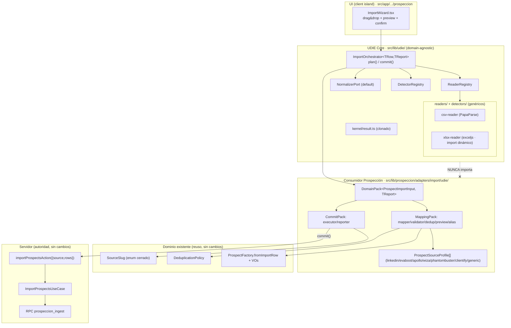

# UDIE — Universal Data Import Engine · Documento de Arquitectura

> **Estado:** `v1.0 — APROBADO · FUENTE DE VERDAD OFICIAL` · **Fecha:** 2026-06-28 · **Aprobado por:** Dirección
> **Gobernanza:** este documento es la referencia oficial de toda la implementación futura de UDIE. Toda decisión posterior debe ser consistente con él; cualquier modificación que afecte la arquitectura debe justificarse mediante un ADR nuevo en §13.
> **Alcance de esta fase:** SOLO diseño. Sin código, sin ramas, sin commits, sin migraciones, sin PR.
> **Gate:** la implementación (writing-plans → TDD → rama `feat/prospeccion-f1-import` → PR → Release Report) recién se habilita tras la aprobación explícita de Dirección sobre este documento.
> **Método:** 3 arquitecturas independientes evaluadas → síntesis con scoring → 2 críticas adversariales independientes. Veredicto de ambos críticos: `approve-with-changes`, `successCriterionMet = true`. Los cambios requeridos están incorporados (§15).

---

## 0. Resumen ejecutivo

UDIE es un **motor de importación de datos genérico y agnóstico del dominio**, pensado para convertirse en el estándar de ingesta de datos de todo Nexus durante los próximos años. **Prospección Inteligente es su primer consumidor** — no su dueño. La dependencia es **siempre** `UDIE ← consumidores`, nunca al revés.

Se evaluaron tres filosofías de arquitectura genuinamente distintas. La elegida —por criterios técnicos explícitos, no por preferencia— es **UDIE-B: Hexágono de Stage-Ports con un bundle por consumidor (DomainPack)**, injertada con dos ideas concretas de las otras dos: el idiom funcional `Result/ok-err` y los puertos de un solo método (de UDIE-fp), y el **auto-discovery de detectores por score de confianza** (de UDIE-C).

| Arquitectura | Total (10 criterios) | Veredicto |
|---|---|---|
| UDIE-fp · Pipeline funcional + plugin maps | 79 | Más simple y compatible, pero contratos débiles y techo de evolución |
| **UDIE-B · Hexágono Stage-Ports + DomainPack** | **85** | **Elegida** — mejor balance calidad/reuso/evolución |
| UDIE-C · Micro-kernel de plugins data-driven | 72 | La más extensible, pero sobreingenierizada hoy (pierde type-safety) |

La propiedad de mayor valor del diseño: **dos ejes de crecimiento aditivos y no interferentes** que mapean a las dos formas reales de crecer — *formatos* (registries de Readers/Detectors, compartidos entre todos los consumidores) y *dominios* (un DomainPack por consumidor). Ninguno de los dos toca el Core.

---

## 1. Objetivo y principio rector

### 1.1 Objetivo
Diseñar UDIE como una pieza de arquitectura transversal que cualquier módulo de Nexus pueda reutilizar para importar datos estructurados: hoy **Prospección** (leads desde LinkedIn/Evaboot/Apollo/Wiza/Phantombuster/Clientify/CSV genérico); mañana **Clientes, Proveedores, Productos, Inventario, Listas de precios, Órdenes, Contactos, Movimientos**.

### 1.2 Principio rector
> **El núcleo de UDIE no conoce absolutamente nada sobre ningún dominio.** No puede nombrar `Lead`, `Prospect`, `Cliente`, `Producto`, `email`, `cuit` ni `source_slug`. Solo conoce conceptos universales de importación: Archivo, Reader, Detector, Normalizer, Mapper, Validator, Preview, Confirmation, Executor, Report. Toda la lógica de negocio vive en los consumidores.

```
            UDIE (Core genérico, domain-agnostic)
                          ▲
        ┌─────────────┬───┴────┬─────────────┬───────────┐
   Prospección     Clientes  Proveedores   Productos   … (cada uno = 1 DomainPack)
```

### 1.3 Restricciones duras (verificadas contra el código real)
- **Clean Architecture + DDD + Hexagonal** preservados. **Cero lógica de negocio en React** (la UI solo orquesta estado + invoca funciones puras + la server action existente).
- **Reuso del dominio existente** en la capa consumidor: VOs `Email/Cuit/Phone/Website`, `ProspectFactory.fromImportRow`, `DeduplicationPolicy` (cadena `cuit → lower(email) → linkedin_url`), enum cerrado `SourceSlug`.
- **Sin cambios** en la RPC `prospeccion_ingest`, el modelo/migraciones ni el catálogo. La server action existente `importProspectsAction({ source, rows })` ya acepta filas pre-parseadas; Confirm/Execute la reutiliza; el servidor sigue siendo la **autoridad** de validación y deduplicación.
- **`detected_format`** (herramienta exacta) es independiente de **`source_slug`** (enum funcional del catálogo). Verificado: `ProspectImportInput.raw` es free-form y fluye intacto `factory → snapshot → use-case → RPC`, por lo que `detected_format` viaja en `raw._detected_format` con **cero cambio de modelo**.
- **Preview client-side** reutilizando el dominio puro (best-effort, intra-archivo); el servidor sigue siendo la autoridad. **Formatos en alcance ahora:** CSV (PapaParse) + XLSX (exceljs, ya instalado, `import()` dinámico). **Sin `.xls` legacy.** JSON/XML/Sheets son *slots de plugin diseñados* pero **no** implementados ahora.

---

## 2. Las tres arquitecturas evaluadas

### 2.1 UDIE-fp — Pipeline funcional + plugin maps
**Filosofía:** el Core es **una** función de orden superior `runPipeline(stages, ctx)(file)` + un puñado de alias de tipos-función (`Reader`, `Detector`, `Mapper`, `Validator`). Cada etapa es un valor-función; cada plugin es una entrada en un `Record` congelado. Sin clases, sin DI, sin registries con estado.
- **Ventajas:** mínima ceremonia; máxima testabilidad (todo es función pura); reemplazo de etapa = pasar otra función; reuso casi literal del código funcional existente; bundle-friendly por construcción.
- **Desventajas:** contratos débiles (sin `implements`, keys stringly-typed → typos en runtime, no en compile); sin seams para cross-cutting (telemetría/retry); resolución de detector "first non-null" sensible al orden; riesgo de sprawl de funciones sueltas a medida que crecen los formatos.

### 2.2 UDIE-B — Hexágono de Stage-Ports + DomainPack  ✅ *(spine elegida)*
**Filosofía:** cada etapa del pipeline es un **PORT** hexagonal de primera clase (interface de un solo método). El Core es un Orquestador puro que conoce solo los contratos de etapa y el orden; nunca importa una etapa concreta. Un consumidor entrega **un** agregado cohesivo (`DomainPack`) que empaqueta sus etapas de dominio.
- **Ventajas:** reemplazo de etapa *probadamente local* (la firma del orquestador no cambia); el DomainPack es un contrato único y revisable (onboarding de un consumidor = "rellenar el bundle" con el compilador exigiendo completitud); **dos mecanismos de extensión no interferentes** (registries para formatos, DomainPack para entidades) que mapean a los dos vectores reales de crecimiento; boundaries fuertes; reuso íntegro del dominio existente.
- **Desventajas:** más interfaces que un diseño plano (algunas casi vacías al inicio); el DomainPack puede derivar en god-object; dos mecanismos de extensión = costo cognitivo; el `plan/commit` implica re-derivar parte del mapeo en el servidor.

### 2.3 UDIE-C — Micro-kernel de plugins / capability registry (data-driven)
**Filosofía:** un micro-kernel que solo sabe registrar/resolver/ejecutar *capabilities*. Cada etapa es una `Capability<I,O>` registrada por `(stage, key)`. El pipeline **no es código, es DATA**: un `ImportJob` describe qué capabilities corren y en qué orden.
- **Ventajas:** extensibilidad máxima en runtime (nuevas etapas/órdenes/branches/variantes por-tenant = data); auto-discovery de detectores; contrato uniforme único; auto-validación en el registro; preview = `stopAfter:'validator'`.
- **Desventajas:** **borra la seguridad de tipos** (`Envelope<unknown>` cruzando etapas); sobreingeniería para la necesidad real (Prospección necesita UN pipeline lineal); impuesto de indirección al debuggear; kernel = código crítico compartido; mayor costo de onboarding.

---

## 3. Matriz comparativa y scoring

Escala 1–10, **mayor = mejor** en todos los criterios (para *simplicidad/complejidad/impacto/costo*, mayor = más simple / menor complejidad / menor impacto / menor costo). Criterios homogéneos definidos por Dirección.

| Criterio | UDIE-fp | **UDIE-B** | UDIE-C | Justificación breve |
|---|:---:|:---:|:---:|---|
| Mantenibilidad | 8 | **9** | 7 | B: cada puerto es testeable aislado; C: kernel crítico compartido |
| Simplicidad (conceptual) | 9 | 6 | 3 | fp: una HOF; C: triada kernel/registry/descriptor |
| Escalabilidad | 7 | 9 | 10 | C: pipeline-as-data; B: dos ejes aditivos; fp: HOF fija la forma |
| Reutilización (cross-módulo) | 7 | 9 | 9 | B/C: contrato formal por consumidor; fp: bag de funciones |
| Complejidad estructural (menor=mejor) | 9 | 6 | 3 | C introduce un intérprete de datos |
| Compatibilidad con Blueprint | 7 | 10 | 7 | El Blueprint manda hexagonal/ports/ADR/contratos explícitos → B nativo |
| Facilidad nuevos dominios | 7 | 9 | 8 | B: 1 DomainPack; compilador exige completitud |
| Facilidad nuevos formatos | 8 | 9 | 9 | Reader/Detector registry compartido; C auto-discovery |
| Impacto sobre código existente (menor=mejor) | 10 | 9 | 8 | fp ≈ re-empaquetado; B/C agregan estructura |
| Costo de evolución (menor=mejor) | 7 | 9 | 8 | B: aditivo por ejes; C: potente pero pesado |
| **TOTAL** | **79** | **85** | **72** | |

**Conclusión:** UDIE-B gana por el **mejor balance** entre calidad arquitectónica, reutilización y evolución multi-año — explícitamente **no** la más simple (fp) ni la más extensible-pero-pesada (C). Coincide con el scoring independiente de la síntesis (B = 8.4 / fp = 8.0 / C = 7.6).

---

## 4. Arquitectura elegida (definitiva)

**UDIE-B (Stage-Port Hexagon + DomainPack)** con dos injertos:
1. **De UDIE-fp:** los puertos son interfaces de **un solo método** (no clases con estado), apoyados en el idiom `Result/ok-err` ya presente en `src/lib/prospeccion/domain/result.ts` (clonado al Core, ver §15). Esto los hace triviales de faker en vitest y *house-native*.
2. **De UDIE-C:** el **DetectorRegistry con auto-discovery** — itera todos los detectores registrados, cada uno devuelve `{format, confidence}` en escala **0..1**, gana el máximo; un override manual de la UI siempre prevalece.

El Core es un **Orquestador tipado** de **topología lineal fija** con **un slot opcional de enriquecimiento reservado** (`EnricherPort`, ver §7.4) y dos registries vacíos (Readers, Detectors). Genérico sobre `TRow` (forma de fila del consumidor) y `TReport` (resultado de commit del consumidor), sin cota superior más allá de `Record<string, unknown>`.

El flujo se parte en **dos fases** alrededor de la confirmación humana:
- **`plan(file)`** → fase A, client-side, best-effort: `Reader → Detector → Normalizer → (Enricher?) → Mapper → Validator → Preview`. Devuelve un `PreviewModel`.
- **`commit(decision, mapped)`** → fase B: el `ExecutorPort` envuelve la **server action existente** `importProspectsAction({ source, rows })`. El servidor re-valida y re-deduplica (autoridad única).

---

## 5. Separación Core / Consumidores

### 5.1 Ubicación
| Capa | Ruta | Contenido |
|---|---|---|
| **Core (genérico)** | `src/lib/udie/**` | `kernel/` (orquestador + puertos + `result.ts` clonado + tipos `RawTable/PreviewModel/ImportReport/FieldDiagnostic/DetectedFormat`), `readers/` y `detectors/` (adapters de formato, agnósticos del dominio) |
| **Consumidor (Prospección)** | `src/lib/prospeccion/adapters/import/udie/**` | `DomainPack` (mapper/validator/dedup/preview/executor/reporter), perfiles por herramienta, alias `HEADER_ALIASES` propios, wiring (composition file) |
| **UI** | `src/app/(app)/comercial/prospeccion/ImportWizard.tsx` | Client island: drag&drop con tokens del design system, corre `plan()` y renderiza el preview, en Confirm llama `commit()` |

### 5.2 Agnosticismo del dominio — enforcement por **tres** mecanismos (no por convención)
1. **Type-level:** todo símbolo del Core referencia solo genéricos, `unknown` o tipos de *importación* (sobre archivos/tablas), nunca entidades. El conocimiento de dominio solo entra por el `DomainPack` inyectado en el constructor del orquestador.
2. **Import-level:** zona ESLint `no-restricted-imports`/`no-restricted-paths` que prohíbe a `src/lib/udie/**` importar `src/lib/prospeccion/**` o cualquier contexto hermano.
3. **CI grep test (guardia PRIMARIA):** un test que falla el build si aparece **cualquier** referencia a símbolos de `prospeccion/clientify/recon` bajo `src/lib/udie/**`. Es la guardia principal porque las zonas de lint son evitables (re-exports, type-only imports, alias `@/` vs relativo).

> **Cambio incorporado (crítica):** hoy `.eslintrc.json` **no** tiene `no-restricted-imports` (verificado). La zona de lint **y** el grep test deben **autorearse y demostrarse con un test rojo** (un import deliberado a `prospeccion` debe romper el build) antes de afirmar que el boundary está "enforced".

### 5.3 Canary de agnosticismo
Un **`DomainPack<FakeRow, FakeCommit>` sintético** que compila y corre en los tests del Core: prueba mecánicamente que el Core funciona con una entidad que **no** es Prospect, y actúa de *canary* de versionado (si un cambio del Core rompe el contrato genérico, este test falla antes de tocar cualquier consumidor real).

---

## 6. Pipeline objetivo (10 etapas)

```
Archivo
  │
  ▼  Reader ............... File/Blob → RawTable {headers, rows, sourceName}   [PLUGIN: ReaderRegistry, resolve por accepts()]
  ▼  Detector ............ RawTable → {format, confidence∈[0,1]}              [PLUGIN: DetectorRegistry, auto-discovery, max gana, override UI]
  ▼  Normalizer .......... RawTable → RawTable (trim, BOM, dedupe columnas)   [default del Core; consumidor rara vez override]
  ▼  (Enricher?) ......... RawTable → RawTable (slot OPCIONAL reservado)      [PLUGIN opcional, no-op por defecto]
  ▼  Mapper .............. fila normalizada → TRow ; estampa raw._detected_format [PLUGIN: en el DomainPack, alias propios]
  ▼  Validator ........... TRow → {outcome, FieldDiagnostic[]} (best-effort)   [PLUGIN: en el DomainPack; delega a ProspectFactory]
  ▼  Preview ............. agrega kept/duplicado/rechazado + stats + muestra   [fin de FASE A · plan()]
  ─────────────────  Confirmation (suspensión humana: {proceed, source})  ─────────────────
  ▼  Executor ............ TRow[] → Result<TReport> (envuelve importProspectsAction) [PLUGIN: en el DomainPack]
  ▼  Persistencia ........ ImportProspectsUseCase → RPC prospeccion_ingest (atómica, re-valida, re-deduplica, Outbox) [FUERA del motor]
```

Cada etapa es **reemplazable sin afectar al resto** porque el Core solo conoce el *tipo* del puerto. Cambiar XLSX-Reader por CSV-Reader, o LinkedIn-Detector por Apollo-Detector, es elegir otro valor del registry — ninguna otra etapa cambia.

---

## 7. Interfaces de costura (puertos del Core)

> Firmas definitivas, **con las correcciones de las críticas** ya aplicadas (TReport genérico, split del DomainPack, EnricherPort opcional, `SourceProfile` resuelto como construcción del consumidor).

### 7.1 Tipos universales de importación (Core)
```ts
type RawRow = Record<string, string>;
interface RawTable { headers: string[]; rows: RawRow[]; sourceName: string }
type DetectedFormat = string & { readonly __brand: 'DetectedFormat' };
interface FieldDiagnostic { level: 'error' | 'warn'; code: string; field?: string; message: string }
type DedupStatus = 'nuevo' | 'posible' | 'exacto';            // 🟢 / 🟡 / 🔴
// Result<T> = { ok:true; value:T } | { ok:false; error:DomainError }   (clonado en src/lib/udie/kernel/result.ts)
```

### 7.2 Puertos de etapa (un método cada uno)
```ts
interface ReaderPort { id: string; accepts(f:{name:string;type:string}): boolean; read(f: Blob): Promise<Result<RawTable>> }
interface FormatDetectorPort { id: string; detect(t: RawTable): { format: DetectedFormat; confidence: number } | null }  // confidence ∈ [0,1]
interface NormalizerPort { normalize(t: RawTable, fmt: DetectedFormat): RawTable }                                       // default agnóstico en el Core
interface EnricherPort { enrich(t: RawTable, fmt: DetectedFormat): Promise<RawTable> }                                   // OPCIONAL; default no-op
interface MapperPort<TRow> { format: DetectedFormat; map(row: RawRow, fmt: DetectedFormat): TRow }                       // estampa raw._detected_format
interface ValidatorPort<TRow> { validate(row: TRow): RowOutcome }   // RowOutcome = { valid: boolean; diagnostics: FieldDiagnostic[] } — refinamiento de impl. de 'kept'/'rejected'
interface DedupKeyExtractorPort<TRow> { keysOf(row: TRow): Record<string,string|null>; primaryKey(row: TRow): string|null }
interface PreviewBuilderPort<TRow> { build(rows: TRow[], outcomes: RowOutcome[], fmt: DetectedFormat /* + sourceSlug, unmappedHeaders, columnas en impl. */): PreviewModel<TRow> }
interface ExecutorPort<TRow, TReport> { execute(rows: TRow[], source: string): Promise<Result<TReport>> }
interface PersistenceReporterPort<TReport> { toReport(r: TReport): ImportReport }                                        // ImportReport queda extensible (§15)
```

### 7.3 DomainPack — **partido por cadencia de cambio** (corrección de crítica)
En vez de un agregado único de ~9 miembros (god-object), se separa en dos sub-packs por *cadencia de cambio*, más el enricher opcional:
```ts
// Volátil (cambia seguido): mapeo y reglas de fila
interface MappingPack<TRow> {
  aliases: Record<string, keyof TRow>;          // ¡por consumidor!, no global (corrección ADR-6)
  mapperFor(fmt: DetectedFormat): MapperPort<TRow>;
  normalizer?: NormalizerPort;                   // opcional; usa el default del Core si falta
  enricher?: EnricherPort;                       // opcional; no-op por defecto
  validator: ValidatorPort<TRow>;
  dedup: DedupKeyExtractorPort<TRow>;
  preview: PreviewBuilderPort<TRow>;
}
// Estable (casi nunca cambia): transporte/persistencia
interface CommitPack<TRow, TReport> {
  executor: ExecutorPort<TRow, TReport>;
  reporter: PersistenceReporterPort<TReport>;
}
interface DomainPack<TRow, TReport> {
  contextId: string;
  mapping: MappingPack<TRow>;
  commit: CommitPack<TRow, TReport>;
}
```

### 7.4 Orquestador y registries
```ts
class ImportOrchestrator<TRow, TReport> {
  constructor(deps: {
    readers: ReaderRegistry;
    detectors: DetectorRegistry;
    pack: DomainPack<TRow, TReport>;
    defaultNormalizer: NormalizerPort;
  });
  plan(file: Blob, override?: { format?: DetectedFormat }): Promise<Result<PreviewModel<TRow>>>;     // FASE A
  commit(decision: { proceed: boolean; source: string }, mapped: TRow[]): Promise<Result<ImportReport>>; // FASE B
}
interface ReaderRegistry   { register(r: ReaderPort): void;        resolve(f:{name:string;type:string}): ReaderPort | null; list(): readonly ReaderPort[] }
interface DetectorRegistry { register(d: FormatDetectorPort): void; detect(t: RawTable): { format: DetectedFormat; confidence: number } | null; list(): readonly FormatDetectorPort[] }
```
- **`register()` es fail-closed:** rechaza un `id` duplicado (no override silencioso).
- **Registries frescos por instancia de orquestador** (factory por consumidor), **sin** singleton mutable a nivel módulo → acota el blast-radius de conflictos de plugins entre consumidores y aísla los tests.

### 7.5 `SourceProfile` — resuelto (no fantasma)
`SourceProfile` **no** es miembro del contrato del Core (eso lo volvía fantasma). Es una construcción **interna del consumidor**: un objeto por herramienta que centraliza su configuración y de la cual el consumidor *deriva* sus detectores (signature), su `mapperFor`, y el mapeo `detectedFormat → sourceSlug`:
```ts
// interno del consumidor Prospección
interface ProspectSourceProfile {
  detectedFormat: DetectedFormat;     // "Evaboot"
  sourceSlug: SourceSlugValue;        // "csv" (enum cerrado del catálogo)
  label: string;                      // "Evaboot"
  signatureHeaders: string[];         // para construir el FormatDetectorPort
  mapper: MapperPort<ProspectImportInput>;
}
```

---

## 8. Estrategia de plugins

**Dos mecanismos aditivos, por diseño no interferentes**, que mapean a los dos ejes reales de crecimiento:

1. **Etapas GENÉRICAS (Readers, Detectors)** → se registran en los registries del Core en el *composition file* del consumidor (o un barrel compartido), **nunca** editando el Core:
   - Agregar formato (CSV/XLSX/JSON/XML/Sheets) = escribir un `ReaderPort` + un `register()`.
   - Agregar fuente (LinkedIn/Apollo/Wiza/HubSpot/Clientify/Sheets/LLM-MCP) = escribir un `FormatDetectorPort` + un `register()`; **auto-participa** vía max-confidence; el override de UI siempre gana.
   - Un Reader/Detector agregado para *Productos* queda **instantáneamente disponible** para *Leads*: la cobertura de formatos es un activo compartido que se acumula.

2. **Etapas de DOMINIO (mapper/validator/dedup/preview/executor/reporter)** → empaquetadas en **un DomainPack** inyectado al orquestador:
   - Agregar un consumidor (Clientes/Proveedores/Productos/…) = escribir **un** `DomainPack<TRow,TReport>` en su propia carpeta; cero cambio del Core; el compilador exige completitud.

**Disciplina:** *register-before-construct*; un composition file por consumidor; la topología lineal fija es deliberada — si un consumidor futuro necesita branching/multi-sheet, instancia un **segundo** orquestador reusando los mismos puertos, en vez de convertir el Core en un intérprete de datos.

---

## 9. Estrategia de versionado

El Core se versiona como una **frontera de paquete interno estable** (`src/lib/udie/`) con disciplina SemVer, aunque viva in-repo:
- **PUBLIC CONTRACT (congelado):** las firmas de los puertos de etapa + `DomainPack`/`MappingPack`/`CommitPack` + los tipos de valor (`RawTable`, `PreviewModel`, `ImportReport`, `FieldDiagnostic`, `DetectedFormat`).
- **MAJOR** = cambio en una firma de puerto (rompe a todos los DomainPacks) → revisión como breaking; migración coordinada de todos los packs en un solo cambio. Debe ser **raro**.
- **MINOR** = agregado *opcional* (campos opcionales nuevos en `PreviewModel/ImportReport`, miembros opcionales del pack, **activar el `EnricherPort` reservado**) → no-breaking por construcción.
- **PATCH** = comportamiento interno del orquestador, el Normalizer default, adapters individuales de Reader/Detector.
- **Plugins** (Readers/Detectors) llevan `id` string estable y se versionan **independientes** del Core (se resuelven en runtime).
- **DomainPacks** se versionan con su bounded context (viven en `src/lib/<ctx>/`), cada equipo evoluciona a su cadencia sin tocar UDIE.
- **Regla de estabilidad:** lo *entity-specific* va al DomainPack; lo *format-specific* va a un plugin Reader/Detector; **solo** capacidades genuinamente transversales y agnósticas (telemetría, streaming de archivos grandes) justifican un MAJOR del Core.

---

## 10. Estrategia de testing

Cuatro capas, todas vitest, en el estilo `Result/ok-err` ya existente:
1. **Core unit con ENTIDAD FALSA:** orquestador, registries, Normalizer default y agregación de Preview contra un `DomainPack<FakeRow, FakeCommit>` sintético → prueba que el Core es genuinamente agnóstico (corre con una entidad que no es Prospect) y es el *canary* de versionado. `commit()` llama al Executor exactamente una vez con `proceed=true` y cero con `proceed=false`.
2. **Plugin unit con FIXTURES REALES:** cada Reader contra archivos exportados reales commiteados como fixtures — `tests/fixtures/import/{linkedin,evaboot,apollo,wiza,phantombuster,clientify,generic}.csv` + `sample.xlsx`; cada Detector con su `{format, confidence}` esperado, incluida la resolución de ambigüedad (Evaboot vs Generic) por max-confidence + override. Edge-cases del tokenizer CSV (comas entre comillas, comillas dobladas, BOM, CRLF, saltos de línea dentro de comillas) reutilizando/extendiendo `csv-parser.test.ts`.
3. **Consumer unit:** el Mapper de prospect (estampa `raw._detected_format`, mapea por alias), el Validator (delega a `ProspectFactory.fromImportRow`; reutiliza casos de `prospect.test.ts`: identidad faltante, email/cuit inválidos), el dedup (delega a `DeduplicationPolicy`; reutiliza `deduplication-policy.test.ts`).
4. **Consumer integration:** end-to-end `plan(file) → PreviewModel → commit()` con `ExecutorPort` *fake* que captura `{source, rows}` para asegurar que pasa el `SourceSlug` correcto y que `raw._detected_format` viaja intacto; + un **contract test** que asegura que la firma de `importProspectsAction` sigue aceptando las filas producidas (guarda contra drift).
- **CI grep test** (guardia primaria): cero imports de contextos hermanos bajo `src/lib/udie/**`, **con un test rojo** que demuestre que el boundary realmente dispara.
- **Aislamiento:** registries frescos por test (sin singleton mutable compartido).

---

## 11. Estrategia de evolución (horizonte multi-año)

El trabajo a futuro es abrumadoramente *"agregar un formato"* y *"agregar un consumidor"*, ambos **aditivos sin tocar el Core**:
- **Nuevo consumidor** (Clientes/Productos/…): un `DomainPack<TRow,TReport>` en su carpeta, reusando Readers/Detectors compartidos; su Validator envuelve la factory/VOs de *su* dominio, su Executor envuelve *su* server action/RPC, su dedup *su* policy. El Core no aprende el nombre de la entidad; el compilador exige completitud.
- **Nuevo formato** (JSON/XML/Google Sheets): un `ReaderPort` + `register()` → disponible para **todos** los consumidores; deps pesadas code-split por `import()` dinámico.
- **Nuevo detector** (Apollo/Wiza/HubSpot/Clientify/Sheets/LLM-MCP): un `FormatDetectorPort` + `register()`; auto-participa por max-confidence con override.
- **Enriquecimiento por-fila** (Apollo/Wiza para completar datos): el `EnricherPort` ya está **reservado como slot opcional entre Normalizer y Mapper** → activarlo es un **MINOR**, no un MAJOR (corrección de crítica; ver §15).
- **Branching / multi-sheet** (Listas de precios con reconciliación de moneda, Inventario con catalog-matching): instanciar un **segundo orquestador** que reusa los mismos puertos en otra composición — sin convertir el Core en intérprete de datos.
- **Preview server-side** para archivos muy grandes (más allá de `MAX_BATCH=500` client best-effort): un adapter `planRemote` sin cambiar el contrato de `plan()` del cliente.

---

## 12. Diagramas

### 12.1 Componentes (Core vs Consumidor)


### 12.2 Flujo (dos fases · plan / commit)


---

## 13. ADRs (ledger)

### ADR-1 — Hexágono de Stage-Ports + DomainPack (sobre pipeline funcional o micro-kernel data-driven)
**Decisión:** modelar cada etapa como un puerto de un solo método; cada consumidor aporta un `DomainPack<TRow,TReport>`; el Core es un `ImportOrchestrator` tipado de topología lineal fija con dos registries vacíos.
**Justificación:** los dos ejes reales de crecimiento son *formatos* y *entidades*; los puertos de primera clase dan reemplazo de etapa probadamente local y permiten dos mecanismos no interferentes. Elegida sobre UDIE-fp (sin contratos nominales) y UDIE-C (pierde type-safety, sobreingeniería para hoy). Puertos de un solo método (injerto fp) lo mantienen testeable y house-native.
**Consecuencias:** más interfaces que un diseño plano (algunas casi vacías al inicio); el pack podía derivar en god-object → mitigado por el split en MappingPack/CommitPack (ADR-7) y miembros opcionales con defaults del Core.

### ADR-2 — Dos fases `plan()`/`commit()` con el servidor como autoridad única
**Decisión:** `plan(file)` (cliente, best-effort, Reader..Preview) y `commit(decision, mapped)` (Executor envuelve la `importProspectsAction` existente; la RPC re-valida y re-deduplica).
**Justificación:** mapea a la UX real (preview cliente, autoridad servidor) y respeta la restricción de no tocar RPC/DB/catálogo.
**Consecuencias:** parte del mapeo del cliente se re-deriva en el servidor (se ejecuta dos veces). Aceptado: el preview es explícitamente *advisory*; un *contract test* guarda contra drift de firma.

### ADR-3 — `detected_format` en `raw._detected_format`; `source_slug` sigue siendo el enum cerrado
**Decisión:** el Mapper del consumidor estampa la herramienta detectada en `row.raw._detected_format` (string branded), desacoplado de `source_slug` (enum cerrado pasado a `commit()`).
**Justificación:** verificado en código — `raw` es free-form y fluye intacto `fromImportRow → toSnapshot → use-case → RPC`; cero cambio de modelo/migración/catálogo.
**Consecuencias:** `detected_format` no es columna queryable de primera clase (vive en JSON `raw`); reporting por herramienta requerirá a futuro una vista/índice sobre `raw->>'_detected_format'`, fuera de UDIE y de la restricción de no-DB-change.

### ADR-4 — Auto-discovery de detectores por max-confidence con override de UI obligatorio
**Decisión:** el `DetectorRegistry` itera todos los detectores; cada uno devuelve `{format, confidence∈[0,1]}`; gana el máximo; el override del dropdown de UI siempre gana.
**Justificación:** injerto de UDIE-C acotado a detectores (donde la ambigüedad es real: Evaboot vs Generic). Nuevos detectores auto-participan al registrarse; el override garantiza que el humano nunca queda bloqueado por una heurística errada.
**Consecuencias:** el confidence debe estar **calibrado en escala 0..1 documentada con tie-break determinista** y testeado contra fixtures reales; el orden de iteración no debe ser load-bearing.

### ADR-5 — Dependencia hacia adentro enforced por CI grep (primaria) + lint zone (secundaria) + test de Core con entidad falsa
**Decisión:** `no-restricted-imports`/`no-restricted-paths` prohibiendo a `src/lib/udie/**` importar contextos hermanos, **+** un CI grep test como guardia **primaria**, **+** un test de conformidad del Core con un `DomainPack<FakeRow,FakeCommit>`.
**Justificación:** hace el agnosticismo mecánico (el build falla ante fuga), no aspiracional, y prueba que el Core corre con una entidad no-Prospect. El grep es primario porque las zonas de lint son evitables (re-exports/type-imports/alias).
**Consecuencias:** algo más de superficie de CI; el contribuidor debe poner lógica de entidad en el DomainPack y de formato en plugins, nunca en el Core. **Debe demostrarse con un test rojo** antes de declararse "enforced".

### ADR-6 (revisado) — Tokenizer CSV agnóstico compartido; `HEADER_ALIASES` **por DomainPack** (no global); exceljs `import()` dinámico
**Decisión:** mantener el tokenizer sync quote-aware (`splitCsvLine`) **compartido y entity-blind** en el Reader CSV del Core; **mover el mapa de alias al MappingPack/perfil del consumidor** (es `keyof TRow`, entity-specific); cargar exceljs por `await import` solo dentro del Reader XLSX; **sin `.xls` legacy**.
**Justificación:** el mapa de alias del F0 es específico de `ProspectImportInput`; como const global se rompe en el consumidor #2. El tokenizer en cambio es agnóstico y se comparte. Mantiene PapaParse/exceljs fuera del dominio y el bundle chico.
**Consecuencias:** cada consumidor define sus propios alias; `parseCsv` (server fallback, sync) se mantiene y su test sigue verde importando el tokenizer compartido.

### ADR-7 — `DomainPack` partido por cadencia de cambio + `EnricherPort` reservado opcional
**Decisión:** partir el `DomainPack` en `MappingPack` (volátil) y `CommitPack` (estable); reservar **ahora** un `EnricherPort` opcional (no-op por defecto) entre Normalizer y Mapper.
**Justificación:** evita el trampa god-object/MAJOR-bump (la crítica mostró que agregar enrichment más tarde sería un MAJOR que ripplea a todos los packs); el enrichment (Apollo/Wiza) es casi seguro en el roadmap, así que reservarlo cuesta cero y lo vuelve un MINOR.
**Consecuencias:** dos sub-packs que aprender (mitigado: split por cadencia es intuitivo); el enricher por defecto es identidad.

### ADR-8 — `ImportReport`/`TReport` extensible por consumidor
**Decisión:** `ExecutorPort<TRow,TReport>` y `PersistenceReporterPort<TReport>` son genéricos sobre `TReport`; `ImportReport` (insertados/duplicados/rechazados/tiempo) es el `TReport` concreto de Prospección, no un triple fijo del Core.
**Justificación:** la crítica mostró que Inventario/Movimientos/Listas pueden tener commits multi-entidad/partial-success que no caben en un triple fijo sin filtrar dominio al Core. El `TReport` del prospect debe ser `ImportProspectsActionResult` (lo que la action realmente devuelve), no el `IngestResult` interno.
**Consecuencias:** el reporter de cada consumidor traduce su `TReport` a un `ImportReport` para la UI, o la UI consume el `TReport` tipado.

### ADR-9 — Regla arquitectónica vinculante: el Core de UDIE es agnóstico del dominio (AP-UDIE-1)
**Decisión:** se establece como **regla arquitectónica del proyecto** que `src/lib/udie/**` **jamás** puede conocer ni referenciar conceptos de negocio — entre ellos `Lead`, `Prospect`, `Cliente`, `Producto`, `Inventario`, `CUIT`, `SourceSlug`, `CRM` o cualquier otro. El Core solo conoce conceptos **universales de importación** (Archivo, Reader, Detector, Normalizer, Mapper, Validator, Preview, Confirmation, Executor, Report). Toda lógica de negocio pertenece **exclusivamente** a los consumidores.
**Justificación:** es la propiedad que permite que UDIE sea el motor estándar de importación de todo Nexus por años; sin ella, el Core se acopla al primer dominio y deja de ser reutilizable.
**Enforcement (mecánico, no aspiracional):** (1) lint zone `no-restricted-imports`/`no-restricted-paths` sobre `src/lib/udie/**`; (2) **CI grep test como guardia primaria** (cero referencias a símbolos de contextos hermanos) con un **test rojo** que demuestre que dispara; (3) test de conformidad del Core con un `DomainPack<FakeRow,FakeCommit>` sintético. Ver §5.2.
**Consecuencias:** el contribuidor debe ubicar lógica de entidad en el DomainPack y lógica de formato en plugins; nunca en el Core. Una violación rompe el **build**, no la revisión.

### ADR-10 — Regla de evolución conservadora del Core (AP-UDIE-2)
**Decisión:** **no se incorpora ninguna capacidad nueva al Core de UDIE salvo que existan al menos DOS consumidores reales que la justifiquen.** Se prefiere un Core pequeño, estable y altamente reutilizable antes que anticipar necesidades futuras.
**Justificación:** evita el "síndrome UDIE-C" (deriva hacia un framework sobreingenierizado: intérprete data-driven, hooks genéricos, multi-tenant especulativo). La potencia especulativa no se paga hasta que existen múltiples consumidores con necesidades divergentes (§16).
**Consecuencias:** mientras haya un solo consumidor, todo crecimiento es por **plugin** (formato) o por **DomainPack** (entidad), nunca por cambio del Core. Promover algo al Core es una decisión deliberada, revisada y respaldada por ≥2 casos de uso reales, registrada con su propio ADR.

---

## 14. Riesgos y mitigaciones

| # | Riesgo | Mitigación |
|---|---|---|
| R1 | Over-design de interfaces (Normalizer/Preview casi vacíos al inicio) | Normalizer default en el Core; miembros del pack opcionales; congelar firmas recién tras el 2º consumidor |
| R2 | `DomainPack` god-object / trampa MAJOR-bump | Split MappingPack/CommitPack por cadencia; `EnricherPort` opcional reservado (ADR-7) |
| R3 | Doble mapeo (cliente + servidor) puede driftear | Contract test sobre la firma de la action; preview explícitamente *advisory*; servidor autoridad |
| R4 | Calibración de confidence de detectores | Escala 0..1 documentada + tie-break + tests por fixture real; override UI siempre gana |
| R5 | Techo de topología lineal (enrichment/branching) | `EnricherPort` reservado (MINOR) + patrón de 2º orquestador documentado |
| R6 | `detected_format` no es first-class | Fuera de alcance ahora (no-DB-change); flag para capa de reporting futura |
| R7 | Registry como estado compartido / conflicto de plugins | `register()` fail-closed ante id duplicado; registries frescos por instancia (factory) |
| R8 | Creep del bundle cliente (VOs + PapaParse + readers) | exceljs `import()` dinámico; VOs son puras/tree-shakeable; opción `planRemote` server-side si hiciera falta |
| R9 | Boundary "enforced" hoy es ficción (no hay lint zone) | Autorear lint zone **+** CI grep (primaria) **+ test rojo** que lo demuestre antes de aprobar |

---

## 15. Críticas adversariales y respuesta explícita del diseño

Dos críticos independientes (lentes: *fuga de dominio/pureza* y *extensibilidad multi-año/plugins/versionado*). Ambos: **`approve-with-changes`**, **`successCriterionMet = true`**. El eje de formatos (Readers/Detectors) y el de entidades (DomainPacks) fueron verificados como genuinamente Core-stable. Cada **cambio requerido** y su resolución:

| # | Cambio requerido por la crítica | Resolución en este diseño |
|---|---|---|
| C1 | **Contrato Executor/`TReport` mal tipado** (la action devuelve `ImportProspectsActionResult`, no `IngestResult`) | ADR-8: `TReport` genérico; `TReport` de prospect = `ImportProspectsActionResult`; reporter maneja `ok:false`. `IngestResult` queda interno. |
| C2 | **Boundary lint es ficción hoy** (`.eslintrc.json` no tiene `no-restricted-imports`) | ADR-5 / §5.2: CI grep como guardia **primaria** + lint zone secundaria + **test rojo** obligatorio antes de aprobar. |
| C3 | **`Result` debe clonarse al Core** (hoy `prospect.ts` lo importa relativo) | §7.1 / §5.1: `src/lib/udie/kernel/result.ts` clonado; test de cero-imports-de-prospeccion bajo `udie/**`. |
| C4 | **`HEADER_ALIASES` global se rompe en consumidor #2** | ADR-6 revisado: alias **por MappingPack/perfil**; tokenizer agnóstico compartido. |
| C5 | **`DomainPack` god-object / MAJOR-bump al sumar EnricherPort** | ADR-7: split MappingPack/CommitPack + `EnricherPort` opcional reservado (enrichment = MINOR). |
| C6 | **`SourceProfile` fantasma** (en el contrato pero nadie lo consume) | §7.5: removido del contrato del Core; definido como construcción **interna del consumidor** que alimenta detectores + `mapperFor` + `format→slug`. |
| C7 | **`ImportReport` triple fijo no sirve a multi-entidad** | ADR-8: `TReport` genérico/extensible; el triple queda como `TReport` concreto de Prospección. |
| C8 | **Regresión de bundle: VOs al cliente** (eran server-only) | §11 / R8: VOs son puras/tree-shakeable → aceptable; opción `planRemote` server-side documentada; UDIE **diverge deliberadamente** del patrón FormData+route-handler de `ConciliacionUploader` (parse cliente para preview instantáneo) — declarado explícitamente. |
| C9 | **Dedup de preview = solo intra-archivo** | §6 / R3: semántica intra-archivo declarada en copy de UI; autoridad final = `commit()` vía RPC (dedup cross-batch contra la DB). |
| C10 | **`MAX_BATCH=500` invisible al preview** | El `plan()` conoce `MAX_BATCH` y **avisa/chunkea** cuando `rows > 500`, para que el Preview no diverja del `commit()`. |
| C11 | **Confidence sin escala/tie-break** | ADR-4: escala 0..1 documentada + tie-break determinista + calibración por fixtures. |
| C12 | **Semántica de `register()` y registries compartidos** | §7.4: `register()` rechaza id duplicado; registries frescos por instancia (factory por consumidor). |

### 15.1 Decisiones aceptadas como costo o fuera de alcance (documentadas, sin deuda implícita)

No todas las observaciones se "arreglan": algunas se **aceptan como costo consciente** o se dejan **fuera del alcance de F1**. Para que ninguna quede como deuda implícita, se documenta aquí cada una con su motivo:

| Observación | Decisión | Motivo |
|---|---|---|
| Doble mapeo cliente↔servidor (parte del mapeo del `plan()` se re-deriva en el servidor) | **Aceptada como costo** | Es el precio de una frontera de autoridad confiable: el servidor debe re-validar/re-deduplicar. El preview es explícitamente *advisory*; un *contract test* guarda contra drift de firma. Ver ADR-2 / R3. |
| `detected_format` no es columna queryable de primera clase (vive en `raw` JSON) | **Fuera de alcance F1** | La restricción dura es *cero cambio de modelo/migración/catálogo*. Reporting por herramienta requerirá a futuro una vista/índice sobre `raw->>'_detected_format'`, en una capa externa a UDIE. Ver ADR-3 / R6. |
| Soporte de `.xls` binario legacy | **Fuera de alcance (YAGNI)** | Ninguna herramienta de prospección moderna (LinkedIn/Evaboot/Wiza/Apollo) exporta `.xls`; agregarlo exige una dependencia nueva (SheetJS, con historial de CVEs). Si aparece la necesidad real, es un Reader plugin nuevo, sin tocar el Core. |
| Preview server-side para archivos muy grandes (más allá de `MAX_BATCH=500`) | **Diseñado, no implementado en F1** | Se reserva el patrón `planRemote` (adapter server-side) sin cambiar el contrato de `plan()`. F1 opera en el rango client best-effort + aviso/chunk al superar `MAX_BATCH`. Ver §11 / C10. |
| `EnricherPort` (enriquecimiento Apollo/Wiza por fila) | **Reservado como slot opcional, no-op en F1** | El roadmap lo vuelve casi seguro; reservarlo ahora como puerto opcional convierte su activación futura en un **MINOR**, no un MAJOR. No se implementa lógica de enriquecimiento en F1. Ver ADR-7 / §11. |

---

## 16. Self-Review crítico

**¿Qué decisiones podrían resultar equivocadas dentro de dos años?**
- La **topología lineal fija**. Si más de un consumidor necesita branching/multi-sheet/enrichment pesado, el patrón "segundo orquestador" puede sentirse como duplicación. Mitigado por el `EnricherPort` reservado, pero si el enrichment se vuelve la norma, conviene promover el Enricher a etapa estándar (MINOR ya previsto). Señal de alarma a vigilar: el 2º o 3er consumidor pidiendo formas no-lineales el día uno.
- El **split MappingPack/CommitPack** podría resultar un corte por la junta equivocada (¿`dedup` es realmente volátil?). Es ajustable, pero cambiar el corte después es breaking.
- **`detected_format` en JSON `raw`** estará bien hasta que el negocio quiera analítica por herramienta; ahí hará falta una vista/índice (fuera de UDIE).

**¿Qué decisiones podrían simplificarse?**
- `NormalizerPort` y `PreviewBuilderPort` podrían ser, al inicio, funciones default del Core sin exponerse como puertos override hasta que un consumidor lo necesite (YAGNI). Empezar con menos puertos y promover a puerto cuando aparezca el segundo caso de uso.
- Si tras el segundo consumidor se ve que nadie sobrescribe el Normalizer ni el Enricher, colapsar ambos en el default reduce superficie.

**¿Qué partes conviene mantener deliberadamente pequeñas?**
- El **Core (`src/lib/udie/`)**: orquestador + puertos + registries + result + readers genéricos. Nada más. Cualquier cosa entity-specific o format-specific vive afuera.
- Los **puertos**: un método cada uno. Si un puerto crece a varios métodos, es señal de que está absorbiendo responsabilidad que debería partirse.
- El **DomainPack**: un record de puertos delgados, no un objeto con comportamiento propio.

**¿Qué riesgo hay de convertir UDIE en un framework excesivamente complejo, y cómo evitarlo?**
- El riesgo real es el **"síndrome UDIE-C"**: caer en un intérprete data-driven, un sistema de hooks genérico, o capacidades especulativas (multi-tenant, branching configurable) **antes** de tener consumidores que las pidan. La crítica lo marcó: la potencia de C no se paga hasta que existen muchos consumidores con pipelines divergentes.
- **Cómo evitarlo (regla de gobernanza):** *no se agrega ninguna capacidad al Core sin al menos dos consumidores reales que la necesiten.* Mientras tanto, todo crecimiento es por plugin (formato) o por DomainPack (entidad). El Core permanece chico, tipado y aburrido — que es exactamente lo que un motor estándar debe ser para durar años.

---

## 17. Criterio de aprobación y próximos pasos

**Esta fase se considerará aprobada** cuando Dirección valide que:
1. existen **3 arquitecturas independientes** completamente desarrolladas ✔ (§2);
2. hay una **comparación objetiva** entre ellas ✔ (§3, scoring sobre 10 criterios homogéneos);
3. la **síntesis** está basada en evidencia ✔ (§4, gana UDIE-B por balance, no por simplicidad);
4. hubo **revisión crítica adversarial** ✔ (§15, 2 críticos, cambios incorporados);
5. el documento es **suficientemente sólido** como base de toda la implementación futura de UDIE ✔ (este documento).

**Recién tras la aprobación explícita** se habilita la siguiente etapa, en este orden y respetando la gobernanza del proyecto:
`writing-plans` → implementación por **TDD** → rama dedicada `feat/prospeccion-f1-import` (desde `main`) → desarrollo → pruebas → documentación técnica → **Pull Request** (sin merge) → **Release Report**. Sin deploy (prod auto-publica desde `main`).

> **Nada de lo anterior se inicia sin el "go" explícito de Dirección sobre este diseño.**
